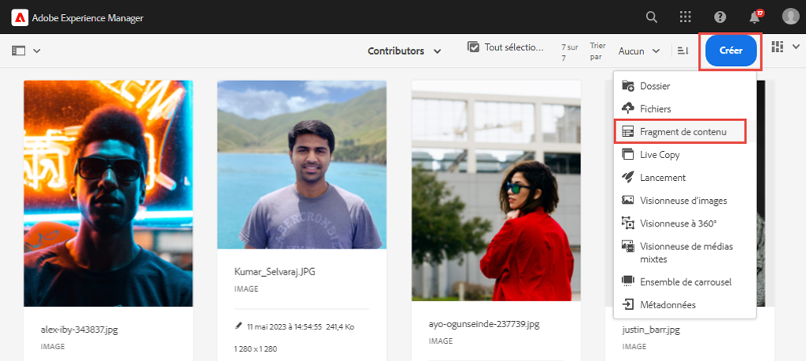
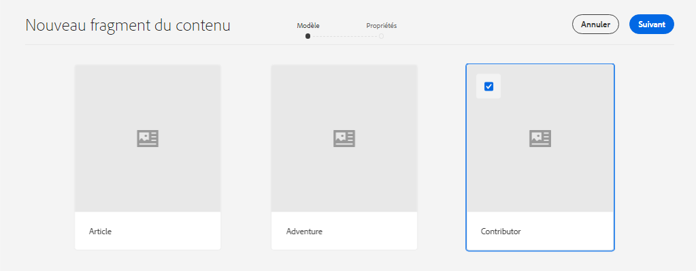
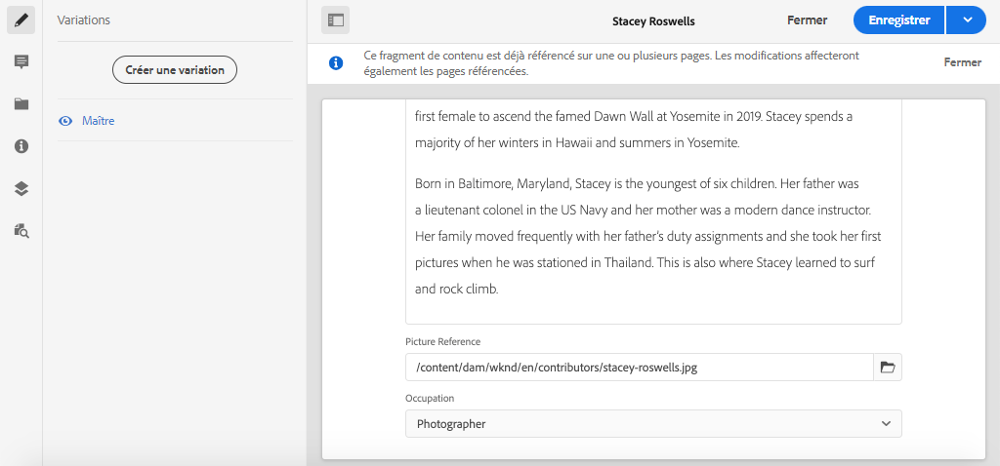
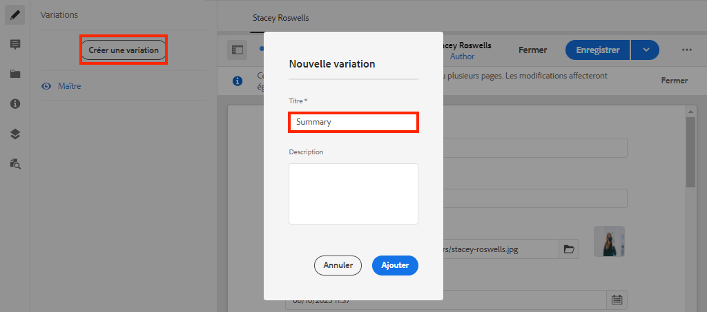
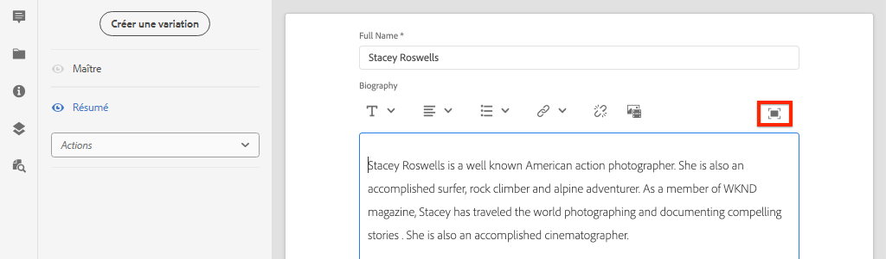
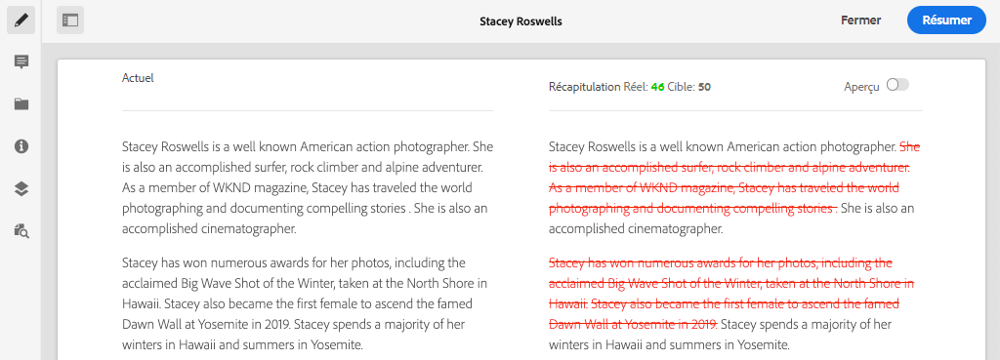
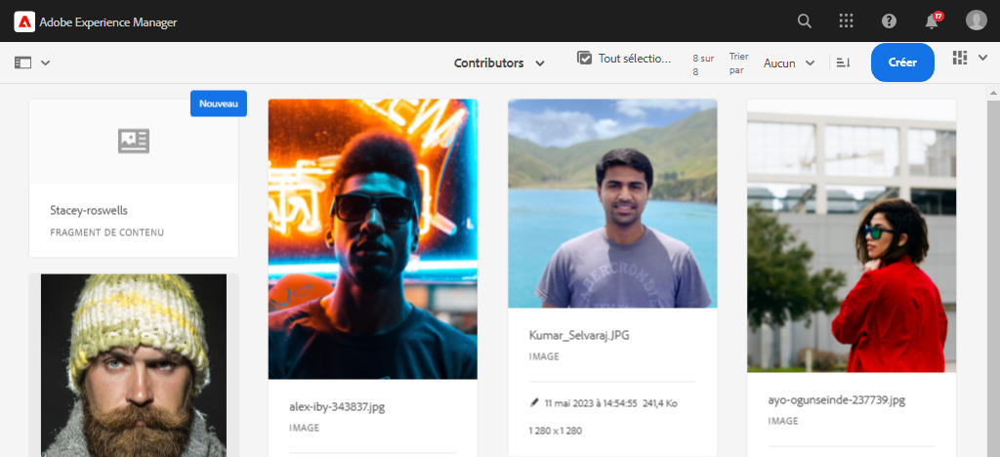

# Créer un fragment de contenu {#authoring-content-fragments}

Dans ce chapitre, vous allez créer et modifier un fragment de contenu en fonction du [nouveau modèle de fragment de contenu du contributeur](./content-fragment-models.md). Vous apprendrez également à créer des variantes de fragments de contenu.

## Prérequis {#prerequisites}

Il s’agit d’un tutoriel en plusieurs parties qui suppose que les étapes décrites dans la section [Définition des modèles de fragment de contenu](./content-fragment-models.md) ont été terminées.

## Objectifs {#objectives}

* Création d’un fragment de contenu à partir d’un modèle de fragment de contenu
* Création d’une variation de fragment de contenu

## Présentation de la création de fragments de contenu {#overview}

>[!VIDEO](https://video.tv.adobe.com/v/22451/?quality=12&learn=on)

La vidéo ci-dessus donne un aperçu général de la création de fragments de contenu.

## Créer un fragment de contenu {#create-content-fragment}

Dans le chapitre précédent, [Définition des modèles de fragment de contenu](./content-fragment-models.md), un modèle **Contributeur** a été créé. Créez un fragment de contenu à l’aide de ce modèle.

1. Dans le menu **AEM Démarrer** accédez à **Ressources** > **Fichiers**.
1. Cliquez dans les dossiers pour accéder à **Site WKND** > **Anglais** > **Contributeurs**. Ce dossier contient une liste de captures d’écran pour les contributeurs de la marque WKND.

1. Cliquez sur **Créer** en haut à droite et sélectionnez **Fragment de contenu** :

   

1. Sélectionnez le modèle **Contributor** et cliquez sur **Suivant**.

   

   Il s’agit du même modèle **Contributor** qui a été créé dans le chapitre précédent.

1. Saisissez **Stacey Roswells** pour le titre, puis cliquez sur **Créer**.
1. Cliquez sur **Ouvrir** dans la boîte de dialogue **Succès** pour ouvrir le fragment nouvellement créé.

   

   Notez que les champs définis par le modèle sont désormais disponibles pour créer cette instance du fragment de contenu.

1. Pour **Nom complet**, saisissez : **Stacey Roswells**.
1. Pour **Biographie**, saisissez une brève biographie. Besoin d&#39;inspiration ? N’hésitez pas à réutiliser ce [fichier texte](assets/author-content-fragments/stacey-roswells-bio.txt).
1. Pour **Référence de l’image** cliquez sur l’icône **dossier** et accédez à **Site WKND** > **Anglais** > **Contributeurs** > **stacey-roswells.jpg** Cela évalue le chemin d’accès : `/content/dam/wknd/en/contributors/stacey-roswells.jpg`.
1. Pour **Profession** choisissez **Photographe**.

   

1. Cliquez sur **Enregistrer** pour enregistrer les modifications.

## Création d’une variation de fragment de contenu

Tous les fragments de contenu commencent par une variation **Principal**. La variante **Principal** peut être considérée comme le contenu *default* du fragment et est automatiquement utilisée lorsque le contenu est exposé via les API GraphQL. Il est également possible de créer des variantes d’un fragment de contenu. Cette fonctionnalité offre une flexibilité supplémentaire pour concevoir une mise en oeuvre.

Des variations peuvent être utilisées pour cibler des canaux spécifiques. Par exemple, une variante **mobile** peut être créée qui contient une plus petite quantité de texte ou référence une image spécifique au canal. L’utilisation des variations dépend réellement de l’implémentation. Comme toute fonctionnalité, une planification minutieuse doit être effectuée avant l’utilisation.

Créez ensuite une nouvelle variation pour avoir une idée des fonctionnalités disponibles.

1. Ouvrez à nouveau le **fragment de contenu Stacey Roswells**.
1. Dans le rail latéral gauche, cliquez sur **Créer une variation**.
1. Dans le modal **New Variation** , saisissez le titre **Summary**.

   

1. Cliquez dans le champ **Biographie** multiligne et cliquez sur le bouton **Développer** pour saisir la vue plein écran du champ multiligne.

   

1. Cliquez sur **Résumer le texte** dans le menu supérieur droit.

1. Saisissez une **cible** de **50** mots et cliquez sur **Démarrer**.

   

   Une prévisualisation de synthèse s’ouvre alors. AEM responsable du traitement de la langue de la machine tentera de résumer le texte en fonction du nombre de mots cible. Vous pouvez également sélectionner différentes phrases à supprimer.

1. Cliquez sur **Résumer** lorsque la synthèse vous convient. Cliquez dans le champ de texte multiligne et faites basculer le bouton **Développer** pour revenir à la vue principale.

1. Cliquez sur **Enregistrer** pour enregistrer les modifications.

## Création d’un fragment de contenu supplémentaire

Répétez les étapes décrites dans la section [Création d’un fragment de contenu](#create-content-fragment) pour créer un **contributeur** supplémentaire. Il sera utilisé dans le chapitre suivant comme exemple de requête de plusieurs fragments.

1. Dans le dossier **Contributeurs** , cliquez sur **Créer** dans le coin supérieur droit et sélectionnez **Fragment de contenu** :
1. Sélectionnez le modèle **Contributor** et cliquez sur **Suivant**.
1. Saisissez **Jacob Wester** pour le titre, puis cliquez sur **Créer**.
1. Cliquez sur **Ouvrir** dans la boîte de dialogue **Succès** pour ouvrir le fragment nouvellement créé.
1. Pour **Nom complet**, saisissez : **Jacob Wester**.
1. Pour **Biographie**, saisissez une brève biographie. Besoin d&#39;inspiration ? N’hésitez pas à réutiliser ce [fichier texte](assets/author-content-fragments/jacob-wester.txt).
1. Pour **Référence de l’image** cliquez sur l’icône **dossier** et accédez à **Site WKND** > **Anglais** > **Contributeurs** > **jacob_wester.jpg** Cela évalue le chemin d’accès : `/content/dam/wknd/en/contributors/jacob_wester.jpg`.
1. Pour **Profession** choisissez **Écrivain**.
1. Cliquez sur **Enregistrer** pour enregistrer les modifications. Il n’est pas nécessaire de créer une variation, sauf si vous le souhaitez.

   

   Vous devez maintenant avoir deux fragments **Contributeurs**.

## Félicitations !  {#congratulations}

Félicitations, vous venez de créer plusieurs fragments de contenu et d’en créer une variante.

## Étapes suivantes {#next-steps}

Dans le chapitre suivant, [Explore GraphQL APIs](explore-graphql-api.md), vous allez explorer AEM API GraphQL à l’aide de l’outil GraphQL intégré. Découvrez comment AEM génère automatiquement un schéma GraphQL basé sur un modèle de fragment de contenu. Vous allez expérimenter la création de requêtes de base en utilisant la syntaxe GraphQL.