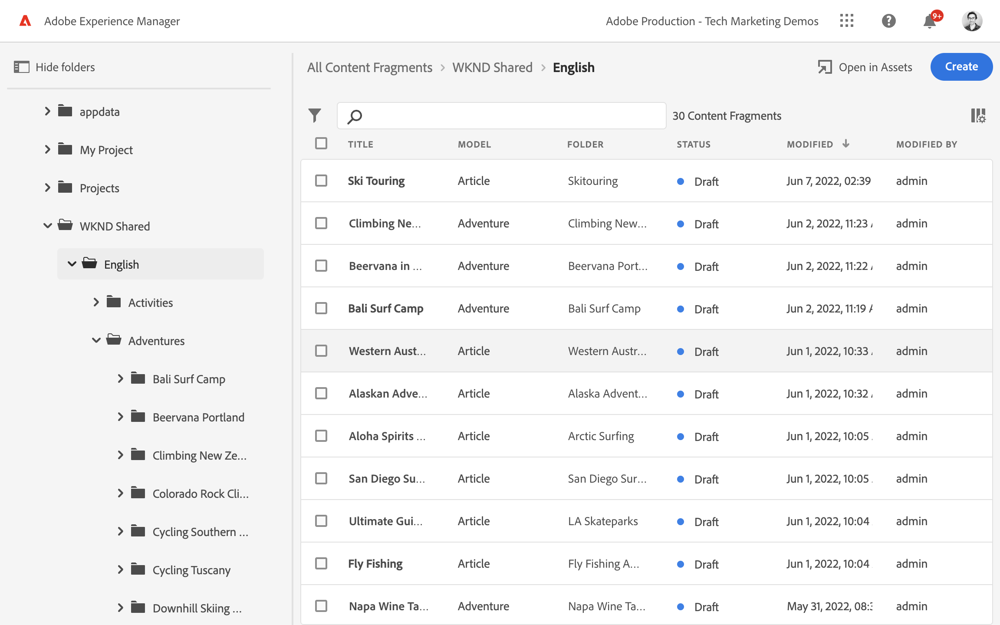

# Création de fragments de contenu {#authoring-content-fragments}

Dans ce chapitre, vous allez créer et modifier un fragment de contenu en fonction du [modèle de fragment de contenu nouvellement défini](./content-fragment-models.md). Vous apprendrez également à créer des variantes de fragments de contenu.

## Prérequis {#prerequisites}

Il s’agit d’un tutoriel en plusieurs parties qui suppose que les étapes décrites dans la section [Définition de modèles de fragment de contenu](./content-fragment-models.md) ont été terminées.

## Objectifs {#objectives}

* Création d’un fragment de contenu à partir d’un modèle de fragment de contenu
* Création d’une variation de fragment de contenu

## Création d’un dossier de ressources

Les fragments de contenu sont stockés dans des dossiers dans AEM Assets. Pour créer des fragments de contenu à partir des modèles créés dans le chapitre précédent, un dossier doit être créé pour les stocker. Une configuration est requise sur le dossier pour permettre la création de fragments à partir de modèles spécifiques.

1. Dans l’écran AEM Démarrer , accédez à **Ressources** > **Fichiers**.

   

1. Appuyer **Créer** dans le coin et appuyez sur **Dossier**. Dans la boîte de dialogue qui s’affiche, saisissez :

   * Titre* : **Mon projet**
   * Nom : **my-project**

   

1. Sélectionnez la **Mon dossier** dossier et appuyez sur **Propriétés**.

   

1. Appuyez sur le bouton **Cloud Services** . Sous **Configuration du cloud** utilisez l’outil de recherche de chemin pour sélectionner la variable **Mon projet** configuration. La valeur doit être `/conf/my-project`.

   

   La définition de cette propriété permet la création de fragments de contenu à l’aide des modèles créés dans le chapitre précédent.

1. Appuyez sur le bouton **Stratégies** . Sous **Modèles de fragment de contenu autorisés** utilisez l’outil de recherche de chemin pour sélectionner la variable **Personne** et **Équipe** modèle créé précédemment.

   

   Ces stratégies seront automatiquement héritées par tous les sous-dossiers et peuvent être remplacées. Notez que vous pouvez également autoriser les modèles par balises ou activer les modèles à partir d’autres configurations de projet (comme WKND Shared). Ce mécanisme permet de gérer efficacement votre hiérarchie de contenu.

1. Appuyer **Enregistrer et fermer** pour enregistrer les modifications apportées aux propriétés du dossier.

1. Naviguez dans le **Mon projet** dossier.

1. Créez un autre dossier avec les valeurs suivantes :

   * Titre* : **Anglais**
   * Nom : **en**

   Il est recommandé de configurer des projets pour une prise en charge multilingue. Voir [la page de documents suivante pour plus d’informations ;](https://experienceleague.adobe.com/docs/experience-manager-cloud-service/content/assets/admin/translate-assets.html).

## Création d’un fragment de contenu {#create-content-fragment}

Plusieurs fragments de contenu seront ensuite créés en fonction de la variable **Équipe** et **Personne** modèles.

1. Dans l’AEM écran de démarrage, appuyez sur **Fragments de contenu** pour ouvrir l’interface utilisateur Fragments de contenu.

   

1. Dans le rail de gauche, développez **Mon projet** et appuyez sur **Anglais**.
1. Appuyer **Créer** pour afficher le **Nouveau fragment de contenu** et saisissez les valeurs suivantes :

   * Emplacement: `/content/dam/my-project/en`
   * Modèle de fragment de contenu : **Personne**
   * Titre : **John Doe**
   * Nom : `john-doe`

   
1. Appuyez sur **Créer**.
1. Répétez les étapes ci-dessus pour créer un fragment représentant **Alison Smith**:

   * Emplacement: `/content/dam/my-project/en`
   * Modèle de fragment de contenu : **Personne**
   * Titre : **Alison Smith**
   * Nom : `alison-smith`

   Appuyer **Créer** pour créer le fragment Personne.

1. Répétez ensuite les étapes pour créer une nouvelle **Équipe** fragment représentant **Equipe Alpha**:

   * Emplacement: `/content/dam/my-project/en`
   * Modèle de fragment de contenu : **Équipe**
   * Titre : **Equipe Alpha**
   * Nom : `team-alpha`

   Appuyer **Créer** pour créer le fragment Équipe.

1. Il doit désormais y avoir trois fragments de contenu sous **Mon projet** > **Anglais**:

   

## Modifier des fragments de contenu de personne {#edit-person-content-fragments}

Remplissez ensuite les fragments nouvellement créés avec des données.

1. Cochez la case en regard de **John Doe** et appuyez sur **Ouvrir**.

   

1. L’éditeur de fragment de contenu contient un formulaire basé sur le modèle de fragment de contenu. Renseignez les différents champs pour ajouter du contenu au **John Doe** fragment. Pour l’image de profil, n’hésitez pas à choisir l’une des images dans WKND Partagé ou à télécharger votre propre image sur AEM Assets.

   

1. Ensuite, appuyez sur **Créer une variation** dans le rail de gauche. Dans la boîte de dialogue, ajoutez un type dans **Alternate** pour le nom de la variation.

1. Modifiez certains des éléments de la fonction **Alternate** variation.

   

   La fonction de variation permet aux auteurs de créer différentes versions d’un même fragment de contenu. Vous pouvez l’utiliser pour fournir une version récapitulative d’un article de longue forme. Par défaut, une seule **Principal** est créée. Les éléments de champ de texte multiligne d’une variation peuvent être synchronisés avec la variation principale.

1. Appuyer **Enregistrer et fermer** pour enregistrer les modifications apportées au fragment John Doe.
1. Revenez à l’interface utilisateur Fragment de contenu et ouvrez le **Alison Smith** pour modification.
1. Répétez les étapes ci-dessus pour renseigner la variable **Alison Smith** fragment avec du contenu.

## Modifier le fragment de contenu de l’équipe {#edit-team-content-fragment}

1. Ouvrez le **Equipe Alpha** Fragment de contenu à l’aide de l’interface utilisateur Fragment de contenu.
1. Renseignez les champs de **Titre**, **Nom court**, et **Description**.
1. Sélectionnez la **John Doe** et **Alison Smith** Fragments de contenu pour renseigner la variable **Membres de l’équipe** field :

   

   >[!NOTE]
   >
   >Vous pouvez également créer des fragments de contenu en ligne à l’aide de la méthode **Nouveau fragment de contenu** bouton .

1. Appuyer **Enregistrer et fermer** pour enregistrer les modifications apportées au fragment Team Alpha.

## Exploration des fragments de contenu WKND (facultatif) {#explore-wknd-content-fragments}

Si vous [Installation de l’exemple de contenu partagé WKND](./overview.md#install-sample-content) vous pouvez examiner les fragments de contenu pour les modèles Aventures, Articles et Auteurs afin d’obtenir plus d’idées sur la création de contenu.

## Félicitations ! {#congratulations}

Félicitations, vous venez de créer plusieurs fragments de contenu et d’en créer une variante.

## Étapes suivantes {#next-steps}

Dans le chapitre suivant, [Exploration des API GraphQL](explore-graphql-api.md), vous allez explorer AEM API GraphQL à l’aide de l’outil GraphQL intégré. Découvrez comment AEM génère automatiquement un schéma GraphQL basé sur un modèle de fragment de contenu. Vous allez expérimenter la création de requêtes de base en utilisant la syntaxe GraphQL.

## Documentation connexe

* [Gestion des fragments de contenu](https://experienceleague.adobe.com/docs/experience-manager-cloud-service/content/assets/content-fragments/content-fragments-managing.html)
* [Variations – création de contenu de fragment](https://experienceleague.adobe.com/docs/experience-manager-cloud-service/content/assets/content-fragments/content-fragments-variations.html)
