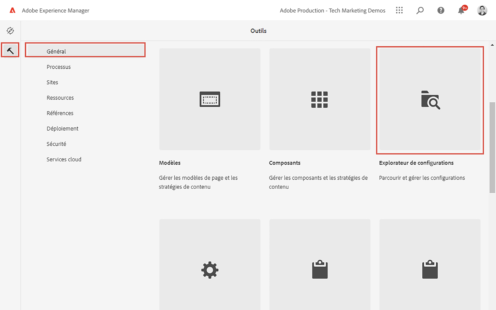
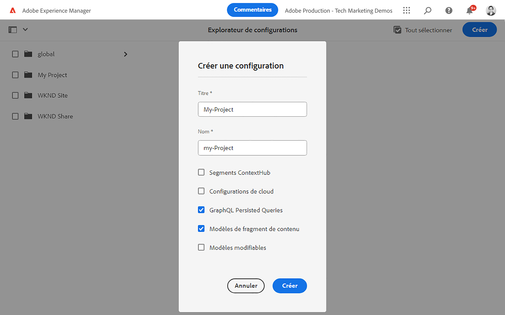
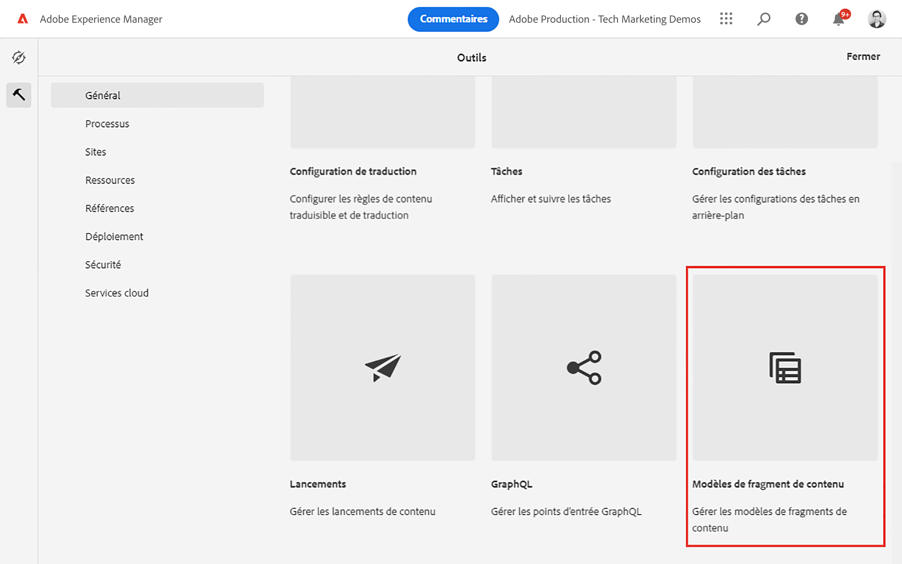
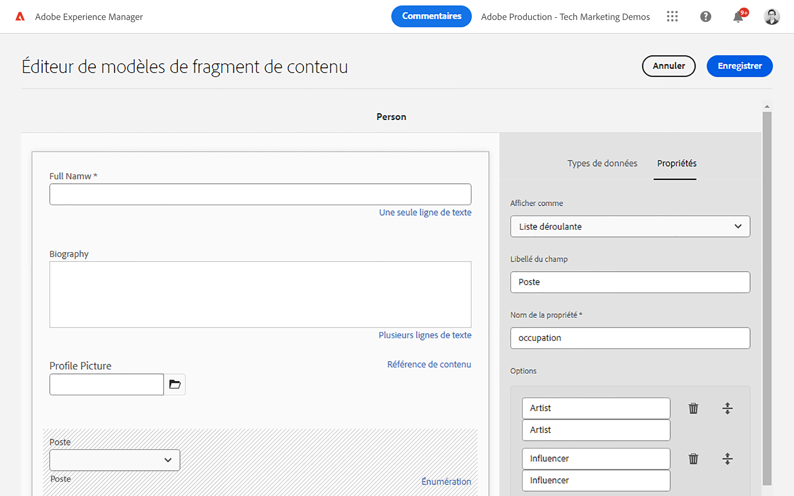
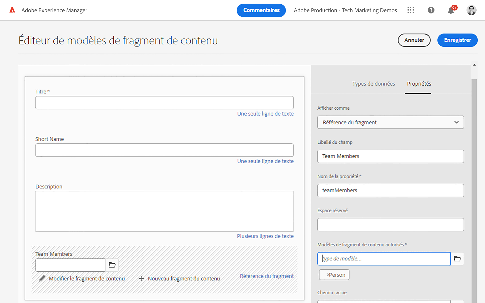
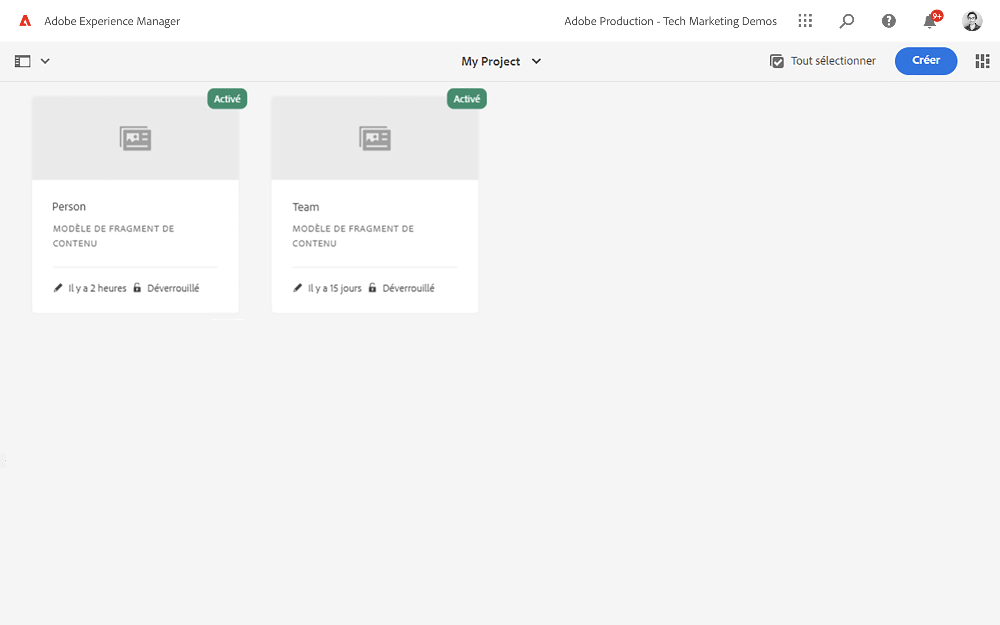
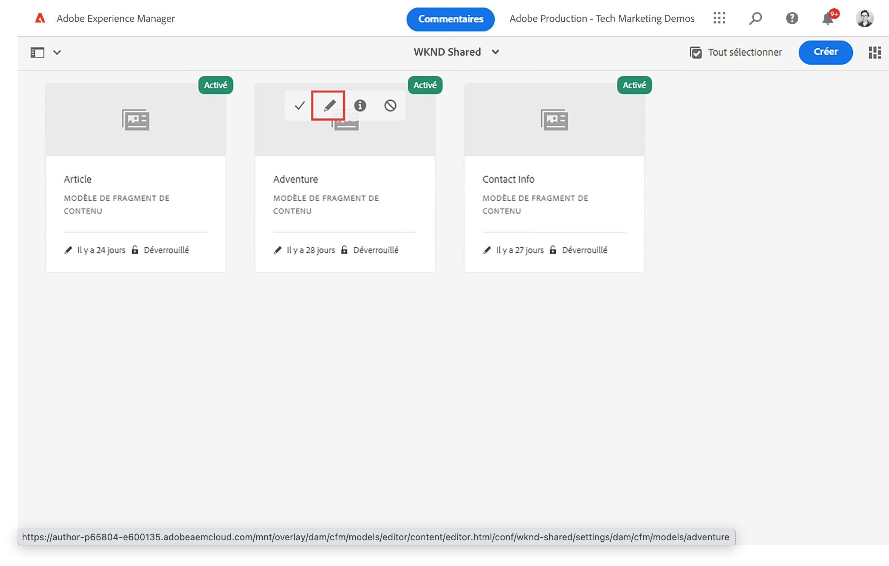

# Définition de modèles de fragment de contenu {#content-fragment-models}

Dans ce chapitre, apprenez à modéliser du contenu et à créer un schéma avec **Modèles de fragment de contenu**. Vous découvrirez les différents types de données qui peuvent être utilisés pour définir un schéma dans le cadre du modèle.

Dans ce chapitre, deux modèles simples seront créés, **Équipe** et **Personne**. Le **Équipe** Le modèle de données a un nom, un nom court et une description, et fait référence au **Personne** modèle de données, qui comprend le nom complet, les détails biographiques, l’image de profil et la liste des métiers.

Vous êtes également invité à créer votre propre modèle en suivant les étapes de base et à ajuster les étapes respectives telles que les requêtes GraphQL et le code de l’application React, ou à suivre simplement les étapes décrites dans ces chapitres.

## Prérequis {#prerequisites}

Il s’agit d’un tutoriel en plusieurs parties qui suppose qu’un [AEM environnement de création est disponible](./overview.md#prerequisites) et éventuellement la variable [L’exemple de contenu partagé WKND a été installé.](./overview.md#install-sample-content).

## Objectifs {#objectives}

* Créez un modèle de fragment de contenu.
* Identifiez les types de données disponibles et les options de validation pour la création de modèles.
* Comprendre comment le modèle de fragment de contenu définit **both** le schéma de données et le modèle de création d’un fragment de contenu.

## Création d’une configuration de projet

Une configuration de projet contient tous les modèles de fragment de contenu associés à un projet particulier et permet d’organiser les modèles. Au moins un projet doit être créé **before** création d’un modèle de fragment de contenu.

1. Connexion à l’AEM **Auteur** environnement.
1. Dans l’écran AEM Démarrer, accédez à **Outils** > **Général** > **Explorateur de configuration**.

   
1. Cliquez sur **Créer**.
1. Dans la boîte de dialogue qui s’affiche, saisissez :

   * Titre* : **Mon projet**
   * Nom* : **my-project** (préférez utiliser toutes les minuscules avec des tirets pour séparer les mots. Cette chaîne influera sur le point d’entrée GraphQL unique sur lequel les applications clientes effectueront des requêtes.)
   * Vérifier **Modèles de fragment de contenu**
   * Vérifier **Requêtes persistantes GraphQL**

   

## Créer des modèles de fragment de contenu

Créez ensuite deux modèles pour un **Équipe** et un **Personne**.

### Création d’un modèle de personne

Créez un modèle pour un **Personne**, qui est le modèle de données représentant une personne faisant partie d’une équipe.

1. Dans l’écran AEM Démarrer, accédez à **Outils** > **Général** > **Modèles de fragment de contenu**.

   

   Si vous avez installé le [exemple de contenu](overview.md#install-sample-content) vous verrez alors deux dossiers : **Mon projet** et **WKND partagé**.
1. Accédez au **Mon projet** dossier.
1. Appuyer **Créer** dans le coin supérieur droit pour afficher le **Créer un modèle** assistant.
1. Pour **Titre du modèle** enter : **Personne** et appuyez sur **Créer**.

   Appuyer **Ouvrir** dans la boîte de dialogue qui s’affiche, pour ouvrir le modèle nouvellement créé.

1. Faites glisser et déposez un **Texte sur une seule ligne** sur le panneau principal. Renseignez les propriétés suivantes sur le **Propriétés** tab :

   * **Libellé du champ**: **Nom complet**
   * **Nom de la propriété**: `fullName`
   * Vérifier **Obligatoire**

   

   Le **Nom de la propriété** définit le nom de la propriété qui est conservée dans AEM. Le **Nom de la propriété** définit également la variable **key** nom de cette propriété dans le cadre du schéma de données. Ceci **key** sera utilisé lorsque les données de fragment de contenu sont exposées via les API GraphQL.

1. Appuyez sur le bouton **Types de données** et effectuez un glisser-déposer d’un élément **Texte multi-lignes** sous le champ **Nom complet** champ . Renseignez les propriétés suivantes :

   * **Libellé du champ**: **Biographie**
   * **Nom de la propriété**: `biographyText`
   * **Type par défaut**: **Texte enrichi**

1. Cliquez sur le bouton **Types de données** et effectuez un glisser-déposer d’un élément **Référence de contenu** champ . Renseignez les propriétés suivantes :

   * **Libellé du champ**: **Image de profil**
   * **Nom de la propriété**: `profilePicture`
   * **Chemin racine**: `/content/dam`

   Lors de la configuration de la variable **Chemin racine** vous pouvez cliquer sur le bouton **folder** pour afficher un modal afin de sélectionner le chemin. Cela permet de restreindre les dossiers que les auteurs peuvent utiliser pour renseigner le chemin. `/content/dam` est la racine dans laquelle sont stockées toutes les ressources AEM (images, vidéos et autres fragments de contenu).

1. Ajoutez une validation au **Référence d’image** de sorte que seuls les types de contenu de **Images** peut être utilisé pour remplir le champ.

   

1. Cliquez sur le bouton **Types de données** et effectuez un glisser-déposer d’un élément **Énumération**  type de données sous le **Référence d’image** champ . Renseignez les propriétés suivantes :

   * **Render As**: **Cases à cocher**
   * **Libellé du champ**: **Profession**
   * **Nom de la propriété**: `occupation`

1. Ajouter plusieurs **Options** en utilisant la variable **Ajouter une option** bouton . Utiliser la même valeur pour **Étiquette d’option** et **Valeur de l’option**:

   **Artiste**, **Influenceur**, **Photographe**, **Voyageur**, **Écrivain**, **YouTuber**

1. La finale **Personne** modèle doit se présenter comme suit :

   

1. Cliquez sur **Enregistrer** pour enregistrer les modifications.

### Création du modèle d’équipe

Créez un modèle pour un **Équipe**, qui est le modèle de données d’une équipe de personnes. Le modèle d’équipe fait référence au modèle Personne pour représenter les membres de l’équipe.

1. Dans le **Mon projet** dossier, appuyez sur **Créer** dans le coin supérieur droit pour afficher le **Créer un modèle** assistant.
1. Pour **Titre du modèle** enter : **Équipe** et appuyez sur **Créer**.

   Appuyer **Ouvrir** dans la boîte de dialogue qui s’affiche, pour ouvrir le modèle nouvellement créé.

1. Faites glisser et déposez un **Texte sur une seule ligne** sur le panneau principal. Renseignez les propriétés suivantes sur le **Propriétés** tab :

   * **Libellé du champ**: **Titre**
   * **Nom de la propriété**: `title`
   * Vérifier **Obligatoire**

1. Appuyez sur le bouton **Types de données** et effectuez un glisser-déposer d’un élément **Texte sur une seule ligne** sur le panneau principal. Renseignez les propriétés suivantes sur le **Propriétés** tab :

   * **Libellé du champ**: **Nom court**
   * **Nom de la propriété**: `shortName`
   * Vérifier **Obligatoire**
   * Vérifier **Unique**
   * Sous **Type de validation** > choisissez **Personnalisé**
   * Sous **Regex de validation personnalisé** > entrer `^[a-z0-9\-_]{5,40}$` : cette opération garantit que seules les valeurs alphanumériques en minuscules et les tirets compris entre 5 et 40 caractères peuvent être saisis.

   Le `shortName` nous offre un moyen d’interroger une équipe en fonction d’un chemin raccourci. Le **Unique** garantit que la valeur sera toujours unique par fragment de contenu de ce modèle.

1. Appuyez sur le bouton **Types de données** et effectuez un glisser-déposer d’un élément **Texte multi-lignes** sous le champ **Nom court** champ . Renseignez les propriétés suivantes :

   * **Libellé du champ**: **Description**
   * **Nom de la propriété**: `description`
   * **Type par défaut**: **Texte enrichi**

1. Cliquez sur le bouton **Types de données** et effectuez un glisser-déposer d’un élément **Référence de fragment** champ . Renseignez les propriétés suivantes :

   * **Render As**: **Champ multiple**
   * **Libellé du champ**: **Membres de l’équipe**
   * **Nom de la propriété**: `teamMembers`
   * **Modèles de fragment de contenu autorisés**: Utilisez l’icône de dossier pour sélectionner la variable **Personne** modèle.

1. La finale **Équipe** modèle doit se présenter comme suit :

   

1. Cliquez sur **Enregistrer** pour enregistrer les modifications.

1. Vous devez maintenant utiliser deux modèles :

   

## Inspect des modèles de fragment de contenu WKND (facultatif)

Si vous [Installation de l’exemple de contenu partagé WKND](./overview.md#install-sample-content) vous pouvez parcourir les modèles Adventure, Article et Auteur pour obtenir plus d’idées sur les techniques de modélisation des données.

1. Dans la **AEM** Accédez à **Outils** > **Général** > **Modèles de fragment de contenu**.

1. Accédez au **WKND partagé** et vous devriez voir trois modèles : Article, aventure et auteur.

1. Inspect les modèles en survolant la carte et en appuyant sur l’icône de modification (crayon)

   

1. Cela ouvre la fenêtre **Éditeur de modèle de fragment de contenu** pour le modèle et vous pouvez examiner les différents types de données utilisés.

   >[!CAUTION]
   >
   > Modification du modèle **after** Les fragments de contenu ont été créés, ont des effets en aval. Les valeurs de champ des fragments existants ne sont plus référencées et le schéma de données exposé par GraphQL change, ce qui affecte les applications existantes.

## Félicitations ! {#congratulations}

Félicitations, vous venez de créer vos premiers modèles de fragments de contenu !

## Étapes suivantes {#next-steps}

Dans le chapitre suivant, [Création de modèles de fragment de contenu](author-content-fragments.md), vous allez créer et modifier un fragment de contenu en fonction d’un modèle de fragment de contenu. Vous apprendrez également à créer des variantes de fragments de contenu.

## Documentation connexe

* [Modèles de fragment de contenu](https://experienceleague.adobe.com/docs/experience-manager-cloud-service/content/assets/content-fragments/content-fragments-models.html)

