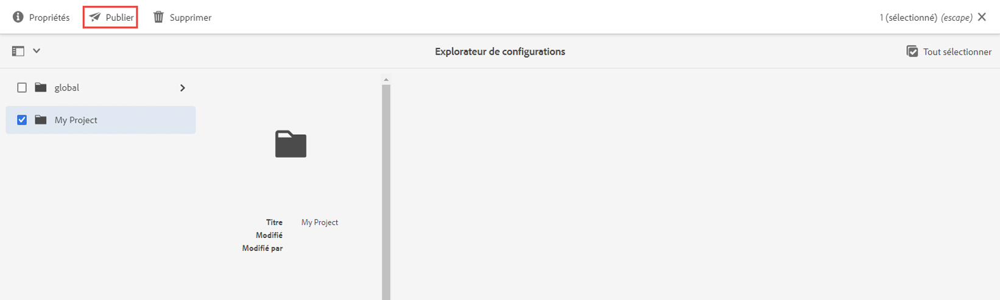
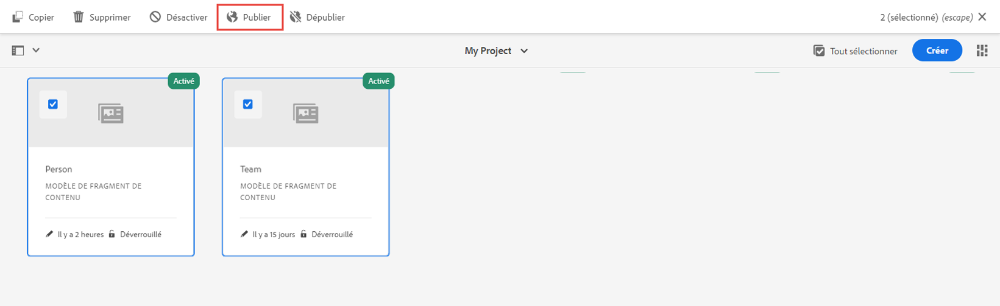

# Définir des modèles de fragment de contenu {#content-fragment-models}

Dans ce chapitre, découvrez comment modéliser du contenu et créer un schéma avec les **Modèles de fragment de contenu**. Vous découvrez les différents types de données qui peuvent être utilisés pour définir un schéma faisant partie du modèle.

Nous créons deux modèles simples, **Équipe** et **Personne**. Le modèle de données **Équipe** a un nom, un nom court et une description. Il fait référence au modèle de données **Personne** qui comporte un nom complet, des détails biographiques, une image de profil et la liste des professions.

Nous vous invitons également à créer votre propre modèle en suivant les étapes de base et à ajuster les étapes respectives telles que les requêtes GraphQL et le code de l’application React, ou à suivre simplement les étapes décrites dans ces chapitres.

## Prérequis {#prerequisites}

Il s’agit d’un tutoriel en plusieurs parties qui suppose qu’un [environnement de création AEM est disponible](./overview.md#prerequisites).

## Objectifs {#objectives}

* Créer un modèle de fragment de contenu.
* Identifier les types de données disponibles et les options de validation pour la création de modèles.
* Comprendre comment le modèle de fragment de contenu définit **à la fois** le schéma de données et le modèle de création d’un fragment de contenu.

## Créer une configuration de projet

Une configuration de projet contient tous les modèles de fragment de contenu associés à un projet particulier et permet d’organiser les modèles. Au moins un projet doit être créé **avant** la création d’un modèle de fragment de contenu.

1. Connectez-vous à l’environnement de **création** AEM (ex. `https://author-pYYYY-eXXXX.adobeaemcloud.com/`).
1. Dans l’écran de démarrage d’AEM, accédez à **Outils** > **Général** > **Explorateur de configurations**.

   
1. Cliquez sur **Créer**, dans le coin supérieur droit.
1. Dans la boîte de dialogue qui s’affiche, saisissez :

   * Titre* : **Mon projet**
   * Nom* : **mon-projet** (préférez des minuscules et des tirets pour séparer les mots. Cette chaîne influence le point d’entrée GraphQL unique sur lequel les applications clientes effectuent des requêtes.)
   * Cochez **Modèles de fragment de contenu**.
   * Cochez **Requêtes persistantes GraphQL**.

   

## Créer des modèles de fragment de contenu

Créez ensuite deux modèles pour une **Équipe** et un **Personne**.

### Créer le modèle de personne

Créez un modèle pour une **Personne**, c’est-à-dire le modèle de données représentant une personne faisant partie d’une équipe.

1. Dans l’écran de démarrage d’AEM, accédez à **Outils** > **Général** > **Modèles de fragment de contenu**.

   

1. Accédez au dossier **Mon projet**.
1. Appuyez sur **Créer** dans le coin supérieur droit pour afficher l’assistant **Créer un modèle**.
1. Dans le champ **Titre du modèle**, saisissez **Personne** et appuyez sur **Créer**. Dans la boîte de dialogue qui s’affiche, appuyez sur **Ouvrir** pour créer le modèle.

1. Faites glisser et déposez un élément **texte monoligne** sur le panneau principal. Saisissez les propriétés suivantes dans l’onglet **Propriétés** :

   * **Libellé du champ** : **Nom complet**
   * **Nom de la propriété** : `fullName`.
   * Cochez **Obligatoire**.

   

   Le **Nom de la propriété** définit le nom de la propriété conservée dans AEM. Le **Nom de la propriété** définit également le nom de **clé** de cette propriété dans le cadre du schéma de données. Cette **clé** est utilisée lorsque les données de fragment de contenu sont exposées via les API GraphQL.

1. Appuyez sur l’onglet **Types de données** et effectuez un glisser-déposer d’un champ **Texte multiligne** sous le champ **Nom complet**. Saisissez les propriétés suivantes :

   * **Libellé du champ** : **Biographie**
   * **Nom de la propriété** : `biographyText`.
   * **Type par défaut** : **Texte enrichi**

1. Cliquez sur l’onglet **Types de données** et effectuez un glisser-déposer d’un champ **Référence de contenu**. Saisissez les propriétés suivantes :

   * **Libellé du champ** : **Image de profil**
   * **Nom de la propriété** : `profilePicture`.
   * **Chemin d’accès racine** : `/content/dam`.

   Lors de la configuration du **chemin d’accès racine**, vous pouvez cliquer sur l’icône **dossier** pour afficher une boîte de dialogue modale afin de sélectionner le chemin d’accès. Cela limite les dossiers que les créateurs et créatrices peuvent utiliser pour renseigner le chemin d’accès. `/content/dam` est la racine dans laquelle sont stockées toutes les ressources d’AEM Assets (images, vidéos et autres fragments de contenu).

1. Ajoutez une validation à la **Référence d’image** de sorte que seuls les types de contenu d’**images** puissent être utilisés pour renseigner le champ.

   

1. Cliquez sur l’onglet **Types de données** et effectuez un glisser-déposer d’un type de données d’**énumération** sous le champ **Référence d’image**. Saisissez les propriétés suivantes :

   * **Rendre en tant que** : **Cases à cocher**
   * **Libellé du champ** : **Profession**
   * **Nom de la propriété** : `occupation`.

1. Ajoutez plusieurs **options** à l’aide du bouton **Ajouter une option**. Utilisez la même valeur pour le **libellé de l’option** et la **valeur de l’option** :

   **Artiste**, **influenceur ou influenceuse**, **photographe**, **voyageur ou voyageuse**, **écrivain ou écrivaine**, **YouTuber ou YouTubeuse**.

1. Le modèle de **personne** final doit se présenter comme suit :

   

1. Cliquez sur **Enregistrer** pour enregistrer les modifications.

### Créer le modèle d’équipe

Créez un modèle pour une **équipe**, qui est le modèle de données d’une équipe de personnes. Le modèle d’équipe référence le modèle de personne représentant les personnes membres de l’équipe.

1. Dans le dossier **Mon projet**, appuyez sur **Créer** dans le coin supérieur droit pour afficher l’assistant **Créer un modèle**.
1. Dans le champ **Titre du modèle**, saisissez **Équipe** et appuyez sur **Créer**.

   Appuyez sur **Ouvrir** dans la boîte de dialogue qui s’affiche pour ouvrir le modèle nouvellement créé.

1. Effectuez un glisser-déposer d’un élément de **texte monoligne** sur le panneau principal. Renseignez les propriétés suivantes sur l’onglet **Propriétés** :

   * **Libellé du champ** : **Titre**
   * **Nom de la propriété** : `title`.
   * Cochez **Obligatoire**.

1. Appuyez sur l’onglet **Types de données** et effectuez un glisser-déposer d’un élément de **texte monoligne** sur le panneau principal. Renseignez les propriétés suivantes sur l’onglet **Propriétés** :

   * **Libellé du champ** : **Nom court**
   * **Nom de la propriété** : `shortName`.
   * Cochez **Obligatoire**.
   * Cochez **Unique**.
   * Sous **Type de validation**, choisissez **Personnalisé**.
   * Sous **Expression régulière de validation personnalisée**, saisissez `^[a-z0-9\-_]{5,40}$` de sorte que seules les valeurs alphanumériques en minuscules et les tirets puissent être saisis, dans une limite de 5 à 40 caractères.

   La propriété `shortName` nous permet d’interroger une équipe individuelle en fonction d’un chemin d’accès raccourci. Le paramètre **Unique** garantit que la valeur est toujours unique par fragment de contenu de ce modèle.

1. Appuyez sur l’onglet **Types de données** et effectuez un glisser-déposer d’un champ de **texte multiligne** sous le champ **Nom court**. Saisissez les propriétés suivantes :

   * **Libellé du champ** : **Description**
   * **Nom de la propriété** : `description`.
   * **Type par défaut** : **Texte enrichi**

1. Cliquez sur l’onglet **Types de données** et effectuez un glisser-déposer d’un champ **Référence de fragment**. Saisissez les propriétés suivantes :

   * **Rendre en tant que** : **Champ multiple**
   * **Libellé du champ** : **Membres de l’équipe**
   * **Nom de la propriété** : `teamMembers`.
   * **Modèles de fragment de contenu autorisés** : utilisez l’icône de dossier pour sélectionner le modèle de **personne**.

1. La modèle d’**équipe** final doit se présenter comme suit :

   

1. Cliquez sur **Enregistrer** pour enregistrer les modifications.

1. Vous devez maintenant pouvoir travailler avec deux modèles :

   

## Publier la configuration du projet et les modèles de fragment de contenu

Lors de la révision et de la vérification, publiez la `Project Configuration` et les `Content Fragment Model`.

1. Dans l’écran de démarrage d’AEM, accédez à **Outils** > **Général** > **Explorateur de configuration**.

1. Cochez la case en regard de **Mon projet** et appuyez sur **Publier**.

   

1. À partir de l’écran de démarrage d’AEM, accédez à **Outils** > **Général** > **Modèles de fragment de contenu**.

1. Accédez au dossier **Mon projet**.

1. Sélectionnez les modèles **Personne** et **Équipe**, puis cliquez sur **Publier**.

   

## Félicitations. {#congratulations}

Félicitations, vous venez de créer vos premiers modèles de fragments de contenu.

## Étapes suivantes {#next-steps}

Dans le chapitre suivant, [Créer des modèles de fragment de contenu](author-content-fragments.md), vous allez créer et modifier un fragment de contenu basé sur un modèle de fragment de contenu. Vous découvrirez également comment créer des variations de fragments de contenu.

## Documentation connexe

* [Modèles de fragment de contenu.](https://experienceleague.adobe.com/docs/experience-manager-cloud-service/content/assets/content-fragments/content-fragments-models.html?lang=fr)

