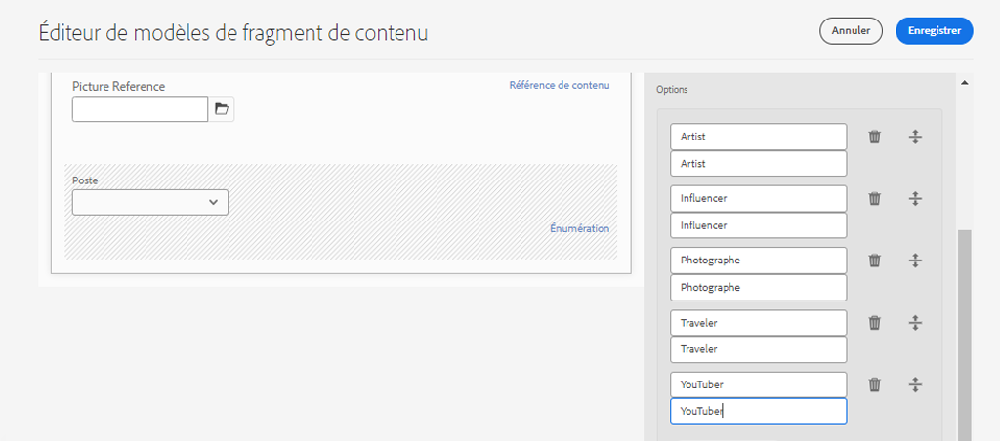

# Définition de modèles de fragment de contenu {#content-fragment-models}

Dans ce chapitre, apprenez à modéliser le contenu et à créer un schéma avec des **modèles de fragment de contenu**. Vous allez passer en revue les modèles existants et créer un nouveau modèle. Vous découvrirez également les différents types de données qui peuvent être utilisés pour définir un schéma dans le cadre du modèle.

Dans ce chapitre, vous allez créer un modèle pour un **contributeur**, qui est le modèle de données pour les utilisateurs qui créent du contenu de magazine et d’aventure dans le cadre de la marque WKND.

## Prérequis {#prerequisites}

Ce tutoriel en plusieurs parties est supposé que les étapes décrites dans la section [Configuration rapide](./setup.md) ont été terminées.

## Objectifs {#objectives}

* Créez un modèle de fragment de contenu.
* Identifiez les types de données disponibles et les options de validation pour la création de modèles.
* Découvrez comment le modèle de fragment de contenu définit **à la fois** le schéma de données et le modèle de création d’un fragment de contenu.

## Présentation du modèle de fragment de contenu {#overview}

>[!VIDEO](https://video.tv.adobe.com/v/22452/?quality=12&learn=on)

La vidéo ci-dessus donne un aperçu général de l’utilisation des modèles de fragment de contenu.

>[!CAUTION]
>
> La vidéo ci-dessus montre la création du modèle **Contributor** avec le nom `Contributors`. Lors de l’exécution des étapes dans votre propre environnement, assurez-vous que le titre utilise le formulaire unique : `Contributor` sans les **s**. Le nommage du modèle de fragment de contenu entraîne les appels d’API GraphQL qui seront effectués ultérieurement dans le tutoriel.

## Inspect : modèle de fragment de contenu d’aventure

Dans le chapitre précédent, plusieurs fragments de contenu avancés ont été édités et affichés sur une application externe. Examinons le modèle de fragment de contenu aventure pour comprendre le schéma de données sous-jacent de ces fragments.

1. Dans le menu **AEM Démarrer** accédez à **Outils** > **Ressources** > **Modèles de fragment de contenu**.

   

1. Accédez au dossier **WKND Site** et passez la souris sur le **modèle de fragment de contenu Adventure** et cliquez sur l’icône **Modifier** (crayon) pour ouvrir le modèle.

   

1. Cela ouvre l’**éditeur de modèle de fragment de contenu**. Notez que les champs définissent le modèle Adventure avec différents **types de données** comme **texte sur une seule ligne**, **texte sur plusieurs lignes**, **Énumération** et **Référence du contenu**.

1. La colonne de droite de l’éditeur répertorie les **types de données** disponibles qui définissent les champs de formulaire utilisés pour la création de fragments de contenu.

1. Sélectionnez le champ **Titre** dans le panneau principal. Dans la colonne de droite, cliquez sur l&#39;onglet **Propriétés** :

   

   Observez que le champ **Nom de la propriété** est défini sur `adventureTitle`. Cela définit le nom de la propriété qui est conservée dans AEM. **Nom de la propriété** définit également le nom **key** pour cette propriété dans le cadre du schéma de données. Cette **clé** sera utilisée lorsque les données de fragment de contenu sont exposées via les API GraphQL.

   >[!CAUTION]
   >
   > La modification du **nom de propriété** d’un champ **après** que les fragments de contenu sont dérivés du modèle, a des effets en aval. Les valeurs de champ des fragments existants ne sont plus référencées et le schéma de données exposé par GraphQL change, ce qui affecte les applications existantes.

1. Faites défiler l’écran vers le bas dans l’onglet **Propriétés** et affichez la liste déroulante **Type de validation**.

   

   Les validations de formulaire prêtes à l’emploi sont disponibles pour **E-mail** et **URL**. Il est également possible de définir une validation **personnalisée** à l’aide d’une expression régulière.

1. Cliquez sur **Annuler** pour fermer l’éditeur de modèle de fragment de contenu.

## Création d’un modèle de contributeur

Créez ensuite un modèle pour un **contributeur**, qui est le modèle de données pour les utilisateurs qui créent des contenus de magazine et d’aventure dans le cadre de la marque WKND.

1. Cliquez sur **Créer** dans le coin supérieur droit pour afficher l’assistant **Créer un modèle**.
1. Pour **Titre du modèle**, saisissez : **Contributeur** et cliquez sur **Créer**

   

   Cliquez sur **Ouvrir** pour ouvrir le modèle nouvellement créé.

1. Faites glisser un élément **Texte sur une seule ligne** vers le panneau principal. Renseignez les propriétés suivantes dans l&#39;onglet **Propriétés** :

   * **Libellé** du champ :  **Nom complet**
   * **Nom de la propriété**: `fullName`
   * Vérifiez **Obligatoire**

   

1. Cliquez sur l’onglet **Types de données** et faites glisser et déposez un champ **Texte multiligne** sous le champ **Nom complet**. Renseignez les propriétés suivantes :

   * **Libellé** du champ :  **Biographie**
   * **Nom de la propriété**: `biographyText`
   * **Type** par défaut :  **Texte enrichi**

1. Cliquez sur l’onglet **Types de données** et faites glisser et déposez un champ **Référence du contenu**. Renseignez les propriétés suivantes :

   * **Libellé** du champ :  **Référence d’image**
   * **Nom de la propriété**: `pictureReference`
   * **Chemin racine**: `/content/dam/wknd`

   Lors de la configuration de **Chemin racine**, vous pouvez cliquer sur l’icône **folder** pour afficher un modal afin de sélectionner le chemin. Cela permet de restreindre les dossiers que les auteurs peuvent utiliser pour renseigner le chemin.

   

1. Ajoutez une validation à la **Référence de l’image** afin que seuls les types de contenu **Images** puissent être utilisés pour remplir le champ.

   

1. Cliquez sur l’onglet **Types de données** et faites glisser et déposez un type de données **Énumération** sous le champ **Référence de l’image** . Renseignez les propriétés suivantes :

   * **Libellé** du champ :  **Profession**
   * **Nom de la propriété**: `occupation`

1. Ajoutez plusieurs **Options** à l’aide du bouton **Ajouter une option** . Utilisez la même valeur pour **Étiquette d’option** et **Valeur d’option** :

   **Artiste**,  **Influenceur**,  **Photographe**,  **Voyageur**,  **Écrivain**,  **YouTuber**

   

1. Le modèle final **Contributor** doit se présenter comme suit :

   

1. Cliquez sur **Enregistrer** pour enregistrer les modifications.

## Activation du modèle du contributeur

Les modèles de fragment de contenu doivent être **activés** pour que les auteurs de contenu puissent les utiliser. Il est possible de **désactiver** un modèle de fragment de contenu, ce qui interdit aux auteurs de l’utiliser. Rappelez-vous que la modification du **nom de propriété** d’un champ dans le modèle modifie le schéma de données sous-jacent et peut avoir des effets significatifs en aval sur les fragments existants et les applications externes. Il est recommandé de planifier soigneusement la convention d’affectation des noms utilisée pour le **Nom de la propriété** des champs avant d’activer le modèle de fragment de contenu pour les utilisateurs.

1. Assurez-vous que le modèle **Contributor** est actuellement à l’état **Enabled** .

   

   Il est possible de basculer l’état d’un modèle de fragment de contenu en faisant glisser le curseur sur la carte et en cliquant sur l’icône **Désactiver** / **Activer** .

## Félicitations !  {#congratulations}

Félicitations, vous venez de créer votre premier modèle de fragment de contenu !

## Étapes suivantes {#next-steps}

Dans le chapitre suivant, [Création de modèles de fragment de contenu](author-content-fragments.md), vous allez créer et modifier un fragment de contenu basé sur un modèle de fragment de contenu. Vous apprendrez également à créer des variantes de fragments de contenu.