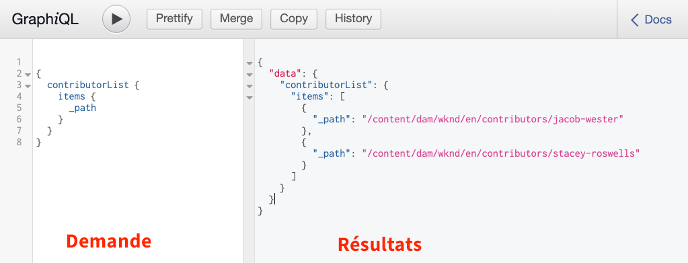
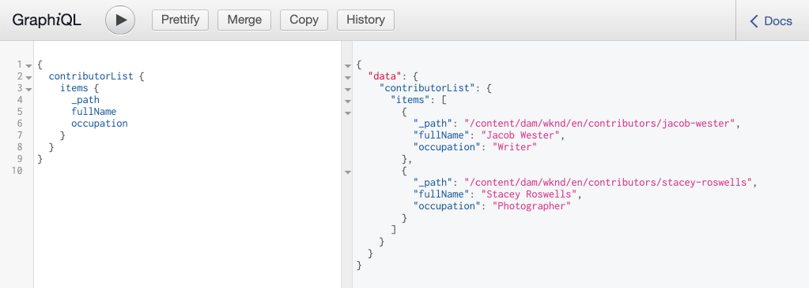

# Exploration des API GraphQL {#explore-graphql-apis}

L’API GraphQL d’AEM fournit un langage de requête puissant pour exposer les données de fragments de contenu aux applications en aval. Les modèles de fragment de contenu définissent le schéma de données utilisé par les fragments de contenu. Chaque fois qu’un modèle de fragment de contenu est créé ou mis à jour, le schéma est traduit et ajouté au &quot;graphique&quot; qui constitue l’API GraphQL.

Dans ce chapitre, nous allons explorer certaines requêtes GraphQL courantes pour rassembler du contenu à l’aide d’un IDE appelé [GraphiQL](https://github.com/graphql/graphiql). L’IDE GraphiQL vous permet de tester et d’affiner rapidement les requêtes et les données renvoyées. GraphiQL permet également d’accéder facilement à la documentation, ce qui facilite l’apprentissage et la compréhension des méthodes disponibles.

## Prérequis {#prerequisites}

Il s’agit d’un tutoriel en plusieurs parties. Nous partons du principe que les étapes décrites dans la section [Création de fragments de contenu](./author-content-fragments.md) ont été terminées.

## Objectifs {#objectives}

* Découvrez comment utiliser l’outil GraphiQL pour créer une requête à l’aide de la syntaxe GraphQL.
* Découvrez comment interroger une liste de fragments de contenu et un seul fragment de contenu.
* Découvrez comment filtrer et demander des attributs de données spécifiques.
* Découvrez comment interroger une variante d’un fragment de contenu.
* Découvrez comment joindre une requête de plusieurs modèles de fragments de contenu

## Installation de l’outil GraphiQL {#install-graphiql}

L’IDE GraphiQL est un outil de développement qui n’est nécessaire que dans les environnements de niveau inférieur tels qu’une instance de développement ou locale. Par conséquent, il n’est pas inclus dans le projet AEM, mais il est fourni sous la forme d’un package distinct qui peut être installé sur une base ad hoc.

1. Accédez au **[Portail de distribution de logiciels](https://experience.adobe.com/#/downloads/content/software-distribution/en/aemcloud.html)** > **AEM en tant que Cloud Service**.
1. Recherchez &quot;GraphiQL&quot; (veillez à inclure **i** dans **GraphiQL**.
1. Téléchargez le dernier **module de contenu GraphiQL v.x.x.x**

   

   Le fichier zip est un package AEM qui peut être installé directement.

1. Dans le menu **AEM Démarrer** accédez à **Outils** > **Déploiement** > **Modules**.
1. Cliquez sur **Télécharger le package** et sélectionnez le package téléchargé à l’étape précédente. Cliquez sur **Installer** pour installer le package.

   

## Requête sur une liste de fragments de contenu {#query-list-cf}

Une exigence courante est de rechercher plusieurs fragments de contenu.

1. Accédez à l’IDE GraphiQL à l’adresse [http://localhost:4502/content/graphiql.html](http://localhost:4502/content/graphiql.html).
1. Collez la requête suivante dans le panneau de gauche (sous la liste des commentaires) :

   ```graphql
   {
     contributorList {
       items {
           _path
         }
     }
   }
   ```

1. Appuyez sur le bouton **Lire** dans le menu supérieur pour exécuter la requête. Vous devriez voir les résultats des fragments de contenu Contributeurs du chapitre précédent :

   

1. Placez le curseur sous le texte `_path` et saisissez **CTRL+Espace** pour déclencher des conseils de code. Ajoutez `fullName` et `occupation` à la requête.

   

1. Exécutez à nouveau la requête en appuyant sur le bouton **Lire** et vous devriez voir que les résultats incluent les propriétés supplémentaires `fullName` et `occupation`.

   

   `fullName` et  `occupation` sont des propriétés simples. Rappelez-vous du chapitre [Définition des modèles de fragment de contenu](./content-fragment-models.md) que `fullName` et `occupation` sont les valeurs utilisées lors de la définition du **Nom de propriété** des champs respectifs.

1. `pictureReference` et  `biographyText` représentent des champs plus complexes. Mettez à jour la requête avec ce qui suit pour renvoyer les données des champs `pictureReference` et `biographyText`.

   ```graphql
   {
   contributorList {
       items {
         _path
         fullName
         occupation
         biographyText {
           html
         }
         pictureReference {
           ... on ImageRef {
               _path
               width
               height
               }
           }
       }
     }
   }
   ```

   `biographyText` est un champ de texte multiligne et l’API GraphQL nous permet de choisir divers formats pour les résultats, comme  `html`,  `markdown`,  `json` ou  `plaintext`.

   `pictureReference` est une référence de contenu et il doit s’agir d’une image. Par conséquent, un  `ImageRef` objet intégré est utilisé. Cela nous permet de demander des données supplémentaires sur l’image faisant référence, comme `width` et `height`.

1. Ensuite, essayez de rechercher une liste d’**aventures**. Exécutez la requête suivante :

   ```graphql
   {
     adventureList {
       items {
         adventureTitle
         adventureType
         adventurePrimaryImage {
           ...on ImageRef {
             _path
             mimeType
           }
         }
       }
     }
   }
   ```

   Vous devriez voir la liste **Aventures** renvoyée. N’hésitez pas à expérimenter en ajoutant des champs supplémentaires à la requête.

## Filtrage d’une liste de fragments de contenu {#filter-list-cf}

Examinons ensuite comment il est possible de filtrer les résultats en un sous-ensemble de fragments de contenu en fonction d’une valeur de propriété.

1. Saisissez la requête suivante dans l’interface utilisateur GraphiQL :

   ```graphql
   {
   contributorList(filter: {
     occupation: {
       _expressions: {
         value: "Photographer"
         }
       }
     }) {
       items {
         _path
         fullName
         occupation
       }
     }
   }
   ```

   La requête ci-dessus effectue une recherche par rapport à tous les contributeurs du système. Le filtre ajouté au début de la requête effectue une comparaison sur le champ `occupation` et la chaîne &quot;**Photographer**&quot;.

1. Exécutez la requête. Il est attendu qu’un seul **contributeur** soit renvoyé.
1. Saisissez la requête suivante pour interroger une liste de **Aventures** où la valeur `adventureActivity` est **différente de** égale à **&quot;Surfing&quot;** :

   ```graphql
   {
     adventureList(filter: {
       adventureActivity: {
           _expressions: {
               _operator: EQUALS_NOT
               value: "Surfing"
           }
       }
   }) {
       items {
       _path
       adventureTitle
       adventureActivity
       }
     }
   }
   ```

1. Exécutez la requête et examinez les résultats. Notez qu’aucun des résultats n’inclut une valeur `adventureType` égale à **&quot;Surfing&quot;**.

Il existe de nombreuses autres options pour filtrer et créer des requêtes complexes, ci-dessus ne sont que quelques exemples.

## Requête sur un seul fragment de contenu {#query-single-cf}

Il est également possible d’interroger directement un seul fragment de contenu. Le contenu d’AEM est stocké de manière hiérarchique et l’identifiant unique d’un fragment est basé sur le chemin du fragment. Si l’objectif est de renvoyer des données sur un fragment unique, il est préférable d’utiliser le chemin et d’interroger directement le modèle. L’utilisation de cette syntaxe signifie que la complexité de la requête sera très faible et générera un résultat plus rapide.

1. Saisissez la requête suivante dans l’éditeur GraphiQL :

   ```graphql
   {
    contributorByPath(_path: "/content/dam/wknd/en/contributors/stacey-roswells") {
       item {
         _path
         fullName
         biographyText {
           html
         }
       }
     }
   }
   ```

1. Exécutez la requête et notez que le résultat unique du fragment **Roswells Stacey** est renvoyé.

   Dans l’exercice précédent, vous avez utilisé un filtre pour réduire une liste de résultats. Vous pouvez utiliser une syntaxe similaire pour filtrer par chemin, mais la syntaxe ci-dessus est préférée pour des raisons de performances.

1. Rappelez-vous dans le chapitre [Création de fragments de contenu](./author-content-fragments.md) qu’une variante **Résumé** a été créée pour **Roswells Stacey**. Mettez à jour la requête pour renvoyer la variation **Summary** :

   ```graphql
   {
   contributorByPath
   (
       _path: "/content/dam/wknd/en/contributors/stacey-roswells"
       variation: "summary"
   ) {
       item {
         _path
         fullName
         biographyText {
           html
         }
       }
     }
   }
   ```

   Même si la variation a été nommée **Résumé**, les variations sont conservées en minuscules et `summary` est donc utilisé.

1. Exécutez la requête et notez que le champ `biography` contient un résultat `html` beaucoup plus court.

## Requête pour plusieurs modèles de fragments de contenu {#query-multiple-models}

Il est également possible de combiner des requêtes distinctes en une seule requête. Cela s’avère utile pour réduire le nombre de requêtes HTTP nécessaires à l’alimentation de l’application. Par exemple, la vue *Accueil* d’une application peut afficher du contenu basé sur **deux** différents modèles de fragment de contenu. Plutôt que d’exécuter **deux** requêtes distinctes, nous pouvons combiner les requêtes en une seule requête.

1. Saisissez la requête suivante dans l’éditeur GraphiQL :

   ```graphql
   {
     adventureList {
       items {
         _path
         adventureTitle
       }
     }
     contributorList {
       items {
         _path
         fullName
       }
     }
   }
   ```

1. Exécutez la requête et vérifiez que le jeu de résultats contient les données des **Aventures** et **Contributeurs** :

```json
{
  "data": {
    "adventureList": {
      "items": [
        {
          "_path": "/content/dam/wknd/en/adventures/bali-surf-camp/bali-surf-camp",
          "adventureTitle": "Bali Surf Camp"
        },
        {
          "_path": "/content/dam/wknd/en/adventures/beervana-portland/beervana-in-portland",
          "adventureTitle": "Beervana in Portland"
        },
        ...
      ]
    },
    "contributorList": {
      "items": [
        {
          "_path": "/content/dam/wknd/en/contributors/jacob-wester",
          "fullName": "Jacob Wester"
        },
        {
          "_path": "/content/dam/wknd/en/contributors/stacey-roswells",
          "fullName": "Stacey Roswells"
        }
      ]
    }
  }
}
```

## Ressources supplémentaires

Pour obtenir de nombreux autres exemples de requêtes GraphQL, voir : [Apprentissage de l’utilisation de GraphQL avec AEM - Exemple de contenu et requêtes](https://experienceleague.adobe.com/docs/experience-manager-cloud-service/assets/admin/content-fragments-graphql-samples.html?lang=fr).

## Félicitations !  {#congratulations}

Félicitations, vous venez de créer et d’exécuter plusieurs requêtes GraphQL !

## Étapes suivantes {#next-steps}

Dans le chapitre suivant, [Requête AEM depuis une application React](./graphql-and-external-app.md), vous allez découvrir comment une application externe peut interroger AEM points d’entrée GraphQL. L’application externe qui modifie l’exemple de l’application WKND GraphQL React pour ajouter des requêtes GraphQL de filtrage, ce qui permet à l’utilisateur de l’application de filtrer les aventures par activité. Vous serez également initié à une gestion des erreurs de base.
