# Explorer les API GraphQL {#explore-graphql-apis}

L’API GraphQL d’AEM fournit un langage de requête puissant pour exposer les données de fragments de contenu aux applications en aval. Les modèles de fragment de contenu définissent le schéma de données utilisé par les fragments de contenu. Chaque fois qu’un modèle de fragment de contenu est créé ou mis à jour, le schéma est traduit et ajouté au « graphique » qui constitue l’API GraphQL.

Dans ce chapitre, explorons quelques requêtes GraphQL courantes pour rassembler du contenu à l’aide d’un IDE appelé [GraphiQL](https://github.com/graphql/graphiql). L’IDE GraphiQL vous permet de tester et d’affiner rapidement les requêtes et les données renvoyées. Il permet également d’accéder facilement à la documentation, ce qui facilite l’apprentissage et la compréhension des méthodes disponibles.

## Prérequis {#prerequisites}

Il s’agit d’un tutoriel en plusieurs parties qui suppose que les étapes décrites dans la section [Création de fragments de contenu](./author-content-fragments.md) ont été terminées.

## Objectifs {#objectives}

* Découvrir comment utiliser l’outil GraphiQL pour créer une requête à l’aide de la syntaxe GraphQL.
* Découvrir comment interroger une liste de fragments de contenu et un seul fragment de contenu.
* Découvrir comment filtrer et demander des attributs de données spécifiques.
* Découvrir comment lier une requête de plusieurs modèles de fragments de contenu.
* Découvrir comment conserver une requête GraphQL.

## Activer un point d’entrée GraphQL {#enable-graphql-endpoint}

Un point d’entrée GraphQL doit être configuré pour activer les requêtes d’API GraphQL pour les fragments de contenu.

1. Depuis l’écran de démarrage d’AEM, accédez à **Outils** > **Général** > **GraphQL**.

   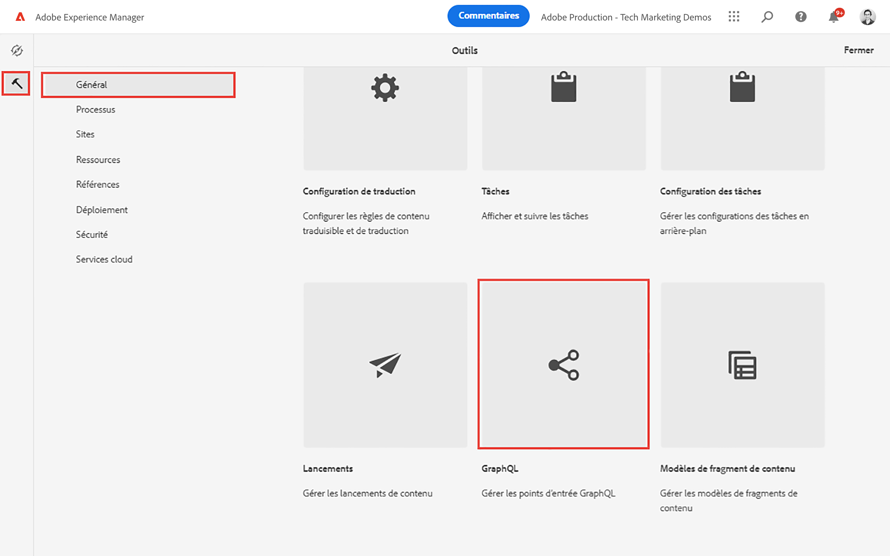

1. Appuyez sur **Créer** dans le coin supérieur droit, et dans la boîte de dialogue qui s’affiche, saisissez les valeurs suivantes :

   * Nom* : **Point d’entrée de mon projet**.
   * Utilisez le schéma GraphQL fourni par ... * : **Mon projet**.

   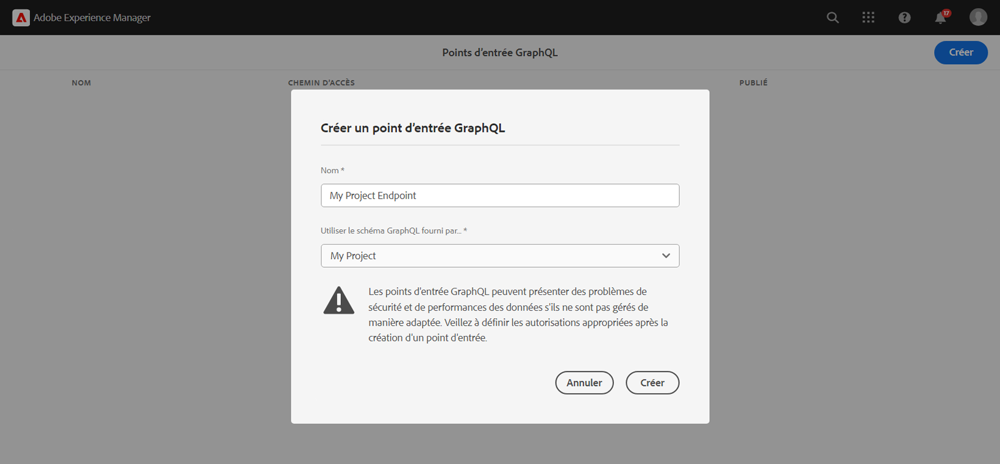

   Appuyez sur **Créer** pour enregistrer le point d’entrée.

   Les points d’entrée GraphQL créés à partir d’une configuration de projet activent uniquement les requêtes liées aux modèles appartenant à ce projet. Dans ce cas, seules les requêtes liées aux modèles **Personne** et **Équipe** peuvent être utilisées.

   >[!NOTE]
   >
   > Un point d’entrée global peut également être créé pour activer les requêtes liées aux modèles dans plusieurs configurations. Cette méthode doit être utilisée avec précaution, car elle peut ouvrir l’environnement à d’autres failles de sécurité et ajouter à la complexité globale de la gestion d’AEM.

1. Vous devriez maintenant voir un point d’entrée GraphQL activé dans votre environnement.

   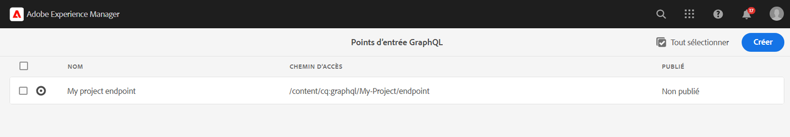

## Utiliser l’IDE GraphiQL

L’outil [GraphiQL](https://experienceleague.adobe.com/docs/experience-manager-cloud-service/content/headless/graphql-api/graphiql-ide.html?lang=fr) permet aux développeurs et développeuses de créer et de tester des requêtes liées au contenu de l’environnement AEM actuel. L’outil GraphiQL permet également aux utilisateurs et utilisatrices de **conserver ou enregistrer** des requêtes vouées à être utilisées par les applications clientes dans un contexte de production.

Ensuite, explorez la puissance de l’API GraphQL d’AEM à l’aide de l’IDE GraphiQL intégré.

1. Depuis l’écran de démarrage AEM, accédez à **Outils** > **Général** > **Éditeur de requêtes GraphQL**.

   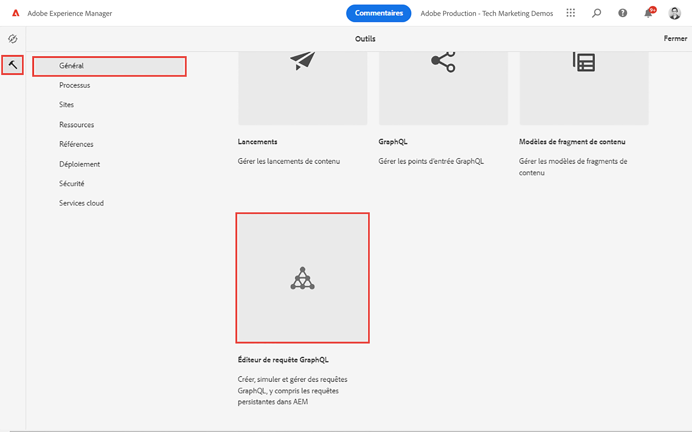

   >[!NOTE]
   >
   > Dans les anciennes versions d’AEM, l’IDE GraphiQL peut ne pas être intégré. Il peut être installé manuellement en suivant ces [instructions](#install-graphiql).

1. Dans le coin supérieur droit, assurez-vous que le point d’entrée est défini sur **Point d’entrée de mon projet**.

   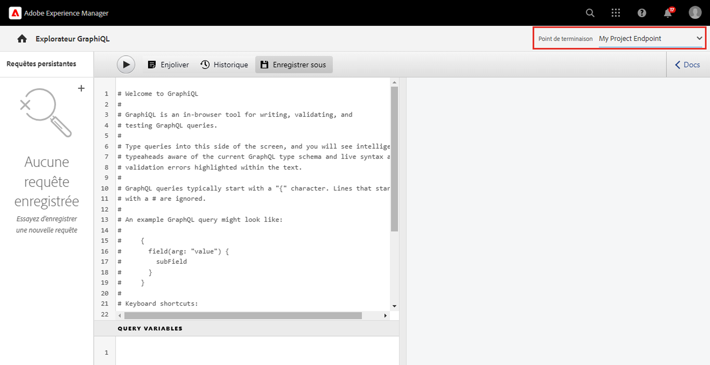

Cela permettra d’étendre toutes les requêtes aux modèles créés dans le projet **Mon projet**.

### Interroger une liste de fragments de contenu {#query-list-cf}

Une exigence courante consiste à interroger plusieurs fragments de contenu.

1. Collez la requête suivante dans le panneau principal (en remplaçant la liste des commentaires) :

   ```graphql
   query allTeams {
     teamList {
       items {
         _path
         title
       }
     }
   } 
   ```

1. Appuyez sur la touche **Lecture** dans le menu supérieur pour exécuter la requête. Vous devriez voir les résultats des fragments de contenu du chapitre précédent :

   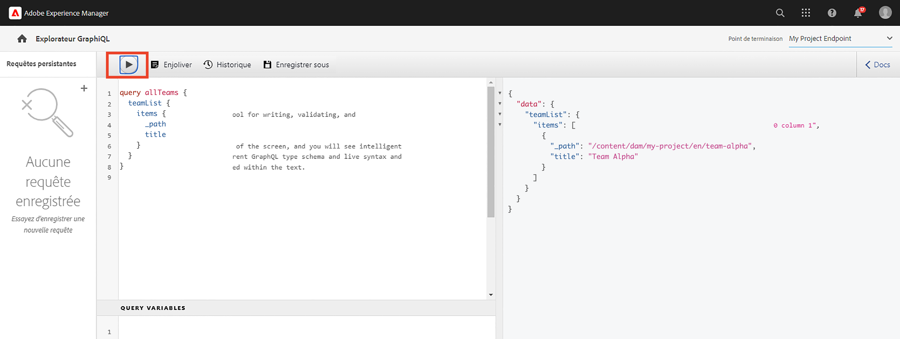

1. Positionnez le curseur sous le texte `title` et saisissez **Ctrl+Espace** pour activer les astuces de codage. Ajoutez `shortname` et `description` à la requête.

   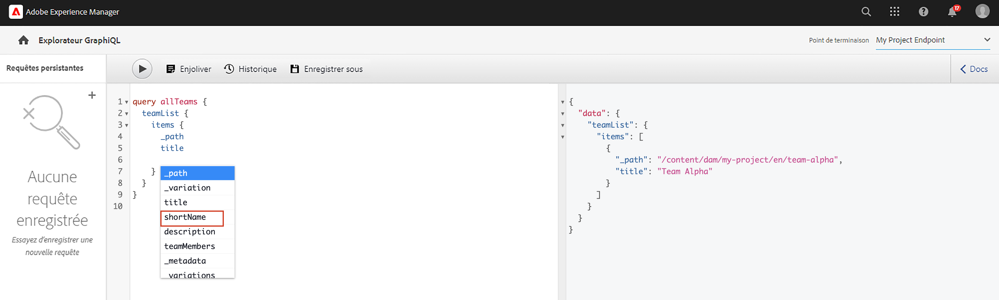

1. Exécutez à nouveau la requête en appuyant sur le bouton **Lecture** et vous devriez voir que les résultats incluent les propriétés supplémentaires de `shortname` et `description`.

   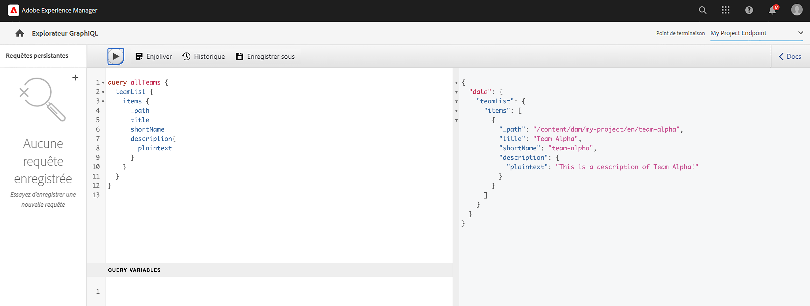

   Le `shortname` est une propriété simple et la `description` est un champ de texte multiligne, et l’API GraphQL nous permet de choisir différents formats pour les résultats comme `html`, `markdown`, `json`, ou `plaintext`.

### Requête pour les fragments imbriqués

Ensuite, expérimentez avec les requêtes pour récupérer des fragments imbriqués, en gardant à l’esprit que le modèle **Équipe** référence le modèle **Personne**.

1. Mettez à jour la requête pour inclure la propriété `teamMembers`. Rappelons qu’il s’agit d’un champ de **Référence de fragment** au modèle Personne. Les propriétés du modèle Personne peuvent être renvoyées :

   ```graphql
   query allTeams {
       teamList {
           items {
               _path
               title
               shortName
               description {
                   plaintext
               }
               teamMembers {
                   fullName
                   occupation
               }
           }
       }
   }
   ```

   Réponse JSON :

   ```json
   {
       "data": {
           "teamList": {
           "items": [
               {
               "_path": "/content/dam/my-project/en/team-alpha",
               "title": "Team Alpha",
               "shortName": "team-alpha",
               "description": {
                   "plaintext": "This is a description of Team Alpha!"
               },
               "teamMembers": [
                   {
                   "fullName": "John Doe",
                   "occupation": [
                       "Artist",
                       "Influencer"
                   ]
                   },
                   {
                   "fullName": "Alison Smith",
                   "occupation": [
                       "Photographer"
                   ]
                   }
                 ]
           }
           ]
           }
       }
   }
   ```

   La possibilité d’interroger des fragments imbriqués est une fonctionnalité puissante de l’API GraphQL d’AEM. Dans cet exemple simple, l’imbrication ne porte que sur deux niveaux. Il est toutefois possible d’imbriquer davantage les fragments. Par exemple, s’il existait un modèle **Adresse** associé à une **Personne**, il serait possible de renvoyer les données des trois modèles avec une seule requête.

### Filtrer une liste de fragments de contenu {#filter-list-cf}

Voyons ensuite comment il est possible de filtrer les résultats sur un sous-ensemble de fragments de contenu en fonction de la valeur d’une propriété.

1. Saisissez la requête suivante dans l’interface graphique de GraphiQL :

   ```graphql
   query personByName($name:String!){
     personList(
       filter:{
         fullName:{
           _expressions:[{
             value:$name
             _operator:EQUALS
           }]
         }
       }
     ){
       items{
         _path
         fullName
         occupation
       }
     }
   }  
   ```

   La requête ci-dessus effectue une recherche sur tous les fragments de Personne du système. Le filtre ajouté au début de la requête effectue une comparaison sur le champ `name` et la chaîne de variable `$name`.

1. Dans le panneau **Variables de requête**, saisissez ce qui suit :

   ```json
   {"name": "John Doe"}
   ```

1. Exécutez la requête, il faut s’attendre à ce que seul le fragment de contenu **Personnes** soit retourné avec une valeur de `John Doe`.

   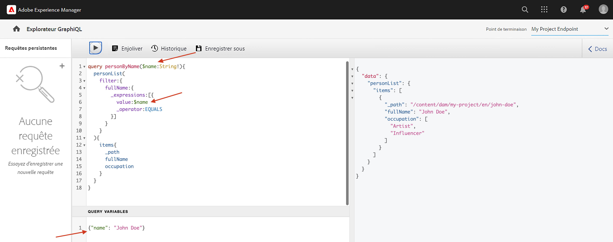

   Il existe de nombreuses autres options pour filtrer et créer des requêtes complexes, voir [Apprendre à utiliser GraphQL avec AEM - Exemples de contenu et de requêtes](https://experienceleague.adobe.com/docs/experience-manager-cloud-service/content/headless/graphql-api/sample-queries.html?lang=fr).

1. Améliorer la requête ci-dessus pour récupérer la photo de profil

   ```graphql
   query personByName($name:String!){
     personList(
       filter:{
         fullName:{
           _expressions:[{
             value:$name
             _operator:EQUALS
           }]
         }
       }
     ){
       items{  
         _path
         fullName
         occupation
         profilePicture{
           ... on ImageRef{
             _path
             _authorUrl
             _publishUrl
             height
             width
   
           }
         }
       }
     }
   } 
   ```

   La `profilePicture` est une référence de contenu prévue pour être une image, donc l’objet `ImageRef` intégré est utilisé. Cela nous permet de demander des données supplémentaires sur l’image référencée, comme la `width` et la `height`.

### Interroger un seul fragment de contenu {#query-single-cf}

Il est également possible d’interroger directement un seul fragment de contenu. Le contenu dans AEM est stocké de manière hiérarchique et l’identifiant unique d’un fragment est basé sur son chemin d’accès.

1. Saisissez la requête suivante dans l’éditeur GraphiQL :

   ```graphql
   query personByPath($path: String!) {
       personByPath(_path: $path) {
           item {
           fullName
           occupation
           }
       }
   }
   ```

1. Saisissez ce qui suit pour les **Variables de requête** :

   ```json
   {"path": "/content/dam/my-project/en/alison-smith"}
   ```

1. Exécutez la requête et constatez qu’un seul résultat est renvoyé.

## Requêtes persistantes {#persist-queries}

Une fois qu’un développeur ou une développeuse trouve la requête et les données de résultat renvoyées par cette dernière satisfaisantes, l’étape suivante consiste à stocker ou à persister la requête dans AEM. Les [requêtes persistantes](https://experienceleague.adobe.com/docs/experience-manager-cloud-service/content/headless/graphql-api/persisted-queries.html?lang=fr) constituent le mécanisme privilégié pour exposer l’API GraphQL aux applications clientes. Une fois qu’une requête a été conservée, elle peut être demandée à l’aide d’une requête GET et mise en cache au niveau des couches du Dispatcher et du réseau CDN. Les performances des requêtes persistantes sont bien meilleures. Outre les avantages en termes de performances, les requêtes persistantes garantissent que des données supplémentaires ne sont pas accidentellement exposées aux applications clientes. Plus de détails sur [les requêtes persistantes peuvent être trouvés ici](https://experienceleague.adobe.com/docs/experience-manager-cloud-service/content/headless/graphql-api/persisted-queries.html?lang=fr).

Ensuite, conservez deux requêtes simples, elles sont utilisées dans le chapitre suivant.

1. Saisissez la requête suivante dans l’IDE GraphiQL :

   ```graphql
   query allTeams {
       teamList {
           items {
               _path
               title
               shortName
               description {
                   plaintext
               }
               teamMembers {
                   fullName
                   occupation
               }
           }
       }
   }
   ```

   Vérifiez que la requête fonctionne.

1. Appuyez ensuite sur **Enregistrer sous** et saisissez `all-teams` comme **Nom de la requête**.

   La requête devrait être affichée sous **Requêtes persistantes** dans le rail de gauche.

   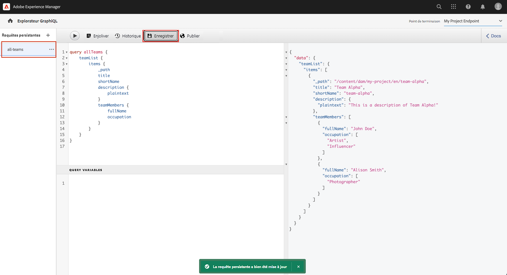
1. Appuyez ensuite sur les points de suspension **...** à côté de la requête persistante et appuyez sur **Copier l’URL** pour copier le chemin d’accès dans votre presse-papiers.

   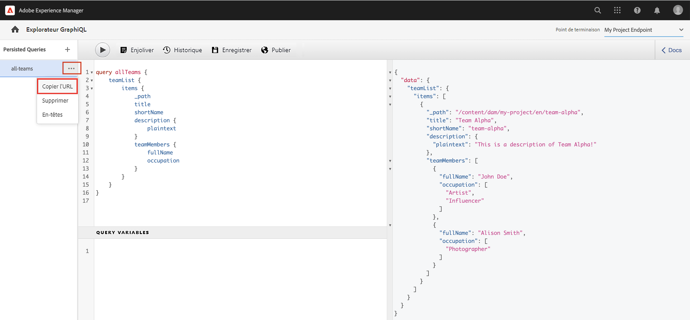

1. Ouvrez un nouvel onglet et collez le chemin d’accès copié dans votre navigateur :

   ```plain
   https://$YOUR-AEMasCS-INSTANCEID$.adobeaemcloud.com/graphql/execute.json/my-project/all-teams
   ```

   Il devrait ressembler au chemin d’accès ci-dessus. Vous devriez voir que les résultats JSON de la requête sont renvoyés.

   Décomposition de l’URL ci-dessus :

   | Nom | Description |
   | ---------|---------- |
   | `/graphql/execute.json` | Point d’entrée des requêtes persistantes |
   | `/my-project` | Configuration du projet pour `/conf/my-project` |
   | `/all-teams` | Nom de la requête persistante |

1. Retournez dans l’IDE GraphiQL et utilisez le bouton plus **+** pour conserver la NOUVELLE requête.

   ```graphql
   query personByName($name: String!) {
     personList(
       filter: {
         fullName:{
           _expressions: [{
             value: $name
             _operator:EQUALS
           }]
         }
       }){
       items {
         _path
         fullName
         occupation
         biographyText {
           json
         }
         profilePicture {
           ... on ImageRef {
             _path
             _authorUrl
             _publishUrl
             width
             height
           }
         }
       }
     }
   }
   ```

1. Enregistrez la requête sous : `person-by-name`.
1. Vous devriez avoir deux requêtes persistantes enregistrées :

   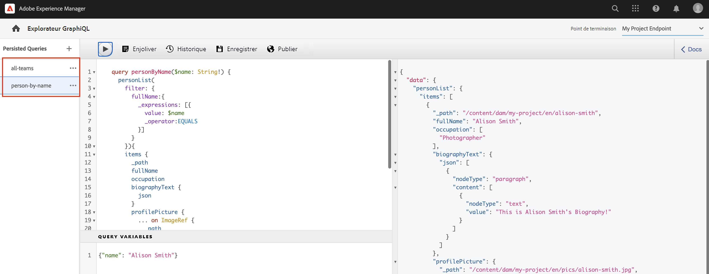


## Publier le point d’entrée GraphQL et les requêtes persistantes

Après examen et vérification, publiez le `GraphQL Endpoint` et les `Persisted Queries`.

1. À partir de l’écran de démarrage d’AEM, accédez à **Outils** > **Général** > **GraphQL**.

1. Appuyez sur la case à cocher à côté de **Point d’entrée de mon projet** et appuyez sur **Publier**.

   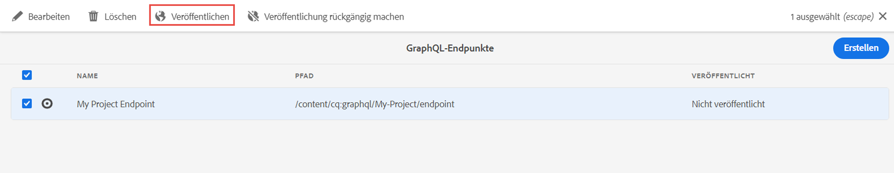

1. À partir de l’écran de démarrage d’AEM, accédez à **Outils** > **Général** > **Éditeur de requêtes GraphQL**.

1. Appuyez sur la requête **toutes les équipes** dans le panneau des requêtes persistantes et appuyez sur **Publier**.

   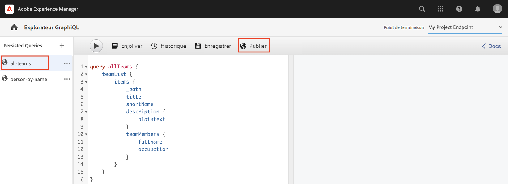

1. Répétez l’étape ci-dessus pour la requête `person-by-name`.

## Fichiers de solution {#solution-files}

Téléchargez le contenu, les modèles et les requêtes persistantes créés dans les trois derniers chapitres : [basic-tutorial-solution.content.zip](assets/explore-graphql-api/basic-tutorial-solution.content.zip).

## Ressources supplémentaires

Apprenez-en davantage sur les requêtes GraphQL : [Apprendre à utiliser GraphQL avec AEM - Exemples de contenu et de requêtes](https://experienceleague.adobe.com/docs/experience-manager-cloud-service/content/headless/graphql-api/sample-queries.html?lang=fr).

## Félicitations. {#congratulations}

Félicitations, vous avez créé et exécuté plusieurs requêtes GraphQL.

## Étapes suivantes {#next-steps}

Dans le chapitre suivant, [Créer une application React](./graphql-and-react-app.md), vous explorez comment une application externe peut interroger les points d’entrée GraphQL d’AEM et utiliser ces deux requêtes persistantes. Vous aurez également droit à une introduction à la gestion des erreurs de base pendant l’exécution des requêtes GraphQL.

## Installer l’outil GraphiQL (facultatif) {#install-graphiql}

Dans certaines versions d’AEM (6.X.X), l’outil IDE de GraphiQL doit être installé manuellement, utilisez les [instructions disponibles ici](../how-to/install-graphiql-aem-6-5.md).

