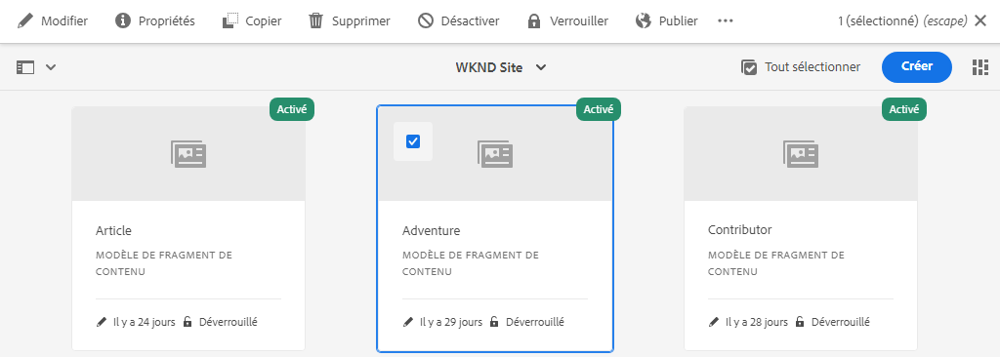
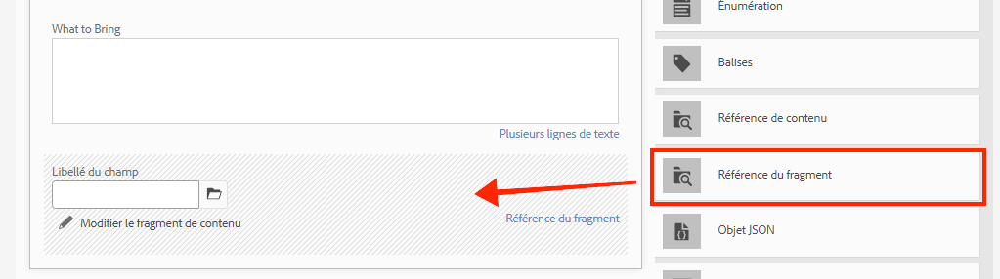
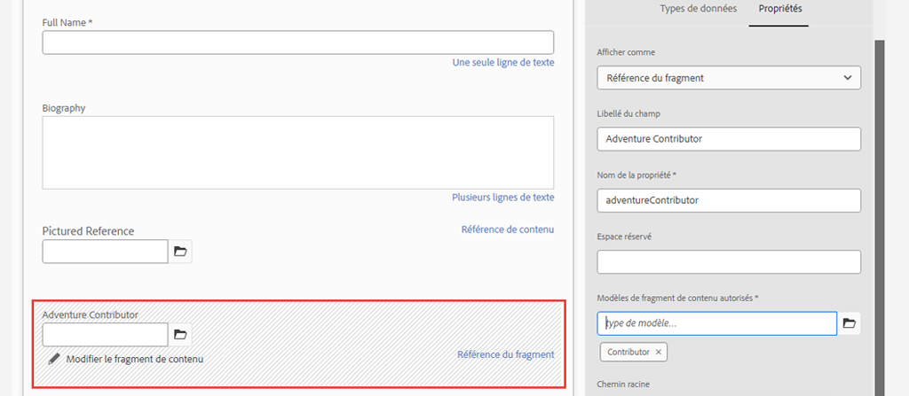
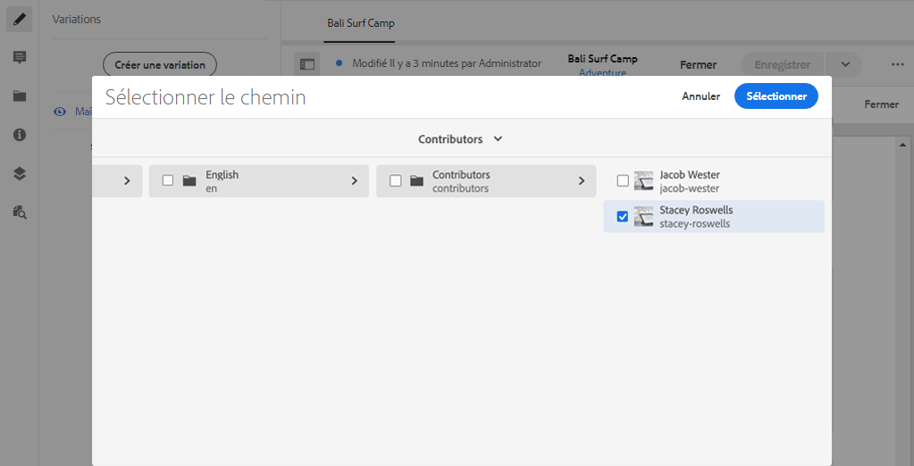
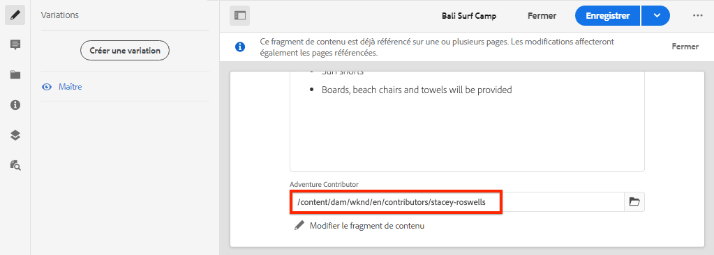

# Modélisation avancée des données à l’aide des références de fragments

Il est possible de référencer un fragment de contenu dans un autre fragment de contenu. Cela permet à un utilisateur de créer des modèles de données complexes avec des relations entre les fragments.

Dans ce chapitre, vous allez mettre à jour le modèle Adventure afin d’inclure une référence au modèle Contributeur à l’aide de la variable **Référence de fragment** champ . Vous apprendrez également à modifier une requête GraphQL pour inclure des champs d’un modèle référencé.

## Prérequis

Il s’agit d’un tutoriel en plusieurs parties qui suppose que les étapes décrites dans les parties précédentes ont été terminées.

## Objectifs

Dans ce chapitre, nous allons apprendre à :

* Mettre à jour un modèle de fragment de contenu pour utiliser le champ Référence de fragment
* Création d’une requête GraphQL qui renvoie des champs à partir d’un modèle référencé

## Ajout d’une référence de fragment {#add-fragment-reference}

Mettez à jour le modèle de fragment de contenu aventure pour ajouter une référence au modèle du contributeur.

1. Ouvrez un nouveau navigateur et accédez à AEM.
1. Dans la **AEM** Accédez à **Outils** > **Ressources** > **Modèles de fragment de contenu** > **Site WKND**.
1. Ouvrez le **Adventure** Modèle de fragment de contenu

   

1. Sous **Types de données**, effectuez un glisser-déposer d’un élément **Référence de fragment** dans le panneau principal.

   

1. Mettez à jour le **Propriétés** pour ce champ avec les éléments suivants :

   * Afficher comme - `fragmentreference`
   * Libellé du champ - **Adventure Contributor**
   * Nom de la propriété - `adventureContributor`
   * Type de modèle : sélectionnez la variable **Contributeur** model
   * Chemin racine - `/content/dam/wknd`

   

   Nom de la propriété `adventureContributor` peut désormais être utilisé pour référencer un fragment de contenu du contributeur.

1. Enregistrez les modifications apportées au modèle.

## Attribution d’un contributeur à une aventure

Maintenant que le modèle de fragment de contenu aventure a été mis à jour, nous pouvons modifier un fragment existant et référencer un contributeur. Notez que la modification du modèle de fragment de contenu *affecte* tout fragment de contenu existant créé à partir de celui-ci.

1. Accédez à **Ressources** > **Fichiers** > **Site WKND** > **Anglais** > **Aventures** > **[Le camp de surf de Bali](http://localhost:4502/assets.html/content/dam/wknd/en/adventures/bali-surf-camp)**.

   

1. Cliquez dans le **Le camp de surf de Bali** fragment de contenu pour ouvrir l’éditeur de fragment de contenu.
1. Mettez à jour le **Adventure Contributor** et sélectionnez un contributeur en cliquant sur l’icône de dossier.

   

   *Sélection d’un chemin d’accès à un fragment de contributeur*

   

   Notez que seuls les fragments créés à l’aide de la fonction **Contributeur** peuvent être sélectionnés.

1. Enregistrez les modifications dans le fragment.

1. Répétez les étapes ci-dessus pour affecter un contributeur à des aventures telles que [Yosemite Backpackaging](http://localhost:4502/editor.html/content/dam/wknd/en/adventures/yosemite-backpacking/yosemite-backpacking) et [Escalade du rock au Colorado](http://localhost:4502/editor.html/content/dam/wknd/en/adventures/colorado-rock-climbing/colorado-rock-climbing)

## Requête de fragment de contenu imbriqué avec GraphiQL

Exécutez ensuite une requête pour une aventure et ajoutez les propriétés imbriquées du modèle Contributeur référencé. Nous utiliserons l’outil GraphiQL pour vérifier rapidement la syntaxe de la requête.

1. Accédez à l’outil GraphiQL dans AEM : [http://localhost:4502/content/graphiql.html](http://localhost:4502/content/graphiql.html)

1. Saisissez la requête suivante :

   ```graphql
   {
     adventureByPath(_path:"/content/dam/wknd/en/adventures/bali-surf-camp/bali-surf-camp") {
        item {
          _path
          adventureTitle
          adventureContributor {
            fullName
            occupation
            pictureReference {
           ...on ImageRef {
             _path
           }
         }
       }
     }
    }
   }
   ```

   La requête ci-dessus est pour une aventure unique par son chemin. Le `adventureContributor` fait référence au modèle du contributeur, puis nous pouvons demander des propriétés au fragment de contenu imbriqué.

1. Exécutez la requête et vous devriez obtenir un résultat comme suit :

   ```json
   {
     "data": {
       "adventureByPath": {
           "item": {
               "_path": "/content/dam/wknd/en/adventures/bali-surf-camp/bali-surf-camp",
               "adventureTitle": "Bali Surf Camp",
               "adventureContributor": {
                   "fullName": "Stacey Roswells",
                   "occupation": "Photographer",
                   "pictureReference": {
                       "_path": "/content/dam/wknd/en/contributors/stacey-roswells.jpg"
                   }
               }
           }
        }
     }
   }
   ```

1. Testez d’autres requêtes comme `adventureList` et ajoutez des propriétés pour le fragment de contenu référencé sous `adventureContributor`.

## Mettre à jour l’application React pour afficher le contenu du contributeur

Ensuite, mettez à jour les requêtes utilisées par l’application React afin d’inclure le nouveau contributeur et d’afficher les informations sur le contributeur dans la vue Détails de l’aventure.

1. Ouvrez l’application WKND GraphQL React dans votre IDE.

1. Ouvrez le fichier `src/components/AdventureDetail.js`.

   

1. Recherche de la fonction `adventureDetailQuery(_path)`. Le `adventureDetailQuery(..)` encapsule simplement une requête GraphQL de filtrage, qui utilise AEM `<modelName>ByPath` pour interroger un seul fragment de contenu identifié par son chemin JCR.

1. Mettez à jour la requête pour inclure des informations sur le contributeur référencé :

   ```javascript
   function adventureDetailQuery(_path) {
       return `{
           adventureByPath (_path: "${_path}") {
           item {
               _path
               adventureTitle
               adventureActivity
               adventureType
               adventurePrice
               adventureTripLength
               adventureGroupSize
               adventureDifficulty
               adventurePrice
               adventurePrimaryImage {
                   ... on ImageRef {
                   _path
                   mimeType
                   width
                   height
                   }
               }
               adventureDescription {
                   html
               }
               adventureItinerary {
                   html
               }
               adventureContributor {
                   fullName
                   occupation
                   pictureReference {
                       ...on ImageRef {
                           _path
                       }
                   }
               }
             }
          }
        }
       `;
   }
   ```

   Avec cette mise à jour, des propriétés supplémentaires sur la variable `adventureContributor`, `fullName`, `occupation`, et `pictureReference` sera inclus dans la requête.

1. Inspect `Contributor` composant incorporé dans `AdventureDetail.js` fichier à l’emplacement `function Contributor(...)`. Ce composant affiche le nom, l’occupation et l’image du contributeur si les propriétés existent.

   Le `Contributor` est référencé dans la variable `AdventureDetail(...)` `return` method :

   ```javascript
   function AdventureDetail(props) {
       ...
       return (
           ...
            <h2>Itinerary</h2>
           <hr />
           <div className="adventure-detail-itinerary"
                dangerouslySetInnerHTML={{__html: adventureData.adventureItinerary.html}}></div>
           {/* Contributor component is instaniated and 
               is passed the adventureContributor object from the GraphQL Query results */}
           <Contributer {...adventureData.adventureContributor} />
           ...
       )
   }
   ```

1. Enregistrez les modifications dans le fichier.
1. Démarrez l’application React, si elle n’est pas déjà en cours d’exécution :

   ```shell
   $ cd aem-guides-wknd-graphql/react-app
   $ npm start
   ```

1. Accédez à [http://localhost:3000](http://localhost:3000/) et cliquez sur une aventure dont le contributeur est référencé. Vous devriez maintenant voir les informations du contributeur répertoriées ci-dessous : **Itinéraire**:

   

## Félicitations !{#congratulations}

Félicitations ! Vous avez mis à jour un modèle de fragment de contenu existant afin de référencer un fragment de contenu imbriqué à l’aide de la propriété **Référence de fragment** champ . Vous avez également appris à modifier une requête GraphQL pour inclure des champs d’un modèle référencé.

## Étapes suivantes {#next-steps}

Dans le chapitre suivant, [Déploiement en production à l’aide d’un environnement de publication AEM](./production-deployment.md), découvrez les services AEM Author et Publish et le modèle de déploiement recommandé pour les applications sans interface utilisateur graphique. Vous allez mettre à jour une application existante afin d’utiliser des variables d’environnement pour modifier dynamiquement un point d’entrée GraphQL en fonction de l’environnement cible. Vous apprendrez également comment configurer correctement les AEM pour le partage des ressources cross-origin (CORS).
