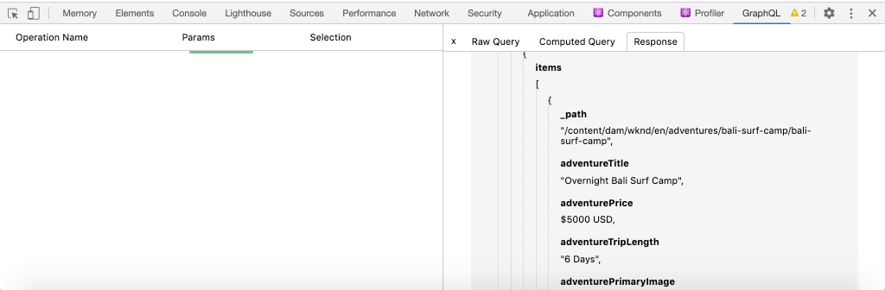
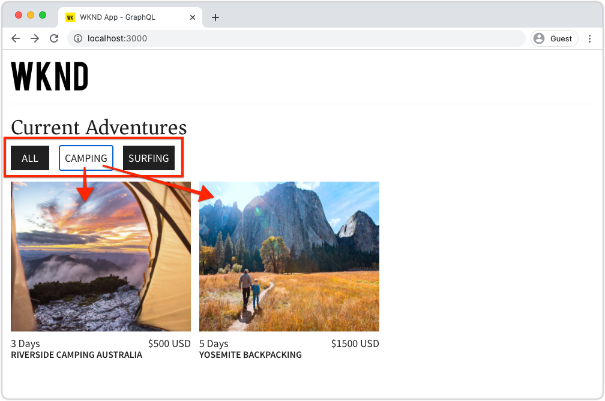

# Requête AEM à l’aide de GraphQL à partir d’une application externe

Dans ce chapitre, nous examinons comment AEM API GraphQL peuvent être utilisées pour générer l’expérience dans une application externe.

Ce tutoriel utilise une application React simple pour interroger et afficher le contenu Adventure exposé par AEM API GraphQL. L’utilisation de React n’a guère d’importance et l’application externe consommatrice peut être écrite dans n’importe quel framework pour n’importe quelle plateforme.

## Prérequis

Il s’agit d’un tutoriel en plusieurs parties qui suppose que les étapes décrites dans les parties précédentes ont été terminées.

_Les captures d’écran IDE de ce chapitre proviennent de [Visual Studio Code](https://code.visualstudio.com/)_

Vous pouvez éventuellement installer une extension de navigateur comme [Inspecteur réseau GraphQL](https://chrome.google.com/webstore/detail/graphql-network-inspector/ndlbedplllcgconngcnfmkadhokfaaln) pour pouvoir afficher plus de détails sur une requête GraphQL.

## Objectifs

Dans ce chapitre, nous allons apprendre à :

* Démarrez et comprenez les fonctionnalités de l’exemple d’application React.
* Découvrez comment les appels sont effectués à partir de l’application externe pour AEM les points d’entrée GraphQL
* Définition d’une requête GraphQL pour filtrer une liste de fragments de contenu aventures par activité
* Mettre à jour l’application React pour fournir des contrôles pour filtrer via GraphQL, la liste des aventures par activité

## Démarrage de l’application React

Comme ce chapitre se concentre sur le développement d’un client pour utiliser des fragments de contenu sur GraphQL, l’exemple [Le code source de l’application WKND GraphQL React doit être téléchargé et configuré.](../quick-setup/local-sdk.md) sur votre ordinateur local.

Le démarrage de l’application React est présenté plus en détail dans la section [Configuration rapide](../quick-setup/local-sdk.md) , mais les instructions abrégées peuvent être suivies :

1. Si ce n’est déjà fait, clonez l’exemple d’application WKND GraphQL React à partir de [Github.com](https://github.com/adobe/aem-guides-wknd-graphql)

   ```shell
   $ git clone --branch tutorial/react git@github.com:adobe/aem-guides-wknd-graphql.git
   ```

1. Ouvrez l’application WKND GraphQL React dans votre IDE.

   

1. À partir de la ligne de commande, accédez au `react-app` folder
1. Démarrez l’application WKND GraphQL React en exécutant la commande suivante à partir de la racine du projet (le `react-app` folder)

   ```shell
   $ cd aem-guides-wknd-graphql/react-app
   $ npm start
   ```

1. Passez en revue l’application à l’adresse [http://localhost:3000/](http://localhost:3000/). L’exemple d’application React comporte deux parties principales :

   * L’expérience personnelle agit comme un indice de WKND Adventures, en interrogeant __Adventure__ Fragments de contenu dans AEM à l’aide de GraphQL. Dans ce chapitre, nous allons modifier cette vue pour prendre en charge le filtrage des aventures par activité.

      

   * L’expérience des détails de l’aventure utilise GraphQL pour interroger le __Adventure__ Fragment de contenu et affiche davantage de points de données.

      

1. Utilisez les outils de développement du navigateur et une extension de navigateur comme [Inspecteur réseau GraphQL](https://chrome.google.com/webstore/detail/graphql-network-inspector/ndlbedplllcgconngcnfmkadhokfaaln) pour inspecter les requêtes GraphQL envoyées à AEM et leurs réponses JSON. Cette approche peut être utilisée pour surveiller les requêtes et réponses GraphQL afin de s’assurer qu’elles sont correctement formulées et que leurs réponses sont conformes aux attentes.

   

   *Requête GraphQL envoyée à AEM à partir de l’application React*

   

   *Réponse JSON de l’AEM à l’application React*

   Les requêtes et la réponse doivent correspondre à ce qui était affiché dans l’IDE GraphiQL.

   >[!NOTE]
   >
   > Pendant le développement, l’application React est configurée pour proxy les requêtes HTTP via le serveur de développement webpack pour AEM. L’application React envoie des demandes à  `http://localhost:3000` qui les envoie par proxy au service AEM Author s’exécutant sur `http://localhost:4502`. Vérification du fichier `src/setupProxy.js` et `env.development` pour plus d’informations.
   >
   > Dans les scénarios autres que de développement, l’application React est configurée pour envoyer directement des requêtes à AEM.

## Exploration du code GraphQL de l’application

1. Dans votre IDE, ouvrez le fichier . `src/api/useGraphQL.js`.

   Il s’agit d’une [React Effet Hook](https://reactjs.org/docs/hooks-overview.html#effect-hook) qui écoute les modifications apportées au `query`, et lors de la modification, envoie une requête de POST HTTP au point de terminaison AEM GraphQL et renvoie la réponse JSON à l’application.

   Chaque fois que l’application React doit effectuer une requête GraphQL, elle appelle cette variable personnalisée. `useGraphQL(query)` hook, transmission de GraphQL à envoyer à AEM.

   Ce crochet utilise le `fetch` module pour effectuer la requête GraphQL du POST HTTP, mais d’autres modules tels que [Client Apollo GraphQL](https://www.apollographql.com/docs/react/) peut être utilisé de manière similaire.

1. Ouvrir `src/components/Adventures.js` dans l’IDE, responsable de la liste des aventures de la vue d’accueil, et passez en revue l’appel de la fonction `useGraphQL` hameçon.

   Ce code définit la valeur par défaut `query` pour être `allAdventuresQuery` comme défini plus bas dans ce fichier.

   ```javascript
   const [query, setQuery] = useState(allAdventuresQuery);
   ```

   ... et chaque fois que la variable `query` les modifications, la variable `useGraphQL` Le point d’extension est appelé, ce qui exécute à son tour la requête GraphQL par rapport à AEM, renvoyant le JSON à l’événement `data` qui est ensuite utilisée pour effectuer le rendu de la liste des aventures.

   ```javascript
   const { data, errorMessage } = useGraphQL(query);
   ```

   Le `allAdventuresQuery` est une requête GraphQL constante définie dans le fichier, qui interroge tous les fragments de contenu aventure, sans aucun filtrage, et renvoie uniquement les points de données qui doivent afficher la vue d’accueil.

   ```javascript
   const allAdventuresQuery = `
   {
       adventureList {
         items {
           _path
           adventureTitle
           adventurePrice
           adventureTripLength
           adventurePrimaryImage {
           ... on ImageRef {
               _path
               mimeType
               width
               height
             }
           }
         }
     }
   }
   `;
   ```

1. Ouvrir `src/components/AdventureDetail.js`, le composant React responsable de l’affichage de l’expérience des détails de l’aventure. Cette vue demande un fragment de contenu spécifique, en utilisant son chemin JCR comme identifiant unique et effectue le rendu des détails fournis.

   De la même manière que `Adventures.js`, la variable `useGraphQL` React Hook est réutilisé pour exécuter cette requête GraphQL sur AEM.

   Le chemin d’accès du fragment de contenu est collecté à partir du `props` top à utiliser pour spécifier le fragment de contenu à rechercher.

   ```javascript
   const contentFragmentPath = props.location.pathname.substring(props.match.url.length);
   ```

   ... et la requête paramétrée GraphQL est créée à l’aide de la fonction `adventureDetailQuery(..)` et transmis à `useGraphQL(query)` qui exécute la requête GraphQL sur AEM et renvoie les résultats à la variable `data` .

   ```javascript
   const { data, errorMessage } = useGraphQL(adventureDetailQuery(contentFragmentPath));
   ```

   Le `adventureDetailQuery(..)` encapsule simplement une requête GraphQL de filtrage, qui utilise AEM `<modelName>ByPath` pour interroger un seul fragment de contenu identifié par son chemin JCR et renvoie tous les points de données spécifiés requis pour effectuer le rendu des détails de l’aventure.

   ```javascript
   function adventureDetailQuery(_path) {
   return `{
       adventureByPath (_path: "${_path}") {
         item {
           _path
           adventureTitle
           adventureActivity
           adventureType
           adventurePrice
           adventureTripLength
           adventureGroupSize
           adventureDifficulty
           adventurePrice
           adventurePrimaryImage {
               ... on ImageRef {
               _path
               mimeType
               width
               height
               }
           }
           adventureDescription {
               html
           }
           adventureItinerary {
               html
           }
         }
       }
   }
   `;
   }
   ```

## Création d’une requête GraphQL paramétrée

Ensuite, nous allons modifier l’application React pour exécuter des requêtes GraphQL paramétrées et filtrées qui limitent la vue d’accueil par l’activité des aventures.

1. Dans votre IDE, ouvrez le fichier : `src/components/Adventures.js`. Ce fichier représente le composant des aventures de l’expérience personnelle, qui interroge et affiche les cartes Aventures.
1. Inspect de la fonction `filterQuery(activity)`, qui n’est pas utilisé, mais qui a été préparé pour formuler une requête GraphQL qui filtre les aventures par `activity`.

   Remarquez que le paramètre `activity` est injecté dans la requête GraphQL dans le cadre d’une `filter` sur le `adventureActivity` , exigeant que la valeur de ce champ corresponde à la valeur du paramètre.

   ```javascript
   function filterQuery(activity) {
       return `
           {
           adventures (filter: {
               adventureActivity: {
               _expressions: [
                   {
                   value: "${activity}"
                   }
                 ]
               }
           }){
               items {
               _path
               adventureTitle
               adventurePrice
               adventureTripLength
               adventurePrimaryImage {
               ... on ImageRef {
                   _path
                   mimeType
                   width
                   height
               }
               }
             }
         }
       }
       `;
   }
   ```

1. Mise à jour du composant React Adventures `return` pour ajouter des boutons qui appellent le nouveau paramètre paramétré. `filterQuery(activity)` pour fournir les aventures à répertorier.

   ```javascript
   function Adventures() {
       ...
       return (
           <div className="adventures">
   
           {/* Add these three new buttons that set the GraphQL query accordingly */}
   
           {/* The first button uses the default `allAdventuresQuery` */}
           <button onClick={() => setQuery(allAdventuresQuery)}>All</button>
   
           {/* The 2nd and 3rd button use the `filterQuery(..)` to filter by activity */}
           <button onClick={() => setQuery(filterQuery('Camping'))}>Camping</button>
           <button onClick={() => setQuery(filterQuery('Surfing'))}>Surfing</button>
   
           <ul className="adventure-items">
           ...
       )
   }
   ```

1. Enregistrez les modifications et rechargez l’application React dans le navigateur web. Les trois nouveaux boutons s’affichent en haut de l’écran, et lorsque vous cliquez dessus, l’AEM de fragments de contenu aventure est automatiquement interrogé avec l’activité correspondante.

   

1. Essayez d’ajouter d’autres boutons de filtrage pour les activités : `Rock Climbing`, `Cycling` et `Skiing`

## Gestion des erreurs GraphQL

GraphQL est fortement typé et peut donc renvoyer des messages d’erreur utiles si la requête n’est pas valide. Ensuite, simulons une requête incorrecte pour voir le message d’erreur renvoyé.

1. Réouverture du fichier `src/api/useGraphQL.js`. Inspect le fragment de code suivant pour afficher la gestion des erreurs :

   ```javascript
   //useGraphQL.js
   .then(({data, errors}) => {
           //If there are errors in the response set the error message
           if(errors) {
               setErrors(mapErrors(errors));
           }
           //Otherwise if data in the response set the data as the results
           if(data) {
               setData(data);
           }
       })
       .catch((error) => {
           setErrors(error);
       });
   ```

   La réponse est inspectée pour vérifier si elle comprend une `errors` . Le `errors` est envoyé par AEM en cas de problèmes avec la requête GraphQL, par exemple un champ non défini basé sur le schéma. Si la variable `errors` objet `data` est défini et renvoyé.

   Le `window.fetch` inclut une `.catch` instruction à *catch* les erreurs courantes, telles qu’une requête HTTP non valide ou si la connexion au serveur ne peut pas être établie.

1. Ouvrez le fichier `src/components/Adventures.js`.
1. Modifiez le `allAdventuresQuery` pour inclure une propriété non valide `adventurePetPolicy`:

   ```javascript
   /**
    * Query for all Adventures
    * adventurePetPolicy has been added beneath items
   */
   const allAdventuresQuery = `
   {
       adventureList {
         items {
           adventurePetPolicy
           _path
           adventureTitle
           adventurePrice
           adventureTripLength
           adventurePrimaryImage {
           ... on ImageRef {
               _path
               mimeType
               width
               height
           }
           }
         }
       }
   }
   `;
   ```

   Nous savons que `adventurePetPolicy` ne fait pas partie du modèle Adventure. Par conséquent, cela devrait déclencher une erreur.

1. Enregistrez les modifications et revenez au navigateur. Vous devriez voir un message d’erreur du type :

   

   L’API GraphQL détecte que `adventurePetPolicy` n’est pas défini dans la variable `AdventureModel` et renvoie un message d’erreur approprié.

1. Inspect : la réponse d’AEM à l’aide des outils de développement du navigateur pour afficher la variable `errors` Objet JSON :

   

   Le `errors` est verbose et inclut des informations sur l’emplacement de la requête incorrecte et la classification de l’erreur.

1. Revenir à `Adventures.js` et rétablir la modification de la requête pour rétablir l’état correct de l’application.

## Félicitations !{#congratulations}

Félicitations ! Vous avez exploré avec succès le code de l’exemple d’application WKND GraphQL React et l’avez mis à jour pour utiliser des requêtes GraphQL paramétrées et filtrées afin de répertorier les aventures par activité. Vous avez également eu la possibilité d’explorer une gestion des erreurs de base.

## Étapes suivantes {#next-steps}

Dans le chapitre suivant, [Modélisation avancée des données à l’aide des références de fragments](./fragment-references.md) vous découvrirez comment utiliser la fonction Référence de fragment pour créer une relation entre deux fragments de contenu différents. Vous apprendrez également à modifier une requête GraphQL pour inclure un champ à partir d’un modèle référencé.
