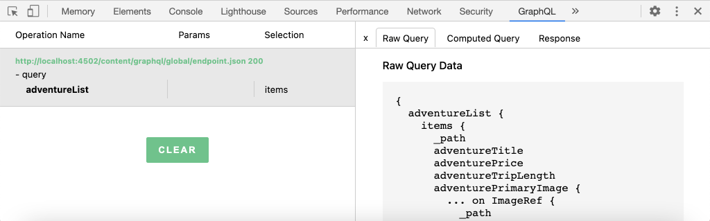

# Requête AEM à l’aide de GraphQL à partir d’une application externe

Dans ce chapitre, nous étudions comment AEM API GraphQL peuvent être utilisées pour piloter l’expérience dans une application externe.

Ce didacticiel utilise une simple application React pour requête et afficher le contenu Aventure exposé par AEM API GraphQL. L&#39;utilisation de React n&#39;a guère d&#39;importance, et l&#39;application externe consommatrice pourrait être écrite dans n&#39;importe quel cadre pour n&#39;importe quelle plate-forme.

## Conditions préalables

Il s&#39;agit d&#39;un didacticiel en plusieurs parties et on suppose que les étapes décrites dans les parties précédentes ont été terminées.

_Les captures d&#39;écran IDE de ce chapitre proviennent du code  [Visual Studio](https://code.visualstudio.com/)_

Vous pouvez éventuellement installer une extension de navigateur telle que [GraphQL Network](https://chrome.google.com/webstore/detail/graphql-network/igbmhmnkobkjalekgiehijefpkdemocm) pour pouvoir vue plus de détails sur une requête GraphQL.

## Objectifs

Dans ce chapitre, nous apprendrons à :

* Début et compréhension des fonctionnalités de l’exemple d’application React
* Découvrez comment les appels sont effectués depuis l&#39;application externe vers AEM points de terminaison GraphQL
* Définir une requête GraphQL pour filtrer une liste d&#39;aventures Fragments de contenu par activité
* Mettez à jour l&#39;application React pour fournir des contrôles à filtrer via GraphQL, la liste des aventures par activité.

## Début de l’application React

Dans la mesure où ce chapitre porte sur le développement d’un client pour consommer des fragments de contenu par rapport à GraphQL, l’exemple de code source de l’application [WKND GraphQL React doit être téléchargé et configuré](./setup.md#react-app) sur votre ordinateur local, et le [SDK AEM s’exécute en tant que service d’auteur](./setup.md#aem-sdk) avec l’[exemple de site WKND installé](./setup.md#wknd-site).

Le démarrage de l&#39;application React est décrit plus en détail dans le chapitre [Configuration rapide](./setup.md), mais les instructions abrégées peuvent être suivies :

1. Si ce n’est déjà fait, cloner l’exemple d’application WKND GraphQL React de [Github.com](https://github.com/adobe/aem-guides-wknd-graphql)

   ```shell
   $ git clone --branch tutorial/react git@github.com:adobe/aem-guides-wknd-graphql.git
   ```

1. Ouvrez l&#39;application WKND GraphQL React dans votre IDE.

   

1. Dans la ligne de commande, accédez au dossier `react-app`
1. Début de l&#39;application WKND GraphQL React en exécutant la commande suivante à partir de la racine du projet (dossier `react-app`)

   ```shell
   $ cd aem-guides-wknd-graphql/react-app
   $ npm start
   ```

1. Consultez l’application à l’adresse [http://localhost:3000/](http://localhost:3000/). L&#39;exemple d&#39;application React comporte deux parties principales :

   * L&#39;expérience personnelle sert d&#39;index de WKND Adventures, en interrogeant __Adventure__ Content Fragments in AEM à l&#39;aide de GraphQL. Dans ce chapitre, nous allons modifier cette vue pour prendre en charge le filtrage des aventures par activité.

      

   * L’expérience des détails de l’aventure, utilise GraphQL pour requête du fragment de contenu __Aventure__ spécifique et affiche davantage de points de données.

      

1. Utilisez les outils de développement du navigateur et une extension de navigateur telle que [GraphQL Network](https://chrome.google.com/webstore/detail/graphql-network/igbmhmnkobkjalekgiehijefpkdemocm) pour inspecter les requêtes GraphQL envoyées à AEM et leurs réponses JSON. Cette approche peut être utilisée pour surveiller les demandes et réponses GraphQL afin de s’assurer qu’elles sont formulées correctement et que leurs réponses sont conformes aux attentes.

   

   *Requête GraphQL envoyée à AEM à partir de l’application React*

   

   *Réponse JSON de l’AEM à l’application React*

   Les requêtes et la réponse doivent correspondre à ce qui était visible dans l&#39;IDE GraphiQL.

   >[!NOTE]
   >
   > Au cours du développement, l’application React est configurée pour envoyer par proxy des requêtes HTTP via le serveur de développement webpack vers AEM. L’application React envoie des requêtes à `http://localhost:3000` qui les envoie par proxy au service Auteur AEM s’exécutant sur `http://localhost:4502`. Consultez le fichier `src/setupProxy.js` et `env.development` pour plus de détails.
   >
   > Dans les scénarios autres que le développement, l’application React serait configurée directement pour envoyer des demandes à AEM.

## Explorez le code GraphQL de l’application

1. Dans votre IDE, ouvrez le fichier `src/api/useGraphQL.js`.

   Il s’agit d’un [Hook d’effet de réaction](https://reactjs.org/docs/hooks-overview.html#effect-hook) qui écoute les modifications apportées à `query` de l’application. Une fois la modification effectuée, une requête de POST HTTP est envoyée au point de terminaison AEM GraphQL et renvoie la réponse JSON à l’application.

   Chaque fois que l&#39;application React doit effectuer une requête GraphQL, elle appelle ce hook personnalisé `useGraphQL(query)`, en transmettant le GraphQL à AEM.

   Ce Hook utilise le module `fetch` simple pour effectuer la requête GraphQL du POST HTTP, mais d&#39;autres modules tels que le client [Apollo GraphQL](https://www.apollographql.com/docs/react/) peuvent être utilisés de la même façon.

1. Ouvrez `src/components/Adventures.js` dans l&#39;IDE, qui est responsable de la liste des aventures de la vue d&#39;accueil, et passez en revue l&#39;appel du hook `useGraphQL`.

   Ce code définit `query` par défaut comme `allAdventuresQuery`, comme défini plus bas dans ce fichier.

   ```javascript
   const [query, setQuery] = useState(allAdventuresQuery);
   ```

   ... et chaque fois que la variable `query` change, le hook `useGraphQL` est appelé, ce qui exécute à son tour la requête GraphQL par rapport à AEM, renvoyant le JSON à la variable `data`, qui est ensuite utilisée pour effectuer la liste des aventures.

   ```javascript
   const { data, errorMessage } = useGraphQL(query);
   ```

   `allAdventuresQuery` est une requête GraphQL constante définie dans le fichier, qui requête tous les fragments de contenu d&#39;aventure, sans aucun filtrage, et ne renvoie que les points de données doivent rendre la vue d&#39;accueil.

   ```javascript
   const allAdventuresQuery = `
   {
       adventureList {
         items {
           _path
           adventureTitle
           adventurePrice
           adventureTripLength
           adventurePrimaryImage {
           ... on ImageRef {
               _path
               mimeType
               width
               height
             }
           }
         }
     }
   }
   `;
   ```

1. Ouvrez `src/components/AdventureDetail.js`, le composant Réagir responsable de l&#39;affichage des détails de l&#39;aventure. Cette vue demande un fragment de contenu spécifique, en utilisant son chemin d’accès JCR comme identifiant unique, et effectue le rendu des détails fournis.

   De même que `Adventures.js`, le Hook de réaction personnalisé `useGraphQL` est réutilisé pour exécuter cette requête GraphQL par rapport à AEM.

   Le chemin d’accès du fragment de contenu est collecté à partir du `props` haut du composant pour spécifier le fragment de contenu à requête.

   ```javascript
   const contentFragmentPath = props.location.pathname.substring(props.match.url.length);
   ```

   ... et la requête paramétrée GraphQL est construite à l&#39;aide de la fonction `adventureDetailQuery(..)` et transmise à `useGraphQL(query)` qui exécute la requête GraphQL par rapport à AEM et renvoie les résultats à la variable `data`.

   ```javascript
   const { data, errorMessage } = useGraphQL(adventureDetailQuery(contentFragmentPath));
   ```

   La fonction `adventureDetailQuery(..)` encapsule simplement une requête GraphQL de filtrage, qui utilise la syntaxe AEM `<modelName>ByPath` pour requête un fragment de contenu unique identifié par son chemin JCR, et renvoie tous les points de données spécifiés requis pour rendre les détails de l&#39;aventure.

   ```javascript
   function adventureDetailQuery(_path) {
   return `{
       adventureByPath (_path: "${_path}") {
         item {
           _path
           adventureTitle
           adventureActivity
           adventureType
           adventurePrice
           adventureTripLength
           adventureGroupSize
           adventureDifficulty
           adventurePrice
           adventurePrimaryImage {
               ... on ImageRef {
               _path
               mimeType
               width
               height
               }
           }
           adventureDescription {
               html
           }
           adventureItinerary {
               html
           }
         }
       }
   }
   `;
   }
   ```

## Création d’une requête GraphQL paramétrée

Ensuite, nous allons modifier l&#39;application React pour effectuer des requêtes GraphQL paramétrées et filtrées qui restreignent la vue domestique par l&#39;activité des aventures.

1. Dans votre IDE, ouvrez le fichier : `src/components/Adventures.js`. Ce fichier représente le composant aventures de l&#39;expérience personnelle, qui requête et affiche les cartes Aventures.
1. Inspect la fonction `filterQuery(activity)`, qui n&#39;est pas utilisée, mais a été préparé à formuler une requête GraphQL qui filtres les aventures par `activity`.

   Notez que le paramètre `activity` est injecté dans la requête GraphQL dans le cadre d&#39;un `filter` sur le champ `adventureActivity`, ce qui nécessite que la valeur de ce champ corresponde à la valeur du paramètre.

   ```javascript
   function filterQuery(activity) {
       return `
           {
           adventures (filter: {
               adventureActivity: {
               _expressions: [
                   {
                   value: "${activity}"
                   }
                 ]
               }
           }){
               items {
               _path
               adventureTitle
               adventurePrice
               adventureTripLength
               adventurePrimaryImage {
               ... on ImageRef {
                   _path
                   mimeType
                   width
                   height
               }
               }
             }
         }
       }
       `;
   }
   ```

1. Mettez à jour l&#39;instruction `return` du composant React Adventures pour ajouter des boutons qui appellent le nouveau paramètre `filterQuery(activity)` pour fournir les aventures à la liste.

   ```javascript
   function Adventures() {
       ...
       return (
           <div className="adventures">
   
           {/* Add these three new buttons that set the GraphQL query accordingly */}
   
           {/* The first button uses the default `allAdventuresQuery` */}
           <button onClick={() => setQuery(allAdventuresQuery)}>All</button>
   
           {/* The 2nd and 3rd button use the `filterQuery(..)` to filter by activity */}
           <button onClick={() => setQuery(filterQuery('Camping'))}>Camping</button>
           <button onClick={() => setQuery(filterQuery('Surfing'))}>Surfing</button>
   
           <ul className="adventure-items">
           ...
       )
   }
   ```

1. Enregistrez les modifications et rechargez l’application React dans le navigateur Web. Les trois nouveaux boutons s&#39;affichent en haut de l&#39;écran, et un clic sur ces boutons revient automatiquement à l&#39;requête des fragments de contenu d&#39;aventure avec l&#39;activité correspondante.

   

1. Essayez d’ajouter d’autres boutons de filtrage pour les activités : `Rock Climbing`, `Cycling` et `Skiing`

## Gestion des erreurs GraphQL

GraphQL est fortement tapé et peut donc renvoyer des messages d&#39;erreur utiles si la requête n&#39;est pas valide. Ensuite, simulons une requête incorrecte pour afficher le message d’erreur renvoyé.

1. Ouvrez de nouveau le fichier `src/api/useGraphQL.js`. Inspect le fragment de code suivant pour afficher la gestion des erreurs :

   ```javascript
   //useGraphQL.js
   .then(({data, errors}) => {
           //If there are errors in the response set the error message
           if(errors) {
               setErrors(mapErrors(errors));
           }
           //Otherwise if data in the response set the data as the results
           if(data) {
               setData(data);
           }
       })
       .catch((error) => {
           setErrors(error);
       });
   ```

   La réponse est inspectée pour vérifier si elle contient un objet `errors`. L&#39;objet `errors` est envoyé par AEM en cas de problème avec la requête GraphQL, tel qu&#39;un champ non défini basé sur le schéma. S&#39;il n&#39;y a pas d&#39;objet `errors`, `data` est défini et renvoyé.

   `window.fetch` inclut une instruction `.catch` à *catch* toute erreur courante telle qu&#39;une requête HTTP non valide ou si la connexion au serveur ne peut pas être effectuée.

1. Ouvrez le fichier `src/components/Adventures.js`.
1. Modifiez `allAdventuresQuery` pour inclure une propriété non valide `adventurePetPolicy` :

   ```javascript
   /**
    * Query for all Adventures
    * adventurePetPolicy has been added beneath items
   */
   const allAdventuresQuery = `
   {
       adventureList {
         items {
           adventurePetPolicy
           _path
           adventureTitle
           adventurePrice
           adventureTripLength
           adventurePrimaryImage {
           ... on ImageRef {
               _path
               mimeType
               width
               height
           }
           }
         }
       }
   }
   `;
   ```

   Nous savons que `adventurePetPolicy` ne fait pas partie du modèle Aventure, ce qui devrait déclencher une erreur.

1. Enregistrez les modifications et revenez au navigateur. Vous devriez voir un message d’erreur comme suit :

   

   L&#39;API GraphQL détecte que `adventurePetPolicy` n&#39;est pas défini dans `AdventureModel` et renvoie un message d&#39;erreur approprié.

1. Inspect la réponse de l’AEM à l’aide des outils de développement du navigateur pour afficher l’objet JSON `errors` :

   

   L&#39;objet `errors` est détaillé et contient des informations sur l&#39;emplacement de la requête incorrecte et la classification de l&#39;erreur.

1. Revenez à `Adventures.js` et annulez la modification de la requête pour rétablir l’état correct de l’application.

## Félicitations!{#congratulations}

Félicitations ! Vous avez exploré avec succès le code de l&#39;exemple d&#39;application WKND GraphQL React et l&#39;avez mis à jour pour utiliser des requêtes GraphQL paramétrées et filtrant les  GraphQL aux aventures de liste par activité ! Vous avez également la possibilité d’explorer certaines fonctions de gestion des erreurs de base.

## Étapes suivantes {#next-steps}

Dans le chapitre suivant, [Modélisation avancée des données avec les références de fragment](./fragment-references.md) vous apprendrez comment utiliser la fonction Référence de fragment pour créer une relation entre deux fragments de contenu différents. Vous apprendrez également à modifier une requête GraphQL pour inclure un champ à partir d’un modèle référencé.
