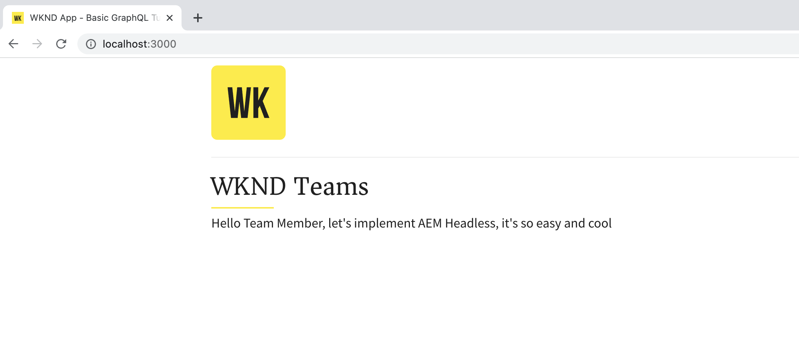
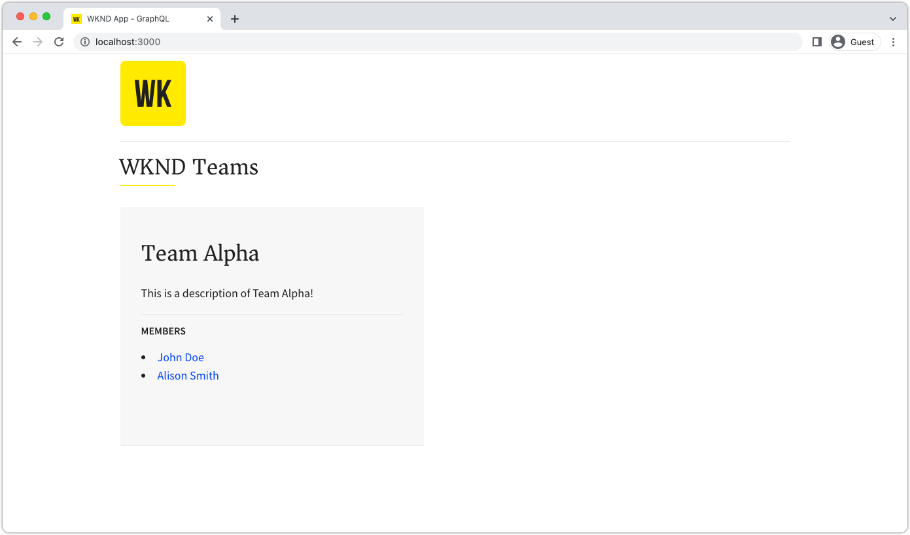
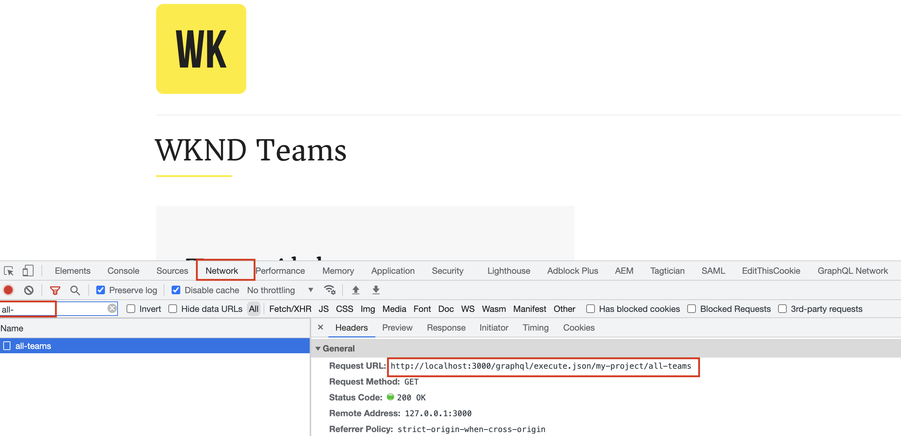

# Créer une application React qui utilise les API GraphQL d’AEM

Dans ce chapitre, vous découvrirez comment les API GraphQL d’AEM peuvent piloter l’expérience dans une application externe.

Une application React simple est utilisée pour interroger et afficher du contenu **Équipe** et **Personne** exposé par les API GraphQL d’AEM. L’utilisation de React n’est pas vraiment importante, et l’application externe consommatrice peut être écrite dans n’importe quel framework pour n’importe quelle plateforme.

## Prérequis

Nous partons du principe que les étapes décrites dans les parties précédentes de ce tutoriel en plusieurs parties ont été terminées, ou que [basic-tutorial-solution-content.zip](assets/explore-graphql-api/basic-tutorial-solution.content.zip) est installé sur vos services de création et de publication d’AEM as a Cloud Service.

_Les captures d’écran de l’IDE de ce chapitre proviennent de [Visual Studio Code](https://code.visualstudio.com/)_.

Les logiciels suivants doivent être installés :

- [Node.js v18](https://nodejs.org/fr)
- [Visual Studio Code](https://code.visualstudio.com/)

## Objectifs

Découvrez comment :

- télécharger et démarrer l’exemple d’application React ;
- interroger les points d’entrée GraphQL d’AEM à l’aide du [SDK JS d’AEM Headless](https://github.com/adobe/aem-headless-client-js) ;
- interroger AEM concernant une liste d’équipes et de leurs personnes membres référencées ;
- interroger AEM concernant les détails d’une personne membre de l’équipe.

## Obtenir l’exemple d’application React

Dans ce chapitre, un exemple d’application React qui fait l’objet d’un bouchon est implémenté avec le code requis pour interagir avec l’API GraphQL d’AEM, et afficher les données de l’équipe et de la personne obtenues de leur part.

Le code source de l’exmple d’application React est disponible sur Github.com à l’adresse <https://github.com/adobe/aem-guides-wknd-graphql/tree/main/basic-tutorial>.

Pour obtenir l’application React :

1. Clonez l’exemple d’application React GraphQL WKND à partir de [Github.com](https://github.com/adobe/aem-guides-wknd-graphql).

   ```shell
   $ cd ~/Code
   $ git clone git@github.com:adobe/aem-guides-wknd-graphql.git
   ```

1. Accédez au fichier `basic-tutorial` et ouvrez-le dans votre IDE.

   ```shell
   $ cd ~/Code/aem-guides-wknd-graphql/basic-tutorial
   $ code .
   ```

   

1. Mettez à jour `.env.development` pour vous connecter au service de publication d’AEM as a Cloud Service.

   - Définissez la valeur de `REACT_APP_HOST_URI` sur votre URL d’instance de publication AEM as Cloud Service (par exemple, `REACT_APP_HOST_URI=https://publish-p123-e456.adobeaemcloud.com`) et la valeur de `REACT_APP_AUTH_METHOD` sur `none`.

   >[!NOTE]
   >
   > Assurez-vous que vous avez publié la configuration du projet, les modèles de fragment de contenu, les fragments de contenu créés, les points d’entrée GraphQL et les requêtes persistantes des étapes précédentes.
   >
   > Si vous avez effectué les étapes ci-dessus sur le SDK local de création d’AEM, vous pouvez définir la valeur de `http://localhost:4502` et `REACT_APP_AUTH_METHOD` sur `basic`.


1. À partir de la ligne de commande, accédez au fichier `aem-guides-wknd-graphql/basic-tutorial`.

1. Démarrer l’application React

   ```shell
   $ cd ~/Code/aem-guides-wknd-graphql/basic-tutorial
   $ npm install
   $ npm start
   ```

1. L’application React démarre en mode de développement sur [http://localhost:3000/](http://localhost:3000/). Les modifications apportées à l’application React tout au long du tutoriel sont répercutées immédiatement.



>[!IMPORTANT]
>
>   Cette application React est partiellement implémentée. Suivez les étapes de ce tutoriel pour terminer la mise en œuvre. Les fichiers JavaScript qui doivent être implémentés comportent les commentaires suivants. Veillez à ajouter ou mettre à jour le code dans ces fichiers avec le code spécifié dans ce tutoriel.
>
>
> //*********************************
>
>  // Tâche : implémentez ceci en suivant les étapes du tutoriel sur AEM Headless.
>
>  //*********************************
>

## Anatomie de l’application React

L’exemple d’application React comporte trois parties principales :

1. Le dossier `src/api` contient les fichiers utilisés pour effectuer des requêtes GraphQL à AEM.
   - `src/api/aemHeadlessClient.js` initialise et exporte le client AEM Headless utilisé pour communiquer avec AEM.
   - `src/api/usePersistedQueries.js` implémente les données de renvoi des [hooks React personnalisés](https://react.dev/learn/reusing-logic-with-custom-hooks#custom-hooks-sharing-logic-between-components) depuis GraphQL d’AEM vers les composants d’affichage `Teams.js` et `Person.js`.

1. Le fichier `src/components/Teams.js` affiche une liste des équipes et de leurs personnes membres à l’aide d’une requête de liste.
1. Le fichier `src/components/Person.js` affiche les détails d’une seule personne à l’aide d’une requête paramétrée à résultat unique.

## Vérifier l’objet AEM Headless

Consultez le fichier `aemHeadlessClient.js` pour savoir comment créer l’objet `AEMHeadless` utilisé pour communiquer avec AEM.

1. Ouvrez `src/api/aemHeadlessClient.js`.

1. Vérifiez les lignes 1 à 40 :

   - L’importation de la déclaration `AEMHeadless` depuis le [client AEM Headless pour JavaScript](https://github.com/adobe/aem-headless-client-js), ligne 11.

   - La configuration de l’autorisation en fonction de variables définies dans `.env.development`, lignes 14 à 22, et l’expression de fonction de flèche `setAuthorization`, lignes 31 à 40.

   - La configuration `serviceUrl` pour la configuration de [proxy de développement](https://github.com/adobe/aem-guides-wknd-graphql/tree/main/react-app#proxy-api-requests) inclue, ligne 27.

1. Les lignes 42 à 49 sont les plus importantes, car elles instancient le client `AEMHeadless` et l’exportent pour l’utiliser dans l’application React.

```javascript
// Initialize the AEM Headless Client and export it for other files to use
const aemHeadlessClient = new AEMHeadless({
  serviceURL: serviceURL,
  endpoint: REACT_APP_GRAPHQL_ENDPOINT,
  auth: setAuthorization(),
});

export default aemHeadlessClient;
```

## Implémenter pour exécuter les requêtes persistantes GraphQL d’AEM

Pour mettre en œuvre la fonction `fetchPersistedQuery(..)` générique pour exécuter les requêtes persistantes GraphQL AEM, ouvrez le fichier `usePersistedQueries.js`. La fonction `fetchPersistedQuery(..)` utilise la fonction `runPersistedQuery()` de l’objet `aemHeadlessClient` pour exécuter la requête de manière asynchrone avec un comportement basé sur la promesse.

Plus tard, le hook personnalisé `useEffect` de React appelle cette fonction pour récupérer des données spécifiques d’AEM.

1. Dans `src/api/usePersistedQueries.js`, **mettez à jour** `fetchPersistedQuery(..)`, ligne 35, avec le code ci-dessous.

```javascript
/**
 * Private, shared function that invokes the AEM Headless client.
 *
 * @param {String} persistedQueryName the fully qualified name of the persisted query
 * @param {*} queryParameters an optional JavaScript object containing query parameters
 * @returns the GraphQL data or an error message
 */
async function fetchPersistedQuery(persistedQueryName, queryParameters) {
  let data;
  let err;

  try {
    // AEM GraphQL queries are asynchronous, either await their return or use Promise-based syntax
    const response = await aemHeadlessClient.runPersistedQuery(
      persistedQueryName,
      queryParameters
    );
    // The GraphQL data is stored on the response's data field
    data = response?.data;
  } catch (e) {
    // An error occurred, return the error messages
    err = e
      .toJSON()
      ?.map((error) => error.message)
      ?.join(", ");
    console.error(e.toJSON());
  }

  // Return the GraphQL and any errors
  return { data, err };
}
```

## Implémenter la fonctionnalité Équipes

Ensuite, développez la fonctionnalité pour afficher les équipes et leurs personnes membres sur la vue principale de l’application React. Cette fonctionnalité requiert :

- Un nouveau [hook personnalisé React useEffect](https://react.dev/reference/react/useEffect#useeffect) dans `src/api/usePersistedQueries.js` qui appelle la requête persistante `my-project/all-teams`, renvoyant une liste de fragments de contenu d’équipe dans AEM.
- Un composant React sous `src/components/Teams.js` qui appelle le nouveau hook personnalisé React `useEffect` et effectue le rendu des données des équipes.

Une fois l’opération terminée, la vue principale de l’application est renseignée avec les données de l’équipe provenant d’AEM.



### Étapes

1. Ouvrez `src/api/usePersistedQueries.js`.

1. Localiser la fonction `useAllTeams()`

1. Pour créer un hook `useEffect` qui appelle la requête persistante `my-project/all-teams` via `fetchPersistedQuery(..)`, ajoutez le code suivant. Le hook renvoie également uniquement les données appropriées de la réponse GraphQL d’AEM à `data?.teamList?.items`, ce qui permet aux composants de la vue React d’être indépendants des structures JSON parentes.

   ```javascript
   /**
    * Custom hook that calls the 'my-project/all-teams' persisted query.
    *
    * @returns an array of Team JSON objects, and array of errors
    */
   export function useAllTeams() {
     const [teams, setTeams] = useState(null);
     const [error, setError] = useState(null);
   
     // Use React useEffect to manage state changes
     useEffect(() => {
       async function fetchData() {
         // Call the AEM GraphQL persisted query named "my-project/all-teams"
         const { data, err } = await fetchPersistedQuery(
           "my-project/all-teams"
         );
         // Sets the teams variable to the list of team JSON objects
         setTeams(data?.teamList?.items);
         // Set any errors
         setError(err);
       }
       // Call the internal fetchData() as per React best practices
       fetchData();
     }, []);
   
     // Returns the teams and errors
     return { teams, error };
   }
   ```

1. Ouvrez `src/components/Teams.js`.

1. Dans le composant React `Teams`, récupérez la liste des équipes d’AEM à l’aide du hook `useAllTeams()`.

   ```javascript
   import { useAllTeams } from "../api/usePersistedQueries";
   ...
   function Teams() {
     // Get the Teams data from AEM using the useAllTeams
     const { teams, error } = useAllTeams();
     ...
   }
   ```


1. Effectuez la validation des données basées sur la vue en affichant un message d’erreur ou un indicateur de chargement en fonction des données renvoyées.

   ```javascript
   function Teams() {
     const { teams, error } = useAllTeams();
   
     // Handle error and loading conditions
     if (error) {
       // If an error ocurred while executing the GraphQL query, display an error message
       return <Error errorMessage={error} />;
     } else if (!teams) {
       // While the GraphQL request is executing, show the Loading indicator
       return <Loading />;
     }
     ...
   }
   ```

1. Enfin, effectuez le rendu des données des équipes. Chaque équipe renvoyée à partir de la requête GraphQL est rendue à l’aide du sous-composant React `Team` fourni.

   ```javascript
   import React from "react";
   import { Link } from "react-router-dom";
   import { useAllTeams } from "../api/usePersistedQueries";
   import Error from "./Error";
   import Loading from "./Loading";
   import "./Teams.scss";
   
   function Teams() {
     const { teams, error } = useAllTeams();
   
     // Handle error and loading conditions
     if (error) {
       return <Error errorMessage={error} />;
     } else if (!teams) {
       return <Loading />;
     }
   
     // Teams have been populated by AEM GraphQL query. Display the teams.
     return (
       <div className="teams">
         {teams.map((team, index) => {
           return <Team key={index} {...team} />;
         })}
       </div>
     );
   }
   
   // Render single Team
   function Team({ title, shortName, description, teamMembers }) {
     // Must have title, shortName and at least 1 team member
     if (!title || !shortName || !teamMembers) {
       return null;
     }
   
     return (
       <div className="team">
         <h2 className="team__title">{title}</h2>
         <p className="team__description">{description.plaintext}</p>
         <div>
           <h4 className="team__members-title">Members</h4>
           <ul className="team__members">
             {/* Render the referenced Person models associated with the team */}
             {teamMembers.map((teamMember, index) => {
               return (
                 <li key={index} className="team__member">
                   <Link to={`/person/${teamMember.fullName}`}>
                     {teamMember.fullName}
                   </Link>
                 </li>
               );
             })}
           </ul>
         </div>
       </div>
     );
   }
   
   export default Teams;
   ```


## Implémenter la fonctionnalité Personne

Une fois la [fonctionnalité Équipes](#implement-teams-functionality) implémentée, implémentez la fonctionnalité permettant de gérer l’affichage sur les détails d’un ou d’une membre de l’équipe, ou d’une personne.

Cette fonctionnalité requiert :

- Un nouveau [hook personnalisé React useEffect](https://react.dev/reference/react/useEffect#useeffect) dans `src/api/usePersistedQueries.js` qui appelle la requête persistante paramétrée `my-project/person-by-name`, et renvoie un enregistrement de personne unique.

- Un composant React sous `src/components/Person.js` qui utilise le nom complet d’une personne comme paramètre de requête, appelle le nouveau hook React personnalisé `useEffect` et effectue le rendu des données de la personne.

Une fois l’opération terminée, la sélection du nom d’une personne dans la vue Équipes affiche la vue de la personne.


1. Ouvrez `src/api/usePersistedQueries.js`.

1. Localiser la fonction `usePersonByName(fullName)`

1. Pour créer un hook `useEffect` qui appelle la requête persistante `my-project/all-teams` via `fetchPersistedQuery(..)`, ajoutez le code suivant. Le hook renvoie également uniquement les données appropriées de la réponse GraphQL d’AEM à `data?.teamList?.items`, ce qui permet aux composants de la vue React d’être indépendants des structures JSON parentes.

   ```javascript
   /**
    * Calls the 'my-project/person-by-name' and provided the {fullName} as the persisted query's `name` parameter.
    *
    * @param {String!} fullName the full
    * @returns a JSON object representing the person
    */
   export function usePersonByName(fullName) {
     const [person, setPerson] = useState(null);
     const [errors, setErrors] = useState(null);
   
     useEffect(() => {
       async function fetchData() {
         // The key is the variable name as defined in the persisted query, and may not match the model's field name
         const queryParameters = { name: fullName };
   
         // Invoke the persisted query, and pass in the queryParameters object as the 2nd parameter
         const { data, err } = await fetchPersistedQuery(
           "my-project/person-by-name",
           queryParameters
         );
   
         if (err) {
           // Capture errors from the HTTP request
           setErrors(err);
         } else if (data?.personList?.items?.length === 1) {
           // Set the person data after data validation
           setPerson(data.personList.items[0]);
         } else {
           // Set an error if no person could be found
           setErrors(`Cannot find person with name: ${fullName}`);
         }
       }
       fetchData();
     }, [fullName]);
   
     return { person, errors };
   }
   ```

1. Ouvrez `src/components/Person.js`.
1. Dans le composant React `Person`, analysez le paramètre d’itinéraire `fullName`, et récupérez les données de la personne depuis AEM à l’aide du hook `usePersonByName(fullName)`.

   ```javascript
   import { useParams } from "react-router-dom";
   import { usePersonByName } from "../api/usePersistedQueries";
   ...
   function Person() {
     // Read the person's `fullName` which is the parameter used to query for the person's details
     const { fullName } = useParams();
   
     // Query AEM for the Person's details, using the `fullName` as the filtering parameter
     const { person, error } = usePersonByName(fullName);
     ...
   }
   ```

1. Effectuez la validation des données basée sur la vue, affichant un message d’erreur ou un indicateur de chargement en fonction des données renvoyées.

   ```javascript
   function Person() {
     // Read the person's `fullName` which is the parameter used to query for the person's details
     const { fullName } = useParams();
   
     // Query AEM for the Person's details, using the `fullName` as the filtering parameter
     const { person, error } = usePersonByName(fullName);
   
     // Handle error and loading conditions
     if (error) {
       return <Error errorMessage={error} />;
     } else if (!person) {
       return <Loading />;
     }
     ...
   }
   ```

1. Enfin, effectuez le rendu des données de la personne.

   ```javascript
   import React from "react";
   import { useParams } from "react-router-dom";
   import { usePersonByName } from "../api/usePersistedQueries";
   import { mapJsonRichText } from "../utils/renderRichText";
   import Error from "./Error";
   import Loading from "./Loading";
   import "./Person.scss";
   
   function Person() {
     // Read the person's `fullName` which is the parameter used to query for the person's details
     const { fullName } = useParams();
   
     // Query AEM for the Person's details, using the `fullName` as the filtering parameter
     const { person, error } = usePersonByName(fullName);
   
     // Handle error and loading conditions
     if (error) {
       return <Error errorMessage={error} />;
     } else if (!person) {
       return <Loading />;
     }
   
     // Render the person data
     return (
       <div className="person">
         
         <div className="person__occupations">
           {person.occupation.map((occupation, index) => {
             return (
               <span key={index} className="person__occupation">
                 {occupation}
               </span>
             );
           })}
         </div>
         <div className="person__content">
           <h1 className="person__full-name">{person.fullName}</h1>
           <div className="person__biography">
             {/* Use this utility to transform multi-line text JSON into HTML */}
             {mapJsonRichText(person.biographyText.json)}
           </div>
         </div>
       </div>
     );
   }
   
   export default Person;
   ```

## Essayer l’application

Vérifiez l’application [http://localhost:3000/](http://localhost:3000/) et cliquez sur les liens des _Membres_. Vous pouvez également ajouter d’autres équipes et/ou membres à l’équipe Alpha en ajoutant des fragments de contenu dans AEM.

>[!IMPORTANT]
>
>Pour vérifier les modifications apportées à votre mise en œuvre ou si vous ne parvenez pas à faire fonctionner l’application après les modifications ci-dessus, reportez-vous à la solution [basic-tutorial](https://github.com/adobe/aem-guides-wknd-graphql/tree/solution/basic-tutorial).

## Ce qui se passe

Ouvrez le **Outils de développement** > **Réseau** et _Filtrer_ pour `all-teams` requête. Remarquez la demande d’API GraphQL `/graphql/execute.json/my-project/all-teams` est contre `http://localhost:3000` et **NOT** contre la valeur de `REACT_APP_HOST_URI`, par exemple `<https://publish-pxxx-exxx.adobeaemcloud.com`. Les requêtes sont effectuées par rapport au domaine de l’application React, car la [configuration du proxy](https://create-react-app.dev/docs/proxying-api-requests-in-development/#configuring-the-proxy-manually) est activée à l’aide du module `http-proxy-middleware`.





Vérifiez le fichier principal `../setupProxy.js` et dans les fichiers `../proxy/setupProxy.auth.**.js`, notez la manière dont les chemins d’accès `/content` et `/graphql` sont traités par proxy et marqués comme n’étant pas une ressource statique.

```javascript
module.exports = function(app) {
  app.use(
    ['/content', '/graphql'],
  ...
```

Cependant, le proxy local n’est pas une option appropriée pour le déploiement en production et vous trouverez plus de détails dans la section _Déploiement en production_.

## Félicitations !{#congratulations}

Félicitations. Vous avez réussi à créer l’application React pour utiliser et afficher les données à partir des API GraphQL d’AEM dans le cadre d’un tutoriel de base.
