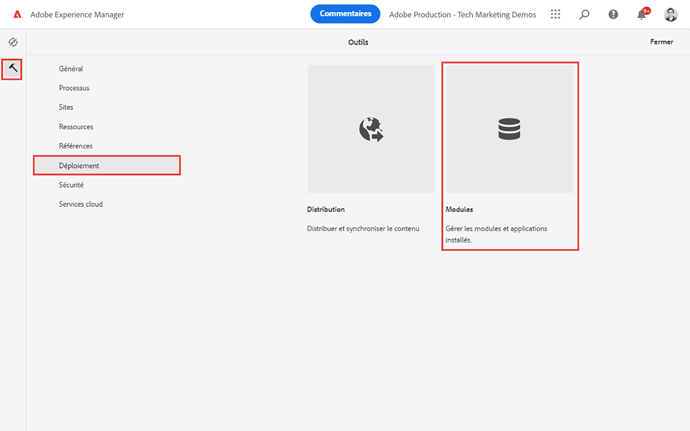
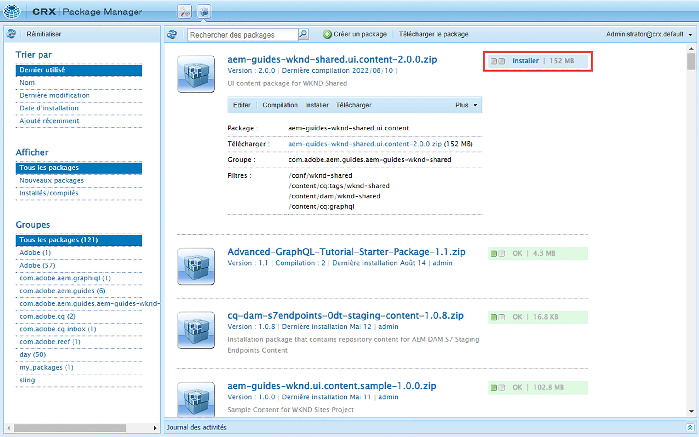

# Prise en main d’AEM Headless - GraphQL 

Tutoriel complet illustrant comment créer et exposer du contenu à l’aide des API GraphQL AEM et utilisé par une application externe, dans un scénario CMS sans interface.

Ce tutoriel explique comment AEM API GraphQL et les fonctionnalités sans tête peuvent être utilisées pour alimenter les expériences affichées dans une application externe.

Ce tutoriel abordera les sujets suivants :

* Création d’une configuration de projet
* Création de modèles de fragment de contenu pour modéliser les données
* Créez des fragments de contenu en fonction des modèles précédemment créés.
* Découvrez comment interroger les fragments de contenu dans AEM à l’aide de l’outil de développement GraphiQL intégré.
* Pour stocker ou conserver les requêtes GraphQL à AEM
* Utilisation de requêtes GraphQL persistantes à partir d’un exemple d’application React

## Prérequis {#prerequisites}

Pour suivre ce tutoriel, vous devez suivre les étapes suivantes :

* Compétences de base en HTML et JavaScript
* Les outils suivants doivent être installés localement :
   * [Node.js v10+](https://nodejs.org/en/)
   * [npm 6+](https://www.npmjs.com/)
   * [Git](https://git-scm.com/)
   * Un IDE (par exemple, [Microsoft® Visual Studio Code](https://code.visualstudio.com/))

### Environnement AEM

Un environnement Adobe Experience Manager est nécessaire pour terminer ce tutoriel. Vous pouvez utiliser l’un des éléments suivants (les captures d’écran sont enregistrées à partir d’un environnement as a Cloud Service AEM) :

* AEM environnement as a Cloud Service avec :
   * [Accès à AEM as a Cloud Service et Cloud Manager](/help/cloud-service/accessing/overview.md)
      * **Administrateur AEM** accès à AEM as a Cloud Service
      * **Cloud Manager - Développeur** accès à Cloud Manager
* [AEM local as a Cloud Service SDK de démarrage rapide](/help/cloud-service/local-development-environment/aem-runtime.md).
* [AEM 6.5.13+](https://experienceleague.adobe.com/docs/experience-manager-65/release-notes/release-notes.html?lang=fr)

### Installer un exemple de contenu {#install-sample-content}

Il peut s’avérer utile de disposer d’exemples de contenu déjà disponibles dans l’environnement AEM à utiliser comme référence.

1. Accédez au [AEM projet partagé WKND](https://github.com/adobe/aem-guides-wknd-shared/releases).
1. Téléchargez la dernière ressource publiée : `aem-guides-wknd-shared.ui.content-x.x.x.zip`.
1. Connectez-vous à l’environnement de création AEM à utiliser pour le tutoriel.
1. Dans l’écran de démarrage d’AEM, accédez à **Outils** > **Déploiement** > **Packages**:

   
1. Appuyer **Télécharger le module** et sélectionnez la variable `aem-guides-wknd-shared.ui.content-x.x.x.zip` téléchargé précédemment. Appuyer **Ok** pour charger.
1. Une fois le téléchargement du module terminé, appuyez sur **Installer** pour installer le contenu.

   

1. Des exemples de fragments de contenu, des modèles de fragment de contenu, des images, etc. seront installés pour la fiction [Marque WKND](https://wknd.site/). L’exemple de contenu sera référencé ultérieurement dans le tutoriel.

## Commençons !

1. Commencez le tutoriel par [Définition de modèles de fragment de contenu](content-fragment-models.md).

## Projet GitHub

Le code source et les packages de contenu sont disponibles sur la page [AEM Guides - Projet GitHub WKND GraphQL](https://github.com/adobe/aem-guides-wknd-graphql).

Si vous rencontrez un problème avec le tutoriel ou le code, veuillez laisser une [Problème GitHub](https://github.com/adobe/aem-guides-wknd-graphql/issues).

Vous trouverez des exemples de fragments de contenu, de modèles et de requêtes dans la section [AEM projet partagé WKND](https://github.com/adobe/aem-guides-wknd-shared)
