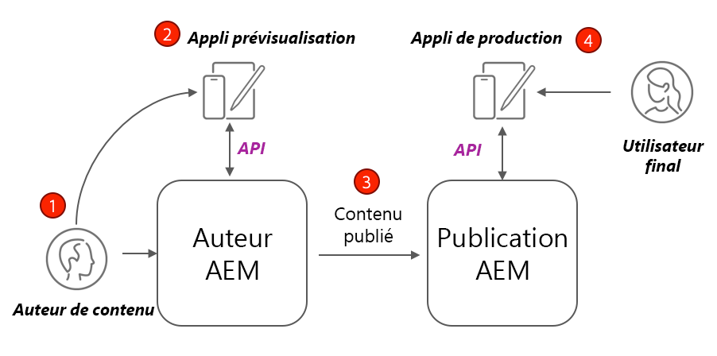
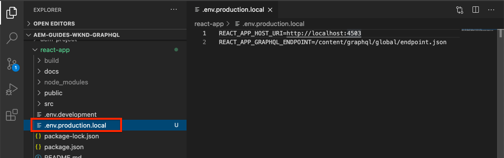

# Déploiement de production avec un service de publication AEM

Dans ce tutoriel, vous allez configurer un environnement local pour simuler la distribution de contenu d’une instance de création vers une instance de publication. Vous générerez également la mise en production d’une application React configurée pour utiliser le contenu de l’environnement de publication AEM à l’aide des API GraphQL. Vous apprendrez ainsi à utiliser efficacement les variables d’environnement et à mettre à jour les configurations CORS d’AEM.

## Prérequis

Ce tutoriel fait partie d’un tutoriel en plusieurs parties. Nous partons du principe que les étapes décrites dans les parties précédentes ont été terminées.

## Objectifs

Découvrez comment :

* Comprendre l’architecture de création et de publication AEM.
* Découvrez les bonnes pratiques de gestion des variables d’environnement.
* Découvrez comment configurer correctement AEM pour le partage de ressources entre origines mutliples (CORS).

## Modèle de déploiement de création et de publication {#deployment-pattern}

Un environnement AEM complet est constitué d’instances de création, de publication, et d’un Dispatcher. Le service de création permet aux utilisateurs et utilisatrices internes de créer, gérer et prévisualiser du contenu. Le service de publication est considéré comme l’environnement « actif » et c’est généralement avec lui que les utilisateurs et utilisatrices finaux interagissent. Le contenu, après avoir été modifié et approuvé sur le service de création, est distribué au service de publication.

Le modèle de déploiement le plus courant avec les applications découplées AEM est de connecter la version de production de l’application à un service de publication AEM.



Le diagramme ci-dessus illustre ce modèle courant de déploiement.

1. **Un auteur ou une autrice de contenu** utilise le service de création AEM pour créer, modifier et gérer du contenu.
2. L’**auteur de contenu** et d’autres utilisateurs internes peuvent prévisualiser le contenu directement dans le service de création. Une version de prévisualisation de l’application peut être configurée pour qu’elle se connecte au service de création.
3. Une fois que le contenu a été approuvé, il peut être **publié** auprès du service de publication AEM.
4. **Les utilisateurs et utilisatrices finaux** interagissent avec la version de production de l’application. L’application de production se connecte au service de publication et utilise les API GraphQL pour demander et consommer du contenu.

Le tutoriel simule le déploiement ci-dessus en ajoutant une instance de publication AEM à la configuration actuelle. Dans les chapitres précédents, l’application React agissait comme une prévisualisation en se connectant directement à l’instance de création. Une version de production de l’application React est déployée sur un serveur Node.js statique qui se connecte à la nouvelle instance de publication.

Finalement, trois serveurs locaux sont opérationnels :

* http://localhost:4502 - Instance de création
* http://localhost:4503 - Instance de publication
* http://localhost:5000 - Application React en mode production, connectée à l’instance de publication.

## Installer le SDK AEM - Mode de publication {#aem-sdk-publish}

Nous disposons actuellement d’une instance opérationnelle du SDK en mode de **création**. Le SDK peut également être lancé en mode de **Publication** pour simuler un environnement de publication AEM.

Un guide plus détaillé pour la configuration d’un environnement de développement local [est disponible ici](https://experienceleague.adobe.com/docs/experience-manager-learn/cloud-service/local-development-environment-set-up/overview.html?lang=fr#local-development-environment-set-up).

1. Sur votre système de fichiers local, créez un dossier dédié pour installer l’instance de publication, et nommez-le `~/aem-sdk/publish`.
1. Copiez le fichier jar de démarrage rapide utilisé pour l’instance de création dans les chapitres précédents et collez-le dans le répertoire `publish`. Vous pouvez également accéder au [Portail de distribution logicielle](https://experience.adobe.com/#/downloads/content/software-distribution/en/aemcloud.html?lang=fr) pour télécharger le dernier SDK et extraire le fichier jar de démarrage rapide.
1. Renommez le fichier jar `aem-publish-p4503.jar`.

   La chaîne `publish` indique que le fichier jar de démarrage rapide démarre en mode de publication. `p4503` indique que le serveur de démarrage rapide s’exécute sur le port 4503.

1. Ouvrez une nouvelle fenêtre de terminal et accédez au dossier contenant le fichier jar. Installez et démarrez l’instance AEM :

   ```shell
   $ cd ~/aem-sdk/publish
   $ java -jar aem-publish-p4503.jar
   ```

1. Fournissez un mot de passe d’administration en tant qu’`admin`. Tous les mots de passe d’administration sont acceptables, mais il est recommandé d’utiliser la valeur par défaut pour le développement local afin d’éviter des configurations supplémentaires.
1. Une fois l’installation de l’instance AEM terminée, une nouvelle fenêtre de navigateur s’ouvre à l’adresse [http://localhost:4503/content.html](http://localhost:4503/content.html).

   Une page 404 Introuvable doit être renvoyée. Il s’agit d’une toute nouvelle instance AEM et aucun contenu n’a été installé.

## Installer un exemple de contenu et des points d’entrées GraphQL {#wknd-site-content-endpoints}

Tout comme sur l’instance de création, les points d’entrée GraphQL doivent être activés pour l’instance de publication et un exemple de contenu est nécessaire. Installez ensuite le site de référence WKND sur l’instance de publication.

1. Téléchargez le dernier package AEM compilé pour le site WKND : [aem-guides-wknd.all-x.x.x.zip](https://github.com/adobe/aem-guides-wknd/releases/latest).

   >[!NOTE]
   >
   > Veillez à télécharger la version standard compatible avec AEM as a Cloud Service et **non pas** la version `classic`.

1. Connectez-vous à l’instance de publication en accédant directement à : [http://localhost:4503/libs/granite/core/content/login.html](http://localhost:4503/libs/granite/core/content/login.html) avec le nom d’utilisateur `admin` et le mot de passe `admin`.
1. Accédez ensuite au Gestionnaire de packages à l’adresse [http://localhost:4503/crx/packmgr/index.jsp](http://localhost:4503/crx/packmgr/index.jsp).
1. Cliquez sur **Charger le package** et sélectionnez le package WKND téléchargé à l’étape précédente. Cliquez sur **Installer** pour installer le package.
1. Après l’installation du package, le site de référence WKND est désormais disponible à l’adresse [http://localhost:4503/content/wknd/us/en.html](http://localhost:4503/content/wknd/us/en.html).
1. Déconnectez-vous en tant qu’utilisateur `admin` en cliquant sur le bouton « Se déconnecter » dans la barre de menus.

   

   Contrairement à l’instance de création AEM, les instances de publication AEM optent par défaut pour un accès anonyme en lecture seule. Nous voulons simuler l’expérience d’un utilisateur ou d’une utilisatrice anonyme lors de l’exécution de l’application React.

## Mettre à jour des variables d’environnement pour qu’elles pointent vers l’instance de publication {#react-app-publish}

Mettez ensuite à jour les variables d’environnement utilisées par l’application React pour qu’elles pointent vers l’instance de publication. L’application React doit **uniquement** se connecter à l’instance de publication en mode de production.

Ajoutez ensuite un nouveau fichier `.env.production.local` pour simuler l’expérience de production.

1. Ouvrez l’application React WKND GraphQL dans votre IDE.

1. Sous `aem-guides-wknd-graphql/react-app`, ajoutez un fichier nommé `.env.production.local`.
1. Remplissez `.env.production.local` avec les éléments suivants :

   ```plain
   REACT_APP_HOST_URI=http://localhost:4503
   REACT_APP_GRAPHQL_ENDPOINT=/content/graphql/global/endpoint.json
   ```

   

   L’utilisation de variables d’environnement facilite le basculement du point d’entrée GraphQL entre un environnement de création ou de publication sans ajouter de logique supplémentaire dans le code de l’application. Vous trouverez des informations supplémentaires sur les [variables d’environnement personnalisées pour React ici](https://create-react-app.dev/docs/adding-custom-environment-variables).

   >[!NOTE]
   >
   > Notez qu’aucune information d’authentification n’est incluse, car les environnements de publication permettent par défaut un accès anonyme au contenu.

## Déployer un serveur Node statique {#static-server}

L’application React peut être démarrée à l’aide du serveur Webpack, mais cela est réservé au développement uniquement. Simulez ensuite un déploiement en production en utilisant [serve](https://github.com/vercel/serve) pour héberger une version de production de l’application React à l’aide de Node.js.

1. Ouvrez une nouvelle fenêtre de terminal et accédez au répertoire `aem-guides-wknd-graphql/react-app`.

   ```shell
   $ cd aem-guides-wknd-graphql/react-app
   ```

1. Installez [serve](https://github.com/vercel/serve) avec la commande suivante :

   ```shell
   $ npm install serve --save-dev
   ```

1. Ouvrez le fichier `package.json` dans `react-app/package.json`. Ajoutez un script nommé `serve` :

   ```diff
    "scripts": {
       "start": "react-scripts start",
       "build": "react-scripts build",
       "test": "react-scripts test",
       "eject": "react-scripts eject",
   +   "serve": "npm run build && serve -s build"
   },
   ```

   Le script `serve` effectue deux actions. Tout d’abord, une version de production de l’application React est générée. Ensuite, le serveur Node.js démarre et utilise la version de production.

1. Revenez au terminal et saisissez la commande pour démarrer le serveur statique :

   ```shell
   $ npm run serve
   
   ┌────────────────────────────────────────────────────┐
   │                                                    │
   │   Serving!                                         │
   │                                                    │
   │   - Local:            http://localhost:5000        │
   │   - On Your Network:  http://192.168.86.111:5000   │
   │                                                    │
   │   Copied local address to clipboard!               │
   │                                                    │
   └────────────────────────────────────────────────────┘
   ```

1. Ouvrez un nouveau navigateur et accédez à [http://localhost:5000/](http://localhost:5000/). Vous devriez voir l’application React diffusée.

   

   Notez que la requête GraphQL fonctionne sur la page d’accueil. Inspectez la requête **XHR** à l’aide de vos outils de développement. Notez que la requête GraphQL POST se trouve sur l’instance de publication à `http://localhost:4503/content/graphql/global/endpoint.json`.

   Cependant, toutes les images sont endommagées sur la page d’accueil.

1. Cliquez sur l’une des pages Détails de l’Adventure.

   

   Notez qu’une erreur GraphQL est déclenchée pour `adventureContributor`. Dans les exercices suivants, les images endommagées et les problèmes de `adventureContributor` sont corrigés.

## Références d’images absolues {#absolute-image-references}

Les images apparaissent endommagées parce que l’attribut `` :

   ```diff
   - 
   + 
   ```

1. Ouvrez le fichier `AdventureDetail.js` dans `react-app/src/components/AdventureDetail.js`.
1. Répétez les mêmes étapes pour modifier la requête GraphQL et ajouter la propriété `_publishUrl` pour l’Adventure.

   ```diff
    adventureByPath (_path: "${_path}") {
       item {
           _path
           adventureTitle
           adventureActivity
           adventureType
           adventurePrice
           adventureTripLength
           adventureGroupSize
           adventureDifficulty
           adventurePrice
           adventurePrimaryImage {
               ... on ImageRef {
               _path
   +           _publishUrl
               mimeType
               width
               height
               }
           }
           adventureDescription {
               html
           }
           adventureItinerary {
               html
           }
           adventureContributor {
               fullName
               occupation
               pictureReference {
                   ...on ImageRef {
                       _path
   +                   _publishUrl
                   }
               }
           }
       }
       }
   } 
   ```

1. Modifiez les deux balises `` pour l’image principale de l’Adventure et la référence de l’image du contributeur dans `AdventureDetail.js` :

   ```diff
   /* AdventureDetail.js */
   ...
   
   ...
   pictureReference =  
   ```

1. Revenez au terminal et démarrez le serveur statique :

   ```shell
   $ npm run serve
   ```

1. Accédez à [http://localhost:5000/](http://localhost:5000/) et vous pourrez noter que des images apparaissent et que l’attribut `` pointe vers `http://localhost:4503`.

   

## Simuler la publication de contenu {#content-publish}

Pour rappel, une erreur GraphQL est déclenchée pour `adventureContributor` lorsqu’une page de détails sur l’Adventure est demandée. Le modèle de fragment de contenu **Contributeur** n’existe pas encore sur l’instance de publication. Les mises à jour apportées au modèle de fragment de contenu **Adventure** ne sont pas disponibles non plus sur l’instance de publication. Ces modifications ont été apportées directement à l’instance de création et doivent être distribuées à l’instance de publication.

Il faut en tenir compte lors du déploiement de nouvelles mises à jour d’une application qui dépend des mises à jour d’un fragment de contenu ou d’un modèle de fragment de contenu.

Ensuite, nous allons simuler la publication de contenu entre les instances locales de création et de publication.

1. Démarrez l’instance de création (si elle n’est pas déjà lancée) et accédez au gestionnaire de packages à l’adresse [http://localhost:4502/crx/packmgr/index.jsp](http://localhost:4502/crx/packmgr/index.jsp).
1. Téléchargez le package [EnableReplicationAgent.zip](./assets/publish-deployment/EnableReplicationAgent.zip) et installez-le à l’aide du gestionnaire de packages.

   Ce module installe une configuration qui permet à l’instance de création de publier du contenu vers l’instance de publication. Les étapes manuelles pour [cette configuration peuvent être trouvées ici](https://experienceleague.adobe.com/docs/experience-manager-learn/cloud-service/local-development-environment-set-up/aem-runtime.html?lang=fr#content-distribution).

   >[!NOTE]
   >
   > Dans un environnement AEM as a Cloud Service, le niveau de création est automatiquement configuré pour distribuer le contenu au niveau de publication.

1. À partir du menu **Démarrer AEM**, accédez à **Outils** > **Ressources** > **Modèles de fragment de contenu**.

1. Cliquez dans le dossier du **Site WKND**.

1. Sélectionnez les trois modèles et cliquez sur **Publier** :

   

   Une boîte de dialogue de confirmation apparaît, cliquez sur **Publier**.

1. Accédez au fragment de contenu Bali Surf Camp à l’adresse [http://localhost:4502/editor.html/content/dam/wknd/en/adventures/bali-surf-camp/bali-surf-camp](http://localhost:4502/editor.html/content/dam/wknd/fr/adventures/bali-surf-camp/bali-surf-camp).

1. Cliquez sur le bouton **Publier** dans la barre de menus supérieure.

   

1. L’assistant de publication affiche toutes les ressources dépendantes qui doivent être publiées. Dans ce cas, le fragment référencé **stacey-roswells** est listé et plusieurs images sont également référencées. Les ressources référencées sont publiées avec le fragment.

   

   Cliquez à nouveau sur le bouton **Publier** pour publier le fragment de contenu et les ressources dépendantes.

1. Revenez à l’application React s’exécutant à l’adresse [http://localhost:5000/](http://localhost:5000/). Vous pouvez maintenant cliquer dans l’Adventure Bali Surf Camp pour voir les détails de l’Adventure.

1. Revenez à l’instance de création AEM à [http://localhost:4502/editor.html/content/dam/wknd/en/adventures/bali-surf-camp/bali-surf-camp](http://localhost:4502/editor.html/content/dam/wknd/fr/adventures/bali-surf-camp/bali-surf-camp) et mettez à jour le **Titre** du fragment. Cliquez sur **Enregistrer et fermer** le fragment. Ensuite, cliquez sur **Publier** le fragment.
1. Retournez sur [http://localhost:5000/adventure:/content/dam/wknd/en/adventures/bali-surf-camp/bali-surf-camp](http://localhost:5000/adventure:/content/dam/wknd/fr/adventures/bali-surf-camp/bali-surf-camp) et observez les changements publiés.

   

## Mettre à jour la configuration CORS

AEM est sécurisé par défaut et ne permet pas aux propriétés web en dehors d’AEM de lancer des appels côté client. La configuration de partage de ressources entre origines multiples (CORS) d’AEM peut permettre à des domaines spécifiques d’effectuer des appels vers AEM.

Ensuite, effectuez des essais avec la configuration CORS de l’instance de publication AEM.

1. Revenez à la fenêtre du terminal où s’exécute l’application React avec la commande `npm run serve` :

   ```shell
   ┌────────────────────────────────────────────────────┐
   │                                                    │
   │   Serving!                                         │
   │                                                    │
   │   - Local:            http://localhost:5000        │
   │   - On Your Network:  http://192.168.86.205:5000   │
   │                                                    │
   │   Copied local address to clipboard!               │
   │                                                    │
   └────────────────────────────────────────────────────┘
   ```

   Notez que deux URL sont indiquées. Une utilisant `localhost` et une autre utilisant l’adresse IP du réseau local.

1. Accédez à l’adresse commençant par [http://192.168.86.XXX:5000](http://192.168.86.XXX:5000). L’adresse est légèrement différente pour chaque ordinateur local. Notez le déclenchement d’une erreur CORS lors de la récupération des données. Cela est dû au fait que la configuration CORS actuelle n’autorise que les requêtes provenant de `localhost`.

   

   Ensuite, mettez à jour la configuration CORS de l’instance de publication AEM pour autoriser les requêtes provenant de l’adresse IP du réseau.

1. Accédez à [http://localhost:4503/content/wknd/us/en/errors/sign-in.html](http://localhost:4503/content/wknd/us/en/errors/sign-in.html) et connectez-vous avec le nom d’utilisateur `admin` et le mot de passe `admin`.

1. Accédez à [http://localhost:4503/system/console/configMgr](http://localhost:4503/system/console/configMgr) et trouvez la configuration GraphQL de WKND à `com.adobe.granite.cors.impl.CORSPolicyImpl~wknd-graphql`.

1. Mettez à jour le champ **Origines autorisées** pour inclure l’adresse IP du réseau :

   

   Il est également possible d’inclure une expression régulière pour autoriser toutes les requêtes provenant d’un sous-domaine spécifique. Enregistrez les modifications.

1. Recherchez **Filtre de référent Apache Sling** et vérifiez la configuration. La configuration **Autoriser les champs vides** est également nécessaire pour activer les requêtes GraphQL provenant d’un domaine externe.

   

   Celles-ci ont été configurées dans le cadre du site de référence WKND. Vous pouvez consulter l’ensemble des configurations OSGi via [le référentiel GitHub](https://github.com/adobe/aem-guides-wknd/tree/master/ui.config/src/main/content/jcr_root/apps/wknd/osgiconfig).

   >[!NOTE]
   >
   > Les configurations OSGi sont gérées dans un projet AEM qui est soumis au contrôle de la source. Un projet AEM peut être déployé dans des environnements AEM as a Cloud Service à l’aide de Cloud Manager. L’[Archétype de projet AEM](https://github.com/adobe/aem-project-archetype) permet de générer un projet pour une implémentation spécifique.

1. Revenez à l’application React commençant par [http://192.168.86.XXX:5000](http://192.168.86.XXX:5000) et notez que l’application ne provoque plus d’erreur CORS.

   

## Félicitations. {#congratulations}

Félicitations. Vous avez à présent simulé un déploiement de production complet en utilisant un environnement de publication AEM. Vous avez également appris à utiliser la configuration CORS dans AEM.

## Autres ressources

Pour plus de détails sur les fragments de contenu et GraphQL, consultez les ressources suivantes :

* [Diffusion de contenu découplée à l’aide de fragments de contenu avec GraphQL.](https://experienceleague.adobe.com/docs/experience-manager-cloud-service/assets/content-fragments/content-fragments-graphql.html?lang=fr)
* [API GraphQL d’AEM à utiliser avec des fragments de contenu.](https://experienceleague.adobe.com/docs/experience-manager-cloud-service/assets/admin/graphql-api-content-fragments.html?lang=fr)
* [Authentification basée sur les jetons.](https://experienceleague.adobe.com/docs/experience-manager-learn/getting-started-with-aem-headless/authentication/overview.html?lang=fr#authentication)
* [Déploiement du code pour AEM as a Cloud Service.](https://experienceleague.adobe.com/docs/experience-manager-learn/cloud-service/cloud-manager/devops/deploy-code.html?lang=fr#cloud-manager)
