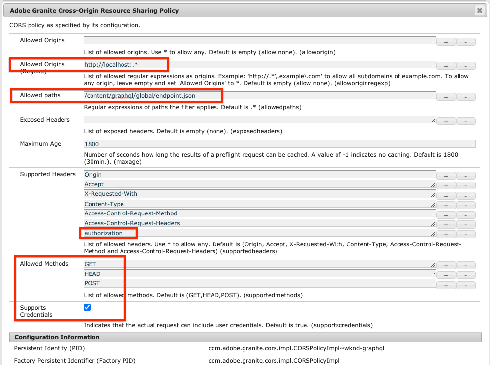

# Configuration rapide {#setup}

Ce chapitre présente la configuration rapide d’un environnement local pour voir une application externe consommer du contenu d’AEM à l’aide AEM API GraphQL. Les chapitres suivants du tutoriel serviront à créer cette configuration.

## Prérequis {#prerequisites}

Les outils suivants doivent être installés localement :

* [JDK 11](https://experience.adobe.com/#/downloads/content/software-distribution/en/general.html?1_group.propertyvalues.property=.%2Fjcr%3Acontent%2Fmetadata%2Fdc%3AsoftwareType&amp;1_group.properties.operation=equals&amp;1_group.properties.0_values=software-type%3Atooling&amp;fulltext=Oracle%7E+JDK%7E+11%7E&amp;orderby=%40jcr%3Acontent%2Fjcr%3AlastModified&amp;orderby.sort=desc&amp;layout=list&amp;p.offset=0&amp;p.limit=14)
* [Node.js v10+](https://nodejs.org/en/)
* [npm 6+](https://www.npmjs.com/)
* [Git](https://git-scm.com/)

## Objectifs {#objectives}

1. Téléchargez et installez le SDK AEM.
1. Téléchargez et installez un exemple de contenu à partir du site de référence WKND.
1. Téléchargez et installez un exemple d’application pour utiliser du contenu à l’aide des API GraphQL.

## Installation du SDK AEM {#aem-sdk}

Ce tutoriel utilise la méthode [AEM SDK as a Cloud Service](https://experienceleague.adobe.com/docs/experience-manager-cloud-service/implementing/developing/aem-as-a-cloud-service-sdk.html?lang=en#aem-as-a-cloud-service-sdk) pour explorer AEM API GraphQL. Cette section fournit un guide rapide pour l’installation du SDK AEM et son exécution en mode création. Un guide plus détaillé pour la configuration d’un environnement de développement local [peut être consulté ici](https://experienceleague.adobe.com/docs/experience-manager-learn/cloud-service/local-development-environment-set-up/overview.html?lang=fr#local-development-environment-set-up).

>[!NOTE]
>
> Il est également possible de suivre le tutoriel avec un environnement as a Cloud Service AEM. Des notes supplémentaires sur l’utilisation d’un environnement cloud sont incluses dans tout le tutoriel.

1. Accédez au **[Portail de distribution de logiciels](https://experience.adobe.com/#/downloads/content/software-distribution/en/aemcloud.html)** > **AEM as a Cloud Service** et télécharger la dernière version de la **AEM SDK**.

   

   >[!CAUTION]
   >
   > La fonctionnalité GraphQL est activée par défaut uniquement sur le SDK AEM à partir de la version 2021-02-04 ou ultérieure.

1. Décompressez le téléchargement et copiez le fichier JAR de démarrage rapide (`aem-sdk-quickstart-XXX.jar`) à un dossier dédié, c’est-à-dire `~/aem-sdk/author`.
1. Renommez le fichier jar en `aem-author-p4502.jar`.

   Le `author` name indique que le fichier Quickstart jar démarrera en mode création. Le `p4502` indique que le serveur de démarrage rapide s’exécutera sur le port 4502.

1. Ouvrez une nouvelle fenêtre de terminal et accédez au dossier contenant le fichier jar. Exécutez la commande suivante pour installer et démarrer l’instance AEM :

   ```shell
   $ cd ~/aem-sdk/author
   $ java -jar aem-author-p4502.jar
   ```

1. Indiquez un mot de passe administrateur en tant que `admin`. Tout mot de passe administrateur est acceptable, mais il est recommandé d’utiliser `admin` pour le développement local afin de réduire la nécessité de reconfigurer.
1. Au bout de quelques minutes, l’installation de l’instance AEM se termine et une nouvelle fenêtre de navigateur doit s’ouvrir à l’adresse [http://localhost:4502](http://localhost:4502).
1. Connexion avec le nom d’utilisateur `admin` et le mot de passe sélectionné lors AEM démarrage initial (généralement `admin`).

## Installation d’exemples de contenu et de points d’entrée GraphQL {#wknd-site-content-endpoints}

Exemple de contenu à partir du **Site de référence WKND** sera installé pour accélérer le tutoriel. Le WKND est une marque fictive de style de vie, souvent utilisée conjointement avec la formation AEM.

Le site de référence WKND comprend les configurations nécessaires pour exposer une [Point d’entrée GraphQL](https://experienceleague.adobe.com/docs/experience-manager-cloud-service/assets/admin/graphql-api-content-fragments.html?lang=en#graphql-aem-endpoint). Dans une mise en oeuvre concrète, suivez les étapes documentées pour [inclure les points d’entrée GraphQL ;](https://experienceleague.adobe.com/docs/experience-manager-cloud-service/assets/admin/graphql-api-content-fragments.html?lang=en#graphql-aem-endpoint) dans votre projet client. A [CORS](#cors-config) a également été compilé dans le cadre du site WKND. Une configuration CORS est nécessaire pour accorder l’accès à une application externe. Pour plus d’informations sur [CORS](#cors-config) Vous trouverez ci-dessous.

1. Téléchargez le dernier AEM compilé pour le site WKND : [aem-guides-wknd.all-x.x.x.zip](https://github.com/adobe/aem-guides-wknd/releases/latest).

   >[!NOTE]
   >
   > Veillez à télécharger la version standard compatible avec AEM as a Cloud Service et **not** la valeur `classic` version.

1. Dans la **AEM** Accédez à **Outils** > **Déploiement** > **Packages**.

   

1. Cliquez sur **Télécharger le module** et sélectionnez le package WKND téléchargé à l’étape précédente. Cliquez sur **Installer** pour installer le package.

1. Dans la **AEM** Accédez à **Ressources** > **Fichiers**.
1. Cliquez sur les dossiers pour accéder à **Site WKND** > **Anglais** > **Aventures**.

   

   Il s’agit d’un dossier de toutes les ressources qui composent les différentes aventures promues par la marque WKND. Cela inclut les types de médias traditionnels tels que les images et les vidéos, ainsi que les médias spécifiques aux AEM comme **Fragments de contenu**.

1. Cliquez dans le **Ski descendant Wyoming** et cliquez sur le bouton **Fragment de contenu Wyoming sur une piste de ski descendante** carte :

   

1. L’interface utilisateur de l’éditeur de fragments de contenu s’ouvre pour l’aventure du ski descendant au Wyoming.

   

   Observez que divers champs comme **Titre**, **Description**, et **Activité** définissez le fragment.

   **Fragments de contenu** sont l’une des façons de gérer le contenu dans AEM. Le fragment de contenu est un contenu réutilisable, indépendant de la présentation, composé d’éléments de données structurés tels que du texte, du texte enrichi, des dates ou des références à d’autres fragments de contenu. Les fragments de contenu seront détaillés plus loin dans le tutoriel.

1. Cliquez sur **Annuler** pour fermer le fragment. N’hésitez pas à naviguer dans certains des autres dossiers et à explorer les autres contenus Adventure.

>[!NOTE]
>
> Si vous utilisez un environnement de Cloud Service, consultez la documentation pour savoir comment [déployer une base de code telle que le site de référence WKND vers un environnement de Cloud Service ;](https://experienceleague.adobe.com/docs/experience-manager-cloud-service/implementing/deploying/overview.html?lang=en#coding-against-the-right-aem-version).

## Installation de l’exemple d’application{#sample-app}

L’un des objectifs de ce tutoriel consiste à montrer comment utiliser AEM contenu d’une application externe à l’aide des API GraphQL. Ce tutoriel utilise un exemple d’application React partiellement terminé pour accélérer le tutoriel. Les mêmes leçons et concepts s’appliquent aux applications créées avec iOS, Android ou toute autre plateforme. L’application React est intentionnellement simple, afin d’éviter toute complexité inutile ; il ne s’agit pas d’une mise en oeuvre de référence.

1. Ouvrez une nouvelle fenêtre de terminal et clonez une branche de démarrage de tutoriel à l’aide de Git :

   ```shell
   $ git clone --branch tutorial/react git@github.com:adobe/aem-guides-wknd-graphql.git
   ```

1. Dans l’IDE de votre choix, ouvrez le fichier . `.env.development` at `aem-guides-wknd-graphql/react-app/.env.development`. Vérifiez que la variable `REACT_APP_AUTHORIZATION` n’est pas commentée et que le fichier ressemble à ce qui suit :

   ```plain
   REACT_APP_HOST_URI=http://localhost:4502
   REACT_APP_GRAPHQL_ENDPOINT=/content/graphql/global/endpoint.json
   # Use Authorization when connecting to an AEM Author environment
   REACT_APP_AUTHORIZATION=admin:admin
   ```

   Assurez-vous que `React_APP_HOST_URI` correspond à votre instance d’AEM locale. Dans ce chapitre, nous allons connecter l’application React directement à l’AEM **Auteur** environnement. **Auteur** Par défaut, les environnements nécessitent une authentification. Par conséquent, notre application se connectera en tant que `admin` utilisateur. Il s’agit d’une pratique courante lors du développement, car elle nous permet d’apporter rapidement des modifications à l’environnement AEM et de les voir immédiatement répercutés dans l’application.

   >[!NOTE]
   >
   > Dans un scénario de production, l’application se connecte à un AEM **Publier** environnement. Cela est décrit plus en détail dans la section [Déploiement en production](production-deployment.md) chapitre.

1. Accédez au `aem-guides-wknd-graphql/react-app` dossier. Installez et démarrez l’application :

   ```shell
   $ cd aem-guides-wknd-graphql/react-app
   $ npm install
   $ npm start
   ```

1. Une nouvelle fenêtre de navigateur doit automatiquement lancer l’application à l’adresse [http://localhost:3000](http://localhost:3000).

   

   Une liste du contenu actuel de l&#39;aventure depuis AEM doit s&#39;afficher.

1. Cliquez sur l&#39;une des images de l&#39;aventure pour voir le détail de l&#39;aventure. Une demande est faite pour AEM de renvoyer les détails d’une aventure.

   

1. Utilisez les outils de développement du navigateur pour inspecter la variable **Réseau** requêtes. Afficher la variable **XHR** requêtes et observez plusieurs requêtes de POST à `/content/graphql/global/endpoint.json`, le point d’entrée GraphQL configuré pour AEM.

   

1. Vous pouvez également afficher les paramètres et la réponse JSON en examinant la requête réseau. Il peut s’avérer utile d’installer une extension de navigateur comme [Inspecteur réseau GraphQL](https://chrome.google.com/webstore/detail/graphql-network-inspector/ndlbedplllcgconngcnfmkadhokfaaln) pour Chrome afin de mieux comprendre la requête et la réponse.

## Modification d’un fragment de contenu

Maintenant que l’application React est en cours d’exécution, effectuez une mise à jour du contenu dans AEM et voyez la modification répercutée dans l’application.

1. Accédez à AEM [http://localhost:4502](http://localhost:4502).
1. Accédez à **Ressources** > **Fichiers** > **Site WKND** > **Anglais** > **Aventures** > **[Le camp de surf de Bali](http://localhost:4502/assets.html/content/dam/wknd/en/adventures/bali-surf-camp)**.

   

1. Cliquez dans le **Le camp de surf de Bali** fragment de contenu pour ouvrir l’éditeur de fragment de contenu.
1. Modifiez le **Titre** et le **Description** de l&#39;aventure

   

1. Cliquez sur **Enregistrer** pour enregistrer les modifications.
1. Revenez à l’application React à l’adresse [http://localhost:3000](http://localhost:3000) et actualisez pour afficher vos modifications :

   

## Installation de l’outil GraphiQL {#install-graphiql}

[GraphiQL](https://github.com/graphql/graphiql) est un outil de développement qui n’est nécessaire que dans les environnements de niveau inférieur tels qu’une instance de développement ou locale. L’IDE GraphiQL vous permet de tester et d’affiner rapidement les requêtes et les données renvoyées. GraphiQL permet également d’accéder facilement à la documentation, ce qui facilite l’apprentissage et la compréhension des méthodes disponibles.

1. Accédez au **[Portail de distribution de logiciels](https://experience.adobe.com/#/downloads/content/software-distribution/en/aemcloud.html)** > **AEM as a Cloud Service**.
1. Recherchez &quot;GraphiQL&quot; (veillez à inclure la variable **i** in **GraphiQL**.
1. Télécharger la dernière version **Package de contenu GraphiQL v.x.x.x**

   

   Le fichier zip est un package AEM qui peut être installé directement.

1. Dans la **AEM** Accédez à **Outils** > **Déploiement** > **Packages**.
1. Cliquez sur **Télécharger le module** et sélectionnez le package téléchargé à l’étape précédente. Cliquez sur **Installer** pour installer le package.

   
1. Accédez à l’IDE GraphiQL à l’adresse [http://localhost:4502/content/graphiql.html](http://localhost:4502/content/graphiql.html) et commencez à explorer les API GraphQL.

   >[!NOTE]
   >
   > L’outil GraphiQL et l’API GraphQL sont [exploré plus en détail plus loin dans le tutoriel](./explore-graphql-api.md).

## Félicitations ! {#congratulations}

Félicitations, vous disposez désormais d’une application externe qui consomme AEM contenu avec GraphQL. N’hésitez pas à examiner le code dans l’application React et à continuer à essayer de modifier les fragments de contenu existants.

## Étapes suivantes {#next-steps}

Dans le chapitre suivant, [Définition de modèles de fragment de contenu](content-fragment-models.md), découvrez comment modéliser du contenu et créer un schéma avec **Modèles de fragment de contenu**. Vous allez passer en revue les modèles existants et créer un nouveau modèle. Vous découvrirez également les différents types de données qui peuvent être utilisés pour définir un schéma dans le cadre du modèle.

## (bonus) Configuration de la norme CORS {#cors-config}

AEM, étant sécurisé par défaut, bloque les demandes d’origine croisée, empêchant les applications non autorisées de se connecter à son contenu et de le faire apparaître.

Pour permettre à l’application React de ce tutoriel d’interagir avec les points d’entrée de l’API GraphQL AEM, une configuration de partage de ressources d’origine croisée a été définie dans le projet de référence du site WKND.



Pour afficher la configuration déployée :

1. Accédez à la console web du SDK AEM à l’adresse [http://localhost:4502/system/console](http://localhost:4502/system/console).

   >[!NOTE]
   >
   > La console web n’est disponible que sur le SDK. Dans un environnement AEM as a Cloud Service, ces informations peuvent être visualisées via [Developer Console](https://experienceleague.adobe.com/docs/experience-manager-learn/cloud-service/debugging/debugging-aem-as-a-cloud-service/developer-console.html).

1. Dans le menu supérieur, cliquez sur **OSGI** > **Configuration** pour afficher toutes les [Configurations OSGi](http://localhost:4502/system/console/configMgr).
1. Faites défiler la page vers le bas **Partage des ressources cross-origin Adobe**.
1. Cliquez sur la configuration pour `com.adobe.granite.cors.impl.CORSPolicyImpl~wknd-graphql`.
1. Les champs suivants ont été mis à jour :
   * Origines autorisées (Regex) : `http://localhost:.*`
      * Permet toutes les connexions d’hôtes locales.
   * Chemins autorisés: `/content/graphql/global/endpoint.json`
      * Il s’agit du seul point d’entrée GraphQL actuellement configuré. En règle générale, les configurations des normes de qualité doivent être aussi restrictives que possible.
   * Méthodes autorisées : `GET`, `HEAD`, `POST`
      * Uniquement `POST` est requis pour GraphQL. Toutefois, les autres méthodes peuvent s’avérer utiles lors d’une interaction avec AEM sans interface utilisateur.
   * En-têtes pris en charge : **authorization** a été ajouté pour transmettre l’authentification de base dans l’environnement de création.
   * Prend en charge les informations d’identification : `Yes`
      * Cela est nécessaire, car notre application React communiquera avec les points d’entrée GraphQL protégés sur le service AEM Author.

Cette configuration et les points d’entrée GraphQL font partie du projet AEM WKND. Vous pouvez afficher toutes les [Configurations OSGi ici](https://github.com/adobe/aem-guides-wknd/tree/master/ui.config/src/main/content/jcr_root/apps/wknd/osgiconfig).
