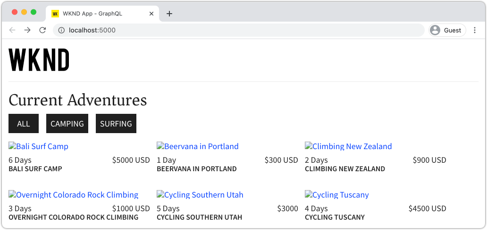

# Déploiement de la production avec un service de publication AEM

Dans ce didacticiel, vous allez configurer un environnement local pour simuler la diffusion du contenu d’une instance d’auteur vers une instance de publication. Vous allez également générer la création de production d’une application React configurée pour consommer du contenu de l’environnement de publication AEM à l’aide des API GraphQL. Vous apprendrez ainsi à utiliser efficacement les variables d&#39;environnement et à mettre à jour les configurations CORS AEM.

## Conditions préalables

Ce didacticiel fait partie d’un didacticiel en plusieurs parties. On suppose que les étapes décrites dans les parties précédentes ont été achevées.

## Objectifs

Découvrez comment :

* Comprendre l’architecture Auteur et Publication d’AEM.
* Découvrez les meilleures pratiques de gestion des variables d’environnement.
* Découvrez comment configurer correctement les AEM pour le partage de ressources entre Origines (CORS).

## Modèle de déploiement de publication d’auteur {#deployment-pattern}

Un environnement AEM complet est constitué d’un auteur, d’une publication et d’un répartiteur. Le service Auteur permet aux utilisateurs internes de créer, gérer et prévisualisation du contenu. Le service de publication est considéré comme l’environnement &quot;en direct&quot; et est généralement utilisé par les utilisateurs finaux. Le contenu, après avoir été modifié et approuvé sur le service Auteur, est distribué au service Publication.

Le modèle de déploiement le plus courant avec AEM applications sans en-tête consiste à faire en sorte que la version de production de l’application se connecte à un service de publication AEM.


Le diagramme ci-dessus illustre ce schéma de déploiement commun.

1. Un **auteur de contenu** utilise le service d’AEM auteur pour créer, modifier et gérer du contenu.
2. L’**auteur du contenu** et d’autres utilisateurs internes peuvent prévisualisation directement le contenu sur le service d’auteur. Il est possible de configurer une version Prévisualisation de l’application qui se connecte au service Auteur.
3. Une fois le contenu approuvé, il peut être **publié** au service de publication AEM.
4. **Les** utilisateurs finaux interagissent avec la version Production de l’application. L’application Production se connecte au service de publication et utilise les API GraphQL pour demander et consommer du contenu.

Le didacticiel simule le déploiement ci-dessus en ajoutant une instance AEM Publish à la configuration actuelle. Dans les chapitres précédents, l’application de réaction agissait comme une prévisualisation en se connectant directement à l’instance d’auteur. Une version de production de l’application React sera déployée sur un serveur Node.js statique qui se connecte à la nouvelle instance de publication.

Au final, trois serveurs locaux seront en cours d’exécution :

* http://localhost:4502 - Instance Auteur
* http://localhost:4503 - Instance de publication
* http://localhost:5000 - Réagissez à l’application en mode de production, en vous connectant à l’instance de publication.

## Installer AEM SDK - Mode de publication {#aem-sdk-publish}

Actuellement, nous avons une instance en cours d’exécution du SDK en mode **Auteur**. Le SDK peut également être démarré en mode **Publier** pour simuler un environnement de publication AEM.

Vous trouverez un guide plus détaillé pour la mise en place d&#39;un environnement de développement local [ici](https://experienceleague.adobe.com/docs/experience-manager-learn/cloud-service/local-development-environment-set-up/overview.html?lang=fr#local-development-environment-set-up).

1. Sur votre système de fichiers local, créez un dossier dédié pour installer l’instance de publication, c’est-à-dire `~/aem-sdk/publish`.
1. Copiez le fichier JAR Quickstart utilisé pour l’instance d’auteur dans les chapitres précédents et collez-le dans le répertoire `publish`. Vous pouvez également accéder au [portail de distribution de logiciels](https://experience.adobe.com/#/downloads/content/software-distribution/fr-FR/aemcloud.html) et télécharger le dernier SDK et extraire le fichier JAR de démarrage rapide.
1. Renommez le fichier jar en `aem-publish-p4503.jar`.

   La chaîne `publish` indique que le début JAR Quickstart est en mode Publication. `p4503` indique que le serveur Quickstart s&#39;exécute sur le port 4503.

1. Ouvrez une nouvelle fenêtre de terminal et accédez au dossier contenant le fichier jar. Installez et début l’instance AEM :

   ```shell
   $ cd ~/aem-sdk/publish
   $ java -jar aem-publish-p4503.jar
   ```

1. Indiquez un mot de passe administrateur sous la forme `admin`. Tout mot de passe d’administrateur est acceptable, mais il est recommandé d’utiliser la valeur par défaut pour le développement local afin d’éviter des configurations supplémentaires.
1. Une fois l’installation de l’instance AEM terminée, une nouvelle fenêtre du navigateur s’ouvre à l’adresse [http://localhost:4503/content.html](http://localhost:4503/content.html).

   Une page 404 introuvable devrait être renvoyée. Il s’agit d’une nouvelle instance AEM et aucun contenu n’a été installé.

## Installer un exemple de contenu et des points de terminaison GraphQL {#wknd-site-content-endpoints}

Comme sur l’instance d’auteur, les points de terminaison GraphQL doivent être activés pour l’instance de publication et un exemple de contenu doit être fourni. Installez ensuite le site de référence WKND sur l’instance de publication.

1. Téléchargez le dernier package d&#39;AEM compilé pour le site WKND : [aem-guides-wknd.all-x.x.x.zip](https://github.com/adobe/aem-guides-wknd/releases/latest).

   >[!NOTE]
   >
   > Veillez à télécharger la version standard compatible avec AEM en tant que Cloud Service et **non** la version `classic`.

1. Connectez-vous à l’instance de publication en accédant directement à : [http://localhost:4503/libs/granite/core/content/login.html](http://localhost:4503/libs/granite/core/content/login.html) avec le nom d’utilisateur `admin` et le mot de passe `admin`.
1. Accédez ensuite à Package Manager à l’adresse [http://localhost:4503/crx/packmgr/index.jsp](http://localhost:4503/crx/packmgr/index.jsp).
1. Cliquez sur **Télécharger le package** et choisissez le package WKND téléchargé à l’étape précédente. Cliquez sur **Installer** pour installer le package.
1. Après avoir installé le package, le site de référence WKND est maintenant disponible à l’adresse [http://localhost:4503/content/wknd/us/en.html](http://localhost:4503/content/wknd/us/en.html).
1. Déconnectez-vous en tant qu&#39;utilisateur `admin` en cliquant sur le bouton &quot;Se déconnecter&quot; dans la barre de menus.

   

   Contrairement à l’instance d’auteur AEM, les instances de publication AEM utilisent par défaut un accès anonyme en lecture seule. Nous voulons simuler l&#39;expérience d&#39;un utilisateur anonyme lors de l&#39;exécution de l&#39;application React.

## Mettez à jour les variables d’Environnement pour pointer l’instance de publication {#react-app-publish}

Ensuite, mettez à jour les variables d’environnement utilisées par l’application Réagir pour pointer vers l’instance de publication. L’application Réagir ne doit **se connecter** qu’à l’instance de publication en mode de production.

Ensuite, ajoutez un nouveau fichier `.env.production.local` pour simuler l’expérience de production.

1. Ouvrez l’application WKND GraphQL React dans votre IDE.

1. Sous `aem-guides-wknd-graphql/react-app`, ajoutez un fichier nommé `.env.production.local`.
1. Remplissez `.env.production.local` avec les éléments suivants :

   ```plain
   REACT_APP_HOST_URI=http://localhost:4503
   REACT_APP_GRAPHQL_ENDPOINT=/content/graphql/global/endpoint.json
   ```

   

   L’utilisation de variables d’environnement permet de basculer facilement le point de terminaison GraphQL entre un environnement d’auteur ou de publication sans ajouter de logique supplémentaire dans le code de l’application. Vous trouverez plus d&#39;informations sur [les variables d&#39;environnement personnalisées pour React ici](https://create-react-app.dev/docs/adding-custom-environment-variables).

   >[!NOTE]
   >
   > Notez qu’aucune information d’authentification n’est incluse, car les environnements de publication offrent un accès anonyme au contenu par défaut.

## Déploiement d’un serveur de noeud statique {#static-server}

L’application React peut être lancée à l’aide du serveur webpack, mais il s’agit uniquement de développement. Ensuite, simulez un déploiement de production en utilisant [serve](https://github.com/vercel/serve) pour héberger une version de production de l’application React à l’aide de Node.js.

1. Ouvrez une nouvelle fenêtre de terminal et accédez au répertoire `aem-guides-wknd-graphql/react-app`.

   ```shell
   $ cd aem-guides-wknd-graphql/react-app
   ```

1. Installez [serve](https://github.com/vercel/serve) avec la commande suivante :

   ```shell
   $ npm install serve --save-dev
   ```

1. Ouvrez le fichier `package.json` dans `react-app/package.json`. Ajoutez un script nommé `serve` :

   ```diff
    "scripts": {
       "start": "react-scripts start",
       "build": "react-scripts build",
       "test": "react-scripts test",
       "eject": "react-scripts eject",
   +   "serve": "npm run build && serve -s build"
   },
   ```

   Le script `serve` effectue deux actions. Tout d’abord, une version de production de l’application React est générée. Ensuite, le serveur Node.js début et utilise la compilation de production.

1. Revenez au terminal et saisissez la commande pour début au serveur statique :

   ```shell
   $ npm run serve
   
   ┌────────────────────────────────────────────────────┐
   │                                                    │
   │   Serving!                                         │
   │                                                    │
   │   - Local:            http://localhost:5000        │
   │   - On Your Network:  http://192.168.86.111:5000   │
   │                                                    │
   │   Copied local address to clipboard!               │
   │                                                    │
   └────────────────────────────────────────────────────┘
   ```

1. Ouvrez un nouveau navigateur et accédez à [http://localhost:5000/](http://localhost:5000/). Vous devriez voir l’application React diffusée.

   

   Notez que la requête GraphQL fonctionne sur la page d&#39;accueil. Inspect la demande **XHR** à l’aide de vos outils de développement. Observez que le POST GraphQL se trouve sur l’instance de publication à l’adresse `http://localhost:4503/content/graphql/global/endpoint.json`.

   Cependant, toutes les images sont cassées sur la page d&#39;accueil !

1. Cliquez sur l&#39;une des pages Détails de l&#39;aventure.

   

   Observez qu’une erreur GraphQL est générée pour `adventureContributor`. Dans les exercices suivants, les images endommagées et les problèmes `adventureContributor` sont corrigés.

## Références d’image absolue {#absolute-image-references}

Les images apparaissent rompues, car l&#39;attribut `` :

   ```diff
   - 
   + 
   ```

1. Ouvrez le fichier `AdventureDetail.js` dans `react-app/src/components/AdventureDetail.js`.
1. Répétez les mêmes étapes pour modifier la requête GraphQL et ajouter la propriété `_publishUrl` pour l&#39;aventure.

   ```diff
    adventureByPath (_path: "${_path}") {
       item {
           _path
           adventureTitle
           adventureActivity
           adventureType
           adventurePrice
           adventureTripLength
           adventureGroupSize
           adventureDifficulty
           adventurePrice
           adventurePrimaryImage {
               ... on ImageRef {
               _path
   +           _publishUrl
               mimeType
               width
               height
               }
           }
           adventureDescription {
               html
           }
           adventureItinerary {
               html
           }
           adventureContributor {
               fullName
               occupation
               pictureReference {
                   ...on ImageRef {
                       _path
   +                   _publishUrl
                   }
               }
           }
       }
       }
   } 
   ```

1. Modifiez les deux balises `` pour l&#39;image Principal aventure et la référence d&#39;image du contributeur dans `AdventureDetail.js` :

   ```diff
   /* AdventureDetail.js */
   ...
   
   ...
   pictureReference =  
   ```

1. Revenez au terminal et début du serveur statique :

   ```shell
   $ npm run serve
   ```

1. Accédez à [http://localhost:5000/](http://localhost:5000/) et observez que les images s’affichent et que l’attribut `` pointe vers `http://localhost:4503`.

   

## Simuler la publication de contenu {#content-publish}

Rappelez-vous qu’une erreur GraphQL est générée pour `adventureContributor` lorsqu’une page Détails de l’aventure est demandée. Le modèle de fragment de contenu **Contributeur** n’existe pas encore sur l’instance de publication. Les mises à jour apportées au modèle de fragment de contenu **Adventure** ne sont pas non plus disponibles sur l’instance de publication. Ces modifications ont été apportées directement à l’instance d’auteur et doivent être distribuées à l’instance de publication.

Il s’agit d’un élément à prendre en compte lors du déploiement de nouvelles mises à jour d’une application qui repose sur des mises à jour d’un fragment de contenu ou d’un modèle de fragment de contenu.

Simule ensuite la publication de contenu entre les instances locales Auteur et Publier.

1. Début de l’instance d’auteur (si elle n’a pas déjà été démarrée) et accédez à Package Manager à l’adresse [http://localhost:4502/crx/packmgr/index.jsp](http://localhost:4502/crx/packmgr/index.jsp)
1. Téléchargez le package [EnableReplicationAgent.zip](./assets/publish-deployment/EnableReplicationAgent.zip) et installez-le à l’aide de Package Manager.

   Ce package installe une configuration qui permet à l’instance d’auteur de publier du contenu sur l’instance de publication. Les étapes manuelles de [cette configuration sont disponibles ici](https://experienceleague.adobe.com/docs/experience-manager-learn/cloud-service/local-development-environment-set-up/aem-runtime.html?lang=en#content-distribution).

   >[!NOTE]
   >
   > Dans un AEM en tant qu’environnement Cloud Service, le niveau Auteur est automatiquement configuré pour distribuer le contenu au niveau Publication.

1. Dans le menu **AEM Début**, accédez à **Outils** > **Ressources** > **Modèles de fragments de contenu**.

1. Cliquez dans le dossier **WKND Site**.

1. Sélectionnez les trois modèles et cliquez sur **Publier** :

   

   Une boîte de dialogue de confirmation s’affiche, cliquez sur **Publier**.

1. Accédez au document intitulé Bali Surf Camp Content Fragment à l’adresse [http://localhost:4502/editor.html/content/dam/wknd/en/adventures/bali-surf-camp/bali-surf-camp](http://localhost:4502/editor.html/content/dam/wknd/en/adventures/bali-surf-camp/bali-surf-camp).

1. Cliquez sur le bouton **Publier** dans la barre de menus supérieure.

   

1. L’assistant de publication affiche tous les fichiers dépendants qui doivent être publiés. Dans ce cas, le fragment référencé **stacey-roswells** est répertorié et plusieurs images sont également référencées. Les ressources référencées sont publiées avec le fragment.

   

   Cliquez de nouveau sur le bouton **Publier** pour publier le fragment de contenu et les ressources dépendantes.

1. Revenez à l’application Réagir en cours d’exécution à l’adresse [http://localhost:5000/](http://localhost:5000/). Vous pouvez maintenant cliquer sur le camp de surf de Bali pour voir les détails de l&#39;aventure.

1. Revenez à l’instance Auteur AEM à l’adresse [http://localhost:4502/editor.html/content/dam/wknd/en/adventures/bali-surf-camp/bali-surf-camp](http://localhost:4502/editor.html/content/dam/wknd/en/adventures/bali-surf-camp/bali-surf-camp) et mettez à jour le **Titre** du fragment. **Enregistrez et** fermez le fragment. Puis **publier** le fragment.
1. Revenez à [http://localhost:5000/adventure:/content/dam/wknd/en/adventures/bali-surf-camp/bali-surf-camp](http://localhost:5000/adventure:/content/dam/wknd/en/adventures/bali-surf-camp/bali-surf-camp) et observez les modifications publiées.

   

## Mise à jour de la configuration des fichiers COR

AEM est sécurisé par défaut et n’autorise pas les propriétés web non AEM à effectuer des appels côté client. AEM configuration CORS (Cross-Origine Resource Sharing) peut permettre à des domaines spécifiques d’invoquer AEM.

Ensuite, testez la configuration CORS de l’instance de publication AEM.

1. Revenez à la fenêtre du terminal où l&#39;application de réaction est exécutée avec la commande `npm run serve` :

   ```shell
   ┌────────────────────────────────────────────────────┐
   │                                                    │
   │   Serving!                                         │
   │                                                    │
   │   - Local:            http://localhost:5000        │
   │   - On Your Network:  http://192.168.86.205:5000   │
   │                                                    │
   │   Copied local address to clipboard!               │
   │                                                    │
   └────────────────────────────────────────────────────┘
   ```

   Notez que deux URL sont fournies. L&#39;un utilise `localhost` et l&#39;autre l&#39;adresse IP du réseau local.

1. Accédez à l&#39;adresse en commençant par [http://192.168.86.XXX:5000](http://192.168.86.XXX:5000). L&#39;adresse sera légèrement différente pour chaque ordinateur local. Observez qu’une erreur CORS s’est produite lors de la récupération des données. En effet, la configuration CORS actuelle n&#39;autorise que les requêtes de `localhost`.

   

   Ensuite, mettez à jour la configuration CORS d’AEM Publish pour autoriser les requêtes provenant de l’adresse IP du réseau.

1. Accédez à [http://localhost:4503/content/wknd/us/en/errors/sign-in.html](http://localhost:4503/content/wknd/us/en/errors/sign-in.html) et connectez-vous avec le nom d’utilisateur `admin` et le mot de passe `admin`.

1. Accédez à [http://localhost:4503/system/console/configMgr](http://localhost:4503/system/console/configMgr) et recherchez la configuration WKND GraphQL à `com.adobe.granite.cors.impl.CORSPolicyImpl~wknd-graphql`.

1. Mettez à jour le champ **Origines autorisées** pour inclure l&#39;adresse IP du réseau :

   

   Il est également possible d&#39;inclure une expression régulière pour autoriser toutes les requêtes d&#39;un sous-domaine spécifique. Enregistrez les modifications.

1. Recherchez **Apache Sling Parrain Filter** et passez en revue la configuration. La configuration **Allow Empty** est également nécessaire pour activer les requêtes GraphQL à partir d&#39;un domaine externe.

   

   Ils ont été configurés dans le cadre du site de référence WKND. Vous pouvez vue l&#39;ensemble complet des configurations OSGi via [le référentiel GitHub](https://github.com/adobe/aem-guides-wknd/tree/master/ui.config/src/main/content/jcr_root/apps/wknd/osgiconfig).

   >[!NOTE]
   >
   > Les configurations OSGi sont gérées dans un projet AEM qui s&#39;engage dans le contrôle de code source. Un projet AEM peut être déployé sur AEM en tant qu’environnements Cloud Service à l’aide de Cloud Manager. L&#39;[AEM Archétype de projet](https://github.com/adobe/aem-project-archetype) peut aider à générer un projet pour une mise en oeuvre spécifique.

1. Revenez à l’application Réagir en commençant par [http://192.168.86.XXX:5000](http://192.168.86.XXX:5000) et observez que l’application ne génère plus d’erreur CORS.

   

## Félicitations! {#congratulations}

Félicitations ! Vous avez désormais simulé un déploiement de production complet à l’aide d’un environnement de publication AEM. Vous avez également appris à utiliser la configuration CORS dans AEM.

## Autres ressources

Pour plus d’informations sur les fragments de contenu et GraphQL, voir les ressources suivantes :

* [Diffusion de contenu découplée à l’aide de fragments de contenu avec GraphQL](https://experienceleague.adobe.com/docs/experience-manager-cloud-service/assets/content-fragments/content-fragments-graphql.html)
* [API AEM GraphQL à utiliser avec les fragments de contenu](https://experienceleague.adobe.com/docs/experience-manager-cloud-service/assets/admin/graphql-api-content-fragments.html)
* [Authentification basée sur un jeton](https://experienceleague.adobe.com/docs/experience-manager-learn/getting-started-with-aem-headless/authentication/overview.html?lang=en#authentication)
* [Déploiement du code sur AEM en tant que Cloud Service](https://experienceleague.adobe.com/docs/experience-manager-learn/cloud-service/cloud-manager/devops/deploy-code.html?lang=en#cloud-manager)
