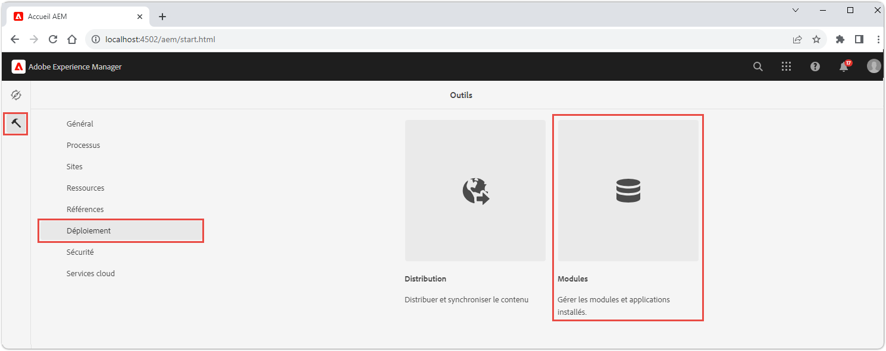
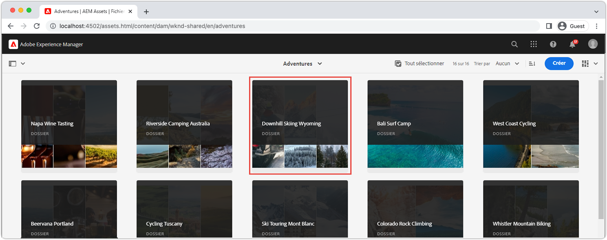
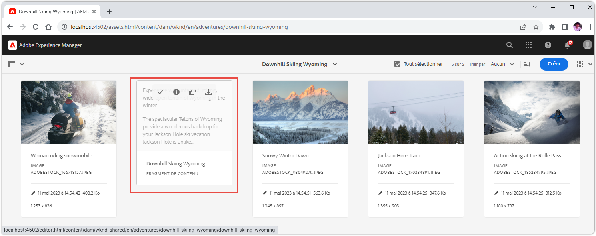
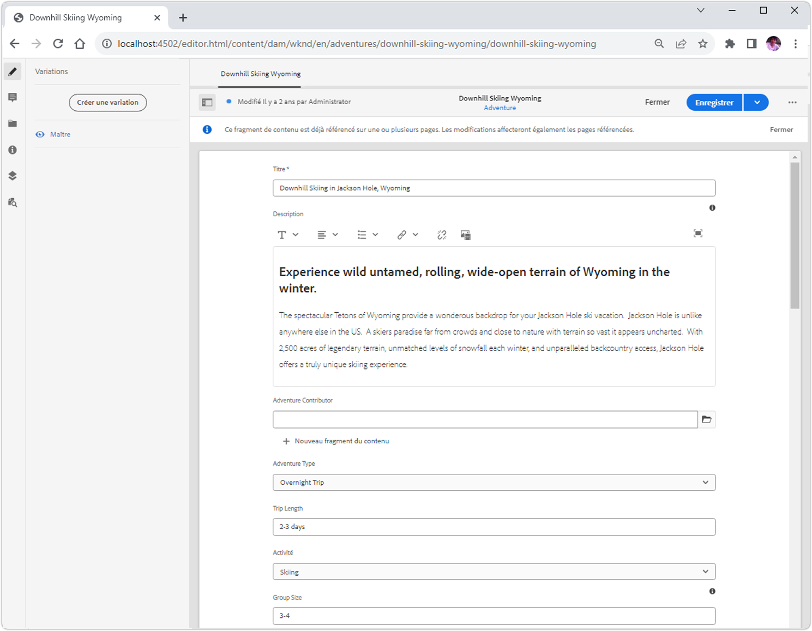
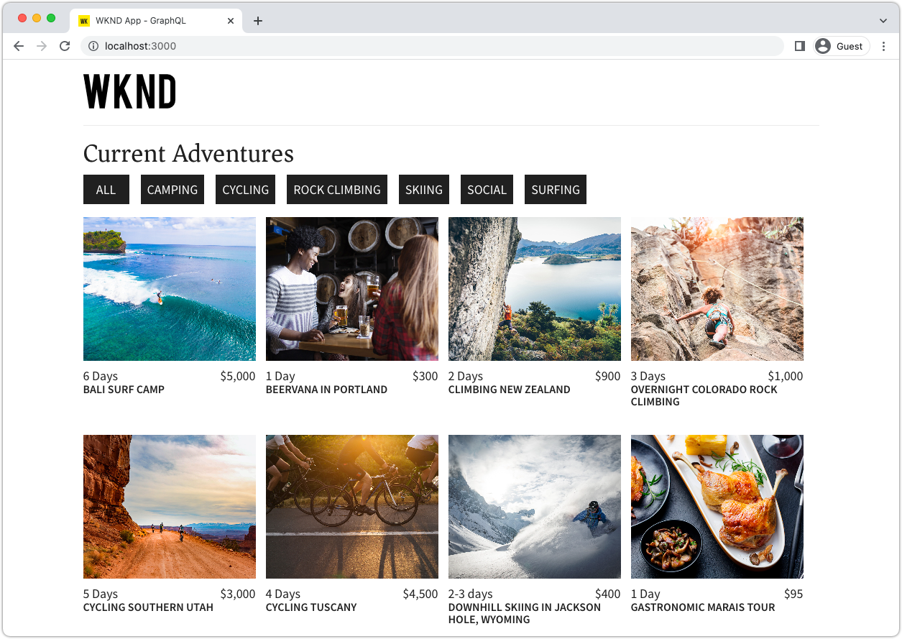
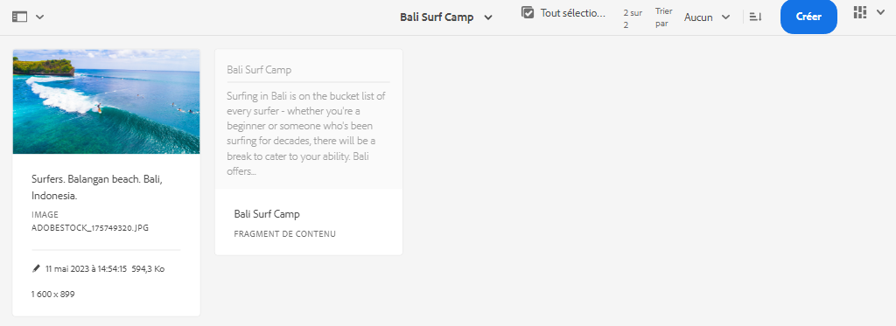
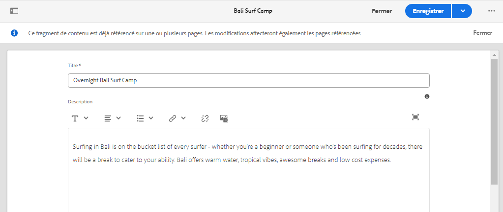

# Effectuer la configuration rapide d’AEM Headless à l’aide du SDK AEM local {#setup}

La configuration rapide d’AEM Headless vous permet de vous familiariser avec AEM Headless en utilisant le contenu de l’exemple de projet du site WKND et un exemple d’application React (SPA) qui consomme le contenu via les API GraphQL d’AEM Headless. Ce guide utilise le [SDK AEM as a Cloud Service](https://experienceleague.adobe.com/docs/experience-manager-cloud-service/content/implementing/developing/aem-as-a-cloud-service-sdk.html).

## Prérequis {#prerequisites}

Les outils suivants doivent être installés localement :

* [JDK 11](https://experience.adobe.com/#/downloads/content/software-distribution/en/general.html?1_group.propertyvalues.property=.%2Fjcr%3Acontent%2Fmetadata%2Fdc%3AsoftwareType&amp;1_group.propertyvalues.operation=equals&amp;1_group.propertyvalues.0_values=software-type%3Atooling&amp;fulltext=Oracle%7E+JDK%7E+11%7E&amp;orderby=%40jcr%3Acontent%2Fjcr%3AlastModified&amp;orderby.sort=desc&amp;layout=list&amp;p.offset=0&amp;p.limit=14)
* [Node.js v18](https://nodejs.org/fr/)
* [Git](https://git-scm.com/)

## 1. Installer le SDK AEM {#aem-sdk}

Cette configuration utilise le [SDK AEM as a Cloud Service](https://experienceleague.adobe.com/docs/experience-manager-cloud-service/implementing/developing/aem-as-a-cloud-service-sdk.html?#aem-as-a-cloud-service-sdk) pour explorer les API GraphQL d’AEM. Cette section fournit un guide rapide pour l’installation du SDK AEM et son exécution en mode de création. Un guide plus détaillé pour la configuration d’un environnement de développement local [est disponible ici](https://experienceleague.adobe.com/docs/experience-manager-learn/cloud-service/local-development-environment-set-up/overview.html#local-development-environment-set-up).

>[!NOTE]
>
> Il est également possible de suivre le tutoriel avec un [environnement AEM as a Cloud Service](./cloud-service.md). Des notes supplémentaires sur l’utilisation d’un environnement Cloud sont incluses tout au long du tutoriel.

1. Accédez au **[Portail de distribution logicielle](https://experience.adobe.com/#/downloads/content/software-distribution/en/aemcloud.html?fulltext=AEM*+SDK*&amp;orderby=%40jcr%3Acontent%2Fjcr%3AlastModified&amp;orderby.sort=desc&amp;layout=list&amp;p.offset=0&amp;p.limit=1)** > **AEM as a Cloud Service** et téléchargez la dernière version du **SDK AEM**.

   

1. Décompressez le téléchargement et copiez le fichier jar de démarrage rapide (`aem-sdk-quickstart-XXX.jar`) dans un dossier dédié, c’est-à-dire `~/aem-sdk/author`.
1. Renommez le fichier jar `aem-author-p4502.jar`.

   Le nom `author` indique que le fichier jar de démarrage rapide démarre en mode de création. `p4502` indique que le démarrage rapide s’exécute sur le port 4502.

1. Pour installer et démarrer l’instance AEM, ouvrez une invite de commande dans le dossier contenant le fichier jar, puis exécutez la commande suivante :

   ```shell
   $ cd ~/aem-sdk/author
   $ java -jar aem-author-p4502.jar
   ```

1. Indiquez un mot de passe administrateur `admin`. Tout mot de passe administrateur est acceptable, mais il est recommandé d’utiliser `admin` pour le développement local afin de réduire la nécessité de reconfiguration.
1. Une fois l’installation du service AEM terminée, une nouvelle fenêtre de navigateur doit s’ouvrir à l’adresse [http://localhost:4502](http://localhost:4502).
1. Connectez-vous avec le nom d’utilisateur `admin` et le mot de passe sélectionné lors du démarrage initial d’AEM (généralement `admin`).

## 2. Installer un exemple de contenu {#install-sample-content}

L’exemple de contenu provenant du **Site de référence WKND** est utilisé en vue d’accélérer le tutoriel. WKND est une marque de loisirs fictive, souvent prise en exemple pour les formations AEM.

Le site WKND comprend les configurations requises pour exposer un [point d’entrée GraphQL](https://experienceleague.adobe.com/docs/experience-manager-cloud-service/content/headless/graphql-api/content-fragments.html). Dans une mise en œuvre concrète, suivez les étapes documentées pour [inclure les points d’entrée GraphQL](https://experienceleague.adobe.com/docs/experience-manager-cloud-service/content/headless/graphql-api/content-fragments.html) dans votre projet client. Un [CORS](#cors-config) a également été compilé dans le cadre du site WKND. Une configuration CORS est requise pour accorder l’accès à une application externe. Vous trouverez plus d’informations sur [CORS](#cors-config) ci-dessous.

1. Téléchargez le dernier package AEM compilé pour le site WKND : [aem-guides-wknd.all-x.x.x.zip](https://github.com/adobe/aem-guides-wknd/releases/latest).

   >[!NOTE]
   >
   > Veillez à télécharger la version standard compatible avec AEM as a Cloud Service et **non** la version `classic`.

1. Dans le menu de **démarrage AEM**, accédez à **Outils** > **Déploiement** > **Packages**.

   

1. Cliquez sur **Charger le package** et sélectionnez le package WKND téléchargé à l’étape précédente. Cliquez sur **Installer** pour installer le package.

1. Dans le menu de **démarrage AEM**, accédez à **Ressources** > **Fichiers** > **WKND partagé** > **Français** > **Adventures**.

   

   Il s’agit d’un dossier contenant toutes les ressources qui composent les différentes Adventures promues par la marque WKND. Il inclut les types de médias traditionnels tels que les images et les vidéos, ainsi que les médias spécifiques à AEM comme les **fragments de contenu**.

1. Cliquez dans le dossier **Downhill Skiing Wyoming**, puis sur la vignette **Fragment de contenu Downhill Skiing Wyoming** :

   

1. L’éditeur de fragment de contenu s’ouvre pour l’Adventure Downhill Skiing Wyoming.

   

   Notez que divers champs comme **Titre**, **Description** et **Activity** définissent le fragment.

   Les **fragments de contenu** sont l’une des façons de gérer le contenu dans AEM. Les fragments de contenu constituent du contenu réutilisable indépendant de la présentation, composé d’éléments de données structurés tels que du texte, du texte enrichi, des dates ou des références à d’autres fragments de contenu. Les fragments de contenu sont détaillés plus loin dans la configuration rapide.

1. Cliquez sur **Annuler** pour fermer le fragment. N’hésitez pas à naviguer dans les autres dossiers et à explorer les autres contenus d’Adventure.

>[!NOTE]
>
> Si vous utilisez un environnement Cloud Service, consultez la documentation pour savoir comment [déployer une base de code telle que le site de référence WKND vers un environnement Cloud Service](https://experienceleague.adobe.com/docs/experience-manager-cloud-service/implementing/deploying/overview.html#coding-against-the-right-aem-version).

## 3. Télécharger et exécuter l’application React WKND {#sample-app}

L’un des objectifs de ce tutoriel consiste à montrer comment utiliser le contenu AEM d’une application externe à l’aide des API GraphQL. Ce tutoriel utilise un exemple d’application React. L’application React est intentionnellement simple et se concentre sur l’intégration avec les API GraphQL d’AEM.

1. Ouvrez une nouvelle invite de commande et clonez l’exemple d’application React à partir de GitHub :

   ```shell
   $ git clone git@github.com:adobe/aem-guides-wknd-graphql.git
   $ cd aem-guides-wknd-graphql/react-app
   ```

1. Ouvrez l’application React dans `aem-guides-wknd-graphql/react-app`, dans l’IDE de votre choix.
1. Dans l’IDE, ouvrez le fichier `.env.development` sous `/.env.development`. Vérifiez que la ligne `REACT_APP_AUTHORIZATION` n’est pas commentée et que le fichier déclare les variables suivantes :

   ```plain
   REACT_APP_HOST_URI=http://localhost:4502
   REACT_APP_GRAPHQL_ENDPOINT=/content/graphql/global/endpoint.json
   # Use Authorization when connecting to an AEM Author environment
   REACT_APP_AUTHORIZATION=admin:admin
   ```

   Assurez-vous que `REACT_APP_HOST_URI` pointe vers votre SDK AEM local. Pour des raisons pratiques, ce démarrage rapide connecte l’application React à l’**instance de création AEM**. Les services de **création** requièrent une authentification, l’application utilise donc le profil utilisateur `admin` pour établir sa connexion. La connexion d’une application à l’instance de création AEM est une pratique courante lors du développement, car elle facilite l’itération rapide sur le contenu sans avoir à publier les modifications.

   >[!NOTE]
   >
   > Dans un scénario de production, l’application se connecte à un environnement de **publication** AEM. Vous trouverez plus en détails à ce propos dans la section _Déploiement en production_.


1. Installez et démarrez l’application React :

   ```shell
   $ cd aem-guides-wknd-graphql/react-app
   $ npm install
   $ npm start
   ```

1. Une nouvelle fenêtre de navigateur ouvre automatiquement l’application à l’adresse [http://localhost:3000](http://localhost:3000).

   

   Une liste du contenu des Adventures d’AEM s’affiche.

1. Cliquez sur l’une des images d’Adventure pour en afficher le détail. Une requête est transmise à AEM, afin de renvoyer les détails d’une Adventure.

   

1. Utilisez les outils de développement du navigateur pour examiner les requêtes du **réseau**. Affichez les requêtes **XHR** et notez les diverses requêtes GET à `/graphql/execute.json/...`. Ce préfixe de chemin d’accès appelle le point d’entrée de requête persistante d’AEM, en sélectionnant la requête persistante à exécuter à l’aide du nom et des paramètres codés suivant le préfixe.

   

## 4. Modifier du contenu dans AEM

Une fois l’application React en cours d’exécution, effectuez une mise à jour du contenu dans AEM et vérifiez que la modification est répercutée dans l’application.

1. Accédez à AEM via [http://localhost:4502](http://localhost:4502).
1. Accédez à **Ressources** > **Fichiers** > **WKND Shared** > **Anglais** > **Adventures** > **[Bali Surf Camp](http://localhost:4502/assets.html/content/dam/wknd-shared/en/adventures/bali-surf-camp)**.

   

1. Cliquez dans le fragment de contenu **Bali Surf Camp** pour ouvrir l’éditeur de fragment de contenu.
1. Modifiez le **Titre** et la **Description** de l’Adventure.

   

1. Cliquez sur **Enregistrer** pour enregistrer les modifications.
1. Actualisez l’application React à l’adresse [http://localhost:3000](http://localhost:3000) pour afficher vos modifications :

   

## 5. Explorer GraphiQL {#graphiql}

1. Ouvrez [GraphiQL](http://localhost:4502/aem/graphiql.html) en accédant à **Outils** > **Général** > **Éditeur de requêtes GraphQL**.
1. Sélectionnez les requêtes persistantes à gauche, puis exécutez-les pour afficher les résultats.

   >[!NOTE]
   >
   > L’outil GraphiQL et l’API GraphQL sont [détaillés plus loin dans ce tutoriel](../multi-step/explore-graphql-api.md).

## Félicitations.{#congratulations}

Félicitations, Vous disposez désormais d’une application externe qui consomme le contenu d’AEM avec GraphQL. N’hésitez pas à examiner le code dans l’application React et à continuer à essayer de modifier des fragments de contenu existants.

### Étapes suivantes

* [Démarrer le tutoriel d’AEM Headless](../multi-step/overview.md)
