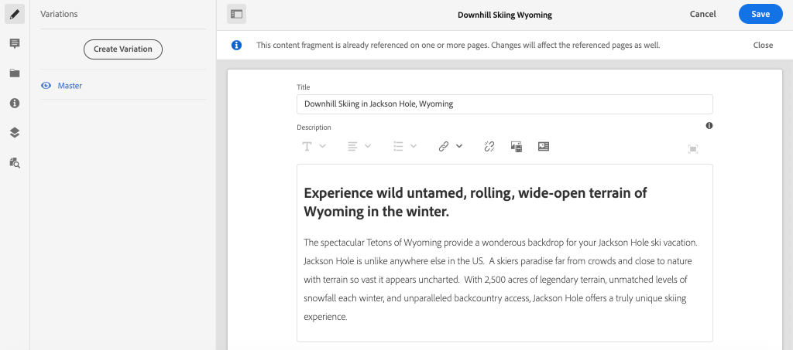

# Configuration rapide {#setup}

>[!CAUTION]
>
> L’AEM API GraphQL pour la Diffusion de fragments de contenu sera publiée au début de 2021.
> La documentation correspondante est disponible à des fins de prévisualisation.

Ce chapitre offre la configuration rapide d&#39;un environnement local pour voir une application externe consommer du contenu d&#39;AEM à l&#39;aide des API AEM GraphQL. Les chapitres suivants du didacticiel seront tirés de cette configuration.

## Conditions préalables {#prerequisites}

Les outils suivants doivent être installés localement :

* [JDK 11](https://experience.adobe.com/#/downloads/content/software-distribution/en/general.html?1_group.propertyvalues.property=.%2Fjcr%3Acontent%2Fmetadata%2Fdc%3AsoftwareType&amp;1_group.properties.operation=equals&amp;1_group.propertyvalues.0_values=software-type%3Atooling&amp;fulltext=Oracle%7E+JDK%7E+11%7E&amp;orderby=%40jcr%3Acontent 2Fjcr%3AlastModified&amp;orderby.sort=desc&amp;layout=liste&amp;p.offset=0&amp;p.limit=14)
* [Node.js v10+](https://nodejs.org/fr/)
* [npm 6+](https://www.npmjs.com/)
* [Git](https://git-scm.com/)

## Objectifs {#objectives}

1. Téléchargez et installez le SDK AEM.
1. Téléchargez et installez des exemples de contenu à partir du site de référence WKND.
1. Téléchargez et installez un exemple d’application pour consommer du contenu à l’aide des API GraphQL.

## Installation du SDK AEM{#aem-sdk}

Ce didacticiel utilise l&#39;AEM [en tant que SDK Cloud Service](https://experienceleague.adobe.com/docs/experience-manager-cloud-service/implementing/developing/aem-as-a-cloud-service-sdk.html?lang=en#aem-as-a-cloud-service-sdk) pour explorer les API AEM GraphQL. Cette section fournit un guide rapide pour l’installation du SDK AEM et son exécution en mode Auteur. Vous trouverez un guide plus détaillé pour la mise en place d&#39;un environnement de développement local [ici](https://experienceleague.adobe.com/docs/experience-manager-learn/cloud-service/local-development-environment-set-up/overview.html?lang=en#local-development-environment-set-up).

>[!NOTE]
>
> Il est également possible de suivre le tutoriel avec un AEM en tant qu&#39;environnement Cloud Service. D’autres remarques sur l’utilisation d’un environnement Cloud sont incluses dans le didacticiel.

1. Accédez au **[Portail de distribution de logiciels](https://experience.adobe.com/#/downloads/content/software-distribution/fr-FR/aemcloud.html)** > **AEM en tant que Cloud Service** et téléchargez la dernière version du **AEM SDK**.

   

1. Décompressez le téléchargement et copiez le fichier jar Quickstart (`aem-sdk-quickstart-XXX.jar`) dans un dossier dédié, c’est-à-dire `~/aem-sdk/author`.
1. Renommez le fichier jar en `aem-author-p4502.jar`.
1. Ouvrez une nouvelle fenêtre de terminal et accédez au dossier contenant le fichier jar. Exécutez la commande suivante pour installer et début l’instance AEM :

   ```shell
   $ cd ~/aem-sdk/author
   $ java -jar aem-author-p4502.jar
   ```

1. Indiquez un mot de passe administrateur sous la forme `admin`. Tout mot de passe d’administrateur est acceptable, mais il est recommandé d’utiliser la valeur par défaut pour le développement local afin de réduire la nécessité de reconfigurer.
1. Au bout de quelques minutes, l’instance AEM se termine et une nouvelle fenêtre du navigateur doit s’ouvrir à l’adresse [http://localhost:4502](http://localhost:4502).
1. Connectez-vous avec le nom d’utilisateur `admin` et le mot de passe `admin`.

## Installer un exemple de contenu{#wknd-site}

Des échantillons de contenu du site de référence WKND seront installés pour accélérer le didacticiel. Le WKND est une marque fictive de style de vie, souvent utilisée en conjonction avec la formation AEM.

1. Téléchargez le dernier package d&#39;AEM compilé pour le site WKND : [aem-guides-wknd.all-x.x.x.zip](https://github.com/adobe/aem-guides-wknd/releases/latest).

   >[!NOTE]
   >
   > Veillez à télécharger la version standard compatible avec AEM en tant que Cloud Service et **non** la version `classic`.

1. Dans le menu **AEM Début**, accédez à **Outils** > **Déploiement** > **Packages**.

   

1. Cliquez sur **Télécharger le package** et choisissez le package WKND téléchargé à l’étape précédente. Cliquez sur **Installer** pour installer le package.

1. Dans le menu **AEM Début**, accédez à **Ressources** > **Fichiers**.
1. Cliquez sur les dossiers pour accéder au **site WKND** > **anglais** > **Aventures**.

   

   Il s&#39;agit d&#39;un dossier de tous les actifs qui composent les différentes aventures promues par la marque WKND. Cela inclut les types de médias traditionnels tels que les images et les vidéos, ainsi que les médias spécifiques à AEM tels que **Fragments de contenu**.

1. Cliquez dans le dossier **Downhill Skiing Wyoming** et cliquez sur la carte **Downhill Skiing Wyoming Content Fragment** :

   

1. L’interface utilisateur de l’éditeur de fragments de contenu s’ouvre pour l’aventure du Wyoming au ski de descente.

   

   Observez que divers champs tels que **Titre**, **Description** et **Activité** définissent le fragment.

   **Les** fragments de contenu sont l’un des moyens de gestion du contenu dans AEM. Le fragment de contenu est un contenu réutilisable, indépendant de la présentation, composé d’éléments de données structurés tels que du texte, du texte enrichi, des dates ou des références à d’autres fragments de contenu. Les fragments de contenu seront analysés plus en détail plus loin dans le didacticiel.

1. Cliquez sur **Annuler** pour fermer le fragment. N&#39;hésitez pas à naviguer dans certains des autres dossiers et à explorer les autres contenus Adventure.

>[!NOTE]
>
> Si vous utilisez un environnement Cloud Service, consultez la documentation sur la façon de [déployer une base de code telle que le site de référence WKND vers un environnement Cloud Service](https://experienceleague.adobe.com/docs/experience-manager-cloud-service/implementing/deploying/overview.html?lang=en#deploying).

## Autoriser les requêtes GraphQL

aem, étant sécurisé par défaut, bloque les demandes d’origine croisée, ce qui empêche les applications non autorisées de se connecter à son contenu et d’y accéder.

Pour permettre à l’application React de ce didacticiel d’interagir avec AEM points de terminaison de l’API GraphQL, une configuration de partage de ressources entre origines est définie.


1. Accédez à la console Web du SDK AEM à l&#39;adresse **Outils** > **Opérations** > **Console Web**
1. Cliquez sur la ligne intitulée **Adobe Granite Cross-Origine Resource Sharing Policy** pour créer une nouvelle configuration.
1. Mettez à jour les champs suivants, en conservant les autres avec leurs valeurs par défaut :
   * Origines autorisées : `localhost:3000`
   * Origines autorisées (Regex) : `.* `
   * Chemins autorisés: `/content/graphql/endpoint.gql`
   * Méthodes autorisées : `GET`, `HEAD`, `POST`
      * Seul `POST` est requis pour GraphQL, mais les autres méthodes peuvent être utiles lors d&#39;une interaction sans tête avec AEM.
   * Prend en charge les informations d&#39;identification : `Yes`
      * Ceci est nécessaire car notre application React communiquera avec les points de terminaison GraphQL protégés sur le service Auteur AEM.
1. Cliquez sur **Enregistrer**

Cette configuration permet aux requêtes HTTP `POST` provenant de `localhost:3000` vers le service Auteur AEM sur le chemin `/content/graphql/endpoint.gql`.

## Installez l’exemple d’application {#sample-app}

L’un des objectifs de ce didacticiel est de montrer comment consommer AEM contenu d’une application externe à l’aide des API GraphQL. Ce didacticiel utilise un exemple d’application Réagir qui a été partiellement terminé pour accélérer le didacticiel. Les mêmes leçons et concepts s’appliquent aux applications créées avec iOS, Android ou toute autre plate-forme. L&#39;application React est intentionnellement simple, afin d&#39;éviter toute complexité inutile ; il ne s&#39;agit pas d&#39;une mise en oeuvre de référence.

1. Ouvrez une nouvelle fenêtre de terminal et cloner une branche de démarrage du didacticiel à l&#39;aide de Git :

   ```shell
   $ git clone --branch tutorial/react git@github.com:adobe/aem-guides-wknd-graphql.git
   ```

1. Dans l&#39;IDE de votre choix, ouvrez le fichier `.env.development` à `aem-guides-wknd-graphql/react-app/.env.development`. Supprimez la mise en commentaire de la ligne `REACT_APP_AUTHORIZATION` pour que le fichier ressemble à ce qui suit :

   ```plain
   REACT_APP_HOST_URI=http://localhost:4502
   REACT_APP_GRAPHQL_ENDPOINT=/content/graphql/endpoint.gql
   REACT_APP_AUTHORIZATION=admin:admin
   ```

   Assurez-vous que `React_APP_HOST_URI` correspond à votre instance d’AEM locale. Dans ce chapitre, nous allons connecter l&#39;application Réagir directement à l&#39;environnement **Auteur** de l&#39;AEM et nous devrons donc nous authentifier. Il s’agit d’une pratique courante durant le développement, car elle nous permet d’apporter rapidement des modifications à l’environnement AEM et de les voir immédiatement répercuter dans l’application.

   >[!NOTE]
   >
   > Dans un scénario de production, l’application se connecte à un environnement **Publier** AEM. Cette section est traitée plus en détail, plus loin dans le tutoriel.

1. Accédez au dossier `aem-guides-wknd-graphql/react-app`. Installez et début l’application :

   ```shell
   $ cd aem-guides-wknd-graphql/react-app
   $ npm install
   $ npm start
   ```

1. Une nouvelle fenêtre du navigateur doit automatiquement lancer l’application à l’adresse [http://localhost:3000](http://localhost:3000).

   

   Une liste du contenu Aventure actuel de l&#39;AEM doit être affichée.

1. Cliquez sur l&#39;une des images d&#39;aventure pour vue les détails de l&#39;aventure. Une demande est adressée à AEM pour qu&#39;il revienne les détails d&#39;une aventure.

   

1. Utilisez les outils de développement du navigateur pour examiner les demandes **Réseau**. Vue les requêtes **XHR** et observez plusieurs requêtes de POST à `/content/graphql/endpoint.gql`, le point de terminaison GraphQL configuré pour AEM.

   

1. Vous pouvez également vue les paramètres et la réponse JSON en examinant la demande réseau. Il peut s’avérer utile d’installer une extension de navigateur telle que [GraphQL Network](https://chrome.google.com/webstore/detail/graphql-network/igbmhmnkobkjalekgiehijefpkdemocm) pour Chrome afin de mieux comprendre la requête et la réponse.

   

   *Utilisation du réseau GraphQL de l’extension Chrome*

## Modification d’un fragment de contenu

Maintenant que l’application React est en cours d’exécution, effectuez une mise à jour du contenu dans AEM et voyez la modification répercutée dans l’application.

1. Accédez à AEM [http://localhost:4502](http://localhost:4502).
1. Accédez à **Assets** > **Files** > **WKND Site** > **English** > **Aventures** > **[Bali Surf Camp](http://localhost:4502/assets.html/content/dam/wknd/en/adventures/bali-surf-camp)**.

   

1. Cliquez dans le fragment de contenu **Bali Surf Camp** pour ouvrir l’éditeur de fragments de contenu.
1. Modifiez le **Titre** et la **Description** de l&#39;aventure.

   

1. Cliquez sur **Enregistrer** pour enregistrer les modifications.
1. Revenez à l’application React à l’adresse [http://localhost:3000](http://localhost:3000) et actualisez-la pour voir vos modifications :

   

## Félicitations ! {#congratulations}

Félicitations, vous disposez désormais d’une application externe qui consomme AEM contenu avec GraphQL. N’hésitez pas à examiner le code dans l’application Réagir et à continuer à tester la modification des fragments de contenu existants.

## Étapes suivantes {#next-steps}

Dans le chapitre suivant, [Définir des modèles de fragments de contenu](content-fragment-models.md), apprenez à modéliser le contenu et à créer un schéma avec **Modèles de fragments de contenu**. Vous passerez en revue les modèles existants et créerez un nouveau modèle. Vous découvrirez également les différents types de données qui peuvent être utilisés pour définir un schéma dans le cadre du modèle.
