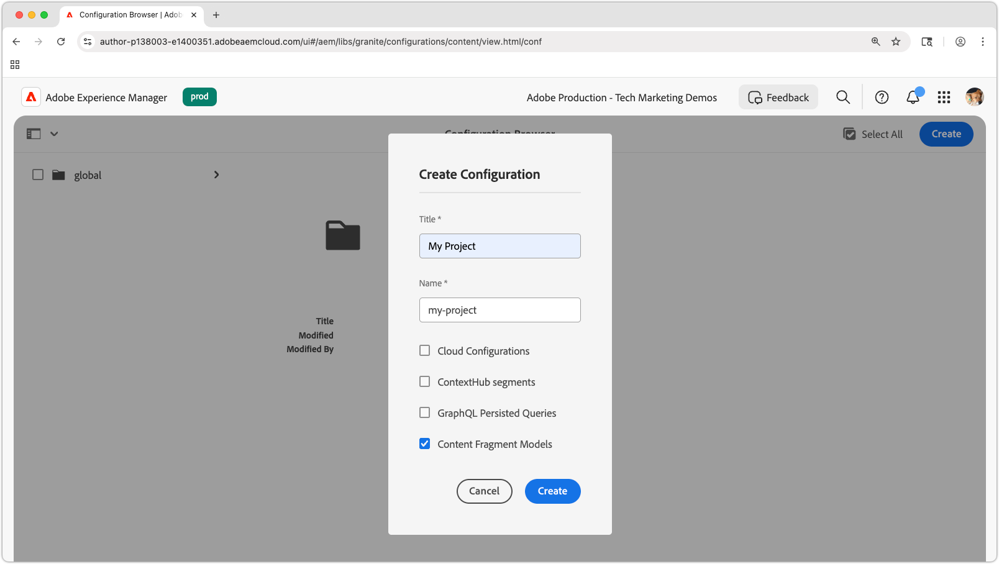

# Créer des modèles de fragments de contenu

Dans ce chapitre, découvrez comment modéliser du contenu et créer un schéma avec des **modèles de fragments de contenu**, ainsi que les différents types de données qui définissent un modèle de fragment de contenu.

Dans ce tutoriel, vous créez deux modèles simples : **Équipe** et **Personne**. Le modèle de données **Équipe** a un nom, un nom court et une description. Il fait référence au modèle de données **Personne** qui comporte un nom complet, des détails biographiques, une image de profil et la liste des professions.

## Objectifs

* Créer un modèle de fragment de contenu.
* Explorer les types de données et les options de validation disponibles pour la création de modèles.
* Comprendre comment les modèles de fragments de contenu définissent **à la fois** le schéma de données et le modèle de création d’un fragment de contenu.

## Créer une configuration de projet

Une configuration de projet contient tous les modèles de fragments de contenu associés à un projet particulier et permet d’organiser les modèles. Créez au moins un projet **avant** de créer un modèle de fragment de contenu.

1. Connectez-vous à l’environnement de **création** AEM (par ex. : `https://author-p<PROGRAM_ID>-e<ENVIRONMENT_ID>.adobeaemcloud.com/`).
1. Dans l’écran de démarrage d’AEM, accédez à **Outils** > **Général** > **Explorateur de configuration**.
1. Cliquez sur **Créer** dans la barre d’actions supérieure et saisissez les détails de configuration suivants :
   * Titre : **Mon projet**
   * Nom : **mon-projet**
   * Modèles de fragments de contenu : **Coché**

   

1. Sélectionnez **Créer** pour créer la configuration du projet.

## Créer des modèles de fragments de contenu

Créez ensuite des modèles de fragments de contenu pour une **Équipe** et une **Personne**. Ils serviront de modèles de données, ou de schémas, représentant une équipe, et une personne faisant partie d’une équipe, et définiront l’interface permettant aux auteurs et autrices de créer et de modifier des fragments de contenu en fonction de ces modèles.

### Créer le modèle de fragment de contenu Personne

Créez un modèle de fragment de contenu pour une **Personne**, c’est-à-dire le modèle de données, ou le schéma, représentant une personne faisant partie d’une équipe.

1. À partir de l’écran de démarrage d’AEM, accédez à **Outils** > **Général** > **Modèles de fragment de contenu**.
1. Accédez au dossier **Mon projet**.
1. Sélectionnez **Créer** dans le coin supérieur droit pour afficher l’assistant **Créer un modèle**.
1. Créez un modèle de fragment de contenu avec les propriétés suivantes :

   * Titre du modèle : **Personne**
   * Activer le modèle : **Coché**

   Sélectionnez **Créer**. Dans la boîte de dialogue qui s’affiche, sélectionnez **Ouvrir** pour créer le modèle.

1. Effectuez un glisser-déposer d’un élément de **texte monoligne** sur le panneau principal. Renseignez les propriétés suivantes sur l’onglet **Propriétés** :

   * Libellé du champ : **Nom complet**
   * Nom de la propriété : `fullName`
   * Cochez **Obligatoire**.

   Le **Nom de la propriété** définit le nom de la propriété dans laquelle la valeur créée est stockée dans AEM. Le **Nom de la propriété** définit également le nom de **clé** de cette propriété dans le cadre du schéma de données et utilisé en tant que clé dans la réponse JSON lorsque le fragment de contenu est diffusé via les OpenAPI d’AEM.

1. Sélectionnez l’onglet **Types de données** et effectuez un glisser-déposer d’un champ **Texte multiligne** sous le champ **Nom complet**. Saisissez les propriétés suivantes :

   * Libellé du champ : **Biographie**
   * Nom de la propriété : `biographyText`
   * Type par défaut : **Texte enrichi**

1. Cliquez sur l’onglet **Types de données** et effectuez un glisser-déposer d’un champ **Référence de contenu**. Saisissez les propriétés suivantes :

   * Libellé du champ : **Photo de profil**
   * Nom de la propriété : `profilePicture`
   * Chemin racine : `/content/dam`

     Lors de la configuration du **chemin d’accès racine**, vous pouvez cliquer sur l’icône **dossier** pour afficher une boîte de dialogue modale afin de sélectionner le chemin d’accès. Cela limite les dossiers que les créateurs et créatrices peuvent utiliser pour renseigner le chemin d’accès. `/content/dam` est la racine dans laquelle sont stockées toutes les ressources d’AEM Assets (images, vidéos et autres fragments de contenu).

   * Accepter uniquement les types de contenu spécifiés : **Image**

     Ajoutez une validation à la **Référence d’image** de sorte que seuls les types de contenu d’**images** puissent être utilisés pour renseigner le champ.

   * Afficher la miniature : **Coché**

1. Cliquez sur l’onglet **Types de données** et effectuez un glisser-déposer d’un type de données d’**énumération** sous le champ **Référence d’image**. Saisissez les propriétés suivantes :

   * Afficher comme : **Cases à cocher**
   * Libellé du champ : **Poste**
   * Nom de la propriété : `occupation`
   * Options :
      * **Artiste**
      * **Influenceur**
      * **Photographe**
      * **Voyageur**
      * **Rédacteur**
      * **YouTuber**

   Définissez le libellé et la valeur de l’option sur la même valeur.

1. Le modèle de **personne** final doit se présenter comme suit :

   

1. Cliquez sur **Enregistrer** pour enregistrer les modifications.

### Créer le modèle de fragment de contenu Équipe

Créez un modèle de fragment de contenu pour une **Équipe**, c’est-à-dire le modèle de données d’une équipe de personnes. Le modèle Équipe référence les modèles de contenu Personne représentant les membres de l’équipe.

1. Dans le dossier **Mon projet**, sélectionnez **Créer** dans le coin supérieur droit pour afficher l’assistant **Créer un modèle**.
1. Dans le champ **Titre du modèle**, saisissez **Équipe** et sélectionnez **Créer**.

   Sélectionnez **Ouvrir** dans la boîte de dialogue qui s’affiche pour ouvrir le modèle nouvellement créé.

1. Effectuez un glisser-déposer d’un élément de **texte monoligne** sur le panneau principal. Renseignez les propriétés suivantes sur l’onglet **Propriétés** :

   * Libellé du champ : **Titre**
   * Nom de la propriété : `title`
   * Cochez **Obligatoire**.

1. Sélectionnez l’onglet **Types de données** et effectuez un glisser-déposer d’un champ **Texte multiligne** sous le champ **Nom court**. Saisissez les propriétés suivantes :

   * Libellé du champ : **Description**
   * Nom de la propriété : `description`
   * Type par défaut : **Texte enrichi**

1. Cliquez sur l’onglet **Types de données** et effectuez un glisser-déposer d’un champ **Référence de fragment**. Saisissez les propriétés suivantes :

   * Afficher comme : **Champ multiple**
   * Nombre minimum d’éléments : **2**
   * Libellé du champ : **Membres de l’équipe**
   * Nom de la propriété : `teamMembers`
   * Modèles de fragments de contenu autorisés : utilisez l’icône de dossier pour sélectionner le modèle **Personne**.

1. La modèle d’**équipe** final doit se présenter comme suit :

   

1. Cliquez sur **Enregistrer** pour enregistrer les modifications.

1. Vous devez maintenant pouvoir travailler avec deux modèles :

   

## Félicitations !

Félicitations, vous venez de créer vos premiers modèles de fragments de contenu.

## Étapes suivantes

Dans le chapitre suivant, [Créer des modèles de fragment de contenu](2-author-content-fragments.md), vous allez créer et modifier un fragment de contenu basé sur un modèle de fragment de contenu. Vous découvrirez également comment créer des variations de fragments de contenu.

## Documentation connexe

* [Modèles de fragment de contenu](https://experienceleague.adobe.com/docs/experience-manager-cloud-service/content/assets/content-fragments/content-fragments-models.html?lang=fr)
