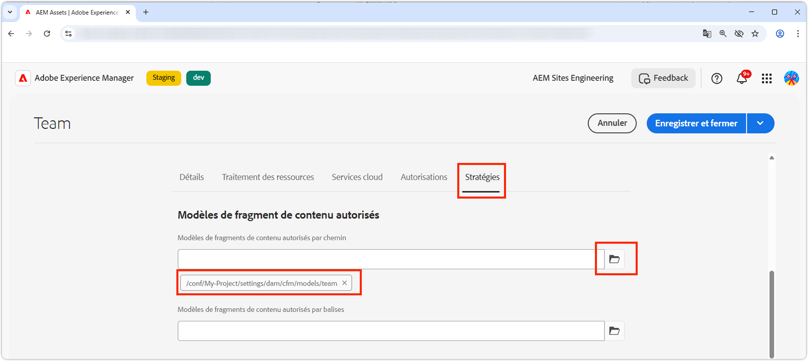
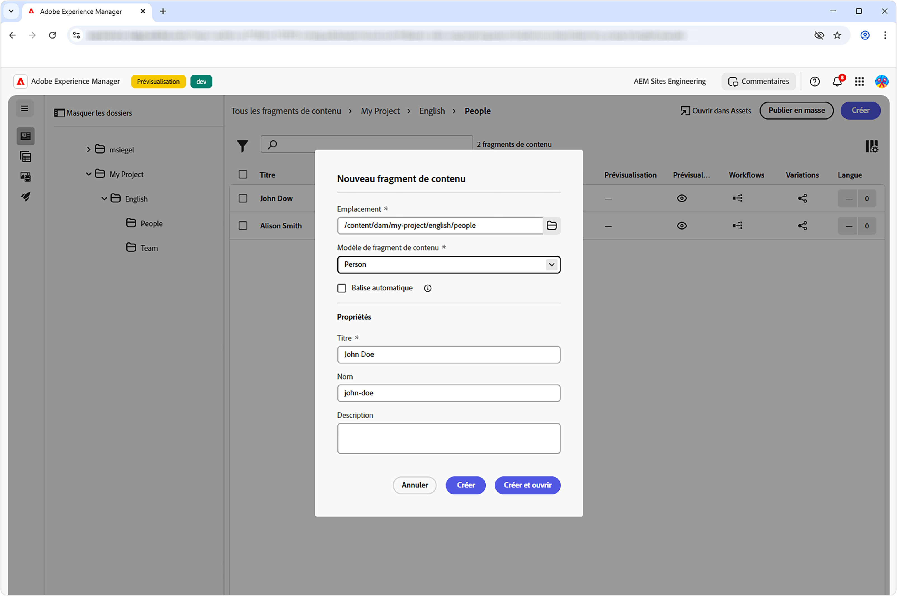
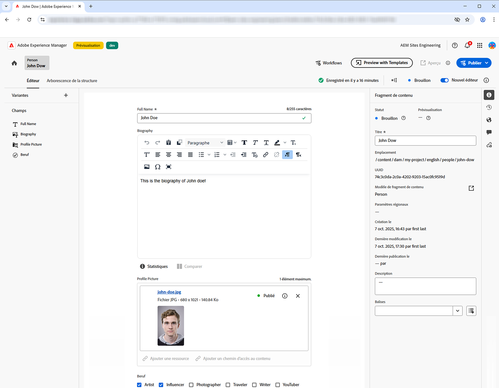
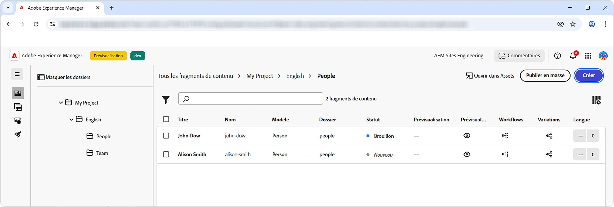
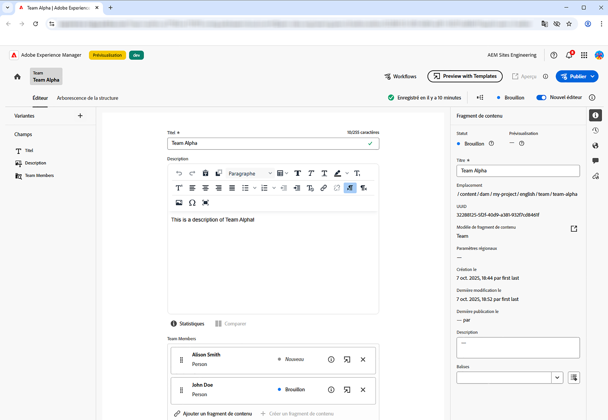
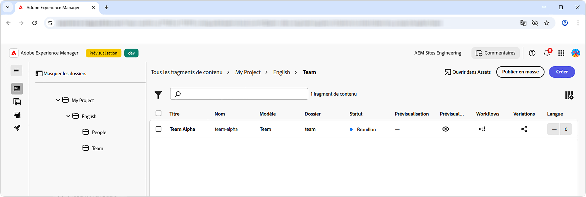
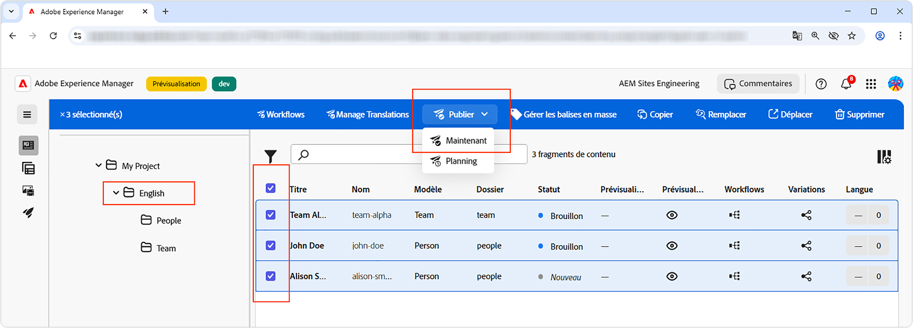
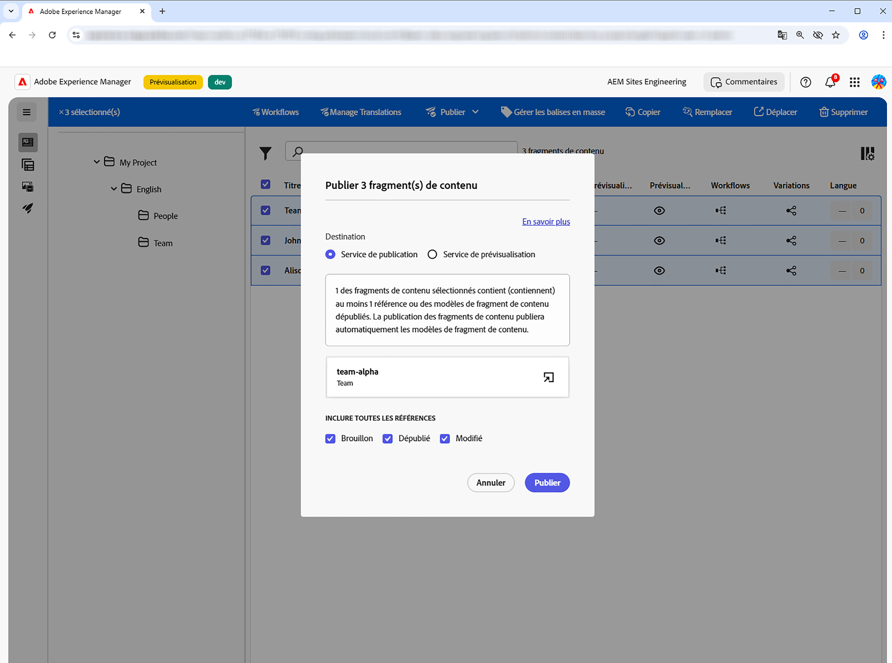

# Créer des fragments de contenu

Dans ce chapitre, vous créez et modifiez des fragments de contenu basés sur les [modèles de fragments de contenu Équipe et Personne](./1-content-fragment-models.md). Ces fragments de contenu seront le contenu consommé par l’application React à l’aide de la diffusion de fragments de contenu AEM avec les API OpenAPI.

## Conditions préalables

Avant d’aborder ce tutoriel en plusieurs parties, assurez-vous d’avoir suivi les étapes décrites dans la section [Définir des modèles de fragment de contenu](./1-content-fragment-models.md).

## Objectifs

* Créer un fragment de contenu basé sur un modèle de fragment de contenu.
* Créer un fragment de contenu.
* Publier un fragment de contenu.

## Créer des dossiers de ressources pour les fragments de contenu

Les fragments de contenu sont stockés dans des dossiers AEM Assets. Pour créer des fragments de contenu à partir des modèles de fragments de contenu créés dans le chapitre précédent, un dossier doit exister pour les stocker. Une configuration du dossier est requise afin de permettre la création de fragments de contenu à partir de modèles de fragments de contenu spécifiques.

AEM prend en charge l’organisation des dossiers « plats », ce qui signifie que les fragments de contenu de différents modèles de fragments de contenu sont regroupés dans un seul dossier. Cependant, dans ce tutoriel, une structure de dossiers qui s’aligne sur les modèles de fragments de contenu est utilisée, en partie pour explorer l’API **Répertorier tous les fragments de contenu par dossier** dans le [chapitre suivant](./3-explore-openapis.md). Lorsque vous déterminez l’organisation de vos fragments de contenu, tenez compte à la fois de la manière dont vous souhaitez créer et gérer vos fragments de contenu, ainsi que de la manière de les diffuser et de les consommer via la diffusion de fragments de contenu AEM avec les API OpenAPI.

1. Sur l’écran de démarrage d’AEM, accédez à **Ressources** > **Fichiers**.
1. Sélectionnez **Créer** dans le coin supérieur droit, puis **Dossier**. Enter :

   * Titre : **Mon projet**
   * Nom : **mon-projet**

   Pour créer le dossier, sélectionnez **Créer**.

1. Ouvrez le nouveau dossier **Mon projet** et créez un sous-dossier sous le nouveau dossier **Mon projet** avec les valeurs suivantes :

   * Titre: **Français**
   * Nom : **fr**

   Un dossier de langue racine est créé pour positionner le projet afin de prendre en charge les fonctionnalités de localisation natives d’AEM. Une bonne pratique consiste à configurer des projets pour une prise en charge multilingue, même si vous n’avez pas besoin de localisation actuellement. Consultez [la documentation suivante pour en savoir plus](https://experienceleague.adobe.com/docs/experience-manager-cloud-service/content/assets/admin/translate-assets.html?lang=fr).

1. Créez deux sous-dossiers sous le nouveau dossier **Mon projet > Français** avec les valeurs suivantes :

   Un dossier `teams` qui contient les fragments de contenu **Équipe**

   * Titre : **Équipes**
   * Nom : **équipes**

   ... et un dossier `people` qui contient les fragments de contenu **Personne**.

   * Titre : **Personne**
   * Nom : **personne**

1. Revenez au dossier **Mon projet > Français** et assurez-vous que les deux nouveaux dossiers sont créés.
1. Sélectionnez le dossier **Équipes**, puis **Propriétés** dans la barre d’actions supérieure.
1. Sélectionnez l’onglet **Stratégies** et décochez la case **Hérité de`/content/dam/my-project`**.
1. Dans l’onglet **Stratégies**, sélectionnez le modèle de fragment de contenu **Équipe** dans le champ **Modèles de fragments de contenu autorisés par chemin**.

   

   Les sous-dossiers héritent automatiquement de ces stratégies, qui peuvent être remplacées. Les modèles de fragments de contenu peuvent être autorisés par balises ou activez les modèles de fragments de contenu à partir d’autres configurations de projet. Ce mécanisme permet de gérer efficacement votre hiérarchie de contenu.

1. Sélectionnez **Enregistrer et fermer** pour enregistrer les modifications apportées aux propriétés du dossier.
1. Procédez de la même manière pour mettre à jour les **Stratégies** du dossier **Personne**, mais sélectionnez le modèle de fragment de contenu **Personne** à la place.

## Créer un fragment de contenu Personne

Créez des fragments de contenu basés sur le modèle de fragment de contenu **Personne** dans le dossier **Mon projet > Français > Personne**.

1. Sur l’écran de démarrage d’AEM, sélectionnez **Fragments de contenu** pour ouvrir la console des fragments de contenu.
1. Sélectionnez le bouton **Afficher le dossier** pour ouvrir l’explorateur de dossiers.
1. Sélectionnez le dossier **Mon projet > Français > Personne**.
1. Sélectionnez **Créer > Fragment de contenu** et saisissez les valeurs suivantes :

   * Emplacement : `/content/dam/my-project/en/people`.
   * Modèle de fragment de contenu : **Personne**
   * Titre : **John Doe**
   * Nom : `john-doe`.

   Gardez à l’esprit que ces champs **Titre**, **Nom** et **Description** de la boîte de dialogue **Nouveau fragment de contenu** sont stockés en tant que métadonnées sur le fragment de contenu et ne font pas partie des données du fragment de contenu.

   

1. Sélectionnez **Créer et ouvrir**.
1. Renseignez les champs du fragment **John Doe** :

   * Nom complet : **John Doe**
   * Biographie : **John Doe aime les réseaux sociaux et est passionné de voyages.**
   * Photo de profil : sélectionnez une image dans `/content/dam` ou chargez-en une nouvelle.
   * Poste : **Influenceur**, **Voyageur**

   Ces champs et valeurs définissent le contenu du fragment de contenu qui sera utilisé via la diffusion de fragments de contenu AEM avec les API OpenAPI.

   

1. Les modifications apportées au fragment de contenu sont automatiquement enregistrées. Il n’y a donc pas de bouton **Enregistrer**.
1. Revenez à la console Fragment de contenu et sélectionnez **Mon projet > Français > Personne** pour afficher votre nouveau fragment de contenu.

### Créer d’autres fragments de contenu Personne

Répétez les étapes ci-dessus pour créer d’autres fragments **Personne**.

1. Créez un fragment de contenu Personne pour **Alison Smith** avec les propriétés suivantes :

   * Emplacement : `/content/dam/my-project/en/people`.
   * Modèle de fragment de contenu : **Personne**
   * Titre : **Alison Smith**
   * Nom : `alison-smith`.

   Sélectionnez **Créer et ouvrir** et créez avec les valeurs suivantes :

   * Nom complet : **Alison Smith**
   * Biographie : **Alison est photographe et adore écrire sur ses voyages.**
   * Photo de profil : sélectionnez une image dans `/content/dam` ou chargez-en une nouvelle.
   * Poste : **Photographe**, **Voyageur**, **Rédacteur**.

Vous devriez maintenant avoir deux fragments de contenu dans le dossier **Mon projet > Français > Personne** :

Vous pouvez éventuellement créer d’autres fragments de contenu Personne pour représenter d’autres personnes.

## Créer un fragment de contenu Équipe

Selon la même approche, créez un fragment **Équipe** basé sur le modèle de fragment de contenu **Équipe** dans le dossier **Mon projet > Français > Équipes**.

1. Créez un fragment **Équipe** représentant **Équipe Alpha** avec les propriétés suivantes :

   * Emplacement : `/content/dam/my-project/en`.
   * Modèle de fragment de contenu : **Équipe**
   * Titre : **Équipe Alpha**
   * Nom : `team-alpha`.

   Sélectionnez **Créer et ouvrir** et créez avec les valeurs suivantes :

   * Titre : **Équipe Alpha**
   * Description : **L’équipe Alpha est une équipe de contenu de voyages spécialisée dans la photographie et les récits de voyages.**
   * **Membres de l’équipe** : sélectionnez les fragments de contenu **John Doe** et **Alison Smith** pour renseigner le champ **Membres de l’équipe**.

   

1. Sélectionnez **Créer et ouvrir** pour créer le fragment de contenu Équipe.
1. Trois fragments de contenu doivent se trouver dans **Mon projet > Français > Équipe** :

Vous devriez maintenant disposer d’un fragment de contenu **Équipe Alpha** dans le dossier **Mon projet > Français > Équipes** :

Vous pouvez éventuellement créer une **Équipe Oméga** avec un ensemble de personnes différent.

## Publier des fragments de contenu

Pour rendre les fragments de contenu disponibles pour les API OpenAPI, publiez-les. La publication permet un accès aux fragments de contenu via les éléments suivants :

* **Service de publication** - Diffuse le contenu aux applications de production.
* **Service de prévisualisation** - Diffuse le contenu aux applications de prévisualisation.

En règle générale, le contenu est d’abord publié vers le **service de prévisualisation** et vérifié sur une application de prévisualisation avant d’être publié vers le **service de publication**. Publier vers le **service de publication** ne publie pas également vers le **service de prévisualisation**. Vous devez effectuer une autre publication séparément vers le **service de prévisualisation**.

Dans ce tutoriel, nous allons publier vers le service de publication d’AEM. Pour utiliser le service de prévisualisation d’AEM, il suffit de modifier [l’URL du service AEM dans l’application React](./4-react-app.md).

1. Dans la console Fragments de contenu, recherchez le dossier **Mon projet > Français**.
1. Sélectionnez tous les fragments de contenu qui se trouvent dans le dossier **Français**, qui affiche tous les fragments de contenu dans tous les sous-dossiers, puis sélectionnez **Publier > Maintenant** dans la barre d’actions supérieure.

   

1. Sélectionnez le **Service de publication**, puis dans **Inclure toutes les références** cliquez sur **Dépublié** et **Modifié**, et enfin, sélectionnez **Publier**.

   

Désormais, les fragments de contenu, ainsi que tous les fragments de contenu de personne référencés par les fragments de contenu d’équipe et toutes les ressources référencées, sont publiés sur le **service de publication**.

Vous pouvez publier vers le **service de prévisualisation** de la même manière.

## Félicitations !

Félicitations, vous avez correctement créé des fragments de contenu basés sur des modèles de fragment de contenu dans AEM. Vous avez créé un modèle de fragment de contenu de **Personne**, créé plusieurs fragments de contenu de **Personne** et créé un fragment de contenu d’**Équipe** qui référence à plusieurs fragments de contenu de **Personne**.

Les fragments de contenu étant désormais publiés, vous pouvez y accéder via la diffusion de fragments de contenu AEM avec les API OpenAPI.

## Étapes suivantes

Dans le chapitre suivant, [Explorer les API OpenAPI](3-explore-openapis.md), vous allez explorer la diffusion de fragments de contenu AEM avec les API OpenAPI à l’aide de la fonctionnalité **Essayer** intégrée à la documentation des API.
