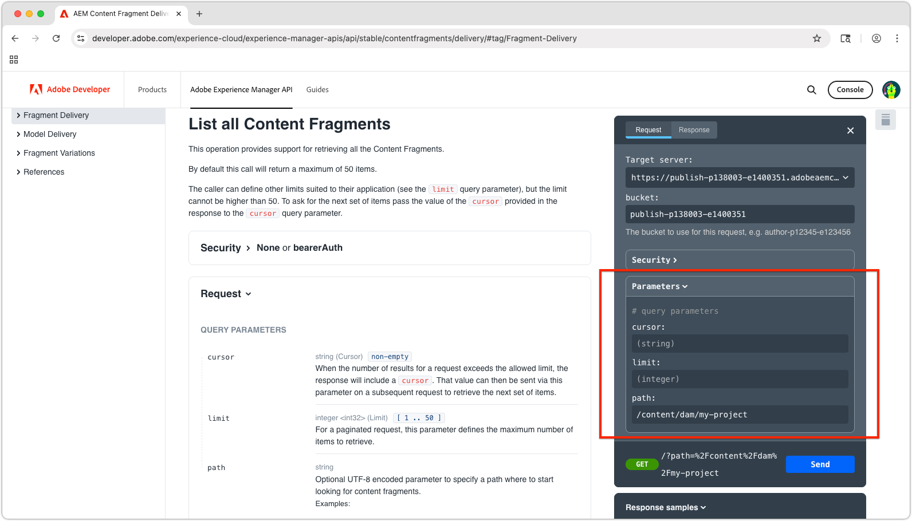

# Explorer les API de diffusion de fragments de contenu basées sur OpenAPI d’AEM

La [diffusion de fragments de contenu AEM avec les API OpenAPI](https://developer.adobe.com/experience-cloud/experience-manager-apis/api/stable/contentfragments/delivery/) dans AEM offre un moyen puissant de diffuser du contenu structuré à n’importe quelle application ou n’importe quel canal. Dans ce chapitre, nous explorons comment utiliser les API OpenAPI pour récupérer des fragments de contenu via la fonctionnalité **Essayer** de la documentation.

## Conditions préalables {#prerequisites}

Il s’agit d’un tutoriel en plusieurs parties qui suppose que les étapes décrites dans la section [Création de fragments de contenu](./2-author-content-fragments.md) soient terminées.

Veillez à disposer des éléments suivants :

* Le nom d’hôte du service de publication AEM (par ex., `https://publish-<PROGRAM_ID>-e<ENVIRONMENT_ID >.adobeaemcloud.com/`) sur lequel les [fragments de contenu sont publiés](./2-author-content-fragments.md#publish-content-fragments). Si vous publiez sur un service de prévisualisation AEM, ce nom d’hôte doit être disponible (par ex., `https://preview-<PROGRAM_ID>-e<ENVIRONMENT_ID>.adobeaemcloud.com/`).

## Objectifs {#objectives}

* Se familiariser avec la [diffusion de fragments de contenu AEM avec les API OpenAPI](https://developer.adobe.com/experience-cloud/experience-manager-apis/api/stable/contentfragments/delivery/).
* Appeler les API à l’aide de la fonctionnalité **Essayer** de la documentation d’API.

## API de diffusion

La diffusion de fragments de contenu AEM avec les API OpenAPI fournissent une interface RESTful permettant de récupérer les fragments de contenu. Les API décrites dans ce tutoriel sont disponibles uniquement sur les services de publication et de prévisualisation AEM, et non sur le service de création. Il existe d’autres OpenAPI pour [interagir avec des fragments de contenu sur le service de création AEM](https://developer.adobe.com/experience-cloud/experience-manager-apis/api/stable/sites/).

## Explorer les API

La [documentation de diffusion de fragments de contenu AEM avec les API OpenAPI](https://developer.adobe.com/experience-cloud/experience-manager-apis/api/stable/contentfragments/delivery/) dispose d’une fonctionnalité « Essayer » qui vous permet d’explorer les API et de les tester directement depuis le navigateur. C’est un excellent moyen pour vous familiariser avec les points d’entrée d’API et leurs fonctionnalités.

Ouvrez la [documentation de l’API AEM Sites](https://developer.adobe.com/experience-cloud/experience-manager-apis/api/stable/contentfragments/delivery/) dans votre navigateur.

Les API sont répertoriées dans le volet de navigation de gauche sous la section **Diffusion de fragments**. Vous pouvez développer cette section pour afficher les API disponibles. Sélectionnez une API pour afficher ses détails dans le panneau principal, ainsi qu’une section **Essayer** dans le rail de droite qui vous permet de tester et d’explorer l’API directement depuis le navigateur.


## Répertorier les fragments de contenu

1. Ouvrez la [documentation de diffusion de fragments de contenu AEM avec OpenAPI destinée aux développeurs](https://developer.adobe.com/experience-cloud/experience-manager-apis/api/stable/contentfragments/delivery/) dans votre navigateur.
1. Dans le volet de navigation de gauche, développez la section **Diffusion de fragments** et sélectionnez l’API **Répertorier tous les fragments de contenu**.

Cette API vous permet de récupérer une liste paginée de tous les fragments de contenu d’AEM par dossier. Le moyen le plus simple d’utiliser cette API consiste à fournir le chemin du dossier contenant les fragments de contenu.

1. Sélectionnez **Essayer** dans la partie supérieure du rail de droite.
1. Saisissez l’identifiant du service AEM auquel l’API se connectera pour récupérer les fragments de contenu. Le compartiment correspond à la première partie de l’URL du service de publication (ou de prévisualisation) AEM, généralement au format `publish-p<PROGRAM_ID>-e<ENVIRONMENT_ID>` ou `preview-p<PROGRAM_ID>-e<ENVIRONMENT_ID>`.

Étant donné que nous utilisons le service de publication AEM, définissez le compartiment sur l’identifiant du service de publication AEM. Par exemple :

* **compartiment** : `publish-p138003-e1400351`


Lorsque le compartiment est défini, le champ **Serveur cible** est automatiquement mis à jour avec l’URL d’API complète du service de publication AEM, par exemple : `https://publish-p138003-e1400351.adobeaemcloud.com/adobe/contentFragments`.

1. Développez la section **Sécurité** et définissez **Schéma de sécurité** sur **Aucun**. Cela est dû au fait que le service de publication AEM (et le service de prévisualisation) ne nécessite pas d’authentification pour la diffusion de fragments de contenu AEM avec les API OpenAPI.

1. Développez la section **Paramètres** pour fournir les détails du fragment de contenu à obtenir.

* **curseur** : laissez ce champ vide. Il est utilisé pour la pagination et il s’agit de la première requête.
* **limite** : laissez ce champ vide. Il est utilisé pour limiter le nombre de résultats renvoyés par page de résultats.
* **chemin** : `/content/dam/my-project/en`

  >[!TIP]
  > Lors de la saisie d’un chemin, assurez-vous que son préfixe est `/content/dam/` et qu’il ne se termine **pas** par une barre oblique `/`.

  

1. Sélectionnez le bouton **Envoyer** pour exécuter l’appel API.
1. Dans l’onglet **Réponse** du panneau **Essayer**, vous devriez voir une réponse JSON contenant la liste des fragments de contenu dans le dossier spécifié. La réponse ressemble à ce qui suit :

   

1. La réponse contient tous les fragments de contenu sous le dossier `/content/dam/my-project` du paramètre `path`, y compris les sous-dossiers et les fragments de contenu **Personne** et **Équipe**.
1. Cliquez sur le tableau `items` et recherchez la valeur `id` de l’élément `Team Alpha`. L’ID est utilisé dans la section suivante pour récupérer les détails d’un fragment de contenu unique.
1. Sélectionnez **Modifier la requête** en haut du panneau **Essayer** et les différents paramètres de l’appel API pour voir comment la réponse change. Par exemple, vous pouvez modifier le chemin sur un autre dossier contenant des fragments de contenu ou vous pouvez ajouter des paramètres de requête pour filtrer les résultats. Par exemple, définissez le paramètre `path` sur `/content/dam/my-project/teams` pour les fragments de contenu de ce dossier (et de ses sous-dossiers) uniquement.

## Obtenir les détails d’un fragment de contenu

Tout comme l’API **Répertorier tous les fragments de contenu**, l’API **Obtenir un fragment de contenu** récupère un fragment de contenu unique par son ID, ainsi que toutes les références facultatives. Pour explorer cette API, nous demanderons le fragment de contenu Équipe qui fait référence à plusieurs fragments de contenu Personne.

1. Développez la section **Diffusion de fragments** dans le rail de gauche, puis sélectionnez l’API **Obtenir un fragment de contenu**.
1. Sélectionnez **Essayer** dans la partie supérieure du rail de droite.
1. Vérifiez que le `bucket` pointe vers votre service de publication ou de prévisualisation AEM as a Cloud Service.
1. Développez la section **Sécurité** et définissez **Schéma de sécurité** sur **Aucun**. Cela est dû au fait que le service de publication AEM ne nécessite pas d’authentification pour la diffusion de fragments de contenu AEM avec les API OpenAPI.
1. Développez la section **Paramètres** pour fournir les détails du fragment de contenu à obtenir :

Dans cet exemple, utilisez l’ID du fragment de contenu Équipe récupéré dans la section précédente. Par exemple, pour cette réponse de fragment de contenu dans **Répertorier tous les fragments de contenu**, utilisez la valeur dans le champ `id` de `b954923a-0368-4fa2-93ea-2845f599f512`. (Votre valeur `id` sera différente de celle utilisée dans le tutoriel.)

```json
{
    "path": "/content/dam/my-project/teams/team-alpha",
    "name": "",
    "title": "Team Alpha",
    "id": "50f28a14-fec7-4783-a18f-2ce2dc017f55", // This is the Content Fragment ID
    "description": "",
    "model": {},
    "fields": {} 
}
```

* **fragmentId** : `50f28a14-fec7-4783-a18f-2ce2dc017f55`
* **références** : `none`
* **profondeur** : laissez ce champ vide. Le paramètre **références** déterminera la profondeur des fragments référencés.
* **hydraté** : laissez ce champ vide. Le paramètre **références** déterminera l’hydratation des fragments référencés.
* **Si-Aucun-Correspondance** : laissez ce champ vide.

1. Sélectionnez le bouton **Envoyer** pour exécuter l’appel API.
1. Passez en revue la réponse dans l’onglet **Réponse** du panneau **Essayer**. Vous devriez voir une réponse JSON contenant les détails du fragment de contenu, y compris ses propriétés et toutes les références qu’il comprend.
1. Sélectionnez **Modifier la requête** en haut du panneau **Essayer** puis, dans les sections **Paramètres**, définissez le paramètre `references` sur `all-hydrated`, de sorte que tout le contenu du fragment de contenu référencé soit inclus dans l’appel API.

   * **fragmentId** : `50f28a14-fec7-4783-a18f-2ce2dc017f55`
   * **références** : `all-hydrated`
   * **profondeur** : laissez ce champ vide. Le paramètre **références** déterminera la profondeur des fragments référencés.
   * **hydraté** : laissez ce champ vide. Le paramètre **références** déterminera l’hydratation des fragments référencés.
   * **Si-Aucun-Correspondance** : laissez ce champ vide.

1. Sélectionnez le bouton **Renvoyer** pour exécuter à nouveau l’appel API.
1. Passez en revue la réponse dans l’onglet **Réponse** du panneau **Essayer**. Vous devriez voir une réponse JSON contenant les détails du fragment de contenu, y compris ses propriétés et celles des fragments de contenu Personne référencés.

Notez que le tableau `teamMembers` comprend désormais les détails des fragments de contenu Personne référencés. Les références d’hydratation vous permettent de récupérer toutes les données nécessaires dans un seul appel API, ce qui est particulièrement utile pour réduire le nombre de requêtes effectuées par les applications clientes.

## Félicitations !

Félicitations, vous avez créé et exécuté plusieurs diffusions de fragments de contenu AEM avec des appels API OpenAPI à l’aide de la fonctionnalité **Essayer** de la documentation d’AEM.

## Étapes suivantes

Dans le chapitre suivant, [Créer une application React](./4-react-app.md), vous découvrez comment une application externe peut interagir avec la diffusion de fragments de contenu AEM avec les API OpenAPI.
