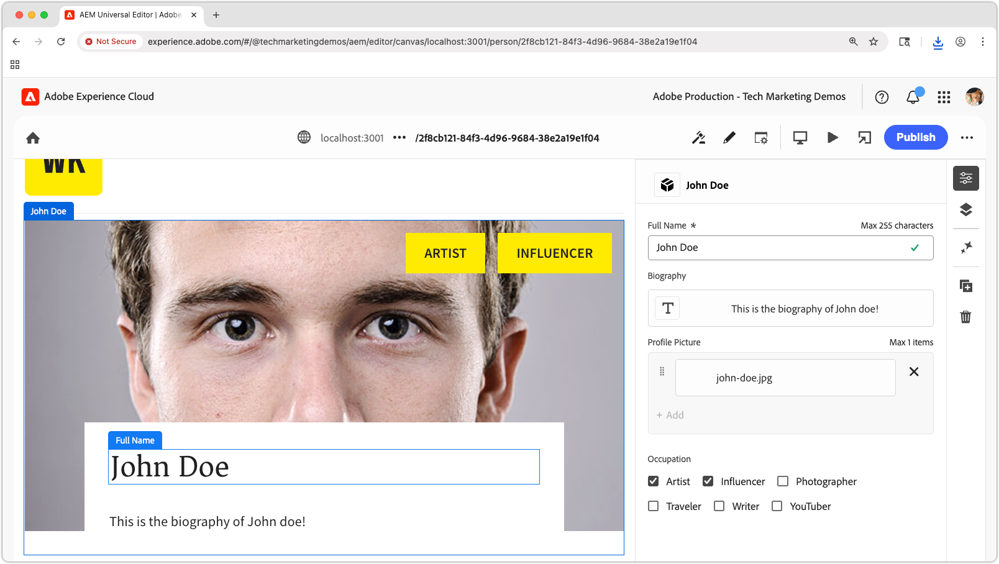
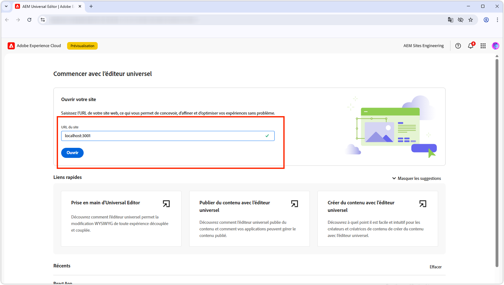

# Rendre l’application React modifiable avec l’éditeur universel

Dans ce chapitre, vous apprenez à rendre l’application React créée dans le [chapitre précédent](./4-react-app.md) modifiable à l’aide de l’éditeur universel d’AEM. L’éditeur universel permet aux personnes en charge de la création de contenu de modifier du contenu directement dans le contexte de l’expérience de l’application React, tout en conservant l’expérience transparente d’une application découplée.



L’éditeur universel offre un moyen puissant d’activer la modification contextuelle pour n’importe quelle application web, ce qui permet aux créateurs et aux créatrices de modifier le contenu sans basculer entre différentes interfaces de création.

## Prérequis

* Les étapes précédentes de ce tutoriel ont été terminées, en particulier [Créer une application React qui utilise les OpenAPI de diffusion de fragments de contenu AEM](./4-react-app.md)
* Une connaissance pratique de [comment utiliser et implémenter l’éditeur universel](https://experienceleague.adobe.com/fr/docs/experience-manager-cloud-service/content/implementing/developing/universal-editor/introduction).

## Objectifs

Découvrez comment :

* Ajoutez l’instrumentation de l’éditeur universel à l’application React.
* Configurez l’application React pour l’éditeur universel.
* Activez la modification de contenu directement dans l’interface de l’application React à l’aide de l’éditeur universel.

## Instrumentation de l’éditeur universel

L’éditeur universel requiert [les attributs HTML et les balises meta](https://experienceleague.adobe.com/fr/docs/experience-manager-cloud-service/content/implementing/developing/universal-editor/attributes-types) pour identifier le contenu modifiable et établir la connexion entre l’interface utilisateur et le contenu AEM.

### Ajout de balises d’éditeur universel

Tout d’abord, ajoutez les balises méta nécessaires pour identifier l’application React comme compatible avec l’éditeur universel.

1. Ouvrez `public/index.html` dans votre application React.
1. Ajoutez les [balises méta de l’éditeur universel et script CORS](https://experienceleague.adobe.com/fr/docs/experience-manager-cloud-service/content/implementing/developing/universal-editor/getting-started) dans la section `<head>` de l’application React :

   ```html
   <!DOCTYPE html>
   <html lang="en">
   <head>
       <meta charset="utf-8" />
       <link rel="icon" href="%PUBLIC_URL%/favicon.ico" />
       <meta name="viewport" content="width=device-width, initial-scale=1" />
       <meta name="theme-color" content="#000000" />
       <meta name="description" content="WKND Teams React App" />
   
       <!-- Universal Editor meta tags and CORS script -->
       <meta name="urn:adobe:aue:system:aemconnection" content="aem:%REACT_APP_AEM_AUTHOR_HOST_URI%" />
       <script src="https://universal-editor-service.adobe.io/cors.js"></script>
   
       <link rel="apple-touch-icon" href="%PUBLIC_URL%/logo192.png" />
       <link rel="manifest" href="%PUBLIC_URL%/manifest.json" />
       <title>WKND Teams</title>
   </head>
   <body>
       <noscript>You need to enable JavaScript to run this app.</noscript>
       <div id="root"></div>
   </body>
   </html>
   ```

1. Mettez à jour le fichier `.env` de l’application React afin d’inclure l’hôte du service de création AEM pour prendre en charge les écritures différées dans l’éditeur universel (utilisé dans la valeur de la balise metat `urn:adobe:aue:system:aemconnection`).

   ```bash
   # The AEM Publish (or Preview) service
   REACT_APP_HOST_URI=https://publish-p123-e456.adobeaemcloud.com
   
   # The AEM Author service
   REACT_APP_AEM_AUTHOR_HOST_URI=https://author-p123-e456.adobeaemcloud.com
   ```

### Instrumenter le composant Équipes

Ajoutez maintenant les attributs de l’éditeur universel pour rendre le composant Équipes modifiable.

1. Ouvrez `src/components/Teams.js`.
1. Mettez à jour le composant `Team` pour inclure [les attributs de données de l’éditeur universel](https://experienceleague.adobe.com/fr/docs/experience-manager-cloud-service/content/implementing/developing/universal-editor/attributes-types) :

   Lors de la définition de l’attribut `data-aue-resource`, assurez-vous que le chemin d’accès AEM au fragment de contenu, tel que renvoyé par la diffusion de fragment de contenu AEM avec les API OpenAPI, est postfixé avec le sous-chemin d’accès à la variation de fragment de contenu ; dans ce cas, `/jcr:content/data/master`.

   ```javascript
   import { useEffect, useState } from "react";
   import { Link } from "react-router-dom";
   import "./Teams.scss";
   
   function Teams() {
   
   // The teams folder is the only folder-tree that is allowed to contain Team Content Fragments.
   const TEAMS_FOLDER = '/content/dam/my-project/en/teams';
   
   // State to store the teams data
   const [teams, setTeams] = useState(null);
   
   useEffect(() => {
       /**
       * Fetches all teams and their associated member details
       * This is a two-step process:
       * 1. First, get all team content fragments from the specified folder
       * 2. Then, for each team, fetch the full details including hydrated references to get the team member names
       */
       const fetchData = async () => {
       try {
           // Step 1: Fetch all teams from the teams folder
           const response = await fetch(
           `${process.env.REACT_APP_HOST_URI}/adobe/contentFragments?path=${TEAMS_FOLDER}`
           );
           const allTeams = (await response.json()).items || [];
   
           // Step 2: Fetch detailed information for each team with hydrated references
           const hydratedTeams = [];
           for (const team of allTeams) {
               const hydratedTeamResponse = await fetch(
                   `${process.env.REACT_APP_HOST_URI}/adobe/contentFragments/${team.id}?references=direct-hydrated`
               );
               hydratedTeams.push(await hydratedTeamResponse.json());
           }
   
           setTeams(hydratedTeams);
       } catch (error) {
           console.error("Error fetching content fragments:", error);
       }
       };
   
       fetchData();
   }, [TEAMS_FOLDER]);
   
   // Show loading state while teams data is being fetched
   if (!teams) {
       return <div>Loading teams...</div>;
   }
   
   // Render the teams
   return (
       <div className="teams">
       {teams.map((team, index) => {
           return (
           <Team
               key={index}
               {...team}
           />
           );
       })}
       </div>
   );
   }
   
   /**
   * Team - renders a single team with its details and members
   * @param {Object} fields - The authored Content Fragment fields
   * @param {Object} references - Hydrated references containing member details such as fullName
   * @param {string} path - Path of the team content fragment
   */
   function Team({ fields, references, path }) {
   if (!fields.title || !fields.teamMembers) {
       return null;
   }
   
   return (
       <>
       {/* Specify the correct Content Fragment variation path suffix in the data-aue-resource attribute */}
       <div className="team"
           data-aue-resource={`urn:aemconnection:${path}/jcr:content/data/master`}
           data-aue-type="component"
           data-aue-label={fields.title}>
   
           <h2 className="team__title"
           data-aue-prop="title"
           data-aue-type="text"
           data-aue-label="Team Title">{fields.title}</h2>
           <p className="team__description"
           data-aue-prop="description"
           data-aue-type="richtext"
           data-aue-label="Team Description"
           dangerouslySetInnerHTML={{ __html: fields.description.value }}
           />
           <div>
           <h4 className="team__members-title">Members</h4>
           <ul className="team__members">
               {fields.teamMembers.map((teamMember, index) => {
               return (
                   <li key={index} className="team__member">
                   <Link to={`/person/${teamMember}`}>
                       {references[teamMember].value.fields.fullName}
                   </Link>
                   </li>
               );
               })}
           </ul>
           </div>
       </div>
       </>
   );
   }
   
   export default Teams;
   ```

### Instrumenter le composant Personne

De même, ajoutez les attributs de l’éditeur universel au composant Personne .

1. Ouvrez `src/components/Person.js`.
1. Mettez à jour le composant pour inclure [les attributs de données de l’éditeur universel](https://experienceleague.adobe.com/fr/docs/experience-manager-cloud-service/content/implementing/developing/universal-editor/attributes-types) :

   Lors de la définition de l’attribut `data-aue-resource`, assurez-vous que le chemin d’accès AEM au fragment de contenu, tel que renvoyé par la diffusion de fragment de contenu AEM avec les API OpenAPI, est postfixé avec le sous-chemin d’accès à la variation de fragment de contenu ; dans ce cas, `/jcr:content/data/master`.

   ```javascript
   import "./Person.scss";
   import { useEffect, useState } from "react";
   import { useParams } from "react-router-dom";
   
   /**
   * Person component - displays detailed information about a single person
   * Fetches person data from AEM using the ID from the URL parameters
   */
   function Person() {
       const { id } = useParams();
       const [person, setPerson] = useState(null);
   
       useEffect(() => {
           const fetchData = async () => {
           try {
               const response = await fetch(
               `${process.env.REACT_APP_HOST_URI}/adobe/contentFragments/${id}?references=direct-hydrated`
               );
               const json = await response.json();
               setPerson(json || null);
           } catch (error) {
               console.error("Error fetching person data:", error);
           }
           };
           fetchData();
       }, [id]);
   
       if (!person) {
           return <div>Loading person...</div>;
       }
   
       /* Add the Universal Editor data-aue-* attirbutes to the rendered HTML */
       return (
           <div className="person"
               data-aue-resource={`urn:aemconnection:${person.path}/jcr:content/data/master`}
               data-aue-type="component"
               data-aue-label={person.fields.fullName}>
               
               <div className="person__occupations">
                   {person.fields.occupation.map((occupation, index) => {
                   return (
                       <span key={index} className="person__occupation">
                           {occupation}
                       </span>
                   );
                   })}
               </div>
   
               <div className="person__content">
                   <h1 className="person__full-name"
                       data-aue-prop="fullName"
                       data-aue-type="text"
                       data-aue-label="Full Name">
                       {person.fields.fullName}
                   </h1>
                   <div className="person__biography"
                       data-aue-prop="biographyText"
                       data-aue-type="richtext"
                       data-aue-label="Biography"
                       dangerouslySetInnerHTML={{ __html: person.fields.biographyText.value }}
                   />
               </div>
           </div>
       );
   }
   ```

### Obtenir le code terminé

Le code source complet de ce chapitre est [disponible sur Github.com](https://github.com/adobe/aem-tutorials/tree/headless_open-api_basic_5-end).


```bash
$ git fetch --tags
$ git tag
$ git checkout tags/headless_open-api_basic_5-end
```

## Test de l’intégration de l’éditeur universel

Testez maintenant les mises à jour de compatibilité de l’éditeur universel en ouvrant l’application React dans l’éditeur universel.

### Démarrer l’application React

1. Vérifiez que votre application React est en cours d’exécution :

   ```bash
   $ cd ~/Code/aem-guides-wknd-openapi/basic-tutorial
   $ npm install
   $ npm start
   ```

1. Vérifiez que l’application se charge à l’`http://localhost:3000` et affiche le contenu des équipes et des personnes.

### Exécuter le proxy SSL local

L’éditeur universel nécessite que l’application modifiable soit chargée via HTTPS.

1. Pour exécuter l’application React locale via HTTPS, utilisez le module npm [local-ssl-proxy](https://www.npmjs.com/package/local-ssl-proxy) à partir de la ligne de commande.

   ```bash
   $ npm install -g local-ssl-proxy
   $ local-ssl-proxy --source 3001 --target 3000
   ```

1. Ouvrez `https://localhost:3001` dans votre navigateur web
1. Accepter le certificat auto-signé.
1. Vérifiez que l’application React se charge.

### Ouvrir dans l’éditeur universel



1. Accédez à [ Éditeur universel ](https://experience.adobe.com/#/@myOrg/aem/editor/canvas/).
1. Dans le champ **URL du site**, saisissez l’URL de l’application React HTTPS : `https://localhost:3001`.
1. Sélectionnez Cliquer **Ouvrir**.

L’éditeur universel doit charger votre application React avec les fonctionnalités d’édition activées.

### Tester la fonctionnalité d’édition


1. Dans l’éditeur universel, passez la souris sur les éléments modifiables de votre application React.

1. Pour naviguer dans l’application React, activez le mode **Aperçu** puis désactivez-le pour le modifier. N’oubliez pas que le **Aperçu** n’a rien à voir avec le service d’aperçu AEM. Il active et désactive plutôt la fonction Modifier Chrome dans l’éditeur universel.

1. Vous devriez voir les indicateurs d’édition et être en mesure de cliquer sur les différents éléments modifiables de l’application React.

1. Essayez de modifier le titre d’une équipe :
   * Clic sur le titre d&#39;une équipe
   * Modifier le texte dans le panneau des propriétés
   * Enregistrez les modifications.

1. Essayez de modifier la photo de profil d’une personne :
   * Cliquer sur la photo de profil d’une personne
   * Sélectionner une nouvelle image à partir du sélecteur de ressources
   * Enregistrez les modifications.

1. Appuyez sur **Publier** dans le coin supérieur droit de l’éditeur universel pour publier les modifications sur le service de Publication AEM (ou Aperçu), afin qu’elles soient répercutées dans l’application React dans l’éditeur universel.

## Attributs de données de l’éditeur universel

Pour obtenir une documentation complète sur l’instrumentation d’une application pour l’éditeur universel, reportez-vous à la [documentation de l’éditeur universel](https://experience.adobe.com/#/@myOrg/aem/editor/canvas/).

## Félicitations !

Félicitations. Vous avez correctement intégré l’éditeur universel à votre application React. Les auteurs de contenu peuvent désormais modifier des fragments de contenu directement dans l’interface de l’application React, offrant ainsi une expérience de création transparente tout en conservant les avantages d’une architecture découplée.

N’oubliez pas que vous pouvez toujours obtenir le code source final de ce tutoriel à partir de la branche `main` du référentiel [GitHub.com](https://github.com/adobe/aem-tutorials/tree/main).
