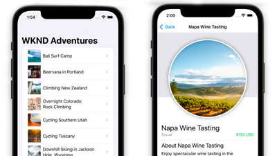

# Tutorials pour Headless dans AEM{#aem-headless-tutorials}

Adobe Experience Manager (AEM) dispose de plusieurs options pour définir des points de terminaison sans affichage et diffuser son contenu au format JSON. Utilisez des tutoriels pratiques pour découvrir comment utiliser les différentes options et choisir ce qui vous convient.

>[!TIP]
>
>Cette collection de tutoriels est conçue pour ceux qui préfèrent **apprendre en faisant**. Si vous préférez les concepts d’apprentissage, consultez la [AEM Parcours développeur sans tête](https://experienceleague.adobe.com/docs/experience-manager-cloud-service/content/headless/journeys/developer/overview.html). Cet ensemble de tutoriels et de parcours se complètent.

## Tutorials par API

<table>
<tr>
  <td>
    
    

      <a href="https://experienceleague.adobe.com/docs/experience-manager-learn/getting-started-with-aem-headless/graphql/overview.html">
    <strong>API GraphQL</strong>
    </a>
    

    

    <em>Découvrez comment une application peut utiliser AEM API GraphQL pour interroger le contenu.</em>
    

  </td>
  <td>
    
    

    <a href="https://experienceleague.adobe.com/docs/experience-manager-learn/getting-started-with-aem-headless/authentication/overview.html">
    <strong>Authentification des jetons</strong>
    </a>
    

    

    <em>Découvrez comment une application peut s’authentifier en toute sécurité avec AEM.</em>
    

  </td>
  <td>
    
     

      <a href="https://experienceleague.adobe.com/docs/experience-manager-learn/getting-started-with-aem-headless/content-services/overview.html">
        <strong>Content Services</strong>
      </a>
    

    

    <em>Découvrez comment une application peut utiliser une API REST pour consommer du contenu.</em>
    

  </td>
</tr>
</table>

## Exemples d’applications

Les exemples d’applications sont un excellent moyen d’explorer les fonctionnalités d’Adobe Experience Manager (AEM) sans interface utilisateur. Téléchargez et installez ces exemples terminés pour commencer immédiatement.

<table>
<tr>
  <td>
    
    

      <a href="https://experienceleague.adobe.com/docs/experience-manager-learn/getting-started-with-aem-headless/graphql/example-apps/ios-swiftui-app.html">
    <strong>Exemple iOS SwiftUI</strong>
    </a>
    

    

    <em>Une application iOS optimisée par les API GraphQL d’AEM.</em>
    

  </td>
  <td>
    
    

    <a href="https://experienceleague.adobe.com/docs/experience-manager-learn/getting-started-with-aem-headless/graphql/example-apps/android-app.html">
    <strong>Exemple Android™</strong>
    </a>
    

    

    <em>Application Android™ optimisée par les API GraphQL d’AEM.</em>
    

  </td>
  <td>
    
     

      <a href="https://experienceleague.adobe.com/docs/experience-manager-learn/getting-started-with-aem-headless/graphql/example-apps/react-app.html">
        <strong>Exemple React</strong>
      </a>
    

    

    <em>Application React optimisée par les API GraphQL d’AEM.</em>
    

  </td>
</tr>
</table>

## Tutorials par structure

Parcourez les tutoriels suivants en fonction de la technologie utilisée. Découvrez comment AEM peut aller au-delà d’un simple cas d’utilisation sans tête, avec des options de création en contexte et de gestion de l’expérience.

<table>
<tr>
  <td>
    
    

      <a href="https://experienceleague.adobe.com/docs/experience-manager-learn/getting-started-with-aem-headless/graphql/overview.html">
    <strong>React - Headless</strong>
    </a>
    

    

    <em>Créez une application React JS à l’aide de GraphQL dans un scénario sans tête.</em>
    

  </td>
  <td>
    
    

    <a href="https://experienceleague.adobe.com/docs/experience-manager-learn/getting-started-with-aem-headless/spa-editor/remote-spa/overview.html">
    <strong>React - Éditeur distant</strong>
    </a>
    

    

    <em>Créez dans le contexte une partie d’une application React hébergée à distance.</em>
    

  </td>
  <td>
    
     

      <a href="https://experienceleague.adobe.com/docs/experience-manager-learn/getting-started-with-aem-headless/spa-editor/react/overview.html">
        <strong>React - Éditeur SPA</strong>
      </a>
    

    

    <em>Utilisez l’éditeur SPA d’AEM pour gérer l’expérience complète de l’application React.</em>
    

  </td>
</tr>
<tr>  
  <td>
    
    

    <a href="https://experienceleague.adobe.com/docs/experience-manager-learn/getting-started-with-aem-headless/content-services/overview.html">
    <strong>Android - Content Services</strong>
    </a>
    

    

    <em>Utilisez Content Services et REST pour alimenter une application mobile Android™.</em>
    

  </td>
  <td>
    
     

      <a href="https://experienceleague.adobe.com/docs/experience-manager-learn/getting-started-with-aem-headless/authentication/overview.html">
        <strong>Node.js - Authentification</strong>
      </a>
    

    

    <em>Créez une application Node.js à l’aide de jetons de développement et de service pour l’authentification.</em>
    

  </td>
  <td></td>
</tr>
</table>
