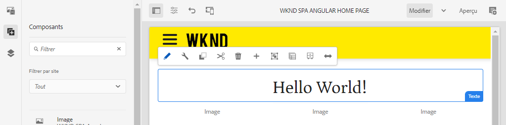
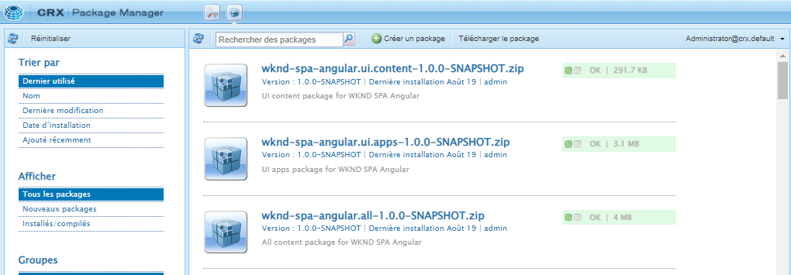
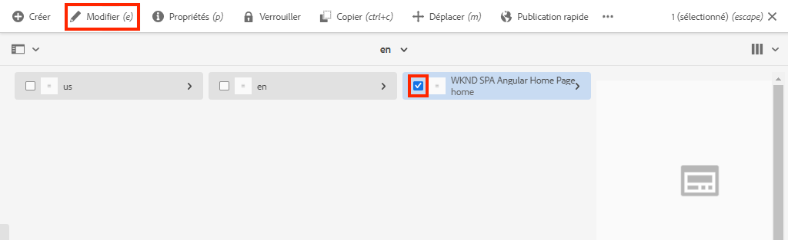
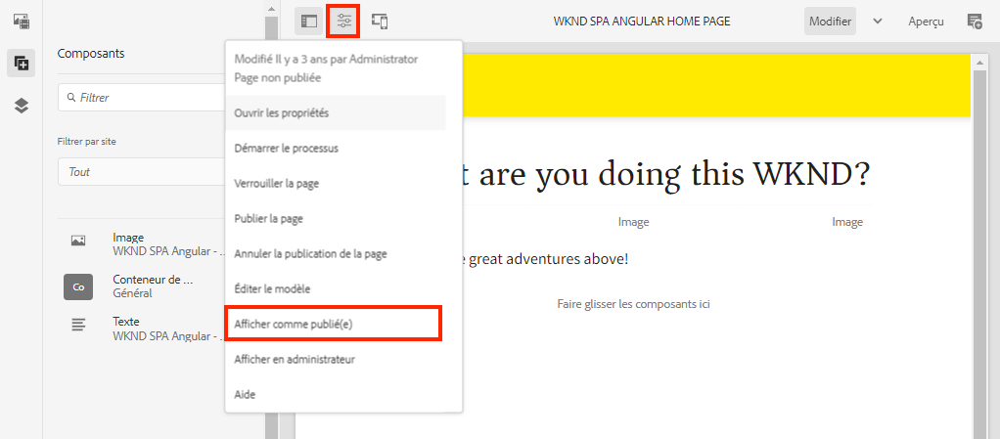

# Projet d’éditeur de SPA {#create-project}

Apprenez à utiliser un projet Maven d’Adobe Experience Manager (AEM) comme point de départ pour une application Angular intégrée à l’éditeur de SPA d’AEM.

## Objectif

1. Découvrez la structure d’un nouveau projet d’éditeur de SPA d’AEM construit à partir d’un archétype Maven.
2. Déployez le projet de démarrage sur une instance locale d’AEM.

## Ce que vous allez créer

Dans ce chapitre, un nouveau projet AEM basé sur l’[archétype de projet d’AEM](https://github.com/adobe/aem-project-archetype) est déployé. Le projet AEM est amorcé avec un point de départ très simple pour la SPA d’Angular. Le projet utilisé dans ce chapitre servira de base à une implémentation de la SPA WKND et son élaboration sera continuée dans les prochains chapitres.



*Un message « Hello World » classique.*

## Prérequis

Examinez les outils et les instructions nécessaires à la configuration d’un [environnement de développement local](overview.md#local-dev-environment). Assurez-vous qu’une nouvelle instance d’Adobe Experience Manager a démarré en mode **création** et qu’elle s’exécute localement.

## Obtenir le projet

Il existe plusieurs options pour créer un projet Maven multi-module pour AEM. Ce tutoriel a utilisé la dernière version de l’[archétype de projet d’AEM](https://github.com/adobe/aem-project-archetype) comme base de code du tutoriel. Des modifications ont été apportées au code du projet afin de prendre en charge plusieurs versions d’AEM. Veuillez consulter [la note sur la rétrocompatibilité](overview.md#compatibility).

>[!CAUTION]
>
>Il est recommandé d’utiliser la **dernière** version de l’[archétype](https://github.com/adobe/aem-project-archetype) pour générer un nouveau projet pour une implémentation concrète. Les projets AEM doivent cibler une seule version d’AEM avec la propriété `aemVersion` de l’archétype.

1. Téléchargez le point de départ de ce tutoriel via Git :

   ```shell
   $ git clone git@github.com:adobe/aem-guides-wknd-spa.git
   $ cd aem-guides-wknd-spa
   $ git checkout Angular/create-project-start
   ```

2. La structure de dossiers et de fichiers suivante correspond au projet AEM qui a été généré par l’archétype Maven sur le système de fichiers local :

   ```plain
   |--- aem-guides-wknd-spa
       |--- all/
       |--- core/
       |--- dispatcher/
       |--- ui.apps/
       |--- ui.apps.structure/
       |--- ui.content/
       |--- ui.frontend /
       |--- it.tests/
       |--- pom.xml
       |--- README.md
       |--- .gitignore
       |--- archetype.properties
   ```

3. Les propriétés suivantes ont été utilisées lors de la génération du projet AEM à partir de l’[Archétype de projet AEM](https://github.com/Adobe-Marketing-Cloud/aem-project-archetype/releases/tag/aem-project-archetype-14) :

   | Propriété | Valeur |
   |-----------------|---------------------------------------|
   | aemVersion | cloud |
   | appTitle | SPA WKND Angular |
   | appId | wknd-spa-angular |
   | groupId | com.adobe.aem.guides |
   | frontendModule | angular |
   | package | com.adobe.aem.guides.wknd.spa.angular |
   | includeExamples | n |

   >[!NOTE]
   >
   > Notez la propriété `frontendModule=angular`. Elle indique à l’archétype de projet d’AEM d’amorcer le projet avec une [base de code de démarrage Angular](https://experienceleague.adobe.com/docs/experience-manager-core-components/using/developing/archetype/uifrontend-angular.html?lang=fr) à utiliser avec l’éditeur de SPA d’AEM.

## Créer le projet

Compilez, créez et déployez ensuite le code du projet sur une instance locale d’AEM à l’aide de Maven.

1. Assurez-vous qu’une instance d’AEM s’exécute localement sur le port **4502**.
2. Depuis le terminal de ligne de commande, vérifiez que Maven est installé :

   ```shell
   $ mvn --version
   Apache Maven 3.6.2
   Maven home: /Library/apache-maven-3.6.2
   Java version: 11.0.4, vendor: Oracle Corporation, runtime: /Library/Java/JavaVirtualMachines/jdk-11.0.4.jdk/Contents/Home
   ```

3. Exécutez la commande Maven suivante à partir du répertoire `aem-guides-wknd-spa` pour générer et déployer le projet sur AEM :

   ```shell
   $ mvn -PautoInstallSinglePackage clean install
   ```

   Si vous utilisez [AEM 6.x](overview.md#compatibility) :

   ```shell
   $ mvn clean install -PautoInstallSinglePackage -Pclassic
   ```

   Les différents modules du projet doivent être compilés et déployés sur AEM.

   ```plain
   [INFO] ------------------------------------------------------------------------
   [INFO] Reactor Summary for wknd-spa-angular 1.0.0-SNAPSHOT:
   [INFO] 
   [INFO] wknd-spa-angular ................................... SUCCESS [  0.473 s]
   [INFO] WKND SPA Angular - Core ............................ SUCCESS [ 54.866 s]
   [INFO] wknd-spa-angular.ui.frontend - UI Frontend ......... SUCCESS [02:10 min]
   [INFO] WKND SPA Angular - Repository Structure Package .... SUCCESS [  0.694 s]
   [INFO] WKND SPA Angular - UI apps ......................... SUCCESS [  6.351 s]
   [INFO] WKND SPA Angular - UI content ...................... SUCCESS [  2.885 s]
   [INFO] WKND SPA Angular - All ............................. SUCCESS [  1.736 s]
   [INFO] WKND SPA Angular - Integration Tests Bundles ....... SUCCESS [  2.563 s]
   [INFO] WKND SPA Angular - Integration Tests Launcher ...... SUCCESS [  1.846 s]
   [INFO] WKND SPA Angular - Dispatcher ...................... SUCCESS [  0.270 s]
   [INFO] ------------------------------------------------------------------------
   [INFO] BUILD SUCCESS
   [INFO] ------------------------------------------------------------------------
   ```

   Le profil Maven ***autoInstallSinglePackage*** compile les modules individuels du projet et déploie un package unique sur l’instance AEM. Par défaut, ce package est déployé sur une instance AEM s’exécutant localement sur le port **4502** et avec les informations d’identification **admin:admin**.

4. Accédez au **[!UICONTROL Gestionnaire de packages]** sur votre instance AEM locale : [http://localhost:4502/crx/packmgr/index.jsp](http://localhost:4502/crx/packmgr/index.jsp).

5. Vous devriez voir trois modules pour `wknd-spa-angular.all`, `wknd-spa-angular.ui.apps` et `wknd-spa-angular.ui.content`.

   

   Le code personnalisé nécessaire au projet est regroupé dans ces packages et installé sur l’exécution d’AEM.

6. Vous devriez également voir plusieurs packages pour `spa.project.core` et `core.wcm.components`. Il s’agit de dépendances incluses automatiquement par l’archétype. De plus amples informations sur les [composants principaux d’AEM sont disponibles ici](https://experienceleague.adobe.com/docs/experience-manager-core-components/using/introduction.html?lang=fr).

## Créer du contenu

Ouvrez ensuite la SPA de démarrage générée par l’archétype et mettez à jour une partie du contenu.

1. Accédez à la console **[!UICONTROL Sites]** : [http://localhost:4502/sites.html/content](http://localhost:4502/sites.html/content).

   La SPA WKND comprend une structure de site de base avec un pays, une langue et une page d’accueil. Cette hiérarchie est basée sur les valeurs par défaut de l’archétype pour `language_country` et `isSingleCountryWebsite`. Ces valeurs peuvent être remplacées en mettant à jour les [propriétés disponibles](https://github.com/adobe/aem-project-archetype#available-properties) lors de la génération d’un projet.

2. Ouvrez la page **[!DNL us]** > **[!DNL en]** > **[!DNL WKND SPA Angular Home Page]** en sélectionnant la page et en cliquant sur le bouton **[!UICONTROL Modifier]** dans la barre de menus :

   

3. Un composant de **[!UICONTROL texte]** a déjà été ajouté à la page. Vous pouvez modifier ce composant comme tout autre composant dans AEM.

   

4. Ajoutez un composant de **[!UICONTROL texte]** supplémentaire à la page.

   Notez que l’expérience de création est similaire à celle d’une page AEM Sites traditionnelle. Actuellement, un nombre limité de composants peuvent être utilisés. D’autres éléments seront ajoutés au cours du tutoriel.

## Inspecter l’application monopage (SPA)

Vérifiez ensuite qu’il s’agit d’une application monopage à l’aide des outils de développement de votre navigateur.

1. Dans l’**[!UICONTROL éditeur de page]**, cliquez sur le menu d’**[!UICONTROL Informations sur la page]** > **[!UICONTROL Afficher comme publié]** :

   

   Un nouvel onglet s’ouvre avec le paramètre de requête `?wcmmode=disabled` qui désactive l’éditeur AEM : [http://localhost:4502/content/wknd-spa-angular/us/en/home.html?wcmmode=disabled](http://localhost:4502/content/wknd-spa-angular/us/en/home.html?wcmmode=disabled).

2. Affichez la source de la page et notez que le contenu textuel **[!DNL Hello World]** ou tout autre contenu est introuvable. À la place, vous devriez voir une adresse HTML similaire à celle-ci :

   ```html
   ...
   <body>
       <noscript>You need to enable JavaScript to run this app.</noscript>
       <div id="spa-root"></div>
       <script type="text/javascript" src="/etc.clientlibs/wknd-spa-angular/clientlibs/clientlib-angular.min.js"></script>
       ...
   </body>
   ...
   ```

   `clientlib-angular.min.js` est la SPA Angular chargée sur la page et responsable du rendu du contenu.

   *D’où vient le contenu ?*

3. Revenez à l’onglet : [http://localhost:4502/content/wknd-spa-angular/us/en/home.html?wcmmode=disabled](http://localhost:4502/content/wknd-spa-angular/us/en/home.html?wcmmode=disabled).
4. Ouvrez les outils de développement du navigateur et examinez le trafic réseau de la page lors d’une actualisation. Affichez les requêtes **XHR** :

   

   Il doit y avoir une requête pour [http://localhost:4502/content/wknd-spa-angular/us/en.model.json](http://localhost:4502/content/wknd-spa-angular/us/en.model.json). Elle contient tout le contenu, au format JSON, qui pilotera la SPA.

5. Dans un nouvel onglet, ouvrez [http://localhost:4502/content/wknd-spa-angular/us/en.model.json](http://localhost:4502/content/wknd-spa-angular/us/en.model.json).

   La requête `en.model.json` représente le modèle de contenu qui pilotera l’application. Examinez la sortie JSON pour trouver l’extrait représentant le ou les composants de **[!UICONTROL texte]**.

   ```json
   ...
   ":items": {
       "text": {
           "text": "<p>Hello World! Updated content!</p>\r\n",
           "richText": true,
           ":type": "wknd-spa-angular/components/text"
       },
       "text_98796435": {
           "text": "<p>A new text component.</p>\r\n",
           "richText": true,
           ":type": "wknd-spa-angular/components/text"
   },
   ...
   ```

   Dans le chapitre suivant, nous allons examiner la manière dont le contenu JSON est mappé des composants AEM aux composants SPA pour former la base de l’expérience de l’éditeur de SPA d’AEM.

   >[!NOTE]
   >
   > Il peut s’avérer utile d’installer une extension de navigateur pour formater automatiquement la sortie JSON.

## Félicitations. {#congratulations}

Félicitations, vous venez de créer votre premier projet d’éditeur SPA AEM.

C’est assez simple pour l’instant, mais dans les prochains chapitres, d’autres fonctionnalités seront ajoutées.

### Étapes suivantes {#next-steps}

[Intégrer la SPA](integrate-spa.md) - Découvrez comment le code source de la SPA est intégré au projet AEM et découvrez les outils disponibles pour développer rapidement la SPA.
