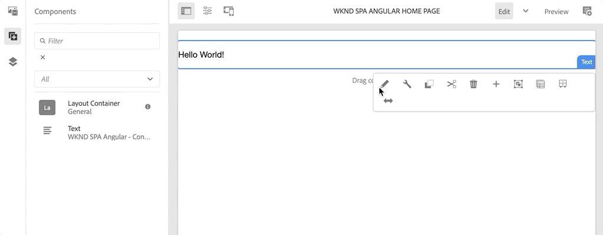

# SPA Editor Project {#create-project}

Découvrez comment utiliser un projet Maven Adobe Experience Manager (AEM) comme point de départ pour une application d’Angular intégrée à AEM Editor.

## Objectif

1. Découvrez la structure d’un nouveau projet AEM SPA Editor créé à partir d’un archétype Maven.
2. Déployez le projet de démarrage sur une instance locale d’AEM.

## Ce que vous allez créer

Dans ce chapitre, un nouveau projet AEM est déployé en fonction de la variable [AEM Archétype de projet](https://github.com/adobe/aem-project-archetype). Le projet AEM est démarré avec un point de départ très simple pour l’SPA de l’Angular. Le projet utilisé dans ce chapitre servira de base à une mise en oeuvre de la SPA WKND et sera élaboré sur la base des prochains chapitres.


*Un message Hello World classique.*

## Prérequis

Examinez les outils et les instructions requis pour configurer une [environnement de développement local](overview.md#local-dev-environment). Assurez-vous qu’une nouvelle instance d’Adobe Experience Manager a démarré dans **author** , s’exécute localement.

## Obtention du projet

Il existe plusieurs options pour créer un projet Maven multi-module pour AEM. Ce tutoriel a utilisé la dernière version [AEM Archétype de projet](https://github.com/adobe/aem-project-archetype) comme base du code du tutoriel. Des modifications ont été apportées au code du projet afin de prendre en charge plusieurs versions d’AEM. Veuillez consulter [la note sur la rétrocompatibilité ;](overview.md#compatibility).

>[!CAUTION]
>
>Il est recommandé d’utiliser la variable **dernier** de la version [archetype](https://github.com/adobe/aem-project-archetype) pour générer un nouveau projet pour une mise en oeuvre concrète. AEM projets doivent cibler une version unique d’AEM à l’aide de la variable `aemVersion` de l’archétype.

1. Téléchargez le point de départ de ce tutoriel via Git :

   ```shell
   $ git clone git@github.com:adobe/aem-guides-wknd-spa.git
   $ cd aem-guides-wknd-spa
   $ git checkout Angular/create-project-start
   ```

2. La structure de dossiers et de fichiers suivante représente le projet AEM généré par l’archétype Maven sur le système de fichiers local :

   ```plain
   |--- aem-guides-wknd-spa
       |--- all/
       |--- core/
       |--- dispatcher/
       |--- ui.apps/
       |--- ui.apps.structure/
       |--- ui.content/
       |--- ui.frontend /
       |--- it.tests/
       |--- pom.xml
       |--- README.md
       |--- .gitignore
       |--- archetype.properties
   ```

3. Les propriétés suivantes ont été utilisées lors de la génération du projet AEM à partir du [AEM archétype de projet](https://github.com/Adobe-Marketing-Cloud/aem-project-archetype/releases/tag/aem-project-archetype-14):

   | Propriété | Valeur |
   |-----------------|---------------------------------------|
   | aemVersion | nuage |
   | appTitle | Angular SPA WKND |
   | appId | wknd-spa-angular |
   | groupId | com.adobe.aem.guides |
   | frontendModule | angular |
   | package | com.adobe.aem.guides.wknd.spa.angular |
   | includeExamples | n |

   >[!NOTE]
   >
   > Remarquez la variable `frontendModule=angular` . Cela indique à AEM Project Archetype de démarrer le projet avec un démarrage. [Base de code Angular](https://experienceleague.adobe.com/docs/experience-manager-core-components/using/developing/archetype/uifrontend-angular.html) à utiliser avec AEM SPA Editor.

## Créez le projet

Ensuite, compilez, compilez et déployez le code du projet sur une instance locale d’AEM à l’aide de Maven.

1. Vérifiez qu’une instance d’AEM s’exécute localement sur le port. **4502**.
2. Depuis le terminal de ligne de commande, vérifiez que Maven est installé :

   ```shell
   $ mvn --version
   Apache Maven 3.6.2
   Maven home: /Library/apache-maven-3.6.2
   Java version: 11.0.4, vendor: Oracle Corporation, runtime: /Library/Java/JavaVirtualMachines/jdk-11.0.4.jdk/Contents/Home
   ```

3. Exécutez la commande Maven ci-dessous à partir du `aem-guides-wknd-spa` pour créer et déployer le projet vers AEM :

   ```shell
   $ mvn -PautoInstallSinglePackage clean install
   ```

   Si vous utilisez [AEM 6.x](overview.md#compatibility):

   ```shell
   $ mvn clean install -PautoInstallSinglePackage -Pclassic
   ```

   Les multiples modules du projet doivent être compilés et déployés sur AEM.

   ```plain
   [INFO] ------------------------------------------------------------------------
   [INFO] Reactor Summary for wknd-spa-angular 1.0.0-SNAPSHOT:
   [INFO] 
   [INFO] wknd-spa-angular ................................... SUCCESS [  0.473 s]
   [INFO] WKND SPA Angular - Core ............................ SUCCESS [ 54.866 s]
   [INFO] wknd-spa-angular.ui.frontend - UI Frontend ......... SUCCESS [02:10 min]
   [INFO] WKND SPA Angular - Repository Structure Package .... SUCCESS [  0.694 s]
   [INFO] WKND SPA Angular - UI apps ......................... SUCCESS [  6.351 s]
   [INFO] WKND SPA Angular - UI content ...................... SUCCESS [  2.885 s]
   [INFO] WKND SPA Angular - All ............................. SUCCESS [  1.736 s]
   [INFO] WKND SPA Angular - Integration Tests Bundles ....... SUCCESS [  2.563 s]
   [INFO] WKND SPA Angular - Integration Tests Launcher ...... SUCCESS [  1.846 s]
   [INFO] WKND SPA Angular - Dispatcher ...................... SUCCESS [  0.270 s]
   [INFO] ------------------------------------------------------------------------
   [INFO] BUILD SUCCESS
   [INFO] ------------------------------------------------------------------------
   ```

   Profil Maven ***autoInstallSinglePackage*** compile les modules individuels du projet et déploie un seul module sur l’instance AEM. Par défaut, ce package est déployé sur une instance AEM s’exécutant localement sur le port **4502** et avec les informations d’identification de **admin:admin**.

4. Accédez à **[!UICONTROL Gestionnaire de modules]** sur votre instance d’AEM locale : [http://localhost:4502/crx/packmgr/index.jsp](http://localhost:4502/crx/packmgr/index.jsp).

5. Vous devriez voir trois modules pour `wknd-spa-angular.all`, `wknd-spa-angular.ui.apps` et `wknd-spa-angular.ui.content`.

   

   Tout le code personnalisé nécessaire au projet est regroupé dans ces modules et installé sur le runtime AEM.

6. Vous devriez également voir plusieurs modules pour `spa.project.core` et `core.wcm.components`. Il s’agit de dépendances automatiquement incluses par l’archétype. Plus d’informations sur [AEM Composants principaux se trouve ici](https://experienceleague.adobe.com/docs/experience-manager-core-components/using/introduction.html?lang=fr).

## Création de contenu

Ouvrez ensuite le SPA de démarrage généré par l’archétype et mettez à jour une partie du contenu.

1. Accédez au **[!UICONTROL Sites]** console : [http://localhost:4502/sites.html/content](http://localhost:4502/sites.html/content).

   Le SPA WKND comprend une structure de site de base avec un pays, une langue et une page d’accueil. Cette hiérarchie est basée sur les valeurs par défaut de l’archétype pour `language_country` et `isSingleCountryWebsite`. Ces valeurs peuvent être remplacées en mettant à jour la variable [propriétés disponibles](https://github.com/adobe/aem-project-archetype#available-properties) lors de la génération d’un projet.

2. Ouvrez le **[!DNL us]** > **[!DNL en]** > **[!DNL WKND SPA Angular Home Page]** en sélectionnant la page et en cliquant sur l’icône **[!UICONTROL Modifier]** dans la barre de menus :

   

3. A **[!UICONTROL Texte]** a déjà été ajouté à la page. Vous pouvez modifier ce composant comme tout autre composant dans AEM.

   

4. Ajouter un **[!UICONTROL Texte]** du composant à la page.

   Notez que l’expérience de création est similaire à celle d’une page AEM Sites traditionnelle. Actuellement, un nombre limité de composants peuvent être utilisés. D’autres éléments sont ajoutés au cours du tutoriel.

## Inspect de l’application d’une seule page

Vérifiez ensuite qu’il s’agit d’une application d’une seule page qui utilise les outils de développement de votre navigateur.

1. Dans le **[!UICONTROL Éditeur de page]**, cliquez sur le bouton **[!UICONTROL Informations sur la page]** menu > **[!UICONTROL Afficher comme publié(e)]**:

   

   Un nouvel onglet s’ouvre avec le paramètre de requête. `?wcmmode=disabled` qui désactive l’éditeur d’AEM : [http://localhost:4502/content/wknd-spa-angular/us/en/home.html?wcmmode=disabled](http://localhost:4502/content/wknd-spa-angular/us/en/home.html?wcmmode=disabled)

2. Affichez la source de la page et notez que le contenu textuel **[!DNL Hello World]** ou l’un des autres contenus est introuvable. À la place, vous devriez voir un HTML comme celui-ci :

   ```html
   ...
   <body>
       <noscript>You need to enable JavaScript to run this app.</noscript>
       <div id="spa-root"></div>
       <script type="text/javascript" src="/etc.clientlibs/wknd-spa-angular/clientlibs/clientlib-angular.min.js"></script>
       ...
   </body>
   ...
   ```

   `clientlib-angular.min.js` est l’Angular SPA chargé sur la page et responsable du rendu du contenu.

   *D’où vient le contenu ?*

3. Revenez à l’onglet : [http://localhost:4502/content/wknd-spa-angular/us/en/home.html?wcmmode=disabled](http://localhost:4502/content/wknd-spa-angular/us/en/home.html?wcmmode=disabled)
4. Ouvrez les outils de développement du navigateur et examinez le trafic réseau de la page lors d’une actualisation. Afficher la variable **XHR** requests :

   

   Il doit y avoir une requête pour [http://localhost:4502/content/wknd-spa-angular/us/en.model.json](http://localhost:4502/content/wknd-spa-angular/us/en.model.json). Contient tout le contenu, au format JSON, qui pilotera le SPA.

5. Dans un nouvel onglet, ouvrez [http://localhost:4502/content/wknd-spa-angular/us/en.model.json](http://localhost:4502/content/wknd-spa-angular/us/en.model.json)

   La requête `en.model.json` représente le modèle de contenu qui pilotera l’application. Inspect de la sortie JSON et vous devriez être en mesure de trouver le fragment de code représentant le **[!UICONTROL Texte]** composants.

   ```json
   ...
   ":items": {
       "text": {
           "text": "<p>Hello World! Updated content!</p>\r\n",
           "richText": true,
           ":type": "wknd-spa-angular/components/text"
       },
       "text_98796435": {
           "text": "<p>A new text component.</p>\r\n",
           "richText": true,
           ":type": "wknd-spa-angular/components/text"
   },
   ...
   ```

   Dans le chapitre suivant, nous allons examiner la manière dont le contenu JSON est mappé des composants AEM aux composants SPA pour former la base de l’expérience de l’éditeur d’.

   >[!NOTE]
   >
   > Il peut s’avérer utile d’installer une extension de navigateur pour formater automatiquement la sortie JSON.

## Félicitations ! {#congratulations}

Félicitations, vous venez de créer votre premier projet SPA Éditeur d&#39;AEM !

C&#39;est assez simple à l&#39;heure actuelle, mais dans les chapitres suivants, des fonctionnalités supplémentaires sont ajoutées.

### Étapes suivantes {#next-steps}

[Intégration de la SPA](integrate-spa.md) - Découvrez comment le code source de SPA est intégré au projet AEM et comprenez les outils disponibles pour développer rapidement le développement de l’ensemble de la base de données.
