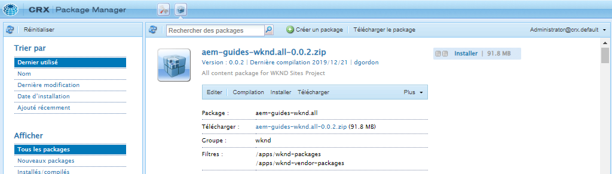
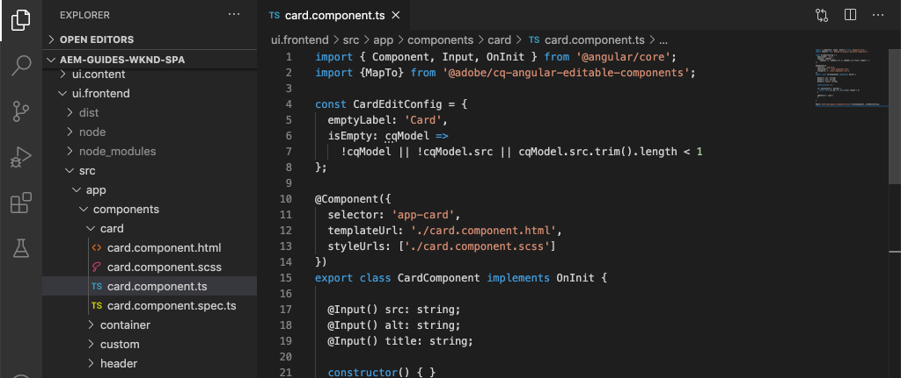
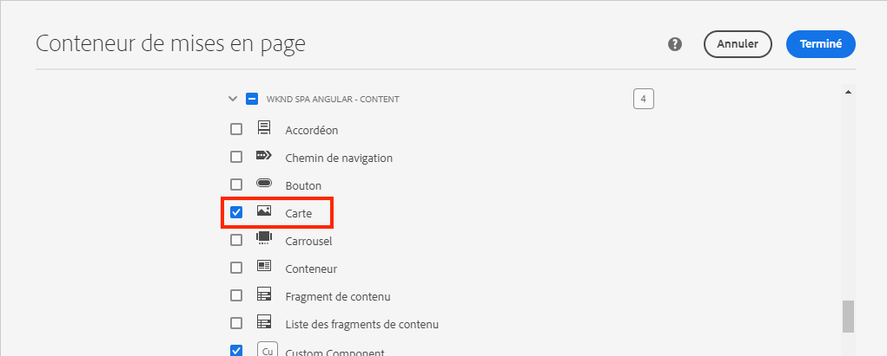
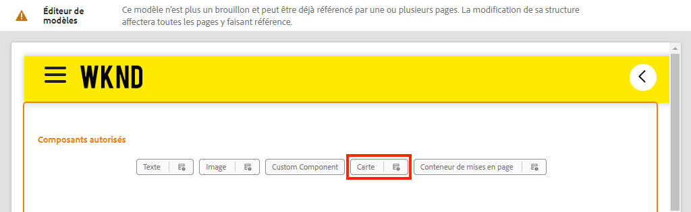
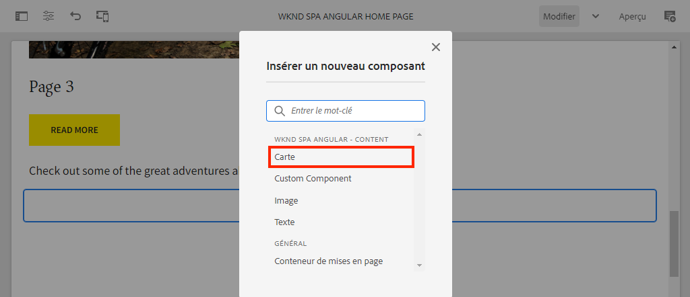
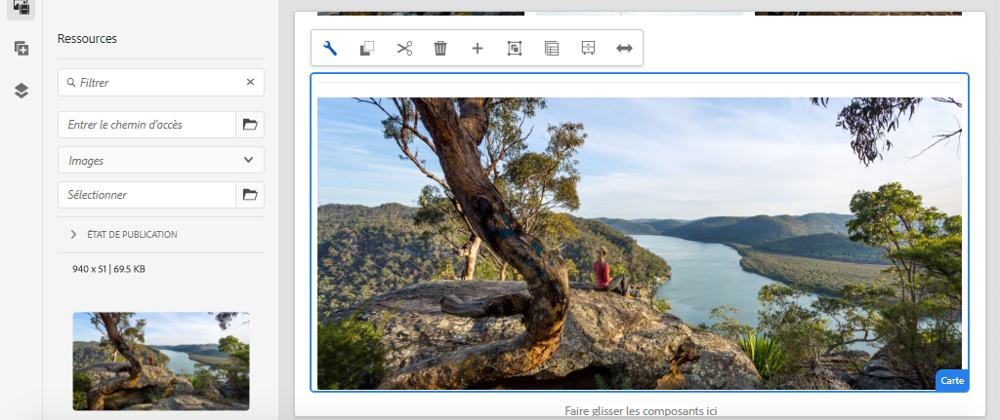
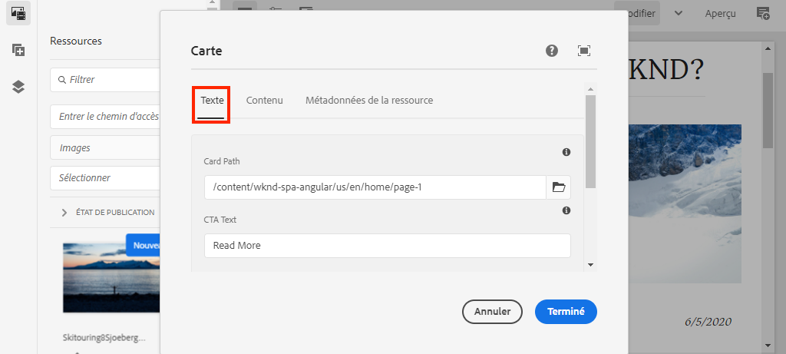
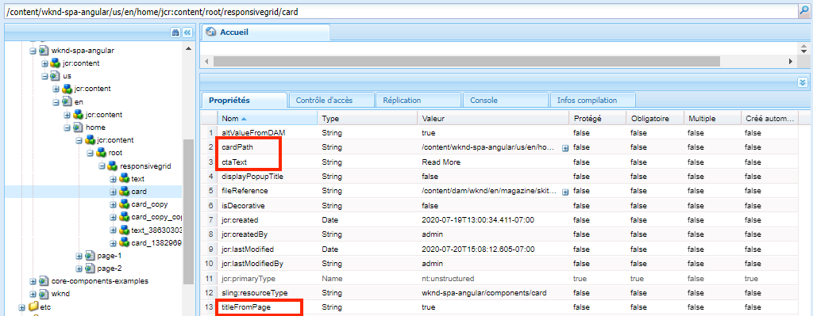
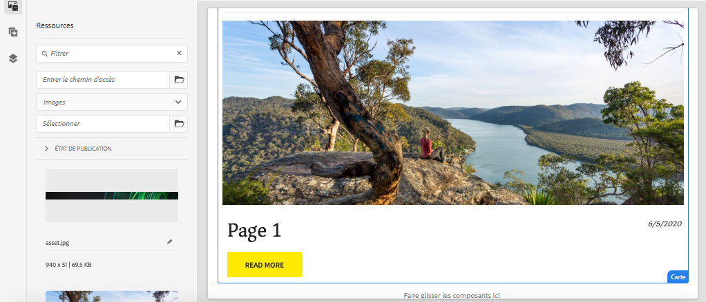

# Étendre un composant principal {#extend-component}

Découvrez comment étendre un composant principal existant à utiliser avec l’éditeur SPA d’AEM. Comprendre comment étendre un composant existant est une technique puissante pour personnaliser et étendre les fonctionnalités d’une implémentation d’AEM SPA éditeur.

## Objectif

1. Étendez un composant principal existant avec des propriétés et du contenu supplémentaires.
2. Comprendre les principes de base de l’héritage des composants à l’aide de la fonction `sling:resourceSuperType`.
3. Découvrez comment utiliser le [Modèle de délégation](https://github.com/adobe/aem-core-wcm-components/wiki/Delegation-Pattern-for-Sling-Models) pour les modèles Sling afin de réutiliser la logique et les fonctionnalités existantes.

## Ce que vous allez créer

Dans ce chapitre, une nouvelle `Card` est créé. Le `Card` étend le composant [Composant principal Image](https://experienceleague.adobe.com/docs/experience-manager-core-components/using/components/image.html?lang=fr) l’ajout de champs de contenu supplémentaires, tels qu’un titre et un bouton Appel à l’action , afin d’effectuer le rôle d’un teaser pour d’autres contenus dans le SPA.


>[!NOTE]
>
> Dans une mise en oeuvre réelle, il peut être plus approprié d’utiliser simplement la variable [Composant Teaser](https://experienceleague.adobe.com/docs/experience-manager-core-components/using/components/teaser.html) d’étendre la variable [Composant principal Image](https://experienceleague.adobe.com/docs/experience-manager-core-components/using/components/image.html) pour créer une `Card` en fonction des exigences du projet. Il est toujours recommandé d’utiliser [Composants principaux](https://experienceleague.adobe.com/docs/experience-manager-core-components/using/introduction.html?lang=fr) directement, si possible.

## Prérequis

Examinez les outils et les instructions requis pour configurer une [environnement de développement local](overview.md#local-dev-environment).

### Obtention du code

1. Téléchargez le point de départ de ce tutoriel via Git :

   ```shell
   $ git clone git@github.com:adobe/aem-guides-wknd-spa.git
   $ cd aem-guides-wknd-spa
   $ git checkout Angular/extend-component-start
   ```

2. Déployez la base de code sur une instance d’AEM locale à l’aide de Maven :

   ```shell
   $ mvn clean install -PautoInstallSinglePackage
   ```

   Si vous utilisez [AEM 6.x](overview.md#compatibility) ajoutez le `classic` profile:

   ```shell
   $ mvn clean install -PautoInstallSinglePackage -Pclassic
   ```

3. Installez le module terminé pour le module traditionnel [Site de référence WKND](https://github.com/adobe/aem-guides-wknd/releases/tag/aem-guides-wknd-2.1.0). Les images fournies par [Site de référence WKND](https://github.com/adobe/aem-guides-wknd/releases/latest) est réutilisé sur le SPA WKND. Le module peut être installé à l’aide de [AEM Gestionnaire de modules](http://localhost:4502/crx/packmgr/index.jsp).

   

Vous pouvez toujours afficher le code terminé sur [GitHub](https://github.com/adobe/aem-guides-wknd-spa/tree/Angular/extend-component-solution) ou extraire le code localement en passant à la branche `Angular/extend-component-solution`.

## Mise en oeuvre initiale de la carte Inspect

Un composant Carte initial a été fourni par le code de démarrage du chapitre. Inspect est le point de départ de la mise en oeuvre de la carte.

1. Dans l’IDE de votre choix, ouvrez le `ui.apps` module .
2. Accédez à `ui.apps/src/main/content/jcr_root/apps/wknd-spa-angular/components/card` et affichez le `.content.xml` fichier .

   

   ```xml
   <?xml version="1.0" encoding="UTF-8"?>
   <jcr:root xmlns:sling="http://sling.apache.org/jcr/sling/1.0" xmlns:cq="http://www.day.com/jcr/cq/1.0" xmlns:jcr="http://www.jcp.org/jcr/1.0"
       jcr:primaryType="cq:Component"
       jcr:title="Card"
       sling:resourceSuperType="wknd-spa-angular/components/image"
       componentGroup="WKND SPA Angular - Content"/>
   ```

   La propriété `sling:resourceSuperType` pointe vers `wknd-spa-angular/components/image` indiquant que la variable `Card` hérite des fonctionnalités du composant d’image WKND SPA.

3. Inspectez le fichier `ui.apps/src/main/content/jcr_root/apps/wknd-spa-angular/components/image/.content.xml` :

   ```xml
   <?xml version="1.0" encoding="UTF-8"?>
   <jcr:root xmlns:sling="http://sling.apache.org/jcr/sling/1.0" xmlns:cq="http://www.day.com/jcr/cq/1.0" xmlns:jcr="http://www.jcp.org/jcr/1.0"
       jcr:primaryType="cq:Component"
       jcr:title="Image"
       sling:resourceSuperType="core/wcm/components/image/v2/image"
       componentGroup="WKND SPA Angular - Content"/>
   ```

   Notez que la variable `sling:resourceSuperType` pointe vers `core/wcm/components/image/v2/image`. Cela indique que le composant d’image WKND SPA hérite des fonctionnalités de l’image du composant principal.

   Également appelé [Modèle de proxy](https://experienceleague.adobe.com/docs/experience-manager-core-components/using/developing/guidelines.html#proxy-component-pattern) L’héritage des ressources Sling est un modèle de conception puissant qui permet aux composants enfants d’hériter des fonctionnalités et d’étendre/de remplacer le comportement si nécessaire. L’héritage Sling prend en charge plusieurs niveaux d’héritage, de sorte que le nouveau `Card` hérite des fonctionnalités de l’image du composant principal.

   De nombreuses équipes de développement s&#39;efforcent d&#39;être DE (ne vous répétez pas). L’héritage Sling rend cela possible avec AEM.

4. Sous la `card` , ouvrez le fichier `_cq_dialog/.content.xml`.

   Ce fichier est la définition de la boîte de dialogue Composant pour la variable `Card` composant. Si vous utilisez l’héritage Sling, il est possible d’utiliser les fonctionnalités de la variable [Sling Resource Merger](https://experienceleague.adobe.com/docs/experience-manager-65/developing/platform/sling-resource-merger.html?lang=fr) pour remplacer ou étendre des parties de la boîte de dialogue. Dans cet exemple, un nouvel onglet a été ajouté à la boîte de dialogue pour capturer des données supplémentaires d’un auteur afin de renseigner le composant Carte.

   Propriétés telles que `sling:orderBefore` permettre aux développeurs de choisir où insérer de nouveaux onglets ou champs de formulaire. Dans ce cas, la variable `Text` est inséré avant la balise `asset` . Pour tirer pleinement parti de Sling Resource Merger, il est important de connaître la structure de noeud de boîte de dialogue d’origine pour la variable [Boîte de dialogue du composant Image](https://github.com/adobe/aem-core-wcm-components/blob/master/content/src/content/jcr_root/apps/core/wcm/components/image/v2/image/_cq_dialog/.content.xml).

5. Sous la `card` , ouvrez le fichier `_cq_editConfig.xml`. Ce fichier détermine le comportement de glisser-déposer dans l’interface utilisateur de création d’AEM. Lors de l’extension du composant Image, il est important que le type de ressource corresponde au composant lui-même. Consultez la section `<parameters>` node:

   ```xml
   <parameters
       jcr:primaryType="nt:unstructured"
       sling:resourceType="wknd-spa-angular/components/card"
       imageCrop=""
       imageMap=""
       imageRotate=""/>
   ```

   La plupart des composants ne nécessitent pas de `cq:editConfig`, l’image et les descendants enfants du composant Image sont des exceptions.

6. Dans l’IDE, basculez sur le `ui.frontend` module, accès à `ui.frontend/src/app/components/card`:

   

7. Inspectez le fichier `card.component.ts`.

   Le composant a déjà été bouché pour être mappé à l’AEM `Card` Composant utilisant la norme `MapTo` fonction .

   ```js
   MapTo('wknd-spa-angular/components/card')(CardComponent, CardEditConfig);
   ```

   Consultez les trois `@Input` paramètres de la classe pour `src`, `alt`, et `title`. Il s’agit des valeurs JSON attendues du composant AEM qui sont mappées au composant Angular.

8. Ouvrez le fichier `card.component.html`:

   ```html
   <div class="card"  *ngIf="hasContent">
       <app-image class="card__image" [src]="src" [alt]="alt" [title]="title"></app-image>
   </div>
   ```

   Dans cet exemple, nous avons choisi de réutiliser le composant Image d’Angular existant. `app-image` en transmettant simplement la variable `@Input` paramètres de `card.component.ts`. Plus loin dans le tutoriel, des propriétés supplémentaires sont ajoutées et affichées.

## Mise à jour de la stratégie de modèle

Avec cette première `Card` passez en revue la mise en oeuvre de la fonctionnalité dans AEM SPA Editor. Pour afficher la `Card` Une mise à jour de la stratégie Modèle est nécessaire.

1. Déployez le code de démarrage sur une instance locale d’AEM, le cas échéant :

   ```shell
   $ cd aem-guides-wknd-spa
   $ mvn clean install -PautoInstallSinglePackage
   ```

2. Accédez au modèle de page SPA à l’adresse [http://localhost:4502/editor.html/conf/wknd-spa-angular/settings/wcm/templates/spa-page-template/structure.html](http://localhost:4502/editor.html/conf/wknd-spa-angular/settings/wcm/templates/spa-page-template/structure.html).
3. Mettez à jour la stratégie du conteneur de mises en page pour ajouter la nouvelle `Card` en tant que composant autorisé :

   

   Enregistrez les modifications apportées à la stratégie et observez la variable `Card` en tant que composant autorisé :

   

## Composant Carte initial de création

Ensuite, créez le `Card` à l’aide de l’éditeur SPA d’AEM.

1. Accédez à [http://localhost:4502/editor.html/content/wknd-spa-angular/us/en/home.html](http://localhost:4502/editor.html/content/wknd-spa-angular/us/en/home.html).
2. Dans `Edit` , ajoutez le `Card` au composant `Layout Container`:

   

3. Faites glisser et déposez une image de l’outil de recherche de ressources sur le `Card` component :

   

4. Ouvrez le `Card` la boîte de dialogue du composant et notez l’ajout d’un **Texte** Onglet.
5. Saisissez les valeurs suivantes sur la page **Texte** tab :

   

   **Chemin de la carte** - sélectionnez une page sous la page d’accueil SPA.

   **Texte CTA** - &quot;En savoir plus&quot;

   **Titre de la carte** - laisser vide

   **Obtenir le titre de la page liée** - cochez la case pour indiquer true.

6. Mettez à jour le **Métadonnées de ressource** pour ajouter des valeurs **Texte de remplacement** et **Légende**.

   Actuellement, aucune modification supplémentaire n’apparaît après la mise à jour de la boîte de dialogue. Pour exposer les nouveaux champs au composant Angular, nous devons mettre à jour le modèle Sling pour le `Card` composant.

7. Ouvrez un nouvel onglet et accédez à [CRXDE-Lite](http://localhost:4502/crx/de/index.jsp#/content/wknd-spa-angular/us/en/home/jcr%3Acontent/root/responsivegrid/card). Inspect des noeuds de contenu sous `/content/wknd-spa-angular/us/en/home/jcr:content/root/responsivegrid` pour rechercher la variable `Card` contenu du composant.

   

   Observez les propriétés. `cardPath`, `ctaText`, `titleFromPage` sont conservées par la boîte de dialogue.

## Mettre à jour le modèle Sling de carte

Pour exposer, en fin de compte, les valeurs de la boîte de dialogue du composant au composant Angular, nous devons mettre à jour le modèle Sling qui renseigne le fichier JSON pour la variable `Card` composant. Nous avons également la possibilité de mettre en oeuvre deux logiques commerciales :

* If `titleFromPage` to **true**, renvoie le titre de la page spécifié par `cardPath` sinon, renvoie la valeur de `cardTitle` textfield.
* Renvoie la date de dernière modification de la page spécifiée par `cardPath`.

Revenez à l’IDE de votre choix et ouvrez le `core` module .

1. Ouvrez le fichier `Card.java` dans `core/src/main/java/com/adobe/aem/guides/wknd/spa/angular/core/models/Card.java`.

   Observez que `Card` étend actuellement l’interface `com.adobe.cq.wcm.core.components.models.Image` et hérite donc des méthodes de la variable `Image` . Le `Image` étend déjà l’interface `ComponentExporter` qui permet d’exporter le modèle Sling au format JSON et de le mapper par l’éditeur de SPA. Par conséquent, il n’est pas nécessaire d’étendre explicitement `ComponentExporter` comme nous l’avons fait dans la [Chapitre Composant personnalisé](custom-component.md).

2. Ajoutez les méthodes suivantes à l’interface :

   ```java
   @ProviderType
   public interface Card extends Image {
   
       /***
       * The URL to populate the CTA button as part of the card.
       * The link should be based on the cardPath property that points to a page.
       * @return String URL
       */
       public String getCtaLinkURL();
   
       /***
       * The text to display on the CTA button of the card.
       * @return String CTA text
       */
       public String getCtaText();
   
   
   
       /***
       * The date to be displayed as part of the card.
       * This is based on the last modified date of the page specified by the cardPath
       * @return
       */
       public Calendar getCardLastModified();
   
   
       /**
       * Return the title of the page specified by cardPath if `titleFromPage` is set to true.
       * Otherwise return the value of `cardTitle`
       * @return
       */
       public String getCardTitle();
   }
   ```

   Ces méthodes sont exposées via l’API de modèle JSON et transmises au composant Angular.

3. Ouvrez `CardImpl.java`. Il s’agit de la mise en oeuvre de `Card.java` . Cette implémentation a été partiellement bloquée pour accélérer le tutoriel.  Notez l’utilisation de la variable `@Model` et `@Exporter` des annotations pour garantir que le modèle Sling peut être sérialisé au format JSON via l’exportateur de modèle Sling.

   `CardImpl.java` utilise également la variable [Modèle de délégation pour les modèles Sling](https://github.com/adobe/aem-core-wcm-components/wiki/Delegation-Pattern-for-Sling-Models) pour éviter de réécrire la logique à partir du composant principal Image.

4. Observez les lignes suivantes :

   ```java
   @Self
   @Via(type = ResourceSuperType.class)
   private Image image;
   ```

   L’annotation ci-dessus instancie un objet Image nommé `image` en fonction de la variable `sling:resourceSuperType` héritage de `Card` composant.

   ```java
   @Override
   public String getSrc() {
       return null != image ? image.getSrc() : null;
   }
   ```

   Il est alors possible d’utiliser simplement la variable `image` pour implémenter des méthodes définies par `Image` sans avoir à écrire la logique nous-mêmes. Cette technique est utilisée pour `getSrc()`, `getAlt()`, et `getTitle()`.

5. Implémentez ensuite le `initModel()` méthode de lancement d’une variable privée `cardPage` en fonction de la valeur de `cardPath`

   ```java
   @PostConstruct
   public void initModel() {
       if(StringUtils.isNotBlank(cardPath) && pageManager != null) {
           cardPage = pageManager.getPage(this.cardPath);
       }
   }
   ```

   Le `@PostConstruct initModel()` est appelé lorsque le modèle Sling est initialisé. Il s’agit donc d’une bonne occasion d’initialiser des objets qui peuvent être utilisés par d’autres méthodes du modèle. Le `pageManager` est l’un de plusieurs [Objets globaux pris en charge par Java™](https://experienceleague.adobe.com/docs/experience-manager-htl/content/global-objects.html) mis à la disposition des modèles Sling via l’option `@ScriptVariable` annotation. Le [getPage](https://developer.adobe.com/experience-manager/reference-materials/cloud-service/javadoc/com/day/cq/wcm/api/PageManager.html) prend un chemin et renvoie une AEM [Page](https://developer.adobe.com/experience-manager/reference-materials/cloud-service/javadoc/com/day/cq/wcm/api/Page.html) ou null si le chemin ne pointe pas vers une page valide.

   Cette opération initialise la variable `cardPage` qui est utilisée par les autres nouvelles méthodes pour renvoyer des données sur la page liée sous-jacente.

6. Passez en revue les variables globales déjà mappées aux propriétés JCR enregistrées dans la boîte de dialogue de création. Le `@ValueMapValue` annotation est utilisée pour effectuer automatiquement le mappage.

   ```java
   @ValueMapValue
   private String cardPath;
   
   @ValueMapValue
   private String ctaText;
   
   @ValueMapValue
   private boolean titleFromPage;
   
   @ValueMapValue
   private String cardTitle;
   ```

   Ces variables sont utilisées pour implémenter les méthodes supplémentaires pour la variable `Card.java` .

7. Mettez en oeuvre les méthodes supplémentaires définies dans la variable `Card.java` interface :

   ```java
   @Override
   public String getCtaLinkURL() {
       if(cardPage != null) {
           return cardPage.getPath() + ".html";
       }
       return null;
   }
   
   @Override
   public String getCtaText() {
       return ctaText;
   }
   
   @Override
   public Calendar getCardLastModified() {
      if(cardPage != null) {
          return cardPage.getLastModified();
      }
      return null;
   }
   
   @Override
   public String getCardTitle() {
       if(titleFromPage) {
           return cardPage != null ? cardPage.getTitle() : null;
       }
       return cardTitle;
   }
   ```

   >[!NOTE]
   >
   > Vous pouvez afficher la variable [terminé CardImpl.java ici](https://github.com/adobe/aem-guides-wknd-spa/blob/Angular/extend-component-solution/core/src/main/java/com/adobe/aem/guides/wknd/spa/angular/core/models/impl/CardImpl.java).

8. Ouvrez une fenêtre de terminal et déployez uniquement les mises à jour apportées à la fonction `core` à l’aide de Maven ; `autoInstallBundle` du profil `core` répertoire .

   ```shell
   $ cd core/
   $ mvn clean install -PautoInstallBundle
   ```

   Si vous utilisez [AEM 6.x](overview.md#compatibility) ajoutez le `classic` profile.

9. Affichez la réponse du modèle JSON à l’adresse : [http://localhost:4502/content/wknd-spa-angular/us/en.model.json](http://localhost:4502/content/wknd-spa-angular/us/en.model.json) et recherchez le `wknd-spa-angular/components/card`:

   ```json
   "card": {
       "ctaText": "Read More",
       "cardTitle": "Page 1",
       "title": "Woman chillaxing with river views in Australian bushland",
       "src": "/content/wknd-spa-angular/us/en/home/_jcr_content/root/responsivegrid/card.coreimg.jpeg/1595190732886/adobestock-216674449.jpeg",
       "alt": "Female sitting on a large rock relaxing in afternoon dappled light the Australian bushland with views over the river",
       "cardLastModified": 1591360492414,
       "ctaLinkURL": "/content/wknd-spa-angular/us/en/home/page-1.html",
       ":type": "wknd-spa-angular/components/card"
   }
   ```

   Notez que le modèle JSON est mis à jour avec des paires clé/valeur supplémentaires après la mise à jour des méthodes dans la variable `CardImpl` Modèle Sling.

## Mettre à jour le composant Angular

Maintenant que le modèle JSON est renseigné avec de nouvelles propriétés pour `ctaLinkURL`, `ctaText`, `cardTitle`, et `cardLastModified` nous pouvons mettre à jour le composant Angular pour les afficher.

1. Revenez à l’IDE et ouvrez le `ui.frontend` module . Vous pouvez éventuellement démarrer le serveur de développement webpack à partir d’une nouvelle fenêtre de terminal pour afficher les modifications en temps réel :

   ```shell
   $ cd ui.frontend
   $ npm install
   $ npm start
   ```

2. Ouvrir `card.component.ts` at `ui.frontend/src/app/components/card/card.component.ts`. Ajoutez la variable `@Input` annotations pour capturer le nouveau modèle :

   ```diff
   export class CardComponent implements OnInit {
   
        @Input() src: string;
        @Input() alt: string;
        @Input() title: string;
   +    @Input() cardTitle: string;
   +    @Input() cardLastModified: number;
   +    @Input() ctaLinkURL: string;
   +    @Input() ctaText: string;
   ```

3. Ajoutez des méthodes pour vérifier si l’appel à l’action est prêt et pour renvoyer une chaîne date/heure basée sur la variable `cardLastModified` input :

   ```js
   export class CardComponent implements OnInit {
       ...
       get hasCTA(): boolean {
           return this.ctaLinkURL && this.ctaLinkURL.trim().length > 0 && this.ctaText && this.ctaText.trim().length > 0;
       }
   
       get lastModifiedDate(): string {
           const lastModifiedDate = this.cardLastModified ? new Date(this.cardLastModified) : null;
   
           if (lastModifiedDate) {
           return lastModifiedDate.toLocaleDateString();
           }
           return null;
       }
       ...
   }
   ```

4. Ouvrir `card.component.html` et ajoutez les balises suivantes pour afficher le titre, l’appel à l’action et la date de dernière modification :

   ```html
   <div class="card"  *ngIf="hasContent">
       <app-image class="card__image" [src]="src" [alt]="alt" [title]="title"></app-image>
       <div class="card__content">
           <h2 class="card__title">
               {{cardTitle}}
               <span class="card__lastmod" *ngIf="lastModifiedDate">{{lastModifiedDate}}</span>
           </h2>
           <div class="card__action-container" *ngIf="hasCTA">
               <a [routerLink]="ctaLinkURL" class="card__action-link" [title]="ctaText">
                   {{ctaText}}
               </a>
           </div>
       </div>
   </div>
   ```

   Des règles Sass ont déjà été ajoutées à l’adresse `card.component.scss` pour appliquer un style au titre, appelez à l’action et à la date de dernière modification.

   >[!NOTE]
   >
   > Vous pouvez afficher la [Angular du code du composant de carte ici](https://github.com/adobe/aem-guides-wknd-spa/tree/Angular/extend-component-solution/ui.frontend/src/app/components/card).

5. Déployez toutes les modifications apportées à AEM à partir de la racine du projet à l’aide de Maven :

   ```shell
   $ cd aem-guides-wknd-spa
   $ mvn clean install -PautoInstallSinglePackage
   ```

6. Accédez à [http://localhost:4502/editor.html/content/wknd-spa-angular/us/en/home.html](http://localhost:4502/editor.html/content/wknd-spa-angular/us/en/home.html) pour afficher le composant mis à jour :

   

7. Vous devriez être en mesure de recréer le contenu existant pour créer une page semblable à ce qui suit :

   

## Félicitations ! {#congratulations}

Félicitations, vous avez appris à étendre un composant AEM et comment les modèles et boîtes de dialogue Sling fonctionnent avec le modèle JSON.

Vous pouvez toujours afficher le code terminé sur [GitHub](https://github.com/adobe/aem-guides-wknd-spa/tree/Angular/extend-component-solution) ou extraire le code localement en passant à la branche `Angular/extend-component-solution`.
