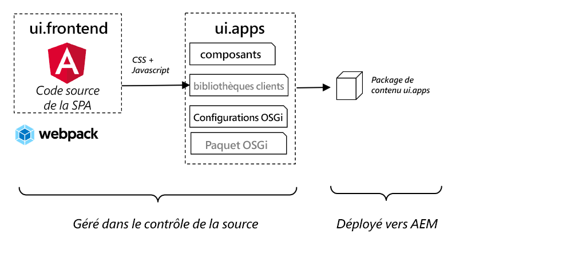
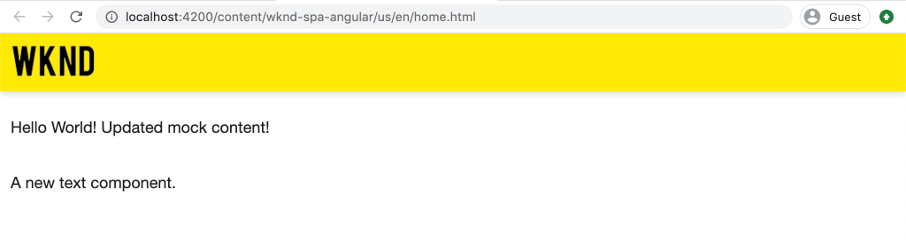

# Intégrer une SPA {#integrate-spa}

Découvrez comment le code source d’une application monopage (SPA) écrite dans Angular peut être intégré à un projet Adobe Experience Manager (AEM). Découvrez comment utiliser des outils front-end modernes, tels qu’un serveur de développement Webpack, pour développer rapidement la SPA par rapport à l’API de modèle JSON AEM.

## Objectif

1. Découvrez comment le projet SPA est intégré à AEM avec les bibliothèques côté client.
2. Découvrez comment utiliser un serveur de développement local pour le développement front-end dédié.
3. Explorez l’utilisation d’un **proxy** et d’un fichier statique **simulé** pour le développement par rapport à l’API de modèle JSON d’AEM.

## Ce que vous allez créer

Ce chapitre ajoute un simple composant `Header` à la SPA. Au cours de la création de ce composant d’`Header` statique, plusieurs approches sont utilisées pour le développement de la SPA d’AEM.


*La SPA est étendue pour ajouter un composant `Header` statique*.

## Prérequis

Examinez les outils et les instructions nécessaires pour configurer un [environnement de développement local](overview.md#local-dev-environment).

### Obtenir le code

1. Téléchargez le point de départ de ce tutoriel via Git :

   ```shell
   $ git clone git@github.com:adobe/aem-guides-wknd-spa.git
   $ cd aem-guides-wknd-spa
   $ git checkout Angular/integrate-spa-start
   ```

2. Déployez la base de code sur une instance AEM locale à l’aide de Maven :

   ```shell
   $ mvn clean install -PautoInstallSinglePackage
   ```

   Si vous utilisez [AEM 6.x](overview.md#compatibility), ajoutez le profil `classic` :

   ```shell
   $ mvn clean install -PautoInstallSinglePackage -Pclassic
   ```

Vous pouvez toujours afficher le code terminé sur [GitHub](https://github.com/adobe/aem-guides-wknd-spa/tree/Angular/integrate-spa-solution) ou consulter le code localement en passant à la branche `Angular/integrate-spa-solution`.

## Approche d’intégration {#integration-approach}

Deux modules ont été créés dans le cadre du projet AEM : `ui.apps` et `ui.frontend`.

Le module `ui.frontend` est un projet [webpack](https://webpack.js.org/) qui contient tout le code source de la SPA. La majorité du développement et des tests SPA est effectuée dans le projet Webpack. Lorsqu’une version de production est déclenchée, la SPA est créée et compilée à l’aide de Webpack. Les artefacts compilés (CSS et Javascript) sont copiés dans le module `ui.apps` qui est ensuite déployé sur l’exécution locale d’AEM.



*Représentation de haut niveau de l’intégration SPA.*

Des informations supplémentaires sur la création front-end peuvent être consultées [ici](https://experienceleague.adobe.com/docs/experience-manager-core-components/using/developing/archetype/uifrontend-angular.html?lang=fr).

## Inspection de l’intégration SPA {#inspect-spa-integration}

Ensuite, examinez le module `ui.frontend` pour comprendre la SPA qui a été générée automatiquement par l’[archétype de projet d’AEM](https://experienceleague.adobe.com/docs/experience-manager-core-components/using/developing/archetype/uifrontend-angular.html?lang=fr).

1. Dans l’IDE de votre choix, ouvrez le projet AEM de la SPA WKND. Ce tutoriel utilisera l’[IDE Visual Studio Code](https://experienceleague.adobe.com/docs/experience-manager-learn/cloud-service/local-development-environment-set-up/development-tools.html?lang=fr#microsoft-visual-studio-code).

   

2. Développez et examinez le dossier `ui.frontend`. Ouvrez le fichier `ui.frontend/package.json`.

3. Sous les `dependencies`, vous devriez en voir plusieurs en lien avec `@angular` :

   ```json
   "@angular/animations": "~9.1.11",
   "@angular/common": "~9.1.11",
   "@angular/compiler": "~9.1.11",
   "@angular/core": "~9.1.11",
   "@angular/forms": "~9.1.10",
   "@angular/platform-browser": "~9.1.10",
   "@angular/platform-browser-dynamic": "~9.1.10",
   "@angular/router": "~9.1.10",
   ```

   Le module `ui.frontend` est une [application Angular](https://angular.io) générée en utilisant l’[outil de ligne de commande Angular](https://angular.io/cli) qui inclut le routage.

4. Il existe également trois dépendances dotées du préfixe `@adobe` :

   ```json
   "@adobe/cq-angular-editable-components": "^2.0.2",
   "@adobe/cq-spa-component-mapping": "^1.0.3",
   "@adobe/cq-spa-page-model-manager": "^1.1.3",
   ```

   Les modules ci-dessus constituent le [SDK JS de l’éditeur de SPA d’AEM](https://experienceleague.adobe.com/docs/experience-manager-65/developing/spas/spa-blueprint.html?lang=fr). Ils fournissent la fonctionnalité permettant de mapper les composants SPA aux composants AEM.

5. Le fichier `package.json` contient plusieurs `scripts` définis :

   ```json
   "scripts": {
       "start": "ng serve --open --proxy-config ./proxy.conf.json",
       "build": "ng lint && ng build && clientlib",
       "build:production": "ng lint && ng build --prod && clientlib",
       "test": "ng test",
       "sync": "aemsync -d -w ../ui.apps/src/main/content"
   }
   ```

   Ces scripts sont basés sur des [commandes d’interface de ligne de commande d’Angular](https://angular.io/cli/build), mais ont été légèrement modifiés pour fonctionner plus généralement avec le projet AEM.

   `start` : exécute l’application Angular localement à l’aide d’un serveur web local. Il a été mis à jour pour effectuer le proxy du contenu de l’instance AEM locale.

   `build` : compile l’application Angular pour la distribution en production. L’ajout de `&& clientlib` est chargé de copier la SPA compilée dans le module `ui.apps` en tant que bibliothèque côté client lors d’une création de version. Le module npm [aem-clientlib-generator](https://github.com/wcm-io-frontend/aem-clientlib-generator) facilite cette opération.

   Vous trouverez plus d’informations sur les scripts disponibles [ici](https://experienceleague.adobe.com/docs/experience-manager-core-components/using/developing/archetype/uifrontend-angular.html?lang=fr).

6. Inspectez le fichier `ui.frontend/clientlib.config.js`. Ce fichier de configuration est utilisé par [aem-clientlib-generator](https://github.com/wcm-io-frontend/aem-clientlib-generator#clientlibconfigjs) pour déterminer comment générer la bibliothèque cliente.

7. Inspectez le fichier `ui.frontend/pom.xml`. Ce fichier transforme le dossier `ui.frontend` en un [module Maven](https://maven.apache.org/guides/mini/guide-multiple-modules.html). Le fichier `pom.xml` a été mis à jour pour utiliser le plug-in [frontend-maven-plugin](https://github.com/eirslett/frontend-maven-plugin) pour **tester** et **créer** l’application monopage lors d’une création Maven.

8. Inspectez le fichier `app.component.ts` sous `ui.frontend/src/app/app.component.ts` :

   ```js
   import { Constants } from '@adobe/cq-angular-editable-components';
   import { ModelManager } from '@adobe/cq-spa-page-model-manager';
   import { Component } from '@angular/core';
   
   @Component({
   selector: '#spa-root', // tslint:disable-line
   styleUrls: ['./app.component.css'],
   templateUrl: './app.component.html'
   })
   export class AppComponent {
       ...
   
       constructor() {
           ModelManager.initialize().then(this.updateData);
       }
   
       private updateData = pageModel => {
           this.path = pageModel[Constants.PATH_PROP];
           this.items = pageModel[Constants.ITEMS_PROP];
           this.itemsOrder = pageModel[Constants.ITEMS_ORDER_PROP];
       }
   }
   ```

   `app.component.js` est le point d’entrée de la SPA. `ModelManager` est fourni par le SDK JS de l’éditeur de SPA d’AEM. Il est chargé d’appeler et d’injecter la variable `pageModel` (le contenu JSON) dans l’application.

## Ajouter un composant d’en-tête {#header-component}

Ajoutez ensuite un nouveau composant à la SPA et déployez les modifications sur une instance AEM locale pour voir l’intégration.

1. Ouvrez une nouvelle fenêtre de terminal et accédez au dossier `ui.frontend` :

   ```shell
   $ cd aem-guides-wknd-spa/ui.frontend
   ```

2. Installez l’[interface de ligne de commande Angular](https://angular.io/cli#installing-angular-cli) globalement. Cette dernière permet de générer des composants Angular et de créer et diffuser l’application Angular via la commande **ng**.

   ```shell
   $ npm install -g @angular/cli
   ```

   >[!CAUTION]
   >
   > La version **@angular/cli** utilisée par ce projet est la **9.1.7**. Il est recommandé de conserver la synchronisation des versions de l’interface de ligne de commande Angular.

3. Créez un composant d’`Header` en exécutant l’interface de ligne de commande Angular `ng generate component` à partir du dossier `ui.frontend`.

   ```shell
   $ ng generate component components/header
   
   CREATE src/app/components/header/header.component.css (0 bytes)
   CREATE src/app/components/header/header.component.html (21 bytes)
   CREATE src/app/components/header/header.component.spec.ts (628 bytes)
   CREATE src/app/components/header/header.component.ts (269 bytes)
   UPDATE src/app/app.module.ts (1809 bytes)
   ```

   Vous créez ainsi un squelette pour le nouveau composant d’en-tête d’Angular sous `ui.frontend/src/app/components/header`.

4. Ouvrez le projet `aem-guides-wknd-spa` dans l’IDE de votre choix. Accédez au dossier `ui.frontend/src/app/components/header`.

   

5. Ouvrez le fichier `header.component.html` et remplacez le contenu par ce qui suit :

   ```html
   <!--/* header.component.html */-->
   <header className="header">
       <div className="header-container">
           <h1>WKND</h1>
       </div>
   </header>
   ```

   Notez que le contenu affiché est statique. Ainsi, ce composant d’Angular ne nécessite aucun ajustement à l’élément d’`header.component.ts` généré par défaut.

6. Ouvrez le fichier **app.component.html** sous `ui.frontend/src/app/app.component.html`. Ajoutez le composant `app-header` :

   ```html
   <app-header></app-header>
   <router-outlet></router-outlet>
   ```

   Vous incluez ainsi le composant `header` avant tout le contenu de la page.

7. Ouvrez un nouveau terminal, accédez au dossier `ui.frontend`, puis exécutez la commande `npm run build` :

   ```shell
   $ cd ui.frontend
   $ npm run build
   
   Linting "angular-app"...
   All files pass linting.
   Generating ES5 bundles for differential loading...
   ES5 bundle generation complete.
   ```

8. Accédez au dossier `ui.apps`. Sous `ui.apps/src/main/content/jcr_root/apps/wknd-spa-angular/clientlibs/clientlib-angular`, vous devriez constater que les fichiers SPA compilés ont été copiés à partir du dossier `ui.frontend/build`.

   

9. Retournez dans le terminal et accédez au dossier `ui.apps`. Exécutez la commande Maven suivante :

   ```shell
   $ cd ../ui.apps
   $ mvn clean install -PautoInstallPackage
   ...
   [INFO] ------------------------------------------------------------------------
   [INFO] BUILD SUCCESS
   [INFO] ------------------------------------------------------------------------
   [INFO] Total time:  9.629 s
   [INFO] Finished at: 2020-05-04T17:48:07-07:00
   [INFO] ------------------------------------------------------------------------
   ```

   Vous déployez ainsi le package `ui.apps` vers une instance d’exécution locale d’AEM.

10. Ouvrez un onglet de navigateur et accédez à [http://localhost:4502/editor.html/content/wknd-spa-angular/us/en/home.html](http://localhost:4502/editor.html/content/wknd-spa-angular/us/en/home.html). Vous devriez maintenant voir le contenu du composant `Header` affiché dans la SPA.

   

   Les étapes **7 à 9** sont exécutées automatiquement lors du déclenchement d’une version Maven à partir de la racine du projet (c’est-à-dire `mvn clean install -PautoInstallSinglePackage`). Vous devez maintenant comprendre les principes de base de l’intégration entre les bibliothèques SPA et AEM côté client. Notez que vous pouvez toujours modifier et ajouter des composants `Text` dans AEM, mais le composant `Header` n’est pas modifiable.

## Serveur de développement Webpack - Proxy de l’API JSON {#proxy-json}

Comme vous l’avez vu dans les exercices précédents, l’exécution d’une version et la synchronisation de la bibliothèque cliente avec une instance locale d’AEM prend quelques minutes. Cela est acceptable pour les tests finaux, mais ce n’est pas idéal pour la majorité du développement SPA.

Un [serveur de développement webpack](https://webpack.js.org/configuration/dev-server/) peut être utilisé pour développer rapidement la SPA. La SPA est pilotée par un modèle JSON généré par AEM. Dans cet exercice, le contenu JSON d’une instance AEM en cours d’exécution fait l’objet d’un **proxy** dans le serveur de développement configuré par le [projet Angular](https://angular.io/guide/build).

1. Revenez à l’IDE et ouvrez le fichier **proxy.conf.json** sous `ui.frontend/proxy.conf.json`.

   ```json
   [
       {
           "context": [
                       "/content/**/*.(jpg|jpeg|png|model.json)",
                       "/etc.clientlibs/**/*"
                   ],
           "target": "http://localhost:4502",
           "auth": "admin:admin",
           "logLevel": "debug"
       }
   ]
   ```

   L’[application Angular](https://angular.io/guide/build#proxying-to-a-backend-server) fournit un mécanisme facile pour traiter les requêtes d’API en tant que proxy. Tous les modèles spécifiés dans `context` sont traités par proxy via `localhost:4502`, le démarrage rapide local d’AEM.

2. Ouvrez le fichier **index.html** sous `ui.frontend/src/index.html`. Il s’agit du fichier HTML racine utilisé par le serveur de développement.

   Notez qu’il existe une entrée pour `base href="/"`. La [balise de base](https://angular.io/guide/deployment#the-base-tag) est essentielle pour que l’application puisse résoudre les URL relatives.

   ```html
   <base href="/">
   ```

3. Ouvrez une fenêtre de terminal et accédez au dossier `ui.frontend`. Exécutez la commande `npm start` :

   ```shell
   $ cd ui.frontend
   $ npm start
   
   > wknd-spa-angular@0.1.0 start /Users/dgordon/Documents/code/aem-guides-wknd-spa/ui.frontend
   > ng serve --open --proxy-config ./proxy.conf.json
   
   10% building 3/3 modules 0 active[HPM] Proxy created: [ '/content/**/*.(jpg|jpeg|png|model.json)', '/etc.clientlibs/**/*' ]  ->  http://localhost:4502
   [HPM] Subscribed to http-proxy events:  [ 'error', 'close' ]
   ℹ ｢wds｣: Project is running at http://localhost:4200/webpack-dev-server/
   ℹ ｢wds｣: webpack output is served from /
   ℹ ｢wds｣: 404s will fallback to //index.html
   ```

4. Ouvrez un nouvel onglet du navigateur (s’il n’est pas déjà ouvert) et accédez à [http://localhost:4200/content/wknd-spa-angular/us/en/home.html](http://localhost:4200/content/wknd-spa-angular/us/en/home.html).

   

   Vous devriez voir le même contenu que dans AEM, mais sans aucune fonctionnalité de création activée.

5. Revenez à l’IDE et créez un dossier nommé `img` sous `ui.frontend/src/assets`.
6. Téléchargez et ajoutez le logo WKND suivant au dossier `img` :

   

7. Ouvrez **header.component.html** sous `ui.frontend/src/app/components/header/header.component.html` et incluez le logo :

   ```html
   <header class="header">
       <div class="header-container">
           <div class="logo">
               
           </div>
       </div>
   </header>
   ```

   Enregistrez les modifications dans **header.component.html**.

8. Revenez au navigateur. Les modifications apportées à l’application devraient immédiatement être répercutées.

   

   Vous pouvez continuer à effectuer des mises à jour de contenu dans **AEM** et à les voir répercutées dans le **serveur de développement webpack**, car nous effectuons un proxy sur le contenu. Notez que les modifications de contenu ne sont visibles que dans le **serveur de développement webpack**.

9. Arrêtez le serveur web local avec `ctrl+c` dans le terminal.

## Serveur de développement webpack - API JSON simulée {#mock-json}

Une autre méthode de développement rapide consiste à utiliser un fichier JSON statique pour qu’il agisse comme modèle JSON. En « simulant » le JSON, nous supprimons la dépendance à une instance AEM locale. Il permet également à un développeur ou une développeuse front-end de mettre à jour le modèle JSON afin de tester la fonctionnalité et d’apporter des modifications à l’API JSON qui seront ensuite implémentées par un développeur ou une développeuse back-end.

La configuration initiale du JSON simulé **nécessite une instance AEM locale**.

1. Dans le navigateur, accédez à [http://localhost:4502/content/wknd-spa-angular/us/en.model.json](http://localhost:4502/content/wknd-spa-angular/us/en.model.json).

   Il s’agit du fichier JSON exporté par AEM qui dirige l’application. Copiez la sortie JSON.

2. Revenez à l’IDE et accédez à `ui.frontend/src`, puis ajoutez de nouveaux dossiers nommés **simulations** et **json** pour correspondre à la structure de dossiers suivante :

   ```plain
   |-- ui.frontend
       |-- src
           |-- mocks
               |-- json
   ```

3. Créez un fichier nommé **en.model.json** sous `ui.frontend/public/mocks/json`. Collez la sortie JSON à partir de l’**Étape 1** ici.

   

4. Créez un fichier **proxy.mock.conf.json** sous `ui.frontend`. Remplissez le fichier avec les éléments suivants :

   ```json
   [
       {
       "context": [
           "/content/**/*.model.json"
       ],
       "pathRewrite": { "^/content/wknd-spa-angular/us" : "/mocks/json"} ,
       "target": "http://localhost:4200",
       "logLevel": "debug"
       }
   ]
   ```

   Cette configuration de proxy réécrit les requêtes commençant par `/content/wknd-spa-angular/us` avec `/mocks/json` et sert le fichier JSON statique correspondant. Exemple :

   ```plain
   /content/wknd-spa-angular/us/en.model.json -> /mocks/json/en.model.json
   ```

5. Ouvrez le fichier **angular.json**. Ajoutez une nouvelle configuration **dev** avec un tableau de **ressources** mises à jour pour référencer le dossier **simulations** créé.

   ```json
    "dev": {
             "assets": [
               "src/mocks",
               "src/assets",
               "src/favicon.ico",
               "src/logo192.png",
               "src/logo512.png",
               "src/manifest.json"
             ]
       },
   ```

   

   La création d’une configuration **dev** dédiée garantit que le dossier **simulations** n’est utilisé que pendant le développement et n’est jamais déployé vers AEM dans une version de production.

6. Dans le fichier **angular.json**, mettez ensuite à jour la configuration **browserTarget** pour utiliser la nouvelle configuration **dev** :

   ```diff
     ...
     "serve": {
         "builder": "@angular-devkit/build-angular:dev-server",
         "options": {
   +       "browserTarget": "angular-app:build:dev"
   -       "browserTarget": "angular-app:build"
         },
     ...
   ```

   

7. Ouvrez le fichier `ui.frontend/package.json` et ajoutez une nouvelle commande **start:mock** pour référencer le fichier **proxy.mock.conf.json**.

   ```diff
       "scripts": {
           "start": "ng serve --open --proxy-config ./proxy.conf.json",
   +       "start:mock": "ng serve --open --proxy-config ./proxy.mock.conf.json",
           "build": "ng lint && ng build && clientlib",
           "build:production": "ng lint && ng build --prod && clientlib",
           "test": "ng test",
           "sync": "aemsync -d -w ../ui.apps/src/main/content"
       }
   ```

   L’ajout d’une nouvelle commande permet de basculer facilement entre les configurations de proxy.

8. S’il est en cours d’exécution, arrêtez le **serveur de développement webpack**. Démarrez le **serveur de développement webpack** à l’aide du script **start:mock** :

   ```shell
   $ npm run start:mock
   
   > wknd-spa-angular@0.1.0 start:mock /Users/dgordon/Documents/code/aem-guides-wknd-spa/ui.frontend
   > ng serve --open --proxy-config ./proxy.mock.conf.json
   ```

   Accédez à [http://localhost:4200/content/wknd-spa-angular/us/en/home.html](http://localhost:4200/content/wknd-spa-angular/us/en/home.html). Vous devriez voir la même SPA, mais le contenu est maintenant extrait du fichier JSON **simulé**.

9. Apportez une petite modification au fichier **en.model.json** créé précédemment. Le contenu mis à jour doit être immédiatement répercuté sur le **serveur de développement webpack**.

   

   Être en mesure de manipuler le modèle JSON et de voir les effets sur une SPA active peut aider un développeur ou une développeuse à comprendre l’API du modèle JSON. Cela permet également le développement front-end et back-end en parallèle.

## Ajouter des styles avec Sass

Ensuite, des mises à jour de style sont ajoutées au projet. Ce projet ajoute la prise en charge de [Sass](https://sass-lang.com/) pour quelques fonctionnalités utiles telles que les variables.

1. Ouvrez une fenêtre de terminal et arrêtez le **serveur de développement webpack**, le cas échéant. À l’intérieur du dossier `ui.frontend`, saisissez la commande suivante pour mettre à jour l’application Angular de sorte à traiter les fichiers **.scss**.

   ```shell
   $ cd ui.frontend
   $ ng config schematics.@schematics/angular:component.styleext scss
   ```

   Cette opération met à jour le fichier `angular.json` avec une nouvelle entrée au bas du fichier :

   ```json
   "schematics": {
       "@schematics/angular:component": {
       "styleext": "scss"
       }
   }
   ```

2. Installez `normalize-scss` pour normaliser les styles dans les navigateurs :

   ```shell
   $ npm install normalize-scss --save
   ```

3. Revenez à l’IDE et, sous `ui.frontend/src`, créez un dossier nommé `styles`.
4. Créez un fichier sous `ui.frontend/src/styles` nommé `_variables.scss` et renseignez-le avec les variables suivantes :

   ```scss
   //_variables.scss
   
   //== Colors
   //
   //## Gray and brand colors for use across theme.
   
   $black:                  #202020;
   $gray:                   #696969;
   $gray-light:             #EBEBEB;
   $gray-lighter:           #F7F7F7;
   $white:                  #FFFFFF;
   $yellow:                 #FFEA00;
   $blue:                   #0045FF;
   
   
   //== Typography
   //
   //## Font, line-height, and color for body text, headings, and more.
   
   $font-family-sans-serif:  "Helvetica Neue", Helvetica, Arial, sans-serif;
   $font-family-serif:       Georgia, "Times New Roman", Times, serif;
   $font-family-base:        $font-family-sans-serif;
   $font-size-base:          18px;
   
   $line-height-base:        1.5;
   $line-height-computed:    floor(($font-size-base * $line-height-base));
   
   // Functional Colors
   $brand-primary:             $yellow;
   $body-bg:                   $white;
   $text-color:                $black;
   $text-color-inverse:        $gray-light;
   $link-color:                $blue;
   
   //Layout
   $max-width: 1024px;
   $header-height: 75px;
   
   // Spacing
   $gutter-padding: 12px;
   ```

5. Renommez l’extension du fichier **styles.css** sous `ui.frontend/src/styles.css` en **styles.scss**. Remplacez le contenu par le texte suivant :

   ```scss
   /* styles.scss * /
   
   /* Normalize */
   @import '~normalize-scss/sass/normalize';
   
   @import './styles/variables';
   
   body {
       background-color: $body-bg;
       font-family: $font-family-base;
       margin: 0;
       padding: 0;
       font-size: $font-size-base;
       text-align: left;
       color: $text-color;
       line-height: $line-height-base;
   }
   
   body.page {
       max-width: $max-width;
       margin: 0 auto;
       padding: $gutter-padding;
       padding-top: $header-height;
   }
   ```

6. Mettez à jour **angular.json** et renommez toutes les références à **style.css** avec **styles.scss**. Il doit y avoir 3 références.

   ```diff
     "styles": [
   -    "src/styles.css"
   +    "src/styles.scss"
      ],
   ```

## Mettre à jour les styles d’en-tête

Ajoutez ensuite certains styles spécifiques à la marque au composant d’**en-tête** à l’aide de Sass.

1. Démarrez le **serveur de développement webpack** pour voir les styles mis à jour en temps réel :

   ```shell
   $ npm run start:mock
   ```

2. Sous `ui.frontend/src/app/components/header`, renommez **header.component.css** en **header.component.scss**. Remplissez le fichier avec les éléments suivants :

   ```scss
   @import "~src/styles/variables";
   
   .header {
       width: 100%;
       position: fixed;
       top: 0;
       left:0;
       z-index: 99;
       background-color: $brand-primary;
       box-shadow: 0px 0px 10px 0px rgba(0, 0, 0, 0.24);
   }
   
   .header-container {
       display: flex;
       max-width: $max-width;
       margin: 0 auto;
       padding-left: $gutter-padding;
       padding-right: $gutter-padding;
   }
   
   .logo {
       z-index: 100;
       display: flex;
       padding-top: $gutter-padding;
       padding-bottom: $gutter-padding;
   }
   
   .logo-img {
       width: 100px;
   }
   ```

3. Mettez à jour **header.component.ts** pour référencer **header.component.scss** :

   ```diff
   ...
     @Component({
       selector: 'app-header',
       templateUrl: './header.component.html',
   -   styleUrls: ['./header.component.css']
   +   styleUrls: ['./header.component.scss']
     })
   ...
   ```

4. Revenez au navigateur et au **serveur de développement webpack** :

   

   Vous devriez maintenant voir les styles mis à jour ajoutés au composant d’**en-tête**.

## Déployer les mises à jour de la SPA vers AEM

Les modifications apportées à l’**en-tête** sont actuellement visibles uniquement par l’intermédiaire du **serveur de développement webpack**. Déployez la SPA mise à jour vers AEM pour afficher les modifications.

1. Arrêtez le **serveur de développement webpack**.
2. Accédez à la racine du projet `/aem-guides-wknd-spa` et déployez le projet vers AEM à l’aide de Maven :

   ```shell
   $ cd ..
   $ mvn clean install -PautoInstallSinglePackage
   ```

3. Accédez à [http://localhost:4502/editor.html/content/wknd-spa-angular/us/en/home.html](http://localhost:4502/editor.html/content/wknd-spa-angular/us/en/home.html). Vous devriez voir l’**en-tête** mis à jour avec le logo et les styles appliqués :

   

   Maintenant que la SPA mise à jour est dans AEM, vous pouvez reprendre la création.

## Félicitations. {#congratulations}

Félicitations, vous avez mis à jour la SPA et exploré l’intégration avec AEM. Vous connaissez désormais deux approches différentes pour développer la SPA par rapport à l’API de modèle JSON d’AEM à l’aide d’un **serveur de développement webpack**.

Vous pouvez toujours voir le code fini sur [GitHub](https://github.com/adobe/aem-guides-wknd-spa/tree/Angular/integrate-spa-solution) ou vérifier le code localement en passant à la branche `Angular/integrate-spa-solution`.

### Étapes suivantes {#next-steps}

[Mapper des composants SPA à des composants AEM](map-components.md) - Découvrez comment mapper des composants Angular à des composants Adobe Experience Manager (AEM) avec le SDK JS de l’éditeur de SPA d’AEM. Le mappage des composants permet aux créateurs et créatrices de faire des mises à jour dynamiques des composants SPA dans l’éditeur de SPA d’AEM, comme dans une instance de création AEM normale.
