# Mapper des composants SPA aux composants AEM {#map-components}

Découvrez comment mapper les composants Angular aux composants Adobe Experience Manager (AEM) avec le SDK JS de l’éditeur de SPA d’AEM. Le mappage de composants permet aux utilisateurs et utilisatrices d’effectuer des mises à jour dynamiques sur les composants de la SPA dans l’éditeur de SPA AEM, comme pour la création AEM traditionnelle.

Ce chapitre approfondit l’API du modèle JSON d’AEM et explique comment le contenu JSON exposé par un composant AEM peut être automatiquement intégré à un composant Angular en tant que propriétés.

## Objectif

1. Découvrez comment mapper des composants AEM aux composants SPA.
2. Comprenez la différence entre les composants de **Conteneur** et les composants de **Contenu**.
3. Créez un nouveau composant Angular mappé à un composant AEM existant.

## Ce que vous allez créer

Ce chapitre examine la manière dont le composant SPA `Text` est mappé au composant AEM `Text`. Un nouveau composant SPA `Image` est créé et peut être utilisé dans la SPA et créé dans AEM. Les fonctionnalités prêtes à l’emploi des stratégies du **conteneur de disposition** et de l’**éditeur de modèles** seront aussi utilisées pour créer une vue un peu plus variée au niveau de l’aspect.

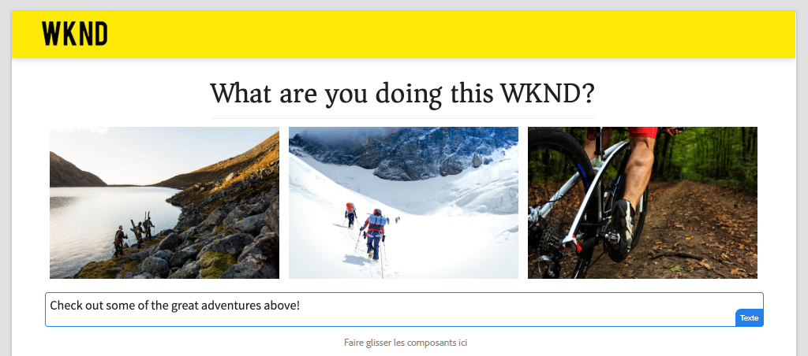

## Prérequis

Examinez les outils et les instructions nécessaires pour configurer un [environnement de développement local](overview.md#local-dev-environment).

### Obtenir le code

1. Téléchargez le point de départ de ce tutoriel via Git :

   ```shell
   $ git clone git@github.com:adobe/aem-guides-wknd-spa.git
   $ cd aem-guides-wknd-spa
   $ git checkout Angular/map-components-start
   ```

2. Déployez la base de code sur une instance AEM locale à l’aide de Maven :

   ```shell
   $ mvn clean install -PautoInstallSinglePackage
   ```

   Si vous utilisez [AEM 6.x](overview.md#compatibility), ajoutez le profil `classic` :

   ```shell
   $ mvn clean install -PautoInstallSinglePackage -Pclassic
   ```

Vous pouvez toujours afficher le code terminé sur [GitHub](https://github.com/adobe/aem-guides-wknd-spa/tree/Angular/map-components-solution) ou vérifier le code localement en passant à la branche `Angular/map-components-solution`.

## Approche de mappage

Le concept de base consiste à mapper un composant SPA à un composant AEM. Les composants AEM, exécutés côté serveur, exportent du contenu dans le cadre de l’API de modèle JSON. Le contenu JSON est utilisé par la SPA, et s’exécute côté client dans le navigateur. Un mappage 1:1 entre les composants SPA et un composant AEM est créé.

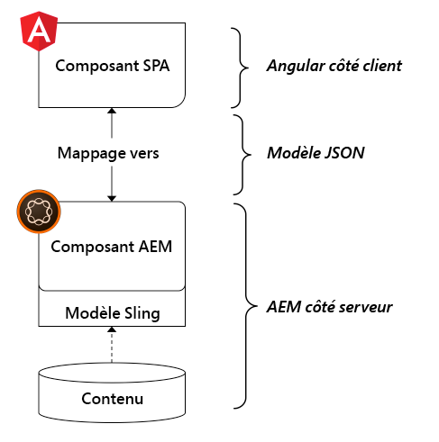

*Présentation générale du mappage d’un composant AEM à un composant Angular.*

## Examinez le composant Texte

L’[Archétype de projet AEM](https://github.com/adobe/aem-project-archetype) fournit un composant `Text` qui est mappé au [composant de texte](https://experienceleague.adobe.com/docs/experience-manager-core-components/using/components/text.html?lang=fr) d’AEM. Il s’agit d’un exemple de **contenu** du composant, dans la mesure où il restitue le *contenu* d’AEM.

Voyons comment fonctionne le composant.

### Examen du modèle JSON

1. Avant de passer au code SPA, il est important de comprendre le modèle JSON fourni par AEM. Accédez à la [bibliothèque de composants principaux](https://www.aemcomponents.dev/content/core-components-examples/library/core-content/text.html) et affichez la page du composant de texte. La bibliothèque des composants principaux fournit des exemples de tous les composants principaux AEM.
2. Sélectionnez l’onglet **JSON** pour l’un des exemples :

   

   Vous devriez voir trois propriétés : `text`, `richText` et `:type`.

   `:type` est une propriété réservée qui répertorie le `sling:resourceType` (ou chemin d’accès) du composant AEM. La valeur de `:type` est utilisée pour mapper le composant AEM au composant SPA.

   `text` et `richText` sont des propriétés supplémentaires qui sont exposées au composant SPA.

### Examiner le composant de texte

1. Ouvrez un nouveau terminal et accédez au dossier `ui.frontend` dans le projet. Exécutez `npm install` puis `npm start` pour démarrer le **serveur de développement webpack** :

   ```shell
   $ cd ui.frontend
   $ npm run start:mock
   ```

   Le module `ui.frontend` est actuellement configuré pour utiliser le [modèle JSON simulé](./integrate-spa.md#mock-json).

2. Une nouvelle fenêtre de navigateur devrait s’ouvrir pour [http://localhost:4200/content/wknd-spa-angular/us/en/home.html](http://localhost:4200/content/wknd-spa-angular/us/en/home.html).

   

3. Dans l’IDE de votre choix, ouvrez le projet AEM de la SPA WKND. Développez le module `ui.frontend` et ouvrez le fichier **text.component.ts** sous `ui.frontend/src/app/components/text/text.component.ts` :

   

4. La première zone que nous allons inspecter est le `class TextComponent` à la ligne 35 :

   ```js
   export class TextComponent {
       @Input() richText: boolean;
       @Input() text: string;
       @Input() itemName: string;
   
       @HostBinding('innerHtml') get content() {
           return this.richText
           ? this.sanitizer.bypassSecurityTrustHtml(this.text)
           : this.text;
       }
       @HostBinding('attr.data-rte-editelement') editAttribute = true;
   
       constructor(private sanitizer: DomSanitizer) {}
   }
   ```

   Le décorateur [@Input()](https://angular.io/api/core/Input) est utilisé pour déclarer les champs dont les valeurs sont définies via l’objet JSON mappé examiné précédemment.

   `@HostBinding('innerHtml') get content()` est une méthode qui expose le contenu de texte créé à partir de la valeur de `this.text`. Si le contenu est en texte enrichi (signalé par l’indicateur `this.richText`), la sécurité intégrée d’Angular est ignorée. [DomSanitizer](https://angular.io/api/platform-browser/DomSanitizer) d’Angular est utilisé pour « nettoyer » le HTML brut et empêcher les vulnérabilités de script entre les sites. La méthode est liée à la propriété `innerHtml` utilisant le décorateur [@HostBinding](https://angular.io/api/core/HostBinding).

5. Ensuite, examinez l’élément `TextEditConfig` à la ligne 24 :

   ```js
   const TextEditConfig = {
       emptyLabel: 'Text',
       isEmpty: cqModel =>
           !cqModel || !cqModel.text || cqModel.text.trim().length < 1
   };
   ```

   Le code ci-dessus est chargé de déterminer quand effectuer le rendu de l’espace réservé dans l’environnement de création AEM. Si la méthode `isEmpty` renvoie **true**, l’espace réservé est alors rendu.

6. Enfin, jetez un coup d’œil à l’appel `MapTo` à la ligne 53 :

   ```js
   MapTo('wknd-spa-angular/components/text')(TextComponent, TextEditConfig );
   ```

   **MapTo** est fourni par le SDK JS de l’éditeur de SPA d’AEM (`@adobe/cq-angular-editable-components`). Le chemin d’accès `wknd-spa-angular/components/text` représente le `sling:resourceType` du composant AEM. Ce chemin d’accès est mis en correspondance avec le `:type` exposé par le modèle JSON observé précédemment. **MapTo** analyse la réponse du modèle JSON et transmet les valeurs correctes aux variables `@Input()` du composant SPA.

   Vous pouvez trouver la définition du composant `Text` d’AEM à `ui.apps/src/main/content/jcr_root/apps/wknd-spa-angular/components/text`.

7. Essayez de modifier le fichier **en.model.json** à l’emplacement `ui.frontend/src/mocks/json/en.model.json`.

   À la ligne 62, mettez à jour la première valeur `Text` pour utiliser des balises **`H1`** et **`u`** :

   ```json
       "text": {
           "text": "<h1><u>Hello World!</u></h1>",
           "richText": true,
           ":type": "wknd-spa-angular/components/text"
       }
   ```

   Revenez au navigateur pour afficher les effets servis par le **serveur de développement webpack** :

   

   Essayez de faire basculer la propriété `richText` de **true** à **false** pour voir la logique de rendu en action.

8. Examinez **text.component.html** sur `ui.frontend/src/app/components/text/text.component.html`.

   Ce fichier est vide, car l’intégralité du contenu du composant est définie par la propriété `innerHTML`.

9. Examinez **app.module.ts** sur `ui.frontend/src/app/app.module.ts`.

   ```js
   @NgModule({
   imports: [
       BrowserModule,
       SpaAngularEditableComponentsModule,
       AppRoutingModule
   ],
   providers: [ModelManagerService, { provide: APP_BASE_HREF, useValue: '/' }],
   declarations: [AppComponent, TextComponent, PageComponent, HeaderComponent],
   entryComponents: [TextComponent, PageComponent],
   bootstrap: [AppComponent]
   })
   export class AppModule {}
   ```

   Le **TextComponent** n’est pas explicitement inclus, mais il l’est en fait de manière dynamique via **AEMResponsiveGridComponent** fourni par le SDK JS de l’éditeur de SPA d’AEM. Par conséquent, il doit être répertorié dans le tableau [entryComponents](https://angular.io/guide/entry-components) d’**app.module.ts**.

## Créer le composant d’image

Créez ensuite un composant Angular `Image` mappé au [composant d’image](https://experienceleague.adobe.com/docs/experience-manager-core-components/using/components/image.html?lang=fr) AEM. Le composant `Image` est un autre exemple de composant de **contenu**.

### Examiner le JSON

Avant de vous lancer dans le code SPA, examinez le modèle JSON fourni par AEM.

1. Accédez aux [exemples d’images dans la bibliothèque de composants principaux](https://www.aemcomponents.dev/content/core-components-examples/library/core-content/image.html).

   

   Les propriétés de `src`, `alt` et `title` sont utilisées pour remplir le composant SPA d’`Image`.

   >[!NOTE]
   >
   > D’autres propriétés d’image sont exposées (`lazyEnabled`, `widths`) et permettent à un développeur ou à une développeuse de créer un composant de chargement adaptatif et différé. Le composant créé dans ce tutoriel est simple et n’utilise **pas** ces propriétés avancées.

2. Revenez à votre IDE et ouvrez `en.model.json` sous `ui.frontend/src/mocks/json/en.model.json`. Puisqu’il s’agit d’un nouveau composant de notre projet, nous devons simuler l’image JSON.

   À la ligne 70, ajoutez une entrée JSON pour le modèle `image` (n’oubliez pas la virgule de fin `,` après le second `text_386303036`) et mettez à jour le tableau `:itemsOrder`.

   ```json
   ...
   ":items": {
               ...
               "text_386303036": {
                   "text": "<p>A new text component.</p>\r\n",
                   "richText": true,
                   ":type": "wknd-spa-angular/components/text"
                   },
               "image": {
                   "alt": "Rock Climber in New Zealand",
                   "title": "Rock Climber in New Zealand",
                   "src": "/mocks/images/adobestock-140634652.jpeg",
                   ":type": "wknd-spa-angular/components/image"
               }
           },
           ":itemsOrder": [
               "text",
               "text_386303036",
               "image"
           ],
   ```

   Le projet comprend un exemple d’image sous `/mock-content/adobestock-140634652.jpeg`, qui est utilisé avec la variable **serveur de développement webpack**.

   Vous pouvez afficher l’intégralité de [en.model.json ici](https://github.com/adobe/aem-guides-wknd-spa/blob/Angular/map-components-solution/ui.frontend/src/mocks/json/en.model.json).

3. Ajoutez une photo de catalogue que le composant affichera.

   Créez un dossier nommé **images** sous `ui.frontend/src/mocks`. Téléchargez le fichier [adobestock-140634652.jpeg](assets/map-components/adobestock-140634652.jpeg) et placez-le dans le dossier **images** nouvellement créé. N’hésitez pas à utiliser votre propre image, si vous le souhaitez.

### Mettre en œuvre le composant d’image

1. Arrêtez le **serveur de développement webpack**, le cas échéant.
2. Créez un composant d’image en exécutant la commande `ng generate component` de l’interface de ligne de commande Angular à partir du dossier `ui.frontend` :

   ```shell
   $ ng generate component components/image
   ```

3. Dans l’IDE, ouvrez **image.component.ts** sous `ui.frontend/src/app/components/image/image.component.ts` et procédez à la mise à jour comme suit :

   ```js
   import {Component, Input, OnInit} from '@angular/core';
   import {MapTo} from '@adobe/cq-angular-editable-components';
   
   const ImageEditConfig = {
   emptyLabel: 'Image',
   isEmpty: cqModel =>
       !cqModel || !cqModel.src || cqModel.src.trim().length < 1
   };
   
   @Component({
   selector: 'app-image',
   templateUrl: './image.component.html',
   styleUrls: ['./image.component.scss']
   })
   export class ImageComponent implements OnInit {
   
   @Input() src: string;
   @Input() alt: string;
   @Input() title: string;
   
   constructor() { }
   
   get hasImage() {
       return this.src && this.src.trim().length > 0;
   }
   
   ngOnInit() { }
   }
   
   MapTo('wknd-spa-angular/components/image')(ImageComponent, ImageEditConfig);
   ```

   `ImageEditConfig` est la configuration permettant de déterminer si l’espace réservé de création doit être rendu dans AEM, selon que la fonction `src` est renseignée ou non.

   `@Input()` de `src`, `alt` et `title` sont les propriétés mappées à partir de l’API JSON.

   `hasImage()` est une méthode qui détermine si l’image doit être rendue.

   `MapTo` mappe le composant SPA au composant AEM situé sous `ui.apps/src/main/content/jcr_root/apps/wknd-spa-angular/components/image`.

4. Ouvrez **image.component.html** et mettez-le à jour comme suit :

   ```html
   <ng-container *ngIf="hasImage">
       
   </ng-container>
   ```

   L’élément `` est rendu si `hasImage` renvoie **true**.

5. Ouvrez **image.component.scss** et mettez-le à jour comme suit :

   ```scss
   :host-context {
       display: block;
   }
   
   .image {
       margin: 1rem 0;
       width: 100%;
       border: 0;
   }
   ```

   >[!NOTE]
   >
   > La règle `:host-context` est **critique** pour que l’espace réservé de l’éditeur de SPA d’AEM fonctionne correctement. Tous les composants SPA destinés à être créés dans l’éditeur de page d’AEM auront besoin au minimum de cette règle.

6. Ouvrez `app.module.ts` et ajoutez le `ImageComponent` au tableau `entryComponents` :

   ```js
   entryComponents: [TextComponent, PageComponent, ImageComponent],
   ```

   Comme le `TextComponent`, le `ImageComponent` est chargé dynamiquement et doit être inclus dans le tableau `entryComponents`.

7. Démarrez le **serveur de développement webpack** pour afficher le rendu `ImageComponent`.

   ```shell
   $ npm run start:mock
   ```

   

   *Image ajoutée à la SPA.*

   >[!NOTE]
   >
   > **Défi bonus** : implémentez une nouvelle méthode pour afficher la valeur de `title` comme légende sous l’image.

## Mettre à jour les stratégies dans AEM

Le composant `ImageComponent` n’est visible que dans le **serveur de développement webpack**. Ensuite, déployez la SPA mise à jour vers AEM et mettez à jour les stratégies de modèle.

1. Arrêtez le **serveur de développement webpack** et, à partir de la **racine** du projet, déployez les modifications sur AEM à l’aide de vos compétences Maven :

   ```shell
   $ cd aem-guides-wknd-spa
   $ mvn clean install -PautoInstallSinglePackage
   ```

2. Dans l’écran de démarrage d’AEM, accédez à **[!UICONTROL Outils]** > **[!UICONTROL Modèles]** > **[Angular SPA WKND](http://localhost:4502/libs/wcm/core/content/sites/templates.html/conf/wknd-spa-angular)**.

   Sélectionnez et modifiez la **page SPA** :

   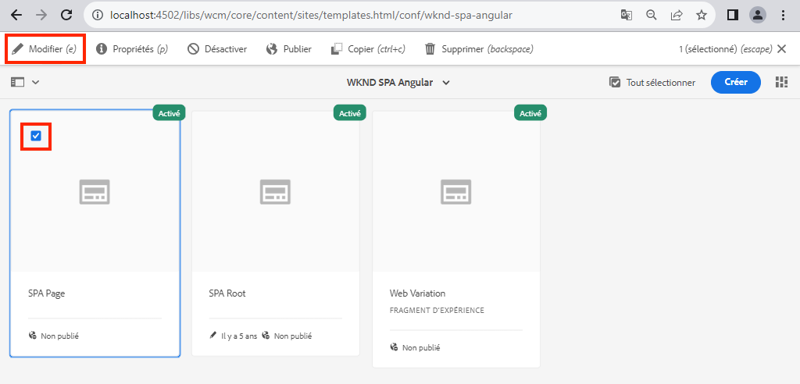

3. Sélectionnez le **conteneur de disposition** et cliquez sur son icône **stratégie** pour modifier la stratégie :

   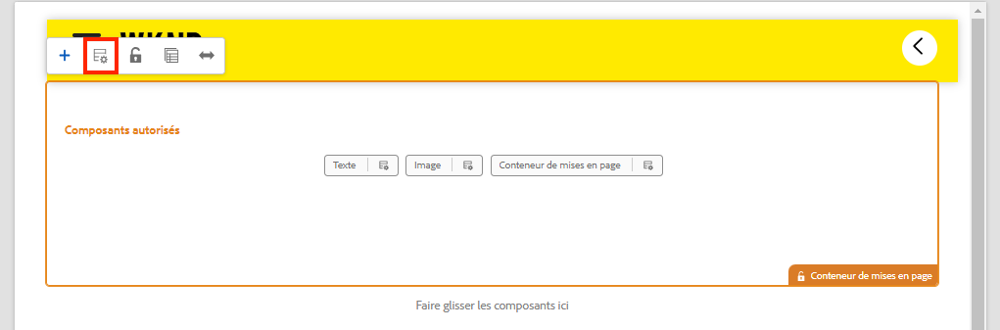

4. Sous **Composants autorisés** > **Angular SPA WKND - Contenu**, cochez le composant **Image** :

   

   Sous **Composants par défaut** > **Ajouter un mappage**, sélectionnez le composant **Image - Angular SPA WKND - Contenu** :

   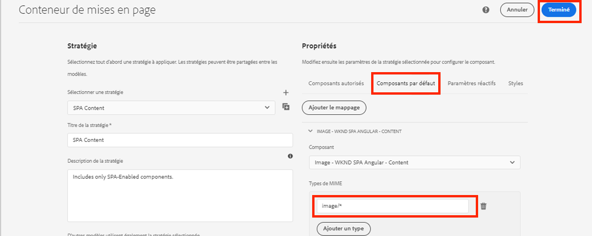

   Saisissez un **type MIME** d’`image/*`.

   Cliquez sur **Terminé** pour enregistrer les mises à jour des stratégies.

5. Dans le **Conteneur de disposition**, cliquez sur l’icône **stratégie** du composant de **texte** :

   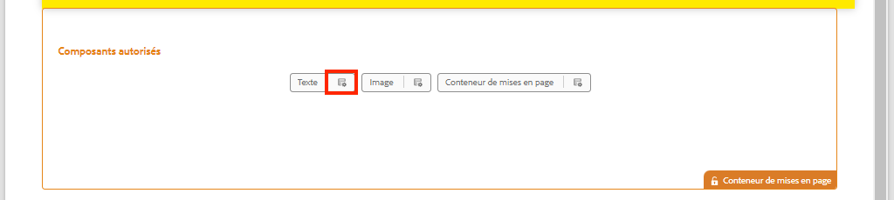

   Créez une stratégie nommée **Texte SPA WKND**. Sous **Plugins** > **Formatage**, cochez toutes les cases pour activer des options de formatage supplémentaires :

   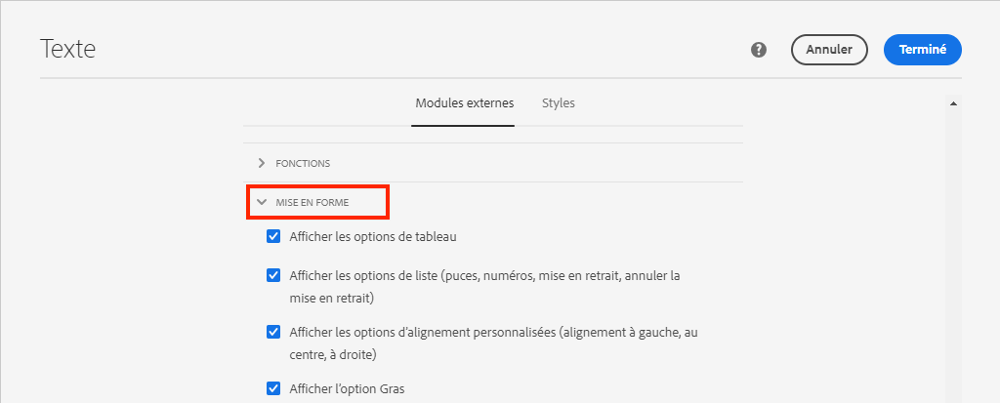

   Sous **Plugins** > **Styles de paragraphe**, cochez la case pour **activer les styles de paragraphe** :

   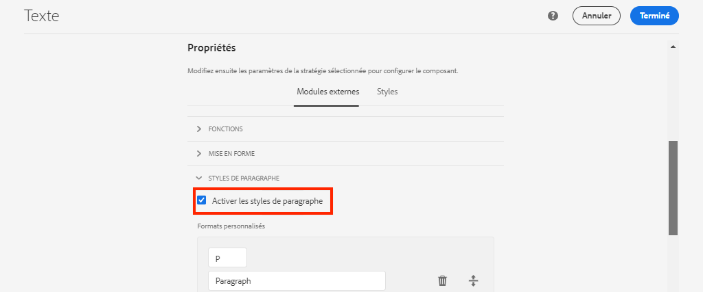

   Cliquez sur **Terminé** pour enregistrer la mise à jour de la stratégie.

6. Accédez à la **Page d’accueil** [http://localhost:4502/editor.html/content/wknd-spa-angular/us/en/home.html](http://localhost:4502/editor.html/content/wknd-spa-angular/us/en/home.html).

   Vous devez également pouvoir modifier le composant `Text` et ajouter des styles de paragraphe supplémentaires en mode **plein écran**.

   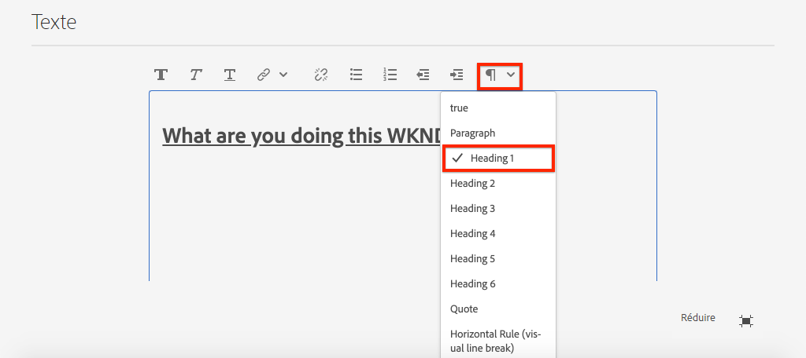

7. Vous pouvez aussi glisser et déposer une image à partir de l’**Outil de recherche de ressources** :

   

8. Ajoutez vos propres images via [AEM Assets](http://localhost:4502/assets.html/content/dam) ou installer la base de code terminée pour le [site de référence WKND](https://github.com/adobe/aem-guides-wknd/releases/latest) standard. Le [site de référence WKND](https://github.com/adobe/aem-guides-wknd/releases/latest) inclut de nombreuses images qui peuvent être réutilisées sur la SPA WKND. Le package peut être installé à l’aide du [gestionnaire de packages d’AEM](http://localhost:4502/crx/packmgr/index.jsp).

   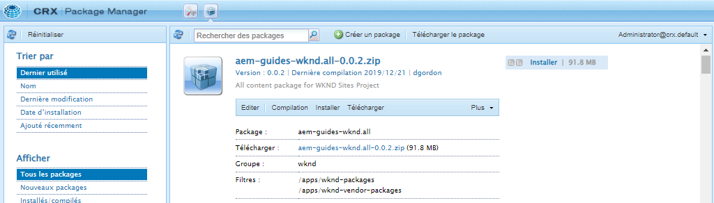

## Inspecter le conteneur de disposition

La prise en charge du **Conteneur de disposition** est automatiquement fournie par le SDK de l’éditeur de SPA d’AEM. Le **conteneur de disposition**, comme son nom l’indique, est un composant de **conteneur**. Les composants de conteneur sont des composants qui acceptent les structures JSON qui représentent *d’autres* composants et qui les instancient de manière dynamique.

Examinons davantage le conteneur de dispositions.

1. Dans l’IDE, ouvrez **responsive-grid.component.ts** dans `ui.frontend/src/app/components/responsive-grid` :

   ```js
   import { AEMResponsiveGridComponent,MapTo } from '@adobe/cq-angular-editable-components';
   
   MapTo('wcm/foundation/components/responsivegrid')(AEMResponsiveGridComponent);
   ```

   Le `AEMResponsiveGridComponent` est implémenté dans le cadre du SDK de l’éditeur de SPA d’AEM et est inclus dans le projet via `import-components`.

2. Dans un navigateur, accédez à [http://localhost:4502/content/wknd-spa-angular/us/en.model.json](http://localhost:4502/content/wknd-spa-angular/us/en.model.json).

   

   Le composant de **conteneur de disposition** comporte un `sling:resourceType` de `wcm/foundation/components/responsivegrid` et est reconnu par l’éditeur de SPA avec la propriété `:type`, comme les composants `Text` et `Image`.

   Les mêmes capacités de redimensionnement d’un composant à l’aide du [Mode de disposition](https://experienceleague.adobe.com/docs/experience-manager-65/authoring/siteandpage/responsive-layout.html#defining-layouts-layout-mode) sont disponibles avec l’éditeur de SPA.

3. Retournez sur [http://localhost:4502/editor.html/content/wknd-spa-angular/us/en/home.html](http://localhost:4502/editor.html/content/wknd-spa-angular/us/en/home.html). Ajoutez d’autres composant d’**Image** et essayez de les redimensionner via l’option **Disposition** :

   

4. Rouvrez le modèle JSON [http://localhost:4502/content/wknd-spa-angular/us/en.model.json](http://localhost:4502/content/wknd-spa-angular/us/en.model.json) et observez les `columnClassNames` dans le fichier JSON :

   

   Le nom de la classe `aem-GridColumn--default--4` indique que le composant doit comporter 4 colonnes en largeur sur une grille de 12 colonnes. Vous trouverez davantage d’informations sur la [grille réactive ici](https://adobe-marketing-cloud.github.io/aem-responsivegrid/).

5. Revenez à l’IDE et dans le module `ui.apps`, il existe une bibliothèque côté client définie à l’adresse `ui.apps/src/main/content/jcr_root/apps/wknd-spa-angular/clientlibs/clientlib-grid`. Ouvrez le fichier `less/grid.less`.

   Ce fichier détermine les points d’arrêt (`default`, `tablet`, et `phone`) utilisés par le **conteneur de disposition**. Ce fichier est conçu pour être personnalisé selon les spécifications du projet. Actuellement, les points d’arrêt sont définis sur `1200px` et `650px`.

6. Vous devez pouvoir utiliser les capacités réactives et les stratégies de texte enrichi mises à jour du composant `Text` pour créer une vue de ce type :

   

## Félicitations. {#congratulations}

Félicitations, vous avez appris à mapper les composants SPA à ceux d’AEM et vous avez implémenté un nouveau composant `Image`. Vous avez aussi eu la chance de découvrir les fonctionnalités du **conteneur de disposition**.

Vous pouvez toujours afficher le code terminé sur [GitHub](https://github.com/adobe/aem-guides-wknd-spa/tree/Angular/map-components-solution) ou vérifier le code localement en passant à la branche `Angular/map-components-solution`.

### Étapes suivantes {#next-steps}

[Navigation et routage](navigation-routing.md) - Découvrez comment plusieurs vues dans la SPA peuvent être prises en charge en mappant sur les pages d’AEM avec le SDK de l’éditeur de SPA. La navigation dynamique est implémentée à l’aide du routeur Angular et ajoutée à un composant d’en-tête existant.

## Bonus - Conserver les configurations pour le contrôle de code source {#bonus}

Dans de nombreux cas, en particulier au début d’un projet AEM, il est utile de conserver les configurations, comme les modèles et les politiques de contenu associées, pour le contrôle de code source. Cela garantit que tous les développeurs et développeuses travaillent sur le même ensemble de contenu et de configurations et peut garantir une cohérence supplémentaire entre les environnements. Une fois qu’un projet atteint un certain niveau de maturité, la gestion des modèles peut être transmise à un groupe spécial d’utilisateurs et utilisatrices expérimentés.

Les étapes suivantes se dérouleront à l’aide de l’IDE Visual Studio Code et [VSCode AEM Sync](https://marketplace.visualstudio.com/items?itemName=yamato-ltd.vscode-aem-sync) mais il est possible d’utiliser n’importe quel outil et IDE que vous avez configuré pour **extraire** ou **importer** du contenu d’une instance locale d’AEM.

1. Dans l’IDE Visual Studio Code, assurez-vous que **VSCode AEM Sync** est installé via l’extension Marketplace :

   

2. Développez le module **ui.content** dans l’explorateur de projets et accédez à `/conf/wknd-spa-angular/settings/wcm/templates`.

3. Faites un **Clic droit** sur le dossier `templates` et sélectionnez **Importer depuis le serveur AEM** :

   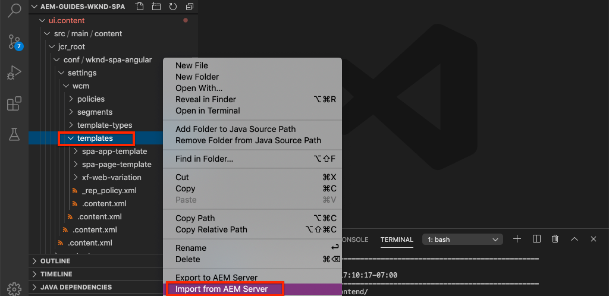

4. Répétez les étapes pour importer du contenu, mais sélectionnez le dossier **stratégies** situé à l’emplacement `/conf/wknd-spa-angular/settings/wcm/policies`.

5. Examinez le `filter.xml`fichier situé à l’emplacement `ui.content/src/main/content/META-INF/vault/filter.xml`.

   ```xml
   <!--ui.content filter.xml-->
   <?xml version="1.0" encoding="UTF-8"?>
    <workspaceFilter version="1.0">
        <filter root="/conf/wknd-spa-angular" mode="merge"/>
        <filter root="/content/wknd-spa-angular" mode="merge"/>
        <filter root="/content/dam/wknd-spa-angular" mode="merge"/>
        <filter root="/content/experience-fragments/wknd-spa-angular" mode="merge"/>
    </workspaceFilter>
   ```

   Le fichier `filter.xml` doit identifier les chemins d’accès des nœuds installés avec le package. Remarquez l’élément `mode="merge"` sur chacun des filtres qui indique que le contenu existant ne sera pas modifié et que seul du nouveau contenu est ajouté. Étant donné que les personnes créatrices de contenu peuvent mettre à jour ces chemins, il est important qu’un déploiement de code **ne remplace pas** le contenu. Voir la [Documentation FileVault](https://jackrabbit.apache.org/filevault/filter.html) pour plus d’informations sur l’utilisation des éléments de filtre.

   Comparez `ui.content/src/main/content/META-INF/vault/filter.xml` et `ui.apps/src/main/content/META-INF/vault/filter.xml` pour comprendre les différents nœuds gérés par chaque module.
