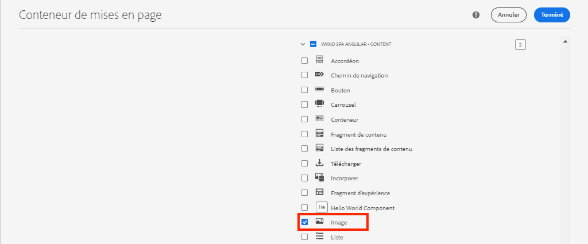

# Mappage des composants SPA aux composants AEM {#map-components}

Découvrez comment mapper les composants Angular aux composants Adobe Experience Manager (AEM) avec le SDK JS d’AEM Editor. Le mappage de composants permet aux utilisateurs d’effectuer des mises à jour dynamiques sur SPA composants dans AEM Éditeur de ressources, comme pour la création d’ traditionnelle.

Ce chapitre approfondit l’API de modèle JSON AEM et la manière dont le contenu JSON exposé par un composant AEM peut être automatiquement injecté dans un composant d’Angular en tant que props.

## Objectif

1. Découvrez comment mapper AEM composants à SPA composants.
2. Comprendre la différence entre **Conteneur** composants et **Contenu** composants.
3. Créez un composant Angular qui mappe à un composant AEM existant.

## Ce que vous allez créer

Ce chapitre examine la manière dont le `Text` Le composant SPA est mappé sur l’AEM `Text`composant. Une nouvelle `Image` SPA composant est créé et peut être utilisé dans le SPA et créé dans l’. Fonctionnalités prêtes à l’emploi du **Conteneur de mises en page** et **Éditeur de modèles** les stratégies seront également utilisées pour créer une vue un peu plus variée en apparence.


## Prérequis

Examinez les outils et les instructions requis pour configurer une [environnement de développement local](overview.md#local-dev-environment).

### Obtention du code

1. Téléchargez le point de départ de ce tutoriel via Git :

   ```shell
   $ git clone git@github.com:adobe/aem-guides-wknd-spa.git
   $ cd aem-guides-wknd-spa
   $ git checkout Angular/map-components-start
   ```

2. Déployez la base de code sur une instance d’AEM locale à l’aide de Maven :

   ```shell
   $ mvn clean install -PautoInstallSinglePackage
   ```

   Si vous utilisez [AEM 6.x](overview.md#compatibility) ajoutez le `classic` profile:

   ```shell
   $ mvn clean install -PautoInstallSinglePackage -Pclassic
   ```

Vous pouvez toujours afficher le code terminé sur [GitHub](https://github.com/adobe/aem-guides-wknd-spa/tree/Angular/map-components-solution) ou extraire le code localement en passant à la branche `Angular/map-components-solution`.

## Approche de mappage

Le concept de base consiste à mapper un composant SPA à un composant AEM. AEM des composants, exécuter côté serveur, exporter du contenu dans le cadre de l’API de modèle JSON. Le contenu JSON est consommé par le SPA, en exécutant côté client dans le navigateur. Un mappage 1:1 entre les composants SPA et un composant AEM est créé.


*Présentation générale du mappage d’un composant AEM à un composant Angular*

## Inspect du composant Texte

Le [AEM Archétype de projet](https://github.com/adobe/aem-project-archetype) fournit une `Text` qui est mappé à l’AEM [Composant textuel](https://experienceleague.adobe.com/docs/experience-manager-core-components/using/components/text.html?lang=fr). Il s’agit d’un exemple de **content** du composant, en ce qu’il effectue le rendu. *content* d’AEM.

Voyons comment fonctionne le composant.

### Inspect du modèle JSON

1. Avant de passer au code SPA, il est important de comprendre le modèle JSON fourni par AEM. Accédez au [Bibliothèque de composants principaux](https://www.aemcomponents.dev/content/core-components-examples/library/core-content/text.html) et afficher la page du composant Texte. La bibliothèque des composants principaux fournit des exemples de tous les composants principaux AEM.
2. Sélectionnez la **JSON** pour l’un des exemples :

   

   Vous devriez voir trois propriétés : `text`, `richText`, et `:type`.

   `:type` est une propriété réservée qui répertorie la variable `sling:resourceType` (ou chemin) du composant AEM. La valeur de `:type` est utilisé pour mapper le composant AEM au composant SPA.

   `text` et `richText` sont des propriétés supplémentaires qui sont exposées au composant SPA.

### Inspect du composant Texte

1. Ouvrez un nouveau terminal et accédez au `ui.frontend` dans le projet. Exécuter `npm install` puis `npm start` pour démarrer le **serveur de développement webpack**:

   ```shell
   $ cd ui.frontend
   $ npm run start:mock
   ```

   Le `ui.frontend` est actuellement configuré pour utiliser la variable [moquer le modèle JSON](./integrate-spa.md#mock-json).

2. Une nouvelle fenêtre de navigateur devrait s’ouvrir pour [http://localhost:4200/content/wknd-spa-angular/us/en/home.html](http://localhost:4200/content/wknd-spa-angular/us/en/home.html)

   

3. Dans l’IDE de votre choix, ouvrez le projet AEM pour le SPA WKND. Développez l’objet `ui.frontend` et ouvrez le fichier **text.component.ts** under `ui.frontend/src/app/components/text/text.component.ts`:

   

4. La première zone à inspecter est la suivante : `class TextComponent` à la ligne 35 :

   ```js
   export class TextComponent {
       @Input() richText: boolean;
       @Input() text: string;
       @Input() itemName: string;
   
       @HostBinding('innerHtml') get content() {
           return this.richText
           ? this.sanitizer.bypassSecurityTrustHtml(this.text)
           : this.text;
       }
       @HostBinding('attr.data-rte-editelement') editAttribute = true;
   
       constructor(private sanitizer: DomSanitizer) {}
   }
   ```

   [@Input()](https://angular.io/api/core/Input) Le décorateur est utilisé pour déclarer les champs dont les valeurs sont définies via l’objet JSON mappé, examiné précédemment.

   `@HostBinding('innerHtml') get content()` est une méthode qui expose le contenu de texte créé à partir de la valeur de `this.text`. Si le contenu est en texte enrichi (déterminé par la variable `this.richText` indicateur) La sécurité intégrée de l’Angular est ignorée. Angular [DomSanitizer](https://angular.io/api/platform-browser/DomSanitizer) est utilisé pour &quot;balayer&quot; le HTML brut et empêcher les vulnérabilités de script intersite. La méthode est liée à la propriété `innerHtml` à l’aide de la propriété [@HostBinding](https://angular.io/api/core/HostBinding) décorateur.

5. Examinez ensuite le `TextEditConfig` ~line 24 :

   ```js
   const TextEditConfig = {
       emptyLabel: 'Text',
       isEmpty: cqModel =>
           !cqModel || !cqModel.text || cqModel.text.trim().length < 1
   };
   ```

   Le code ci-dessus est chargé de déterminer quand effectuer le rendu de l’espace réservé dans l’environnement de création AEM. Si la variable `isEmpty` method renvoie **true** l’espace réservé est alors rendu.

6. Enfin, jetez un coup d’oeil au `MapTo` appelez à la ligne 53 ~line :

   ```js
   MapTo('wknd-spa-angular/components/text')(TextComponent, TextEditConfig );
   ```

   **MapTo** est fourni par le SDK JS de l’éditeur d’AEM SPA (`@adobe/cq-angular-editable-components`). Chemin d’accès `wknd-spa-angular/components/text` représente la variable `sling:resourceType` du composant AEM. Ce chemin d’accès est mis en correspondance avec la variable `:type` exposé par le modèle JSON observé précédemment. **MapTo** analyse la réponse du modèle JSON et transmet les valeurs correctes à la variable `@Input()` des variables du composant SPA.

   Vous trouverez l’AEM `Text` définition de composant à l’emplacement `ui.apps/src/main/content/jcr_root/apps/wknd-spa-angular/components/text`.

7. Expérience en modifiant le **en.model.json** fichier à l’emplacement `ui.frontend/src/mocks/json/en.model.json`.

   À la ligne 62, mettez à jour la première `Text` pour utiliser une **`H1`** et **`u`** balises :

   ```json
       "text": {
           "text": "<h1><u>Hello World!</u></h1>",
           "richText": true,
           ":type": "wknd-spa-angular/components/text"
       }
   ```

   Revenez au navigateur pour afficher les effets servis par la variable **serveur de développement webpack**:

   

   Essayez de faire basculer le `richText` propriété entre **true** / **false** pour voir la logique de rendu en action.

8. Inspect **text.component.html** at `ui.frontend/src/app/components/text/text.component.html`.

   Ce fichier est vide, car l’intégralité du contenu du composant est définie par la variable `innerHTML` .

9. Inspect **app.module.ts** at `ui.frontend/src/app/app.module.ts`.

   ```js
   @NgModule({
   imports: [
       BrowserModule,
       SpaAngularEditableComponentsModule,
       AppRoutingModule
   ],
   providers: [ModelManagerService, { provide: APP_BASE_HREF, useValue: '/' }],
   declarations: [AppComponent, TextComponent, PageComponent, HeaderComponent],
   entryComponents: [TextComponent, PageComponent],
   bootstrap: [AppComponent]
   })
   export class AppModule {}
   ```

   Le **TextComponent** n’est pas explicitement inclus, mais de manière dynamique via **AEMResponsiveGridComponent** fourni par le SDK JS de l’éditeur d’AEM. Par conséquent, doit être répertorié dans la variable **app.module.ts**&#39; [entryComponents](https://angular.io/guide/entry-components) tableau.

## Création du composant d’image

Créez ensuite une `Image` Composant d’Angular mappé à l’AEM [Composant d’image](https://experienceleague.adobe.com/docs/experience-manager-core-components/using/components/image.html?lang=fr). Le `Image` est un autre exemple d’un composant **content** composant.

### Inspect du JSON

Avant de passer au code SPA, examinez le modèle JSON fourni par AEM.

1. Accédez au [Exemples d’images dans la bibliothèque de composants principaux](https://www.aemcomponents.dev/content/core-components-examples/library/core-content/image.html).

   

   Propriétés de `src`, `alt`, et `title` sont utilisés pour remplir les SPA `Image` composant.

   >[!NOTE]
   >
   > D’autres propriétés d’image sont exposées (`lazyEnabled`, `widths`) qui permettent à un développeur de créer un composant de chargement adaptatif et différé. Le composant créé dans ce tutoriel est simple et fonctionne comme suit : **not** utilisez ces propriétés avancées.

2. Revenez à votre IDE et ouvrez le `en.model.json` at `ui.frontend/src/mocks/json/en.model.json`. Puisqu’il s’agit d’un nouveau composant pour notre projet, nous devons nous moquer de l’image JSON.

   À la ligne 70 ~, ajoutez une entrée JSON pour le `image` (n’oubliez pas la virgule de fin. `,` après la seconde `text_386303036`) et de mettre à jour la variable `:itemsOrder` tableau.

   ```json
   ...
   ":items": {
               ...
               "text_386303036": {
                   "text": "<p>A new text component.</p>\r\n",
                   "richText": true,
                   ":type": "wknd-spa-angular/components/text"
                   },
               "image": {
                   "alt": "Rock Climber in New Zealand",
                   "title": "Rock Climber in New Zealand",
                   "src": "/mocks/images/adobestock-140634652.jpeg",
                   ":type": "wknd-spa-angular/components/image"
               }
           },
           ":itemsOrder": [
               "text",
               "text_386303036",
               "image"
           ],
   ```

   Le projet comprend un exemple d’image à l’adresse `/mock-content/adobestock-140634652.jpeg` qui est utilisé avec la variable **serveur de développement webpack**.

   Vous pouvez afficher l’intégralité de la [en.model.json ici](https://github.com/adobe/aem-guides-wknd-spa/blob/Angular/map-components-solution/ui.frontend/src/mocks/json/en.model.json).

3. Ajoutez une photo de stock à afficher par le composant.

   Créez un dossier nommé **images** sous `ui.frontend/src/mocks`. Télécharger [adobbeef-140634652.jpeg](assets/map-components/adobestock-140634652.jpeg) et placez-le dans le **images** dossier. N’hésitez pas à utiliser votre propre image, si vous le souhaitez.

### Mise en oeuvre du composant Image

1. Arrêtez le **serveur de développement webpack** si a commencé.
2. Créez un composant Image en exécutant l’interface de ligne de commande de l’Angular. `ng generate component` à partir de `ui.frontend` folder:

   ```shell
   $ ng generate component components/image
   ```

3. Dans l’IDE, ouvrez **image.component.ts** at `ui.frontend/src/app/components/image/image.component.ts` et mettez à jour comme suit :

   ```js
   import {Component, Input, OnInit} from '@angular/core';
   import {MapTo} from '@adobe/cq-angular-editable-components';
   
   const ImageEditConfig = {
   emptyLabel: 'Image',
   isEmpty: cqModel =>
       !cqModel || !cqModel.src || cqModel.src.trim().length < 1
   };
   
   @Component({
   selector: 'app-image',
   templateUrl: './image.component.html',
   styleUrls: ['./image.component.scss']
   })
   export class ImageComponent implements OnInit {
   
   @Input() src: string;
   @Input() alt: string;
   @Input() title: string;
   
   constructor() { }
   
   get hasImage() {
       return this.src && this.src.trim().length > 0;
   }
   
   ngOnInit() { }
   }
   
   MapTo('wknd-spa-angular/components/image')(ImageComponent, ImageEditConfig);
   ```

   `ImageEditConfig` est la configuration permettant de déterminer si l’espace réservé de création doit être rendu dans AEM, selon si la variable `src` est renseignée.

   `@Input()` de `src`, `alt`, et `title` sont les propriétés mappées à partir de l’API JSON.

   `hasImage()` est une méthode qui détermine si l’image doit être rendue.

   `MapTo` mappe le composant SPA au composant AEM situé à l’adresse `ui.apps/src/main/content/jcr_root/apps/wknd-spa-angular/components/image`.

4. Ouvrir **image.component.html** et mettez-le à jour comme suit :

   ```html
   <ng-container *ngIf="hasImage">
       
   </ng-container>
   ```

   Le rendu de la variable `` element if `hasImage` renvoie **true**.

5. Ouvrir **image.component.scss** et mettez-le à jour comme suit :

   ```scss
   :host-context {
       display: block;
   }
   
   .image {
       margin: 1rem 0;
       width: 100%;
       border: 0;
   }
   ```

   >[!NOTE]
   >
   > Le `:host-context` la règle est **critique** pour que l’espace réservé de l’éditeur SPA d’AEM fonctionne correctement. Tous les composants SPA destinés à être créés dans l’éditeur de page AEM auront besoin au minimum de cette règle.

6. Ouvrir `app.module.ts` et ajoutez le `ImageComponent` au `entryComponents` tableau :

   ```js
   entryComponents: [TextComponent, PageComponent, ImageComponent],
   ```

   Comme le `TextComponent`, la variable `ImageComponent` est chargé dynamiquement et doit être inclus dans la variable `entryComponents` tableau.

7. Démarrez le **serveur de développement webpack** pour afficher la variable `ImageComponent` rendu.

   ```shell
   $ npm run start:mock
   ```

   

   *Image ajoutée à la SPA*

   >[!NOTE]
   >
   > **Défi bonus**: Mise en oeuvre d’une nouvelle méthode pour afficher la valeur de `title` sous l’image.

## Mettre à jour les stratégies dans AEM

Le `ImageComponent` n’est visible que dans la variable **serveur de développement webpack**. Ensuite, déployez le SPA mis à jour pour AEM et mettez à jour les stratégies de modèle.

1. Arrêtez le **serveur de développement webpack** et depuis le **root** du projet, déployez les modifications sur AEM à l’aide de vos compétences Maven :

   ```shell
   $ cd aem-guides-wknd-spa
   $ mvn clean install -PautoInstallSinglePackage
   ```

2. Dans l’écran AEM Démarrer , accédez à **[!UICONTROL Outils]** > **[!UICONTROL Modèles]** > **[Angular SPA WKND](http://localhost:4502/libs/wcm/core/content/sites/templates.html/conf/wknd-spa-angular)**.

   Sélectionnez et modifiez la variable **Page SPA**:

   

3. Sélectionnez la **Conteneur de mises en page** et cliquez sur it&#39;s **policy** pour modifier la stratégie :

   

4. Sous **Composants autorisés** > **Angular SPA WKND - Contenu** > cochez la **Image** component :

   

   Sous **Composants par défaut** > **Ajouter un mappage** et sélectionnez la variable **Image : Angular SPA WKND - Contenu** component :

   

   Saisissez un **type mime** de `image/*`.

   Cliquez sur **Terminé** pour enregistrer les mises à jour de stratégie.

5. Dans le **Conteneur de mises en page** cliquez sur **policy** pour la **Texte** component :

   

   Création d’une stratégie nommée **Texte SPA WKND**. Sous **Modules externes** > **Formatage** > cochez toutes les cases pour activer des options de formatage supplémentaires :

   

   Sous **Modules externes** > **Styles de paragraphe** > cochez la case pour **Activation des styles de paragraphe**:

   

   Cliquez sur **Terminé** pour enregistrer la mise à jour de la stratégie.

6. Accédez au **Page d’accueil** [http://localhost:4502/editor.html/content/wknd-spa-angular/us/en/home.html](http://localhost:4502/editor.html/content/wknd-spa-angular/us/en/home.html).

   Vous devriez également pouvoir modifier la variable `Text` composant et ajouter des styles de paragraphe supplémentaires dans **plein écran** mode .

   

7. Vous devriez également pouvoir faire glisser et déposer une image à partir de la fonction **Outil de recherche de ressources**:

   

8. Ajoutez vos propres images via [AEM Assets](http://localhost:4502/assets.html/content/dam) ou installer la base de code terminée pour la norme [Site de référence WKND](https://github.com/adobe/aem-guides-wknd/releases/latest). Le [Site de référence WKND](https://github.com/adobe/aem-guides-wknd/releases/latest) inclut de nombreuses images qui peuvent être réutilisées sur le SPA WKND. Le module peut être installé à l’aide de [AEM Gestionnaire de modules](http://localhost:4502/crx/packmgr/index.jsp).

   

## Inspect du conteneur de mises en page

Prise en charge de **Conteneur de mises en page** est automatiquement fourni par le SDK AEM SPA Editor. Le **Conteneur de mises en page**, comme indiqué par le nom, est un **container** composant. Les composants de conteneur sont des composants qui acceptent les structures JSON qui représentent *other* et instanciez-les de manière dynamique.

Examinons davantage le conteneur de mises en page.

1. Dans l’IDE, ouvrez **responsive-grid.component.ts** at `ui.frontend/src/app/components/responsive-grid`:

   ```js
   import { AEMResponsiveGridComponent,MapTo } from '@adobe/cq-angular-editable-components';
   
   MapTo('wcm/foundation/components/responsivegrid')(AEMResponsiveGridComponent);
   ```

   Le `AEMResponsiveGridComponent` est mis en oeuvre dans le cadre du SDK de l’éditeur SPA d’AEM et est inclus dans le projet via `import-components`.

2. Dans un navigateur, accédez à [http://localhost:4502/content/wknd-spa-angular/us/en.model.json](http://localhost:4502/content/wknd-spa-angular/us/en.model.json)

   

   Le **Conteneur de mises en page** comporte un composant `sling:resourceType` de `wcm/foundation/components/responsivegrid` et est reconnu par l’éditeur de SPA à l’aide de la fonction `:type` , comme la propriété `Text` et `Image` composants.

   Les mêmes fonctionnalités que le redimensionnement d’un composant à l’aide de [Mode Mise en page](https://experienceleague.adobe.com/docs/experience-manager-65/authoring/siteandpage/responsive-layout.html#defining-layouts-layout-mode) sont disponibles avec SPA Editor.

3. Revenir à [http://localhost:4502/editor.html/content/wknd-spa-angular/us/en/home.html](http://localhost:4502/editor.html/content/wknd-spa-angular/us/en/home.html). Ajouter d’autres **Image** et essayez de les redimensionner à l’aide de la fonction **Disposition** option :

   

4. Réouverture du modèle JSON [http://localhost:4502/content/wknd-spa-angular/us/en.model.json](http://localhost:4502/content/wknd-spa-angular/us/en.model.json) et observez la `columnClassNames` dans le cadre du fichier JSON :

   

   Nom de la classe `aem-GridColumn--default--4` indique que le composant doit comporter 4 colonnes de large en fonction d’une grille de 12 colonnes. Plus d’informations sur [grille réactive se trouve ici](https://adobe-marketing-cloud.github.io/aem-responsivegrid/).

5. Revenez à l’IDE et dans le `ui.apps` Il existe une bibliothèque côté client définie à l’adresse `ui.apps/src/main/content/jcr_root/apps/wknd-spa-angular/clientlibs/clientlib-grid`. Ouvrez le fichier `less/grid.less`.

   Ce fichier détermine les points d’arrêt (`default`, `tablet`, et `phone`) utilisé par la variable **Conteneur de mises en page**. Ce fichier est conçu pour être personnalisé selon les spécifications du projet. Actuellement, les points d’arrêt sont définis sur `1200px` et `650px`.

6. Vous devriez être en mesure d’utiliser les fonctionnalités réactives et les stratégies de texte enrichi mises à jour de la variable `Text` pour créer une vue comme suit :

   

## Félicitations ! {#congratulations}

Félicitations, vous avez appris à mapper SPA composants à AEM composants et vous avez mis en oeuvre une nouvelle `Image` composant. Vous avez également la possibilité d’explorer les fonctionnalités réactives de la variable **Conteneur de mises en page**.

Vous pouvez toujours afficher le code terminé sur [GitHub](https://github.com/adobe/aem-guides-wknd-spa/tree/Angular/map-components-solution) ou extraire le code localement en passant à la branche `Angular/map-components-solution`.

### Étapes suivantes {#next-steps}

[Navigation et routage](navigation-routing.md) - Découvrez comment plusieurs vues de la SPA peuvent être prises en charge en mappant sur AEM pages avec le SDK de l’éditeur de formulaires. La navigation dynamique est mise en oeuvre à l’aide du routeur d’Angular et ajoutée à un composant d’en-tête existant.

## bonus - Persistance des configurations pour le contrôle de code source {#bonus}

Dans de nombreux cas, en particulier au début d’un projet AEM, il est utile de conserver les configurations, comme les modèles et les stratégies de contenu associées, pour le contrôle de code source. Cela garantit que tous les développeurs travaillent sur le même ensemble de contenu et de configurations et peut garantir une cohérence supplémentaire entre les environnements. Une fois qu’un projet atteint un certain niveau de maturité, la pratique de gestion des modèles peut être transmise à un groupe spécial d’utilisateurs expérimentés.

Les étapes suivantes se dérouleront à l’aide de l’IDE Visual Studio Code et [Synchronisation des AEM VSCode](https://marketplace.visualstudio.com/items?itemName=yamato-ltd.vscode-aem-sync) mais peut utiliser n’importe quel outil et n’importe quel IDE que vous avez configuré pour **pull** ou **import** contenu d’une instance locale d’AEM.

1. Dans l’IDE Visual Studio Code, assurez-vous que vous disposez de **Synchronisation des AEM VSCode** installé via l’extension Marketplace :

   

2. Développez l’objet **ui.content** dans l’explorateur de projets et accédez à `/conf/wknd-spa-angular/settings/wcm/templates`.

3. **Clic droit** la valeur `templates` et sélectionnez **Importation depuis AEM serveur**:

   

4. Répétez les étapes pour importer du contenu, mais sélectionnez l’option **policies** dossier situé à l’emplacement `/conf/wknd-spa-angular/settings/wcm/policies`.

5. Inspect `filter.xml` fichier situé à l’emplacement `ui.content/src/main/content/META-INF/vault/filter.xml`.

   ```xml
   <!--ui.content filter.xml-->
   <?xml version="1.0" encoding="UTF-8"?>
    <workspaceFilter version="1.0">
        <filter root="/conf/wknd-spa-angular" mode="merge"/>
        <filter root="/content/wknd-spa-angular" mode="merge"/>
        <filter root="/content/dam/wknd-spa-angular" mode="merge"/>
        <filter root="/content/experience-fragments/wknd-spa-angular" mode="merge"/>
    </workspaceFilter>
   ```

   Le `filter.xml` est chargé d’identifier les chemins d’accès des noeuds installés avec le package. Remarquez la variable `mode="merge"` sur chacun des filtres qui indique que le contenu existant ne sera pas modifié, seul un nouveau contenu est ajouté. Étant donné que les auteurs de contenu peuvent mettre à jour ces chemins, il est important qu’un déploiement de code **not** remplacer le contenu. Voir [Documentation de FileVault](https://jackrabbit.apache.org/filevault/filter.html) pour plus d’informations sur l’utilisation des éléments de filtre.

   Comparer `ui.content/src/main/content/META-INF/vault/filter.xml` et `ui.apps/src/main/content/META-INF/vault/filter.xml` pour comprendre les différents noeuds gérés par chaque module.
