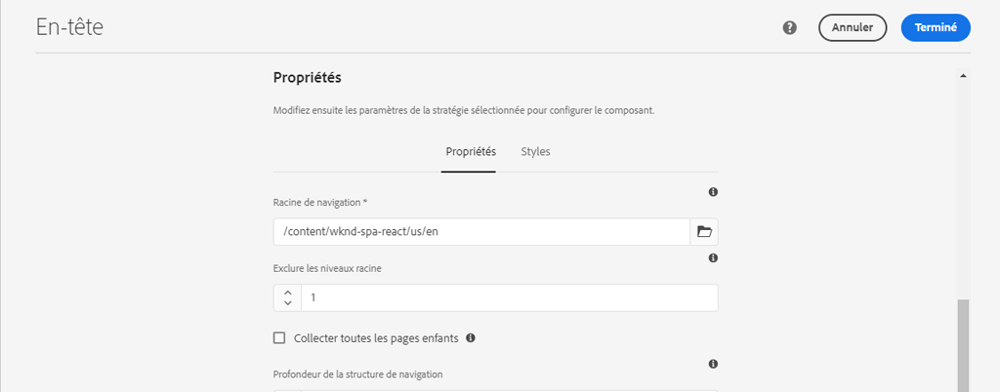
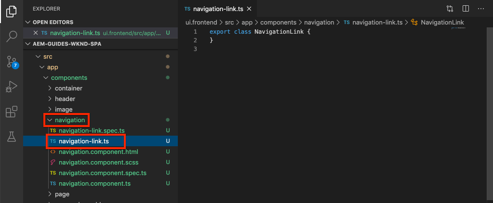

# Ajouter la navigation et le routage {#navigation-routing}

Découvrez comment plusieurs vues sont prises en charge dans la SPA à l’aide des pages AEM et du SDK de l’éditeur de SPA. La navigation dynamique est mise en œuvre à l’aide des itinéraires Angular et ajoutée à un composant En-tête existant.

## Objectif

1. Découvrez les options de routage du modèle SPA disponibles lors de l’utilisation de l’éditeur de SPA.
2. Découvrez comment utiliser le [Routage Angular](https://angular.io/guide/router) pour naviguer entre les différentes vues de la SPA.
3. Mettre en œuvre une navigation dynamique pilotée par la hiérarchie de pages AEM.

## Ce que vous allez créer

Ce chapitre ajoute un menu de navigation à un composant `Header` existant. Le menu de navigation est piloté par la hiérarchie de page AEM et utilise le modèle JSON fourni par la variable [Composant principal de navigation](https://experienceleague.adobe.com/docs/experience-manager-core-components/using/components/navigation.html?lang=fr).


## Prérequis

Examinez les outils et les instructions nécessaires pour configurer un [environnement de développement local](overview.md#local-dev-environment).

### Obtenir le code

1. Téléchargez le point de départ de ce tutoriel via Git :

   ```shell
   $ git clone git@github.com:adobe/aem-guides-wknd-spa.git
   $ cd aem-guides-wknd-spa
   $ git checkout Angular/navigation-routing-start
   ```

2. Déployez la base de code sur une instance AEM locale à l’aide de Maven :

   ```shell
   $ mvn clean install -PautoInstallSinglePackage
   ```

   Si vous utilisez [AEM 6.x](overview.md#compatibility) ajoutez le profil `classic` :

   ```shell
   $ mvn clean install -PautoInstallSinglePackage -Pclassic
   ```

3. Installez le package terminé pour le [site de référence WKND](https://github.com/adobe/aem-guides-wknd/releases/latest) traditionnel. Les images fournies par le [site de référence WKND](https://github.com/adobe/aem-guides-wknd/releases/latest) sont réutilisés sur la SPA WKND. Le module peut être installé à l’aide du [Gestionnaire de modules d’AEM](http://localhost:4502/crx/packmgr/index.jsp).

   

Vous pouvez toujours afficher le code terminé sur [GitHub](https://github.com/adobe/aem-guides-wknd-spa/tree/Angular/navigation-routing-solution) ou extraire le code localement en passant à la branche `Angular/navigation-routing-solution`.

## Contrôler les mises à jour du composant HeaderComponent {#inspect-header}

Dans les chapitres précédents, le composant `HeaderComponent` a été ajouté en tant que composant Angular pur inclus via `app.component.html`. Dans ce chapitre, le composant `HeaderComponent` est supprimé de l’application et ajouté via l’[Éditeur de modèles](https://experienceleague.adobe.com/docs/experience-manager-learn/sites/page-authoring/template-editor-feature-video-use.html?lang=fr). Cela permet aux utilisateurs et utilisatrices de configurer le menu de `HeaderComponent` depuis AEM.

>[!NOTE]
>
> Plusieurs mises à jour CSS et JavaScript ont déjà été apportées à la base de code pour commencer ce chapitre. Il s’agit de se concentrer sur les concepts de base et non sur **toutes** les modifications de code. Vous pouvez afficher les modifications complètes [ici](https://github.com/adobe/aem-guides-wknd-spa/compare/Angular/map-components-solution...Angular/navigation-routing-start).

1. Dans l’IDE de votre choix, ouvrez le projet SPA de démarrage de ce chapitre.
2. Sous le module `ui.frontend`, inspectez le fichier `header.component.ts` sous `ui.frontend/src/app/components/header/header.component.ts`.

   Plusieurs mises à jour ont été apportées, y compris l’ajout de `HeaderEditConfig` et de `MapTo` pour permettre au composant d’être mappé à un composant AEM `wknd-spa-angular/components/header`.

   ```js
   /* header.component.ts */
   ...
   const HeaderEditConfig = {
       ...
   };
   
   @Component({
   selector: 'app-header',
   templateUrl: './header.component.html',
   styleUrls: ['./header.component.scss']
   })
   export class HeaderComponent implements OnInit {
   @Input() items: object[];
       ...
   }
   ...
   MapTo('wknd-spa-angular/components/header')(withRouter(Header), HeaderEditConfig);
   ```

   Notez l’annotation `@Input()` pour `items`. `items` contient un tableau d’objets de navigation transmis à partir d’AEM.

3. Dans le module `ui.apps`, inspectez la définition du composant AEM `Header` : `ui.apps/src/main/content/jcr_root/apps/wknd-spa-angular/components/header/.content.xml` :

   ```xml
   <?xml version="1.0" encoding="UTF-8"?>
   <jcr:root xmlns:sling="http://sling.apache.org/jcr/sling/1.0" xmlns:cq="http://www.day.com/jcr/cq/1.0"
       xmlns:jcr="http://www.jcp.org/jcr/1.0"
       jcr:primaryType="cq:Component"
       jcr:title="Header"
       sling:resourceSuperType="wknd-spa-angular/components/navigation"
       componentGroup="WKND SPA Angular - Structure"/>
   ```

   Le composant AEM `Header` hérite de toutes les fonctionnalités du [Composant principal de navigation](https://experienceleague.adobe.com/docs/experience-manager-core-components/using/components/navigation.html?lang=fr) via la propriété `sling:resourceSuperType`.

## Ajouter le composant HeaderComponent au modèle SPA {#add-header-template}

1. Ouvrez un navigateur et connectez-vous à AEM, via [http://localhost:4502/](http://localhost:4502/). La base de code de départ doit déjà être déployée.
2. Accédez au **[!UICONTROL modèle de page SPA]** : [http://localhost:4502/editor.html/conf/wknd-spa-angular/settings/wcm/templates/spa-page-template/structure.html](http://localhost:4502/editor.html/conf/wknd-spa-angular/settings/wcm/templates/spa-page-template/structure.html).
3. Sélectionnez le **[!UICONTROL Conteneur de disposition racine]** le plus externe et cliquez sur son icône **[!UICONTROL Politique]**. Veillez à **ne pas** sélectionner le **[!UICONTROL Conteneur de disposition]** déverrouillé pour la création.

   

4. Copiez la politique actuelle et créez une autre politique appelée **[!UICONTROL Structure SPA]** :

   

   Sous **[!UICONTROL Composants autorisés]** > **[!UICONTROL Général]**, sélectionnez le composant **[!UICONTROL Conteneur de dispositions]**.

   Sous **[!UICONTROL Composants autorisés]** > **[!UICONTROL ANGULAR SPA WKND - STRUCTURE]**, sélectionnez le composant **[!UICONTROL En-tête]** :

   

   Sous **[!UICONTROL Composants autorisés]** > **[!UICONTROL ANGULAR SPA WKND - Contenu]**, sélectionnez les composants **[!UICONTROL Image]** et **[!UICONTROL Texte]**. Vous devez avoir sélectionné 4 composants au total.

   Cliquez sur **[!UICONTROL Terminé]** pour enregistrer les modifications.

5. **Actualisez** la page. Ajoutez le composant **[!UICONTROL En-tête]** au-dessus du **[!UICONTROL Conteneur de disposition]** déverrouillé :

   

6. Sélectionnez le composant **[!UICONTROL En-tête]** et cliquez sur son icône **Stratégie** pour modifier la stratégie.

   

7. Créez une stratégie avec pour **[!UICONTROL Titre de stratégie]** **« En-tête SPA WKND »**.

   Sous **[!UICONTROL Propriétés]** :

   * Définissez la variable **[!UICONTROL Racine de navigation]** sur `/content/wknd-spa-angular/us/en`.
   * Définissez **[!UICONTROL Exclure les niveaux racine]** sur **1**.
   * Décochez **[!UICONTROL Collecter toutes les pages enfants]**.
   * Définissez la **[!UICONTROL Profondeur de la structure de navigation]** sur **3**.

   

   Vous collectez ainsi la navigation à 2 niveaux de profondeur sous `/content/wknd-spa-angular/us/en`.

8. Après avoir enregistré vos modifications, vous devriez voir la valeur `Header` renseignée dans le modèle :

   

## Créer des pages enfants

Créez ensuite des pages supplémentaires dans AEM qui serviront de vues différentes dans la SPA. Nous examinerons également la structure hiérarchique du modèle JSON fourni par AEM.

1. Accédez à la console **Sites** : [http://localhost:4502/sites.html/content/wknd-spa-angular/us/en/home](http://localhost:4502/sites.html/content/wknd-spa-angular/fr/fr/home). Sélectionnez la **Page d’accueil Angular de la SPA WKND** et cliquez sur **[!UICONTROL Créer]** > **[!UICONTROL Page]** :

   

2. Sous **[!UICONTROL Modèle]**, sélectionnez **[!UICONTROL Page SPA]**. Sous **[!UICONTROL Propriétés]**, saisissez **« Page 1 »** pour le **[!UICONTROL Titre]** et **« page-1 »** comme nom.

   

   Cliquez sur **[!UICONTROL Créer]** et, dans la boîte de dialogue contextuelle, cliquez sur **[!UICONTROL Ouvrir]** pour ouvrir la page dans l’éditeur de SPA d’AEM.

3. Ajoutez un nouveau composant **[!UICONTROL Texte]** au **[!UICONTROL Conteneur de disposition]** principal. Modifiez le composant et saisissez le texte **« Page 1 »** à l’aide de l’éditeur de texte enrichi et de l’élément **H1** (vous devrez passer en mode plein écran pour modifier les éléments de paragraphe).

   

   N’hésitez pas à ajouter du contenu supplémentaire, comme une image.

4. Revenez à la console d’AEM Sites et répétez les étapes ci-dessus pour créer une seconde page appelée **« Page 2 »** comme sœur de **Page 1**. Ajoutez du contenu à **Page 2** pour une identification facile.
5. Enfin, créez une troisième page, **« Page 3 »**, mais comme **enfant** de la **Page 2**. Une fois la hiérarchie du site terminée, elle doit se présenter comme suit :

   

6. Dans un nouvel onglet, ouvrez l’API de modèle JSON fournie par AEM : [http://localhost:4502/content/wknd-spa-angular/us/en.model.json](http://localhost:4502/content/wknd-spa-angular/us/en.model.json). Ce contenu JSON est demandé lors du premier chargement de la SPA. La structure extérieure ressemble à ce qui suit :

   ```json
   {
   "language": "en",
   "title": "en",
   "templateName": "spa-app-template",
   "designPath": "/libs/settings/wcm/designs/default",
   "cssClassNames": "spa page basicpage",
   ":type": "wknd-spa-angular/components/spa",
   ":items": {},
   ":itemsOrder": [],
   ":hierarchyType": "page",
   ":path": "/content/wknd-spa-angular/us/en",
   ":children": {
       "/content/wknd-spa-angular/us/en/home": {},
       "/content/wknd-spa-angular/us/en/home/page-1": {},
       "/content/wknd-spa-angular/us/en/home/page-2": {},
       "/content/wknd-spa-angular/us/en/home/page-2/page-3": {}
       }
   }
   ```

   Sous `:children`, vous devriez voir une entrée pour chacune des pages créées. Le contenu de toutes les pages figure dans cette requête JSON initiale. Une fois que le routage de navigation est implémenté, les vues suivantes de la SPA sont rapidement chargées, puisque le contenu est déjà disponible côté client.

   Il n’est pas judicieux de charger **TOUT** le contenu d’une SPA dans la requête JSON initiale, car cela ralentirait le chargement initial de la page. Examinons ensuite comment la profondeur de hiérarchie des pages est collectée.

7. Accédez au modèle **Racine SPA** à l’adresse : [http://localhost:4502/editor.html/conf/wknd-spa-angular/settings/wcm/templates/spa-app-template/structure.html](http://localhost:4502/editor.html/conf/wknd-spa-angular/settings/wcm/templates/spa-app-template/structure.html).

   Cliquez sur **[!UICONTROL Menu Propriétés de la page]** > **[!UICONTROL Stratégie de la page]** :

   

8. Le modèle **Racine SPA** comporte un onglet supplémentaire **[!UICONTROL Structure hiérarchique]**, qui permet de contrôler le contenu JSON collecté. La **[!UICONTROL Profondeur de structure]** détermine la profondeur de la hiérarchie du site permettant de collecter les pages enfants sous la **racine**. Vous pouvez aussi utiliser le champ **[!UICONTROL Modèles de structure]** pour filtrer les pages supplémentaires en fonction d’une expression régulière.

   Mettez à jour la **[!UICONTROL Profondeur de structure]** sur **« 2 »** :

   

   Cliquez sur **[!UICONTROL Terminé]** pour enregistrer les modifications effectuées dans la stratégie.

9. Rouvrez le modèle JSON [http://localhost:4502/content/wknd-spa-angular/us/en.model.json](http://localhost:4502/content/wknd-spa-angular/us/en.model.json).

   ```json
   {
   "language": "en",
   "title": "en",
   "templateName": "spa-app-template",
   "designPath": "/libs/settings/wcm/designs/default",
   "cssClassNames": "spa page basicpage",
   ":type": "wknd-spa-angular/components/spa",
   ":items": {},
   ":itemsOrder": [],
   ":hierarchyType": "page",
   ":path": "/content/wknd-spa-angular/us/en",
   ":children": {
       "/content/wknd-spa-angular/us/en/home": {},
       "/content/wknd-spa-angular/us/en/home/page-1": {},
       "/content/wknd-spa-angular/us/en/home/page-2": {}
       }
   }
   ```

   Notez que le chemin d’accès de la **Page 3** a été supprimé du modèle JSON initial : `/content/wknd-spa-angular/us/en/home/page-2/page-3`.

   Nous verrons plus tard comment le SDK de l’éditeur de SPA d’AEM peut charger du contenu supplémentaire de manière dynamique.

## Implémenter la navigation

Implémentez ensuite le menu de navigation avec un nouveau `NavigationComponent`. Nous pourrions ajouter le code directement dans le `header.component.html` mais la bonne pratique consiste à éviter les composants trop volumineux. Implémentez plutôt un `NavigationComponent` qui pourra être réutilisé ultérieurement.

1. Examinez le JSON exposé par le composant `Header` d’AEM sur [http://localhost:4502/content/wknd-spa-angular/us/en.model.json](http://localhost:4502/content/wknd-spa-angular/us/en.model.json) :

   ```json
   ...
   "header": {
       "items": [
       {
       "level": 0,
       "active": true,
       "path": "/content/wknd-spa-angular/us/en/home",
       "description": null,
       "url": "/content/wknd-spa-angular/us/en/home.html",
       "lastModified": 1589062597083,
       "title": "WKND SPA Angular Home Page",
       "children": [
               {
               "children": [],
               "level": 1,
               "active": false,
               "path": "/content/wknd-spa-angular/us/en/home/page-1",
               "description": null,
               "url": "/content/wknd-spa-angular/us/en/home/page-1.html",
               "lastModified": 1589429385100,
               "title": "Page 1"
               },
               {
               "level": 1,
               "active": true,
               "path": "/content/wknd-spa-angular/us/en/home/page-2",
               "description": null,
               "url": "/content/wknd-spa-angular/us/en/home/page-2.html",
               "lastModified": 1589429603507,
               "title": "Page 2",
               "children": [
                   {
                   "children": [],
                   "level": 2,
                   "active": false,
                   "path": "/content/wknd-spa-angular/us/en/home/page-2/page-3",
                   "description": null,
                   "url": "/content/wknd-spa-angular/us/en/home/page-2/page-3.html",
                   "lastModified": 1589430413831,
                   "title": "Page 3"
                   }
               ],
               }
           ]
           }
       ],
   ":type": "wknd-spa-angular/components/header"
   ```

   La nature hiérarchique des pages AEM est modélisée dans le JSON qui peut être utilisé pour renseigner un menu de navigation. Rappelez-vous que le composant `Header` hérite de toutes les fonctionnalités du [Composant principal de navigation](https://www.aemcomponents.dev/content/core-components-examples/library/core-structure/navigation.html) et le contenu exposé via le JSON est automatiquement mappé à l’annotation Anglular `@Input`.

2. Ouvrez une nouvelle fenêtre de terminal et accédez au dossier `ui.frontend` du projet SPA. Créez un nouveau `NavigationComponent` à l’aide de l’outil ILC d’Angular :

   ```shell
   $ cd ui.frontend
   $ ng generate component components/navigation
   CREATE src/app/components/navigation/navigation.component.scss (0 bytes)
   CREATE src/app/components/navigation/navigation.component.html (25 bytes)
   CREATE src/app/components/navigation/navigation.component.spec.ts (656 bytes)
   CREATE src/app/components/navigation/navigation.component.ts (286 bytes)
   UPDATE src/app/app.module.ts (2032 bytes)
   ```

3. Créez ensuite une classe nommée `NavigationLink` à l’aide de l’ILC d’Angular dans le répertoire `components/navigation` qui vient d’être créé :

   ```shell
   $ cd src/app/components/navigation/
   $ ng generate class NavigationLink
   CREATE src/app/components/navigation/navigation-link.spec.ts (187 bytes)
   CREATE src/app/components/navigation/navigation-link.ts (32 bytes)
   ```

4. Revenez à l’IDE de votre choix et ouvrez le fichier sur `navigation-link.ts` dans `/src/app/components/navigation/navigation-link.ts`.

   

5. Remplissez `navigation-link.ts` avec les éléments suivants :

   ```js
   export class NavigationLink {
   
       title: string;
       path: string;
       url: string;
       level: number;
       children: NavigationLink[];
       active: boolean;
   
       constructor(data) {
           this.path = data.path;
           this.title = data.title;
           this.url = data.url;
           this.level = data.level;
           this.active = data.active;
           this.children = data.children.map( item => {
               return new NavigationLink(item);
           });
       }
   }
   ```

   Il s’agit d’une classe simple pour représenter un lien de navigation individuel. Dans le constructeur de la classe, nous prévoyons que `data` soit l’objet JSON transmis par AEM. Cette classe est utilisée à la fois dans `NavigationComponent` et `HeaderComponent` pour renseigner plus facilement la structure de navigation.

   Aucune transformation de données n’est effectuée, cette classe est principalement créée pour saisir de manière fiable le modèle JSON. Notez que `this.children` est saisi comme `NavigationLink[]` et que le constructeur crée de manière récursive de nouveaux objets `NavigationLink` pour chacun des éléments du tableau `children`. Notez que le modèle JSON pour l’`Header` est hiérarchique.

6. Ouvrez le fichier `navigation-link.spec.ts`. Il s’agit du fichier de test pour la classe `NavigationLink`. Mettez-le à jour avec ce qui suit :

   ```js
   import { NavigationLink } from './navigation-link';
   
   describe('NavigationLink', () => {
       it('should create an instance', () => {
           const data = {
               children: [],
               level: 1,
               active: false,
               path: '/content/wknd-spa-angular/us/en/home/page-1',
               description: null,
               url: '/content/wknd-spa-angular/us/en/home/page-1.html',
               lastModified: 1589429385100,
               title: 'Page 1'
           };
           expect(new NavigationLink(data)).toBeTruthy();
       });
   });
   ```

   Notez que `const data` suit le même modèle JSON inspecté précédemment pour un lien unique. Cela est loin d’être un test unitaire robuste, mais cela devrait suffire à tester le constructeur de `NavigationLink`.

7. Ouvrez le fichier `navigation.component.ts`. Mettez-le à jour avec ce qui suit :

   ```js
   import { Component, OnInit, Input } from '@angular/core';
   import { NavigationLink } from './navigation-link';
   
   @Component({
   selector: 'app-navigation',
   templateUrl: './navigation.component.html',
   styleUrls: ['./navigation.component.scss']
   })
   export class NavigationComponent implements OnInit {
   
       @Input() items: object[];
   
       constructor() { }
   
       get navigationLinks(): NavigationLink[] {
   
           if (this.items && this.items.length > 0) {
               return this.items.map(item => {
                   return new NavigationLink(item);
               });
           }
   
           return null;
       }
   
       ngOnInit() {}
   
   }
   ```

   Le `NavigationComponent` attend un `object[]` nommé `items` qui est un modèle JSON AEM. Cette classe expose une seule méthode `get navigationLinks()` qui renvoie un tableau des objets `NavigationLink`.

8. Ouvrez le fichier `navigation.component.html` et mettez-le à jour de la manière suivante :

   ```html
   <ul *ngIf="navigationLinks && navigationLinks.length > 0" class="navigation__group">
       <ng-container *ngTemplateOutlet="recursiveListTmpl; context:{ links: navigationLinks }"></ng-container>
   </ul>
   ```

   Cela génère un `<ul>` initial et appelle la méthode `get navigationLinks()` depuis `navigation.component.ts`. Un `<ng-container>` est utilisé pour effectuer un appel à un modèle nommé `recursiveListTmpl` et transmet `navigationLinks` en tant que variable nommée `links`.

   Ajoutez ensuite `recursiveListTmpl` :

   ```html
   <ng-template #recursiveListTmpl let-links="links">
       <li *ngFor="let link of links" class="{{'navigation__item navigation__item--' + link.level}}">
           <a [routerLink]="link.url" class="navigation__item-link" [title]="link.title" [attr.aria-current]="link.active">
               {{link.title}}
           </a>
           <ul *ngIf="link.children && link.children.length > 0">
               <ng-container *ngTemplateOutlet="recursiveListTmpl; context:{ links: link.children }"></ng-container>
           </ul>
       </li>
   </ng-template>
   ```

   Le reste du rendu du lien de navigation est implémenté ici. Notez que la variable `link` est de type `NavigationLink` et toutes les méthodes et propriétés créées par cette classe sont disponibles. [`[routerLink]`](https://angular.io/api/router/RouterLink) est utilisé à la place d’un attribut normal `href`. Cela nous permet de créer des liens vers des itinéraires spécifiques dans l’application, sans actualisation de la page entière.

   La partie récursive de la navigation est également implémentée en créant un autre élément `<ul>` si le `link` actuel a un tableau `children` rempli.

9. Mettez à jour `navigation.component.spec.ts` pour ajouter la prise en charge du `RouterTestingModule` :

   ```diff
    ...
   + import { RouterTestingModule } from '@angular/router/testing';
    ...
    beforeEach(async(() => {
       TestBed.configureTestingModule({
   +   imports: [ RouterTestingModule ],
       declarations: [ NavigationComponent ]
       })
       .compileComponents();
    }));
    ...
   ```

   L’ajout du `RouterTestingModule` est requis, car le composant utilise `[routerLink]`.

10. Mettez à jour `navigation.component.scss` pour ajouter quelques styles de base au `NavigationComponent` :

   ```scss
   @import "~src/styles/variables";
   
   $link-color: $black;
   $link-hover-color: $white;
   $link-background: $black;
   
   :host-context {
       display: block;
       width: 100%;
   }
   
   .navigation__item {
       list-style: none;
   }
   
   .navigation__item-link {
       color: $link-color;
       font-size: $font-size-large;
       text-transform: uppercase;
       padding: $gutter-padding;
       display: flex;
       border-bottom: 1px solid $gray;
   
       &:hover {
           background: $link-background;
           color: $link-hover-color;
       }
   
   }
   ```

## Mettre à jour le composant d’en-tête

Maintenant que le `NavigationComponent` a été implémenté, le `HeaderComponent` doit être mis à jour pour y faire référence.

1. Ouvrez un terminal et accédez au dossier `ui.frontend` dans le projet SPA. Démarrez le **serveur de développement webpack** :

   ```shell
   $ npm start
   ```

2. Ouvrez un onglet de navigateur et accédez à [http://localhost:4200/](http://localhost:4200/).

   Le **serveur de développement webpack** doit être configuré pour remplacer le modèle JSON à partir d’une instance locale d’AEM (`ui.frontend/proxy.conf.json`). Cela nous permettra de coder directement sur le contenu créé dans AEM précédemment dans le tutoriel.

   

   Le `HeaderComponent` a déjà la fonctionnalité de basculement de menu activée. Ajoutez ensuite le composant de navigation.

3. Revenez à l’IDE de votre choix et ouvrez le fichier `header.component.ts` dans `ui.frontend/src/app/components/header/header.component.ts`.
4. Mettez à jour la méthode `setHomePage()` pour supprimer la chaîne codée en dur et utiliser les propriétés dynamiques transmises par le composant AEM :

   ```js
   /* header.component.ts */
   import { NavigationLink } from '../navigation/navigation-link';
   ...
    setHomePage() {
       if (this.hasNavigation) {
           const rootNavigationLink: NavigationLink = new NavigationLink(this.items[0]);
           this.isHome = rootNavigationLink.path === this.route.snapshot.data.path;
           this.homePageUrl = rootNavigationLink.url;
       }
   }
   ...
   ```

   Une nouvelle instance de `NavigationLink` est créée en fonction de `items[0]`, la racine du modèle JSON de navigation transmis à partir d’AEM. `this.route.snapshot.data.path` renvoie le chemin d’accès de l’itinéraire Angular actuel. Cette valeur est utilisée pour déterminer si l’itinéraire actuel est la **page d’accueil**. `this.homePageUrl` est utilisé pour remplir le lien d’ancrage sur le **logo**.

5. Ouvrez `header.component.html` et remplacez l’espace réservé statique pour la navigation par une référence au nouveau `NavigationComponent` :

   ```diff
       <div class="header-navigation">
           <div class="navigation">
   -            Navigation Placeholder
   +           <app-navigation [items]="items"></app-navigation>
           </div>
       </div>
   ```

   L’attribut `[items]=items` transmet `@Input() items` du `HeaderComponent` au `NavigationComponent` où il créera la navigation.

6. Ouvrez le `header.component.spec.ts` et ajoutez une déclaration pour le `NavigationComponent` :

   ```diff
       /* header.component.spect.ts */
   +   import { NavigationComponent } from '../navigation/navigation.component';
   
       describe('HeaderComponent', () => {
       let component: HeaderComponent;
       let fixture: ComponentFixture<HeaderComponent>;
   
       beforeEach(async(() => {
           TestBed.configureTestingModule({
           imports: [ RouterTestingModule ],
   +       declarations: [ HeaderComponent, NavigationComponent ]
           })
           .compileComponents();
       }));
   ```

   Étant donné que le `NavigationComponent` est désormais utilisé dans le cadre du `HeaderComponent`, il doit être déclaré comme faisant partie du banc d’essai.

7. Enregistrez les modifications dans les fichiers ouverts et revenez au **serveur de développement webpack** : [http://localhost:4200/](http://localhost:4200/).

   

   Ouvrez la navigation en cliquant sur le bouton (bascule) du menu. Les liens de navigation renseignés devraient s’afficher. Vous devriez être en mesure d’accéder à différentes vues de la SPA.

## Comprendre le routage de la SPA

Maintenant que la navigation a été définie, examinez le routage dans AEM.

1. Dans l’IDE, ouvrez le fichier `app-routing.module.ts` à `ui.frontend/src/app`.

   ```js
   /* app-routing.module.ts */
   import { AemPageDataResolver, AemPageRouteReuseStrategy } from '@adobe/cq-angular-editable-components';
   import { NgModule } from '@angular/core';
   import { RouteReuseStrategy, RouterModule, Routes, UrlMatchResult, UrlSegment } from '@angular/router';
   import { PageComponent } from './components/page/page.component';
   
   export function AemPageMatcher(url: UrlSegment[]): UrlMatchResult {
       if (url.length) {
           return {
               consumed: url,
               posParams: {
                   path: url[url.length - 1]
               }
           };
       }
   }
   
   const routes: Routes = [
       {
           matcher: AemPageMatcher,
           component: PageComponent,
           resolve: {
               path: AemPageDataResolver
           }
       }
   ];
   @NgModule({
       imports: [RouterModule.forRoot(routes)],
       exports: [RouterModule],
       providers: [
           AemPageDataResolver,
           {
           provide: RouteReuseStrategy,
           useClass: AemPageRouteReuseStrategy
           }
       ]
   })
   export class AppRoutingModule {}
   ```

   Le tableau `routes: Routes = [];` définit les itinéraires ou chemins de navigation pour les mappages de composant Angular.

   `AemPageMatcher` est un [UrlMatcher](https://angular.io/api/router/UrlMatcher) de routeur personnalisé Angular qui mappe tout ce qui « ressemble » à une page d’AEM qui fait partie de cette application Angular.

   `PageComponent` est le composant d’Angular qui représente une page dans AEM et qui est utilisé pour effectuer le rendu des itinéraires correspondants. Le `PageComponent` est examiné plus loin dans le tutoriel.

   `AemPageDataResolver`, qui est fourni par le SDK JS de l’éditeur de SPA d’AEM, est un [résolveur du routeur d’Angular](https://angular.io/api/router/Resolve) personnalisé utilisé pour transformer l’URL d’itinéraire, qui est le chemin d’accès dans AEM incluant l’extension .html, en chemin d’accès à la ressource dans AEM, qui est le chemin d’accès à la page moins l’extension.

   Par exemple, le `AemPageDataResolver` transforme l’URL d’un itinéraire `content/wknd-spa-angular/us/en/home.html` en un chemin d’accès `/content/wknd-spa-angular/us/en/home`. Il est utilisé pour résoudre le contenu de la page en fonction du chemin d’accès dans l’API de modèle JSON.

   La `AemPageRouteReuseStrategy`, qui est fournie par le SDK JS de l’éditeur de SPA d’AEM, est une [RouteReuseStrategy](https://angular.io/api/router/RouteReuseStrategy) personnalisée qui empêche la réutilisation du `PageComponent` sur plusieurs itinéraires. Sinon, le contenu de la page « A » peut s’afficher lors de la navigation vers la page « B ».

2. Ouvrez le fichier `page.component.ts` dans `ui.frontend/src/app/components/page/`.

   ```js
   ...
   export class PageComponent {
       items;
       itemsOrder;
       path;
   
       constructor(
           private route: ActivatedRoute,
           private modelManagerService: ModelManagerService
       ) {
           this.modelManagerService
           .getData({ path: this.route.snapshot.data.path })
           .then(data => {
               this.path = data[Constants.PATH_PROP];
               this.items = data[Constants.ITEMS_PROP];
               this.itemsOrder = data[Constants.ITEMS_ORDER_PROP];
           });
       }
   }
   ```

   Le `PageComponent` est requis pour traiter le JSON récupéré à partir d’AEM et est utilisé comme composant Angular pour effectuer le rendu des itinéraires.

   L’`ActivatedRoute`, qui est fourni par le module de routeur d’Angular, contient l’état indiquant quel contenu JSON de la page d’AEM doit être chargé dans cette instance de composant de page Angular.

   `ModelManagerService` récupère les données JSON en fonction de l’itinéraire et mappe les données aux variables de classe `path`, `items` et `itemsOrder`. Elles seront ensuite transmises au [AEMPageComponent](https://www.npmjs.com/package/@adobe/cq-angular-editable-components#aempagecomponent.md).

3. Ouvrez le fichier `page.component.html` dans `ui.frontend/src/app/components/page/`

   ```html
   <aem-page 
       class="structure-page" 
       [attr.data-cq-page-path]="path" 
       [cqPath]="path" 
       [cqItems]="items" 
       [cqItemsOrder]="itemsOrder">
   </aem-page>
   ```

   `aem-page` inclut l’[AEMPageComponent](https://www.npmjs.com/package/@adobe/cq-angular-editable-components#aempagecomponent.md). Les variables `path`, `items` et `itemsOrder` sont transmises au `AEMPageComponent`. Le `AemPageComponent`, fourni via les SDK JavaScript de l’éditeur de SPA, effectue ensuite une itération sur ces données et instancie dynamiquement les composants Angular en fonction des données JSON, comme indiqué dans le [tutoriel Mappage des composants](./map-components.md).

   Le `PageComponent` n’est en fait qu’un proxy pour le `AEMPageComponent` et c’est le `AEMPageComponent` qui effectue la majeure partie du travail pour mapper correctement le modèle JSON aux composants Angular.

## Examiner le routage SPA dans AEM

1. Ouvrez un terminal et arrêtez le **serveur de développement webpack** si vous l’avez démarré. Accédez à la racine du projet, puis déployez le projet vers AEM à l’aide de vos compétences Maven :

   ```shell
   $ cd aem-guides-wknd-spa
   $ mvn clean install -PautoInstallSinglePackage
   ```

   >[!CAUTION]
   >
   > Des règles de lint très strictes sont activées pour le projet Angular. Si la version Maven échoue, vérifiez l’erreur et recherchez les **erreurs de lint détectées dans les fichiers répertoriés.**. Corrigez tous les problèmes trouvés par le linter et exécutez à nouveau la commande Maven.

2. Accédez à la page d’accueil de la SPA dans AEM : [http://localhost:4502/content/wknd-spa-angular/us/en/home.html](http://localhost:4502/content/wknd-spa-angular/fr/fr/home.html) et ouvrez les outils de développement de votre navigateur. Les captures d’écran ci-dessous sont réalisées à partir du navigateur Google Chrome.

   Actualisez la page et vous devriez voir s’afficher une requête XHR à `/content/wknd-spa-angular/us/en.model.json`, qui est la racine de la SPA. Notez que seules trois pages enfants sont incluses en fonction de la configuration de la profondeur de hiérarchie du modèle racine SPA créé plus tôt dans le tutoriel. Cela n’inclut pas la **page 3**.

   

3. Une fois que les outils de développement sont ouverts, accédez à la **page 3** :

   

   Notez qu’une nouvelle requête XHR est envoyée à `/content/wknd-spa-angular/us/en/home/page-2/page-3.model.json`.

   

   Le gestionnaire de modèles d’AEM comprend que le contenu JSON de la **page 3** n’est pas disponible et déclenche automatiquement la requête XHR supplémentaire.

4. Poursuivez la navigation dans la SPA à l’aide des différents liens de navigation. Notez qu’aucune requête XHR supplémentaire n’est effectuée et que la page n’est pas complètement actualisée. Cela rend la SPA plus rapide pour les utilisateurs et utilisatrices finaux et permet de réduire les requêtes inutiles à AEM.

   

5. Testez les liens profonds en accédant directement à [http://localhost:4502/content/wknd-spa-angular/us/en/home/page-2.html](http://localhost:4502/content/wknd-spa-angular/fr/fr/home/page-2.html). Notez que le bouton Précédent du navigateur continue de fonctionner.

## Félicitations. {#congratulations}

Félicitations, vous avez appris comment plusieurs vues dans la SPA peuvent être prises en charge en mappant des pages AEM avec le SDK de l’éditeur de SPA. La navigation dynamique a été implémentée à l’aide du routage par Angular et ajoutée au composant `Header`.

Vous pouvez toujours afficher le code terminé sur [GitHub](https://github.com/adobe/aem-guides-wknd-spa/tree/Angular/navigation-routing-solution) ou extraire le code et le vérifier localement en passant à la branche `Angular/navigation-routing-solution`.

### Étapes suivantes {#next-steps}

[Créer un composant personnalisé](custom-component.md) - Découvrez comment créer un composant personnalisé à utiliser avec l’éditeur de SPA AEM. Découvrez comment développer des boîtes de dialogue de création et des modèles Sling pour étendre le modèle JSON afin de remplir un composant personnalisé.
