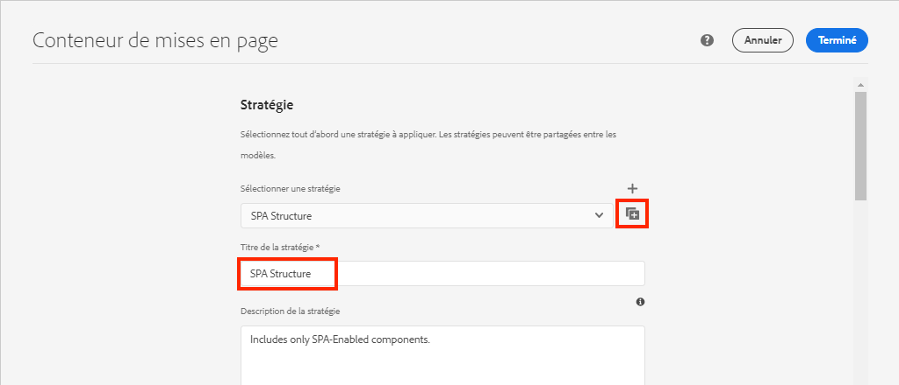
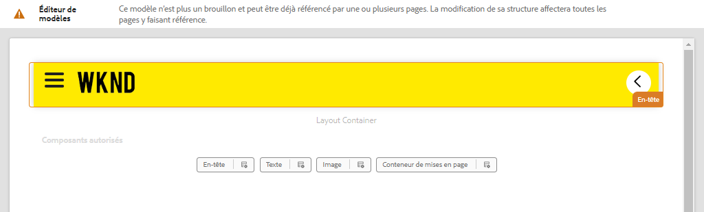

# Ajout de la navigation et du routage {#navigation-routing}

Découvrez comment plusieurs vues dans les SPA sont prises en charge à l’aide d’AEM Pages et du SDK de l’éditeur de la suite de rapports. La navigation dynamique est mise en oeuvre à l’aide des itinéraires d’Angular et ajoutée à un composant En-tête existant.

## Objectif

1. Découvrez les options de routage du modèle SPA disponibles lors de l’utilisation de SPA Editor.
2. Découvrez comment utiliser [Routage des Angulars](https://angular.io/guide/router) pour naviguer entre les différentes vues de la SPA.
3. Mettez en oeuvre une navigation dynamique pilotée par la hiérarchie de pages AEM.

## Ce que vous allez créer

Ce chapitre ajoute un menu de navigation à un `Header` composant. Le menu de navigation est piloté par la hiérarchie AEM page et utilise le modèle JSON fourni par la variable [Composant principal de navigation](https://experienceleague.adobe.com/docs/experience-manager-core-components/using/components/navigation.html).


## Conditions préalables

Examinez les outils et les instructions requis pour configurer une [environnement de développement local](overview.md#local-dev-environment).

### Obtention du code

1. Téléchargez le point de départ de ce tutoriel via Git :

   ```shell
   $ git clone git@github.com:adobe/aem-guides-wknd-spa.git
   $ cd aem-guides-wknd-spa
   $ git checkout Angular/navigation-routing-start
   ```

2. Déployez la base de code sur une instance d’AEM locale à l’aide de Maven :

   ```shell
   $ mvn clean install -PautoInstallSinglePackage
   ```

   Si vous utilisez [AEM 6.x](overview.md#compatibility) ajoutez le `classic` profile:

   ```shell
   $ mvn clean install -PautoInstallSinglePackage -Pclassic
   ```

3. Installez le module terminé pour le module traditionnel [Site de référence WKND](https://github.com/adobe/aem-guides-wknd/releases/latest). Les images fournies par [Site de référence WKND](https://github.com/adobe/aem-guides-wknd/releases/latest) sera réutilisé sur le SPA WKND. Le module peut être installé à l’aide de [AEM Gestionnaire de modules](http://localhost:4502/crx/packmgr/index.jsp).

   

Vous pouvez toujours afficher le code terminé sur [GitHub](https://github.com/adobe/aem-guides-wknd-spa/tree/Angular/navigation-routing-solution) ou extraire le code localement en passant à la branche `Angular/navigation-routing-solution`.

## Mises à jour du composant d’en-tête Inspect {#inspect-header}

Dans les chapitres précédents, la `HeaderComponent` a été ajouté en tant que composant d’Angular pur inclus via . `app.component.html`. Dans ce chapitre, le `HeaderComponent` Le composant est supprimé de l’application et est ajouté via la méthode [Éditeur de modèles](https://experienceleague.adobe.com/docs/experience-manager-learn/sites/page-authoring/template-editor-feature-video-use.html?lang=fr). Cela permet aux utilisateurs de configurer le menu de navigation de la variable `HeaderComponent` dans AEM.

>[!NOTE]
>
> Plusieurs mises à jour CSS et JavaScript ont déjà été apportées à la base de code pour commencer ce chapitre. Se concentrer sur les concepts de base, pas sur **all** des modifications de code sont discutées. Vous pouvez afficher les modifications complètes. [here](https://github.com/adobe/aem-guides-wknd-spa/compare/Angular/map-components-solution...Angular/navigation-routing-start).

1. Dans l’IDE de votre choix, ouvrez le projet SPA de démarrage pour ce chapitre.
2. Sous la `ui.frontend` inspecter le fichier ; `header.component.ts` at : `ui.frontend/src/app/components/header/header.component.ts`.

   Plusieurs mises à jour ont été apportées, y compris l’ajout d’un `HeaderEditConfig` et un `MapTo` pour permettre au composant d’être mappé à un composant AEM `wknd-spa-angular/components/header`.

   ```js
   /* header.component.ts */
   ...
   const HeaderEditConfig = {
       ...
   };
   
   @Component({
   selector: 'app-header',
   templateUrl: './header.component.html',
   styleUrls: ['./header.component.scss']
   })
   export class HeaderComponent implements OnInit {
   @Input() items: object[];
       ...
   }
   ...
   MapTo('wknd-spa-angular/components/header')(withRouter(Header), HeaderEditConfig);
   ```

   Notez que `@Input()` annotation pour `items`. `items` contient un tableau d’objets de navigation transmis à partir d’AEM.

3. Dans le `ui.apps` inspecter la définition du composant de l’AEM ; `Header` component : `ui.apps/src/main/content/jcr_root/apps/wknd-spa-angular/components/header/.content.xml`:

   ```xml
   <?xml version="1.0" encoding="UTF-8"?>
   <jcr:root xmlns:sling="http://sling.apache.org/jcr/sling/1.0" xmlns:cq="http://www.day.com/jcr/cq/1.0"
       xmlns:jcr="http://www.jcp.org/jcr/1.0"
       jcr:primaryType="cq:Component"
       jcr:title="Header"
       sling:resourceSuperType="wknd-spa-angular/components/navigation"
       componentGroup="WKND SPA Angular - Structure"/>
   ```

   L&#39;AEM `Header` hérite de toutes les fonctionnalités de la fonction [Composant principal de navigation](https://experienceleague.adobe.com/docs/experience-manager-core-components/using/components/navigation.html) via le `sling:resourceSuperType` .

## Ajouter le composant HeaderComponent au modèle SPA {#add-header-template}

1. Ouvrez un navigateur et connectez-vous à AEM, [http://localhost:4502/](http://localhost:4502/). La base de code de départ doit déjà être déployée.
2. Accédez au **[!UICONTROL Modèle de page SPA]**: [http://localhost:4502/editor.html/conf/wknd-spa-angular/settings/wcm/templates/spa-page-template/structure.html](http://localhost:4502/editor.html/conf/wknd-spa-angular/settings/wcm/templates/spa-page-template/structure.html).
3. Sélectionnez l’élément le plus externe **[!UICONTROL Conteneur de mise en page racine]** et cliquez sur son **[!UICONTROL Stratégie]** icône . Soyez prudent **not** pour sélectionner la variable **[!UICONTROL Conteneur de mises en page]** déverrouillé pour la création.

   

4. Copiez la stratégie actuelle et créez une nouvelle stratégie nommée **[!UICONTROL Structure SPA]**:

   

   Sous **[!UICONTROL Composants autorisés]** > **[!UICONTROL Général]** > sélectionnez l’option **[!UICONTROL Conteneur de mises en page]** composant.

   Sous **[!UICONTROL Composants autorisés]** > **[!UICONTROL Angular WKND SPA - STRUCTURE]** > sélectionnez l’option **[!UICONTROL En-tête]** component :

   

   Sous **[!UICONTROL Composants autorisés]** > **[!UICONTROL Angular SPA WKND - Contenu]** > sélectionnez l’option **[!UICONTROL Image]** et **[!UICONTROL Texte]** composants. Vous devez avoir 4 composants au total sélectionnés.

   Cliquez sur **[!UICONTROL Terminé]** pour enregistrer les modifications.

5. **Actualisez la page.** Ajoutez la variable **[!UICONTROL En-tête]** au-dessus du composant déverrouillé **[!UICONTROL Conteneur de mises en page]**:

   

6. Sélectionnez la **[!UICONTROL En-tête]** composant et cliquez sur son **Stratégie** pour modifier la stratégie.

   

7. Création d’une stratégie avec une **[!UICONTROL Titre de la stratégie]** de **&quot;En-tête SPA WKND&quot;**.

   Sous , **[!UICONTROL Propriétés]**:

   * Définissez la variable **[!UICONTROL Racine de navigation]** to `/content/wknd-spa-angular/us/en`.
   * Définissez la variable **[!UICONTROL Exclure les niveaux racine]** to **1**.
   * Décocher **[!UICONTROL Collecter toutes les pages enfants]**.
   * Définissez la variable **[!UICONTROL Profondeur de la structure de navigation]** to **3**.

   

   Cela collectera la navigation à 2 niveaux en dessous de `/content/wknd-spa-angular/us/en`.

8. Après avoir enregistré vos modifications, vous devriez voir la valeur renseignée `Header` dans le modèle :

   

## Création de pages enfants

Créez ensuite des pages supplémentaires dans AEM qui serviront de vues différentes dans le SPA. Nous examinerons également la structure hiérarchique du modèle JSON fourni par AEM.

1. Accédez au **Sites** console : [http://localhost:4502/sites.html/content/wknd-spa-angular/us/en/home](http://localhost:4502/sites.html/content/wknd-spa-angular/us/en/home). Sélectionnez la **Page d’accueil des Angulars WKND SPA** et cliquez sur **[!UICONTROL Créer]** > **[!UICONTROL Page]**:

   

2. Sous **[!UICONTROL Modèle]** select **[!UICONTROL Page SPA]**. Sous **[!UICONTROL Propriétés]** enter **&quot;Page 1&quot;** pour le **[!UICONTROL Titre]** et **&quot;page-1&quot;** comme nom.

   

   Cliquez sur **[!UICONTROL Créer]** et dans la fenêtre contextuelle de la boîte de dialogue, cliquez sur **[!UICONTROL Ouvrir]** pour ouvrir la page dans AEM SPA Editor.

3. Ajouter un nouveau **[!UICONTROL Texte]** au composant principal **[!UICONTROL Conteneur de mises en page]**. Modifiez le composant et saisissez le texte : **&quot;Page 1&quot;** à l’aide de l’éditeur de texte enrichi et de la variable **H1** élément (vous devrez passer en mode plein écran pour modifier les éléments de paragraphe)

   

   N’hésitez pas à ajouter du contenu supplémentaire, comme une image.

4. Revenez à la console AEM Sites et répétez les étapes ci-dessus, en créant une seconde page nommée **&quot;Page 2&quot;** comme frère de **Page 1**. Ajouter du contenu à **Page 2** afin qu’il soit facilement identifié.
5. Enfin, créez une troisième page, **&quot;Page 3&quot;** mais en tant que **child** de **Page 2**. Une fois la hiérarchie du site terminée, elle doit se présenter comme suit :

   

6. Dans un nouvel onglet, ouvrez l’API de modèle JSON fournie par AEM : [http://localhost:4502/content/wknd-spa-angular/us/en.model.json](http://localhost:4502/content/wknd-spa-angular/us/en.model.json). Ce contenu JSON est demandé lors du premier chargement de la SPA. La structure extérieure ressemble à ce qui suit :

   ```json
   {
   "language": "en",
   "title": "en",
   "templateName": "spa-app-template",
   "designPath": "/libs/settings/wcm/designs/default",
   "cssClassNames": "spa page basicpage",
   ":type": "wknd-spa-angular/components/spa",
   ":items": {},
   ":itemsOrder": [],
   ":hierarchyType": "page",
   ":path": "/content/wknd-spa-angular/us/en",
   ":children": {
       "/content/wknd-spa-angular/us/en/home": {},
       "/content/wknd-spa-angular/us/en/home/page-1": {},
       "/content/wknd-spa-angular/us/en/home/page-2": {},
       "/content/wknd-spa-angular/us/en/home/page-2/page-3": {}
       }
   }
   ```

   Sous `:children` vous devriez voir une entrée pour chacune des pages créées. Le contenu de toutes les pages figure dans cette requête JSON initiale. Une fois que le routage de navigation est implémenté, les vues suivantes du SPA sont chargées rapidement, puisque le contenu est déjà disponible côté client.

   Il n’est pas judicieux de charger **TOUT** du contenu d’un SPA dans la requête JSON initiale, car cela ralentirait le chargement initial de la page. Examinons ensuite la manière dont la profondeur d’hiérarchie des pages est collectée.

7. Accédez au **Racine SPA** à l’adresse : [http://localhost:4502/editor.html/conf/wknd-spa-angular/settings/wcm/templates/spa-app-template/structure.html](http://localhost:4502/editor.html/conf/wknd-spa-angular/settings/wcm/templates/spa-app-template/structure.html).

   Cliquez sur le bouton **[!UICONTROL Menu Propriétés de la page]** > **[!UICONTROL Stratégie de page]**:

   

8. Le **Racine SPA** modèle comporte un élément supplémentaire **[!UICONTROL Structure hiérarchique]** pour contrôler le contenu JSON collecté. Le **[!UICONTROL Profondeur de structure]** détermine la profondeur de la hiérarchie du site pour collecter les pages enfants sous la propriété **root**. Vous pouvez également utiliser la variable **[!UICONTROL Modèles de structure]** pour filtrer les pages supplémentaires en fonction d’une expression régulière.

   Mettez à jour le **[!UICONTROL Profondeur de structure]** to **&quot;2&quot;**:

   

   Cliquez sur **[!UICONTROL Terminé]** pour enregistrer les modifications apportées à la stratégie.

9. Réouverture du modèle JSON [http://localhost:4502/content/wknd-spa-angular/us/en.model.json](http://localhost:4502/content/wknd-spa-angular/us/en.model.json).

   ```json
   {
   "language": "en",
   "title": "en",
   "templateName": "spa-app-template",
   "designPath": "/libs/settings/wcm/designs/default",
   "cssClassNames": "spa page basicpage",
   ":type": "wknd-spa-angular/components/spa",
   ":items": {},
   ":itemsOrder": [],
   ":hierarchyType": "page",
   ":path": "/content/wknd-spa-angular/us/en",
   ":children": {
       "/content/wknd-spa-angular/us/en/home": {},
       "/content/wknd-spa-angular/us/en/home/page-1": {},
       "/content/wknd-spa-angular/us/en/home/page-2": {}
       }
   }
   ```

   Notez que la variable **Page 3** path a été supprimé : `/content/wknd-spa-angular/us/en/home/page-2/page-3` du modèle JSON initial.

   Plus tard, nous verrons comment le SDK de l’AEM SPA éditeur peut charger dynamiquement du contenu supplémentaire.

## Mise en oeuvre de la navigation

Mettez ensuite en oeuvre le menu de navigation avec une nouvelle `NavigationComponent`. Nous pourrions ajouter le code directement dans `header.component.html` mais une meilleure pratique consiste à éviter les composants volumineux. Implémentez plutôt une `NavigationComponent` qui pourrait être réutilisé ultérieurement.

1. Examinez le fichier JSON exposé par l’AEM `Header` component at [http://localhost:4502/content/wknd-spa-angular/us/en.model.json](http://localhost:4502/content/wknd-spa-angular/us/en.model.json):

   ```json
   ...
   "header": {
       "items": [
       {
       "level": 0,
       "active": true,
       "path": "/content/wknd-spa-angular/us/en/home",
       "description": null,
       "url": "/content/wknd-spa-angular/us/en/home.html",
       "lastModified": 1589062597083,
       "title": "WKND SPA Angular Home Page",
       "children": [
               {
               "children": [],
               "level": 1,
               "active": false,
               "path": "/content/wknd-spa-angular/us/en/home/page-1",
               "description": null,
               "url": "/content/wknd-spa-angular/us/en/home/page-1.html",
               "lastModified": 1589429385100,
               "title": "Page 1"
               },
               {
               "level": 1,
               "active": true,
               "path": "/content/wknd-spa-angular/us/en/home/page-2",
               "description": null,
               "url": "/content/wknd-spa-angular/us/en/home/page-2.html",
               "lastModified": 1589429603507,
               "title": "Page 2",
               "children": [
                   {
                   "children": [],
                   "level": 2,
                   "active": false,
                   "path": "/content/wknd-spa-angular/us/en/home/page-2/page-3",
                   "description": null,
                   "url": "/content/wknd-spa-angular/us/en/home/page-2/page-3.html",
                   "lastModified": 1589430413831,
                   "title": "Page 3"
                   }
               ],
               }
           ]
           }
       ],
   ":type": "wknd-spa-angular/components/header"
   ```

   La nature hiérarchique des pages d’AEM est modélisée dans le code JSON qui peut être utilisé pour renseigner un menu de navigation. Rappelez-vous que la variable `Header` hérite de toutes les fonctionnalités de la fonction [Composant principal de navigation](https://www.aemcomponents.dev/content/core-components-examples/library/core-structure/navigation.html) et le contenu exposé via le JSON est automatiquement mappé à l’Angular `@Input` annotation.

2. Ouvrez une nouvelle fenêtre de terminal et accédez au `ui.frontend` du projet SPA. Créer `NavigationComponent` à l’aide de l’outil d’interface de ligne de commande Angular :

   ```shell
   $ cd ui.frontend
   $ ng generate component components/navigation
   CREATE src/app/components/navigation/navigation.component.scss (0 bytes)
   CREATE src/app/components/navigation/navigation.component.html (25 bytes)
   CREATE src/app/components/navigation/navigation.component.spec.ts (656 bytes)
   CREATE src/app/components/navigation/navigation.component.ts (286 bytes)
   UPDATE src/app/app.module.ts (2032 bytes)
   ```

3. Créez ensuite une classe nommée `NavigationLink` à l’aide de l’interface de ligne de commande de l’Angular dans le `components/navigation` directory:

   ```shell
   $ cd src/app/components/navigation/
   $ ng generate class NavigationLink
   CREATE src/app/components/navigation/navigation-link.spec.ts (187 bytes)
   CREATE src/app/components/navigation/navigation-link.ts (32 bytes)
   ```

4. Revenez à l’IDE de votre choix et ouvrez le fichier à l’adresse `navigation-link.ts` at `/src/app/components/navigation/navigation-link.ts`.

   

5. Remplissez `navigation-link.ts` avec les éléments suivants :

   ```js
   export class NavigationLink {
   
       title: string;
       path: string;
       url: string;
       level: number;
       children: NavigationLink[];
       active: boolean;
   
       constructor(data) {
           this.path = data.path;
           this.title = data.title;
           this.url = data.url;
           this.level = data.level;
           this.active = data.active;
           this.children = data.children.map( item => {
               return new NavigationLink(item);
           });
       }
   }
   ```

   Il s’agit d’une classe simple qui représente un lien de navigation individuel. Dans le constructeur de classe auquel nous nous attendons `data` correspondant à l’objet JSON transmis par AEM. Cette classe sera utilisée dans les `NavigationComponent` et `HeaderComponent` pour remplir facilement la structure de navigation.

   Aucune transformation de données n’est effectuée, cette classe est principalement créée pour taper fortement le modèle JSON. Notez que `this.children` est saisi comme `NavigationLink[]` et que le constructeur crée de manière récursive de nouvelles `NavigationLink` pour chacun des éléments du `children` tableau. Rappelez ce modèle JSON pour `Header` est hiérarchique.

6. Ouvrez le fichier `navigation-link.spec.ts`. Il s’agit du fichier de test pour la variable `NavigationLink` classe . Mettez-le à jour avec ce qui suit :

   ```js
   import { NavigationLink } from './navigation-link';
   
   describe('NavigationLink', () => {
       it('should create an instance', () => {
           const data = {
               children: [],
               level: 1,
               active: false,
               path: '/content/wknd-spa-angular/us/en/home/page-1',
               description: null,
               url: '/content/wknd-spa-angular/us/en/home/page-1.html',
               lastModified: 1589429385100,
               title: 'Page 1'
           };
           expect(new NavigationLink(data)).toBeTruthy();
       });
   });
   ```

   Notez que `const data` suit le même modèle JSON inspecté précédemment pour un lien unique. Cela est loin d&#39;être un test unitaire robuste, mais cela devrait suffire à tester le constructeur de `NavigationLink`.

7. Ouvrez le fichier `navigation.component.ts`. Mettez-le à jour avec ce qui suit :

   ```js
   import { Component, OnInit, Input } from '@angular/core';
   import { NavigationLink } from './navigation-link';
   
   @Component({
   selector: 'app-navigation',
   templateUrl: './navigation.component.html',
   styleUrls: ['./navigation.component.scss']
   })
   export class NavigationComponent implements OnInit {
   
       @Input() items: object[];
   
       constructor() { }
   
       get navigationLinks(): NavigationLink[] {
   
           if (this.items && this.items.length > 0) {
               return this.items.map(item => {
                   return new NavigationLink(item);
               });
           }
   
           return null;
       }
   
       ngOnInit() {}
   
   }
   ```

   `NavigationComponent` attend un `object[]` named `items` il s’agit du modèle JSON d’AEM. Cette classe expose une seule méthode `get navigationLinks()` qui renvoie un tableau de `NavigationLink` objets.

8. Ouvrir le fichier `navigation.component.html` et mettez-le à jour de la manière suivante :

   ```html
   <ul *ngIf="navigationLinks && navigationLinks.length > 0" class="navigation__group">
       <ng-container *ngTemplateOutlet="recursiveListTmpl; context:{ links: navigationLinks }"></ng-container>
   </ul>
   ```

   Cela génère une `<ul>` et appelle la fonction `get navigationLinks()` de `navigation.component.ts`. Un `<ng-container>` est utilisé pour effectuer un appel à un modèle nommé `recursiveListTmpl` et transmet la variable `navigationLinks` comme variable nommée `links`.

   Ajoutez la variable `recursiveListTmpl` next :

   ```html
   <ng-template #recursiveListTmpl let-links="links">
       <li *ngFor="let link of links" class="{{'navigation__item navigation__item--' + link.level}}">
           <a [routerLink]="link.url" class="navigation__item-link" [title]="link.title" [attr.aria-current]="link.active">
               {{link.title}}
           </a>
           <ul *ngIf="link.children && link.children.length > 0">
               <ng-container *ngTemplateOutlet="recursiveListTmpl; context:{ links: link.children }"></ng-container>
           </ul>
       </li>
   </ng-template>
   ```

   Ici, le reste du rendu du lien de navigation est implémenté. Notez que la variable `link` est de type `NavigationLink` et toutes les méthodes/propriétés créées par cette classe sont disponibles. [`[routerLink]`](https://angular.io/api/router/RouterLink) est utilisé à la place de normal `href` attribut. Cela nous permet de créer des liens vers des itinéraires spécifiques dans l’application, sans actualisation de la page entière.

   La partie récursive de la navigation est également implémentée en créant une autre `<ul>` si la variable `link` a une valeur non vide `children` tableau.

9. Mettre à jour `navigation.component.spec.ts` pour ajouter la prise en charge de `RouterTestingModule`:

   ```diff
    ...
   + import { RouterTestingModule } from '@angular/router/testing';
    ...
    beforeEach(async(() => {
       TestBed.configureTestingModule({
   +   imports: [ RouterTestingModule ],
       declarations: [ NavigationComponent ]
       })
       .compileComponents();
    }));
    ...
   ```

   Ajouter le `RouterTestingModule` est requis, car le composant utilise `[routerLink]`.

10. Mettre à jour `navigation.component.scss` pour ajouter certains styles de base à la variable `NavigationComponent`:

   ```scss
   @import "~src/styles/variables";
   
   $link-color: $black;
   $link-hover-color: $white;
   $link-background: $black;
   
   :host-context {
       display: block;
       width: 100%;
   }
   
   .navigation__item {
       list-style: none;
   }
   
   .navigation__item-link {
       color: $link-color;
       font-size: $font-size-large;
       text-transform: uppercase;
       padding: $gutter-padding;
       display: flex;
       border-bottom: 1px solid $gray;
   
       &:hover {
           background: $link-background;
           color: $link-hover-color;
       }
   
   }
   ```

## Mise à jour du composant d’en-tête

Maintenant que la variable `NavigationComponent` a été mis en oeuvre, la variable `HeaderComponent` doit être mis à jour pour y faire référence.

1. Ouvrez un terminal et accédez au `ui.frontend` dans le projet SPA. Démarrez le **serveur de développement webpack**:

   ```shell
   $ npm start
   ```

2. Ouvrez un onglet de navigateur et accédez à [http://localhost:4200/](http://localhost:4200/).

   Le **serveur de développement webpack** doit être configuré pour remplacer le modèle JSON à partir d’une instance locale d’AEM (`ui.frontend/proxy.conf.json`). Cela nous permettra de coder directement en fonction du contenu créé dans AEM à partir d’un début de tutoriel.

   

   Le `HeaderComponent` la fonctionnalité de basculement de menu est déjà mise en oeuvre. Ajoutez ensuite le composant de navigation.

3. Revenez à l’IDE de votre choix et ouvrez le fichier . `header.component.ts` at `ui.frontend/src/app/components/header/header.component.ts`.
4. Mettez à jour le `setHomePage()` pour supprimer la chaîne codée en dur et utiliser les props dynamiques transmises par le composant AEM :

   ```js
   /* header.component.ts */
   import { NavigationLink } from '../navigation/navigation-link';
   ...
    setHomePage() {
       if (this.hasNavigation) {
           const rootNavigationLink: NavigationLink = new NavigationLink(this.items[0]);
           this.isHome = rootNavigationLink.path === this.route.snapshot.data.path;
           this.homePageUrl = rootNavigationLink.url;
       }
   }
   ...
   ```

   Une nouvelle instance de `NavigationLink` est créé en fonction de `items[0]`, la racine du modèle JSON de navigation transmis à partir d’AEM. `this.route.snapshot.data.path` renvoie le chemin d’accès de l’Angular actuel. Cette valeur est utilisée pour déterminer si l’itinéraire actuel est la valeur **Page d’accueil**. `this.homePageUrl` est utilisé pour remplir le lien d’ancrage sur la variable **logo**.

5. Ouvrir `header.component.html` et remplacez l’espace réservé statique pour la navigation par une référence au créé `NavigationComponent`:

   ```diff
       <div class="header-navigation">
           <div class="navigation">
   -            Navigation Placeholder
   +           <app-navigation [items]="items"></app-navigation>
           </div>
       </div>
   ```

   `[items]=items` transmet l’attribut `@Input() items` de la `HeaderComponent` au `NavigationComponent` où il construira la navigation.

6. Ouvrir `header.component.spec.ts` et ajoutez une déclaration pour la variable `NavigationComponent`:

   ```diff
       /* header.component.spect.ts */
   +   import { NavigationComponent } from '../navigation/navigation.component';
   
       describe('HeaderComponent', () => {
       let component: HeaderComponent;
       let fixture: ComponentFixture<HeaderComponent>;
   
       beforeEach(async(() => {
           TestBed.configureTestingModule({
           imports: [ RouterTestingModule ],
   +       declarations: [ HeaderComponent, NavigationComponent ]
           })
           .compileComponents();
       }));
   ```

   Depuis le `NavigationComponent` est désormais utilisé dans le cadre de la fonction `HeaderComponent` il doit être déclaré comme faisant partie du banc d&#39;essai.

7. Enregistrez les modifications dans les fichiers ouverts et revenez au **serveur de développement webpack**: [http://localhost:4200/](http://localhost:4200/)

   

   Ouvrez la navigation en cliquant sur le bouton bascule du menu et les liens de navigation renseignés doivent s’afficher. Vous devriez être en mesure d’accéder à différentes vues de la SPA.

## Comprendre le routage SPA

Maintenant que la navigation a été mise en oeuvre, inspectez le routage dans AEM.

1. Dans l’IDE, ouvrez le fichier . `app-routing.module.ts` at `ui.frontend/src/app`.

   ```js
   /* app-routing.module.ts */
   import { AemPageDataResolver, AemPageRouteReuseStrategy } from '@adobe/cq-angular-editable-components';
   import { NgModule } from '@angular/core';
   import { RouteReuseStrategy, RouterModule, Routes, UrlMatchResult, UrlSegment } from '@angular/router';
   import { PageComponent } from './components/page/page.component';
   
   export function AemPageMatcher(url: UrlSegment[]): UrlMatchResult {
       if (url.length) {
           return {
               consumed: url,
               posParams: {
                   path: url[url.length - 1]
               }
           };
       }
   }
   
   const routes: Routes = [
       {
           matcher: AemPageMatcher,
           component: PageComponent,
           resolve: {
               path: AemPageDataResolver
           }
       }
   ];
   @NgModule({
       imports: [RouterModule.forRoot(routes)],
       exports: [RouterModule],
       providers: [
           AemPageDataResolver,
           {
           provide: RouteReuseStrategy,
           useClass: AemPageRouteReuseStrategy
           }
       ]
   })
   export class AppRoutingModule {}
   ```

   Le `routes: Routes = [];` définit les itinéraires ou chemins de navigation pour Angular les mappages des composants.

   `AemPageMatcher` est un routeur d’Angular personnalisé [UrlMatcher](https://angular.io/api/router/UrlMatcher), qui correspond à tout ce qui &quot;ressemble&quot; à une page d’AEM qui fait partie de cette application d’Angular.

   `PageComponent` est le composant d’Angular qui représente une page dans AEM et les itinéraires correspondants seront appelés. Le `PageComponent` seront inspectées plus en profondeur.

   `AemPageDataResolver`, fourni par le SDK JS de l’éditeur d’AEM, est une [Résolveur du routeur d’Angular](https://angular.io/api/router/Resolve) utilisé pour transformer l’URL d’itinéraire, qui est le chemin d’accès dans AEM incluant l’extension .html, en chemin d’accès à la ressource dans AEM, qui est le chemin d’accès à la page moins l’extension.

   Par exemple, la variable `AemPageDataResolver` transforme l’URL d’un itinéraire en `content/wknd-spa-angular/us/en/home.html` dans un chemin de `/content/wknd-spa-angular/us/en/home`. Il est utilisé pour résoudre le contenu de la page en fonction du chemin d’accès dans l’API de modèle JSON.

   `AemPageRouteReuseStrategy`, fourni par le SDK JS de l’éditeur d’AEM, est une [RouteReuseStrategy](https://angular.io/api/router/RouteReuseStrategy) qui empêche la réutilisation de la variable `PageComponent` sur plusieurs itinéraires. Sinon, le contenu de la page &quot;A&quot; peut s’afficher lors de la navigation vers la page &quot;B&quot;.

2. Ouvrez le fichier `page.component.ts` dans `ui.frontend/src/app/components/page/`.

   ```js
   ...
   export class PageComponent {
       items;
       itemsOrder;
       path;
   
       constructor(
           private route: ActivatedRoute,
           private modelManagerService: ModelManagerService
       ) {
           this.modelManagerService
           .getData({ path: this.route.snapshot.data.path })
           .then(data => {
               this.path = data[Constants.PATH_PROP];
               this.items = data[Constants.ITEMS_PROP];
               this.itemsOrder = data[Constants.ITEMS_ORDER_PROP];
           });
       }
   }
   ```

   Le `PageComponent` est requis pour traiter le JSON récupéré à partir d’AEM et est utilisé comme composant d’Angular pour effectuer le rendu des itinéraires.

   `ActivatedRoute`, qui est fourni par le module de routeur d’Angular, contient l’état indiquant quel contenu JSON de la page d’AEM doit être chargé dans cette instance de composant Page d’Angular.

   `ModelManagerService`, récupère les données JSON en fonction de l’itinéraire et mappe les données aux variables de classe. `path`, `items`, `itemsOrder`. Ils seront ensuite transmis à la variable [AEMPageComponent](https://www.npmjs.com/package/@adobe/cq-angular-editable-components#aempagecomponent.md)

3. Ouvrez le fichier `page.component.html` dans `ui.frontend/src/app/components/page/`

   ```html
   <aem-page 
       class="structure-page" 
       [attr.data-cq-page-path]="path" 
       [cqPath]="path" 
       [cqItems]="items" 
       [cqItemsOrder]="itemsOrder">
   </aem-page>
   ```

   `aem-page` inclut la variable [AEMPageComponent](https://www.npmjs.com/package/@adobe/cq-angular-editable-components#aempagecomponent.md). Les variables `path`, `items`, et `itemsOrder` sont transmises à la variable `AEMPageComponent`. Le `AemPageComponent`, fourni via les SDK JavaScript de l’éditeur de SPA, effectue ensuite une itération sur ces données et instancie dynamiquement les composants d’Angular en fonction des données JSON, comme indiqué dans la section [Tutoriel sur les composants de carte](./map-components.md).

   Le `PageComponent` n’est en fait qu’un proxy pour la variable `AEMPageComponent` et c’est le `AEMPageComponent` qui effectue la majeure partie du travail pour mapper correctement le modèle JSON aux composants d’Angular.

## Inspect du routage SPA dans AEM

1. Ouvrez un terminal et arrêtez le **serveur de développement webpack** si a commencé. Accédez à la racine du projet et déployez-le pour AEM à l’aide de vos compétences Maven :

   ```shell
   $ cd aem-guides-wknd-spa
   $ mvn clean install -PautoInstallSinglePackage
   ```

   >[!CAUTION]
   >
   > Des règles de liaison très strictes sont activées pour le projet Angular. Si la version Maven échoue, vérifiez l’erreur et recherchez **Erreurs d’URL détectées dans les fichiers répertoriés.**. Corrigez tous les problèmes détectés par l’éditeur de liens et relancez la commande Maven.

2. Accédez à la page d’accueil SPA dans AEM : [http://localhost:4502/content/wknd-spa-angular/us/en/home.html](http://localhost:4502/content/wknd-spa-angular/us/en/home.html) et ouvrez les outils de développement de votre navigateur. Les captures d’écran ci-dessous sont capturées à partir du navigateur Google Chrome.

   Actualisez la page et une requête XHR doit s’afficher pour `/content/wknd-spa-angular/us/en.model.json`, qui est la racine SPA. Notez que seules trois pages enfants sont incluses en fonction de la configuration de la profondeur de hiérarchie du modèle racine SPA effectué plus tôt dans le tutoriel. Cela n’inclut pas **Page 3**.

   

3. Les outils de développement étant ouverts, accédez à **Page 3**:

   

   Notez qu’une nouvelle requête XHR est envoyée à : `/content/wknd-spa-angular/us/en/home/page-2/page-3.model.json`

   

   AEM Model Manager comprend que la fonction **Page 3** Le contenu JSON n’est pas disponible et déclenche automatiquement la requête XHR supplémentaire.

4. Poursuivez la navigation dans le SPA à l’aide des différents liens de navigation. Notez qu’aucune requête XHR supplémentaire n’est effectuée et qu’aucune actualisation de page complète n’a lieu. Cela permet à l’utilisateur final de SPA plus rapidement et de réduire les requêtes inutiles à AEM.

   

5. Testez les liens profonds en accédant directement à : [http://localhost:4502/content/wknd-spa-angular/us/en/home/page-2.html](http://localhost:4502/content/wknd-spa-angular/us/en/home/page-2.html). Observez que le bouton Précédent du navigateur continue de fonctionner.

## Félicitations ! {#congratulations}

Félicitations, vous avez appris comment plusieurs vues dans la SPA peuvent être prises en charge en mappant sur AEM pages avec le SDK de l’éditeur de formulaires. La navigation dynamique a été mise en oeuvre à l’aide du routage par Angular et ajoutée à la variable `Header` composant.

Vous pouvez toujours afficher le code terminé sur [GitHub](https://github.com/adobe/aem-guides-wknd-spa/tree/Angular/navigation-routing-solution) ou extraire le code localement en passant à la branche `Angular/navigation-routing-solution`.

### Étapes suivantes {#next-steps}

[Création d’un composant personnalisé](custom-component.md) - Découvrez comment créer un composant personnalisé à utiliser avec l’éditeur SPA d’AEM. Découvrez comment développer des boîtes de dialogue de création et des modèles Sling pour étendre le modèle JSON afin de renseigner un composant personnalisé.
