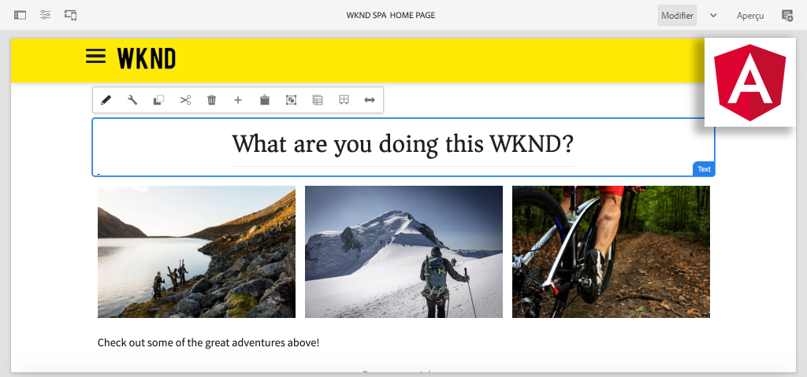

# Créer votre première SPA Angular dans AEM {#introduction}

Bienvenue dans un tutoriel en plusieurs parties conçu pour les développeurs qui découvrent le **Éditeur de SPA** dans Adobe Experience Manager (AEM). Ce tutoriel décrit la mise en oeuvre d’une application d’Angular pour une marque de style de vie fictive, WKND. L’application d’Angular sera développée et conçue pour être déployée avec AEM SPA Editor, qui mappe les composants d’Angular aux composants d’AEM. Les SPA terminées, déployées sur AEM, peuvent être créées dynamiquement à l’aide des outils de modification en ligne traditionnels d’.



*Implémentation SPA WKND*

## À propos

L’objectif de ce tutoriel en plusieurs parties est d’apprendre à un développeur comment mettre en oeuvre une application d’Angular pour travailler avec la fonctionnalité d’éditeur SPA d’AEM. Dans un scénario réel, les activités de développement sont ventilées par persona, impliquant souvent une **Développeur front-end** et un **Développeur principal**. Nous pensons qu’il est bénéfique pour tout développeur qui sera impliqué dans un projet AEM SPA Editor de suivre ce tutoriel.

Le tutoriel est conçu pour fonctionner avec **AEM as a Cloud Service** et est rétrocompatible avec **AEM 6.5.4+** et **AEM 6.4.8+**. La SPA est mise en oeuvre à l’aide des éléments suivants :

* [Archétype de projet Maven AEM](https://experienceleague.adobe.com/docs/experience-manager-core-components/using/developing/archetype/overview.html?lang=fr)
* [Éditeur de SPA AEM](https://experienceleague.adobe.com/docs/experience-manager-65/developing/headless/spas/spa-walkthrough.html#content-editing-experience-with-spa)
* [Composants principaux](https://experienceleague.adobe.com/docs/experience-manager-core-components/using/introduction.html?lang=fr)
* [Angular](https://angular.io/)

*Estimez 1 à 2 heures pour parcourir chaque partie du tutoriel.*

## Dernier code

Vous trouverez tout le code du tutoriel sur [GitHub](https://github.com/adobe/aem-guides-wknd-spa).

Le [base de code la plus récente](https://github.com/adobe/aem-guides-wknd-spa/releases) est disponible sous forme de packages AEM téléchargeables.

## Prérequis

Avant de commencer ce tutoriel, vous aurez besoin des éléments suivants :

* Connaissances de base en HTML, CSS et JavaScript
* Familiarité de base avec [Angular](https://angular.io/)
* [AEM SDK as a Cloud Service](https://experienceleague.adobe.com/docs/experience-manager-learn/cloud-service/local-development-environment-set-up/aem-runtime.html?lang=fr#download-the-aem-as-a-cloud-service-sdk), [AEM 6.5.4+](https://helpx.adobe.com/experience-manager/aem-releases-updates.html#65) ou [AEM 6.4.8+](https://helpx.adobe.com/experience-manager/aem-releases-updates.html#64)
* [Java](https://downloads.experiencecloud.adobe.com/content/software-distribution/en/general.html)
* [Apache Maven](https://maven.apache.org/) (3.3.9 ou version ultérieure)
* [Node.js](https://nodejs.org/en/) et [npm](https://www.npmjs.com/)

*Bien qu’il ne soit pas nécessaire, il est préférable de posséder une compréhension élémentaire de la fonction [développement des composants AEM Sites traditionnels](https://experienceleague.adobe.com/docs/experience-manager-learn/getting-started-wknd-tutorial-develop/overview.html?lang=fr).*

## Environnement de développement local {#local-dev-environment}

Un environnement de développement local est nécessaire pour terminer ce tutoriel. Les captures d’écran et les vidéos sont capturées à l’aide AEM SDK as a Cloud Service s’exécutant dans un environnement Mac OS avec [Visual Studio Code](https://code.visualstudio.com/) comme IDE. Les commandes et le code doivent être indépendants du système d’exploitation local, sauf indication contraire.

>[!NOTE]
>
> **Vous découvrez AEM as a Cloud Service ?** Consultez la section [le guide suivant pour configurer un environnement de développement local à l’aide du SDK as a Cloud Service AEM](https://experienceleague.adobe.com/docs/experience-manager-learn/cloud-service/local-development-environment-set-up/overview.html?lang=fr).
>
> **Vous découvrez AEM 6.5 ?** Consultez la section [guide de configuration d’un environnement de développement local](https://experienceleague.adobe.com/docs/experience-manager-learn/foundation/development/set-up-a-local-aem-development-environment.html?lang=fr).

## Étapes suivantes {#next-steps}

Qu&#39;attendez-vous?! Démarrez le tutoriel en accédant à la [SPA Editor Project](create-project.md) chapitres et découvrez comment générer un projet activé pour SPA Editor à l’aide d’AEM Project Archetype.

## Compatibilité descendante {#compatibility}

Le code de projet de ce tutoriel a été créé pour AEM as a Cloud Service. Pour rendre le code du projet rétrocompatible avec **6.5.4+** et **6.4.8+** plusieurs modifications ont été apportées.

Le [UberJar](https://experienceleague.adobe.com/docs/experience-manager-65/developing/devtools/ht-projects-maven.html#what-is-the-uberjar) **v6.4.4** a été inclus comme dépendance :

```xml
<!-- Adobe AEM 6.x Dependencies -->
<dependency>
    <groupId>com.adobe.aem</groupId>
    <artifactId>uber-jar</artifactId>
    <version>6.4.4</version>
    <classifier>apis</classifier>
    <scope>provided</scope>
</dependency>
```

Un profil Maven supplémentaire, nommé `classic` a été ajouté pour modifier la version afin de cibler AEM environnements 6.x :

```xml
  <!-- AEM 6.x Profile to include Core Components-->
    <profile>
        <id>classic</id>
        <activation>
            <activeByDefault>false</activeByDefault>
        </activation>
        <build>
        ...
    </profile>
```

Le `classic` profile est désactivé par défaut. Si vous suivez le tutoriel avec AEM 6.x, ajoutez le `classic` profile chaque fois qu’il est invité à effectuer une génération Maven :

```shell
$ mvn clean install -PautoInstallSinglePackage -Pclassic
```

Lors de la génération d’un projet pour une mise en oeuvre AEM, utilisez toujours la dernière version de la variable [AEM Archétype de projet](https://github.com/adobe/aem-project-archetype) et mettre à jour la variable `aemVersion` pour cibler la version d’AEM prévue.
