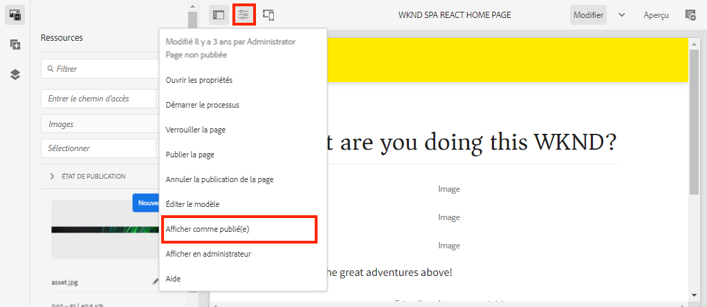

# Créer un projet {#spa-editor-project}

Découvrez comment générer un projet Maven Adobe Experience Manager (AEM) comme point de départ d’une application React intégrée à l’éditeur de SPA d’AEM.

## Objectif

1. Générez un projet activé pour l’éditeur de SPA à l’aide de l’archétype de projet AEM.
2. Déployez le projet de démarrage sur une instance locale d’AEM.

## Ce que vous allez créer {#what-build}

Dans ce chapitre, un nouveau projet AEM est généré en fonction de l’[archétype de projet AEM](https://github.com/adobe/aem-project-archetype). Le projet AEM est amorcé avec un point de départ très simple pour la SPA React.

**Qu’est-ce qu’un projet Maven ?** - [Apache Maven](https://maven.apache.org/) est un outil de gestion logicielle permettant de créer des projets. *Toutes les implémentations d’Adobe Experience Manager* utilisent des projets Maven pour créer, gérer et déployer un code personnalisé en plus d’AEM.

**Qu’est-ce qu’un archétype Maven ?** - Un [Archétype Maven](https://maven.apache.org/archetype/index.html) est un modèle ou un motif permettant de générer de nouveaux projets. L’archétype de projet AEM nous permet de générer un nouveau projet avec un espace de noms personnalisé et d’inclure une structure de projet respectant les bonnes pratiques, ce qui accélère considérablement notre projet.

## Prérequis

Examinez les instructions et outils requis pour configurer un [environnement de développement local](overview.md#local-dev-environment). Assurez-vous qu’une nouvelle instance d’Adobe Experience Manager, démarrée en mode **création**, s’exécute localement.

## Créer le projet {#create}

>[!NOTE]
>
>Ce tutoriel utilise la version **35** de l’archétype.

1. Ouvrez un terminal de ligne de commande et saisissez la commande Maven suivante :

   ```shell
   mvn -B org.apache.maven.plugins:maven-archetype-plugin:3.2.1:generate \
    -D archetypeGroupId=com.adobe.aem \
    -D archetypeArtifactId=aem-project-archetype \
    -D archetypeVersion=35 \
    -D appTitle="WKND SPA React" \
    -D appId="wknd-spa-react" \
    -D artifactId="aem-guides-wknd-spa.react" \
    -D groupId="com.adobe.aem.guides.wkndspa.react" \
    -D frontendModule="react" \
    -D aemVersion="cloud"
   ```

   >[!NOTE]
   >
   > Si vous utilisez une version 6.5.5 d’AEM ou ultérieure, remplacez `aemVersion="cloud"` par `aemVersion="6.5.5"`. Si vous utilisez une version 6.4.8 ou ultérieure, utilisez `aemVersion="6.4.8"`.

   Notez la propriété `frontendModule=react`. Elle indique à l’archétype de projet AEM d’amorcer le projet avec une [base de code React](https://experienceleague.adobe.com/docs/experience-manager-core-components/using/developing/archetype/uifrontend-react.html?lang=fr) de démarrage à utiliser avec l’éditeur de SPA AEM. Les propriétés telles que `appTitle`, `appId`, `artifactId`, et `groupId` sont utilisées pour identifier le projet et l’objectif.

   La liste complète des propriétés disponibles pour la configuration d’un projet [peut être consultée ici](https://github.com/adobe/aem-project-archetype#available-properties).

1. La structure de dossiers et de fichiers suivante est générée par l’archétype Maven sur votre système de fichiers local :

   ```plain
   |--- aem-guides-wknd-spa.react/
       |--- LICENSE
       |--- README.md
       |--- all/
       |--- archetype.properties
       |--- core/
       |--- dispatcher/
       |--- it.tests/
       |--- pom.xml
       |--- ui.apps/
       |--- ui.apps.structure/
       |--- ui.config/
       |--- ui.content/
       |--- ui.frontend/
       |--- ui.tests /
       |--- .gitignore
   ```

   Chaque dossier représente un module Maven individuel. Dans ce tutoriel, nous allons principalement travailler avec le module `ui.frontend` correspondant à l’application React. Vous trouverez plus d’informations sur les modules individuels dans la [Documentation AEM de l’archétype de projet](https://experienceleague.adobe.com/docs/experience-manager-core-components/using/developing/archetype/overview.html?lang=fr).

## Déployer et créer le projet

Compilez, créez et déployez ensuite le code du projet sur une instance locale d’AEM à l’aide de Maven.

1. Assurez-vous qu’une instance d’AEM s’exécute localement sur le port **4502**.
1. À partir de la ligne de commande, accédez au répertoire `aem-guides-wknd-spa.react` du projet.

   ```shell
   $ cd aem-guides-wknd-spa.react
   ```

1. Exécutez la commande suivante pour créer et déployer l’ensemble du projet vers AEM :

   ```shell
   $ mvn clean install -PautoInstallSinglePackage
   ```

   La création prend environ une minute et doit se terminer par le message suivant :

   ```shell
   ...
   [INFO] ------------------------------------------------------------------------
   [INFO] Reactor Summary for aem-guides-wknd-spa.react 1.0.0-SNAPSHOT:
   [INFO]
   [INFO] aem-guides-wknd-spa.react .......................... SUCCESS [  0.257 s]
   [INFO] WKND SPA React - Core .............................. SUCCESS [ 12.553 s]
   [INFO] WKND SPA React - UI Frontend ....................... SUCCESS [01:46 min]
   [INFO] WKND SPA React - Repository Structure Package ...... SUCCESS [  1.082 s]
   [INFO] WKND SPA React - UI apps ........................... SUCCESS [  8.237 s]
   [INFO] WKND SPA React - UI content ........................ SUCCESS [  5.633 s]
   [INFO] WKND SPA React - UI config ......................... SUCCESS [  0.234 s]
   [INFO] WKND SPA React - All ............................... SUCCESS [  0.643 s]
   [INFO] WKND SPA React - Integration Tests ................. SUCCESS [ 12.377 s]
   [INFO] WKND SPA React - Dispatcher ........................ SUCCESS [  0.066 s]
   [INFO] WKND SPA React - UI Tests .......................... SUCCESS [  0.074 s]
   [INFO] WKND SPA React - Project Analyser .................. SUCCESS [ 31.287 s]
   [INFO] ------------------------------------------------------------------------
   [INFO] BUILD SUCCESS
   [INFO] ------------------------------------------------------------------------
   ```

   Le `autoInstallSinglePackage` de profil Maven compile les modules individuels du projet et déploie un seul package sur l’instance AEM. Par défaut, ce package est déployé sur une instance AEM s’exécutant localement sur le port **4502** et avec les informations d’identification de `admin:admin`.

1. Accédez au **Gestionnaire de packages** sur votre instance AEM locale : [http://localhost:4502/crx/packmgr/index.jsp](http://localhost:4502/crx/packmgr/index.jsp).

1. Vous devriez voir plusieurs packages avec le préfixe `aem-guides-wknd-spa.react`.

   

   *Gestionnaire de packages AEM*

   Tout le code personnalisé nécessaire au projet est regroupé dans ces packages et installé sur l’environnement AEM.

## Créer du contenu

Ouvrez ensuite la SPA de démarrage générée par l’archétype et mettez à jour une partie du contenu.

1. Accédez à la console **Sites** : [http://localhost:4502/sites.html/content](http://localhost:4502/sites.html/content).

   La SPA WKND comprend une structure de site de base avec un pays, une langue et une page d’accueil. Cette hiérarchie est basée sur les valeurs par défaut de l’archétype pour `language_country` et `isSingleCountryWebsite`. Ces valeurs peuvent être remplacées en mettant à jour les [propriétés disponibles](https://github.com/adobe/aem-project-archetype#available-properties) lors de la génération d’un projet.

2. Ouvrez la page **us** > **en** > **WKND SPA React Home Page** en sélectionnant la page et en cliquant sur le bouton **Modifier** dans la barre de menus :

   

3. Un composant de **texte** a déjà été ajouté à la page. Vous pouvez modifier ce composant comme tout autre composant dans AEM.

   

4. Ajoutez un autre composant de **texte** à la page.

   Notez que l’expérience de création est similaire à celle d’une page AEM Sites traditionnelle. Actuellement, un nombre limité de composants peuvent être utilisés. D’autres éléments seront ajoutés au cours du tutoriel.

## Inspecter l’application monopage (SPA)

Vérifiez ensuite qu’il s’agit d’une application monopage à l’aide des outils de développement de votre navigateur.

1. Dans l’**éditeur de page**, cliquez sur le bouton **Informations sur la page** > **Afficher comme publié** :

   

   Un nouvel onglet s’ouvre avec le paramètre de requête `?wcmmode=disabled` qui désactive l’éditeur AEM : [http://localhost:4502/content/wknd-spa-react/us/en/home.html?wcmmode=disabled](http://localhost:4502/content/wknd-spa-react/us/en/home.html?wcmmode=disabled).

2. Affichez la source de la page et notez que le contenu textuel **[!DNL Hello World]** ou tout autre contenu est introuvable. À la place, vous devriez voir une adresse HTML similaire à celle-ci :

   ```html
   ...
   <body>
       <noscript>You need to enable JavaScript to run this app.</noscript>
       <div id="spa-root"></div>
       <script type="text/javascript" src="/etc.clientlibs/wknd-spa-react/clientlibs/clientlib-react.lc-xxxx-lc.min.js"></script>
   </body>
   ...
   ```

   `clientlib-react.min.js` est la SPA React chargée sur la page et responsable du rendu du contenu.

   Cependant, *d’où provient le contenu ?*

3. Revenez à l’onglet : [http://localhost:4502/content/wknd-spa-react/us/en/home.html?wcmmode=disabled](http://localhost:4502/content/wknd-spa-react/us/en/home.html?wcmmode=disabled).
4. Ouvrez les outils de développement du navigateur et examinez le trafic réseau de la page lors d’une actualisation. Affichez les requêtes **XHR** :

   

   Il doit y avoir une requête pour [http://localhost:4502/content/wknd-spa-react/us/en.model.json](http://localhost:4502/content/wknd-spa-react/us/en.model.json). Elle contient tout le contenu, au format JSON, qui pilotera la SPA.

5. Dans un nouvel onglet, ouvrez [http://localhost:4502/content/wknd-spa-react/us/en.model.json](http://localhost:4502/content/wknd-spa-react/us/en.model.json).

   La requête `en.model.json` représente le modèle de contenu qui pilotera l’application. Inspectez la sortie JSON et vous devriez être en mesure de trouver le fragment de code représentant le ou les composants de **[!UICONTROL texte]**.

   ```json
   ...
   ":items": {
       "text": {
           "text": "<p>Hello World! Updated content!</p>\r\n",
           "richText": true,
           ":type": "wknd-spa-react/components/text"
       },
       "text_98796435": {
           "text": "<p>A new text component.</p>\r\n",
           "richText": true,
           ":type": "wknd-spa-react/components/text"
       },
   }
   ...
   ```

   Dans le chapitre suivant, nous allons examiner la manière dont ce contenu JSON est mappé des composants AEM aux composants SPA pour former la base de l’expérience de l’éditeur SPA AEM.

   >[!NOTE]
   >
   > Il peut s’avérer utile d’installer une extension de navigateur pour formater automatiquement la sortie JSON.

## Félicitations. {#congratulations}

Félicitations, vous venez de créer votre premier projet d’éditeur SPA AEM.

La SPA est assez simple. Dans les chapitres suivants, d’autres fonctionnalités sont ajoutées.

### Étapes suivantes {#next-steps}

[Intégrer une SPA](integrate-spa.md) - Découvrez comment le code source de SPA est intégré au projet AEM et les outils disponibles pour développer rapidement la SPA.
