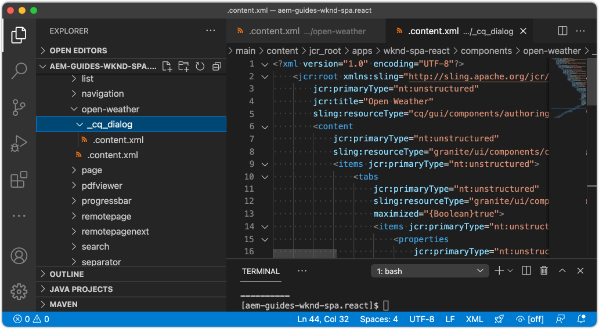

# Création d’un composant météorologique personnalisé {#custom-component}

Découvrez comment créer un composant météorologique personnalisé à utiliser avec l’éditeur SPA d’AEM. Découvrez comment développer des boîtes de dialogue de création et des modèles Sling pour étendre le modèle JSON afin de renseigner un composant personnalisé. Le [Ouvrir l’API météorologique](https://openweathermap.org) et [Composant React Open Weather](https://www.npmjs.com/package/react-open-weather) sont utilisées.

## Objectif

1. Comprendre le rôle des modèles Sling dans la manipulation de l’API de modèle JSON fournie par AEM.
2. Découvrez comment créer des boîtes de dialogue de composant AEM.
3. Découvrez comment créer une **custom** Composant AEM compatible avec la structure de l’éditeur SPA.

## Ce que vous allez créer

Un composant météorologique simple est construit. Ce composant peut être ajouté à la SPA par les auteurs de contenu. À l’aide d’une boîte de dialogue AEM, les auteurs peuvent définir l’emplacement du temps à afficher.  L’implémentation de ce composant illustre les étapes nécessaires à la création d’un composant AEM net compatible avec la structure AEM Éditeur.


## Prérequis

Examinez les outils et les instructions requis pour configurer une [environnement de développement local](overview.md#local-dev-environment). Ce chapitre est la suite du chapitre [Navigation et routage](navigation-routing.md) , toutefois, pour suivre l’exemple, vous avez besoin d’un projet AEM activé SPA déployé sur une instance d’AEM locale.

### Clé API météorologique ouverte

Une clé API de [Ouverture de la météo](https://openweathermap.org/) est nécessaire pour suivre le tutoriel. [L&#39;inscription est gratuite](https://home.openweathermap.org/users/sign_up) pour un nombre limité d’appels API.

## Définition du composant AEM

Un composant AEM est défini comme un noeud et des propriétés. Dans le projet, ces noeuds et propriétés sont représentés sous la forme de fichiers XML dans le `ui.apps` module . Créez ensuite le composant AEM dans le `ui.apps` module .

>[!NOTE]
>
> Actualisez rapidement les [les principes de base des composants AEM peuvent s’avérer utiles ;](https://experienceleague.adobe.com/docs/experience-manager-learn/getting-started-wknd-tutorial-develop/project-archetype/component-basics.html).

1. Dans l’IDE de votre choix, ouvrez le `ui.apps` dossier.
2. Accédez à `ui.apps/src/main/content/jcr_root/apps/wknd-spa-react/components` et créez un dossier nommé `open-weather`.
3. Créez un fichier nommé `.content.xml` sous le `open-weather` dossier. Renseignez la variable `open-weather/.content.xml` avec ce qui suit :

   ```xml
   <?xml version="1.0" encoding="UTF-8"?>
   <jcr:root xmlns:sling="http://sling.apache.org/jcr/sling/1.0" xmlns:cq="http://www.day.com/jcr/cq/1.0" xmlns:jcr="http://www.jcp.org/jcr/1.0"
       jcr:primaryType="cq:Component"
       jcr:title="Open Weather"
       componentGroup="WKND SPA React - Content"/>
   ```

   

   `jcr:primaryType="cq:Component"` - identifie que ce noeud est un composant AEM.

   `jcr:title` est la valeur affichée pour les auteurs de contenu et la variable `componentGroup` détermine le regroupement des composants dans l’interface utilisateur de création.

4. Sous la `custom-component` créer un autre dossier nommé `_cq_dialog`.
5. Sous la `_cq_dialog` créer un dossier nommé `.content.xml` et renseignez-le avec les éléments suivants :

   ```xml
   <?xml version="1.0" encoding="UTF-8"?>
   <jcr:root xmlns:sling="http://sling.apache.org/jcr/sling/1.0" xmlns:granite="http://www.adobe.com/jcr/granite/1.0" xmlns:cq="http://www.day.com/jcr/cq/1.0" xmlns:jcr="http://www.jcp.org/jcr/1.0" xmlns:nt="http://www.jcp.org/jcr/nt/1.0"
       jcr:primaryType="nt:unstructured"
       jcr:title="Open Weather"
       sling:resourceType="cq/gui/components/authoring/dialog">
       <content
           jcr:primaryType="nt:unstructured"
           sling:resourceType="granite/ui/components/coral/foundation/container">
           <items jcr:primaryType="nt:unstructured">
               <tabs
                   jcr:primaryType="nt:unstructured"
                   sling:resourceType="granite/ui/components/coral/foundation/tabs"
                   maximized="{Boolean}true">
                   <items jcr:primaryType="nt:unstructured">
                       <properties
                           jcr:primaryType="nt:unstructured"
                           jcr:title="Properties"
                           sling:resourceType="granite/ui/components/coral/foundation/container"
                           margin="{Boolean}true">
                           <items jcr:primaryType="nt:unstructured">
                               <columns
                                   jcr:primaryType="nt:unstructured"
                                   sling:resourceType="granite/ui/components/coral/foundation/fixedcolumns"
                                   margin="{Boolean}true">
                                   <items jcr:primaryType="nt:unstructured">
                                       <column
                                           jcr:primaryType="nt:unstructured"
                                           sling:resourceType="granite/ui/components/coral/foundation/container">
                                           <items jcr:primaryType="nt:unstructured">
                                               <label
                                                   jcr:primaryType="nt:unstructured"
                                                   sling:resourceType="granite/ui/components/coral/foundation/form/textfield"
                                                   fieldDescription="The label to display for the component"
                                                   fieldLabel="Label"
                                                   name="./label"/>
                                               <lat
                                                   jcr:primaryType="nt:unstructured"
                                                   sling:resourceType="granite/ui/components/coral/foundation/form/numberfield"
                                                   fieldDescription="The latitude of the location."
                                                   fieldLabel="Latitude"
                                                   step="any"
                                                   name="./lat" />
                                               <lon
                                                   jcr:primaryType="nt:unstructured"
                                                   sling:resourceType="granite/ui/components/coral/foundation/form/numberfield"
                                                   fieldDescription="The longitude of the location."
                                                   fieldLabel="Longitude"
                                                   step="any"
                                                   name="./lon"/>
                                           </items>
                                       </column>
                                   </items>
                               </columns>
                           </items>
                       </properties>
                   </items>
               </tabs>
           </items>
       </content>
   </jcr:root>
   ```

   

   Le fichier XML ci-dessus génère une boîte de dialogue très simple pour la `Weather Component`. La partie essentielle du fichier est le fichier interne. `<label>`, `<lat>` et `<lon>` noeuds. Cette boîte de dialogue contient deux `numberfield`s et a `textfield` qui permet à un utilisateur de configurer les conditions météorologiques à afficher.

   Un modèle Sling est créé en regard de pour exposer la valeur de la variable `label`,`lat` et `long` propriétés via le modèle JSON.

   >[!NOTE]
   >
   > Vous pouvez afficher beaucoup plus [exemples de boîtes de dialogue en affichant les définitions des composants principaux](https://github.com/adobe/aem-core-wcm-components/tree/master/content/src/content/jcr_root/apps/core/wcm/components). Vous pouvez également afficher des champs de formulaire supplémentaires, tels que `select`, `textarea`, `pathfield`, disponible sous `/libs/granite/ui/components/coral/foundation/form` in [CRXDE-Lite](http://localhost:4502/crx/de/index.jsp#/libs/granite/ui/components/coral/foundation/form).

   Avec un composant d’AEM traditionnel, un [HTL](https://experienceleague.adobe.com/docs/experience-manager-htl/using/overview.html?lang=fr) est généralement requis. Comme le SPA effectue le rendu du composant, aucun script HTL n’est nécessaire.

## Création d’un modèle Sling

Les modèles Sling sont des objets POJO (Plain Old Java Object) Java pilotés par les annotations qui facilitent le mappage des données du JCR aux variables Java. [Modèles Sling](https://experienceleague.adobe.com/docs/experience-manager-learn/getting-started-wknd-tutorial-develop/project-archetype/component-basics.html?lang=en#sling-models) en règle générale pour encapsuler une logique métier côté serveur complexe pour les composants AEM.

Dans le contexte de l’éditeur de SPA, les modèles Sling exposent le contenu d’un composant par le biais du modèle JSON par le biais d’une fonctionnalité utilisant la fonction [Exportateur de modèles Sling](https://experienceleague.adobe.com/docs/experience-manager-learn/foundation/development/develop-sling-model-exporter.html?lang=fr).

1. Dans l’IDE de votre choix, ouvrez le `core` module à `aem-guides-wknd-spa.react/core`.
1. Créez un fichier nommé dans `OpenWeatherModel.java` at `core/src/main/java/com/adobe/aem/guides/wkndspa/react/core/models`.
1. Remplissez `OpenWeatherModel.java` avec les éléments suivants :

   ```java
   package com.adobe.aem.guides.wkndspa.react.core.models;
   
   import com.adobe.cq.export.json.ComponentExporter;
   
   // Sling Models intended to be used with SPA Editor must extend ComponentExporter interface
   public interface OpenWeatherModel extends ComponentExporter {
   
       public String getLabel();
   
       public double getLat();
   
       public double getLon();
   
   }
   ```

   Il s’agit de l’interface Java de notre composant. Pour que notre modèle Sling soit compatible avec la structure d’éditeur SPA, il doit étendre la variable `ComponentExporter` classe .

1. Créez un dossier nommé `impl` sous `core/src/main/java/com/adobe/aem/guides/wkndspa/react/core/models`.
1. Créez un fichier nommé `OpenWeatherModelImpl.java` sous `impl` et renseignez les éléments suivants :

   ```java
   package com.adobe.aem.guides.wkndspa.react.core.models.impl;
   
   import org.apache.sling.models.annotations.*;
   import org.apache.sling.models.annotations.injectorspecific.ValueMapValue;
   import com.adobe.cq.export.json.ComponentExporter;
   import com.adobe.cq.export.json.ExporterConstants;
   import org.apache.commons.lang3.StringUtils;
   import org.apache.sling.api.SlingHttpServletRequest;
   import com.adobe.aem.guides.wkndspa.react.core.models.OpenWeatherModel;
   
   // Sling Model annotation
   @Model(
       adaptables = SlingHttpServletRequest.class, 
       adapters = { OpenWeatherModel.class, ComponentExporter.class }, 
       resourceType = OpenWeatherModelImpl.RESOURCE_TYPE, 
       defaultInjectionStrategy = DefaultInjectionStrategy.OPTIONAL
       )
   @Exporter( //Exporter annotation that serializes the modoel as JSON
       name = ExporterConstants.SLING_MODEL_EXPORTER_NAME, 
       extensions = ExporterConstants.SLING_MODEL_EXTENSION
       )
   public class OpenWeatherModelImpl implements OpenWeatherModel {
   
       @ValueMapValue
       private String label; //maps variable to jcr property named "label" persisted by Dialog
   
       @ValueMapValue
       private double lat; //maps variable to jcr property named "lat"
   
       @ValueMapValue
       private double lon; //maps variable to jcr property named "lon"
   
       // points to AEM component definition in ui.apps
       static final String RESOURCE_TYPE = "wknd-spa-react/components/open-weather";
   
       // public getter method to expose value of private variable `label`
       // adds additional logic to default the label to "(Default)" if not set.
       @Override
       public String getLabel() {
           return StringUtils.isNotBlank(label) ? label : "(Default)";
       }
   
       // public getter method to expose value of private variable `lat`
       @Override
       public double getLat() {
           return lat;
       }
   
       // public getter method to expose value of private variable `lon`
       @Override
       public double getLon() {
           return lon;
       }
   
       // method required by `ComponentExporter` interface
       // exposes a JSON property named `:type` with a value of `wknd-spa-react/components/open-weather`
       // required to map the JSON export to the SPA component props via the `MapTo`
       @Override
       public String getExportedType() {
           return OpenWeatherModelImpl.RESOURCE_TYPE;
       }
   } 
   ```

   La variable statique `RESOURCE_TYPE` doit pointer vers le chemin d’accès dans `ui.apps` du composant. Le `getExportedType()` est utilisé pour mapper les propriétés JSON au composant SPA via `MapTo`. `@ValueMapValue` est une annotation qui lit la propriété jcr enregistrée par la boîte de dialogue.

## Mettre à jour le SPA

Ensuite, mettez à jour le code React afin d’inclure la variable [Composant React Open Weather](https://www.npmjs.com/package/react-open-weather) et faites en sorte qu’il soit mappé au composant AEM créé lors des étapes précédentes.

1. Installation du composant React Open Weather en tant que **npm** dependency :

   ```shell
   $ cd aem-guides-wknd-spa.react/ui.frontend
   $ npm i react-open-weather
   ```

1. Créez un dossier nommé `OpenWeather` at `ui.frontend/src/components/OpenWeather`.
1. Ajouter un fichier nommé `OpenWeather.js` et renseignez-le avec les éléments suivants :

   ```js
   import React from 'react';
   import {MapTo} from '@adobe/aem-react-editable-components';
   import ReactWeather, { useOpenWeather } from 'react-open-weather';
   
   // Open weather API Key
   // For simplicity it is hard coded in the file, ideally this is extracted in to an environment variable
   const API_KEY = 'YOUR_API_KEY';
   
   // Logic to render placeholder or component
   const OpenWeatherEditConfig = {
   
       emptyLabel: 'Weather',
       isEmpty: function(props) {
           return !props || !props.lat || !props.lon || !props.label;
       }
   };
   
   // Wrapper function that includes react-open-weather component
   function ReactWeatherWrapper(props) {
       const { data, isLoading, errorMessage } = useOpenWeather({
           key: API_KEY,
           lat: props.lat, // passed in from AEM JSON
           lon: props.lon, // passed in from AEM JSON
           lang: 'en',
           unit: 'imperial', // values are (metric, standard, imperial)
       });
   
       return (
           <div className="cmp-open-weather">
               <ReactWeather
                   isLoading={isLoading}
                   errorMessage={errorMessage}
                   data={data}
                   lang="en"
                   locationLabel={props.label} // passed in from AEM JSON
                   unitsLabels={{ temperature: 'F', windSpeed: 'mph' }}
                   showForecast={false}
                 />
           </div>
       );
   }
   
   export default function OpenWeather(props) {
   
           // render nothing if component not configured
           if(OpenWeatherEditConfig.isEmpty(props)) {
               return null;
           }
   
           // render ReactWeather component if component configured
           // pass props to ReactWeatherWrapper. These props include the mapped properties from AEM JSON
           return ReactWeatherWrapper(props);
   
   }
   
   // Map OpenWeather to AEM component
   MapTo('wknd-spa-react/components/open-weather')(OpenWeather, OpenWeatherEditConfig);
   ```

1. Mettre à jour `import-components.js` at `ui.frontend/src/components/import-components.js` pour inclure la variable `OpenWeather` component :

   ```diff
     // import-component.js
     import './Container/Container';
     import './ExperienceFragment/ExperienceFragment';
   + import './OpenWeather/OpenWeather';
   ```

1. Déployez toutes les mises à jour sur un environnement d’AEM local à partir de la racine du répertoire du projet, en utilisant vos compétences Maven :

   ```shell
   $ cd aem-guides-wknd-spa.react
   $ mvn clean install -PautoInstallSinglePackage
   ```

## Mise à jour de la stratégie de modèle

Ensuite, accédez à AEM pour vérifier les mises à jour et autoriser le `OpenWeather` à ajouter au SPA.

1. Vérifiez l’enregistrement du nouveau modèle Sling en accédant à [http://localhost:4502/system/console/status-slingmodels](http://localhost:4502/system/console/status-slingmodels).

   ```plain
   com.adobe.aem.guides.wkndspa.react.core.models.impl.OpenWeatherModelImpl - wknd-spa-react/components/open-weather
   
   com.adobe.aem.guides.wkndspa.react.core.models.impl.OpenWeatherModelImpl exports 'wknd-spa-react/components/open-weather' with selector 'model' and extension '[Ljava.lang.String;@2fd80fc5' with exporter 'jackson'
   ```

   Vous devriez voir les deux lignes ci-dessus qui indiquent la variable `OpenWeatherModelImpl` est associé à la variable `wknd-spa-react/components/open-weather` et qu’il est enregistré via l’exportateur de modèle Sling.

1. Accédez au modèle de page SPA à l’adresse [http://localhost:4502/editor.html/conf/wknd-spa-react/settings/wcm/templates/spa-page-template/structure.html](http://localhost:4502/editor.html/conf/wknd-spa-react/settings/wcm/templates/spa-page-template/structure.html).
1. Mettez à jour la stratégie du conteneur de mises en page pour ajouter la nouvelle `Open Weather` en tant que composant autorisé :

   

   Enregistrez les modifications apportées à la stratégie et observez la variable `Open Weather` en tant que composant autorisé :

   

## Création du composant de météo ouverte

Ensuite, créez le `Open Weather` à l’aide de l’éditeur SPA d’AEM.

1. Accédez à [http://localhost:4502/editor.html/content/wknd-spa-react/us/en/home.html](http://localhost:4502/editor.html/content/wknd-spa-react/us/en/home.html).
1. Dans `Edit` , ajoutez le `Open Weather` au `Layout Container`:

   

1. Ouvrez la boîte de dialogue du composant et saisissez une **Libellé**, **Latitude**, et **Longitude**. Par exemple **San Diego**, **32,7157**, et **-117.1611**. Les nombres de l’hémisphère occidental et de l’hémisphère sud sont représentés sous forme de nombres négatifs avec l’API de météo ouverte

   

   Il s’agit de la boîte de dialogue qui a été créée à partir du fichier XML plus tôt dans le chapitre.

1. Enregistrez les modifications. Observez que la météo pour **San Diego** s’affiche maintenant :

   

1. Affichez le modèle JSON en accédant à [http://localhost:4502/content/wknd-spa-react/us/en.model.json](http://localhost:4502/content/wknd-spa-react/us/en.model.json). Recherchez `wknd-spa-react/components/open-weather`:

   ```json
   "open_weather": {
       "label": "San Diego",
       "lat": 32.7157,
       "lon": -117.1611,
       ":type": "wknd-spa-react/components/open-weather"
   }
   ```

   Les valeurs JSON sont générées par le modèle Sling. Ces valeurs JSON sont transmises au composant React sous la forme de props.

## Félicitations ! {#congratulations}

Félicitations, vous avez appris à créer un composant d’AEM personnalisé à utiliser avec l’éditeur SPA. Vous avez également appris comment les boîtes de dialogue, les propriétés JCR et les modèles Sling interagissent pour générer le modèle JSON.

### Étapes suivantes {#next-steps}

[Étendre un composant principal](extend-component.md) - Découvrez comment étendre un composant principal d’AEM existant à utiliser avec AEM Éditeur d’SPA. Comprendre comment ajouter des propriétés et du contenu à un composant existant est une technique puissante pour étendre les fonctionnalités d’une mise en oeuvre d’AEM SPA éditeur.
