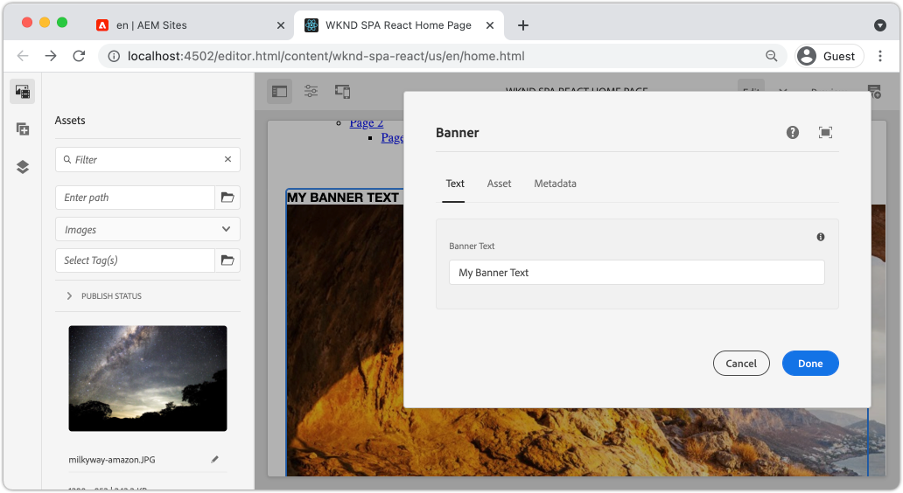
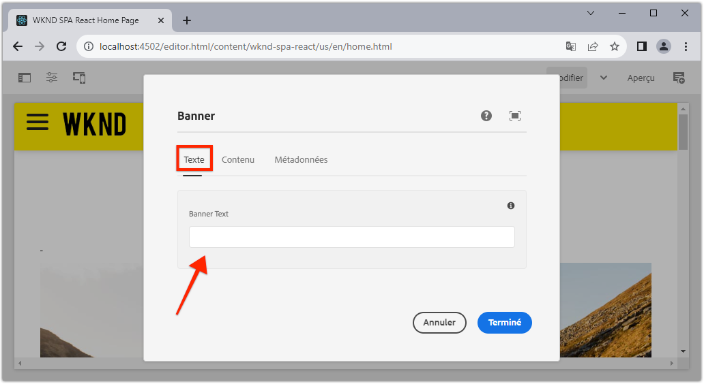
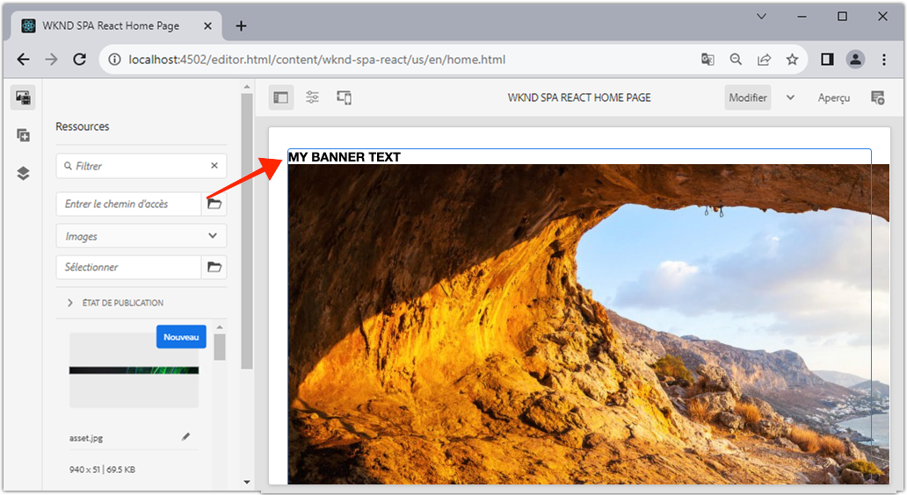

# Étendre un composant principal {#extend-component}

Découvrez comment étendre un composant principal existant à utiliser avec l’éditeur SPA d’AEM. Comprendre comment étendre un composant existant est une technique puissante pour personnaliser et étendre les fonctionnalités d’une implémentation d’AEM SPA éditeur.

## Objectif

1. Étendez un composant principal existant avec des propriétés et du contenu supplémentaires.
2. Comprendre les principes de base de l’héritage des composants à l’aide de la fonction `sling:resourceSuperType`.
3. Découvrez comment tirer parti de la variable [Modèle de délégation](https://github.com/adobe/aem-core-wcm-components/wiki/Delegation-Pattern-for-Sling-Models) pour que les modèles Sling réutilisent la logique et les fonctionnalités existantes.

## Ce que vous allez créer

Ce chapitre illustre le code supplémentaire nécessaire à l’ajout d’une propriété supplémentaire à une propriété standard `Image` afin de répondre aux exigences d’un nouveau `Banner` composant. Le `Banner` contient toutes les mêmes propriétés que la norme `Image` , mais inclut une propriété supplémentaire pour que les utilisateurs puissent renseigner la variable **Texte de bannière**.



## Prérequis

Examinez les outils et les instructions requis pour configurer une [environnement de développement local](overview.md#local-dev-environment). À ce stade du tutoriel, les utilisateurs disposent d’une bonne compréhension de la fonction AEM Éditeur SPA.

## Héritage avec Sling Resource Super Type {#sling-resource-super-type}

Pour étendre un jeu de composants existant, une propriété nommée `sling:resourceSuperType` sur la définition de votre composant.  `sling:resourceSuperType`est un [property](https://sling.apache.org/documentation/the-sling-engine/resources.html#resource-properties) qui peut être défini sur la définition d’un composant AEM qui pointe vers un autre composant. Cela définit explicitement le composant pour hériter de toutes les fonctionnalités du composant identifié comme le `sling:resourceSuperType`.

Si nous voulons étendre la variable `Image` component at `wknd-spa-react/components/image` nous devons mettre à jour le code dans la variable `ui.apps` module .

1. Créez un dossier sous le `ui.apps` module pour `banner` at `ui.apps/src/main/content/jcr_root/apps/wknd-spa-react/components/banner`.
1. Sous `banner` créer une définition de composant (`.content.xml`) comme suit :

   ```xml
   <?xml version="1.0" encoding="UTF-8"?>
   <jcr:root xmlns:sling="http://sling.apache.org/jcr/sling/1.0" xmlns:cq="http://www.day.com/jcr/cq/1.0" xmlns:jcr="http://www.jcp.org/jcr/1.0"
       jcr:primaryType="cq:Component"
       jcr:title="Banner"
       sling:resourceSuperType="wknd-spa-react/components/image"
       componentGroup="WKND SPA React - Content"/>
   ```

   Ce paramètre `wknd-spa-react/components/banner` pour hériter de toutes les fonctionnalités d’ `wknd-spa-react/components/image`.

## cq:editConfig {#cq-edit-config}

Le `_cq_editConfig.xml` détermine le comportement de glisser-déposer dans l’interface utilisateur de création d’AEM. Lors de l’extension du composant Image, il est important que le type de ressource corresponde au composant lui-même.

1. Dans le `ui.apps` module crée un autre fichier sous `banner` named `_cq_editConfig.xml`.
1. Renseigner `_cq_editConfig.xml` avec le code XML suivant :

   ```xml
   <?xml version="1.0" encoding="UTF-8"?>
   <jcr:root xmlns:sling="http://sling.apache.org/jcr/sling/1.0" xmlns:cq="http://www.day.com/jcr/cq/1.0" xmlns:jcr="http://www.jcp.org/jcr/1.0" xmlns:nt="http://www.jcp.org/jcr/nt/1.0"
       jcr:primaryType="cq:EditConfig">
       <cq:dropTargets jcr:primaryType="nt:unstructured">
           <image
               jcr:primaryType="cq:DropTargetConfig"
               accept="[image/gif,image/jpeg,image/png,image/webp,image/tiff,image/svg\\+xml]"
               groups="[media]"
               propertyName="./fileReference">
               <parameters
                   jcr:primaryType="nt:unstructured"
                   sling:resourceType="wknd-spa-react/components/banner"
                   imageCrop=""
                   imageMap=""
                   imageRotate=""/>
           </image>
       </cq:dropTargets>
       <cq:inplaceEditing
           jcr:primaryType="cq:InplaceEditingConfig"
           active="{Boolean}true"
           editorType="image">
           <inplaceEditingConfig jcr:primaryType="nt:unstructured">
               <plugins jcr:primaryType="nt:unstructured">
                   <crop
                       jcr:primaryType="nt:unstructured"
                       supportedMimeTypes="[image/jpeg,image/png,image/webp,image/tiff]"
                       features="*">
                       <aspectRatios jcr:primaryType="nt:unstructured">
                           <wideLandscape
                               jcr:primaryType="nt:unstructured"
                               name="Wide Landscape"
                               ratio="0.6180"/>
                           <landscape
                               jcr:primaryType="nt:unstructured"
                               name="Landscape"
                               ratio="0.8284"/>
                           <square
                               jcr:primaryType="nt:unstructured"
                               name="Square"
                               ratio="1"/>
                           <portrait
                               jcr:primaryType="nt:unstructured"
                               name="Portrait"
                               ratio="1.6180"/>
                       </aspectRatios>
                   </crop>
                   <flip
                       jcr:primaryType="nt:unstructured"
                       supportedMimeTypes="[image/jpeg,image/png,image/webp,image/tiff]"
                       features="-"/>
                   <map
                       jcr:primaryType="nt:unstructured"
                       supportedMimeTypes="[image/jpeg,image/png,image/webp,image/tiff,image/svg+xml]"
                       features="*"/>
                   <rotate
                       jcr:primaryType="nt:unstructured"
                       supportedMimeTypes="[image/jpeg,image/png,image/webp,image/tiff]"
                       features="*"/>
                   <zoom
                       jcr:primaryType="nt:unstructured"
                       supportedMimeTypes="[image/jpeg,image/png,image/webp,image/tiff]"
                       features="*"/>
               </plugins>
               <ui jcr:primaryType="nt:unstructured">
                   <inline
                       jcr:primaryType="nt:unstructured"
                       toolbar="[crop#launch,rotate#right,history#undo,history#redo,fullscreen#fullscreen,control#close,control#finish]">
                       <replacementToolbars
                           jcr:primaryType="nt:unstructured"
                           crop="[crop#identifier,crop#unlaunch,crop#confirm]"/>
                   </inline>
                   <fullscreen jcr:primaryType="nt:unstructured">
                       <toolbar
                           jcr:primaryType="nt:unstructured"
                           left="[crop#launchwithratio,rotate#right,flip#horizontal,flip#vertical,zoom#reset100,zoom#popupslider]"
                           right="[history#undo,history#redo,fullscreen#fullscreenexit]"/>
                       <replacementToolbars jcr:primaryType="nt:unstructured">
                           <crop
                               jcr:primaryType="nt:unstructured"
                               left="[crop#identifier]"
                               right="[crop#unlaunch,crop#confirm]"/>
                           <map
                               jcr:primaryType="nt:unstructured"
                               left="[map#rectangle,map#circle,map#polygon]"
                               right="[map#unlaunch,map#confirm]"/>
                       </replacementToolbars>
                   </fullscreen>
               </ui>
           </inplaceEditingConfig>
       </cq:inplaceEditing>
   </jcr:root>
   ```

1. L’aspect unique du fichier est le suivant : `<parameters>` Noeud qui définit resourceType sur `wknd-spa-react/components/banner`.

   ```xml
   <parameters
       jcr:primaryType="nt:unstructured"
       sling:resourceType="wknd-spa-react/components/banner"
       imageCrop=""
       imageMap=""
       imageRotate=""/>
   ```

   La plupart des composants ne nécessitent pas de `_cq_editConfig`. Les composants d’image et les descendants sont l’exception.

## Étendre la boîte de dialogue {#extend-dialog}

Notre `Banner` Un champ de texte supplémentaire est nécessaire dans la boîte de dialogue pour capturer la variable `bannerText`. Puisque nous utilisons l’héritage Sling, nous pouvons utiliser les fonctionnalités de la variable [Sling Resource Merger](https://experienceleague.adobe.com/docs/experience-manager-65/developing/platform/sling-resource-merger.html?lang=fr) pour remplacer ou étendre des parties de la boîte de dialogue. Dans cet exemple, un nouvel onglet a été ajouté à la boîte de dialogue pour capturer des données supplémentaires d’un auteur afin de renseigner le composant Carte.

1. Dans le `ui.apps` , sous le module `banner` créer un dossier, créer un dossier nommé `_cq_dialog`.
1. Sous `_cq_dialog` créer un fichier de définition de boîte de dialogue ; `.content.xml`. Renseignez-le avec les éléments suivants :

   ```xml
   <?xml version="1.0" encoding="UTF-8"?>
   <jcr:root xmlns:sling="http://sling.apache.org/jcr/sling/1.0" xmlns:granite="http://www.adobe.com/jcr/granite/1.0" xmlns:cq="http://www.day.com/jcr/cq/1.0" xmlns:jcr="http://www.jcp.org/jcr/1.0" xmlns:nt="http://www.jcp.org/jcr/nt/1.0"
       jcr:primaryType="nt:unstructured"
       jcr:title="Banner"
       sling:resourceType="cq/gui/components/authoring/dialog">
       <content jcr:primaryType="nt:unstructured">
           <items jcr:primaryType="nt:unstructured">
               <tabs jcr:primaryType="nt:unstructured">
                   <items jcr:primaryType="nt:unstructured">
                       <text
                           jcr:primaryType="nt:unstructured"
                           jcr:title="Text"
                           sling:orderBefore="asset"
                           sling:resourceType="granite/ui/components/coral/foundation/container"
                           margin="{Boolean}true">
                           <items jcr:primaryType="nt:unstructured">
                               <columns
                                   jcr:primaryType="nt:unstructured"
                                   sling:resourceType="granite/ui/components/coral/foundation/fixedcolumns"
                                   margin="{Boolean}true">
                                   <items jcr:primaryType="nt:unstructured">
                                       <column
                                           jcr:primaryType="nt:unstructured"
                                           sling:resourceType="granite/ui/components/coral/foundation/container">
                                           <items jcr:primaryType="nt:unstructured">
                                               <textGroup
                                                   granite:hide="${cqDesign.titleHidden}"
                                                   jcr:primaryType="nt:unstructured"
                                                   sling:resourceType="granite/ui/components/coral/foundation/well">
                                                   <items jcr:primaryType="nt:unstructured">
                                                       <bannerText
                                                           jcr:primaryType="nt:unstructured"
                                                           sling:resourceType="granite/ui/components/coral/foundation/form/textfield"
                                                           fieldDescription="Text to display on top of the banner."
                                                           fieldLabel="Banner Text"
                                                           name="./bannerText"/>
                                                   </items>
                                               </textGroup>
                                           </items>
                                       </column>
                                   </items>
                               </columns>
                           </items>
                       </text>
                   </items>
               </tabs>
           </items>
       </content>
   </jcr:root>
   ```

   La définition XML ci-dessus crée un nouvel onglet nommé **Texte** et commandez-le *before* le **Ressource** . Il contient un seul champ. **Texte de bannière**.

1. La boîte de dialogue se présente comme suit :

   

   Observez que nous n’avions pas à définir les onglets pour **Ressource** ou **Métadonnées**. Ils sont hérités via le `sling:resourceSuperType` .

   Avant de pouvoir prévisualiser la boîte de dialogue, nous devons mettre en oeuvre le composant SPA et le `MapTo` fonction .

## Mise en oeuvre SPA composant {#implement-spa-component}

Pour utiliser le composant Bannière avec l’éditeur de SPA, un nouveau composant SPA doit être créé pour être mappé sur `wknd-spa-react/components/banner`. Cela se fait dans la variable `ui.frontend` module .

1. Dans le `ui.frontend` créer un dossier pour `Banner` at `ui.frontend/src/components/Banner`.
1. Créez un fichier nommé `Banner.js` sous le `Banner` dossier. Renseignez-le avec les éléments suivants :

   ```js
   import React, {Component} from 'react';
   import {MapTo} from '@adobe/aem-react-editable-components';
   
   export const BannerEditConfig = {
       emptyLabel: 'Banner',
   
       isEmpty: function(props) {
           return !props || !props.src || props.src.trim().length < 1;
       }
   };
   
   export default class Banner extends Component {
   
       get content() {
           return ;
       }
   
       // display our custom bannerText property!
       get bannerText() {
           if(this.props.bannerText) {
               return <h4>{this.props.bannerText}</h4>;
           }
   
           return null;
       }
   
       render() {
           if (BannerEditConfig.isEmpty(this.props)) {
               return null;
           }
   
           return (
               <div className="Banner">
                   {this.bannerText}
                   <div className="BannerImage">{this.content}</div>
               </div>
           );
       }
   }
   
   MapTo('wknd-spa-react/components/banner')(Banner, BannerEditConfig);
   ```

   Ce composant SPA est mappé au composant AEM. `wknd-spa-react/components/banner` créé précédemment.

1. Mettre à jour `import-components.js` at `ui.frontend/src/components/import-components.js` pour inclure la nouvelle `Banner` Composant SPA :

   ```diff
     import './ExperienceFragment/ExperienceFragment';
     import './OpenWeather/OpenWeather';
   + import './Banner/Banner';
   ```

1. À ce stade, le projet peut être déployé sur AEM et la boîte de dialogue peut être testée. Déployez le projet à l’aide de vos compétences Maven :

   ```shell
   $ cd aem-guides-wknd-spa.react
   $ mvn clean install -PautoInstallSinglePackage
   ```

1. Mettez à jour la stratégie du modèle SPA pour ajouter la variable `Banner` composant en tant que **composant autorisé**.

1. Accédez à une page SPA et ajoutez le `Banner` à l’une des pages SPA :

   

   >[!NOTE]
   >
   > La boîte de dialogue vous permet d’enregistrer une valeur pour **Texte de bannière** mais cette valeur n’est pas reflétée dans le composant SPA. Pour l’activer, nous devons étendre le modèle Sling pour le composant.

## Ajout d’une interface Java {#java-interface}

Pour exposer finalement les valeurs de la boîte de dialogue du composant au composant React, nous devons mettre à jour le modèle Sling qui renseigne le fichier JSON pour la variable `Banner` composant. Cela se fait dans la variable `core` qui contient tout le code Java pour notre projet SPA.

Tout d’abord, nous allons créer une interface Java pour `Banner` qui étend la variable `Image` Interface Java.

1. Dans le `core` créer un nouveau fichier nommé `BannerModel.java` at `core/src/main/java/com/adobe/aem/guides/wkndspa/react/core/models`.
1. Remplissez `BannerModel.java` avec les éléments suivants :

   ```java
   package com.adobe.aem.guides.wkndspa.react.core.models;
   
   import com.adobe.cq.wcm.core.components.models.Image;
   import org.osgi.annotation.versioning.ProviderType;
   
   @ProviderType
   public interface BannerModel extends Image {
   
       public String getBannerText();
   
   }
   ```

   Cela héritera de toutes les méthodes du composant principal. `Image` interface et ajout d’une nouvelle méthode `getBannerText()`.

## Implémentation du modèle Sling {#sling-model}

Implémentez ensuite le modèle Sling pour le `BannerModel` .

1. Dans le `core` créer un nouveau fichier nommé `BannerModelImpl.java` at `core/src/main/java/com/adobe/aem/guides/wkndspa/react/core/models/impl`.

1. Remplissez `BannerModelImpl.java` avec les éléments suivants :

   ```java
   package com.adobe.aem.guides.wkndspa.react.core.models.impl;
   
   import com.adobe.aem.guides.wkndspa.react.core.models.BannerModel;
   import com.adobe.cq.export.json.ComponentExporter;
   import com.adobe.cq.export.json.ExporterConstants;
   import com.adobe.cq.wcm.core.components.models.Image;
   import org.apache.sling.models.annotations.*;
   import org.apache.sling.api.SlingHttpServletRequest;
   import org.apache.sling.models.annotations.Model;
   import org.apache.sling.models.annotations.injectorspecific.Self;
   import org.apache.sling.models.annotations.injectorspecific.ValueMapValue;
   import org.apache.sling.models.annotations.via.ResourceSuperType;
   
   @Model(
       adaptables = SlingHttpServletRequest.class, 
       adapters = { BannerModel.class,ComponentExporter.class}, 
       resourceType = BannerModelImpl.RESOURCE_TYPE, 
       defaultInjectionStrategy = DefaultInjectionStrategy.OPTIONAL
   )
   @Exporter(name = ExporterConstants.SLING_MODEL_EXPORTER_NAME, extensions = ExporterConstants.SLING_MODEL_EXTENSION)
   public class BannerModelImpl implements BannerModel {
   
       // points to the the component resource path in ui.apps
       static final String RESOURCE_TYPE = "wknd-spa-react/components/banner";
   
       @Self
       private SlingHttpServletRequest request;
   
       // With sling inheritance (sling:resourceSuperType) we can adapt the current resource to the Image class
       // this allows us to re-use all of the functionality of the Image class, without having to implement it ourself
       // see https://github.com/adobe/aem-core-wcm-components/wiki/Delegation-Pattern-for-Sling-Models
       @Self
       @Via(type = ResourceSuperType.class)
       private Image image;
   
       // map the property saved by the dialog to a variable named `bannerText`
       @ValueMapValue
       private String bannerText;
   
       // public getter to expose the value of `bannerText` via the Sling Model and JSON output
       @Override
       public String getBannerText() {
           return bannerText;
       }
   
       // Re-use the Image class for all other methods:
   
       @Override
       public String getSrc() {
           return null != image ? image.getSrc() : null;
       }
   
       @Override
       public String getAlt() {
           return null != image ? image.getAlt() : null;
       }
   
       @Override
       public String getTitle() {
           return null != image ? image.getTitle() : null;
       }
   
       // method required by `ComponentExporter` interface
       // exposes a JSON property named `:type` with a value of `wknd-spa-react/components/banner`
       // required to map the JSON export to the SPA component props via the `MapTo`
       @Override
       public String getExportedType() {
           return BannerModelImpl.RESOURCE_TYPE;
       }
   }
   ```

   Notez l’utilisation de la variable `@Model` et `@Exporter` annotations pour garantir que le modèle Sling peut être sérialisé en tant que JSON via l’exportateur de modèle Sling.

   `BannerModelImpl.java` utilise la variable [Modèle de délégation pour les modèles Sling](https://github.com/adobe/aem-core-wcm-components/wiki/Delegation-Pattern-for-Sling-Models) pour éviter de réécrire toute la logique à partir du composant principal Image .

1. Vérifiez les lignes suivantes :

   ```java
   @Self
   @Via(type = ResourceSuperType.class)
   private Image image;
   ```

   L’annotation ci-dessus instancie un objet Image nommé `image` en fonction de la variable `sling:resourceSuperType` héritage de `Banner` composant.

   ```java
   @Override
   public String getSrc() {
       return null != image ? image.getSrc() : null;
   }
   ```

   Il est alors possible d’utiliser simplement la variable `image` pour implémenter des méthodes définies par `Image` sans avoir à écrire la logique nous-mêmes. Cette technique est utilisée pour `getSrc()`, `getAlt()` et `getTitle()`.

1. Ouvrez une fenêtre de terminal et déployez uniquement les mises à jour apportées à la fonction `core` à l’aide de Maven ; `autoInstallBundle` du profil `core` répertoire .

   ```shell
   $ cd core/
   $ mvn clean install -PautoInstallBundle
   ```

## Assemblage {#put-together}

1. Revenez à AEM et ouvrez la page SPA qui contient le `Banner` composant.
1. Mettez à jour le `Banner` à inclure **Texte de bannière**:

   

1. Renseignez le composant avec une image :

   

   Enregistrez les mises à jour de la boîte de dialogue.

1. Vous devriez maintenant voir la valeur rendue de **Texte de bannière**:



1. Affichez la réponse du modèle JSON à l’adresse : [http://localhost:4502/content/wknd-spa-react/us/en.model.json](http://localhost:4502/content/wknd-spa-react/us/en.model.json) et recherchez le `wknd-spa-react/components/card`:

   ```json
   "banner": {
       "bannerText": "My Banner Text",
       "src": "/content/wknd-spa-react/us/en/home/_jcr_content/root/responsivegrid/banner.coreimg.jpeg/1622167884688/sport-climbing.jpeg",
       "alt": "alt banner rock climber",
       ":type": "wknd-spa-react/components/banner"
    },
   ```

   Notez que le modèle JSON est mis à jour avec des paires clé/valeur supplémentaires après la mise en oeuvre du modèle Sling dans `BannerModelImpl.java`.

## Félicitations ! {#congratulations}

Félicitations, vous avez appris à étendre un composant AEM à l’aide de et du fonctionnement des modèles et boîtes de dialogue Sling avec le modèle JSON.
