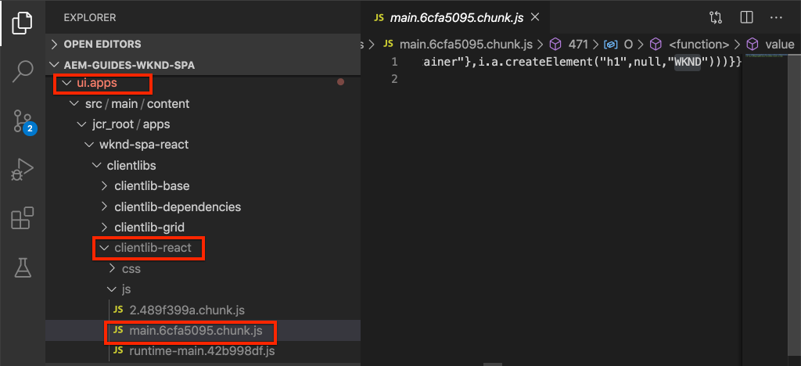
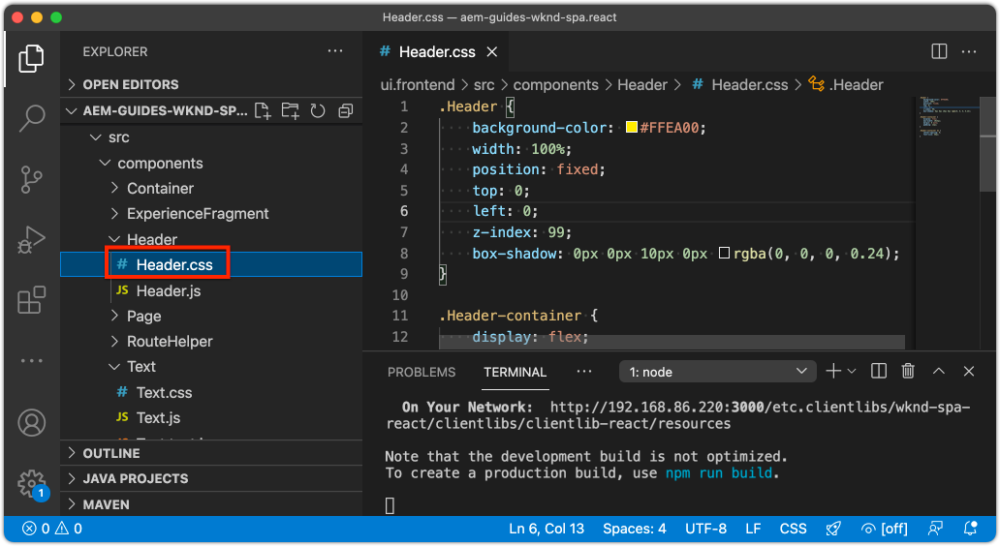

# Intégrer une SPA {#developer-workflow}

Découvrez comment le code source d’une application monopage écrite dans React peut être intégré à un projet Adobe Experience Manager (AEM). Découvrez comment utiliser des outils front-end modernes, tels qu’un serveur de développement Webpack, pour développer rapidement la SPA par rapport à l’API de modèle JSON AEM.

## Objectif

1. Découvrez comment le projet SPA est intégré à AEM avec les bibliothèques côté client.
2. Découvrez comment utiliser un serveur de développement Webpack pour le développement front-end dédié.
3. Explorez l’utilisation d’un **proxy** et d’un fichier statique **simulé** pour le développement par rapport à l’API de modèle JSON AEM.

## Ce que vous allez créer

Dans ce chapitre, vous allez apporter plusieurs petites modifications à la SPA afin de comprendre comment elle est intégrée à AEM.
Ce chapitre ajoute un simple composant `Header` à la SPA. Au cours de la création de ce composant **statique** `Header`, plusieurs approches sont utilisées pour le développement de la SPA d’AEM.


*La SPA est étendue pour ajouter un composant `Header` statique*.

## Prérequis

Examinez les outils et les instructions requis pour configurer un [environnement de développement local](overview.md#local-dev-environment). Ce chapitre est la suite du chapitre [Créer un projet](create-project.md) ; cependant, pour suivre ce processus, vous avez besoin d’un projet AEM viable avec une SPA activée.

## Approche d’intégration {#integration-approach}

Deux modules ont été créés dans le cadre du projet AEM : `ui.apps` et `ui.frontend`.

Le module `ui.frontend` est un projet [webpack](https://webpack.js.org/) qui contient tout le code source de la SPA. La majorité du développement et des tests SPA est effectuée dans le projet Webpack. Lorsqu’une version de production est déclenchée, la SPA est créée et compilée à l’aide de Webpack. Les artefacts compilés (CSS et Javascript) sont copiés dans le module `ui.apps` qui est ensuite déployé sur l’exécution locale d’AEM.


*Représentation de haut niveau de l’intégration SPA.*

Des informations supplémentaires sur la création front-end peuvent être consultées [ici](https://experienceleague.adobe.com/docs/experience-manager-core-components/using/developing/archetype/uifrontend-react.html?lang=fr).

## Inspection de l’intégration SPA {#inspect-spa-integration}

Ensuite, examinez le module `ui.frontend` pour comprendre la SPA qui a été générée automatiquement par l’[archétype de projet AEM](https://experienceleague.adobe.com/docs/experience-manager-core-components/using/developing/archetype/uifrontend-react.html?lang=fr).

1. Dans l’IDE de votre choix, ouvrez votre projet AEM. Ce tutoriel utilisera le [code IDE Visual Studio](https://experienceleague.adobe.com/docs/experience-manager-learn/cloud-service/local-development-environment-set-up/development-tools.html?lang=fr#microsoft-visual-studio-code).

   

1. Développez et examinez le dossier `ui.frontend`. Ouvrez le fichier `ui.frontend/package.json`.

1. Sous les `dependencies`, vous devriez en voir plusieurs en lien avec `react`, y compris `react-scripts`.

   L’`ui.frontend` est une application React basée sur [Créer une application React](https://create-react-app.dev/) (CRA). La version de `react-scripts` indique quelle version de CRA est utilisée.

1. Il existe également plusieurs dépendances dotées du préfixe `@adobe` :

   ```json
   "@adobe/aem-react-editable-components": "~1.1.2",
   "@adobe/aem-spa-component-mapping": "~1.1.0",
   "@adobe/aem-spa-page-model-manager": "~1.3.3",
   "@adobe/aem-core-components-react-base": "1.1.8",
   "@adobe/aem-core-components-react-spa": "1.1.7",
   ```

   Les modules ci-dessus constituent le [SDK JS de l’éditeur de SPA d’AEM](https://experienceleague.adobe.com/docs/experience-manager-65/developing/spas/spa-blueprint.html?lang=fr). Ils fournissent la fonctionnalité permettant de mapper les composants SPA aux composants AEM.

   Vous trouverez également les éléments suivants : [Composants de gestion de contenu web AEM - Mise en oeuvre principale React](https://github.com/adobe/aem-react-core-wcm-components-base) et [Composants de gestion de contenu web AEM - Éditeur de SPA - Mise en oeuvre principale React](https://github.com/adobe/aem-react-core-wcm-components-spa). Il s’agit d’un ensemble de composants réutilisables de l’interface utilisateur qui correspondent aux composants AEM prêts à l’emploi. Ils sont conçus pour être utilisés en l’état. Leur mise en forme répond aux besoins de votre projet.

1. Le fichier `package.json` contient plusieurs `scripts` définis :

   ```json
   "scripts": {
       "start": "react-scripts start",
       "build": "react-scripts build && clientlib",
       "test": "react-scripts test",
       "eject": "react-scripts eject",
   }
   ```

   Il s’agit de scripts de version standard rendus [disponibles](https://create-react-app.dev/docs/available-scripts) par Créer une application React.

   La seule différence est l’ajout de `&& clientlib` au script `build`. Cette instruction supplémentaire est chargée de copier la SPA compilée dans le module `ui.apps` en tant que bibliothèque côté client lors d’une création.

   Le module npm [aem-clientlib-generator](https://github.com/wcm-io-frontend/aem-clientlib-generator) facilite cette opération.

1. Inspectez le fichier `ui.frontend/clientlib.config.js`. Ce fichier de configuration est utilisé par [aem-clientlib-generator](https://github.com/wcm-io-frontend/aem-clientlib-generator#clientlibconfigjs) pour déterminer comment générer la bibliothèque cliente.

1. Inspectez le fichier `ui.frontend/pom.xml`. Ce fichier transforme le dossier `ui.frontend` en un [module Maven](https://maven.apache.org/guides/mini/guide-multiple-modules.html). Le fichier `pom.xml` a été mis à jour pour utiliser le plug-in [frontend-maven-plugin](https://github.com/eirslett/frontend-maven-plugin) pour **tester** et **créer** l’application monopage lors d’une création Maven.

1. Inspectez le fichier `index.js` sous `ui.frontend/src/index.js` :

   ```js
   //ui.frontend/src/index.js
   ...
   document.addEventListener('DOMContentLoaded', () => {
       ModelManager.initialize().then(pageModel => {
           const history = createBrowserHistory();
           render(
           <Router history={history}>
               <App
               history={history}
               cqChildren={pageModel[Constants.CHILDREN_PROP]}
               cqItems={pageModel[Constants.ITEMS_PROP]}
               cqItemsOrder={pageModel[Constants.ITEMS_ORDER_PROP]}
               cqPath={pageModel[Constants.PATH_PROP]}
               locationPathname={window.location.pathname}
               />
           </Router>,
           document.getElementById('spa-root')
           );
       });
   });
   ```

   `index.js` est le point d’entrée de la SPA. `ModelManager` est fourni par le SDK JS de l’éditeur de SPA d’AEM. Il est chargé d’appeler et d’injecter le `pageModel` (le contenu JSON) dans l’application.

1. Inspectez le fichier `import-components.js` à `ui.frontend/src/components/import-components.js`. Ce fichier importe les **Composants principaux de React** prêts à l’emploi et les rend disponibles pour le projet. Le chapitre suivant examine le mappage du contenu AEM aux composants SPA.

## Ajouter un composant SPA statique {#static-spa-component}

Ajoutez ensuite un nouveau composant à la SPA et déployez les modifications sur une instance AEM locale. Il s’agit d’une modification simple, visant simplement à illustrer comment le SPA est mis à jour.

1. Dans le module `ui.frontend`, sous `ui.frontend/src/components`, créez un dossier nommé `Header`.
1. Créez un fichier nommé `Header.js` sous le dossier `Header`.

   

1. Remplissez `Header.js` avec les éléments suivants :

   ```js
   //Header.js
   import React, {Component} from 'react';
   
   export default class Header extends Component {
   
       render() {
           return (
                   <header className="Header">
                       <div className="Header-container">
                           <h1>WKND</h1>
                       </div>
                   </header>
           );
       }
   }
   ```

   Vous trouverez ci-dessus un composant React standard qui génère une chaîne de texte statique.

1. Ouvrez le fichier `ui.frontend/src/App.js`. Il s’agit du point d’entrée de l’application.
1. Appliquez les mises à jour suivantes à `App.js` pour inclure le paramètre `Header` statique :

   ```diff
     import { Page, withModel } from '@adobe/aem-react-editable-components';
     import React from 'react';
   + import Header from './components/Header/Header';
   
     // This component is the application entry point
     class App extends Page {
     render() {
         return (
         <div>
   +       <Header />
            {this.childComponents}
            {this.childPages}
        </div>
   ```

1. Ouvrez un nouveau terminal et accédez au dossier `ui.frontend`, puis exécutez la commande `npm run build` :

   ```shell
   $ cd aem-guides-wknd-spa
   $ cd ui.frontend
   $ npm run build
   ...
   Compiled successfully.
   
   File sizes after gzip:
   
   118.95 KB (-33 B)  build/static/js/2.489f399a.chunk.js
   1.11 KB (+48 B)    build/static/js/main.6cfa5095.chunk.js
   806 B              build/static/js/runtime-main.42b998df.js
   451 B              build/static/css/main.e57bbe8a.chunk.css
   ```

1. Accédez au dossier `ui.apps`. Sous `ui.apps/src/main/content/jcr_root/apps/wknd-spa-react/clientlibs/clientlib-react`, vous devriez constater que les fichiers SPA compilés ont été copiés à partir du dossier `ui.frontend/build`.

   

1. Retournez dans le terminal et accédez au dossier `ui.apps`. Exécutez la commande Maven suivante :

   ```shell
   $ cd ../ui.apps
   $ mvn clean install -PautoInstallPackage
   ...
   [INFO] ------------------------------------------------------------------------
   [INFO] BUILD SUCCESS
   [INFO] ------------------------------------------------------------------------
   [INFO] Total time:  9.629 s
   [INFO] Finished at: 2020-05-04T17:48:07-07:00
   [INFO] ------------------------------------------------------------------------
   ```

   Vous déployez ainsi le package `ui.apps` vers une instance d’exécution locale d’AEM.

1. Ouvrez un onglet de navigateur et accédez à [http://localhost:4502/editor.html/content/wknd-spa-react/us/en/home.html](http://localhost:4502/editor.html/content/wknd-spa-react/us/en/home.html). Vous devriez maintenant voir le contenu du composant `Header` affiché dans le SPA.

   

   Les étapes ci-dessus sont exécutées automatiquement lors du déclenchement d’une version Maven à partir de la racine du projet (c’est-à-dire `mvn clean install -PautoInstallSinglePackage`). Vous devez maintenant comprendre les principes de base de l’intégration entre les bibliothèques SPA et AEM côté client. Notez que vous pouvez toujours modifier et ajouter des composants `Text` dans AEM, sous le composant `Header` statique.

## Serveur de développement Webpack - Proxy de l’API JSON {#proxy-json}

Comme vous l’avez vu dans les exercices précédents, l’exécution d’une version et la synchronisation de la bibliothèque cliente avec une instance locale d’AEM prend quelques minutes. Cela est acceptable pour les tests finaux, mais n’est pas idéal pour la majorité du développement SPA.

Un [webpack-dev-server](https://webpack.js.org/configuration/dev-server/) peut être utilisé pour développer rapidement la SPA. La SPA est pilotée par un modèle JSON généré par AEM. Dans cet exercice, le contenu JSON d’une instance AEM en cours d’exécution fait l’objet d’un **proxy** dans le serveur de développement.

1. Revenez à l’IDE et ouvrez le fichier `ui.frontend/package.json`.

   Recherchez une ligne comme celle-ci :

   ```json
   "proxy": "http://localhost:4502",
   ```

   [Créer une application React](https://create-react-app.dev/docs/proxying-api-requests-in-development) fournit un mécanisme facile pour traiter les requêtes d’API en tant que proxy. Toutes les requêtes inconnues sont traitées par proxy via `localhost:4502`, le démarrage rapide local AEM.

1. Ouvrez une fenêtre de terminal et accédez au dossier `ui.frontend`. Exécutez la commande `npm start` :

   ```shell
   $ cd ui.frontend
   $ npm start
   ...
   Compiled successfully!
   
   You can now view wknd-spa-react in the browser.
   
   Local:            http://localhost:3000
   On Your Network:  http://192.168.86.136:3000
   
   Note that the development build is not optimized.
   To create a production build, use npm run build.
   ```

1. Ouvrez un nouvel onglet du navigateur (s’il n’est pas déjà ouvert) et accédez à [http://localhost:3000/content/wknd-spa-react/us/en/home.html](http://localhost:3000/content/wknd-spa-react/us/en/home.html).

   

   Vous devriez voir le même contenu que dans AEM, mais sans aucune fonctionnalité de création activée.

   >[!NOTE]
   >
   > En raison des exigences de sécurité d’AEM, vous devrez vous connecter à l’instance AEM locale (http://localhost:4502) dans le même navigateur, mais dans un autre onglet.

1. Revenez à l’IDE et créez un fichier nommé `Header.css` dans le dossier `src/components/Header`.
1. Remplissez le `Header.css` avec les éléments suivants :

   ```css
   .Header {
       background-color: #FFEA00;
       width: 100%;
       position: fixed;
       top: 0;
       left: 0;
       z-index: 99;
       box-shadow: 0px 0px 10px 0px rgba(0, 0, 0, 0.24);
   }
   
   .Header-container {
       display: flex;
       max-width: 1024px;
       margin: 0 auto;
       padding: 12px;
   }
   
   .Header-container h1 {
       letter-spacing: 0;
       font-size: 48px;
   }
   ```

   

1. Rouvrez `Header.js` et ajoutez la ligne suivante pour référencer `Header.css` :

   ```diff
     //Header.js
     import React, {Component} from 'react';
   + require('./Header.css');
   ```

   Enregistrez les modifications.

1. Accédez à [http://localhost:3000/content/wknd-spa-react/us/en/home.html](http://localhost:3000/content/wknd-spa-react/us/en/home.html) pour que les modifications de style soient automatiquement répercutées.

1. Ouvrez le fichier `Page.css` dans `ui.frontend/src/components/Page`. Apportez les modifications suivantes pour résoudre la marge intérieure :

   ```css
   .page {
     max-width: 1024px;
     margin: 0 auto;
     padding: 12px;
     padding-top: 50px;
   }
   ```

1. Revenez au navigateur à l’adresse [http://localhost:3000/content/wknd-spa-react/us/en/home.html](http://localhost:3000/content/wknd-spa-react/us/en/home.html). Les modifications apportées à l’application devraient immédiatement être répercutées.

   

   Vous pouvez continuer à effectuer des mises à jour de contenu dans AEM et les voir répercutées dans **webpack-dev-server**, car nous effectuons un proxy sur le contenu.

1. Arrêtez le serveur de développement Webpack avec `ctrl+c` dans le terminal.

## Déployer les mises à jour de la SPA vers AEM

Les modifications apportées à l’`Header` sont actuellement visibles uniquement par l’intermédiaire du **webpack-dev-server**. Déployez la SPA mise à jour vers AEM pour afficher les modifications.

1. Accédez à la racine du projet (`aem-guides-wknd-spa`) et déployez le projet vers AEM à l’aide de Maven :

   ```shell
   $ cd ..
   $ mvn clean install -PautoInstallSinglePackage
   ```

2. Accédez à [http://localhost:4502/editor.html/content/wknd-spa-react/us/en/home.html](http://localhost:4502/editor.html/content/wknd-spa-react/us/en/home.html). Vous devriez constater que l’`Header` et les styles mis à jour ont été appliqués.

   

   Maintenant que la SPA mise à jour est dans AEM, vous pouvez reprendre la création.

## Félicitations. {#congratulations}

Félicitations, vous avez mis à jour la SPA et exploré l’intégration avec AEM. Vous savez maintenant comment développer la SPA par rapport à l’API de modèle JSON AEM à l’aide d’un **webpack-dev-server**.

### Étapes suivantes {#next-steps}

[Mappage des composants SPA aux composants AEM](map-components.md) - Découvrez comment mapper les composants React aux composants Adobe Experience Manager (AEM) avec le SDK JS de l’éditeur de SPA AEM. Le mappage de composants permet aux utilisateurs et utilisatrices d’effectuer des mises à jour dynamiques sur les composants de la SPA dans l’éditeur de SPA AEM, comme pour la création AEM traditionnelle.

## (Bonus) Serveur de développement Webpack - API JSON simulée {#mock-json}

Une autre méthode de développement rapide consiste à utiliser un fichier JSON statique pour qu’il agisse comme modèle JSON. En « simulant » le JSON, nous supprimons la dépendance à une instance AEM locale. Il permet également à un développeur ou une développeuse front-end de mettre à jour le modèle JSON afin de tester la fonctionnalité et d’apporter des modifications à l’API JSON qui seront ensuite implémentées par un développeur ou une développeuse back-end.

La configuration initiale du JSON simulé **nécessite une instance AEM locale**.

1. Revenez à l’IDE, accédez à `ui.frontend/public` et ajoutez un nouveau dossier nommé `mock-content`.
1. Créez un fichier nommé `mock.model.json` sous `ui.frontend/public/mock-content`.
1. Dans le navigateur, accédez à [http://localhost:4502/content/wknd-spa-react/us/en.model.json](http://localhost:4502/content/wknd-spa-react/us/en.model.json).

   Il s’agit du fichier JSON exporté par AEM qui dirige l’application. Copiez la sortie JSON.

1. Collez la sortie JSON de l’étape précédente dans le fichier `mock.model.json`.

   

1. Ouvrez le fichier `index.html` dans `ui.frontend/public/index.html`. Mettez à jour la propriété de métadonnées du modèle de page AEM pour qu’elle pointe vers une variable `%REACT_APP_PAGE_MODEL_PATH%` :

   ```html
       <!-- AEM page model -->
       <meta
          property="cq:pagemodel_root_url"
          content="%REACT_APP_PAGE_MODEL_PATH%"
       />
   ```

   L’utilisation d’une variable pour la valeur du `cq:pagemodel_root_url` facilite le changement entre le proxy et le modèle JSON simulé.

1. Ouvrez le fichier `ui.frontend/.env.development` et effectuez les mises à jour suivantes pour mettre en commentaire la valeur précédente pour `REACT_APP_PAGE_MODEL_PATH` et `REACT_APP_API_HOST` :

   ```diff
   + PUBLIC_URL=/
   - PUBLIC_URL=/etc.clientlibs/wknd-spa-react/clientlibs/clientlib-react/resources
   
   - REACT_APP_PAGE_MODEL_PATH=/content/wknd-spa-react/us/en.model.json
   + REACT_APP_PAGE_MODEL_PATH=/mock-content/mock.model.json
   
   - REACT_APP_API_HOST=http://localhost:4502
   + #REACT_APP_API_HOST=http://localhost:4502
   
   REACT_APP_ROOT=/content/wknd-spa-react/us/en/home.html
   ```

1. En cas d’exécution, arrêtez le **webpack-dev-server**. Démarrez le **webpack-dev-server** depuis le terminal :

   ```shell
   $ cd ui.frontend
   $ npm start
   ```

   Accédez à [http://localhost:3000/content/wknd-spa-react/us/en/home.html](http://localhost:3000/content/wknd-spa-react/us/en/home.html) et vous devriez voir la SPA avec le même contenu utilisé dans le **proxy** JSON.

1. Apportez une petite modification au fichier `mock.model.json` créé précédemment. Vous devriez voir immédiatement la mise à jour du contenu dans le **webpack-dev-server**.

   

Être en mesure de manipuler le modèle JSON et de voir les effets sur une SPA active peut aider un développeur ou une développeuse à comprendre l’API du modèle JSON. Cela permet également le développement front-end et back-end en parallèle.

Vous pouvez désormais activer où utiliser le contenu JSON en appuyant sur les boutons (bascule) des entrées dans le fichier `env.development` :

```plain
# JSON API via proxy to AEM
#REACT_APP_PAGE_MODEL_PATH=/content/wknd-spa-react/us/en.model.json
#REACT_APP_API_HOST=http://localhost:4502

# JSON API via static mock file
REACT_APP_PAGE_MODEL_PATH=/mock-content/mock.model.json
```
