# Mapper des composants SPA aux composants AEM {#map-components}

Découvrez comment mapper les composants React aux composants Adobe Experience Manager (AEM) avec le SDK JS de l’éditeur AEM. Le mappage de composants permet aux utilisateurs et utilisatrices d’effectuer des mises à jour dynamiques sur les composants de la SPA dans l’éditeur de SPA AEM, comme pour la création AEM traditionnelle.

Ce chapitre aborde plus en détail l’API de modèle JSON AEM et la manière dont le contenu JSON exposé par un composant AEM peut être automatiquement injecté dans un composant React sous la forme de props.

## Objectif

1. Découvrez comment mapper des composants AEM aux composants SPA.
1. Examinez la manière dont un composant React utilise les propriétés dynamiques transmises à partir d’AEM.
1. Découvrez comment utiliser [des composants principaux React AEM](https://github.com/adobe/aem-react-core-wcm-components-examples) prêts à l’emploi.

## Ce que vous allez créer

Ce chapitre examine la manière dont le composant SPA `Text` fourni est mappé au composant `Text` AEM. Les composants principaux React tels que les composants SPA `Image` sont utilisés dans la SPA et créés dans AEM. Les fonctionnalités prêtes à l’emploi du **conteneur de disposition** et des politiques de l&#39;**éditeur de modèles** peuvent également être utilisées pour créer une vue un peu plus variée au niveau de l’aspect.

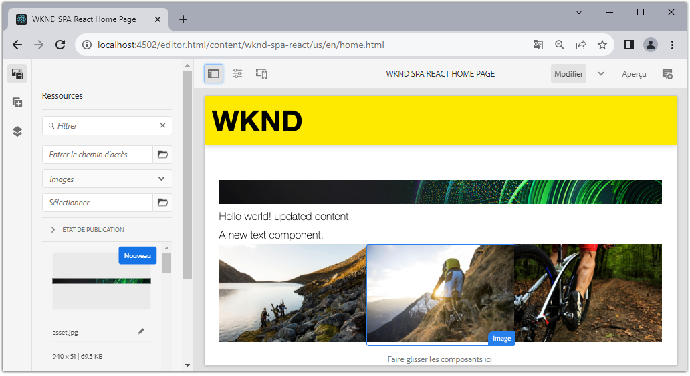

## Prérequis

Passez en revue les outils obligatoires et les instructions pour configurer un [environnement de développement local](overview.md#local-dev-environment). Ce chapitre est la suite du chapitre [Intégrer la SPA](integrate-spa.md), toutefois, pour suivre ce processus, vous avez besoin d’un projet AEM activé SPA.

## Approche de mappage

Le concept de base consiste à mapper un composant SPA à un composant AEM. Les composants AEM, exécutés côté serveur, exportent du contenu dans le cadre de l’API de modèle JSON. Le contenu JSON est utilisé par la SPA, et s’exécute côté client dans le navigateur. Un mappage 1:1 entre les composants SPA et un composant AEM est créé.

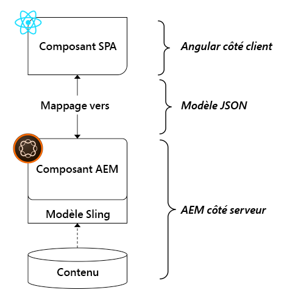

*Présentation générale du mappage d’un composant AEM à un composant React*

## Examinez le composant Texte

L’[Archétype de projet AEM](https://github.com/adobe/aem-project-archetype) fournit un composant `Text` qui est mappé au [composant de texte](https://experienceleague.adobe.com/docs/experience-manager-core-components/using/components/text.html?lang=fr) d’AEM. Il s’agit d’un exemple de **contenu** du composant, dans la mesure où il restitue le *contenu* d’AEM.

Voyons comment fonctionne le composant.

### Examen du modèle JSON

1. Avant de passer au code SPA, il est important de comprendre le modèle JSON fourni par AEM. Accédez à la [bibliothèque de composants principaux](https://www.aemcomponents.dev/content/core-components-examples/library/core-content/text.html) et affichez la page du composant de texte. La bibliothèque des composants principaux fournit des exemples de tous les composants principaux AEM.
1. Sélectionnez l’onglet **JSON** pour l’un des exemples :

   

   Vous devriez voir trois propriétés : `text`, `richText` et `:type`.

   `:type` est une propriété réservée qui répertorie le `sling:resourceType` (ou chemin d’accès) du composant AEM. La valeur de `:type` est utilisée pour mapper le composant AEM au composant SPA.

   `text` et `richText` sont des propriétés supplémentaires qui sont exposées au composant SPA.

1. Affichez la sortie JSON à l’adresse [http://localhost:4502/content/wknd-spa-react/us/en.model.json](http://localhost:4502/content/wknd-spa-react/us/en.model.json). Vous devriez pouvoir trouver une entrée similaire à :

   ```json
   "text": {
       "id": "text-a647cec03a",
       "text": "<p>Hello World! Updated content!</p>\r\n",
       "richText": true,
       ":type": "wknd-spa-react/components/text",
       "dataLayer": {}
      }
   ```

### Inspecter le composant SPA texte

1. Dans l’IDE de votre choix, ouvrez le projet AEM pour la SPA. Développez le module `ui.frontend` et ouvrez le fichier `Text.js` sous `ui.frontend/src/components/Text/Text.js`.

1. La première zone que nous allons inspecter est la `class Text` à la ligne 40 :

   ```js
   class Text extends Component {
   
       get richTextContent() {
           return (<div
                   id={extractModelId(this.props.cqPath)}
                   data-rte-editelement
                   dangerouslySetInnerHTML={{__html: DOMPurify.sanitize(this.props.text)}} />
                   );
       }
   
       get textContent() {
           return <div>{this.props.text}</div>;
       }
   
       render() {
           return this.props.richText ? this.richTextContent : this.textContent;
       }
   }
   ```

   `Text` est un composant standard React. Le composant utilise `this.props.richText` pour déterminer si le contenu à rendre sera du texte enrichi ou du texte brut. Le « contenu » réel utilisé provient de `this.props.text`.

   Pour éviter une attaque XSS potentielle, le texte enrichi est placé dans une séquence d’échappement via `DOMPurify` avant d’utiliser [dangerouslySetInnerHTML](https://reactjs.org/docs/dom-elements.html#dangerouslysetinnerhtml) pour effectuer le rendu du contenu. Rappelez les propriétés `richText` et `text` du modèle JSON plus tôt dans l’exercice.

1. Ensuite, ouvrez `ui.frontend/src/components/import-components.js` jetez un coup d’œil au `TextEditConfig` à la ligne 86 :

   ```js
   const TextEditConfig = {
   emptyLabel: 'Text',
   
       isEmpty: function(props) {
           return !props || !props.text || props.text.trim().length < 1;
       }
   };
   ```

   Le code ci-dessus est chargé de déterminer quand effectuer le rendu de l’espace réservé dans l’environnement de création AEM. Si la méthode `isEmpty` renvoie **true**, l’espace réservé est alors rendu.

1. Enfin, jetez un coup d’œil à l’appel `MapTo` à la ligne 94 :

   ```js
   export default MapTo('wknd-spa-react/components/text')(LazyTextComponent, TextEditConfig);
   ```

   `MapTo` est fourni par le SDK AEM SPA Editor JS (`@adobe/aem-react-editable-components`). Le chemin d’accès `wknd-spa-react/components/text` représente le code `sling:resourceType` du composant AEM. Ce chemin d’accès est mis en correspondance avec le code `:type` exposé par le modèle JSON observé précédemment. `MapTo` prend soin d’analyser la réponse du modèle JSON et de transmettre les valeurs correctes en tant que `props` au composant SPA.

   Vous pouvez trouver la définition du composant `Text` AEM à `ui.apps/src/main/content/jcr_root/apps/wknd-spa-react/components/text`.

## Utiliser les composants principaux React

[Composants de gestion de contenu web AEM - Mise en œuvre des composants principaux React](https://github.com/adobe/aem-react-core-wcm-components-base) et [Composants de gestion de contenu web AEM - Éditeur SPA - Mise en œuvre des composants principaux React](https://github.com/adobe/aem-react-core-wcm-components-spa). Il s’agit d’un ensemble de composants réutilisables de l’interface utilisateur qui correspondent aux composants AEM prêts à l’emploi. La plupart des projets peuvent réutiliser ces composants comme point de départ de leur propre mise en œuvre.

1. Dans le code du projet, ouvrez le fichier `import-components.js` à `ui.frontend/src/components`.
Ce fichier importe tous les composants SPA qui mappent vers les composants AEM. Étant donné la nature dynamique de la mise en œuvre de l’éditeur de SPA, nous devons référencer explicitement tous les composants SPA liés à des composants pouvant faire l’objet d’une création AEM. Cela permet à un créateur ou une créatrice AEM de choisir d’utiliser un composant où il ou elle le souhaite dans l’application.
1. Les instructions d’importation suivantes incluent les composants SPA écrits dans le projet :

   ```js
   import './Page/Page';
   import './Text/Text';
   import './Container/Container';
   import './ExperienceFragment/ExperienceFragment';
   ```

1. Il existe plusieurs autres `imports` de `@adobe/aem-core-components-react-spa` et `@adobe/aem-core-components-react-base`. Ceux-ci importent les composants principaux React et les rendent disponibles dans le projet actuel. Ils sont ensuite mappés à des composants AEM spécifiques au projet à l’aide du code `MapTo`, comme avec l’exemple de composant `Text` précédent.

### Mettre à jour les politiques AEM

Les politiques sont une fonctionnalité des modèles AEM qui permet aux développeurs et aux utilisateurs et utilisatrices d’exercer un contrôle granulaire sur les composants disponibles pour être utilisés. Les composants principaux React sont inclus dans le code SPA mais doivent être activés via une politique avant de pouvoir être utilisés dans l’application.

1. Dans l’écran de démarrage AEM, accédez à **Outils** > **Modèles** > **[WKND SPA React](http://localhost:4502/libs/wcm/core/content/sites/templates.html/conf/wknd-spa-react)**.

1. Sélectionnez et ouvrez le modèle **Page SPA** à modifier.

1. Sélectionnez le **conteneur de disposition** et cliquez sur son icône **politique** pour modifier la politique :

   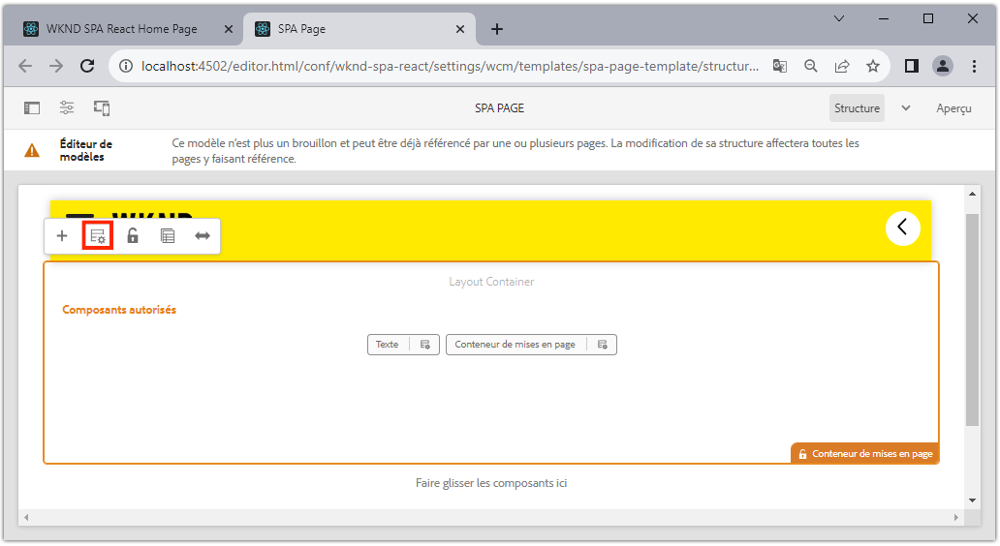

1. Sous **Composants autorisés** > **WKND SPA React - Contenu** > vérifiez **Image**, **Teaser**, et **Titre**.

   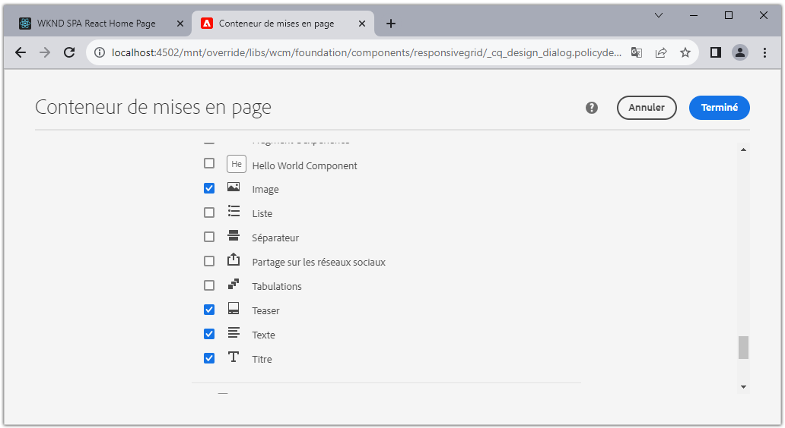

   Sous **Composants par défaut** > **Ajouter un mappage** et sélectionnez le composant **Image : WKND SPA React - Contenu** :

   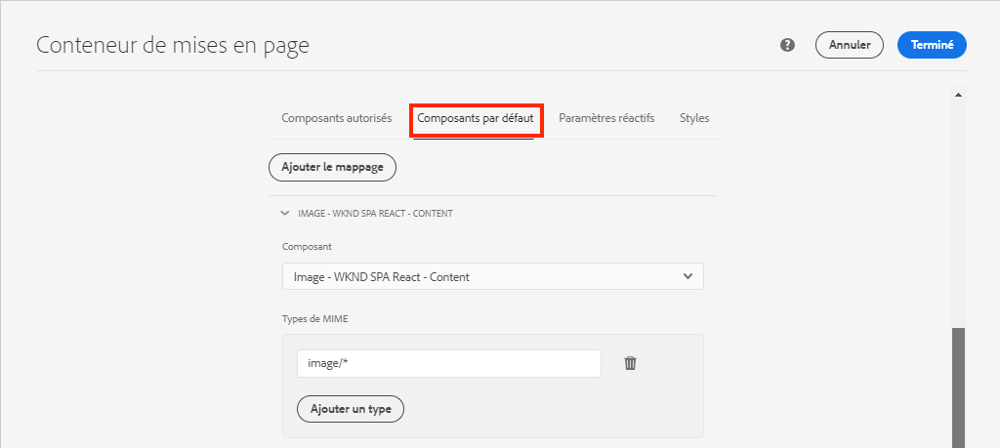

   Saisissez un **type MIME** d’`image/*`.

   Cliquez sur **Terminé** pour enregistrer les mises à jour des politiques.

1. Dans le **Conteneur de disposition**, cliquez sur l’icône **politique** pour le composant **Texte**.

   Créez une politique nommée **WKND SPA Text**. Sous **Plugins** > **Formatage**, cochez toutes les cases pour activer des options de formatage supplémentaires :

   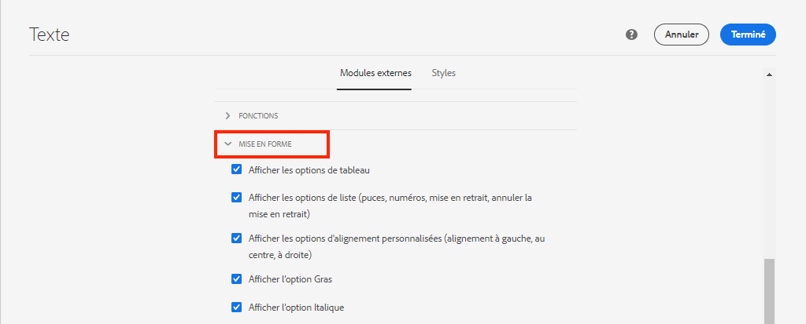

   Sous **Plugins** > **Styles de paragraphe**, cochez la case pour **activer les styles de paragraphe** :

   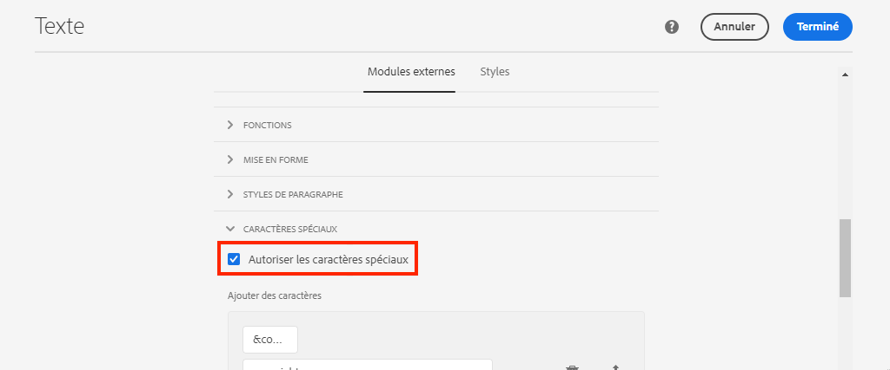

   Cliquez sur **Terminé** pour enregistrer la mise à jour de la politique.

### Créer du contenu

1. Accédez à la **page d’accueil** [http://localhost:4502/editor.html/content/wknd-spa-react/us/en/home.html](http://localhost:4502/editor.html/content/wknd-spa-react/us/en/home.html).

1. Vous devriez maintenant pouvoir utiliser les composants supplémentaires **Image**, **Teaser** et **Titre** sur la page.

   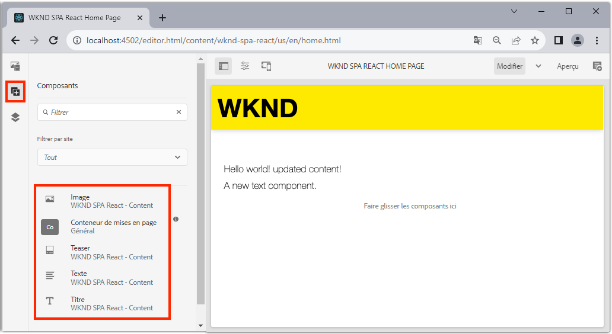

1. Vous devriez également pouvoir modifier le composant `Text` et ajouter des styles de paragraphe supplémentaires en mode **plein écran**.

   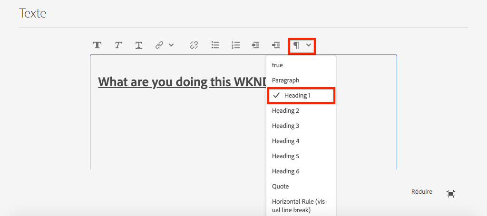

1. Vous pouvez aussi glisser et déposer une image à partir de l’**Outil de recherche de ressources** :

   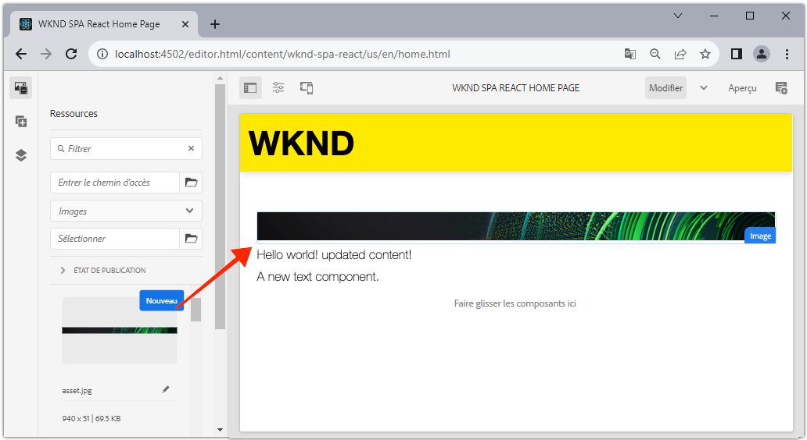

1. Testez les composants **Titre** et **Teaser**.

1. Ajoutez vos propres images via [AEM Assets](http://localhost:4502/assets.html/content/dam) ou installez la base de code terminée pour la norme [Site de référence WKND](https://github.com/adobe/aem-guides-wknd/releases/latest). Le [site de référence WKND](https://github.com/adobe/aem-guides-wknd/releases/latest) inclut de nombreuses images qui peuvent être réutilisées sur la SPA WKND. Le package peut être installé à l’aide du [gestionnaire de packages d’AEM](http://localhost:4502/crx/packmgr/index.jsp).

   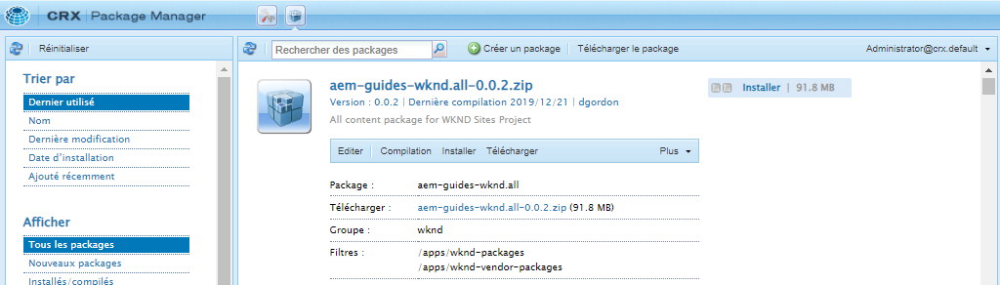

## Inspecter le conteneur de disposition

La prise en charge du **Conteneur de disposition** est automatiquement fournie par le SDK de l’éditeur de SPA d’AEM. Le **conteneur de disposition**, comme son nom l’indique, est un composant de **conteneur**. Les composants de conteneur sont des composants qui acceptent les structures JSON qui représentent *d’autres* composants et qui les instancient de manière dynamique.

Examinons davantage le conteneur de dispositions.

1. Dans un navigateur, accédez à [http://localhost:4502/content/wknd-spa-react/us/en.model.json](http://localhost:4502/content/wknd-spa-react/us/en.model.json)

   

   Le composant de **conteneur de disposition** comporte un `sling:resourceType` de `wcm/foundation/components/responsivegrid` et est reconnu par l’éditeur de SPA avec la propriété `:type`, comme les composants `Text` et `Image`.

   Les mêmes fonctionnalités de redimensionnement d’un composant à l’aide du [mode de disposition](https://experienceleague.adobe.com/docs/experience-manager-65/authoring/siteandpage/responsive-layout.html#defining-layouts-layout-mode) sont disponibles avec l’éditeur de SPA.

2. Revenez sur [http://localhost:4502/editor.html/content/wknd-spa-react/us/en/home.html](http://localhost:4502/editor.html/content/wknd-spa-react/us/en/home.html). Ajoutez d’autres composants **Image** et essayez de les redimensionner à l’aide de l’option **Disposition** :

   

3. Rouvrez le modèle JSON [http://localhost:4502/content/wknd-spa-react/us/en.model.json](http://localhost:4502/content/wknd-spa-react/us/en.model.json) et observez les `columnClassNames` dans le fichier JSON :

   

   Le nom de la classe `aem-GridColumn--default--4` indique que le composant doit comporter 4 colonnes en largeur sur une grille de 12 colonnes. Vous trouverez davantage d’informations sur la [grille réactive ici](https://adobe-marketing-cloud.github.io/aem-responsivegrid/).

4. Revenez à l’IDE et dans le module `ui.apps`, il existe une bibliothèque côté client définie à l’adresse `ui.apps/src/main/content/jcr_root/apps/wknd-spa-react/clientlibs/clientlib-grid`. Ouvrez le fichier `less/grid.less`.

   Ce fichier détermine les points d’arrêt (`default`, `tablet`, et `phone`) utilisés par le **conteneur de disposition**. Ce fichier est conçu pour être personnalisé selon les spécifications du projet. Actuellement, les points d’arrêt sont définis sur `1200px` et `768px`.

5. Vous devez pouvoir utiliser les capacités réactives et les stratégies de texte enrichi mises à jour du composant `Text` pour créer une vue de ce type :

   

## Félicitations ! {#congratulations}

Félicitations, vous avez appris à mapper des composants SPA à des composants AEM, et vous avez utilisé des composants principaux React. Vous avez également eu la possibilité d’explorer les fonctionnalités réactives du **conteneur de disposition**.

### Étapes suivantes {#next-steps}

[Navigation et routage](navigation-routing.md) : découvrez comment plusieurs vues de la SPA peuvent être prises en charge en mappant aux pages AEM avec le SDK de l’éditeur de SPA. La navigation dynamique est mise en œuvre à l’aide des composants principaux React et React Router.

## (Bonus) Conserver les configurations pour le contrôle de code source {#bonus-configs}

Dans de nombreux cas, en particulier au début d’un projet AEM, il est utile de conserver les configurations, comme les modèles et les politiques de contenu associées, pour le contrôle de code source. Cela garantit que tous les développeurs et développeuses travaillent sur le même ensemble de contenu et de configurations et peut garantir une cohérence supplémentaire entre les environnements. Une fois qu’un projet atteint un certain niveau de maturité, la gestion des modèles peut être transmise à un groupe spécial d’utilisateurs et utilisatrices expérimentés.

Les étapes suivantes se dérouleront à l’aide de l’IDE Visual Studio Code et [VSCode AEM Sync](https://marketplace.visualstudio.com/items?itemName=yamato-ltd.vscode-aem-sync) mais il est possible d’utiliser n’importe quel outil et IDE que vous avez configuré pour **extraire** ou **importer** du contenu d’une instance locale d’AEM.

1. Dans l’IDE Visual Studio Code, assurez-vous que **VSCode AEM Sync** est installé via l’extension Marketplace :

   

2. Développez le module **ui.content** dans l’explorateur de projets et accédez à `/conf/wknd-spa-react/settings/wcm/templates`.

3. Faites un **Clic droit** sur le dossier `templates` et sélectionnez **Importer depuis le serveur AEM** :

   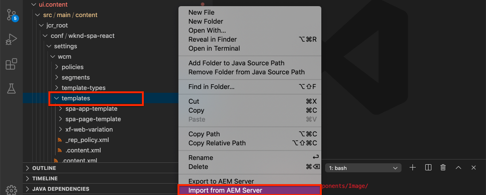

4. Répétez les étapes pour importer du contenu, mais sélectionnez le dossier **stratégies** situé à l’emplacement `/conf/wknd-spa-react/settings/wcm/templates/policies`.

5. Examinez le `filter.xml`fichier situé à l’emplacement `ui.content/src/main/content/META-INF/vault/filter.xml`.

   ```xml
   <!--ui.content filter.xml-->
   <?xml version="1.0" encoding="UTF-8"?>
    <workspaceFilter version="1.0">
        <filter root="/conf/wknd-spa-react" mode="merge"/>
        <filter root="/content/wknd-spa-react" mode="merge"/>
        <filter root="/content/dam/wknd-spa-react" mode="merge"/>
        <filter root="/content/experience-fragments/wknd-spa-react" mode="merge"/>
    </workspaceFilter>
   ```

   Le fichier `filter.xml` doit identifier les chemins d’accès des nœuds installés avec le package. Remarquez l’élément `mode="merge"` sur chacun des filtres qui indique que le contenu existant ne sera pas modifié et que seul du nouveau contenu est ajouté. Étant donné que les personnes créatrices de contenu peuvent mettre à jour ces chemins, il est important qu’un déploiement de code **ne remplace pas** le contenu. Voir la [Documentation FileVault](https://jackrabbit.apache.org/filevault/filter.html) pour plus d’informations sur l’utilisation des éléments de filtre.

   Comparez `ui.content/src/main/content/META-INF/vault/filter.xml` et `ui.apps/src/main/content/META-INF/vault/filter.xml` pour comprendre les différents nœuds gérés par chaque module.

## (bonus) Créer un composant d’image personnalisé {#bonus-image}

Un composant d’image SPA a déjà été fourni par les composants principaux React. Cependant, si vous souhaitez une pratique supplémentaire, créez votre propre mise en œuvre React qui mappe au [Composant d’image](https://experienceleague.adobe.com/docs/experience-manager-core-components/using/components/image.html?lang=fr) AEM. Le composant `Image` est un autre exemple de composant **de contenu**.

### Examiner le JSON

Avant de vous lancer dans le code SPA, examinez le modèle JSON fourni par AEM.

1. Accédez aux [exemples d’images dans la bibliothèque de composants principaux](https://www.aemcomponents.dev/content/core-components-examples/library/core-content/image.html).

   

   Les propriétés de `src`, `alt` et `title` sont utilisées pour remplir le composant SPA d’`Image`.

   >[!NOTE]
   >
   > D’autres propriétés d’image sont exposées (`lazyEnabled`, `widths`) et permettent à un développeur ou à une développeuse de créer un composant de chargement adaptatif et différé. Le composant créé dans ce tutoriel est simple et n’utilise **pas** ces propriétés avancées.

### Mettre en œuvre le composant d’image

1. Créez ensuite un nouveau dossier nommé `Image` sous `ui.frontend/src/components`.
1. Sous le dossier `Image`, créez un nouveau fichier nommé `Image.js`.

   

1. Ajoutez les instructions `import` suivantes à `Image.js` :

   ```js
   import React, {Component} from 'react';
   import {MapTo} from '@adobe/aem-react-editable-components';
   ```

1. Ajoutez ensuite le `ImageEditConfig` pour déterminer quand afficher l’espace réservé dans AEM :

   ```js
   export const ImageEditConfig = {
   
       emptyLabel: 'Image',
   
       isEmpty: function(props) {
           return !props || !props.src || props.src.trim().length < 1;
       }
   };
   ```

   L’espace réservé affiche si la propriété `src` n’est pas définie.

1. Implémentez ensuite la classe `Image` :

   ```js
    export default class Image extends Component {
   
       get content() {
           return ;
       }
   
       render() {
           if(ImageEditConfig.isEmpty(this.props)) {
               return null;
           }
   
           return (
                   <div className="Image">
                       {this.content}
                   </div>
           );
       }
   }
   ```

   Le code ci-dessus génère un `` en fonction des propriétés `src`, `alt` et `title` transmises par le modèle JSON.

1. Ajoutez le code `MapTo` pour mapper le composant React au composant AEM :

   ```js
   MapTo('wknd-spa-react/components/image')(Image, ImageEditConfig);
   ```

   Notez bien que la chaîne `wknd-spa-react/components/image` correspond à l’emplacement du composant AEM dans `ui.apps` à : `ui.apps/src/main/content/jcr_root/apps/wknd-spa-react/components/image`.

1. Créez un nouveau fichier nommé `Image.css` dans le même répertoire et ajoutez les éléments suivants :

   ```scss
   .Image-src {
       margin: 1rem 0;
       width: 100%;
       border: 0;
   }
   ```

1. Dans `Image.js`, ajoutez une référence au fichier dans la partie supérieure et sous les instructions `import` :

   ```js
   import React, {Component} from 'react';
   import {MapTo} from '@adobe/aem-react-editable-components';
   
   require('./Image.css');
   ```

1. Ouvrez le le fichier `ui.frontend/src/components/import-components.js` et ajoutez une référence au nouveau composant `Image` :

   ```js
   import './Page/Page';
   import './Text/Text';
   import './Container/Container';
   import './ExperienceFragment/ExperienceFragment';
   import './Image/Image'; //add reference to Image component
   ```

1. Dans `import-components.js`, commentez l’image du composant principal React :

   ```js
   //MapTo('wknd-spa-react/components/image')(ImageV2, {isEmpty: ImageV2IsEmptyFn});
   ```

   Cela garantit que notre composant d’image personnalisé est bien utilisé à sa place.

1. À partir de la racine du projet, déployez le code SPA vers AEM à l’aide de Maven :

   ```shell
   $ cd aem-guides-wknd-spa.react
   $ mvn clean install -PautoInstallSinglePackage
   ```

1. Examinez la SPA dans AEM. Les composants d’image de la page doivent continuer à fonctionner. Examinez la sortie générée et vous devriez voir le balisage de notre composant d’image personnalisé au lieu du composant principal React.

   *Balisage du composant d’image personnalisé*

   ```html
   <div class="Image">
       
   </div>
   ```

   *Balisage d’image du composant principal React*

   ```html
   <div class="cmp-image cq-dd-image">
       
   </div>
   ```

   Il s’agit d’une bonne introduction à l’extension et à l’implémentation de vos propres composants.
