# Ajouter la navigation et le routage {#navigation-routing}

Découvrez comment plusieurs vues de la SPA peuvent être prises en charge par un mappage sur les pages AEM avec le SDK de l’éditeur de SPA. La navigation dynamique est mise en œuvre à l’aide des composants principaux React et React Router.

## Objectif

1. Découvrez les options de routage du modèle SPA disponibles lors de l’utilisation de l’éditeur de SPA.
1. Découvrez comment utiliser le [React Router](https://reacttraining.com/react-router/) pour naviguer entre les différentes vues de la SPA.
1. Utilisez les composants principaux React d’AEM pour implémenter une navigation dynamique pilotée par la hiérarchie de pages d’AEM.

## Ce que vous allez créer

Ce chapitre ajoute une navigation à une SPA dans AEM. Le menu de navigation est piloté par la hiérarchie de pages d’AEM et utilise le modèle JSON fourni par le [Composant principal de navigation](https://experienceleague.adobe.com/docs/experience-manager-core-components/using/components/navigation.html?lang=fr).


## Prérequis

Examinez les outils et les instructions nécessaires à la configuration d’un [environnement de développement local](overview.md#local-dev-environment). Ce chapitre est la suite du chapitre [Mapper des composants](map-components.md). Toutefois, vous n’avez besoin pour le suivre que d’un projet AEM compatible avec les SPA déployé sur une instance AEM locale.

## Ajouter la navigation au modèle {#add-navigation-template}

1. Ouvrez un navigateur et connectez-vous à AEM, [http://localhost:4502/](http://localhost:4502/). La base de code de départ doit déjà être déployée.
1. Accédez au **Modèle de page SPA** : [http://localhost:4502/editor.html/conf/wknd-spa-react/settings/wcm/templates/spa-page-template/structure.html](http://localhost:4502/editor.html/conf/wknd-spa-react/settings/wcm/templates/spa-page-template/structure.html).
1. Sélectionnez le **Conteneur de disposition racine** le plus éloigné et cliquez sur son icône **Stratégie**. Veillez à **ne pas** sélectionner le **Conteneur de disposition** déverrouillé pour la création.

   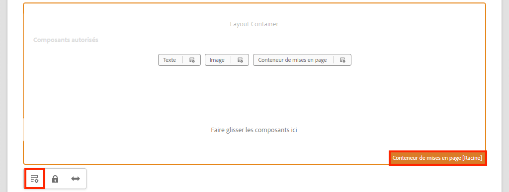

1. Créez une stratégie nommée **Structure SPA** :

   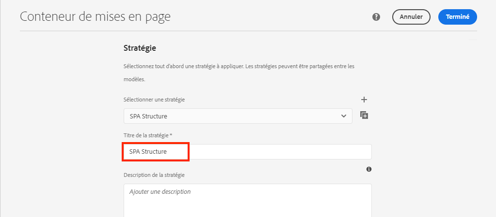

   Sous **Composants autorisés** > **Général**, sélectionnez le composant **Conteneur de disposition**.

   Sous **Composants autorisés** > **SPA REACT WKND - STRUCTURE**, sélectionnez le composant **Navigation** :

   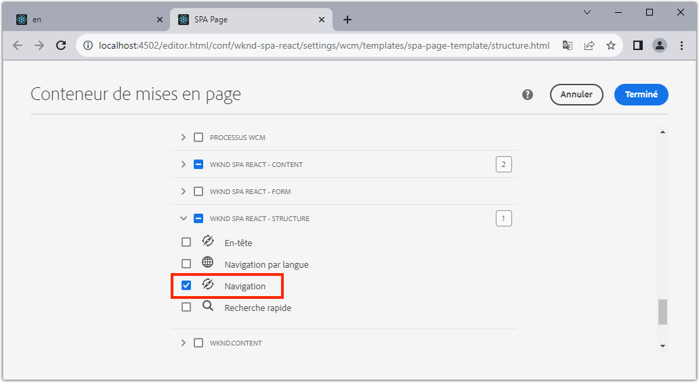

   Sous **Composants autorisés** > **SPA REACT WKND - Contenu**, sélectionnez les composants **Image** et **Texte**. Vous devez avoir sélectionné 4 composants au total.

   Cliquez sur **Terminé** pour enregistrer les modifications.

1. Actualisez la page, puis ajoutez le composant **Navigation** au-dessus du composant déverrouillé **Conteneur de disposition** :

   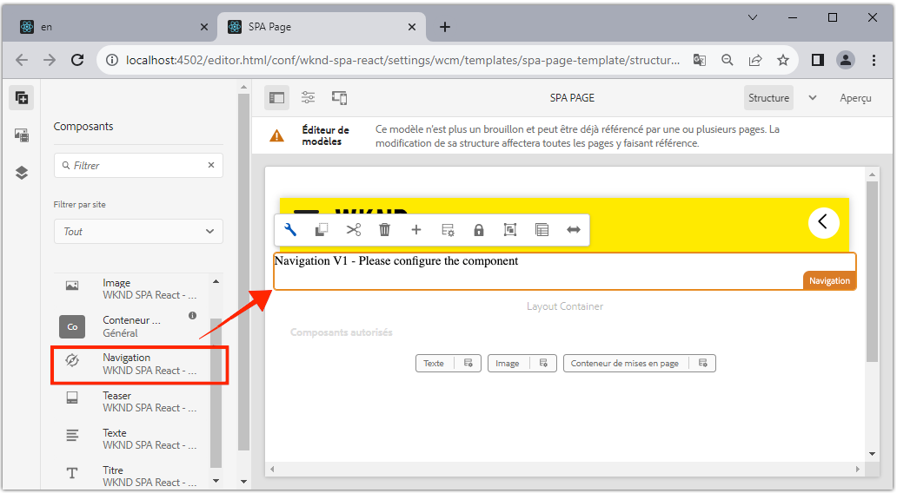

1. Sélectionnez le composant **Navigation** et cliquez sur son icône **Stratégie** pour modifier la stratégie.
1. Créez une stratégie avec pour **Titre de stratégie** **Navigation SPA**.

   Sous les **Propriétés** :

   * Définissez la variable **Racine de navigation** sur `/content/wknd-spa-react/us/en`.
   * Définissez la variable **Exclure les niveaux racine** sur **1**.
   * Décochez **Collecter toutes les pages enfants**.
   * Définissez la variable **Profondeur de la structure de navigation** sur **3**.

   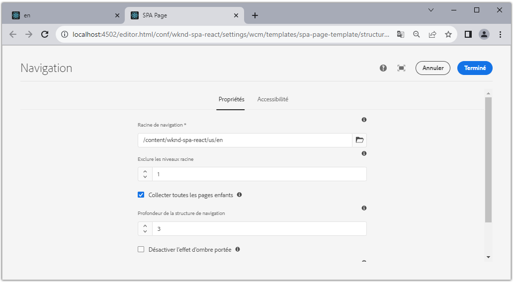

   Vous collectez ainsi la navigation à 2 niveaux de profondeur sous `/content/wknd-spa-react/us/en`.

1. Après avoir enregistré vos modifications, vous devriez voir la valeur `Navigation` renseignée dans le modèle :

   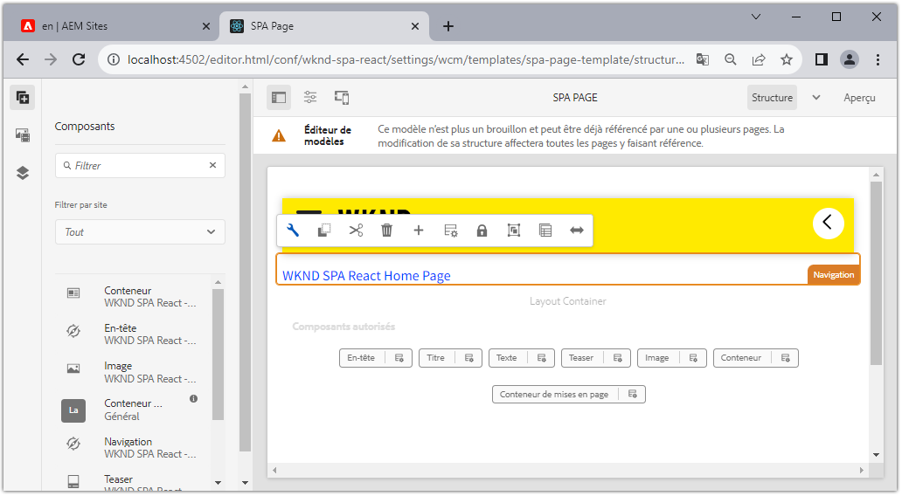

## Créer des pages enfants

Créez ensuite des pages supplémentaires dans AEM qui serviront de vues différentes dans la SPA. Nous examinerons également la structure hiérarchique du modèle JSON fourni par AEM.

1. Accédez à la console **Sites** : [http://localhost:4502/sites.html/content/wknd-spa-react/us/en/home](http://localhost:4502/sites.html/content/wknd-spa-react/us/en/home). Sélectionnez la **Page d’accueil SPA React WKND** et cliquez sur **Créer** > **Page** :

   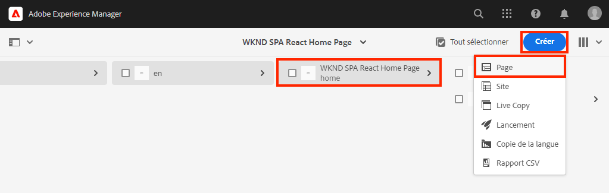

1. Sous **Modèle**, sélectionnez la **Page SPA**. Sous **Propriétés**, saisissez **Page 1** pour le **Titre** et **page-1** comme nom.

   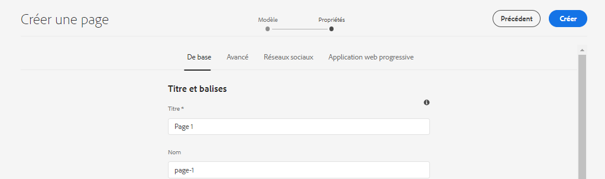

   Cliquez sur **Créer** et, dans la boîte de dialogue contextuelle, cliquez sur **Ouvrir** pour ouvrir la page dans l’éditeur de SPA d’AEM.

1. Ajoutez un nouveau composant **Texte** au **Conteneur de disposition** principal. Modifiez le composant et saisissez le texte : **Page 1** à l’aide de l’éditeur de texte enrichi et de l’élément **H2**.

   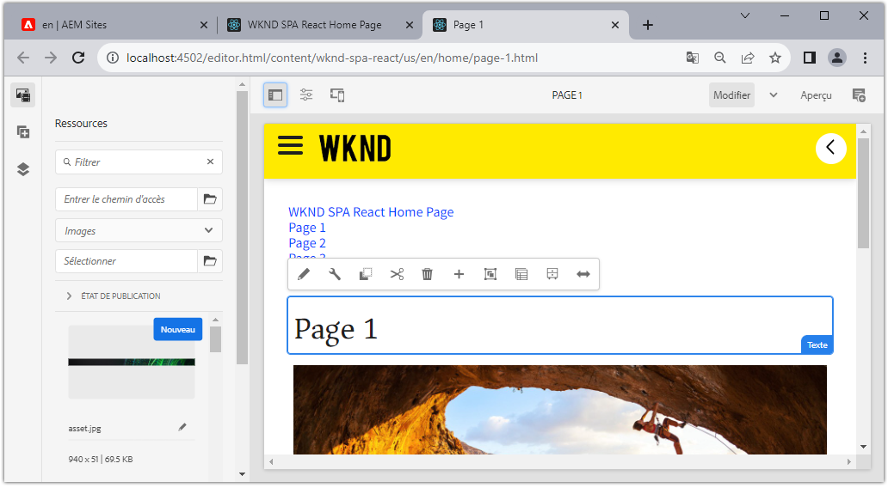

   N’hésitez pas à ajouter du contenu supplémentaire, comme une image.

1. Revenez à la console AEM Sites et répétez les étapes ci-dessus, en créant une seconde page nommée **Page 2** comme sœur de **Page 1**.
1. Enfin, créez une troisième page, **Page 3**, mais en tant qu’**enfant** de la **Page 2**. Une fois la hiérarchie du site terminée, elle doit se présenter comme suit :

   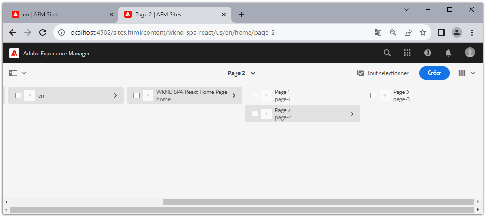

1. Le composant Navigation peut désormais être utilisé pour accéder à différentes zones de la SPA.

   

1. Ouvrez la page en dehors de l’éditeur AEM : [http://localhost:4502/content/wknd-spa-react/us/en/home.html](http://localhost:4502/content/wknd-spa-react/us/en/home.html). Utilisez le composant **Navigation** pour accéder à différentes vues de l’application.

1. Utilisez les outils de développement de votre navigateur pour examiner les requêtes réseau au fur et à mesure de votre navigation. Les captures d’écran ci-dessous sont réalisées à partir du navigateur Google Chrome.

   

   Notez qu’après le chargement initial de la page, la navigation suivante n’entraîne pas une actualisation complète de la page et que le trafic réseau est réduit lors du retour aux pages précédemment visitées.

## Modèle JSON de page de hiérarchie {#hierarchy-page-json-model}

Examinez ensuite le modèle JSON qui anime l’expérience d’affichage multiple de la SPA.

1. Dans un nouvel onglet, ouvrez l’API du modèle JSON fournie par AEM : [http://localhost:4502/content/wknd-spa-react/us/en.model.json](http://localhost:4502/content/wknd-spa-react/us/en.model.json). Il peut se révéler utile d’utiliser une extension de navigateur pour [formater le fichier JSON](https://chrome.google.com/webstore/detail/json-formatter/bcjindcccaagfpapjjmafapmmgkkhgoa).

   Ce contenu JSON est demandé lors du premier chargement de la SPA. La structure extérieure ressemble à ce qui suit :

   ```json
   {
   "language": "en",
   "title": "en",
   "templateName": "spa-app-template",
   "designPath": "/libs/settings/wcm/designs/default",
   "cssClassNames": "spa page basicpage",
   ":type": "wknd-spa-react/components/spa",
   ":items": {},
   ":itemsOrder": [],
   ":hierarchyType": "page",
   ":path": "/content/wknd-spa-react/us/en",
   ":children": {
      "/content/wknd-spa-react/us/en/home": {},
      "/content/wknd-spa-react/us/en/home/page-1": {},
      "/content/wknd-spa-react/us/en/home/page-2": {},
      "/content/wknd-spa-react/us/en/home/page-2/page-3": {}
      }
   }
   ```

   Sous `:children`, vous devriez voir une entrée pour chacune des pages créées. Le contenu de toutes les pages figure dans cette requête JSON initiale. Avec le routage de navigation, les vues suivantes de la SPA sont chargées rapidement, puisque le contenu est déjà disponible côté client.

   Il n’est pas judicieux de charger **TOUT** le contenu d’une SPA dans la requête JSON initiale, car cela ralentirait le chargement initial de la page. Examinons ensuite la manière dont la profondeur de hiérarchie des pages est collectée.

1. Accédez au modèle **Racine SPA** à l’adresse : [http://localhost:4502/editor.html/conf/wknd-spa-react/settings/wcm/templates/spa-app-template/structure.html](http://localhost:4502/editor.html/conf/wknd-spa-react/settings/wcm/templates/spa-app-template/structure.html).

   Cliquez sur **Menu Propriétés de la page** > **Stratégie de la page** :

   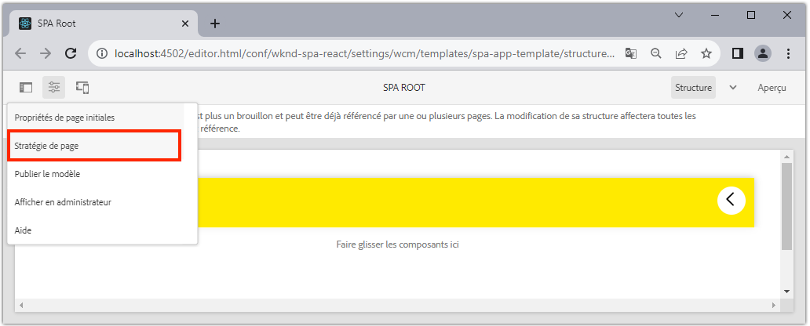

1. Le modèle **Racine SPA** comporte un onglet supplémentaire **Structure hiérarchique**, qui permet de contrôler le contenu JSON collecté. La **Profondeur de structure** détermine la profondeur de la hiérarchie du site permettant de collecter les pages enfants sous la **racine**. Vous pouvez également utiliser le champ **Modèles de structure** pour filtrer les pages supplémentaires en fonction d’une expression régulière.

   Mettez à jour la **Profondeur de structure** en lui attribuant la valeur **2** :

   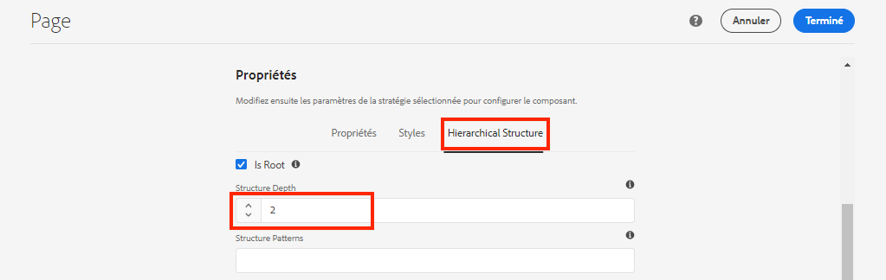

   Cliquez sur **Terminé** pour enregister les modifications de la stratégie.

1. Rouvrez le modèle JSON [http://localhost:4502/content/wknd-spa-react/us/en.model.json](http://localhost:4502/content/wknd-spa-react/us/en.model.json).

   ```json
   {
   "language": "en",
   "title": "en",
   "templateName": "spa-app-template",
   "designPath": "/libs/settings/wcm/designs/default",
   "cssClassNames": "spa page basicpage",
   ":type": "wknd-spa-react/components/spa",
   ":items": {},
   ":itemsOrder": [],
   ":hierarchyType": "page",
   ":path": "/content/wknd-spa-react/us/en",
   ":children": {
      "/content/wknd-spa-react/us/en/home": {},
      "/content/wknd-spa-react/us/en/home/page-1": {},
      "/content/wknd-spa-react/us/en/home/page-2": {}
      }
   }
   ```

   Notez que le chemin d’accès **Page 3** a été supprimé : `/content/wknd-spa-react/us/en/home/page-2/page-3` du modèle JSON initial. Ceci est dû au fait que la **Page 3** se trouve à un niveau 3 dans la hiérarchie et que nous avons mis à jour la stratégie afin d’inclure uniquement le contenu à une profondeur maximale de niveau 2.

1. Rouvrez la page d’accueil de la SPA : [http://localhost:4502/content/wknd-spa-react/us/en/home.html](http://localhost:4502/content/wknd-spa-react/us/en/home.html) et ouvrez les outils de développement de votre navigateur.

   Actualisez la page et la requête XHR doit s’afficher pour `/content/wknd-spa-react/us/en.model.json`, qui est la racine SPA. Notez que seules trois pages enfants sont incluses en fonction de la configuration de la profondeur de hiérarchie du modèle racine SPA créé plus tôt dans le tutoriel. Cela n’inclut pas la **page 3**.

   

1. Lorsque les outils de développement sont ouverts, utilisez le composant `Navigation` pour accéder directement à la **page 3** :

   Notez qu’une nouvelle requête XHR est envoyée à : `/content/wknd-spa-react/us/en/home/page-2/page-3.model.json`.

   

   Le gestionnaire de modèle d’AEM comprend que le contenu JSON de la **page 3** n’est pas disponible et déclenche automatiquement la requête XHR supplémentaire.

1. Testez les liens profonds en accédant directement à : [http://localhost:4502/content/wknd-spa-react/us/en/home/page-2.html](http://localhost:4502/content/wknd-spa-react/us/en/home/page-2.html). Notez également que le bouton Précédent du navigateur continue de fonctionner.

## Examiner le routage React  {#react-routing}

La navigation et le routage sont implémentés avec le [React Router](https://reactrouter.com/). Le React Router est une collection de composants de navigation pour les applications React. Les [composants principaux React d’AEM](https://github.com/adobe/aem-react-core-wcm-components-base) utilisent les fonctionnalités du React Router pour implémenter le composant **Navigation** utilisé dans les étapes précédentes.

Ensuite, examinez la manière dont le React Router est intégré à la SPA et effectuez des tests à l’aide du composant [Lien](https://reactrouter.com/web/api/Link).

1. Dans l’IDE, ouvrez le fichier `index.js` sur `ui.frontend/src/index.js`.

   ```js
   /* index.js */
   import { Router } from 'react-router-dom';
   ...
   ...
    ModelManager.initialize().then(pageModel => {
       const history = createBrowserHistory();
       render(
       <Router history={history}>
           <App
           history={history}
           cqChildren={pageModel[Constants.CHILDREN_PROP]}
           cqItems={pageModel[Constants.ITEMS_PROP]}
           cqItemsOrder={pageModel[Constants.ITEMS_ORDER_PROP]}
           cqPath={pageModel[Constants.PATH_PROP]}
           locationPathname={window.location.pathname}
           />
       </Router>,
       document.getElementById('spa-root')
       );
   });
   ```

   Notez que l’`App` est encapsulée dans le composant `Router` du [React Router](https://reacttraining.com/react-router/). Le `ModelManager`, fourni par le SDK JS de l’éditeur de SPA d’AEM, ajoute les itinéraires dynamiques aux pages AEM en fonction de l’API du modèle JSON.

1. Ouvrez le fichier `Page.js` dans `ui.frontend/src/components/Page/Page.js`.

   ```js
   class AppPage extends Page {
     get containerProps() {
       let attrs = super.containerProps;
       attrs.className =
         (attrs.className || '') + ' page ' + (this.props.cssClassNames || '');
       return attrs;
     }
   }
   
   export default MapTo('wknd-spa-react/components/page')(
     withComponentMappingContext(withRoute(AppPage))
   );
   ```

   Le composant SPA `Page` utilise la fonction `MapTo` pour mapper des **pages** dans AEM à un composant SPA correspondant. L’utilitaire `withRoute` aide à acheminer dynamiquement la SPA vers la page enfant AEM appropriée en fonction de la propriété `cqPath`.

1. Ouvrez le composant `Header.js` sur `ui.frontend/src/components/Header/Header.js`.
1. Mettez à jour l’`Header` pour encapsuler la balise `<h1>` dans un [lien](https://reactrouter.com/web/api/Link) vers la page d’accueil :

   ```diff
     //Header.js
     import React, {Component} from 'react';
   + import {Link} from 'react-router-dom';
     require('./Header.css');
   
   export default class Header extends Component {
   
       render() {
           return (
               <header className="Header">
               <div className="Header-container">
   +              <Link to="/content/wknd-spa-react/us/en/home.html">
                       <h1>WKND</h1>
   +              </Link>
               </div>
               </header>
           );
       }
   ```

   Au lieu d’utiliser une balise d’ancrage `<a>` par défaut, nous utilisons `<Link>`, fourni par le React Router. Tant que `to=` pointe vers un itinéraire valide, la SPA passera par cet itinéraire et n’effectuera **pas** une actualisation complète de la page. Nous allons simplement coder en dur le lien vers la page d’accueil pour illustrer l’utilisation de `Link`.

1. Mettez à jour le test sur `App.test.js` dans `ui.frontend/src/App.test.js`.

   ```diff
   + import { BrowserRouter as Router } from 'react-router-dom';
     import App from './App';
   
     it('renders without crashing', () => {
       const div = document.createElement('div');
   -   ReactDOM.render(<App />, div);
   +   ReactDOM.render(<Router><App /></Router>, div);
     });
   ```

   Puisque nous utilisons les fonctionnalités du React Router dans un composant statique référencé dans `App.js`, nous devons mettre à jour le test unitaire pour en tenir compte.

1. Ouvrez un terminal, accédez à la racine du projet et déployez le projet vers AEM à l’aide de vos compétences Maven :

   ```shell
   $ cd aem-guides-wknd-spa.react
   $ mvn clean install -PautoInstallSinglePackage
   ```

1. Accédez à l’une des pages de la SPA dans AEM : [http://localhost:4502/content/wknd-spa-react/us/en/home/page-1.html](http://localhost:4502/content/wknd-spa-react/us/en/home/page-1.html).

   Au lieu d’utiliser le composant `Navigation` pour naviguer, utilisez le lien dans l’`Header`.

   

   Notez qu’une actualisation complète de la page n’est **pas** déclenchée et que le routage SPA fonctionne.

1. Si vous le souhaitez, vous pouvez tester le fichier `Header.js` à l’aide d’une balise d’ancrage `<a>` standard :

   ```js
   <a href="/content/wknd-spa-react/us/en/home.html">
       <h1>WKND</h1>
   </a>
   ```

   Cela peut aider à illustrer la différence entre le routage SPA et les liens standards vers des page web.

## Félicitations. {#congratulations}

Félicitations, vous avez appris comment plusieurs vues dans la SPA peuvent être prises en charge en mappant des pages AEM avec le SDK de l’éditeur de SPA. La navigation dynamique a été implémentée à l’aide du React Router et ajoutée au composant `Header`.
