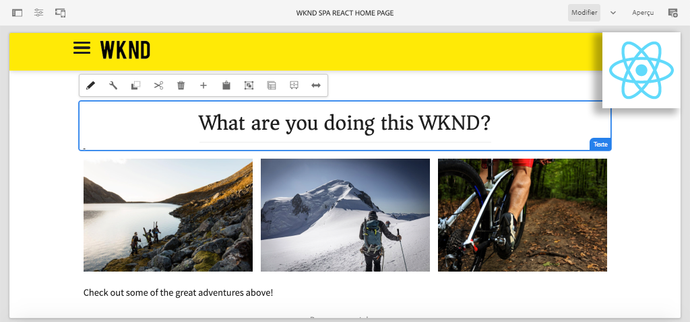

# Créer votre première SPA React dans AEM {#overview}

Bienvenue dans un tutoriel en plusieurs parties conçu pour les développeurs qui découvrent la fonction **SPA Éditeur** d’Adobe Experience Manager (AEM). Ce tutoriel décrit la mise en oeuvre d’une application React pour une marque de style de vie fictive, WKND. L’application React sera développée et conçue pour être déployée avec AEM SPA Editor, qui mappe les composants React aux composants d’AEM. Les SPA terminées, déployées sur AEM, peuvent être créées dynamiquement à l’aide des outils de modification en ligne traditionnels d’.

*Implémentation SPA WKND*

## À propos

Le tutoriel est conçu pour fonctionner avec **AEM en tant que Cloud Service** et est rétrocompatible avec **AEM 6.5.4+** et **la version 6.4.8+**.

## Dernier code

Vous trouverez tout le code du tutoriel sur [GitHub](https://github.com/adobe/aem-guides-wknd-spa).

La [dernière base de code](https://github.com/adobe/aem-guides-wknd-spa/releases) est disponible en tant que packages d’AEM téléchargeables.

## Prérequis

Avant de commencer ce tutoriel, vous aurez besoin des éléments suivants :

* Connaissances de base en HTML, CSS et JavaScript
* Connaissance de base de [React](https://reactjs.org/tutorial/tutorial.html)

*Bien que cela ne soit pas nécessaire, il est préférable de posséder une compréhension de base du  [développement des composants](https://experienceleague.adobe.com/docs/experience-manager-learn/getting-started-wknd-tutorial-develop/overview.html) AEM Sites traditionnels.*

## Environnement de développement local {#local-dev-environment}

Un environnement de développement local est nécessaire pour terminer ce tutoriel. Les captures d’écran et la vidéo sont capturées à l’aide de AEM as a Cloud Service SDK s’exécutant dans un environnement Mac OS avec [Visual Studio Code](https://code.visualstudio.com/) comme IDE. Les commandes et le code doivent être indépendants du système d’exploitation local, sauf indication contraire.

### Logiciels requis

* [AEM as a Cloud Service SDK](https://experienceleague.adobe.com/docs/experience-manager-learn/cloud-service/local-development-environment-set-up/aem-runtime.html),  [AEM 6.5.4+](https://experienceleague.adobe.com/docs/experience-manager-release-information/aem-release-updates/aem-releases-updates.html?lang=en#aem-65)  ou  [6.4.8+](https://experienceleague.adobe.com/docs/experience-manager-release-information/aem-release-updates/aem-releases-updates.html?lang=en#aem-64)
* [Java](https://downloads.experiencecloud.adobe.com/content/software-distribution/en/general.html)
* [Apache Maven](https://maven.apache.org/) (3.3.9 ou version ultérieure)
* [Node.](https://nodejs.org/en/) jand  [npm](https://www.npmjs.com/)

>[!NOTE]
>
> **Vous découvrez AEM as a Cloud Service ?** Consultez le guide  [suivant pour configurer un environnement de développement local à l’aide du SDK AEM as a Cloud Service](https://experienceleague.adobe.com/docs/experience-manager-learn/cloud-service/local-development-environment-set-up/overview.html).
>
> **Vous découvrez AEM 6.5 ?** Consultez le guide  [suivant pour configurer un environnement de développement local](https://experienceleague.adobe.com/docs/experience-manager-learn/foundation/development/set-up-a-local-aem-development-environment.html?lang=fr).

## Étapes suivantes {#next-steps}

Qu&#39;attendez-vous?! Démarrez le tutoriel en accédant au chapitre [Créer un projet](create-project.md) et apprenez à générer un projet activé pour l’éditeur de SPA à l’aide de l’archétype de projet AEM.
