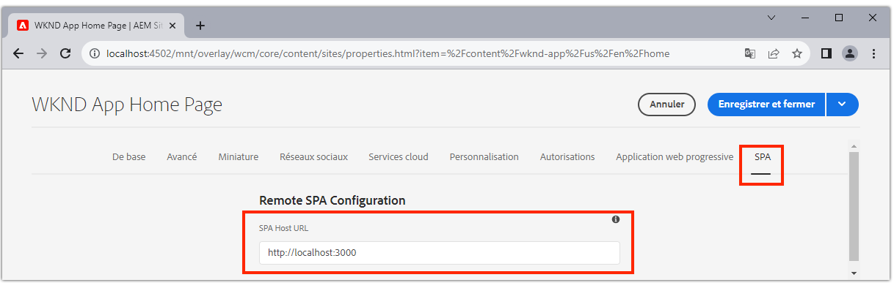

# Configuration d’AEM pour SPA Editor

Bien que la base de code SPA soit gérée en dehors d’AEM, un projet d’AEM est nécessaire pour configurer la prise en charge des exigences en matière de configuration et de contenu. Ce chapitre décrit la création d’un projet AEM qui contient les configurations nécessaires :

+ AEM des proxys des composants principaux WCM
+ AEM proxy SPA page à distance
+ AEM Modèles de page SPA distants
+ Pages d’AEM de SPA distantes de ligne de base
+ Sous-projet pour définir des SPA pour AEM mappages d’URL
+ Dossiers de configuration OSGi

## Création d’un projet AEM

Créez un projet AEM dans lequel les configurations et le contenu de base sont gérés.

_Utilisez toujours la dernière version de l’ [archétype AEM](https://github.com/adobe/aem-project-archetype)._


```
$ mkdir -p ~/Code/wknd-app
$ cd ~/Code/wknd-app
$ mvn -B archetype:generate \
 -D archetypeGroupId=com.adobe.aem \
 -D archetypeArtifactId=aem-project-archetype \
 -D archetypeVersion=27 \
 -D aemVersion=cloud \
 -D appTitle="WKND App" \
 -D appId="wknd-app" \
 -D groupId="com.adobe.aem.guides.wkndapp" \
 -D frontendModule="react"
$ mv ~/Code/wknd-app/wknd-app ~/Code/wknd-app/com.adobe.aem.guides.wknd-app
```

_La dernière commande renomme simplement le dossier de projet AEM afin qu’il soit clair qu’il s’agit du projet AEM et qu’il ne faut pas confondre avec le projet à distance__

Bien que `frontendModule="react"` soit spécifié, le projet `ui.frontend` n’est pas utilisé pour le cas d’utilisation SPA distant. La SPA est développée et gérée en externe sur AEM et utilise uniquement l’API de contenu d’  . L’indicateur `frontendModule="react"` est requis pour le projet pour inclure les dépendances `spa-project` AEM Java™ et configurer les modèles de page SPA distants.

L’archétype de projet AEM génère les éléments suivants qui servent à configurer AEM pour l’intégration à la page d’accueil.

+ __AEM des__ proxys des composants principaux WCM à l’adresse  `ui.content/src/.../apps/wknd-app/components`
+ __AEM SPA__ proxy de page distante  `ui.content/src/.../apps/wknd-app/components/remotepage`
+ __AEM__ modèles de page  `ui.content/src/.../conf/wknd-app/settings/wcm/templates`
+ __Sous-projet pour définir les__ mappages de contenu  `ui.content/src/...`
+ __Page d’AEM de SPA distante de ligne de base__ à  `ui.content/src/.../content/wknd-app`
+ __Dossiers de configuration OSGi__ :  `ui.config/src/.../apps/wknd-app/osgiconfig`

Avec le projet d’AEM de base généré, quelques réglages assurent SPA compatibilité de l’éditeur avec les SPA distantes.

## Suppression du projet ui.frontend

Comme le SPA est une SPA distante, supposons qu’il soit développé et géré en dehors du projet d’AEM. Pour éviter les conflits, supprimez le projet `ui.frontend` du déploiement. Si le projet `ui.frontend` n’est pas supprimé, deux SPA, le SPA par défaut fourni dans le projet `ui.frontend` et le projet à distance, seront chargés en même temps dans l’éditeur d’.

1. Ouvrez le projet AEM (`~/Code/wknd-app/com.adobe.aem.guides.wknd-app`) dans votre IDE.
1. Ouvrez la racine `pom.xml`
1. Mettre en commentaire `<module>ui.frontend</module` à partir de la liste `<modules>`

   ```
   <modules>
       <module>all</module>
       <module>core</module>
   
       <!-- <module>ui.frontend</module> -->
   
       <module>ui.apps</module>
       <module>ui.apps.structure</module>
       <module>ui.config</module>
       <module>ui.content</module>
       <module>it.tests</module>
       <module>dispatcher</module>
       <module>ui.tests</module>
       <module>analyse</module>
   </modules>
   ```

   Le fichier `pom.xml` doit se présenter comme suit :

   

1. Ouvrez le `ui.apps/pom.xml`
1. Commenter `<dependency>` sur `<artifactId>wknd-app.ui.frontend</artifactId>`

   ```
   <dependencies>
   
       <!-- Remote SPA project will provide all frontend resources
       <dependency>
           <groupId>com.adobe.aem.guides.wkndapp</groupId>
           <artifactId>wknd-app.ui.frontend</artifactId>
           <version>${project.version}</version>
           <type>zip</type>
       </dependency>
       --> 
   </dependencies>
   ```

   Le fichier `ui.apps/pom.xml` doit se présenter comme suit :

   

Si le projet AEM a été créé avant ces modifications, supprimez manuellement la bibliothèque cliente `ui.frontend` générée à partir du projet `ui.apps` à l’adresse `ui.apps/src/main/content/jcr_root/apps/wknd-app/clientlibs/clientlib-react`.

## Mappage AEM contenu

Pour que AEM charge la SPA distante dans l’éditeur d’outils, les mappages entre les itinéraires de  et les pages d’ utilisées pour l’ouverture et la création de contenu doivent être établis.

L’importance de cette configuration est explorée ultérieurement.

Le mappage peut être effectué avec [Mappage Sling](https://sling.apache.org/documentation/the-sling-engine/mappings-for-resource-resolution.html#root-level-mappings-1) défini dans `/etc/map`.

1. Dans l’IDE, ouvrez le sous-projet `ui.content`
1. Accédez à `src/main/content/jcr_root/etc`. 
1. Création d’un dossier `map`
1. Dans `map`, créez un dossier `http`
1. Dans `http`, créez un fichier `.content.xml` avec le contenu :

   ```
   <?xml version="1.0" encoding="UTF-8"?>
   <jcr:root xmlns:sling="http://sling.apache.org/jcr/sling/1.0" xmlns:jcr="http://www.jcp.org/jcr/1.0"
       jcr:primaryType="sling:Mapping">
       <localhost_any/>
   </jcr:root>
   ```

1. Dans `http` , créez un dossier `localhost_any`
1. Dans `localhost_any`, créez un fichier `.content.xml` avec le contenu :

   ```
   <?xml version="1.0" encoding="UTF-8"?>
   <jcr:root xmlns:sling="http://sling.apache.org/jcr/sling/1.0" xmlns:jcr="http://www.jcp.org/jcr/1.0"
       jcr:primaryType="sling:Mapping"
       sling:match="localhost\\.\\d+">
       <wknd-app-routes-adventure/>
   </jcr:root>
   ```

1. Dans `localhost_any` , créez un dossier `wknd-app-routes-adventure`
1. Dans `wknd-app-routes-adventure`, créez un fichier `.content.xml` avec le contenu :

   ```
   <?xml version="1.0" encoding="UTF-8"?>
   
   <!--
   The 'wknd-app-routes-adventure' mapping, maps requests to the SPA's adventure route 
   to it's corresponding page in AEM at /content/wknd-app/us/en/home/adventure/xxx.
   
   Note the adventure AEM pages will be created directly in AEM.
   -->
   
   <jcr:root xmlns:sling="http://sling.apache.org/jcr/sling/1.0" xmlns:jcr="http://www.jcp.org/jcr/1.0"
       jcr:primaryType="sling:Mapping"
       sling:match="adventure:.*/([^/]+)/?$"
       sling:internalRedirect="/content/wknd-app/us/en/home/adventure/$1"/>
   ```

1. Ajoutez les noeuds de mappage à `ui.content/src/main/content/META-INF/vault/filter.xml` afin qu’ils soient inclus dans le package AEM.

   ```
   <?xml version="1.0" encoding="UTF-8"?>
   <workspaceFilter version="1.0">
       <filter root="/conf/wknd-app" mode="merge"/>
       <filter root="/content/wknd-app" mode="merge"/>
       <filter root="/content/dam/wknd-app/asset.jpg" mode="merge"/>
       <filter root="/content/experience-fragments/wknd-app" mode="merge"/>
   
       <!-- Add the Sling Mapping rules for the WKND App -->
       <filter root="/etc/map" mode="merge"/>
   </workspaceFilter>
   ```

La structure de dossiers et les fichiers `.context.xml` doivent se présenter comme suit :


Le fichier `filter.xml` doit se présenter comme suit :


Désormais, lorsque le projet AEM est déployé, ces configurations sont automatiquement incluses.

Les effets de mappage Sling AEM exécutés sur `http` et `localhost`, donc prennent uniquement en charge le développement local. Lors du déploiement vers AEM en tant que Cloud Service, des mappages Sling similaires doivent être ajoutés pour cibler `https` et l’AEM appropriée en tant que domaines de Cloud Service. Pour plus d’informations, voir la [documentation sur le mappage Sling](https://sling.apache.org/documentation/the-sling-engine/mappings-for-resource-resolution.html).

## Stratégies de sécurité du partage des ressources cross-origin

Configurez ensuite AEM pour protéger le contenu afin que seul ce SPA puisse accéder au contenu . C Configurez le [partage des ressources cross-origin dans AEM](https://experienceleague.adobe.com/docs/experience-manager-learn/foundation/security/develop-for-cross-origin-resource-sharing.html).

1. Dans votre IDE, ouvrez le sous-projet Maven `ui.config`
1. Naviguer `src/main/content/jcr_root/apps/wknd-app/osgiconfig/config`
1. Créez un fichier nommé `com.adobe.granite.cors.impl.CORSPolicyImpl~wknd-app_remote-spa.cfg.json`
1. Ajoutez le suivant au fichier :

   ```
   {
       "supportscredentials":true,
       "exposedheaders":[
           ""
       ],
       "supportedmethods":[
           "GET",
           "HEAD",
           "POST",
           "OPTIONS"
       ],
       "alloworigin":[
           "https://external-hosted-app", "localhost:3000"
       ],
       "maxage:Integer":1800,
       "alloworiginregexp":[
           ".*"
       ],
       "allowedpaths":[
           ".*"
       ],
       "supportedheaders":[
           "Origin",
           "Accept",
           "X-Requested-With",
           "Content-Type",
           "Access-Control-Request-Method",
           "Access-Control-Request-Headers",
           "Authorization"
       ]
   }
   ```

Le fichier `com.adobe.granite.cors.impl.CORSPolicyImpl~wknd-app_remote-spa.cfg.json` doit se présenter comme suit :


Les éléments de configuration clés sont les suivants :

+ `alloworigin` indique les hôtes autorisés à récupérer du contenu d’AEM.
   + `localhost:3000` est ajouté à la prise en charge de la SPA s’exécutant localement
   + `https://external-hosted-app` agit comme un espace réservé à remplacer par le domaine sur lequel le SPA distant est hébergé.
+ `allowedpaths` spécifiez les chemins d’accès dans AEM couverts par cette configuration CORS. La valeur par défaut permet d’accéder à tout le contenu d’AEM, mais elle ne peut être définie que sur les chemins spécifiques auxquels le SPA peut accéder, par exemple : `/content/wknd-app`.

## Définir AEM page comme modèle de page SPA distant

L’archétype de projet AEM génère un projet prêt à AEM’intégration avec un  distant, mais nécessite un petit ajustement important de la structure de page d’ générée automatiquement. Le type de la page d’AEM générée automatiquement doit être modifié en __Page SPA distante__ plutôt qu’une __page__.

1. Dans votre IDE, ouvrez le sous-projet `ui.content`
1. Ouvrir à `src/main/content/jcr_root/content/wknd-app/us/en/home/.content.xml`
1. Mettez à jour ce fichier `.content.xml` avec :

   ```
   <?xml version="1.0" encoding="UTF-8"?>
   <jcr:root xmlns:sling="http://sling.apache.org/jcr/sling/1.0" xmlns:cq="http://www.day.com/jcr/cq/1.0" xmlns:jcr="http://www.jcp.org/jcr/1.0" xmlns:nt="http://www.jcp.org/jcr/nt/1.0"
           jcr:primaryType="cq:Page">
       <jcr:content
           cq:template="/conf/wknd-app/settings/wcm/templates/spa-remote-page"
           jcr:primaryType="cq:PageContent"
           jcr:title="WKND App Home Page"
           sling:resourceType="wknd-app/components/remotepage">
           <root
               jcr:primaryType="nt:unstructured"
               sling:resourceType="wcm/foundation/components/responsivegrid">
               <responsivegrid
                   jcr:primaryType="nt:unstructured"
                   sling:resourceType="wcm/foundation/components/responsivegrid">
                   <text
                       jcr:primaryType="nt:unstructured"
                       sling:resourceType="wknd-app/components/text"
                       text="&lt;p>Hello World!&lt;/p>"
                       textIsRich="true">
                       <cq:responsive jcr:primaryType="nt:unstructured"/>
                   </text>
               </responsivegrid>
           </root>
       </jcr:content>
   </jcr:root>
   ```

Les modifications clés sont des mises à jour du noeud `jcr:content` :

+ `cq:template` vers `/conf/wknd-app/settings/wcm/templates/spa-remote-page`
+ `sling:resourceType` vers `wknd-app/components/remotepage`

Le fichier `src/main/content/jcr_root/content/wknd-app/us/en/home/.content.xml` doit se présenter comme suit :


Ces modifications permettent à cette page, qui agit comme la racine SPA d’AEM, de charger la ressource à distance dans l’éditeur de .

>[!NOTE]
>
>Si ce projet devait être précédemment AEM, veillez à supprimer la page AEM en tant que __Sites > Application WKND > us > en > Page d’accueil de l’application WKND__, car le projet `ui.content` est défini sur les noeuds __merge__ plutôt que __mettre à jour__.

Cette page peut également être supprimée et recréée en tant que Page de SPA distante dans AEM elle-même. Toutefois, puisque cette page est créée automatiquement dans le projet `ui.content`, il est préférable de la mettre à jour dans la base de code.

## Déploiement du projet AEM sur AEM SDK

1. Assurez-vous que le service AEM Author s’exécute sur le port 4502.
1. Dans la ligne de commande, accédez à la racine du projet AEM Maven.
1. Utilisez Maven pour déployer le projet vers votre service d’auteur de SDK AEM local.

   ```
   $ mvn clean install -PautoInstallSinglePackage
   ```

   

## Configuration de la page d’AEM racine

Une fois le projet AEM déployé, il y a une dernière étape pour préparer SPA Éditeur à charger notre SPA à distance. Dans AEM, marquez la page AEM qui correspond à la racine de l’SPA,`/content/wknd-app/us/en/home`, générée par l’archétype de projet.

1. Connexion à l’auteur AEM
1. Accédez à __Sites > Application WKND > us > en__
1. Sélectionnez __Page d’accueil de l’application WKND__, puis appuyez sur __Propriétés__.

   

1. Accédez à l’onglet __SPA__
1. Remplissez la __Configuration SPA distante__
   + __SPA URL__ d’hôte :  `http://localhost:3000`
      + URL de la racine de la SPA distante

   

1. Appuyez sur __Enregistrer et fermer__

N’oubliez pas que nous avons remplacé le type de cette page par celui d’une __Page SPA distante__, ce qui nous permet de voir l’onglet __SPA__ dans ses __Propriétés de la page__.

Cette configuration ne doit être définie que sur la page AEM qui correspond à la racine du SPA. Toutes les AEM pages situées sous cette page héritent de la valeur .

## Félicitations

Vous avez maintenant préparé les configurations AEM et les avez déployées sur votre auteur AEM local ! Vous savez maintenant comment :

+ Supprimez le SPA généré par l’archétype de projet AEM en commentant les dépendances dans `ui.frontend`
+ Ajoutez des mappages Sling à AEM qui mappent les itinéraires SPA aux ressources dans les ressources d’
+ Configurez AEM stratégies de sécurité Partage des ressources cross-origin qui permettent à l’SPA distante d’utiliser du contenu provenant d’un AEM
+ Déployez le projet AEM sur votre service local AEM SDK Author
+ Marquez une page d’AEM comme racine SPA distante à l’aide de la propriété de page URL d’hôte de la page de l’URL d’accès à l’utilisateur de la page de l’utilisateur.

## Étapes suivantes

Une fois les AEM configurés, nous pouvons nous concentrer sur [l’amorçage de la SPA distante](./spa-bootstrap.md) avec la prise en charge des zones modifiables à l’aide de l’éditeur d’.