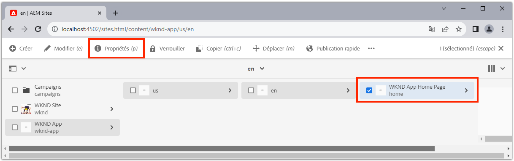

# Configuration de AEM pour SPA Editor

Bien que la base de code SPA soit gérée en dehors de AEM, un projet AEM est nécessaire pour configurer la configuration et les exigences de contenu prises en charge. Ce chapitre porte sur la création d&#39;un projet AEM qui contient les configurations nécessaires :

+ Proxys des composants principaux de gestion de contenu Web AEM
+ Proxy de page SPA à distance AEM
+ AEM modèles de page SPA distants
+ Pages d&#39;SPA distantes de base
+ Sous-projet pour définir SPA aux correspondances d&#39;URL AEM
+ Dossiers de configuration OSGi

## Création d’un projet AEM

Créez un projet AEM dans lequel les configurations et le contenu de base sont gérés.

_Utilisez toujours la dernière version de l&#39;archétype [ ](https://github.com/adobe/aem-project-archetype)AEM._


```
$ mkdir -p ~/Code/wknd-app
$ cd ~/Code/wknd-app
$ mvn -B archetype:generate \
 -D archetypeGroupId=com.adobe.aem \
 -D archetypeArtifactId=aem-project-archetype \
 -D archetypeVersion=27 \
 -D aemVersion=cloud \
 -D appTitle="WKND App" \
 -D appId="wknd-app" \
 -D groupId="com.adobe.aem.guides.wkndapp" \
 -D frontendModule="react"
$ mv ~/Code/wknd-app/wknd-app ~/Code/wknd-app/com.adobe.aem.guides.wknd-app
```

_La dernière commande renomme simplement le dossier de projet AEM afin qu’il soit clair qu’il s’agit du projet AEM et qu’il ne faut pas confondre avec le dossier de projet à distance SPA__.

Bien que `frontendModule="react"` soit spécifié, le projet `ui.frontend` n&#39;est pas utilisé pour le cas d&#39;utilisation de la SPA distante. Le SPA est développé et géré de manière externe à AEM et utilise uniquement l’ en tant qu’API de contenu. L&#39;indicateur `frontendModule="react"` est requis pour le projet, notamment les dépendances `spa-project` AEM Java™ et la configuration des modèles de page SPA distants.

L&#39;archétype de projet AEM génère les éléments suivants qui ont été utilisés pour configurer les AEM pour l&#39;intégration avec les SPA.

+ __AEM composants principaux WCM__ proxys à  `ui.content/src/.../apps/wknd-app/components`
+ __AEM SPA__ proxyat de page distante  `ui.content/src/.../apps/wknd-app/components/remotepage`
+ __AEM__ modèles de page  `ui.content/src/.../conf/wknd-app/settings/wcm/templates`
+ __Sous-projet pour définir les__ mappages de contenu  `ui.content/src/...`
+ __SPA distante de base,__ pages AEM  `ui.content/src/.../content/wknd-app`
+ ____ dossier de configuration OSGi  `ui.config/src/.../apps/wknd-app/osgiconfig`

Avec le projet d&#39;AEM de base généré, quelques réglages assurent la compatibilité SPA Editor avec Remote SPA.

## Supprimer le projet ui.frontend

Comme le SPA est un SPA distant, supposons qu&#39;il a été développé et géré en dehors du projet de l&#39;AEM. Pour éviter les conflits, supprimez le projet `ui.frontend` du déploiement. Si le projet `ui.frontend` n&#39;est pas supprimé, deux SPA, l&#39;SPA par défaut fournie dans le projet `ui.frontend` et l&#39;SPA distante, seront chargés simultanément dans l&#39;éditeur d&#39;.

1. Ouvrez le projet AEM (`~/Code/wknd-app/com.adobe.aem.guides.wknd-app`) dans votre IDE.
1. Ouvrez la racine `pom.xml`
1. Commenter `<module>ui.frontend</module` à partir de la liste `<modules>`

   ```
   <modules>
       <module>all</module>
       <module>core</module>
   
       <!-- <module>ui.frontend</module> -->
   
       <module>ui.apps</module>
       <module>ui.apps.structure</module>
       <module>ui.config</module>
       <module>ui.content</module>
       <module>it.tests</module>
       <module>dispatcher</module>
       <module>ui.tests</module>
       <module>analyse</module>
   </modules>
   ```

   Le fichier `pom.xml` doit se présenter comme suit :

   

1. Ouvrez le `ui.apps/pom.xml`
1. Commenter `<dependency>` sur `<artifactId>wknd-app.ui.frontend</artifactId>`

   ```
   <dependencies>
   
       <!-- Remote SPA project will provide all frontend resources
       <dependency>
           <groupId>com.adobe.aem.guides.wkndapp</groupId>
           <artifactId>wknd-app.ui.frontend</artifactId>
           <version>${project.version}</version>
           <type>zip</type>
       </dependency>
       --> 
   </dependencies>
   ```

   Le fichier `ui.apps/pom.xml` doit se présenter comme suit :

   

Si le projet AEM a été créé avant ces modifications, supprimez manuellement la bibliothèque client `ui.frontend` générée du projet `ui.apps` à l&#39;emplacement `ui.apps/src/main/content/jcr_root/apps/wknd-app/clientlibs/clientlib-react`.

## Mappage de contenu AEM

Pour que AEM charge le SPA à distance dans l’éditeur de SPA, les mappages entre les itinéraires de  et les pages d’ utilisées pour l’ouverture et le contenu de création doivent être établis.

L&#39;importance de cette configuration est étudiée plus loin.

Le mappage peut être effectué avec [Mappage Sling](https://sling.apache.org/documentation/the-sling-engine/mappings-for-resource-resolution.html#root-level-mappings-1) défini dans `/etc/map`.

1. Dans l&#39;IDE, ouvrez le sous-projet `ui.content`
1. Accédez à `src/main/content/jcr_root/etc`. 
1. Créer un dossier `map`
1. Dans `map`, créez un dossier `http`
1. Dans `http`, créez un fichier `.content.xml` contenant le contenu :

   ```
   <?xml version="1.0" encoding="UTF-8"?>
   <jcr:root xmlns:sling="http://sling.apache.org/jcr/sling/1.0" xmlns:jcr="http://www.jcp.org/jcr/1.0"
       jcr:primaryType="sling:Mapping">
       <localhost_any/>
   </jcr:root>
   ```

1. Dans `http`, créez un dossier `localhost_any`
1. Dans `localhost_any`, créez un fichier `.content.xml` contenant le contenu :

   ```
   <?xml version="1.0" encoding="UTF-8"?>
   <jcr:root xmlns:sling="http://sling.apache.org/jcr/sling/1.0" xmlns:jcr="http://www.jcp.org/jcr/1.0"
       jcr:primaryType="sling:Mapping"
       sling:match="localhost\\.\\d+">
       <wknd-app-routes-adventure/>
   </jcr:root>
   ```

1. Dans `localhost_any`, créez un dossier `wknd-app-routes-adventure`
1. Dans `wknd-app-routes-adventure`, créez un fichier `.content.xml` contenant le contenu :

   ```
   <?xml version="1.0" encoding="UTF-8"?>
   
   <!--
   The 'wknd-app-routes-adventure' mapping, maps requests to the SPA's adventure route 
   to it's corresponding page in AEM at /content/wknd-app/us/en/home/adventure/xxx.
   
   Note the adventure AEM pages will be created directly in AEM.
   -->
   
   <jcr:root xmlns:sling="http://sling.apache.org/jcr/sling/1.0" xmlns:jcr="http://www.jcp.org/jcr/1.0"
       jcr:primaryType="sling:Mapping"
       sling:match="adventure:.*/([^/]+)/?$"
       sling:internalRedirect="/content/wknd-app/us/en/home/adventure/$1"/>
   ```

1. Ajoutez les noeuds de mappage sur `ui.content/src/main/content/META-INF/vault/filter.xml` à ceux inclus dans le package AEM.

   ```
   <?xml version="1.0" encoding="UTF-8"?>
   <workspaceFilter version="1.0">
       <filter root="/conf/wknd-app" mode="merge"/>
       <filter root="/content/wknd-app" mode="merge"/>
       <filter root="/content/dam/wknd-app/asset.jpg" mode="merge"/>
       <filter root="/content/experience-fragments/wknd-app" mode="merge"/>
   
       <!-- Add the Sling Mapping rules for the WKND App -->
       <filter root="/etc/map" mode="merge"/>
   </workspaceFilter>
   ```

La structure de dossiers et les fichiers `.context.xml` doivent se présenter comme suit :


Le fichier `filter.xml` doit se présenter comme suit :


Désormais, lorsque le projet AEM est déployé, ces configurations sont automatiquement incluses.

Les effets Mappage Sling AEM exécutés sur `http` et `localhost`, donc prennent uniquement en charge le développement local. Lors d’un déploiement sur AEM en tant que Cloud Service, des mappages Sling similaires doivent être ajoutés à la cible `https` et à l’AEM appropriée en tant que domaines Cloud Service. Pour plus d’informations, voir la [documentation sur le mappage des lignes de son](https://sling.apache.org/documentation/the-sling-engine/mappings-for-resource-resolution.html).

## Stratégies de sécurité de partage des ressources entre Origines

Configurez ensuite AEM pour protéger le contenu afin que seul ce SPA puisse accéder au contenu AEM. C Configurez le [partage de ressources entre Origines dans AEM](https://experienceleague.adobe.com/docs/experience-manager-learn/foundation/security/develop-for-cross-origin-resource-sharing.html).

1. Dans votre IDE, ouvrez le sous-projet Maven `ui.config`.
1. Naviguer `src/main/content/jcr_root/apps/wknd-app/osgiconfig/config`
1. Créez un fichier nommé `com.adobe.granite.cors.impl.CORSPolicyImpl~wknd-app_remote-spa.cfg.json`.
1. Ajoutez le suivant au fichier :

   ```
   {
       "supportscredentials":true,
       "exposedheaders":[
           ""
       ],
       "supportedmethods":[
           "GET",
           "HEAD",
           "POST",
           "OPTIONS"
       ],
       "alloworigin":[
           "https://external-hosted-app", "localhost:3000"
       ],
       "maxage:Integer":1800,
       "alloworiginregexp":[
           ".*"
       ],
       "allowedpaths":[
           ".*"
       ],
       "supportedheaders":[
           "Origin",
           "Accept",
           "X-Requested-With",
           "Content-Type",
           "Access-Control-Request-Method",
           "Access-Control-Request-Headers",
           "Authorization"
       ]
   }
   ```

Le fichier `com.adobe.granite.cors.impl.CORSPolicyImpl~wknd-app_remote-spa.cfg.json` doit se présenter comme suit :


Les principaux éléments de configuration sont les suivants :

+ `alloworigin` indique les hôtes autorisés à récupérer le contenu de AEM.
   + `localhost:3000` est ajouté à la prise en charge de la SPA s’exécutant localement
   + `https://external-hosted-app` agit en tant qu’espace réservé à remplacer par le domaine sur lequel le SPA distant est hébergé.
+ `allowedpaths` spécifiez les chemins d&#39;AEM couverts par cette configuration CORS. La valeur par défaut permet d’accéder à tout le contenu de l’AEM, mais elle ne peut être étendue qu’aux chemins spécifiques auxquels le SPA peut accéder, par exemple : `/content/wknd-app`.

## Définir la page AEM comme modèle de page SPA à distance

L&#39;archétype de projet AEM génère un projet préparé pour l&#39;intégration AEM avec un SPA à distance, mais nécessite un petit ajustement important de la structure de page d&#39; générée automatiquement. Le type de la page AEM générée automatiquement doit être remplacé par __Page SPA distante__, plutôt que par __Page__.

1. Dans votre IDE, ouvrez le sous-projet `ui.content`
1. Ouvrir à `src/main/content/jcr_root/content/wknd-app/us/en/home/.content.xml`
1. Mettez à jour ce fichier `.content.xml` avec :

   ```
   <?xml version="1.0" encoding="UTF-8"?>
   <jcr:root xmlns:sling="http://sling.apache.org/jcr/sling/1.0" xmlns:cq="http://www.day.com/jcr/cq/1.0" xmlns:jcr="http://www.jcp.org/jcr/1.0" xmlns:nt="http://www.jcp.org/jcr/nt/1.0"
           jcr:primaryType="cq:Page">
       <jcr:content
           cq:template="/conf/wknd-app/settings/wcm/templates/spa-remote-page"
           jcr:primaryType="cq:PageContent"
           jcr:title="WKND App Home Page"
           sling:resourceType="wknd-app/components/remotepage">
           <root
               jcr:primaryType="nt:unstructured"
               sling:resourceType="wcm/foundation/components/responsivegrid">
               <responsivegrid
                   jcr:primaryType="nt:unstructured"
                   sling:resourceType="wcm/foundation/components/responsivegrid">
                   <text
                       jcr:primaryType="nt:unstructured"
                       sling:resourceType="wknd-app/components/text"
                       text="&lt;p>Hello World!&lt;/p>"
                       textIsRich="true">
                       <cq:responsive jcr:primaryType="nt:unstructured"/>
                   </text>
               </responsivegrid>
           </root>
       </jcr:content>
   </jcr:root>
   ```

Les modifications clés sont des mises à jour du noeud `jcr:content` :

+ `cq:template` vers `/conf/wknd-app/settings/wcm/templates/spa-remote-page`
+ `sling:resourceType` vers `wknd-app/components/remotepage`

Le fichier `src/main/content/jcr_root/content/wknd-app/us/en/home/.content.xml` doit se présenter comme suit :


Ces modifications permettent à cette page, qui agit comme la racine SPA en AEM, de charger le site Web à distance dans l’éditeur de .

>[!NOTE]
>
>Si ce projet était AEM auparavant, veillez à supprimer la page AEM en tant que __Sites > WKND App > us > en > WKND App Page d&#39;accueil__, car le projet `ui.content` est défini sur __fusionner__ noeuds, plutôt que __mettre à jour__.

Cette page peut également être supprimée et recréée en tant que page de SPA distante dans AEM elle-même, mais comme cette page est créée automatiquement dans le projet `ui.content`, il est préférable de la mettre à jour dans la base de code.

## Déployer le projet AEM vers AEM SDK

1. Assurez-vous que le service Auteur AEM s’exécute sur le port 4502.
1. Dans la ligne de commande, accédez à la racine du projet AEM expert.
1. Utilisez Maven pour déployer le projet sur votre service local AEM SDK Author

   ```
   $ mvn clean install -PautoInstallSinglePackage
   ```

   

## Configuration de la page d’AEM racine

Une fois le projet AEM déployé, il y a une dernière étape pour préparer SPA Editor à charger notre SPA à distance. Dans AEM, marquez la page AEM qui correspond à la racine du projet, `/content/wknd-app/us/en/home`, générée par l&#39;archétype de projet .

1. Connexion à AEM Author
1. Accédez à __Sites > Application WKND > us > en__
1. Sélectionnez __WKND App Page d&#39;accueil__, puis appuyez sur __Propriétés__.

   

1. Accédez à l’onglet __SPA__
1. Renseignez __Configuration SPA distante__.
   + __URL__ de l&#39;hôte SPA :  `http://localhost:3000`
      + URL de la racine de la SPA distante

   

1. Appuyez sur __Enregistrer et fermer__

N&#39;oubliez pas que nous avons changé le type de cette page en celui d&#39;une __Page SPA distante__, ce qui nous permet de voir l&#39;onglet __SPA__ dans ses __Propriétés de la page__.

Cette configuration ne doit être définie que sur la page AEM qui correspond à la racine du SPA. Toutes les pages AEM sous cette page héritent de la valeur.

## Félicitations

Vous avez maintenant préparé les configurations AEM et les avez déployées sur votre AEM auteur local ! Vous savez maintenant :

+ Supprimez le SPA généré par l&#39;archétype de projet AEM en commentant les dépendances dans `ui.frontend`
+ Ajouter des mappages Sling à AEM qui mappent les SPA itinéraires aux ressources dans les AEM
+ Configurez AEM stratégies de sécurité Partage des ressources entre Origines qui permettent à la SPA distante de consommer du contenu provenant d&#39;AEM
+ Déployez le projet AEM sur votre service AEM SDK Author local
+ Marquer une page AEM en tant que racine SPA distante à l’aide de la propriété de page URL d’hôte SPA

## Étapes suivantes

Une fois les AEM configurés, nous pouvons nous concentrer sur l&#39;amorçage [de la SPA distante](./spa-bootstrap.md) avec la prise en charge des zones modifiables à l&#39;aide de l&#39;Éditeur d&#39; !