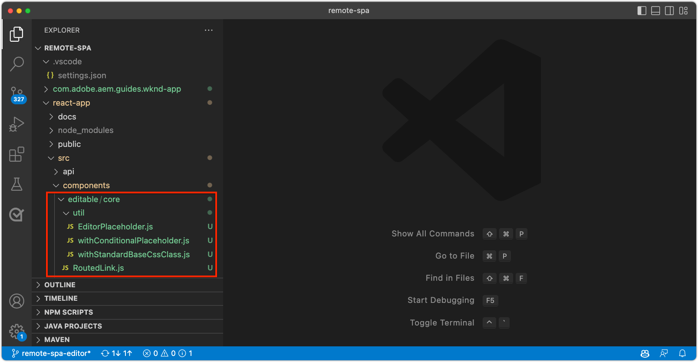

# Amorcer la SPA distante pour l’éditeur de SPA

Avant que les zones modifiables puissent être ajoutées à la SPA distante, cette dernière doit être amorcée avec le SDK JavaScript de l’éditeur de SPA AEM. Vous devez par ailleurs procéder à quelques autres configurations.

## Installer les dépendances npm du SDK JS de l’éditeur de SPA AEM

Tout d’abord, passez en revue les dépendances npm de la SPA AEM du projet React et installez-les.

+ [`@adobe/aem-spa-page-model-manager`](https://github.com/adobe/aem-spa-page-model-manager) : fournit l’API permettant de récupérer du contenu d’AEM.
+ [`@adobe/aem-spa-component-mapping`](https://github.com/adobe/aem-spa-component-mapping) : fournit l’API permettant de mapper le contenu AEM aux composants SPA.
+ [`@adobe/aem-react-editable-components` v2](https://github.com/adobe/aem-react-editable-components) : fournit une API permettant de créer des composants SPA personnalisés, ainsi que des implémentations courantes telles que le composant React `AEMPage`.

```shell
$ cd ~/Code/aem-guides-wknd-graphql/remote-spa-tutorial/react-app
$ npm install @adobe/aem-spa-page-model-manager 
$ npm install @adobe/aem-spa-component-mapping
$ npm install @adobe/aem-react-editable-components 
```

## Vérifier les variables d’environnement SPA

Plusieurs variables d’environnement doivent être exposées à la SPA distante, afin qu’elle sache interagir avec AEM.

1. Ouvrez le projet SPA distante sous `~/Code/aem-guides-wknd-graphql/remote-spa-tutorial/react-app` dans votre IDE
1. Ouvrez le fichier `.env.development`.
1. Dans le fichier, prêtez une attention particulière aux clés, puis effectuez les mises à jour suivant les besoins :

   ```
   REACT_APP_HOST_URI=http://localhost:4502
   
   REACT_APP_USE_PROXY=true
   
   REACT_APP_AUTH_METHOD=basic
   
   REACT_APP_BASIC_AUTH_USER=admin
   REACT_APP_BASIC_AUTH_PASS=admin
   ```

   

   *N’oubliez pas que les variables d’environnement personnalisées dans React doivent comporter le préfixe `REACT_APP_`.*

   + `REACT_APP_HOST_URI` : le schéma et l’hôte du service AEM auquel la SPA distante se connecte.
      + Cette valeur change selon l’environnement AEM (local, de développement, d’évaluation ou de production) et le type de service AEM (création ou publication).
   + `REACT_APP_USE_PROXY` : en indiquant au serveur de développement React de traiter les requêtes AEM en tant que proxy, telles que `/content, /graphql, .model.json`, en utilisant le module `http-proxy-middleware`, cela permet d’éviter les problèmes CORS pendant le développement.
   + `REACT_APP_AUTH_METHOD` : méthode d’authentification pour les requêtes diffusées par AEM. Les options sont &#39;service-token&#39;, &#39;dev-token&#39;, &#39;basic&#39; ou vide pour un cas d’utilisation sans authentification.
      + Requis pour une utilisation avec l’instance de création AEM
      + Peut être requis pour une utilisation avec l’instance de publication AEM (si le contenu est protégé)
      + Le développement par rapport au SDK AEM prend en charge les comptes locaux via l’authentification de base. Il s’agit de la méthode utilisée dans ce tutoriel.
      + Lors de l’intégration à AEM as a Cloud Service, utilisez les [jetons d’accès](https://experienceleague.adobe.com/docs/experience-manager-learn/getting-started-with-aem-headless/authentication/overview.html?lang=fr).
   + `REACT_APP_BASIC_AUTH_USER` : __Nom d’utilisateur__ AEM utilisé par la SPA pour l’authentification lors de la récupération du contenu AEM.
   + `REACT_APP_BASIC_AUTH_PASS` : __Mot de passe__ AEM utilisé par la SPA pour l’authentification lors de la récupération du contenu AEM.

## Intégrer l’API ModelManager

Avec les dépendances npm de la SPA AEM disponibles pour l’application, initialisez `ModelManager` d’AEM dans le fichier `index.js` du projet avant d’appeler `ReactDOM.render(...)`.

[ModelManager](https://github.com/adobe/aem-spa-page-model-manager/blob/master/src/ModelManager.ts) est chargé de se connecter à AEM pour récupérer le contenu modifiable.

1. Ouvrez le projet SPA distante dans votre IDE
1. Ouvrez le fichier `src/index.js`.
1. Ajoutez l’importation `ModelManager` et initialisez-la avant l’appel de `root.render(..)`.

   ```javascript
   ...
   import { ModelManager } from "@adobe/aem-spa-page-model-manager";
   
   // Initialize the ModelManager before invoking root.render(..).
   ModelManager.initializeAsync();
   
   const container = document.getElementById('root');
   const root = createRoot(container);
   root.render(<App />);
   ```

Le fichier `src/index.js` doit se présenter comme suit :


## Configurer un proxy SPA interne

Lors de la création d’une SPA modifiable, il est préférable de configurer un [proxy interne dans la SPA](https://create-react-app.dev/docs/proxying-api-requests-in-development/#configuring-the-proxy-manually) pour acheminer les requêtes appropriées vers AEM. Pour ce faire, utilisez le module npm [http-proxy-middleware](https://www.npmjs.com/package/http-proxy-middleware), qui est déjà installé par l’application WKND GraphQL de base.

1. Ouvrez le projet SPA distante dans votre IDE
1. Ouvrez le fichier dans `src/proxy/setupProxy.spa-editor.auth.basic.js`.
1. Mettez à jour le fichier avec le code suivant :

   ```javascript
   const { createProxyMiddleware } = require('http-proxy-middleware');
   const {REACT_APP_HOST_URI, REACT_APP_BASIC_AUTH_USER, REACT_APP_BASIC_AUTH_PASS } = process.env;
   
   /*
       Set up a proxy with AEM for local development
       In a production environment this proxy should be set up at the webserver level or absolute URLs should be used.
   */
   module.exports = function(app) {
   
       /**
       * Filter to check if the request should be re-routed to AEM. The paths to be re-routed at:
       * - Starts with /content (AEM content)
       * - Starts with /graphql (AEM graphQL endpoint)
       * - Ends with .model.json (AEM Content Services)
       * 
       * @param {*} path the path being requested of the SPA
       * @param {*} req the request object
       * @returns true if the SPA request should be re-routed to AEM
       */
       const toAEM = function(path, req) {
           return path.startsWith('/content') || 
               path.startsWith('/graphql') ||
               path.endsWith('.model.json')
       }
   
       /**
       * Re-writes URLs being proxied to AEM such that they can resolve to real AEM resources
       * - The "root" case of `/.model.json` are rewritten to the SPA's home page in AEM
       * - .model.json requests for /adventure:xxx routes are rewritten to their corresponding adventure page under /content/wknd-app/us/en/home/adventure/ 
       * 
       * @param {*} path the path being requested of the SPA
       * @param {*} req the request object
       * @returns returns a re-written path, or nothing to use the @param path
       */
       const pathRewriteToAEM = function (path, req) { 
           if (path === '/.model.json') {
               return '/content/wknd-app/us/en/home.model.json';
           } else if (path.startsWith('/adventure/') && path.endsWith('.model.json')) {
               return '/content/wknd-app/us/en/home/adventure/' + path.split('/').pop();
           }    
       }
   
       /**
       * Register the proxy middleware using the toAEM filter and pathRewriteToAEM rewriter 
       */
       app.use(
           createProxyMiddleware(
               toAEM, // Only route the configured requests to AEM
               {
                   target: REACT_APP_HOST_URI,
                   changeOrigin: true,
                   // Pass in credentials when developing against an Author environment
                   auth: `${REACT_APP_BASIC_AUTH_USER}:${REACT_APP_BASIC_AUTH_PASS}`,
                   pathRewrite: pathRewriteToAEM // Rewrite SPA paths being sent to AEM
               }
           )
       );
   
       /**
       * Enable CORS on requests from the SPA to AEM
       * 
       * If this rule is not in place, CORS errors will occur when running the SPA on http://localhost:3000
       */
       app.use((req, res, next) => {
           res.header("Access-Control-Allow-Origin", REACT_APP_HOST_URI);
           next();
       });
   };
   ```

   Le fichier `setupProxy.spa-editor.auth.basic.js` doit se présenter comme suit :

   

   Cette configuration de proxy effectue deux opérations principales :

   1. Les requêtes spécifiques effectuées sur la SPA (`http://localhost:3000`) sont mises en proxy vers AEM (`http://localhost:4502`)
      + Seules les requêtes dont les chemins correspondent à des modèles indiquant qu’elles doivent être diffusés par AEM sont mises en proxy, comme défini dans `toAEM(path, req)`.
      + Les chemins d’accès à la SPA sont réécrits vers leurs pages AEM correspondantes, comme défini dans `pathRewriteToAEM(path, req)`.
   1. Des en-têtes CORS sont ajoutés à toutes les requêtes pour permettre l’accès au contenu AEM, tel que défini par `res.header("Access-Control-Allow-Origin", REACT_APP_HOST_URI);`.
      + Si les en-têtes ne sont pas ajoutés, des erreurs CORS se produisent lors du chargement du contenu AEM dans la SPA.

1. Ouvrez le fichier `src/setupProxy.js`.
1. Examinez la ligne pointant vers le fichier de configuration du proxy `setupProxy.spa-editor.auth.basic` :

   ```
   ...
   case BASIC:
   // Use user/pass for local development with Local Author Env
   return require('./proxy/setupProxy.spa-editor.auth.basic');
   ...
   ```

Notez que toute modification apportée à `src/setupProxy.js` ou à ses fichiers référencés nécessite un redémarrage de la SPA.

## Ressource de SPA statique

Les ressources SPA statiques telles que le logo WKND et les graphiques de chargement doivent avoir leurs URL src mises à jour pour les forcer à se charger à partir de l’hôte SPA distante. Si elles sont laissées relatives, lorsque l’application SPA est chargée dans l’éditeur de SPA pour la création, ces URL utilisent par défaut l’hôte d’AEM plutôt que l’application SPA, ce qui entraîne des requêtes 404, comme illustré dans l’image ci-dessous.


Pour résoudre ce problème, assurez-vous que la ressource statique hébergée dans l’application SPA distante utilise des chemins absolus qui incluent l’origine de l’application SPA distante.

1. Ouvrez le projet SPA dans votre IDE.
1. Ouvrez votre fichier de variables d’environnement SPA `src/.env.development` et ajoutez une variable pour l’URI public de l’application SPA :

   ```
   ...
   # The base URI the SPA is accessed from
   REACT_APP_PUBLIC_URI=http://localhost:3000
   ```

   _Lors d’un déploiement sur AEM as a Cloud Service, vous devez procéder de la même manière pour les fichiers `.env`._

1. Ouvrez le fichier `src/App.js`.
1. Importez l’URI public de l’application SPA à partir des variables d’environnement de l’application SPA.

   ```javascript
   const {  REACT_APP_PUBLIC_URI } = process.env;
   
   function App() { ... }
   ```

1. Ajoutez le préfixe `REACT_APP_PUBLIC_URI` au logo WKND `` pour forcer la résolution contre la SPA

   ```html
   
   ```

1. Faites de même pour charger l’image dans `src/components/Loading.js`

   ```javascript
   const { REACT_APP_PUBLIC_URI } = process.env;
   
   class Loading extends Component {
   
       render() {
           return (<div className="loading">
               
           </div>);
       }
   }
   ```

1. Ainsi que pour les __deux instances__ du bouton Précédent dans `src/components/AdventureDetails.js`.

   ```javascript
   const { REACT_APP_PUBLIC_URI } = process.env;
   
   function AdventureDetail(props) {
       ...
       render() {
           
       }
   }
   ```

Les fichiers `App.js`, `Loading.js` et `AdventureDetails.js` doivent se présenter comme suit :


## Grille réactive AEM

Pour prendre en charge le mode de disposition de l’éditeur SPA pour les zones modifiables dans l’application SPA, la grille réactive CSS d’AEM doit être intégrée à l’application SPA. Ce système de grille ne s’applique qu’aux conteneurs modifiables et vous pouvez utiliser le système de grille de votre choix pour orienter la disposition du reste de votre application SPA.

Ajoutez les fichiers du SCSS de la grille réactive AEM à la SPA.

1. Ouvrez le projet SPA dans votre IDE.
1. Téléchargez et copiez les deux fichiers suivants dans `src/styles`.
   + [_grid.scss](./assets/spa-bootstrap/_grid.scss)
      + Générateur SCSS de grille réactive AEM
   + [_grid-init.scss](./assets/spa-bootstrap/_grid-init.scss)
      + Appelle `_grid.scss` à l’aide des points d’arrêt spécifiques de l’application SPA (sur bureau et mobile) et des colonnes (12).
1. Ouvrez `src/App.scss` et importez `./styles/grid-init.scss`.

   ```scss
   ...
   @import './styles/grid-init';
   ...
   ```

Les fichiers `_grid.scss` et `_grid-init.scss` doivent se présenter comme suit :


Désormais, la SPA inclut le code CSS requis pour prendre en charge le mode de disposition d’AEM pour les composants ajoutés à un conteneur AEM.

## Classes d’utilitaires

Copiez les classes d’utilitaires suivantes dans votre projet d’application React :

+ [RoutedLink.js](./assets/spa-bootstrap/RoutedLink.js) vers `~/Code/aem-guides-wknd-graphql/remote-spa-tutorial/react-app/src/components/editable/core/RoutedLink.js`
+ [EditorPlaceholder.js](./assets/spa-bootstrap/EditorPlaceholder.js) vers `~/Code/aem-guides-wknd-graphql/remote-spa-tutorial/react-app/src/components/editable/core/util/EditorPlaceholder.js`
+ [withConditionnelPlaceholder.js](./assets/spa-bootstrap/withConditionalPlaceholder.js) vers `~/Code/aem-guides-wknd-graphql/remote-spa-tutorial/react-app/src/components/editable/core/util/withConditionalPlaceholder.js`
+ [withStandardBaseCssClass.js](./assets/spa-bootstrap/withStandardBaseCssClass.js) vers `~/Code/aem-guides-wknd-graphql/remote-spa-tutorial/react-app/src/components/editable/core/util/withStandardBaseCssClass.js`



## Démarrer l’application SPA

Maintenant que la SPA est amorcée pour l’intégration à AEM, nous allons lancer l’application pour découvrir le fruit de nos efforts !

1. Sur la ligne de commande, accédez à la racine du projet SPA.
1. Démarrez la SPA à l’aide des commandes normales (si vous ne l’avez pas déjà fait).

   ```shell
   $ cd ~/Code/aem-guides-wknd-graphql/remote-spa-tutorial/react-app
   $ npm install 
   $ npm run start
   ```

1. Accédez à la SPA à l’adresse [http://localhost:3000](http://localhost:3000). Votre site doit s’afficher, quelle merveille !

.

## Ouvrez la SPA dans l’éditeur de SPA AEM.

Maintenant que la SPA est en cours d’exécution à l’adresse [http://localhost:3000](http://localhost:3000), nous allons l’ouvrir à l’aide de l’éditeur de SPA AEM. Aucun élément de la SPA n’est modifiable pour le moment, nous allons seulement valider la SPA dans AEM.

1. Connectez-vous au service de création AEM.
1. Accédez à __Sites > Application WKND > fr > fr__
1. Sélectionnez la __Page d’accueil de l’application WKND__ et cliquez sur __Modifier__ pour afficher la SPA.

   

1. Passez à l’__aperçu__ en utilisant le sélecteur de mode en haut à droite.
1. Cliquez sur la SPA.

   

## Félicitations.

Vous avez démarré la SPA à distance pour qu’elle soit compatible avec l’éditeur SPA d’AEM ! Vous savez maintenant comment :

+ Ajoutez les dépendances npm de l’éditeur SPA d’AEM JS SDK au projet SPA.
+ Configurer vos variables d’environnement SPA
+ Intégrer l’API ModelManager à la SPA
+ Configurer un proxy interne pour SPA afin qu’il achemine les demandes de contenu appropriées vers AEM
+ Résoudre des problèmes liés aux ressources SPA statiques dans le contexte de l’éditeur SPA
+ Ajouter le CSS de grille réactive d’AEM pour prendre en charge la mise en page dans les conteneurs modifiables d’AEM

## Étapes suivantes

Maintenant que la compatibilité avec l’éditeur SPA d’AEM est assurée, nous pouvons commencer à introduire des zones modifiables. Nous allons d’abord examiner comment placer un [composant modifiable fixe](./spa-fixed-component.md) dans la SPA.
