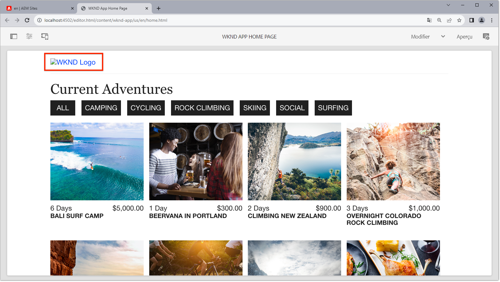
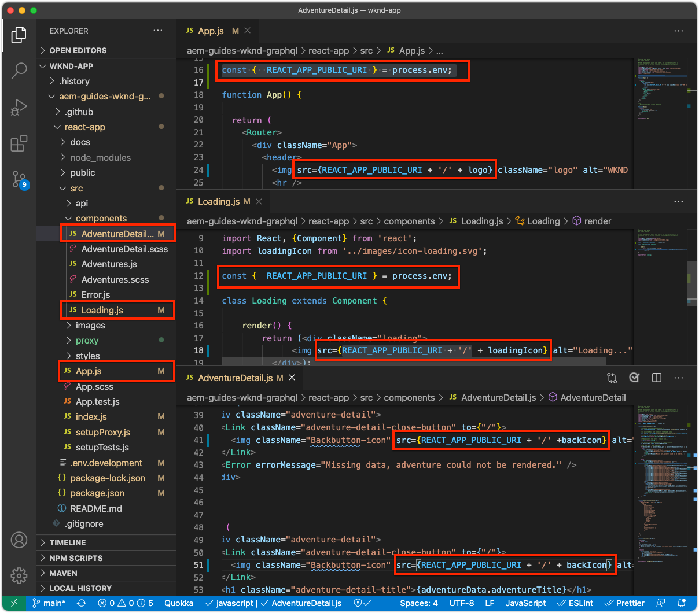
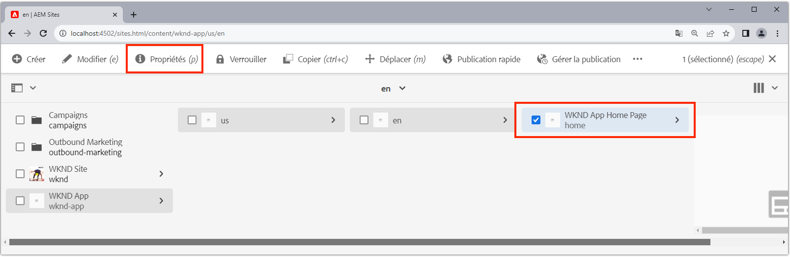
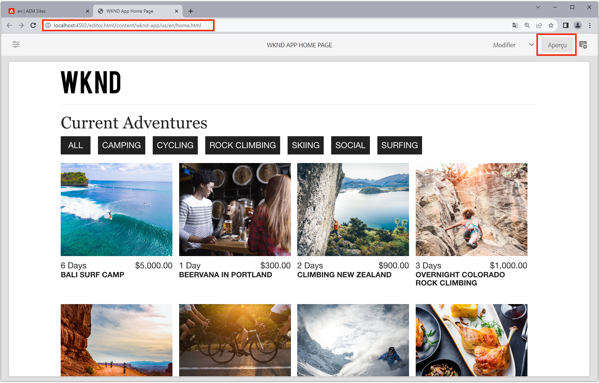

# Bootstrap de la SPA distante pour SPA Editor

Avant que les zones modifiables puissent être ajoutées au SPA distant, il doit être amorcé avec le SDK JavaScript AEM Editor et quelques autres configurations.

## Ajouter les dépendances du SDK npm de l&#39;AEM de l&#39;éditeur JS SDK

Tout d&#39;abord, ajoutez des AEM SPA dépendances npm au projet React.

```
$ cd ~/Code/wknd-app/aem-guides-wknd-graphql/react-app
$ npm install --save \
    @adobe/aem-spa-page-model-manager \
    @adobe/aem-spa-component-mapping \
    @adobe/aem-react-editable-components \
    @adobe/aem-core-components-react-base \
    @adobe/aem-core-components-react-spa
```

+ `@adobe/aem-spa-page-model-manager` fournit l’API pour récupérer le contenu de AEM.
+ `@adobe/aem-spa-component-mapping` fournit l’API qui associe AEM contenu aux SPA composants.
+ ` @adobe/aem-react-editable-components` fournit une API pour la création de composants SPA personnalisés et fournit des implémentations à usage commun, telles que le composant  `AEMPage` React.
+ `@adobe/aem-core-components-react-base` fournit une suite de composants React prêts à l&#39;emploi qui s&#39;intègrent de manière transparente aux composants principaux de la gestion de contenu Web AEM et sont SPA éditeurs indépendants. Il s&#39;agit principalement de composants de contenu tels que :
   + Titre
   + Text (Texte)
   + Chemin de navigation
   + Et ainsi de suite.
+ `@adobe/aem-core-components-react-spa` fournit une suite de composants React prêts à l&#39;emploi qui s&#39;intègrent facilement avec les composants principaux de la gestion de contenu Web AEM et nécessitent SPA Editor. Ils contiennent principalement des composants qui contiennent des composants de contenu provenant de `@adobe/aem-core-components-react-base`, tels que :
   + Conteneur
   + Carrousel
   + etc.

## Vérifier les variables d&#39;environnement SPA

Plusieurs variables d&#39;environnement doivent être exposées à la SPA distante afin qu&#39;elle sache comment interagir avec AEM.

1. Ouvrez le projet de SPA à distance à `~/Code/wknd-app/aem-guides-wknd-graphql/react-app` dans votre IDE.
1. Ouvrez le fichier `.env.development`
1. Ajoutez le fichier en portant une attention particulière aux clés :

   ```
   REACT_APP_HOST_URI=http://localhost:4502
   REACT_APP_AUTHORIZATION=admin:admin
   ```

   

   *N&#39;oubliez pas que les variables d&#39;environnement personnalisées dans Réagir doivent comporter un préfixe  `REACT_APP_`.*

   + `REACT_APP_AEM_URI`: schéma et hôte du service AEM auquel le SPA distant se connecte.
      + Cette valeur change en fonction de l’environnement AEM (local, Dev, Stage ou Production) et du type de service AEM (Auteur ou Publication).
   + `REACT_APP_AEM_AUTH`: les informations d’identification utilisées par le SPA s’authentifient sur AEM et récupèrent le contenu.
      + Requis pour une utilisation avec l’auteur AEM
      + Peut être nécessaire pour une utilisation avec AEM Publish (si le contenu est protégé)
      + Le développement par rapport au SDK AEM prend en charge les comptes locaux via l’authentification de base. Il s’agit de la méthode utilisée dans ce didacticiel.
      + Lors de l’intégration à AEM en tant que Cloud Service, utilisez [jetons d&#39;accès](https://experienceleague.adobe.com/docs/experience-manager-learn/getting-started-with-aem-headless/authentication/overview.html)

## Intégration de l&#39;API ModelManager

Avec les dépendances AEM SPA npm disponibles pour l&#39;application, initialisez l&#39; `ModelManager` dans le `index.js` du projet avant d&#39;appeler `ReactDOM.render(...)`.

[ModelManager](https://www.npmjs.com/package/@adobe/aem-spa-page-model-manager) est responsable de la connexion à AEM à la récupération du contenu modifiable.

1. Ouvrez le projet SPA distant dans votre IDE
1. Ouvrez le fichier `src/index.js`
1. Ajoutez l&#39;importation `ModelManager` et initialisez-la avant l&#39;appel `ReactDOM.render(..)`,

   ```
   ...
   import { ModelManager } from "@adobe/aem-spa-page-model-manager";
   
   // Initialize the ModelManager before invoking ReactDOM.render(...).
   ModelManager.initializeAsync();
   
   ReactDOM.render(...);
   ```

Le fichier `src/index.js` doit se présenter comme suit :


## Configuration d’un proxy SPA interne

Lors de l&#39;approvisionnement du contenu modifiable à partir de l&#39;AEM dans le SPA, il est préférable de configurer un [proxy interne dans le ](https://create-react-app.dev/docs/proxying-api-requests-in-development/#configuring-the-proxy-manually), qui est configuré pour acheminer les requêtes appropriées vers l&#39;. Pour ce faire, vous utilisez le module [http-proxy-middleware](https://www.npmjs.com/package/http-proxy-middleware) npm, qui est déjà installé par l&#39;application WKND GraphQL de base.

1. Ouvrez le projet SPA distant dans votre IDE
1. Créer un fichier à `src/proxy/setupProxy.spa-editor.auth.basic.js`
1. Ajoutez le code suivant au fichier :

   ```
   const { createProxyMiddleware } = require('http-proxy-middleware');
   const {REACT_APP_HOST_URI, REACT_APP_AUTHORIZATION } = process.env;
   
   /*
       Set up a proxy with AEM for local development
       In a production environment this proxy should be set up at the webserver level or absolute URLs should be used.
   */
   module.exports = function(app) {
   
       /**
       * Filter to check if the request should be re-routed to AEM. The paths to be re-routed at:
       * - Starts with /content (AEM content)
       * - Starts with /graphql (AEM graphQL endpoint)
       * - Ends with .model.json (AEM Content Services)
       * 
       * @param {*} path the path being requested of the SPA
       * @param {*} req the request object
       * @returns true if the SPA request should be re-routed to AEM
       */
       const toAEM = function(path, req) {
           return path.startsWith('/content') || 
               path.startsWith('/graphq') ||
               path.endsWith('.model.json')
       }
   
       /**
       * Re-writes URLs being proxied to AEM such that they can resolve to real AEM resources
       * - The "root" case of `/.model.json` are rewritten to the SPA's home page in AEM
       * - .model.json requests for /adventure:xxx routes are rewritten to their corresponding adventure page under /content/wknd-app/us/en/home/adventure/ 
       * 
       * @param {*} path the path being requested of the SPA
       * @param {*} req the request object
       * @returns returns a re-written path, or nothing to use the @param path
       */
       const pathRewriteToAEM = function (path, req) { 
           if (path === '/.model.json') {
               return '/content/wknd-app/us/en/home.model.json';
           } else if (path.startsWith('/adventure:') && path.endsWith('.model.json')) {
               return '/content/wknd-app/us/en/home/adventure/' + path.split('/').pop();
           }    
       }
   
       /**
       * Register the proxy middleware using the toAEM filter and pathRewriteToAEM rewriter 
       */
       app.use(
           createProxyMiddleware(
               toAEM, // Only route the configured requests to AEM
               {
                   target: REACT_APP_HOST_URI,
                   changeOrigin: true,
                   // Pass in credentials when developing against an Author environment
                   auth: REACT_APP_AUTHORIZATION,
                   pathRewrite: pathRewriteToAEM // Rewrite SPA paths being sent to AEM
               }
           )
       );
   
       /**
       * Enable CORS on requests from the SPA to AEM
       * 
       * If this rule is not in place, CORS errors will occur when running the SPA on http://localhost:3000
       */
       app.use((req, res, next) => {
           res.header("Access-Control-Allow-Origin", REACT_APP_HOST_URI);
           next();
       });
   };
   ```

   Le fichier `setupProxy.spa-editor.auth.basic.js` doit se présenter comme suit :

   

   Cette configuration de proxy effectue deux opérations principales :

   1. Demandes spécifiques par procuration adressées au SPA, `http://localhost:3000` à AEM `http://localhost:4502`
      + Il ne traite que les requêtes par proxy dont les chemins correspondent à des modèles qui indiquent qu’ils doivent être servis par AEM, comme défini dans `toAEM(path, req)`.
      + Il réécrit SPA chemins vers les pages AEM de leurs homologues, comme défini dans `pathRewriteToAEM(path, req)`
   1. Il ajoute des en-têtes CORS à toutes les requêtes afin d’autoriser l’accès au contenu AEM, comme défini par `res.header("Access-Control-Allow-Origin", REACT_APP_HOST_URI);`
      + Si ce n’est pas le cas, des erreurs CORS se produisent lors du chargement du contenu AEM dans le SPA.

1. Ouvrez le fichier `src/setupProxy.js`
1. Mettre la ligne `const proxy = require('./proxy/setupProxy.auth.basic')` en commentaire
1. Ajoutez une ligne pointant vers le nouveau fichier de configuration du proxy :

   ```
   // Proxy configuration for SPA Editor (and GraphQL) using Basic Auth
   const proxy = require('./proxy/setupProxy.spa-editor.auth.basic')
   ```

   Le fichier `setupProxy.js` doit se présenter comme suit :

   

Remarque : toute modification apportée à `src/setupProxy.js` ou aux fichiers référencés nécessite un redémarrage du SPA.

## Ressource SPA statique

Les ressources SPA statiques telles que le logo WKND et les graphiques de chargement doivent avoir leurs URL src mises à jour pour les forcer à se charger à partir de l&#39;hôte SPA distant. Si elle est relative, lorsque le SPA est chargé dans SPA Editor pour la création, ces URL utilisent par défaut l’hôte AEM plutôt que le , ce qui génère 404 requêtes, comme illustré dans l’illustration ci-dessous.



Pour résoudre ce problème, faites en sorte qu&#39;une ressource statique hébergée par la SPA distante utilise des chemins absolus incluant l&#39;origine SPA distante.

1. Ouvrez le projet SPA dans votre IDE
1. Ouvrez le fichier de variables d&#39;environnement SPA `src/.env.development` et ajoutez une variable pour l&#39;URI public SPA :

   ```
   ...
   # The base URI the SPA is accessed from
   REACT_APP_PUBLIC_URI=http://localhost:3000
   ```

   _Lors d’un déploiement sur AEM en tant que Cloud Service, vous devez effectuer la même opération pour les  `.env` fichiers correspondants._

1. Ouvrez le fichier `src/App.js`
1. Importer l&#39;URI public SPA à partir des variables d&#39;environnement SPA

   ```
   const {  REACT_APP_PUBLIC_URI } = process.env;
   
   function App() { ... }
   ```

1. Préfixez le logo WKND `` avec `REACT_APP_PUBLIC_URI` pour forcer la résolution sur le SPA.

   ```
   
   ```

1. Faire de même pour le chargement de l&#39;image dans `src/components/Loading.js`

   ```
   const { REACT_APP_PUBLIC_URI } = process.env;
   
   class Loading extends Component {
   
       render() {
           return (<div className="loading">
               
           </div>);
       }
   }
   ```

1. .. et pour les __deux instances__ du bouton Précédent dans `src/components/AdventureDetails.js`

   ```
   const { REACT_APP_PUBLIC_URI } = process.env;
   
   function AdventureDetail(props) {
       ...
       render() {
           
       }
   }
   ```

Les fichiers `App.js`, `Loading.js` et `AdventureDetails.js` doivent se présenter comme suit :



## Grille réactive AEM

Pour prendre en charge le mode de mise en page de SPA Editor pour les zones modifiables dans le SPA, nous devons intégrer le code CSS de grille réactive AEM dans le . Ne vous inquiétez pas : ce système de grille ne s&#39;appliquera qu&#39;aux conteneurs modifiables, et vous pouvez utiliser votre système de grille de votre choix pour piloter la disposition du reste de votre SPA.

Ajoutez les fichiers AEM SCSS à grille réactive sur le SPA.

1. Ouvrez le projet SPA dans votre IDE
1. Téléchargez et copiez les deux fichiers suivants dans `src/styles`
   + [_grid.scss](./assets/spa-bootstrap/_grid.scss)
      + Générateur SCSS de grille réactive AEM
   + [_grid-init.scss](./assets/spa-bootstrap/_grid.scss)
      + Appelle `_grid.scss` à l’aide des points d’arrêt spécifiques SPA (bureau et mobile) et des colonnes (12).
1. Ouvrez `src/App.scss` et importez `./styles/grid-init.scss`

   ```
   ...
   @import './styles/grid-init';
   ...
   ```

Les fichiers `_grid.scss` et `_grid-init.scss` doivent se présenter comme suit :


Désormais, le SPA inclut le CSS requis pour prendre en charge le mode AEM de mise en page pour les composants ajoutés à un conteneur AEM.

## Début du SPA

Maintenant que le SPA est amorcé pour l&#39;intégration avec AEM, faisons tourner le SPA et voyons à quoi il ressemble !

1. Sur la ligne de commande, accédez à la racine du projet SPA
1. Début de la SPA à l’aide des commandes normales (exécutez `npm install` si vous n’avez pas encore effectué cette opération)

   ```
   $ cd ~/Code/wknd-app/aem-guides-wknd-graphql/react-app
   $ npm install 
   $ npm run start
   ```

1. Consultez le SPA sur [http://localhost:3000](http://localhost:3000). Tout devrait être beau !


## Ouvrez le SPA dans AEM SPA Editor

Avec le SPA exécuté sur [http://localhost:3000](http://localhost:3000), ouvrons-le à l’aide de AEM Éditeur SPA. Rien n&#39;est encore modifiable dans le SPA, cela ne valide que le SPA dans l&#39;AEM.

1. Connexion à AEM Author
1. Accédez à __Sites > Application WKND > us > en__
1. Sélectionnez la __Page d&#39;accueil d’application WKND__ et appuyez sur __Modifier__ et le SPA apparaîtra.

   

1. Basculez vers __Prévisualisation__ à l’aide du sélecteur de mode situé en haut à droite.
1. Cliquez sur le SPA

   

## Félicitations ! 

Vous avez amorcé la SPA de télécommande pour être AEM Éditeur compatible ! Vous savez maintenant :

+ Ajouter les dépendances npm du SDK JS de l’AEM éditeur SPA au projet SPA
+ Configuration de vos variables d&#39;environnement SPA
+ Intégration de l’API ModelManager avec le SPA
+ Configurez un proxy interne pour le SPA afin qu&#39;il achemine les demandes de contenu appropriées vers l&#39;AEM
+ Résolution des problèmes liés aux ressources SPA statiques dans le contexte de SPA Editor
+ Ajouter AEM CSS à grille réactive pour prendre en charge la mise en page dans les conteneurs AEM modifiables

## Étapes suivantes

Maintenant que nous avons atteint une base de compatibilité avec AEM SPA Editor, nous pouvons début introduire des zones modifiables. Nous allons d&#39;abord examiner comment placer un [composant modifiable fixe](./spa-fixed-component.md) dans le SPA.
