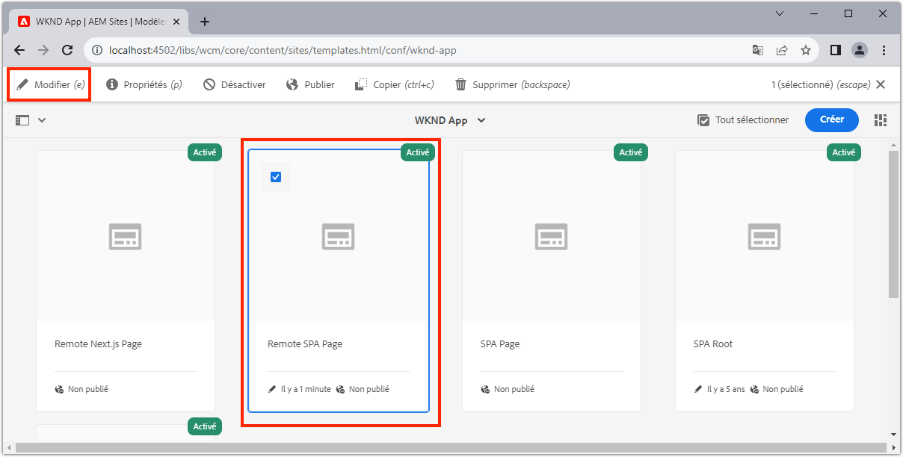
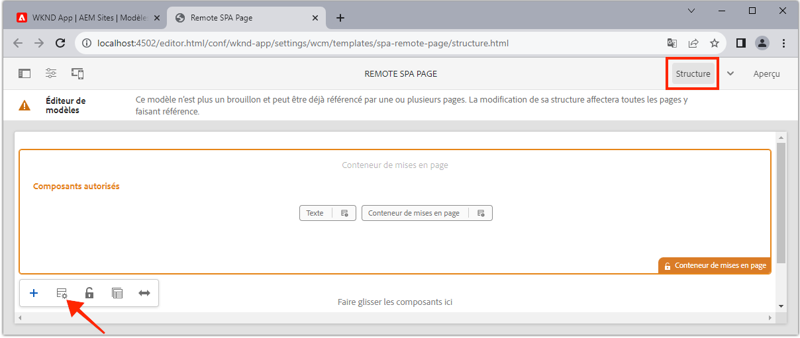
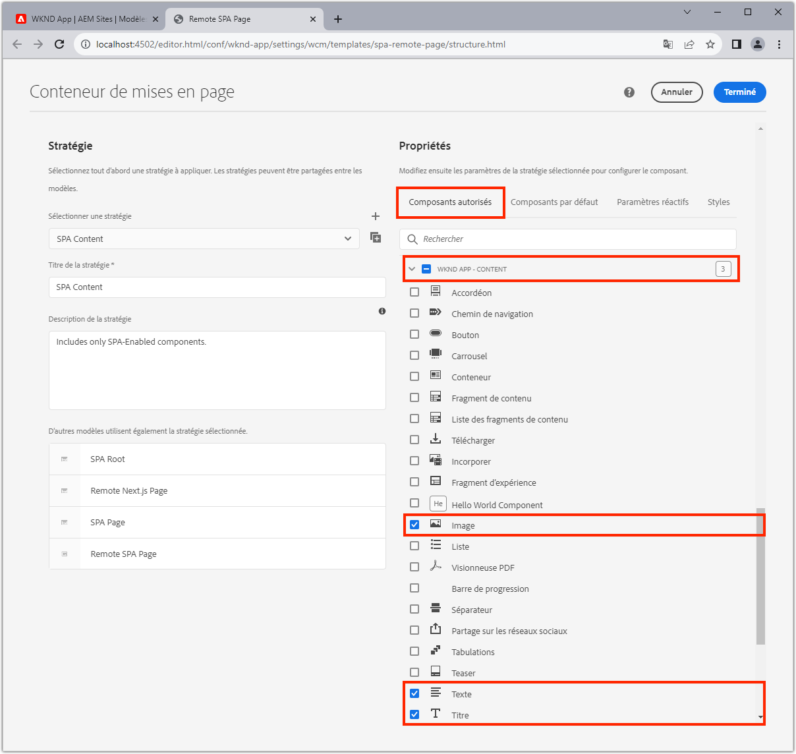
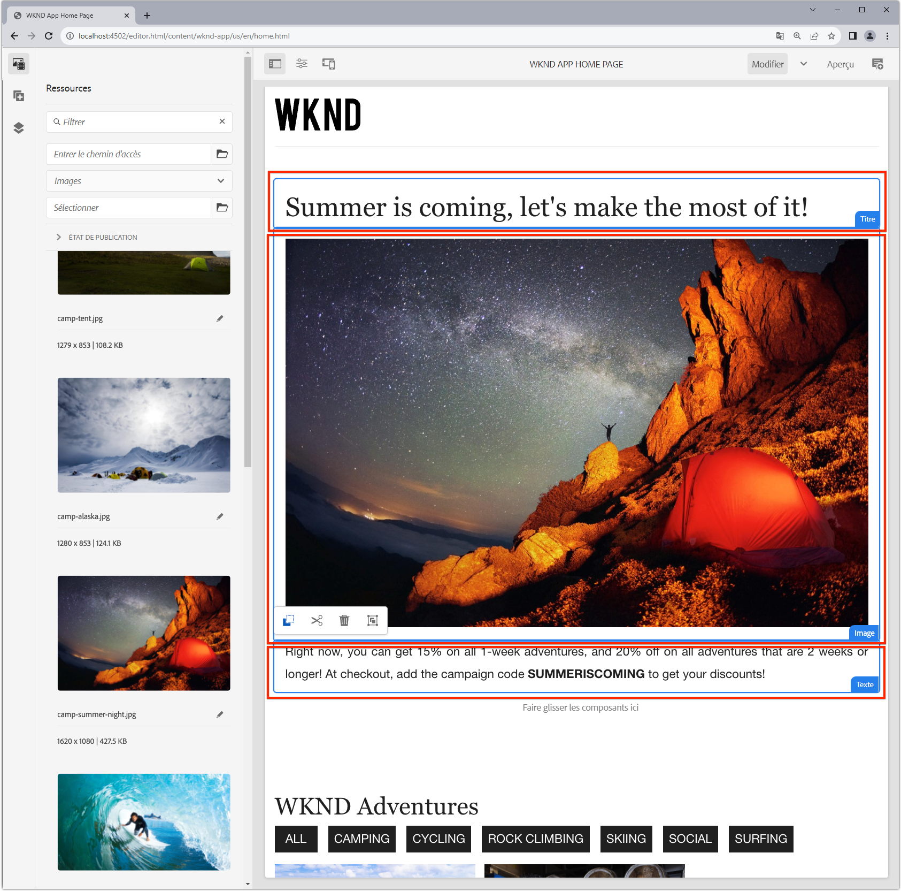
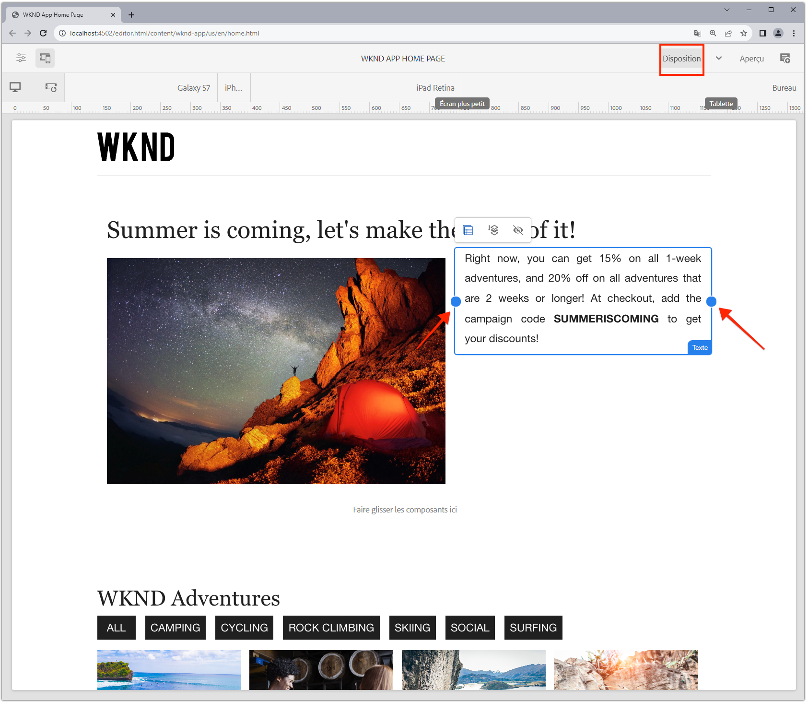

# Composants de conteneur modifiables

[Les ](./spa-fixed-component.md) composants fixes offrent une certaine souplesse pour la création de contenu SPA, mais cette approche est rigide et requiert des développeurs de définir la composition exacte du contenu modifiable. SPA Editor prend en charge l’utilisation de composants de conteneur dans le SPA afin de faciliter la création d’expériences exceptionnelles par les auteurs. Les composants de conteneur permettent aux auteurs de faire glisser et déposer des composants autorisés dans le conteneur, et de les créer, comme ils le peuvent dans la création traditionnelle de AEM Sites !


Dans ce chapitre, nous allons ajouter un conteneur modifiable à la vue d’accueil qui permet aux auteurs de composer et de mettre en page des expériences de contenu enrichi à l’aide de l’AEM Réagir aux composants principaux directement dans le SPA.

## Mise à jour de l’application WKND

Pour ajouter un composant conteneur à la vue d’accueil :

+ Importer le composant ResponsiveGrid du composant AEM React Editable
+ Importer et enregistrer AEM Réagir aux composants principaux (texte et image) pour les utiliser dans le composant conteneur

### Importation dans le composant de conteneur ResponsiveGrid

Pour placer une zone modifiable dans la vue d’accueil, nous devons :

1. Importer le composant ResponsiveGrid à partir de `@adobe/aem-react-editable-components`
1. Enregistrez-le à l’aide de `withMappable` afin que les développeurs puissent le placer dans le SPA
1. En outre, inscrivez-vous auprès de `MapTo` afin qu’il puisse être réutilisé dans d’autres composants de Conteneur, ce qui permet d’imbriquer efficacement des conteneurs.

Pour ce faire :

1. Ouvrez le projet SPA dans votre IDE
1. Créer un composant React à `src/components/aem/AEMResponsiveGrid.js`
1. Ajoutez le code suivant sur `AEMResponsiveGrid.js`

   ```
   // Import the withMappable API provided bu the AEM SPA Editor JS SDK
   import { withMappable, MapTo } from '@adobe/aem-react-editable-components';
   
   // Import the base ResponsiveGrid component
   import { ResponsiveGrid } from "@adobe/aem-react-editable-components";
   
   // The sling:resourceType for which this Core Component is registered with in AEM
   const RESOURCE_TYPE = "wcm/foundation/components/responsivegrid";
   
   // Create an EditConfig to allow the AEM SPA Editor to properly render the component in the Editor's context
   const EditConfig = {
       emptyLabel: "Layout Container",  // The component placeholder in AEM SPA Editor
       isEmpty: function(props) { 
           return props.cqItemsOrder == null || props.cqItemsOrder.length === 0;
       },                              // The function to determine if this component has been authored
       resourceType: RESOURCE_TYPE     // The sling:resourceType this SPA component is mapped to
   };
   
   // MapTo allows the AEM SPA Editor JS SDK to dynamically render components added to SPA Editor Containers
   MapTo(RESOURCE_TYPE)(ResponsiveGrid, EditConfig);
   
   // withMappable allows the component to be hardcoded into the SPA; <AEMResponsiveGrid .../>
   const AEMResponsiveGrid = withMappable(ResponsiveGrid, EditConfig);
   
   export default AEMResponsiveGrid;
   ```

Le code est similaire `AEMTitle.js` que [a importé le composant Titre des composants principaux de la portée AEM](./spa-fixed-component.md).


Le fichier `AEMResponsiveGrid.js` doit se présenter comme suit :


### Utilisation du composant SPA AEMResponsiveGrid

Maintenant que AEM composant ResponsiveGrid est enregistré et disponible pour l&#39;utilisation dans le SPA, nous pouvons le placer dans la vue d&#39;accueil.

1. Ouvrir et modifier `react-app/src/App.js`
1. Importez le composant `AEMResponsiveGrid` et placez-le au-dessus du composant `<AEMTitle ...>`.
1. Définissez les attributs suivants sur le composant `<AEMResponsiveGrid...>`
   + `pagePath = '/content/wknd-app/us/en/home'`
   + `itemPath = 'root/responsivegrid'`

   Cela indique au composant `AEMResponsiveGrid` de récupérer son contenu de la ressource AEM :

   + `/content/wknd-app/us/en/home/jcr:content/root/responsivegrid`

   `itemPath` correspond au noeud `responsivegrid` défini dans le modèle d&#39;AEM `Remote SPA Page` et est automatiquement créé sur les nouvelles pages AEM créées à partir du modèle d&#39;AEM `Remote SPA Page`.

   Mettez à jour `App.js` pour ajouter le composant `<AEMResponsiveGrid...>`.

   ```
   ...
   import AEMResponsiveGrid from './components/aem/AEMResponsiveGrid';
   ...
   
   function Home() {
   return (
       <div className="Home">
           <AEMResponsiveGrid
               pagePath='/content/wknd-app/us/en/home' 
               itemPath='root/responsivegrid'/>
   
           <AEMTitle
               pagePath='/content/wknd-app/us/en/home' 
               itemPath='title'/>
           <Adventures />
       </div>
   );
   }
   ```

Le fichier `Apps.js` doit se présenter comme suit :


## Créer des composants modifiables

Pour tirer pleinement parti des conteneurs d’expérience de création flexibles fournis dans SPA Editor. Nous avons déjà créé un composant Titre modifiable, mais en faisons quelques autres qui permettent aux auteurs d’utiliser des composants principaux WCM de texte et d’image AEM WCM dans le nouveau composant conteneur ajouté.

### Composant textuel

1. Ouvrez le projet SPA dans votre IDE
1. Créer un composant React à `src/components/aem/AEMText.js`
1. Ajoutez le code suivant sur `AEMText.js`

   ```
   import { withMappable, MapTo } from '@adobe/aem-react-editable-components';
   import { TextV2, TextV2IsEmptyFn } from "@adobe/aem-core-components-react-base";
   
   const RESOURCE_TYPE = "wknd-app/components/text";
   
   const EditConfig = {    
       emptyLabel: "Text",
       isEmpty: TextV2IsEmptyFn,
       resourceType: RESOURCE_TYPE
   };
   
   MapTo(RESOURCE_TYPE)(TextV2, EditConfig);
   
   const AEMText = withMappable(TextV2, EditConfig);
   
   export default AEMText;
   ```

Le fichier `AEMText.js` doit se présenter comme suit :


### Composant d’image

1. Ouvrez le projet SPA dans votre IDE
1. Créer un composant React à `src/components/aem/AEMImage.js`
1. Ajoutez le code suivant sur `AEMImage.js`

   ```
   import { withMappable, MapTo } from '@adobe/aem-react-editable-components';
   import { ImageV2, ImageV2IsEmptyFn } from "@adobe/aem-core-components-react-base";
   
   const RESOURCE_TYPE = "wknd-app/components/image";
   
   const EditConfig = {    
       emptyLabel: "Image",
       isEmpty: ImageV2IsEmptyFn,
       resourceType: RESOURCE_TYPE
   };
   
   MapTo(RESOURCE_TYPE)(ImageV2, EditConfig);
   
   const AEMImage = withMappable(ImageV2, EditConfig);
   
   export default AEMImage;
   ```

1. Créez un fichier SCSS `src/components/aem/AEMImage.scss` qui fournit des styles personnalisés pour `AEMImage.scss`. Ces styles cible les classes CSS de notation BEM du composant AEM React Core.
1. Ajoutez le SCSS suivant sur `AEMImage.scss`

   ```
   .cmp-image__image {
       margin: 1rem 0;
       width: 100%;
       border: 0;
    }
   ```

1. Importer `AEMImage.scss` dans `AEMImage.js`

   ```
   ...
   import './AEMImage.scss';
   ...
   ```

Les `AEMImage.js` et `AEMImage.scss` doivent se présenter comme suit :


### Importer les composants modifiables

Les nouveaux composants `AEMText` et `AEMImage` SPA créés sont référencés dans le SPA et sont instanciés de manière dynamique en fonction du JSON renvoyé par l’AEM. Pour vous assurer que ces composants sont disponibles pour le SPA, créez des instructions d&#39;importation pour eux dans `App.js`

1. Ouvrez le projet SPA dans votre IDE
1. Ouvrez le fichier `src/App.js`
1. Ajouter les instructions d&#39;importation pour `AEMText` et `AEMImage`

   ```
   ...
   import AEMText from './components/aem/AEMText';
   import AEMImage from './components/aem/AEMImage';
   ...
   ```


Le résultat doit se présenter comme suit :


Si ces importations sont _non_ ajoutées, les codes `AEMText` et `AEMImage` ne seront pas appelés par SPA et, par conséquent, les composants ne sont pas enregistrés par rapport aux types de ressources fournis.

## Configuration du conteneur dans AEM

AEM composants de conteneur utilisent des stratégies pour dicter leurs composants autorisés. Il s’agit d’une configuration critique lors de l’utilisation de SPA Editor, puisque seuls les composants principaux AEM WCM qui ont mappé des homologues de composants SPA sont rendus par le . Assurez-vous que seuls les composants pour lesquels nous avons fourni SPA implémentations sont autorisés :

+ `AEMTitle` mappé à  `wknd-app/components/title`
+ `AEMText` mappé à  `wknd-app/components/text`
+ `AEMImage` mappé à  `wknd-app/components/image`

Pour configurer le conteneur de grille de réponse du modèle de page de SPA distante :

1. Connexion à AEM Author
1. Accédez à __Outils > Général > Modèles > Application WKND__
1. Modifier __Page SPA rapport__

   

1. Sélectionnez __Structure__ dans le sélecteur de mode en haut à droite.
1. Appuyez sur pour sélectionner le __Conteneur de mise en page__.
1. Appuyez sur l&#39;icône __Stratégie__ dans la barre contextuelle.

   

1. Sur la droite, sous l&#39;onglet __Composants autorisés__, développez __WKND APP - CONTENT__
1. Assurez-vous que seuls les éléments suivants sont sélectionnés :
   + Image
   + Text (Texte)
   + Titre

   

1. Appuyez sur __Terminé__

## Création du conteneur en AEM

Une fois le SPA mis à jour pour incorporer le `<AEMResponsiveGrid...>`, les wrappers de trois composants AEM React Core (`AEMTitle`, `AEMText` et `AEMImage`), et l&#39; mis à jour avec une stratégie Modèle correspondante, nous pouvons début la création de contenu dans le composant conteneur.

1. Connexion à AEM Author
1. Accédez à __Sites > Application WKND__
1. Appuyez sur __Accueil__ et sélectionnez __Modifier__ dans la barre d’actions supérieure.
   + Un composant de texte &quot;Hello World&quot; s’affiche, car il a été automatiquement ajouté lors de la génération du projet à partir de l’archétype Projet AEM.
1. Sélectionnez __Modifier__ dans le sélecteur de mode situé dans l’angle supérieur droit de l’éditeur de page.
1. Localisez la zone modifiable __Conteneur de mise en page__ sous le titre.
1. Ouvrez la __barre latérale de l’éditeur de page__, puis sélectionnez la __vue de composants__.
1. Faites glisser les composants suivants dans le __Conteneur de mise en page__
   + Image
   + Titre
1. Faites glisser les composants pour les réorganiser dans l’ordre suivant :
   1. Titre
   1. Image
   1. Text (Texte)
1. ____ Autoriser le composant  ____ Titlecomponent
   1. Appuyez sur le composant Titre et appuyez sur l&#39;icône __clé à molette__ pour __modifier__ le composant Titre.
   1. Ajoutez le texte suivant :
      + Titre : __L&#39;été arrive, profitons au maximum !__
      + Type : __H1__
   1. Appuyez sur __Terminé__
1. ____ Autoriser le  ____ composant Imagecomponent
   1. Faites glisser une image depuis la barre latérale (après avoir basculé vers la vue Ressources) sur le composant Image.
   1. Appuyez sur le composant Image, puis appuyez sur l’icône __clé à molette__ pour modifier
   1. Cochez la case __L&#39;image est décorative__.
   1. Appuyez sur __Terminé__
1. ____ Autoriser le composant  ____ de texte
   1. Modifiez le composant Texte en appuyant sur le composant Texte et en appuyant sur l’icône __clé à molette__
   1. Ajoutez le texte suivant :
      + _En ce moment, vous pouvez obtenir 15 % sur toutes les aventures d&#39;une semaine, et 20 % sur toutes les aventures d&#39;une durée de 2 semaines ou plus ! Au passage en caisse, il vous suffit d&#39;ajouter le code de campagne SOMMERICOMING pour obtenir vos remises !_
   1. Appuyez sur __Terminé__

1. Vos composants sont maintenant créés, mais empilés verticalement.

   

   Utilisez AEM Mode de mise en page pour nous permettre d&#39;ajuster la taille et la mise en page des composants.

1. Basculez vers __Mode de mise en page__ à l’aide du sélecteur de mode situé en haut à droite.
1. ____ Redimensionnez les composants Image et Texte, de sorte qu’ils soient côte à côte.
   + ____ Imagecomponent doit avoir une largeur de  __8 colonnes__
   + ____ Le composant de texte doit avoir une largeur de  __3 colonnes__

   

1. ____ Prévisualiser vos modifications dans AEM Éditeur de page
1. Actualisez l’application WKND s’exécutant localement sur [http://localhost:3000](http://localhost:3000) pour afficher les modifications créées !

   


## Félicitations ! 

Vous avez ajouté un composant de conteneur qui permet aux auteurs d’ajouter des composants modifiables à l’application WKND ! Vous savez maintenant :

+ Utilisez le composant ResponsiveGrid du composant AEM React Editable dans le SPA
+ Enregistrer AEM Réagir aux composants principaux (texte et image) pour une utilisation dans le SPA via le composant conteneur
+ Configurez le modèle de page SPA distante pour autoriser les composants principaux activés SPA
+ Ajouter des composants modifiables au composant conteneur
+ Composants d’auteur et de mise en page dans SPA Editeur

## Étapes suivantes

L&#39;étape suivante consiste à utiliser cette même technique pour [ajouter un composant modifiable à un itinéraire Adventure Details](./spa-dynamic-routes.md) dans le SPA.
