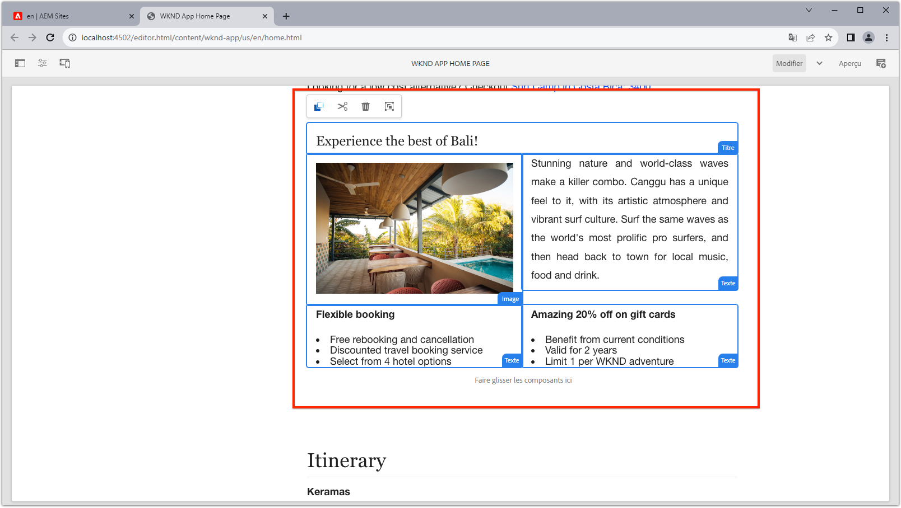

# Routes dynamiques et composants modifiables

Dans ce chapitre, nous autorisons deux itinéraires dynamiques de détails d&#39;aventure à prendre en charge les composants modifiables ; __Bali Surf Camp__ et __Beervana à Portland__.


L&#39;itinéraire SPA détails de l&#39;aventure est défini comme `/adventure:path` où `path` est le chemin de l&#39;aventure WKND (fragment de contenu) pour afficher des détails sur.

## Faire correspondre les URL SPA aux pages AEM

Dans les deux chapitres précédents, nous avons mappé le contenu des composants modifiables de la vue d&#39;accueil SPA à la page racine de SPA distante correspondante dans l&#39;AEM à `/content/wknd-app/us/en/`.

La définition du mappage pour les composants modifiables pour les itinéraires dynamiques SPA est similaire, mais nous devons trouver un schéma de mappage 1:1 entre les instances de l&#39;itinéraire et les pages AEM.

Dans ce didacticiel, nous allons prendre le nom du fragment de contenu d&#39;aventure WKND, qui est le dernier segment du chemin, et le mapper à un chemin simple sous `/content/wknd-app/us/en/adventure`.

| Route de SPA distante | Chemin de page AEM |
|------------------------------------|--------------------------------------------|
| / | /content/app/fr/fr/home |
| /aventure : /content/dam/wknd/fr/aventures/bali-surf-camp/__bali-surf-camp__ | /content/app/fr/home/adventure/__bali-surf-camp__ |
| /aventure : /content/dam/wknd/fr/aventures/beervana-portland/__beervana-portland__ | /content/wknd-app/us/fr/home/adventure/__beervana-in portland__ |

Ainsi, en nous basant sur cette cartographie, nous devons créer deux nouvelles pages AEM à l&#39;adresse :

+ `/content/wknd-app/us/en/home/adventure/bali-surf-camp`
+ `/content/wknd-app/us/en/home/adventure/beervana-in-portland`

## Mappage des SPA à distance

Le mappage des requêtes quittant le SPA distant est configuré via la configuration `setupProxy` effectuée dans [le Bootstrap SPA](./spa-bootstrap.md).

## Mappage de l’éditeur SPA

Le mappage pour les demandes SPA lorsque le SPA est ouvert via l’éditeur d’ est configuré via la configuration des mappages Sling effectuée dans [Configurer les ](./aem-configure.md).

## Création de pages de contenu dans AEM

Tout d&#39;abord, créez le segment de page `adventure` intermédiaire :

1. Connexion à AEM Author
1. Accédez à __Sites > WKND App > us > en > WKND App Page d&#39;accueil__
   + Cette page AEM est mise en correspondance en tant que racine du SPA, c’est donc là que nous commençons à construire la structure de pages de l’AEM pour les autres itinéraires de .
1. Appuyez sur __Créer__ et sélectionnez __Page__.
1. Sélectionnez le modèle __Page SPA distante__, puis appuyez sur __Suivant__.
1. Remplir les propriétés de la page
   + __Titre__ : Aventure
   + __Nom__ : `adventure`
      + Cette valeur définit l’URL de la page AEM et doit donc correspondre au segment d’itinéraire SPA.
1. Appuyez sur __Terminé__

Créez ensuite les pages AEM qui correspondent à chacune des URL SPA qui nécessitent des zones modifiables.

1. Accédez à la nouvelle page __Aventure__ de l&#39;administrateur du site.
1. Appuyez sur __Créer__ et sélectionnez __Page__.
1. Sélectionnez le modèle __Page SPA distante__, puis appuyez sur __Suivant__.
1. Remplir les propriétés de la page
   + __Titre__ : Bali Surf Camp
   + __Nom__ : `bali-surf-camp`
      + Cette valeur définit l’URL de la page AEM et doit donc correspondre au dernier segment de l’itinéraire SPA.
1. Appuyez sur __Terminé__
1. Répétez les étapes 3 à 6 pour créer la page __Beervana dans Portland__, avec :
   + __Titre__ : Beervana à Portland
   + __Nom__ : `beervana-in-portland`
      + Cette valeur définit l’URL de la page AEM et doit donc correspondre au dernier segment de l’itinéraire SPA.

Ces deux pages AEM contiennent le contenu écrit correspondant à leurs itinéraires SPA correspondants. Si d&#39;autres itinéraires SPA nécessitent la création, de nouvelles pages AEM doivent être créées à leur URL de base sous la page racine de la page de  distante (`/content/wknd-app/us/en/home`) dans l&#39;.

## Mise à jour de l’application WKND

Placons le composant `<AEMResponsiveGrid...>` créé dans le [dernier chapitre](./spa-container-component.md) dans notre composant `AdventureDetail` SPA, créant ainsi un conteneur modifiable.

### Placez le composant AEMResponsiveGrid SPA

Placer le `<AEMResponsiveGrid...>` dans le composant `AdventureDetail` crée un conteneur modifiable dans cette route. L&#39;astuce est que plusieurs itinéraires utilisent le composant `AdventureDetail` pour effectuer le rendu, nous devons ajuster dynamiquement l&#39;attribut `<AEMResponsiveGrid...>'s pagePath`. `pagePath` doit être dérivé pour pointer vers la page d&#39;AEM correspondante, en fonction de l&#39;aventure que l&#39;instance de route affiche.

1. Ouvrir et modifier `react-app/src/components/AdventureDetail.js`
1. Ajoutez la ligne suivante avant la deuxième instruction `AdventureDetail(..)'s` `return(..)` qui dérive le nom de l’aventure du chemin d’accès au fragment de contenu.

   ```
   ...
   // Get the last segment of the Adventure Content Fragment path to used to generate the pagePath for the AEMResponsiveGrid
   const adventureName = adventureData._path.split('/').pop();
   ...
   ```

1. Importez le composant `AEMResponsiveGrid` et placez-le au-dessus du composant `<h2>Itinerary</h2>`.
1. Définissez les attributs suivants sur le composant `<AEMResponsiveGrid...>`
   + `pagePath = '/content/wknd-app/us/en/home/adventure/${adventureName}'`
   + `itemPath = 'root/responsivegrid'`

   Cela indique au composant `AEMResponsiveGrid` de récupérer son contenu de la ressource AEM :

   + `/content/wknd-app/us/en/home/adventure/${adventureName}/jcr:content/root/responsivegrid`


Mettez à jour `AdventureDetail.js` avec les lignes suivantes :

```
...
import AEMResponsiveGrid from '../components/aem/AEMResponsiveGrid';
...

function AdventureDetail(props) {
    ...
    // Get the last segment of the Adventure Content Fragment path to used to generate the pagePath for the AEMResponsiveGrid
    const adventureName = adventureData._path.split('/').pop();

    return(
        ...
        <AEMResponsiveGrid 
            pagePath={`/content/wknd-app/us/en/home/adventure/${adventureName}`}
            itemPath="root/responsivegrid"/>
            
        <h2>Itinerary</h2>
        ...
    )
}
```

Le fichier `AdventureDetail.js` doit se présenter comme suit :


## Auteur du Conteneur en AEM

Avec le `<AEMResponsiveGrid...>` en place et son `pagePath` défini dynamiquement en fonction de l&#39;aventure générée, nous essayons de créer du contenu dans celui-ci.

1. Connexion à AEM Author
1. Accédez à __Sites > Application WKND > us > en__
1. ____ Modification de la  __page d’accueil de l’application__ WKND
   + Accédez à l&#39;itinéraire __Bali Surf Camp__ dans le SPA pour le modifier.
1. Sélectionnez __Prévisualisation__ dans le sélecteur de mode en haut à droite.
1. Appuyez sur la carte __Bali Surf Camp__ dans le SPA pour accéder à son itinéraire.
1. Sélectionnez __Modifier__ dans le sélecteur de mode.
1. Localisez la zone modifiable __Conteneur de mise en page__ juste au-dessus de l&#39;__Itinéraire__.
1. Ouvrez la __barre latérale de l’éditeur de page__, puis sélectionnez la __vue de composants__.
1. Faites glisser certains des composants activés dans le __Conteneur de mise en page__.
   + Image
   + Text (Texte)
   + Titre

   Et créer du matériel marketing promotionnel. Il pourrait ressembler à ceci :

   

1. ____ Prévisualiser vos modifications dans AEM Éditeur de page
1. Actualisez l’application WKND s’exécutant localement sur [http://localhost:3000](http://localhost:3000), accédez à la route __Bali Surf Camp__ pour voir les modifications créées !

   

Lors de la navigation vers un itinéraire détaillé d&#39;aventure qui ne comporte pas de page d&#39;AEM mappée, il n&#39;y aura aucune fonctionnalité de création sur cette instance d&#39;itinéraire. Pour activer la création sur ces pages, il vous suffit de créer une page AEM avec le nom correspondant sous la page __Aventure__ !

## Félicitations ! 

Félicitations ! Vous avez ajouté la capacité de création aux itinéraires dynamiques dans le SPA !

+ Ajouté le composant ResponsiveGrid du composant AEM React Editable sur un itinéraire dynamique
+ Création de pages AEM pour la prise en charge de la création de deux itinéraires spécifiques dans la SPA (Bali Surf Camp et Beervana à Portland)
+ Contenu créé sur le parcours dynamique du Bali Surf Camp !

Vous avez maintenant terminé d&#39;explorer les premières étapes de la façon dont AEM SPA Editor peut être utilisé pour ajouter des zones modifiables spécifiques à un SPA distant !


>[!NOTE]
>
>Restez à l&#39;écoute ! Ce didacticiel sera développé afin d’inclure les meilleures pratiques et recommandations de l’Adobe sur la manière de déployer la solution SPA Editor sur AEM en tant que Cloud Service et environnements de production.