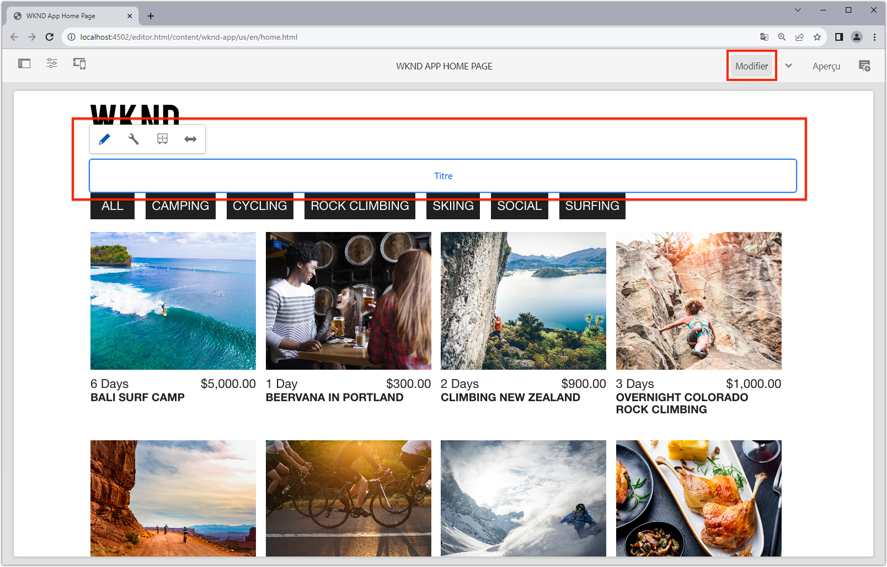

# Composants fixes modifiables

Les composants de réaction modifiable peuvent être &quot;fixes&quot; ou codés en dur dans les vues SPA. Cela permet aux développeurs de placer SPA composants compatibles avec l’éditeur dans les vues SPA et aux utilisateurs de créer le contenu des composants dans l’éditeur de .


Dans ce chapitre, nous remplaçons le titre de la vue d’accueil, &quot;Actuelles aventures&quot;, qui est un texte codé en dur dans `Home.js` par un composant de titre fixe mais modifiable. Les composants fixes garantissent l’emplacement du titre, mais permettent également la création du texte du titre et de le modifier en dehors du cycle de développement.

## Mise à jour de l’application WKND

Pour ajouter un composant fixe à la vue d’accueil :

+ Importez le composant AEM Réagir au titre du composant principal et enregistrez-le dans le type de ressource Titre du projet.
+ Placez le composant Titre modifiable sur la vue d’accueil SPA

### Importer dans le composant Titre du composant principal Réagir AEM

Dans la vue d’accueil SPA, remplacez le texte codé en dur `<h2>Current Adventures</h2>` par le composant Titre des composants principaux de réaction AEM. Avant de pouvoir utiliser le composant Titre, nous devons :

1. Importer le composant Titre à partir de `@adobe/aem-core-components-react-base`
1. Enregistrez-le à l’aide de `withMappable` afin que les développeurs puissent le placer dans le SPA
1. En outre, inscrivez-vous auprès de `MapTo` afin qu&#39;il puisse être utilisé dans le composant de conteneur [ultérieurement](./spa-container-component.md).

Pour ce faire :

1. Ouvrez le projet de SPA à distance à `~/Code/wknd-app/aem-guides-wknd-graphql/react-app` dans votre IDE.
1. Créer un composant React à `react-app/src/components/aem/AEMTitle.js`
1. Ajoutez le code suivant sur `AEMTitle.js`.

   ```
   // Import the withMappable API provided by the AEM SPA Editor JS SDK
   import { withMappable, MapTo } from '@adobe/aem-react-editable-components';
   
   // Import the AEM React Core Components' Title component implementation and it's Empty Function 
   import { TitleV2, TitleV2IsEmptyFn } from "@adobe/aem-core-components-react-base";
   
   // The sling:resourceType for which this Core Component is registered with in AEM
   const RESOURCE_TYPE = "wknd-app/components/title";
   
   // Create an EditConfig to allow the AEM SPA Editor to properly render the component in the Editor's context
   const EditConfig = {    
       emptyLabel: "Title",  // The component placeholder in AEM SPA Editor
       isEmpty: TitleV2IsEmptyFn, // The function to determine if this component has been authored
       resourceType: RESOURCE_TYPE // The sling:resourceType this component is mapped to
   };
   
   // MapTo allows the AEM SPA Editor JS SDK to dynamically render components added to SPA Editor Containers
   MapTo(RESOURCE_TYPE)(TitleV2, EditConfig);
   
   // withMappable allows the component to be hardcoded into the SPA; <AEMTitle .../>
   const AEMTitle = withMappable(TitleV2, EditConfig);
   
   export default AEMTitle;
   ```

Lisez les commentaires du code pour plus d’informations sur l’implémentation.

Le fichier `AEMTitle.js` doit se présenter comme suit :


### Utilisation du composant Réagir à AEMTitle

Maintenant que le composant Titre du composant principal Réagir AEM est enregistré dans l’application Réagir et que vous pouvez l’utiliser dans cette dernière, remplacez le texte de titre codé en dur sur la vue d’accueil.

1. Modifier `react-app/src/App.js`
1. dans la partie inférieure de `Home()`, remplacez le titre codé en dur par le nouveau composant `AEMTitle` :

   ```
   <h2>Current Adventures</h2>
   ```

   avec

   ```
   <AEMTitle
       pagePath='/content/wknd-app/us/en/home' 
       itemPath='root/title'/>
   ```

   Mettez à jour `Apps.js` avec le code suivant :

   ```
   ...
   import { AEMTitle } from './components/aem/AEMTitle';
   ...
   function Home() {
       return (
           <div className="Home">
   
               <AEMTitle
                   pagePath='/content/wknd-app/us/en/home' 
                   itemPath='root/title'/>
   
               <Adventures />
           </div>
       );
   }
   ```

Le fichier `Apps.js` doit se présenter comme suit :


## Création du composant Titre dans AEM

1. Connexion à AEM Author
1. Accédez à __Sites > Application WKND__
1. Appuyez sur __Accueil__ et sélectionnez __Modifier__ dans la barre d’actions supérieure.
1. Sélectionnez __Modifier__ dans le sélecteur de mode d’édition situé dans l’angle supérieur droit de l’éditeur de page.
1. Passez la souris sur le texte de titre par défaut sous le logo WKND et au-dessus de la liste aventures, jusqu’à ce que le contour bleu de modification s’affiche.
1. Appuyez sur pour afficher la barre d’action du composant, puis appuyez sur la __clé à molette__ pour modifier

   

1. Créez le composant Titre :
   + Titre : __WKND Adventures__
   + Type/Taille : __H2__

      

1. Appuyez sur __Terminé__ pour enregistrer
1. Prévisualisation de vos modifications dans AEM SPA Editor
1. Actualisez l’application WKND s’exécutant localement sur [http://localhost:3000](http://localhost:3000) et voyez les modifications de titre créées immédiatement répercutées.

   

## Félicitations ! 

Vous avez ajouté un composant fixe et modifiable à l’application WKND ! Vous savez maintenant :

+ Importer à partir d&#39;un composant AEM React Core dans le SPA et le réutiliser
+ Ajouter un composant fixe mais modifiable au SPA
+ Création du composant fixe dans AEM
+ Voir le contenu créé dans la SPA distante

## Étapes suivantes

Les étapes suivantes consistent à [ajouter un composant conteneur ResponsiveGrid AEM](./spa-container-component.md) à la SPA qui permet à l’auteur d’ajouter et de modifier des composants à la SPA !
