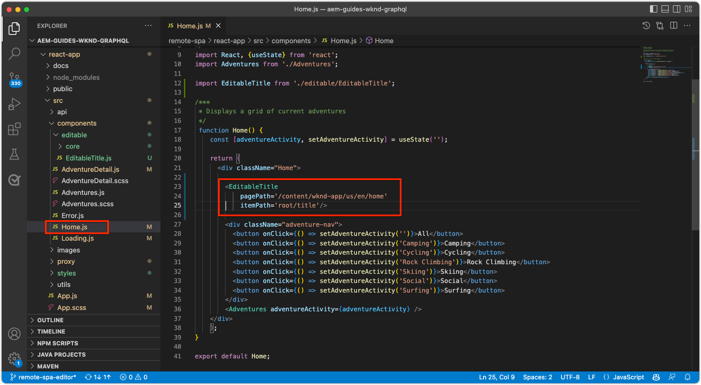

# Composants fixes modifiables

Les composants React modifiables peuvent être « fixés » ou codés en dur dans les vues de la SPA. Cela permet aux développeurs et développeuses de placer des composants compatibles avec l’éditeur de SPA dans les vues de la SPA et aux utilisateurs et utilisatrices de créer le contenu des composants dans l’éditeur de SPA d’AEM.


Dans ce chapitre, nous remplaçons le titre de la vue d’accueil, « Current Adventures », un texte codé en dur dans `Home.js`, par un composant de titre fixe, mais modifiable. Les composants fixes garantissent le placement du titre, mais permettent également la création du texte du titre et sa modification en dehors du cycle de développement.

## Mettre à jour l’application WKND

Pour ajouter un composant __fixe__ à la vue d’accueil :

+ Créez un composant personnalisé de titre modifiable et enregistrez-le dans le type de ressource Titre du projet.
+ Placez le composant de titre modifiable dans la vue d’accueil de la SPA.

### Créez un composant de titre React modifiable.

Dans la vue d’accueil de la SPA, remplacez le texte codé en dur `<h2>Current Adventures</h2>` par un composant de titre modifiable personnalisé. Avant de pouvoir utiliser le composant de titre, nous devons :

1. créer un composant personnalisé de titre React ;
1. décorer le composant personnalisé de titre à l’aide de méthodes issues de `@adobe/aem-react-editable-components` pour le rendre modifiable ;
1. enregistrer le composant de titre modifiable avec `MapTo` afin qu’il puisse être utilisé dans le [composant de conteneur ultérieurement](./spa-container-component.md).

Pour ce faire :

1. Ouvrez le projet de SPA distante à l’adresse `~/Code/aem-guides-wknd-graphql/remote-spa-tutorial/react-app` dans votre IDE.
1. Créez un composant React sous `react-app/src/components/editable/core/Title.js`.
1. Ajoutez le code suivant à `Title.js`.

   ```javascript
   import React from 'react'
   import { RoutedLink } from "./RoutedLink";
   
   const TitleLink = (props) => {
   return (
       <RoutedLink className={props.baseCssClass + (props.nested ? '-' : '__') + 'link'} 
           isRouted={props.routed} 
           to={props.linkURL}>
       {props.text}
       </RoutedLink>
   );
   };
   
   const TitleV2Contents = (props) => {
       if (!props.linkDisabled) {
           return <TitleLink {...props} />
       }
   
       return <>{props.text}</>
   };
   
   export const Title = (props) => {
       if (!props.baseCssClass) {
           props.baseCssClass = 'cmp-title'
       }
   
       const elementType = (!!props.type) ? props.type.toString() : 'h3';
       return (<div className={props.baseCssClass}>
           {
               React.createElement(elementType, {
                       className: props.baseCssClass + (props.nested ? '-' : '__') + 'text',
                   },
                   <TitleV2Contents {...props} />
               )
           }
   
           </div>)
   }
   
   export const titleIsEmpty = (props) => props.text == null || props.text.trim().length === 0
   ```

   Notez que ce composant React n’est pas encore modifiable à l’aide de l’éditeur de SPA d’AEM. Ce composant de base sera rendu modifiable à l’étape suivante.

   Lisez les commentaires du code pour plus d’informations sur l’implémentation.

1. Créez un composant React sous `react-app/src/components/editable/EditableTitle.js`.
1. Ajoutez le code suivant à `EditableTitle.js`.

   ```javascript
   // Import the withMappable API provided bu the AEM SPA Editor JS SDK
   import { EditableComponent, MapTo } from '@adobe/aem-react-editable-components';
   import React from 'react'
   
   // Import the AEM the Title component implementation and it's Empty Function
   import { Title, titleIsEmpty } from "./core/Title";
   import { withConditionalPlaceHolder } from "./core/util/withConditionalPlaceholder";
   import { withStandardBaseCssClass } from "./core/util/withStandardBaseCssClass";
   
   // The sling:resourceType of the AEM component used to collected and serialize the data this React component displays
   const RESOURCE_TYPE = "wknd-app/components/title";
   
   // Create an EditConfig to allow the AEM SPA Editor to properly render the component in the Editor's context
   const EditConfig = {
       emptyLabel: "Title",        // The component placeholder in AEM SPA Editor
       isEmpty: titleIsEmpty,      // The function to determine if this component has been authored
       resourceType: RESOURCE_TYPE // The sling:resourceType this component is mapped to
   };
   
   export const WrappedTitle = (props) => {
       const Wrapped = withConditionalPlaceHolder(withStandardBaseCssClass(Title, "cmp-title"), titleIsEmpty, "TitleV2")
       return <Wrapped {...props} />
   }
   
   // EditableComponent makes the component editable by the AEM editor, either rendered statically or in a container
   const EditableTitle = (props) => <EditableComponent config={EditConfig} {...props}><WrappedTitle /></EditableComponent>
   
   // MapTo allows the AEM SPA Editor JS SDK to dynamically render components added to SPA Editor Containers
   MapTo(RESOURCE_TYPE)(EditableTitle);
   
   export default EditableTitle;
   ```

   Ce composant `EditableTitle` React recouvre le composant `Title` React, en l’enveloppant et en le décorant pour qu’il soit modifiable dans l’éditeur de SPA d’AEM.

### Utiliser le composant de titre modifiable React

Maintenant que le composant de titre modifiable React est enregistré et disponible pour être utilisé dans l’application React, remplacez le texte du titre codé en dur sur la vue d’accueil.

1. Modifier `react-app/src/components/Home.js`
1. Dans l’élément `Home()` en bas, importez `EditableTitle` et remplacez le titre codé en dur par le nouveau composant `AEMTitle` :

   ```javascript
   ...
   import EditableTitle from './editable/EditableTitle';
   ...
   function Home() {
       return (
           <div className="Home">
   
           <EditableTitle
               pagePath='/content/wknd-app/us/en/home'
               itemPath='root/title'/>
   
               <Adventures />
           </div>
       );
   }
   ```

Le fichier `Home.js` doit se présenter comme suit :



## Créer le composant de titre dans AEM

1. Connectez-vous au service de création AEM.
1. Accédez à __Sites > Application WKND__.
1. Appuyez sur __Accueil__ et sélectionnez __Modifier__ à partir de la barre d’actions supérieure.
1. Sélectionnez __Modifier__ dans le sélecteur de mode d’édition en haut à droite de l’éditeur de page.
1. Pointez sur le texte de titre par défaut sous le logo WKND et au-dessus de la liste des Adventures, jusqu’à ce que le contour de modification bleu s’affiche.
1. Appuyez dessus pour afficher la barre d’actions du composant, puis sur la __clé à molette__ pour le modifier.

   

1. Créez le composant de titre :
   + Titre : __WKND Adventures__
   + Type/Taille : __H2__

     

1. Appuyez sur __Terminé__ pour enregistrer.
1. Prévisualisez vos modifications dans l’éditeur de SPA d’AEM.
1. Actualisez l’application WKND exécutée localement sur [http://localhost:3000](http://localhost:3000) et constatez les modifications du titre immédiatement répercutées.

   

## Félicitations.

Vous avez ajouté un composant fixe et modifiable à l’application WKND. Vous savez maintenant comment :

+ Créer un composant fixe, mais modifiable, dans la SPA
+ Créer le composant fixe dans AEM
+ Voir le contenu créé dans la SPA distante.

## Étapes suivantes

Les étapes suivantes consistent à [ajouter un composant de conteneur d’AEM ResponsiveGrid](./spa-container-component.md) à la SPA qui permet aux créateurs et créatrices d’ajouter des composants modifiables à la SPA.
