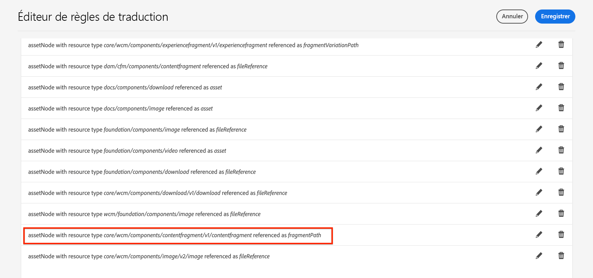

# Prise en charge de la traduction des fragments de contenu AEM {#translation-support-content-fragments}

Découvrez comment les fragments de contenu peuvent être localisés et traduits avec Adobe Experience Manager. Les ressources multimédias mixtes associées à un fragment de contenu peuvent également être extraites et traduites.

>[!VIDEO](https://video.tv.adobe.com/v/18131?quality=12&learn=on)

## Cas d’utilisation de la traduction de fragments de contenu {#content-fragment-translation-use-cases}

Les fragments de contenu sont un type de contenu reconnu qu’AEM extrait pour les envoyer à un service de traduction externe. Plusieurs cas d’utilisation sont pris en charge par défaut :

1. Un fragment de contenu peut être [sélectionné directement dans la console Ressources pour la traduction et la copie de la langue](https://experienceleague.adobe.com/docs/experience-manager-cloud-service/content/assets/admin/translate-assets.html?lang=fr).
2. Les fragments de contenu référencés sur une page Sites sont copiés dans le dossier de langue approprié et extraits pour traduction lorsque la page Sites est sélectionnée pour la copie de langue.
3. Les ressources multimédias intégrées à un fragment de contenu peuvent être extraites et traduites.
4. Les collections de ressources associées à un fragment de contenu peuvent être extraites et traduites.

## Éditeur de règles de traduction {#translation-rules-editor}

Le comportement de traduction d’Experience Manager peut être mis à jour à l’aide de l’**Éditeur de règles de traduction**. Pour mettre à jour la traduction, accédez à **Outils** > **Général** > **Configuration de traduction** sur [http://localhost:4502/libs/cq/translation/translationrules/contexts.html](http://localhost:4502/libs/cq/translation/translationrules/contexts.html).

Les configurations prêtes à l’emploi font référence à des fragments de contenu à l’adresse `fragmentPath` avec un type de ressource de `core/wcm/components/contentfragment/v1/contentfragment`. Tous les composants qui héritent du `v1/contentfragment` sont reconnus par la configuration par défaut.

