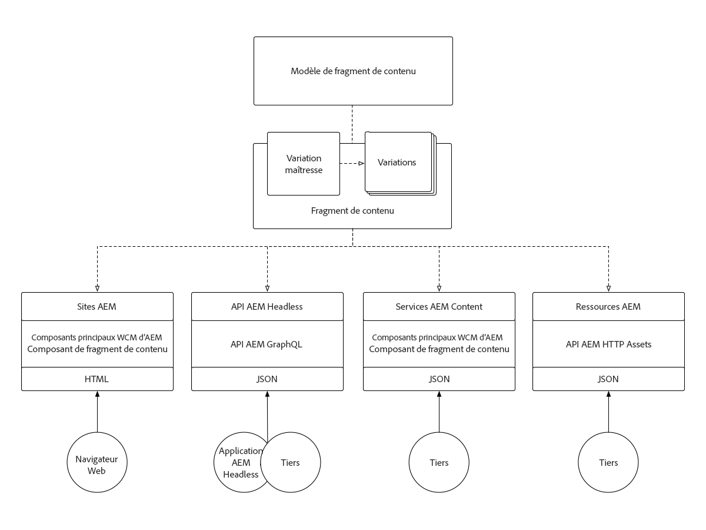
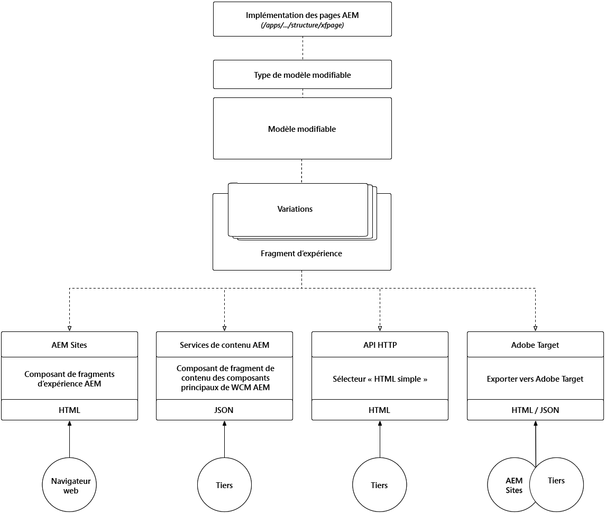

# Comprendre les fragments de contenu et les fragments d’expérience

La mise en page de fragments de contenu et de fragments d’expérience peut sembler similaire en surface, mais chacun joue un rôle clé dans différents cas d’utilisation. Découvrez comment les fragments de contenu et les fragments d’expérience sont similaires, différents et quand et comment les utiliser.

## Comparaison des fragments de contenu et des fragments d’expérience

<table>
<tbody><tr><td><strong> </strong></td>
<td><strong>Fragments de contenu (CF)</strong></td>
<td><strong>Fragments d’expérience (XF)</strong></td>
</tr><tr><td><strong>Définition</strong></td>
<td><ul>
<li>Réutilisable, indépendante de la présentation <strong>contenu</strong>, composé d'éléments de données structurés (texte, dates, références, etc.)</li>
</ul>
</td>
<td><ul>
<li>Composante réutilisable d’un ou de plusieurs composants AEM définissant le contenu et la présentation qui forme une <strong>expérience</strong> logique à elle seule</li>
</ul>
</td>
</tr><tr><td><strong>Locataires principaux</strong></td>
<td><ul>
<li>Axé sur le contenu</li>
<li>Défini par un modèle de données <a href="https://helpx.adobe.com/experience-manager/6-5/assets/using/content-fragments-models.html" target="_blank">structuré, basé sur des formulaires.</a></li>
<li>Indépendante de la conception et de la mise en page.</li>
<li>Le canal est propriétaire de la présentation du contenu du fragment de contenu (mise en page et conception).</li>
</ul>
</td>
<td><ul>
<li>Axé sur la présentation</li>
<li>Défini par la composition non structurée des composants AEM</li>
<li>Définit la conception et la disposition du contenu</li>
<li>Utilisé "en l’état" dans les canaux</li>
</ul>
</td>
</tr><tr><td><strong>Détails techniques</strong></td>
<td><ul>
<li>Implémenté en tant que <strong>barrage:Asset</strong></li>
<li>Défini par un <a href="https://helpx.adobe.com/experience-manager/6-5/assets/using/content-fragments-models.html" target="_blank">modèle de fragment de contenu</a></li>
</ul>
</td>
<td><ul>
<li>Implémenté en tant que <strong>cq:Page</strong></li>
<li>Défini par des modèles modifiables</li>
<li>Rendu HTML natif</li>
</ul>
</td>
</tr><tr><td><strong>Variations</strong></td>
<td><ul>
<li>La variation du Principal est la variation canonique</li>
<li>Les variations sont spécifiques au cas d’utilisation, ce qui peut s’aligner sur les canaux.</li>
</ul>
</td>
<td><ul>
<li>Les variations sont spécifiques au canal ou au contexte</li>
<li>Les variations sont conservées synchronisées via AEM Live Copy</li>
<li><a href="https://helpx.adobe.com/experience-manager/6-5/sites/authoring/using/experience-fragments.html#BuildingBlocks" target="_blank">Réutilisation du contenu </a> à diffusion de blocs dans différentes variantes</li>
</ul>
</td>
</tr><tr><td><strong>Fonctions</strong></td>
<td><ul>
<li>Variations</li>
<li>Versions</li>
<li> Synchronisation du contenu entre les variations</li>
<li><a href="https://helpx.adobe.com/experience-manager/6-5/assets/using/content-fragments-managing.html#ComparingFragmentVersions" target="_blank">Diffusion visuelle </a> des versions de fragments de contenu</li>
<li> Annotations d’éléments de texte multilignes</li>
<li><a href="https://helpx.adobe.com/experience-manager/6-5/assets/using/content-fragments-variations.html#SummarizingText" target="_blank">synthèse </a> intelligente des éléments de texte multilignes.</li>
<li><a href="https://helpx.adobe.com/experience-manager/6-5/assets/using/creating-translation-projects-for-content-fragments.html" target="_blank">Traduction/localisation</a></li>
</ul>
</td>
<td><ul>
<li>Variations</li>
<li>Variations en tant que Live Copies</li>
<li>Versions</li>
<li><a href="https://helpx.adobe.com/experience-manager/6-5/sites/authoring/using/experience-fragments.html#BuildingBlocks" target="_blank">Blocs de création</a></li>
<li>Annotations</li>
<li>Disposition et prévisualisation réactives</li>
<li>Traduction/localisation</li>
</ul>
</td>
</tr><tr><td><strong>Utilisation</strong></td>
<td><ul>
<li><a href="https://docs.adobe.com/content/help/en/experience-manager-core-components/using/components/content-fragment-component.html" target="_blank">aem composants principaux </a> du composant Fragment de contenu pour une utilisation dans AEM Sites, AEM Screens ou dans les fragments d’expérience.</li>
<li>Exportation JSON via <a href="https://helpx.adobe.com/experience-manager/kt/sites/using/content-services-tutorial-use.html" target="_blank">AEM Content Services</a> pour une consommation tierce</li>
<li>JSON via AEM API HTTP Assets pour une consommation tierce.</li>
</ul>
</td>
<td><ul>
<li>Composant AEM Fragment d’expérience à utiliser dans AEM Sites, AEM Screens ou d’autres fragments d’expérience.</li>
<li>Exporter en <a href="https://helpx.adobe.com/experience-manager/6-5/sites/authoring/using/experience-fragments.html#ThePlainHTMLRendition" target="_blank">HTML simple</a> pour une utilisation par des systèmes tiers</li>
<li><a href="https://helpx.adobe.com/experience-manager/6-5/sites/administering/using/experience-fragments-target.html" target="_blank">Exportation HTML vers le </a> ciblage d’Adobe pour les offres ciblées</li>
<li>Exportation JSON vers Adobe Target pour les offres ciblées</li>
</ul>
</td>
</tr><tr><td><strong>Cas d’utilisation courants</strong></td>
<td><ul>
<li>Contenu de saisie de données/formulaire hautement structuré</li>
<li>Contenu éditorial de forme longue (élément multiligne)</li>
<li>Contenu géré en dehors du cycle de vie des canaux qui le délivrent</li>
</ul>
</td>
<td><ul>
<li>Gestion centralisée des supports promotionnels à plusieurs canaux à l'aide de variations par canal.</li>
<li>Contenu réutilisé sur plusieurs pages d'un site Web.</li>
<li>chrome du site Web (ex. en-tête et pied de page)</li>
<li>Expérience gérée en dehors du cycle de vie des canaux qui la délivrent</li>
</ul>
</td>
</tr><tr><td><strong>Documentation</strong></td>
<td><ul>
<li><a href="https://helpx.adobe.com/experience-manager/6-5/assets/user-guide.html?topic=/experience-manager/6-5/assets/morehelp/content-fragments.ug.js" target="_blank">Guide de l’utilisateur des fragments de contenu AEM</a></li>
<li><a href="https://helpx.adobe.com/experience-manager/kt/sites/using/content-fragments-feature-video-use.html" target="_blank">Utilisation de fragments de contenu dans AEM</a></li>
</ul>
</td>
<td><ul>
<li><a href="https://helpx.adobe.com/experience-manager/6-5/sites/authoring/using/experience-fragments.html" target="_blank">Documentation sur l’Adobe des fragments d’expérience</a></li>
</ul>
</td>
</tr></tbody></table>

## Architecture des fragments de contenu

Le diagramme suivant illustre l&#39;architecture globale des fragments de contenu AEM

!

+ **Les** modèles de fragments de contenu définissent les éléments (ou les champs) qui définissent le contenu que le fragment de contenu peut capturer et exposer.
+ Le **fragment de contenu** est une instance d&#39;un modèle de fragment de contenu qui représente une entité de contenu logique.
+ Cependant, les variations **variations** du fragment de contenu adhèrent au modèle de fragment de contenu, mais présentent des variations de contenu.
+ Les fragments de contenu peuvent être exposés/consommés par :
   + Utilisation de fragments de contenu sur **AEM Sites** (ou AEM Screens) via le composant Fragment de contenu des composants principaux de la gestion de contenu Web AEM.
   + Incorporation d’un fragment de contenu dans un **fragment d’expérience** via le composant Fragment de contenu des composants principaux de la gestion de contenu Web , en vue de son utilisation dans n’importe quel cas d’utilisation du fragment d’expérience.
   + L’exposition d’un fragment de contenu modifie le contenu en tant que JSON via **AEM Content Services** et les pages d’API pour les cas d’utilisation en lecture seule.
   + Exposition directe du contenu du fragment de contenu (toutes les variations) au format JSON par le biais d’appels directs à AEM Assets via l’**API HTTP AEM Assets** pour les cas d’utilisation de CRUD.

## Architecture des fragments d’expérience

!

+ **Les modèles** modifiables, qui sont à leur tour définis par le  **type de modèle** modifiable et une implémentation **de composant de page** AEM, définissent les composants AEM autorisés qui peuvent être utilisés pour composer un fragment d’expérience.
+ Le **fragment d’expérience** est une instance d’un modèle modifiable qui représente une expérience logique.
+ Les variations **du fragment d’expérience** adhèrent au modèle modifiable, mais présentent des variations d’expérience (contenu et conception).
+ Les fragments d’expérience peuvent être exposés/consommés par :
   + Utilisation de fragments d’expérience sur AEM Sites (ou AEM Screens) via le composant AEM Fragment d’expérience.
   + L’exposition d’un fragment d’expérience modifie le contenu en tant que JSON (avec du code HTML incorporé) via **AEM Content Services** et les pages d’API.
   + Exposition directe d’une variation de fragment d’expérience sous la forme **&quot;HTML ordinaire&quot;**.
   + Exportation de fragments d’expérience vers **Adobe Target** en tant qu’offres HTML ou JSON.
   + AEM Sites prend nativement en charge les offres HTML. Toutefois, les offres JSON nécessitent un développement personnalisé.

## Documents de prise en charge pour les fragments de contenu

+ [Guide de l’utilisateur des fragments de contenu](https://helpx.adobe.com/experience-manager/6-5/assets/user-guide.html?topic=/experience-manager/6-5/assets/morehelp/content-fragments.ug.js)
+ [Utilisation de fragments de contenu dans AEM](https://helpx.adobe.com/experience-manager/kt/sites/using/content-fragments-feature-video-use.html)
+ [Composant Fragment de contenu des composants principaux de WCM AEM](https://docs.adobe.com/content/help/fr-FR/experience-manager-core-components/using/components/content-fragment-component.html)
+ [Utilisation de fragments de contenu et AEM Content Services](https://helpx.adobe.com/experience-manager/kt/sites/using/structured-fragments-content-services-feature-video-use.html)
+ [Prise en main de AEM Content Services](https://helpx.adobe.com/experience-manager/kt/sites/using/content-services-tutorial-use.html)

## Documents d’aide pour les fragments d’expérience

+ [Documentation sur l’Adobe des fragments d’expérience](https://helpx.adobe.com/experience-manager/6-5/sites/authoring/using/experience-fragments.html)
+ [Présentation des fragments d’expérience AEM](https://helpx.adobe.com/experience-manager/kt/sites/using/experience-fragments-feature-video-understand.html)
+ [Utilisation de fragments d’expérience AEM](https://helpx.adobe.com/experience-manager/kt/sites/using/experience-fragments-feature-video-use.html)
+ [Utilisation de fragments d’expérience AEM avec Adobe Target](https://medium.com/adobetech/experience-fragments-and-adobe-target-d8d74381b9b2)
