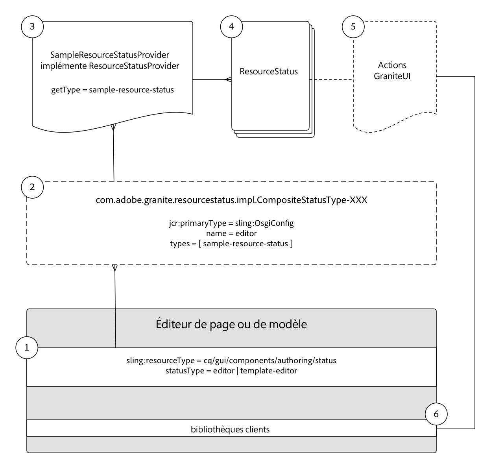

# Développement des états des ressources {#developing-resource-statuses-in-aem-sites}

Adobe Experience Manager Resource Status API&#39;s est une structure enfichable permettant d&#39;exposer les messages d&#39;état dans AEM différentes interfaces Web d&#39;éditeur.

## Présentation {#overview}

La structure Resource Status for Editors fournit des API côté serveur et côté client pour l’affichage et l’interaction avec les états d’éditeur, de manière standard et uniforme.

Les barres d’état de l’éditeur sont nativement disponibles dans les éditeurs Page, Fragment d’expérience et Modèle d’AEM.

Les exemples d&#39;utilisation pour les fournisseurs d&#39;état de ressource personnalisés sont les suivants :

* Notification aux auteurs lorsqu’une page se trouve dans les 2 heures suivant l’activation planifiée
* Notification aux auteurs qu’une page a été activée au cours des 15 dernières minutes
* Notification aux auteurs qu’une page a été modifiée au cours des 5 dernières minutes et par qui


## Structure du fournisseur d&#39;état des ressources {#resource-status-provider-framework}

Lors de l’élaboration d’états de ressources personnalisés, le travail de développement comprend :

1. Implémentation de ResourceStatusProvider, chargée de déterminer si un état est requis, et les informations de base sur l&#39;état : titre, message, priorité, variante, icône et actions disponibles.
2. Le cas échéant, GraniteUI JavaScript implémente la fonctionnalité de toutes les actions disponibles.

   

3. La ressource d’état fournie dans le cadre des éditeurs Page, Fragment d’expérience et Modèle reçoit un type via la propriété &quot;[!DNL statusType]&quot; des ressources.

   * Editeur de page : `editor`
   * Editeur de fragments d’expérience : `editor`
   * Éditeur de modèles: `template-editor`

4. La propriété `statusType` de la ressource d&#39;état correspond à la propriété `CompositeStatusType` OSGi configurée `name` enregistrée.

   Pour toutes les correspondances, les types `CompositeStatusType's` sont collectés et utilisés pour collecter les implémentations `ResourceStatusProvider` de ce type, via `ResourceStatusProvider.getType()`.

5. La correspondance `ResourceStatusProvider` est transmise à `resource` dans l&#39;éditeur et détermine si `resource` a l&#39;état à afficher. Si l’état est nécessaire, cette implémentation est responsable de la création de 0 ou de plusieurs `ResourceStatuses` à renvoyer, chacun représentant un état à afficher.

   En règle générale, un `ResourceStatusProvider` renvoie 0 ou 1 `ResourceStatus` par `resource`.

6. ResourceStatus est une interface qui peut être implémentée par le client, ou le `com.day.cq.wcm.commons.status.EditorResourceStatus.Builder` utile peut être utilisé pour construire un état. Un état comprend :

   * Title (Titre)
   * Message
   * Icône
   * Variante
   * Priorité
   * Actions 
   * Données

7. Si `Actions` est fourni pour l&#39;objet `ResourceStatus`, les clientlibs pris en charge sont nécessaires pour lier la fonctionnalité aux liens d&#39;action dans la barre d&#39;état.

   ```js
   (function(jQuery, document) {
       'use strict';
   
       $(document).on('click', '.editor-StatusBar-action[data-status-action-id="do-something"]', function () {
           // Do something on the click of the resource status action
   
       });
   })(jQuery, document);
   ```

8. Tout code JavaScript ou CSS prenant en charge pour prendre en charge les actions doit être propagé par les bibliothèques clientes respectives de chaque éditeur afin de s’assurer que le code frontal est disponible dans l’éditeur.

   * Catégorie de l&#39;éditeur de page : `cq.authoring.editor.sites.page`
   * Catégorie de l’éditeur de fragments d’expérience : `cq.authoring.editor.sites.page`
   * Catégorie de l’éditeur de modèles : `cq.authoring.editor.sites.template`

## Vue du code {#view-the-code}

[Voir le code sur GitHub](https://github.com/Adobe-Consulting-Services/acs-aem-samples/tree/master/bundle/src/main/java/com/adobe/acs/samples/resourcestatus/impl/SampleEditorResourceStatusProvider.java)

## Ressources supplémentaires {#additional-resources}

* [`com.adobe.granite.resourcestatus` JavaDocs](https://helpx.adobe.com/experience-manager/6-5/sites/developing/using/reference-materials/javadoc/com/adobe/granite/resourcestatus/package-summary.html)
* [`com.day.cq.wcm.commons.status.EditorResourceStatus` JavaDocs](https://helpx.adobe.com/experience-manager/6-5/sites/developing/using/reference-materials/javadoc/com/day/cq/wcm/commons/status/EditorResourceStatus.html)
