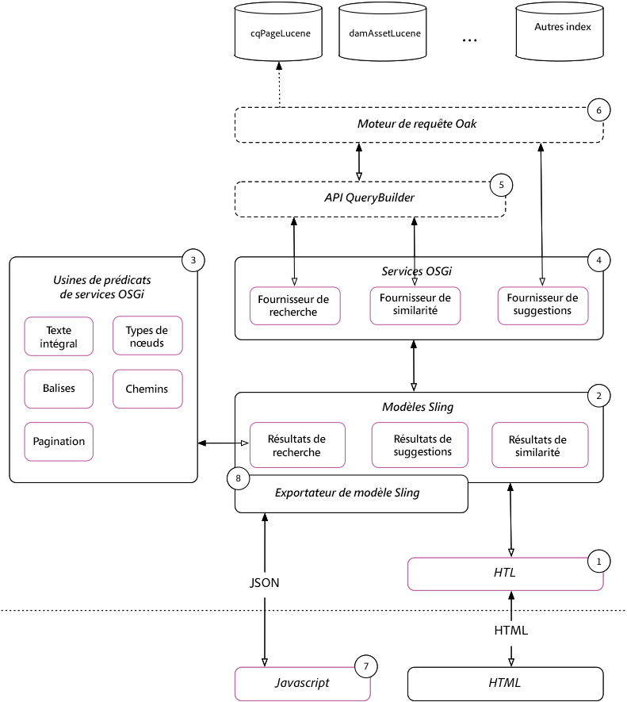

# Guide de mise en oeuvre de la recherche simple{#simple-search-implementation-guide}

La mise en oeuvre de la recherche simple est le matériel du laboratoire **Adobe Summit AEM Recherche Demystified**. Cette page contient les matériaux de ce laboratoire. Pour une visite guidée du laboratoire, veuillez vue le cahier de travail du laboratoire dans la section Présentation de cette page.



## Documents de présentation {#bookmarks}

* [Classeur de laboratoire](assets/l4080/l4080-lab-workbook.pdf)
* [Présentation](assets/l4080/l4080-presentation.pdf)

## Signets {#bookmarks-1}

### Outils {#tools}

* [Gestionnaire d’index](http://localhost:4502/libs/granite/operations/content/diagnosis/tool.html/granite_oakindexmanager)
* [Expliquer la requête](http://localhost:4502/libs/granite/operations/content/diagnosis/tool.html/granite_queryperformance)
* [CRXDE Lite](http://localhost:4502/crx/de/index.jsp#/oak%3Aindex/cqPageLucene) > /oak:index/cqPageLucene
* [CRX Package Manager](http://localhost:4502/crx/packmgr/index.jsp)
* [Débogueur QueryBuilder](http://localhost:4502/libs/cq/search/content/querydebug.html?)
* [Générateur de définitions d’index Oak](https://oakutils.appspot.com/generate/index)

### Chapitres {#chapters}

*Les liens de chapitre ci-dessous supposent que les  [packages ](#initialpackages) initiaux sont installés sur AEM Author dans`http://localhost:4502`*

* [Chapitre 1](http://localhost:4502/editor.html/content/summit/l4080/chapter-1.html)
* [Chapitre 2](http://localhost:4502/editor.html/content/summit/l4080/chapter-2.html)
* [Chapitre 3](http://localhost:4502/editor.html/content/summit/l4080/chapter-3.html)
* [Chapitre 4](http://localhost:4502/editor.html/content/summit/l4080/chapter-4.html)
* [Chapitre 5](http://localhost:4502/editor.html/content/summit/l4080/chapter-5.html)
* [Chapitre 6](http://localhost:4502/editor.html/content/summit/l4080/chapter-6.html)
* [Chapitre 7](http://localhost:4502/editor.html/content/summit/l4080/chapter-7.html)
* [Chapitre 8](http://localhost:4502/editor.html/content/summit/l4080/chapter-8.html)
* [Chapitre 9](http://localhost:4502/editor.html/content/summit/l4080/chapter-9.html)

## Modules {#packages}

### Packages initiaux {#initial-packages}

* [Balises](assets/l4080/summit-tags.zip)
* [Package d&#39;application de recherche simple](assets/l4080/simple.ui.apps-0.0.1-snapshot.zip)

### Packages de chapitre {#chapter-packages}

* [Solution du chapitre 1](assets/l4080/l4080-chapter1.zip)
* [Solution du chapitre 2](assets/l4080/l4080-chapter2.zip)
* [Solution du chapitre 3](assets/l4080/l4080-chapter3.zip)
* [Solution du chapitre 4](assets/l4080/l4080-chapter4.zip)
* [Configuration du chapitre 5](assets/l4080/l4080-chapter5-setup.zip)
* [Solution du chapitre 5](assets/l4080/l4080-chapter5-solution.zip)
* [Solution du chapitre 6](assets/l4080/l4080-chapter6.zip)
* [Solution du chapitre 9](assets/l4080/l4080-chapter9.zip)

## Documents référencés {#reference-materials}

* [Référentiel Github](https://github.com/Adobe-Marketing-Cloud/aem-guides/tree/master/simple-search-guide)
* [Modèles Sling](https://sling.apache.org/documentation/bundles/models.html)
* [Exportateur de modèle Sling](https://sling.apache.org/documentation/bundles/models.html#exporter-framework-since-130)
* [API QueryBuilder](https://docs.adobe.com/docs/en/aem/6-2/develop/search/querybuilder-api.html)
* [AEM Module externe](https://chrome.google.com/webstore/detail/aem-chrome-plug-in/ejdcnikffjleeffpigekhccpepplaode)  Chrome (page[ ](https://adobe-consulting-services.github.io/acs-aem-tools/aem-chrome-plugin/)Documentation)

## Corrections et suivi {#corrections-and-follow-up}

Corrections et clarifications des discussions de laboratoire et réponses aux questions de suivi des participants.

1. **Comment arrêter la réindexation ?**

   La réindexation peut être arrêtée via le MBean IndexStats disponible via [AEM console Web > JMX](http://localhost:4502/system/console/jmx)

   * [http://localhost:4502/system/console/jmx/org.apache.jackrabbit.oak%3Aname%3Dasync%2Ctype%3DIndexStats](http://localhost:4502/system/console/jmx/org.apache.jackrabbit.oak%3Aname%3Dasync%2Ctype%3DIndexStats)
      * Exécutez `abortAndPause()` pour abandonner la réindexation. Cela verrouillera l&#39;index pour une nouvelle ré-indexation jusqu&#39;à ce que `resume()` soit appelé.
      * L&#39;exécution de `resume()` redémarre le processus d&#39;indexation.
   * Documentation : [https://jackrabbit.apache.org/oak/docs/query/indexing.html#async-index-mbean](https://jackrabbit.apache.org/oak/docs/query/indexing.html#async-index-mbean)

2. **Comment les index de chêne peuvent-ils supporter plusieurs locataires ?**

   Oak prend en charge le placement des index dans l&#39;arborescence de contenu, et ces index ne s&#39;indexeront qu&#39;à l&#39;intérieur de cette sous-arborescence. Par exemple, **`/content/site-a/oak:index/cqPageLucene`** peut être créé pour indexer le contenu uniquement sous **`/content/site-a`.**

   Une approche équivalente consiste à utiliser les propriétés **`includePaths`** et **`queryPaths`** sur un index sous **`/oak:index`**. Par exemple :

   * `/oak:index/siteAcqPageLucene@includePaths=/content/site-a`
   * `/oak:index/siteAcqPageLucene@queryPaths=/content/site-a`

   Cette approche tient compte des points suivants :

   * Les requêtes DOIVENT spécifier une restriction de chemin égale à l&#39;étendue de chemin de requête de l&#39;index, ou y être descendantes.
   * Les index à portée plus large (par exemple `/oak:index/cqPageLucene`) indexent ÉGALEMENT les données, ce qui entraîne l&#39;assimilation en double et le coût d&#39;utilisation du disque.
   * Peut nécessiter une gestion de configuration en double (ex. ajout de la même variable indexRules sur plusieurs index de clients s&#39;ils doivent satisfaire aux mêmes jeux de requêtes)
   * Cette approche est mieux servie sur le niveau de publication AEM pour la recherche de site personnalisée, car sur AEM Author, il est courant que les requêtes soient exécutées en hauteur dans l’arborescence de contenu pour différents locataires (par exemple, via OmniSearch). Différentes définitions d’index peuvent entraîner un comportement différent en fonction de la restriction de chemin d’accès.


3. **Où est la liste de tous les analyseurs disponibles ?**

   Oak expose un ensemble d&#39;éléments de configuration de l&#39;analyseur lucene-fournit à utiliser dans AEM.

   * [Documentation d’Apache Oak Analytics](http://jackrabbit.apache.org/oak/docs/query/lucene.html#analyzers)
      * [Tokenizers](https://cwiki.apache.org/confluence/display/solr/Tokenizers)
      * [Filtres](https://cwiki.apache.org/confluence/display/solr/Filter+Descriptions)
      * [CharFilters](https://cwiki.apache.org/confluence/display/solr/CharFilterFactories)

4. **Comment rechercher des pages et des ressources dans la même requête ?**

   La nouvelle version de l’AEM 6.3 permet de requête pour plusieurs types de noeud dans la même requête fournie. La requête QueryBuilder suivante. Notez que chaque &quot;sous-requête&quot; peut être résolue à son propre index. Dans cet exemple, la sous-requête `cq:Page` est réglée sur `/oak:index/cqPageLucene` et la sous-requête `dam:Asset` sur `/oak:index/damAssetLucene`.

   ```plain
   group.p.or=true
   group.1_group.type=cq:Page
   # add all page restrictions to this group
   group.2_group.type=dam:Asset
   # add all asset restrictions to this group
   ```

   génère les résultats suivants dans le plan de requête et de requête :

   ```plain
   QUERY:(//element(*, cq:Page) | //element(*, dam:Asset))
   
   PLAN: [cq:Page] as [a] /* lucene:cqPageLucene(/oak:index/cqPageLucene) *:* */ union [dam:Asset] as [a] /* lucene:damAssetLucene(/oak:index/damAssetLucene) *:* */
   ```

   Explorez la requête et les résultats via [Débogueur QueryBuilder](http://localhost:4502/libs/cq/search/content/querydebug.html?_charset_=UTF-8&amp;query=group.p.or%3Dtrue%0D%0Agroup.1_group.type%3Dcq%3APage%0D%0A%23+add+all+page+restrictions+to+this+group%0D%0Agroup.2_group.type%3Ddam%3AAsset%0D%0A%23+add+all+asset+restrictions+to+this+group) et [AEM Module externe Chrome](https://chrome.google.com/webstore/detail/aem-chrome-plug-in/ejdcnikffjleeffpigekhccpepplaode?hl=en-US).

5. **Comment rechercher plusieurs chemins dans la même requête ?**

   La nouvelle version de l’AEM 6.3 permet de requête sur plusieurs chemins dans la même requête fournie. La requête QueryBuilder suivante. Notez que chaque &quot;sous-requête&quot; peut se résoudre à son propre index.

   ```plain
   group.p.or=true
   group.1_group.type=cq:Page
   group.1_group.path=/content/docs/en/6-2
   # add all page restrictions to this group
   group.2_group.type=cq:Page
   group.2_group.path=/content/docs/en/6-3
   # add all asset restrictions to this group
   ```

   résulte en un plan de requête et de requête suivant

   ```plain
   QUERY: (/jcr:root/content/docs/en/_x0036_-2//element(*, cq:Page) | /jcr:root/content/docs/en/_x0036_-3//element(*, cq:Page))
   
   PLAN: [cq:Page] as [a] /* traverse "/content/docs/en/6-2//*" where isdescendantnode([a], [/content/docs/en/6-2]) */ union [cq:Page] as [a] /* traverse "/content/docs/en/6-3//*" where isdescendantnode([a], [/content/docs/en/6-3]) */
   ```

   Explorez la requête et les résultats via [Débogueur QueryBuilder](http://localhost:4502/libs/cq/search/content/querydebug.html?_charset_=UTF-8&amp;query=group.p.or%3Dtrue%0D%0Agroup.1_group.type%3Dcq%3APage%0D%0Agroup.1_group.path%3D%2Fcontent%2Fdocs%2Fen%2F6-2%0D%0A%23+add+all+page+restrictions+to+this+group%0D%0Agroup.2_group.type%3Dcq%3APage%0D%0Agroup.2_group.path%3D%2Fcontent%2Fdocs%2Fen%2F6-3%0D%0A%23+add+all+asset+restrictions+to+this+group) et [AEM Module externe Chrome](https://chrome.google.com/webstore/detail/aem-chrome-plug-in/ejdcnikffjleeffpigekhccpepplaode?hl=en-US).
